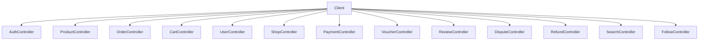
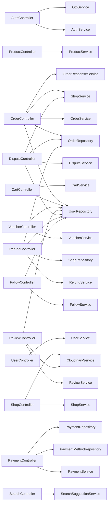

# API Reference Documentation

<cite>
**Referenced Files in This Document**
- [BackendApplication.java](file://src/backend/src/main/java/com/shoppeclone/backend/BackendApplication.java)
- [AuthController.java](file://src/backend/src/main/java/com/shoppeclone/backend/auth/controller/AuthController.java)
- [ProductController.java](file://src/backend/src/main/java/com/shoppeclone/backend/product/controller/ProductController.java)
- [OrderController.java](file://src/backend/src/main/java/com/shoppeclone/backend/order/controller/OrderController.java)
- [CartController.java](file://src/backend/src/main/java/com/shoppeclone/backend/cart/controller/CartController.java)
- [AdminUserController.java](file://src/backend/src/main/java/com/shoppeclone/backend/admin/controller/AdminUserController.java)
- [PaymentController.java](file://src/backend/src/main/java/com/shoppeclone/backend/payment/controller/PaymentController.java)
- [VoucherController.java](file://src/backend/src/main/java/com/shoppeclone/backend/promotion/controller/VoucherController.java)
- [DisputeController.java](file://src/backend/src/main/java/com/shoppeclone/backend/dispute/controller/DisputeController.java)
- [RefundController.java](file://src/backend/src/main/java/com/shoppeclone/backend/refund/controller/RefundController.java)
- [ReviewController.java](file://src/backend/src/main/java/com/shoppeclone/backend/review/controller/ReviewController.java)
- [UserController.java](file://src/backend/src/main/java/com/shoppeclone/backend/user/controller/UserController.java)
- [ShopController.java](file://src/backend/src/main/java/com/shoppeclone/backend/shop/controller/ShopController.java)
- [SearchController.java](file://src/backend/src/main/java/com/shoppeclone/backend/search/controller/SearchController.java)
- [FollowController.java](file://src/backend/src/main/java/com/shoppeclone/backend/follow/controller/FollowController.java)
</cite>

## Table of Contents
1. [Introduction](#introduction)
2. [Project Structure](#project-structure)
3. [Core Components](#core-components)
4. [Architecture Overview](#architecture-overview)
5. [Detailed Component Analysis](#detailed-component-analysis)
6. [Dependency Analysis](#dependency-analysis)
7. [Performance Considerations](#performance-considerations)
8. [Troubleshooting Guide](#troubleshooting-guide)
9. [Conclusion](#conclusion)
10. [Appendices](#appendices)

## Introduction
This document provides a comprehensive API reference for the e-commerce platform’s backend. It catalogs all RESTful endpoints grouped by business domain, including HTTP methods, URL patterns, request/response schemas, authentication requirements, parameter validation, error handling strategies, and practical client implementation guidelines. It also covers API versioning considerations, rate limiting recommendations, backwards compatibility, and performance optimization tips.

## Project Structure
The backend is a Spring Boot application exposing REST APIs under the base path /api. Controllers are organized by domain (auth, product, order, cart, user, shop, payment, promotion, review, dispute, refund, search, follow). Each controller exposes endpoints via @RequestMapping and handles authentication via Spring Security.

```mermaid
graph TB
subgraph "Core Application"
BA["BackendApplication.java"]
end
subgraph "Auth"
AC["AuthController.java"]
end
subgraph "Catalog & Products"
PC["ProductController.java"]
end
subgraph "Orders"
OC["OrderController.java"]
end
subgraph "Cart"
CC["CartController.java"]
end
subgraph "Users"
UC["UserController.java"]
end
subgraph "Shops"
SC["ShopController.java"]
end
subgraph "Payments"
PMC["PaymentController.java"]
end
subgraph "Promotions"
VC["VoucherController.java"]
end
subgraph "Reviews"
RVC["ReviewController.java"]
end
subgraph "Disputes"
DSC["DisputeController.java"]
end
subgraph "Refunds"
RFC["RefundController.java"]
end
subgraph "Search"
SRC["SearchController.java"]
end
subgraph "Follow"
FC["FollowController.java"]
end
BA --> AC
BA --> PC
BA --> OC
BA --> CC
BA --> UC
BA --> SC
BA --> PMC
BA --> VC
BA --> RVC
BA --> DSC
BA --> RFC
BA --> SRC
BA --> FC
```

**Diagram sources**
- [BackendApplication.java:1-14](file://src/backend/src/main/java/com/shoppeclone/backend/BackendApplication.java#L1-L14)
- [AuthController.java:22-26](file://src/backend/src/main/java/com/shoppeclone/backend/auth/controller/AuthController.java#L22-L26)
- [ProductController.java:18-22](file://src/backend/src/main/java/com/shoppeclone/backend/product/controller/ProductController.java#L18-L22)
- [OrderController.java:21-24](file://src/backend/src/main/java/com/shoppeclone/backend/order/controller/OrderController.java#L21-L24)
- [CartController.java:13-16](file://src/backend/src/main/java/com/shoppeclone/backend/cart/controller/CartController.java#L13-L16)
- [UserController.java:15-18](file://src/backend/src/main/java/com/shoppeclone/backend/user/controller/UserController.java#L15-L18)
- [ShopController.java:22-26](file://src/backend/src/main/java/com/shoppeclone/backend/shop/controller/ShopController.java#L22-L26)
- [PaymentController.java:18-21](file://src/backend/src/main/java/com/shoppeclone/backend/payment/controller/PaymentController.java#L18-L21)
- [VoucherController.java:15-18](file://src/backend/src/main/java/com/shoppeclone/backend/promotion/controller/VoucherController.java#L15-L18)
- [ReviewController.java:24-27](file://src/backend/src/main/java/com/shoppeclone/backend/review/controller/ReviewController.java#L24-L27)
- [DisputeController.java:24-27](file://src/backend/src/main/java/com/shoppeclone/backend/dispute/controller/DisputeController.java#L24-L27)
- [RefundController.java:22-25](file://src/backend/src/main/java/com/shoppeclone/backend/refund/controller/RefundController.java#L22-L25)
- [SearchController.java:9-13](file://src/backend/src/main/java/com/shoppeclone/backend/search/controller/SearchController.java#L9-L13)
- [FollowController.java:14-17](file://src/backend/src/main/java/com/shoppeclone/backend/follow/controller/FollowController.java#L14-L17)

**Section sources**
- [BackendApplication.java:1-14](file://src/backend/src/main/java/com/shoppeclone/backend/BackendApplication.java#L1-L14)

## Core Components
- Base path: /api
- Cross-origin allowance: Enabled for most controllers via @CrossOrigin(origins = "*")
- Authentication: Primarily via Spring Security with @AuthenticationPrincipal and @PreAuthorize annotations on selected endpoints
- Validation: DTOs validated via @Valid on request bodies and parameters
- Error handling: Exceptions thrown by controllers propagate to a global exception handler (GlobalExceptionHandler.java) configured elsewhere in the project

Key authentication patterns:
- Endpoints requiring login: Many endpoints annotated with @AuthenticationPrincipal UserDetails or Authentication
- Administrative endpoints: Some endpoints use @PreAuthorize("hasRole('ADMIN')") or similar checks
- Public endpoints: Registration, login, suggestions, and some read-only endpoints

**Section sources**
- [AuthController.java:31-98](file://src/backend/src/main/java/com/shoppeclone/backend/auth/controller/AuthController.java#L31-L98)
- [AdminUserController.java:28-111](file://src/backend/src/main/java/com/shoppeclone/backend/admin/controller/AdminUserController.java#L28-L111)
- [UserController.java:23-96](file://src/backend/src/main/java/com/shoppeclone/backend/user/controller/UserController.java#L23-L96)
- [ShopController.java:110-149](file://src/backend/src/main/java/com/shoppeclone/backend/shop/controller/ShopController.java#L110-L149)

## Architecture Overview
The API follows a layered architecture:
- Controllers expose endpoints and delegate to services
- Services encapsulate business logic
- Repositories/data access is handled by Spring Data repositories
- Security filters enforce JWT-based authentication and authorization

**Diagram sources**
- [AuthController.java:22-26](file://src/backend/src/main/java/com/shoppeclone/backend/auth/controller/AuthController.java#L22-L26)
- [ProductController.java:18-22](file://src/backend/src/main/java/com/shoppeclone/backend/product/controller/ProductController.java#L18-L22)
- [OrderController.java:21-24](file://src/backend/src/main/java/com/shoppeclone/backend/order/controller/OrderController.java#L21-L24)
- [CartController.java:13-16](file://src/backend/src/main/java/com/shoppeclone/backend/cart/controller/CartController.java#L13-L16)
- [UserController.java:15-18](file://src/backend/src/main/java/com/shoppeclone/backend/user/controller/UserController.java#L15-L18)
- [ShopController.java:22-26](file://src/backend/src/main/java/com/shoppeclone/backend/shop/controller/ShopController.java#L22-L26)
- [PaymentController.java:18-21](file://src/backend/src/main/java/com/shoppeclone/backend/payment/controller/PaymentController.java#L18-L21)
- [VoucherController.java:15-18](file://src/backend/src/main/java/com/shoppeclone/backend/promotion/controller/VoucherController.java#L15-L18)
- [ReviewController.java:24-27](file://src/backend/src/main/java/com/shoppeclone/backend/review/controller/ReviewController.java#L24-L27)
- [DisputeController.java:24-27](file://src/backend/src/main/java/com/shoppeclone/backend/dispute/controller/DisputeController.java#L24-L27)
- [RefundController.java:22-25](file://src/backend/src/main/java/com/shoppeclone/backend/refund/controller/RefundController.java#L22-L25)
- [SearchController.java:9-13](file://src/backend/src/main/java/com/shoppeclone/backend/search/controller/SearchController.java#L9-L13)
- [FollowController.java:14-17](file://src/backend/src/main/java/com/shoppeclone/backend/follow/controller/FollowController.java#L14-L17)

## Detailed Component Analysis

### Authentication and Authorization
- Purpose: User registration, login, token refresh/logout, OTP/email verification, and password reset
- Base path: /api/auth
- Authentication: None for registration/login; JWT required for protected endpoints
- Key endpoints:
  - GET /api/auth/me
  - POST /api/auth/register
  - POST /api/auth/login
  - POST /api/auth/refresh-token
  - POST /api/auth/logout
  - POST /api/auth/send-otp
  - POST /api/auth/verify-otp
  - POST /api/auth/check-reset-otp
  - POST /api/auth/forgot-password
  - POST /api/auth/verify-otp-reset-password

Common request/response schemas:
- Register/Login requests: DTOs for email/password and optional metadata
- OTP requests: email/code pairs
- Refresh token: expects Refresh-Token header
- Responses: typically AuthResponse with tokens and UserDto

Authentication requirements:
- Protected endpoints require a valid JWT in the Authorization header
- Logout requires Refresh-Token header
- OTP endpoints operate independently of JWT

Validation and errors:
- @Valid enforces DTO constraints
- Password confirmation mismatch triggers explicit error
- Missing/invalid headers or tokens result in unauthorized/unauthorized responses

Client implementation guidelines:
- Store access/refresh tokens securely
- Use Refresh-Token header for refresh and logout
- Implement OTP flow before password reset

**Section sources**
- [AuthController.java:31-98](file://src/backend/src/main/java/com/shoppeclone/backend/auth/controller/AuthController.java#L31-L98)

### Catalog and Products
- Purpose: Product lifecycle, variants, categories, images, and search
- Base path: /api/products
- Authentication: Required for write/update/delete; read endpoints often public
- Key endpoints:
  - POST /api/products
  - GET /api/products/{id}
  - GET /api/products/shop/{shopId}?includeHidden={bool}
  - GET /api/products?sort={field}
  - GET /api/products/search?keyword={term}
  - GET /api/products/flash-sale
  - GET /api/products/category/{categoryId}
  - PUT /api/products/{id}
  - DELETE /api/products/{id}
  - PATCH /api/products/{id} (partial status/flash-sale toggles)
  - POST /api/products/{productId}/variants
  - DELETE /api/products/variants/{variantId}
  - GET /api/products/variant/{variantId}
  - PATCH /api/products/variant/{variantId}/stock?stock={int}
  - POST /api/products/{productId}/categories/{categoryId}
  - DELETE /api/products/{productId}/categories/{categoryId}
  - POST /api/products/{productId}/images
  - DELETE /api/products/images/{imageId}

Request/response schemas:
- Create/Update requests: DTOs for product metadata, pricing, inventory
- Variants: CreateProductVariantRequest bound to productId
- Categories: Add/remove endpoints accept categoryId
- Images: Request body contains imageUrl string

Validation and errors:
- Path variables validated implicitly by Spring
- Stock updates accept integer stock parameter
- Status updates accept enum-like strings mapped to ProductStatus

Client implementation guidelines:
- Use includeHidden flag to fetch drafts for shop owners
- Apply category filters for targeted browsing
- Batch update stock via PATCH endpoint

**Section sources**
- [ProductController.java:26-162](file://src/backend/src/main/java/com/shoppeclone/backend/product/controller/ProductController.java#L26-L162)

### Orders
- Purpose: Place orders, manage order lifecycle, cancellation, shipment tracking
- Base path: /api/orders
- Authentication: Required for all endpoints
- Key endpoints:
  - POST /api/orders
  - GET /api/orders
  - DELETE /api/orders
  - GET /api/orders/{orderId}
  - PUT /api/orders/{orderId}/status?status={enum}
  - POST /api/orders/{orderId}/cancel
  - PUT /api/orders/{orderId}/shipping?trackingCode={str}&providerId={str}
  - GET /api/orders/shop/{shopId}?status={enum}

Authorization:
- Sellers can update status and shipment for orders belonging to their shop
- Buyers can cancel orders if eligible
- Access to order details validated against ownership or shop ownership

Request/response schemas:
- OrderRequest: payload for placing orders
- OrderResponse: enriched with review info and order metadata
- Status enum: OrderStatus values
- Shipment params: tracking code and provider id

Validation and errors:
- Serialization logging included for debugging
- Forbidden responses when user lacks permission
- Validation enforced via DTOs and enum parsing

Client implementation guidelines:
- Ensure order eligibility before cancellation
- Use shop-specific endpoints for seller dashboards
- Validate order ownership before accessing sensitive details

**Section sources**
- [OrderController.java:37-174](file://src/backend/src/main/java/com/shoppeclone/backend/order/controller/OrderController.java#L37-L174)

### Shopping Cart
- Purpose: Manage cart contents per user
- Base path: /api/cart
- Authentication: Required
- Key endpoints:
  - GET /api/cart
  - POST /api/cart/add?variantId={id}&quantity={int}
  - PUT /api/cart/update?variantId={id}&quantity={int}
  - DELETE /api/cart/remove?variantId={id}
  - DELETE /api/cart/clear

Request/response schemas:
- CartResponse: current cart state
- Quantities must be positive integers

Validation and errors:
- Variant existence and stock constraints enforced by service layer
- Unauthorized if user not authenticated

Client implementation guidelines:
- Sync frontend cart with server after mutations
- Clear cart upon successful checkout

**Section sources**
- [CartController.java:27-64](file://src/backend/src/main/java/com/shoppeclone/backend/cart/controller/CartController.java#L27-L64)

### Users
- Purpose: Profile management, address CRUD, password change, admin promotion
- Base path: /api/user
- Authentication: Required for user endpoints; admin promotion is public
- Key endpoints:
  - GET /api/user/profile
  - PUT /api/user/profile
  - PUT /api/user/change-password
  - GET /api/user/addresses
  - POST /api/user/addresses
  - PUT /api/user/addresses/{addressId}
  - DELETE /api/user/addresses/{addressId}
  - POST /api/user/promote?email={email}&roleName={role}

Request/response schemas:
- UpdateProfileRequest, ChangePasswordRequest, AddressRequest DTOs
- AddressDto for responses

Validation and errors:
- DTO validation via @Valid
- Admin promotion endpoint operates without JWT

Client implementation guidelines:
- Enforce client-side validation for passwords and addresses
- Use separate endpoints for profile vs. addresses

**Section sources**
- [UserController.java:29-95](file://src/backend/src/main/java/com/shoppeclone/backend/user/controller/UserController.java#L29-L95)

### Shops
- Purpose: Shop registration, management, and admin moderation
- Base path: /api/shop
- Authentication: Mostly requires login; admin endpoints require @PreAuthorize
- Key endpoints:
  - POST /api/shop/upload-id-card
  - POST /api/shop/register
  - GET /api/shop/my-shop
  - GET /api/shop/{id}
  - PUT /api/shop/my-shop
  - GET /api/shop/admin/pending
  - GET /api/shop/admin/active
  - GET /api/shop/admin/rejected
  - POST /api/shop/admin/approve/{shopId}
  - POST /api/shop/admin/reject/{shopId}?reason={str}
  - DELETE /api/shop/admin/delete/{id}

Request/response schemas:
- ShopRegisterRequest, UpdateShopRequest
- Admin responses for shop listings

Validation and errors:
- Type validation for ID card upload ("front"|"back")
- Unauthorized if not authenticated
- Admin endpoints guarded by role checks

Client implementation guidelines:
- Upload ID card images to Cloudinary and pass URLs during registration
- Use admin endpoints for moderation workflows

**Section sources**
- [ShopController.java:75-149](file://src/backend/src/main/java/com/shoppeclone/backend/shop/controller/ShopController.java#L75-L149)

### Payments
- Purpose: Initiate payments and query payment methods
- Base path: /api/payments
- Authentication: Not enforced in controller; intended for internal or client usage
- Key endpoints:
  - POST /api/payments
  - GET /api/payments/methods
  - GET /api/payments/order/{orderId}
  - POST /api/payments/{paymentId}/status?status={str}

Request/response schemas:
- CreatePaymentRequest: orderId, paymentMethod
- PaymentMethod list response
- Redirect URL placeholder (null allowed for COD)

Validation and errors:
- Required fields enforced; payment method lookup via repository
- Existing payments reused by orderId

Client implementation guidelines:
- Use payment methods endpoint to present options
- Treat redirectUrl as optional for COD

**Section sources**
- [PaymentController.java:27-73](file://src/backend/src/main/java/com/shoppeclone/backend/payment/controller/PaymentController.java#L27-L73)

### Promotions (Vouchers)
- Purpose: Voucher listing, usage tracking, creation
- Base path: /api/vouchers
- Authentication: Required for user-specific endpoints
- Key endpoints:
  - GET /api/vouchers
  - GET /api/vouchers/used-codes
  - POST /api/vouchers
  - GET /api/vouchers/code/{code}

Request/response schemas:
- Voucher entity for creation and retrieval
- Used codes list for authenticated user

Validation and errors:
- User lookup via email; unauthorized if missing
- Not found if code does not exist

Client implementation guidelines:
- Filter vouchers by usage eligibility
- Cache used codes per session

**Section sources**
- [VoucherController.java:23-44](file://src/backend/src/main/java/com/shoppeclone/backend/promotion/controller/VoucherController.java#L23-L44)

### Reviews
- Purpose: Product and shop reviews, replies, ratings
- Base path: /api/reviews
- Authentication: Required for write/update/delete; public read endpoints
- Key endpoints:
  - POST /api/reviews
  - POST /api/reviews/upload-image
  - GET /api/reviews/product/{productId}
  - GET /api/reviews/user/{userId}
  - GET /api/reviews/{id}
  - PUT /api/reviews/{id}
  - DELETE /api/reviews/{id}
  - GET /api/reviews/product/{productId}/average-rating
  - GET /api/reviews/can-review?orderId={id}&productId={id}
  - GET /api/reviews/reviewable-orders
  - GET /api/reviews/shop/{shopId}
  - POST /api/reviews/{id}/reply

Request/response schemas:
- CreateReviewRequest, UpdateReviewRequest
- ReviewResponse for listings
- Reply payload with replyComment

Validation and errors:
- Seller-only replies; shop ownership validated
- Unauthorized if not authenticated
- Empty reply comment rejected

Client implementation guidelines:
- Use can-review endpoint to gate review UI
- Enforce seller permissions for replies

**Section sources**
- [ReviewController.java:44-188](file://src/backend/src/main/java/com/shoppeclone/backend/review/controller/ReviewController.java#L44-L188)

### Disputes
- Purpose: Customer-initiated disputes and evidence upload
- Base path: /api/disputes
- Authentication: Required; access controlled by order ownership or admin role
- Key endpoints:
  - POST /api/disputes
  - POST /api/disputes/{id}/images
  - GET /api/disputes/{id}
  - GET /api/disputes/{id}/images
  - GET /api/disputes/order/{orderId}

Request/response schemas:
- CreateDisputeRequest, UploadDisputeImageRequest
- Dispute and DisputeImage entities

Validation and errors:
- Access control ensures only authorized parties can view
- Not found if order/dispute missing
- Forbidden if lacking permission

Client implementation guidelines:
- Attach images with signed URLs from Cloudinary
- Respect access control when rendering dispute UI

**Section sources**
- [DisputeController.java:76-129](file://src/backend/src/main/java/com/shoppeclone/backend/dispute/controller/DisputeController.java#L76-L129)

### Refunds
- Purpose: Buyer-initiated refund requests and admin access
- Base path: /api/refunds
- Authentication: Required; access depends on ownership, admin, or shop ownership
- Key endpoints:
  - POST /api/refunds/{orderId}/request
  - GET /api/refunds/{orderId}

Request/response schemas:
- RequestRefundRequest with optional amount and reason
- Refund entity

Validation and errors:
- Only COMPLETED orders eligible
- Ownership and role checks enforced
- Bad request for invalid states

Client implementation guidelines:
- Pre-validate order status before showing refund UI
- Allow partial refunds via amount parameter

**Section sources**
- [RefundController.java:48-101](file://src/backend/src/main/java/com/shoppeclone/backend/refund/controller/RefundController.java#L48-L101)

### Search Suggestions
- Purpose: Homepage search suggestions mixing products, categories, keywords, and attributes
- Base path: /api/search
- Authentication: Not required
- Key endpoints:
  - GET /api/search/suggestions?keyword={term}&limit={int}

Request/response schemas:
- SearchSuggestionResponse with mixed suggestion types
- Limit clamped between 1 and 20

Validation and errors:
- Safe limit enforcement
- Not authenticated; public endpoint

Client implementation guidelines:
- Debounce user input and cap limit
- Render mixed suggestion types accordingly

**Section sources**
- [SearchController.java:29-36](file://src/backend/src/main/java/com/shoppeclone/backend/search/controller/SearchController.java#L29-L36)

### Following Shops
- Purpose: Follow/unfollow shops and follower analytics
- Base path: /api/follow
- Authentication: Required
- Key endpoints:
  - POST /api/follow/{shopId}
  - GET /api/follow/check/{shopId}
  - GET /api/follow/count/{shopId}
  - GET /api/follow/shop/{shopId}/list

Request/response schemas:
- Toggle returns isFollowing and message
- Check returns isFollowing boolean
- Count returns follower count
- List returns followers

Validation and errors:
- Unauthorized if not authenticated
- User lookup via email

Client implementation guidelines:
- Update UI immediately after toggle
- Use count/list for analytics dashboards

**Section sources**
- [FollowController.java:21-61](file://src/backend/src/main/java/com/shoppeclone/backend/follow/controller/FollowController.java#L21-L61)

### Admin Users
- Purpose: Admin-managed user listing, creation, updates, toggling status, and role updates
- Base path: /api/admin/users
- Authentication: Admin-only endpoints guarded by @PreAuthorize
- Key endpoints:
  - GET /api/admin/users?page={int}&size={int}&search={str}&role={str}
  - GET /api/admin/users/{id}
  - POST /api/admin/users
  - PUT /api/admin/users/{id}
  - DELETE /api/admin/users/{id}
  - PATCH /api/admin/users/{id}/status
  - PATCH /api/admin/users/{id}/roles

Request/response schemas:
- AdminUserRequest for create/update
- UpdateRolesRequest for role updates
- AdminUserResponse and UserListResponse

Validation and errors:
- Pagination defaults applied
- Role updates restricted to admins

Client implementation guidelines:
- Paginate and filter server-side
- Enforce admin-only UI for these endpoints

**Section sources**
- [AdminUserController.java:29-110](file://src/backend/src/main/java/com/shoppeclone/backend/admin/controller/AdminUserController.java#L29-L110)

## Dependency Analysis
Controllers depend on services and repositories. There is no cross-controller coupling visible in the examined files; each controller is self-contained with minimal interdependencies.

**Diagram sources**
- [AuthController.java:28-29](file://src/backend/src/main/java/com/shoppeclone/backend/auth/controller/AuthController.java#L28-L29)
- [ProductController.java:24](file://src/backend/src/main/java/com/shoppeclone/backend/product/controller/ProductController.java#L24)
- [OrderController.java:26-29](file://src/backend/src/main/java/com/shoppeclone/backend/order/controller/OrderController.java#L26-L29)
- [CartController.java:18-19](file://src/backend/src/main/java/com/shoppeclone/backend/cart/controller/CartController.java#L18-L19)
- [UserController.java:21](file://src/backend/src/main/java/com/shoppeclone/backend/user/controller/UserController.java#L21)
- [ShopController.java:28-29](file://src/backend/src/main/java/com/shoppeclone/backend/shop/controller/ShopController.java#L28-L29)
- [PaymentController.java:23-25](file://src/backend/src/main/java/com/shoppeclone/backend/payment/controller/PaymentController.java#L23-L25)
- [VoucherController.java:20-21](file://src/backend/src/main/java/com/shoppeclone/backend/promotion/controller/VoucherController.java#L20-L21)
- [ReviewController.java:29-32](file://src/backend/src/main/java/com/shoppeclone/backend/review/controller/ReviewController.java#L29-L32)
- [DisputeController.java:29-32](file://src/backend/src/main/java/com/shoppeclone/backend/dispute/controller/DisputeController.java#L29-L32)
- [RefundController.java:27-30](file://src/backend/src/main/java/com/shoppeclone/backend/refund/controller/RefundController.java#L27-L30)
- [SearchController.java:15](file://src/backend/src/main/java/com/shoppeclone/backend/search/controller/SearchController.java#L15)
- [FollowController.java:18-19](file://src/backend/src/main/java/com/shoppeclone/backend/follow/controller/FollowController.java#L18-L19)

**Section sources**
- [AuthController.java:28-29](file://src/backend/src/main/java/com/shoppeclone/backend/auth/controller/AuthController.java#L28-L29)
- [ProductController.java:24](file://src/backend/src/main/java/com/shoppeclone/backend/product/controller/ProductController.java#L24)
- [OrderController.java:26-29](file://src/backend/src/main/java/com/shoppeclone/backend/order/controller/OrderController.java#L26-L29)
- [CartController.java:18-19](file://src/backend/src/main/java/com/shoppeclone/backend/cart/controller/CartController.java#L18-L19)
- [UserController.java:21](file://src/backend/src/main/java/com/shoppeclone/backend/user/controller/UserController.java#L21)
- [ShopController.java:28-29](file://src/backend/src/main/java/com/shoppeclone/backend/shop/controller/ShopController.java#L28-L29)
- [PaymentController.java:23-25](file://src/backend/src/main/java/com/shoppeclone/backend/payment/controller/PaymentController.java#L23-L25)
- [VoucherController.java:20-21](file://src/backend/src/main/java/com/shoppeclone/backend/promotion/controller/VoucherController.java#L20-L21)
- [ReviewController.java:29-32](file://src/backend/src/main/java/com/shoppeclone/backend/review/controller/ReviewController.java#L29-L32)
- [DisputeController.java:29-32](file://src/backend/src/main/java/com/shoppeclone/backend/dispute/controller/DisputeController.java#L29-L32)
- [RefundController.java:27-30](file://src/backend/src/main/java/com/shoppeclone/backend/refund/controller/RefundController.java#L27-L30)
- [SearchController.java:15](file://src/backend/src/main/java/com/shoppeclone/backend/search/controller/SearchController.java#L15)
- [FollowController.java:18-19](file://src/backend/src/main/java/com/shoppeclone/backend/follow/controller/FollowController.java#L18-L19)

## Performance Considerations
- Pagination: Use page/size parameters on admin/user endpoints to avoid large payloads
- Filtering: Apply filters (role, status, category) to reduce dataset size
- Caching: Cache product lists, categories, and search suggestions where appropriate
- Bulk operations: Prefer batch endpoints (e.g., stock updates) over repeated single-item calls
- Serialization: Avoid unnecessary serialization in hot paths; log only for debugging
- Rate limiting: Implement per-IP or per-user limits for OTP/email endpoints
- CORS: Cross-origin enabled globally; restrict origins in production environments

[No sources needed since this section provides general guidance]

## Troubleshooting Guide
Common issues and resolutions:
- Unauthorized access: Ensure valid JWT in Authorization header; verify token freshness
- Forbidden access: Confirm user ownership or admin/seller permissions for protected endpoints
- Validation failures: Check @Valid DTO constraints; ensure required fields are present
- Serialization errors: Review object composition and Jackson modules; avoid circular references
- Missing user: Controllers resolve user by email; ensure user exists and is active
- Payment method not found: Verify paymentMethod code exists in PaymentMethodRepository

**Section sources**
- [OrderController.java:98-114](file://src/backend/src/main/java/com/shoppeclone/backend/order/controller/OrderController.java#L98-L114)
- [RefundController.java:60-68](file://src/backend/src/main/java/com/shoppeclone/backend/refund/controller/RefundController.java#L60-L68)
- [DisputeController.java:47-70](file://src/backend/src/main/java/com/shoppeclone/backend/dispute/controller/DisputeController.java#L47-L70)
- [ReviewController.java:176-183](file://src/backend/src/main/java/com/shoppeclone/backend/review/controller/ReviewController.java#L176-L183)

## Conclusion
This API reference documents the e-commerce platform’s REST endpoints across authentication, catalog, orders, cart, users, shops, payments, promotions, reviews, disputes, refunds, search, and follow domains. It emphasizes authentication, validation, error handling, and client implementation best practices. For production deployments, add rate limiting, stricter CORS policies, and comprehensive monitoring.

[No sources needed since this section summarizes without analyzing specific files]

## Appendices

### Endpoint Categorization by Business Domain and Access Permissions
- Authentication
  - Public: /api/auth/register, /api/auth/login
  - Protected: /api/auth/me, /api/auth/refresh-token, /api/auth/logout
  - OTP: /api/auth/send-otp, /api/auth/verify-otp, /api/auth/check-reset-otp, /api/auth/forgot-password, /api/auth/verify-otp-reset-password
- Catalog and Products
  - Public: GET /api/products/search, /api/products/flash-sale, /api/products/category/{categoryId}, GET variants/images
  - Protected: Write/update/delete endpoints
- Orders
  - All endpoints protected; seller/admin access controlled by ownership and roles
- Cart
  - All endpoints protected
- Users
  - All endpoints protected except admin promotion
- Shops
  - Public: upload-id-card, register, my-shop, shop details
  - Admin-only: pending/active/rejected lists and moderation actions
- Payments
  - Public: methods, order lookup, status updates
- Promotions
  - Public: list, code lookup; protected: used-codes, create
- Reviews
  - Public: read; protected: create/update/delete, replies
- Disputes
  - Protected: create, upload images, read by order/dispute
- Refunds
  - Protected: request, read by owner/admin/seller
- Search
  - Public: suggestions
- Follow
  - Protected: toggle/check/count/list

**Section sources**
- [AuthController.java:36-98](file://src/backend/src/main/java/com/shoppeclone/backend/auth/controller/AuthController.java#L36-L98)
- [ProductController.java:48-162](file://src/backend/src/main/java/com/shoppeclone/backend/product/controller/ProductController.java#L48-L162)
- [OrderController.java:37-174](file://src/backend/src/main/java/com/shoppeclone/backend/order/controller/OrderController.java#L37-L174)
- [CartController.java:27-64](file://src/backend/src/main/java/com/shoppeclone/backend/cart/controller/CartController.java#L27-L64)
- [UserController.java:29-95](file://src/backend/src/main/java/com/shoppeclone/backend/user/controller/UserController.java#L29-L95)
- [ShopController.java:75-149](file://src/backend/src/main/java/com/shoppeclone/backend/shop/controller/ShopController.java#L75-L149)
- [PaymentController.java:27-73](file://src/backend/src/main/java/com/shoppeclone/backend/payment/controller/PaymentController.java#L27-L73)
- [VoucherController.java:23-44](file://src/backend/src/main/java/com/shoppeclone/backend/promotion/controller/VoucherController.java#L23-L44)
- [ReviewController.java:44-188](file://src/backend/src/main/java/com/shoppeclone/backend/review/controller/ReviewController.java#L44-L188)
- [DisputeController.java:76-129](file://src/backend/src/main/java/com/shoppeclone/backend/dispute/controller/DisputeController.java#L76-L129)
- [RefundController.java:48-101](file://src/backend/src/main/java/com/shoppeclone/backend/refund/controller/RefundController.java#L48-L101)
- [SearchController.java:29-36](file://src/backend/src/main/java/com/shoppeclone/backend/search/controller/SearchController.java#L29-L36)
- [FollowController.java:21-61](file://src/backend/src/main/java/com/shoppeclone/backend/follow/controller/FollowController.java#L21-L61)

### API Versioning, Rate Limiting, and Backwards Compatibility
- Versioning: No explicit version prefix observed; consider adding /v1 prefix for future-proofing
- Rate limiting: Implement per-endpoint limits for OTP/email endpoints
- Backwards compatibility: Maintain stable field names and statuses; deprecate fields with care

[No sources needed since this section provides general guidance]