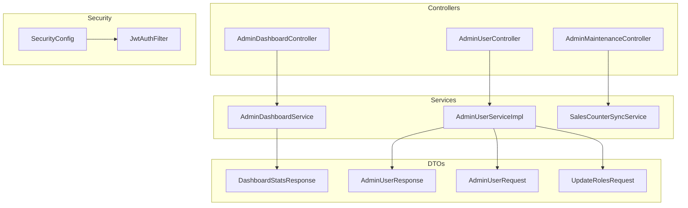
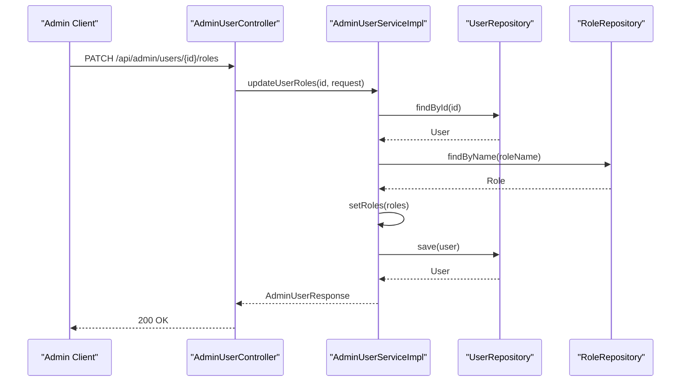
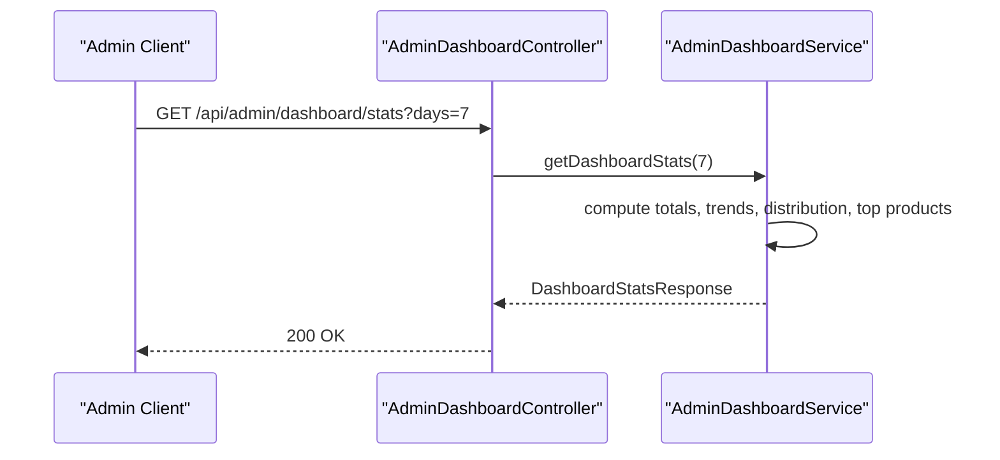
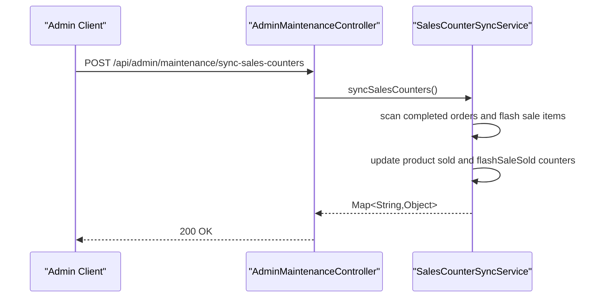
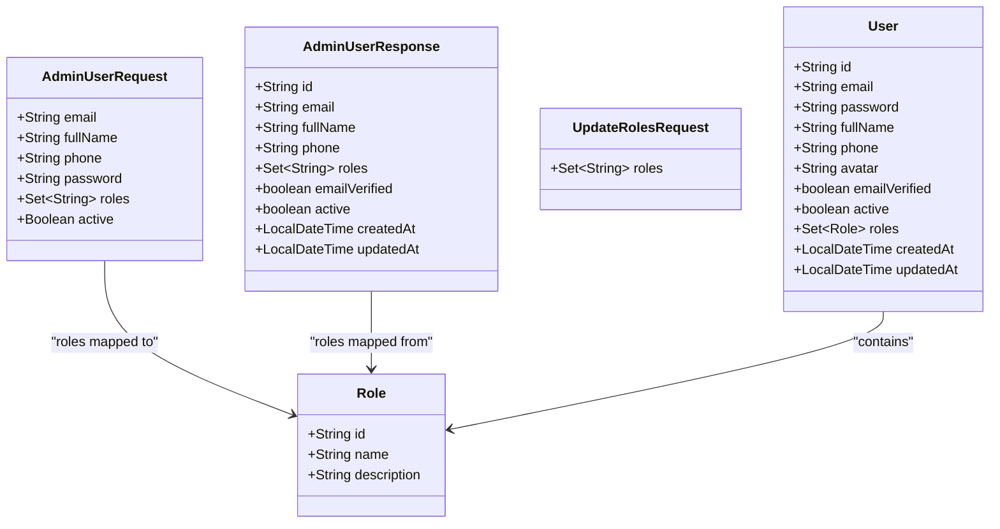
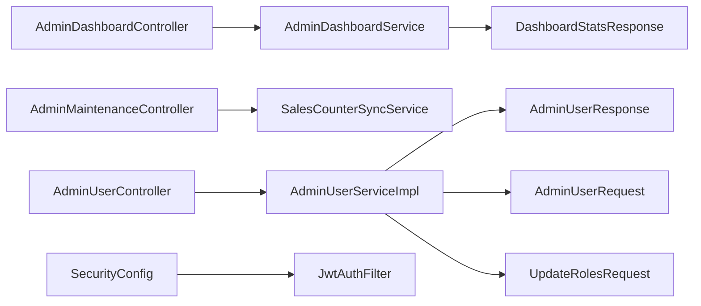

# Admin Panel API

<cite>
**Referenced Files in This Document**
- [AdminDashboardController.java](file://src/Backend/src/main/java/com/shoppeclone/backend/admin/controller/AdminDashboardController.java)
- [AdminMaintenanceController.java](file://src/Backend/src/main/java/com/shoppeclone/backend/admin/controller/AdminMaintenanceController.java)
- [AdminUserController.java](file://src/Backend/src/main/java/com/shoppeclone/backend/admin/controller/AdminUserController.java)
- [AdminDashboardService.java](file://src/Backend/src/main/java/com/shoppeclone/backend/admin/service/AdminDashboardService.java)
- [AdminUserService.java](file://src/Backend/src/main/java/com/shoppeclone/backend/admin/service/AdminUserService.java)
- [SalesCounterSyncService.java](file://src/Backend/src/main/java/com/shoppeclone/backend/admin/service/SalesCounterSyncService.java)
- [AdminUserServiceImpl.java](file://src/Backend/src/main/java/com/shoppeclone/backend/admin/service/impl/AdminUserServiceImpl.java)
- [DashboardStatsResponse.java](file://src/Backend/src/main/java/com/shoppeclone/backend/admin/dto/response/DashboardStatsResponse.java)
- [AdminUserResponse.java](file://src/Backend/src/main/java/com/shoppeclone/backend/admin/dto/response/AdminUserResponse.java)
- [AdminUserRequest.java](file://src/Backend/src/main/java/com/shoppeclone/backend/admin/dto/request/AdminUserRequest.java)
- [UpdateRolesRequest.java](file://src/Backend/src/main/java/com/shoppeclone/backend/admin/dto/request/UpdateRolesRequest.java)
- [User.java](file://src/Backend/src/main/java/com/shoppeclone/backend/auth/model/User.java)
- [Role.java](file://src/Backend/src/main/java/com/shoppeclone/backend/auth/model/Role.java)
- [SecurityConfig.java](file://src/Backend/src/main/java/com/shoppeclone/backend/auth/security/SecurityConfig.java)
- [JwtAuthFilter.java](file://src/Backend/src/main/java/com/shoppeclone/backend/auth/security/JwtAuthFilter.java)
- [admin-dashboard.html](file://src/Frontend/admin-dashboard.html)
</cite>

## Table of Contents
1. [Introduction](#introduction)
2. [Project Structure](#project-structure)
3. [Core Components](#core-components)
4. [Architecture Overview](#architecture-overview)
5. [Detailed Component Analysis](#detailed-component-analysis)
6. [Dependency Analysis](#dependency-analysis)
7. [Performance Considerations](#performance-considerations)
8. [Troubleshooting Guide](#troubleshooting-guide)
9. [Conclusion](#conclusion)
10. [Appendices](#appendices)

## Introduction
This document provides comprehensive API documentation for the Admin Panel, covering administrative controls, system maintenance, user management, and dashboard analytics. It documents the following endpoints:
- Admin dashboard analytics: GET /api/admin/dashboard/stats
- System maintenance: POST /api/admin/maintenance/sync-sales-counters
- User management: GET, POST, PUT, DELETE, PATCH /api/admin/users and PATCH /api/admin/users/{id}/roles
- System monitoring: GET /api/admin/stats (conceptual, see Monitoring section)

It also explains admin authentication and permissions, outlines request/response schemas for AdminUserRequest, DashboardStatsResponse, and AdminUserResponse, and provides practical examples for dashboard access, user administration, maintenance tasks, and analytics reporting.

## Project Structure
The Admin Panel API is implemented in the backend module under the com.shoppeclone.backend package. Controllers expose REST endpoints, services encapsulate business logic, and DTOs define request/response schemas. Security is enforced via Spring Security with JWT-based method-level authorization.

**Diagram sources**
- [AdminDashboardController.java:10-21](file://src/Backend/src/main/java/com/shoppeclone/backend/admin/controller/AdminDashboardController.java#L10-L21)
- [AdminMaintenanceController.java:14-25](file://src/Backend/src/main/java/com/shoppeclone/backend/admin/controller/AdminMaintenanceController.java#L14-L25)
- [AdminUserController.java:18-111](file://src/Backend/src/main/java/com/shoppeclone/backend/admin/controller/AdminUserController.java#L18-L111)
- [AdminDashboardService.java:31-100](file://src/Backend/src/main/java/com/shoppeclone/backend/admin/service/AdminDashboardService.java#L31-L100)
- [AdminUserServiceImpl.java:190-200](file://src/Backend/src/main/java/com/shoppeclone/backend/admin/service/impl/AdminUserServiceImpl.java#L190-L200)
- [SalesCounterSyncService.java:39-131](file://src/Backend/src/main/java/com/shoppeclone/backend/admin/service/SalesCounterSyncService.java#L39-L131)
- [DashboardStatsResponse.java:11-43](file://src/Backend/src/main/java/com/shoppeclone/backend/admin/dto/response/DashboardStatsResponse.java#L11-L43)
- [AdminUserResponse.java:12-22](file://src/Backend/src/main/java/com/shoppeclone/backend/admin/dto/response/AdminUserResponse.java#L12-L22)
- [AdminUserRequest.java:7-14](file://src/Backend/src/main/java/com/shoppeclone/backend/admin/dto/request/AdminUserRequest.java#L7-L14)
- [UpdateRolesRequest.java:7-9](file://src/Backend/src/main/java/com/shoppeclone/backend/admin/dto/request/UpdateRolesRequest.java#L7-L9)
- [SecurityConfig.java:27-80](file://src/Backend/src/main/java/com/shoppeclone/backend/auth/security/SecurityConfig.java#L27-L80)
- [JwtAuthFilter.java](file://src/Backend/src/main/java/com/shoppeclone/backend/auth/security/JwtAuthFilter.java)

**Section sources**
- [AdminDashboardController.java:10-21](file://src/Backend/src/main/java/com/shoppeclone/backend/admin/controller/AdminDashboardController.java#L10-L21)
- [AdminMaintenanceController.java:14-25](file://src/Backend/src/main/java/com/shoppeclone/backend/admin/controller/AdminMaintenanceController.java#L14-L25)
- [AdminUserController.java:18-111](file://src/Backend/src/main/java/com/shoppeclone/backend/admin/controller/AdminUserController.java#L18-L111)
- [SecurityConfig.java:27-80](file://src/Backend/src/main/java/com/shoppeclone/backend/auth/security/SecurityConfig.java#L27-L80)

## Core Components
- AdminDashboardController: Exposes GET /api/admin/dashboard/stats to retrieve dashboard analytics.
- AdminMaintenanceController: Exposes POST /api/admin/maintenance/sync-sales-counters for system maintenance tasks.
- AdminUserController: Exposes CRUD and role/status management endpoints for users.
- AdminDashboardService: Computes totals, trends, distributions, and top products for the dashboard.
- AdminUserServiceImpl: Implements user management operations and role updates.
- SalesCounterSyncService: Synchronizes sales counters across products and variants.
- DTOs: Define request/response schemas for admin operations.

**Section sources**
- [AdminDashboardController.java:17-20](file://src/Backend/src/main/java/com/shoppeclone/backend/admin/controller/AdminDashboardController.java#L17-L20)
- [AdminMaintenanceController.java:21-24](file://src/Backend/src/main/java/com/shoppeclone/backend/admin/controller/AdminMaintenanceController.java#L21-L24)
- [AdminUserController.java:29-110](file://src/Backend/src/main/java/com/shoppeclone/backend/admin/controller/AdminUserController.java#L29-L110)
- [AdminDashboardService.java:40-100](file://src/Backend/src/main/java/com/shoppeclone/backend/admin/service/AdminDashboardService.java#L40-L100)
- [AdminUserServiceImpl.java:177-200](file://src/Backend/src/main/java/com/shoppeclone/backend/admin/service/impl/AdminUserServiceImpl.java#L177-L200)
- [SalesCounterSyncService.java:40-131](file://src/Backend/src/main/java/com/shoppeclone/backend/admin/service/SalesCounterSyncService.java#L40-L131)

## Architecture Overview
The Admin Panel API follows a layered architecture:
- Presentation Layer: Controllers handle HTTP requests and return ResponseEntity objects.
- Application Layer: Services encapsulate business logic and coordinate repositories.
- Persistence Layer: Repositories access MongoDB collections for users, shops, disputes, products, and flash sale entities.
- Security Layer: JWT-based authentication and method-level authorization enforce admin-only access for sensitive endpoints.

**Diagram sources**
- [AdminUserController.java:103-110](file://src/Backend/src/main/java/com/shoppeclone/backend/admin/controller/AdminUserController.java#L103-L110)
- [AdminUserServiceImpl.java:190-200](file://src/Backend/src/main/java/com/shoppeclone/backend/admin/service/impl/AdminUserServiceImpl.java#L190-L200)
- [User.java](file://src/Backend/src/main/java/com/shoppeclone/backend/auth/model/User.java#L30)
- [Role.java](file://src/Backend/src/main/java/com/shoppeclone/backend/auth/model/Role.java#L15)

**Section sources**
- [AdminUserController.java:103-110](file://src/Backend/src/main/java/com/shoppeclone/backend/admin/controller/AdminUserController.java#L103-L110)
- [AdminUserServiceImpl.java:190-200](file://src/Backend/src/main/java/com/shoppeclone/backend/admin/service/impl/AdminUserServiceImpl.java#L190-L200)
- [User.java](file://src/Backend/src/main/java/com/shoppeclone/backend/auth/model/User.java#L30)
- [Role.java](file://src/Backend/src/main/java/com/shoppeclone/backend/auth/model/Role.java#L15)

## Detailed Component Analysis

### Admin Dashboard Analytics
- Endpoint: GET /api/admin/dashboard/stats
- Description: Returns aggregated statistics including totals, operational summaries, trend data, user distribution, and top-selling products.
- Query Parameters:
  - days (integer, optional): 0 for yesterday, 1 for today hourly trend, >1 for multi-day daily trend.
- Response Schema: DashboardStatsResponse
  - Fields include totalUsers, activeShops, pendingShops, rejectedShops, totalOrders, totalGMV, totalDisputes, activeFlashSales, pendingFlashRegistrations, approvedFlashSaleItems, upcomingFlashSales, urgentActionsCount, openDisputes, pendingRegs, userTrend, shopTrend, disputeTrend, flashSaleTrend, distribution, and topProducts.

**Diagram sources**
- [AdminDashboardController.java:17-20](file://src/Backend/src/main/java/com/shoppeclone/backend/admin/controller/AdminDashboardController.java#L17-L20)
- [AdminDashboardService.java:40-100](file://src/Backend/src/main/java/com/shoppeclone/backend/admin/service/AdminDashboardService.java#L40-L100)
- [DashboardStatsResponse.java:11-43](file://src/Backend/src/main/java/com/shoppeclone/backend/admin/dto/response/DashboardStatsResponse.java#L11-L43)

**Section sources**
- [AdminDashboardController.java:17-20](file://src/Backend/src/main/java/com/shoppeclone/backend/admin/controller/AdminDashboardController.java#L17-L20)
- [AdminDashboardService.java:40-100](file://src/Backend/src/main/java/com/shoppeclone/backend/admin/service/AdminDashboardService.java#L40-L100)
- [DashboardStatsResponse.java:11-43](file://src/Backend/src/main/java/com/shoppeclone/backend/admin/dto/response/DashboardStatsResponse.java#L11-L43)

### System Maintenance
- Endpoint: POST /api/admin/maintenance/sync-sales-counters
- Description: Synchronizes sales counters for products and variants by scanning completed orders and flash sale items.
- Authorization: Requires ADMIN role.
- Response: JSON map containing success flag, counts of scanned/updated entities, and sync timestamp.

**Diagram sources**
- [AdminMaintenanceController.java:21-24](file://src/Backend/src/main/java/com/shoppeclone/backend/admin/controller/AdminMaintenanceController.java#L21-L24)
- [SalesCounterSyncService.java:40-131](file://src/Backend/src/main/java/com/shoppeclone/backend/admin/service/SalesCounterSyncService.java#L40-L131)

**Section sources**
- [AdminMaintenanceController.java:21-24](file://src/Backend/src/main/java/com/shoppeclone/backend/admin/controller/AdminMaintenanceController.java#L21-L24)
- [SalesCounterSyncService.java:40-131](file://src/Backend/src/main/java/com/shoppeclone/backend/admin/service/SalesCounterSyncService.java#L40-L131)

### User Management
- Endpoints:
  - GET /api/admin/users?page=&size=&search=&role=
  - GET /api/admin/users/{id}
  - POST /api/admin/users
  - PUT /api/admin/users/{id}
  - DELETE /api/admin/users/{id}
  - PATCH /api/admin/users/{id}/status
  - PATCH /api/admin/users/{id}/roles
- Authorization: Method-level @PreAuthorize("hasRole('ADMIN')") on maintenance endpoint; user management endpoints are commented out in current implementation but designed to require ADMIN.
- Request/Response Schemas:
  - AdminUserRequest: email, fullName, phone, password (optional), roles, active
  - AdminUserResponse: id, email, fullName, phone, roles, emailVerified, active, createdAt, updatedAt
  - UpdateRolesRequest: roles

**Diagram sources**
- [AdminUserRequest.java:7-14](file://src/Backend/src/main/java/com/shoppeclone/backend/admin/dto/request/AdminUserRequest.java#L7-L14)
- [AdminUserResponse.java:12-22](file://src/Backend/src/main/java/com/shoppeclone/backend/admin/dto/response/AdminUserResponse.java#L12-L22)
- [UpdateRolesRequest.java:7-9](file://src/Backend/src/main/java/com/shoppeclone/backend/admin/dto/request/UpdateRolesRequest.java#L7-L9)
- [User.java:15-38](file://src/Backend/src/main/java/com/shoppeclone/backend/auth/model/User.java#L15-L38)
- [Role.java:10-18](file://src/Backend/src/main/java/com/shoppeclone/backend/auth/model/Role.java#L10-L18)

**Section sources**
- [AdminUserController.java:29-110](file://src/Backend/src/main/java/com/shoppeclone/backend/admin/controller/AdminUserController.java#L29-L110)
- [AdminUserRequest.java:7-14](file://src/Backend/src/main/java/com/shoppeclone/backend/admin/dto/request/AdminUserRequest.java#L7-L14)
- [AdminUserResponse.java:12-22](file://src/Backend/src/main/java/com/shoppeclone/backend/admin/dto/response/AdminUserResponse.java#L12-L22)
- [UpdateRolesRequest.java:7-9](file://src/Backend/src/main/java/com/shoppeclone/backend/admin/dto/request/UpdateRolesRequest.java#L7-L9)
- [User.java:15-38](file://src/Backend/src/main/java/com/shoppeclone/backend/auth/model/User.java#L15-L38)
- [Role.java:10-18](file://src/Backend/src/main/java/com/shoppeclone/backend/auth/model/Role.java#L10-L18)

### System Monitoring
- Conceptual Endpoint: GET /api/admin/stats
- Description: Provides system health and metrics. Current implementation focuses on dashboard analytics and maintenance; monitoring can be extended to include health checks and performance metrics.
- Implementation Notes: Can leverage existing security filters and repositories to gather system state.

[No sources needed since this section provides conceptual guidance]

## Dependency Analysis
The Admin Panel API exhibits strong separation of concerns:
- Controllers depend on services for business logic.
- Services depend on repositories for persistence.
- DTOs decouple request/response structures from domain models.
- Security configuration enforces JWT-based authentication and method-level authorization.

**Diagram sources**
- [AdminDashboardController.java:10-21](file://src/Backend/src/main/java/com/shoppeclone/backend/admin/controller/AdminDashboardController.java#L10-L21)
- [AdminMaintenanceController.java:14-25](file://src/Backend/src/main/java/com/shoppeclone/backend/admin/controller/AdminMaintenanceController.java#L14-L25)
- [AdminUserController.java:18-111](file://src/Backend/src/main/java/com/shoppeclone/backend/admin/controller/AdminUserController.java#L18-L111)
- [AdminDashboardService.java:31-100](file://src/Backend/src/main/java/com/shoppeclone/backend/admin/service/AdminDashboardService.java#L31-L100)
- [AdminUserServiceImpl.java:190-200](file://src/Backend/src/main/java/com/shoppeclone/backend/admin/service/impl/AdminUserServiceImpl.java#L190-L200)
- [SalesCounterSyncService.java:39-131](file://src/Backend/src/main/java/com/shoppeclone/backend/admin/service/SalesCounterSyncService.java#L39-L131)
- [DashboardStatsResponse.java:11-43](file://src/Backend/src/main/java/com/shoppeclone/backend/admin/dto/response/DashboardStatsResponse.java#L11-L43)
- [AdminUserResponse.java:12-22](file://src/Backend/src/main/java/com/shoppeclone/backend/admin/dto/response/AdminUserResponse.java#L12-L22)
- [AdminUserRequest.java:7-14](file://src/Backend/src/main/java/com/shoppeclone/backend/admin/dto/request/AdminUserRequest.java#L7-L14)
- [UpdateRolesRequest.java:7-9](file://src/Backend/src/main/java/com/shoppeclone/backend/admin/dto/request/UpdateRolesRequest.java#L7-L9)
- [SecurityConfig.java:27-80](file://src/Backend/src/main/java/com/shoppeclone/backend/auth/security/SecurityConfig.java#L27-L80)
- [JwtAuthFilter.java](file://src/Backend/src/main/java/com/shoppeclone/backend/auth/security/JwtAuthFilter.java)

**Section sources**
- [AdminDashboardController.java:10-21](file://src/Backend/src/main/java/com/shoppeclone/backend/admin/controller/AdminDashboardController.java#L10-L21)
- [AdminMaintenanceController.java:14-25](file://src/Backend/src/main/java/com/shoppeclone/backend/admin/controller/AdminMaintenanceController.java#L14-L25)
- [AdminUserController.java:18-111](file://src/Backend/src/main/java/com/shoppeclone/backend/admin/controller/AdminUserController.java#L18-L111)
- [SecurityConfig.java:27-80](file://src/Backend/src/main/java/com/shoppeclone/backend/auth/security/SecurityConfig.java#L27-L80)

## Performance Considerations
- Dashboard analytics queries aggregate counts and trends; consider caching frequently accessed totals and distributing heavy computations during off-peak hours.
- User listing endpoints support pagination and filtering; ensure proper indexing on search and role fields to optimize query performance.
- Sales counter synchronization scans large datasets; batch updates and transaction boundaries should be tuned for throughput and consistency.

[No sources needed since this section provides general guidance]

## Troubleshooting Guide
Common issues and resolutions:
- Authentication failures: Ensure the Authorization header contains a valid Bearer token and the token is not expired.
- Authorization errors: Verify the user has the ADMIN role for endpoints requiring elevated permissions.
- User deletion restrictions: Deleting the last ADMIN user is prevented; ensure at least one ADMIN exists before attempting deletion.
- Maintenance task failures: Confirm database connectivity and that related entities (orders, flash sale items) are present for accurate synchronization.

**Section sources**
- [SecurityConfig.java:27-80](file://src/Backend/src/main/java/com/shoppeclone/backend/auth/security/SecurityConfig.java#L27-L80)
- [AdminUserServiceImpl.java:163-175](file://src/Backend/src/main/java/com/shoppeclone/backend/admin/service/impl/AdminUserServiceImpl.java#L163-L175)

## Conclusion
The Admin Panel API provides a robust foundation for administrative oversight, user management, and system maintenance. With JWT-based authentication, method-level authorization, and well-defined DTOs, it supports secure and scalable operations. Extending monitoring capabilities and optimizing analytics queries will further enhance system reliability and performance.

## Appendices

### API Reference

- GET /api/admin/dashboard/stats
  - Query: days (integer)
  - Response: DashboardStatsResponse
  - Example: [admin-dashboard.html:2054-2062](file://src/Frontend/admin-dashboard.html#L2054-L2062)

- POST /api/admin/maintenance/sync-sales-counters
  - Response: Map<String,Object> with success, counts, and syncedAt
  - Authorization: ADMIN

- GET /api/admin/users
  - Query: page, size, search, role
  - Response: UserListResponse (schema defined in service interface)

- GET /api/admin/users/{id}
  - Path: id
  - Response: AdminUserResponse

- POST /api/admin/users
  - Body: AdminUserRequest
  - Response: AdminUserResponse

- PUT /api/admin/users/{id}
  - Path: id
  - Body: AdminUserRequest
  - Response: AdminUserResponse

- DELETE /api/admin/users/{id}
  - Path: id
  - Response: Map with message

- PATCH /api/admin/users/{id}/status
  - Path: id
  - Response: AdminUserResponse

- PATCH /api/admin/users/{id}/roles
  - Path: id
  - Body: UpdateRolesRequest
  - Response: AdminUserResponse

### Request/Response Schemas

- AdminUserRequest
  - Fields: email, fullName, phone, password, roles, active
  - Reference: [AdminUserRequest.java:7-14](file://src/Backend/src/main/java/com/shoppeclone/backend/admin/dto/request/AdminUserRequest.java#L7-L14)

- DashboardStatsResponse
  - Fields: totals, operational summaries, trend lists, distribution, topProducts
  - Reference: [DashboardStatsResponse.java:11-43](file://src/Backend/src/main/java/com/shoppeclone/backend/admin/dto/response/DashboardStatsResponse.java#L11-L43)

- AdminUserResponse
  - Fields: id, email, fullName, phone, roles, emailVerified, active, createdAt, updatedAt
  - Reference: [AdminUserResponse.java:12-22](file://src/Backend/src/main/java/com/shoppeclone/backend/admin/dto/response/AdminUserResponse.java#L12-L22)

### Examples

- Admin dashboard access
  - Fetch dashboard stats with a Bearer token:
    - [admin-dashboard.html:2054-2062](file://src/Frontend/admin-dashboard.html#L2054-L2062)

- User management operations
  - Create user: POST /api/admin/users with AdminUserRequest body
  - Update roles: PATCH /api/admin/users/{id}/roles with UpdateRolesRequest body
  - Toggle status: PATCH /api/admin/users/{id}/status
  - Delete user: DELETE /api/admin/users/{id}

- System maintenance tasks
  - Sync sales counters: POST /api/admin/maintenance/sync-sales-counters

- Analytics reporting
  - Retrieve aggregated stats: GET /api/admin/dashboard/stats?days={n}

**Section sources**
- [AdminUserRequest.java:7-14](file://src/Backend/src/main/java/com/shoppeclone/backend/admin/dto/request/AdminUserRequest.java#L7-L14)
- [DashboardStatsResponse.java:11-43](file://src/Backend/src/main/java/com/shoppeclone/backend/admin/dto/response/DashboardStatsResponse.java#L11-L43)
- [AdminUserResponse.java:12-22](file://src/Backend/src/main/java/com/shoppeclone/backend/admin/dto/response/AdminUserResponse.java#L12-L22)
- [admin-dashboard.html:2054-2062](file://src/Frontend/admin-dashboard.html#L2054-L2062)