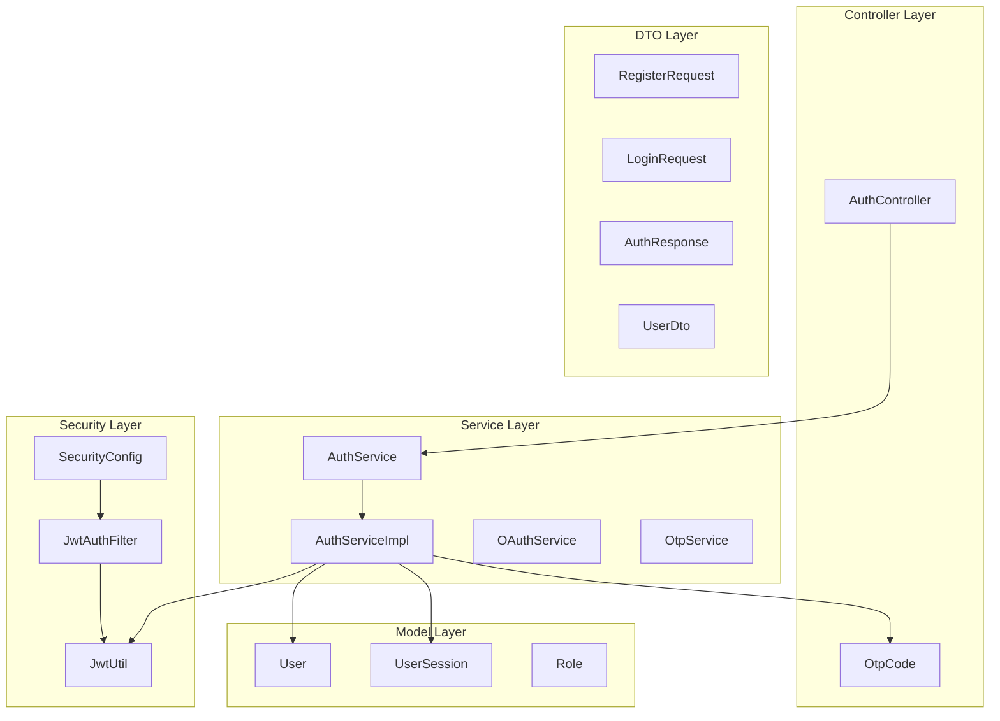
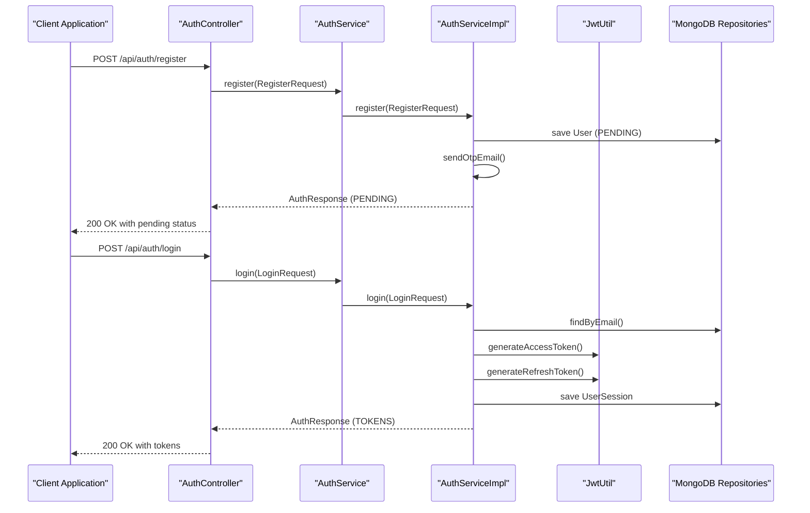
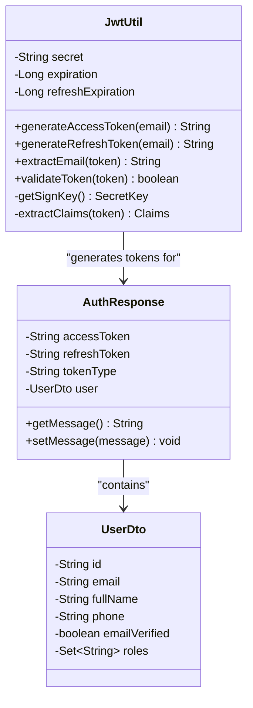
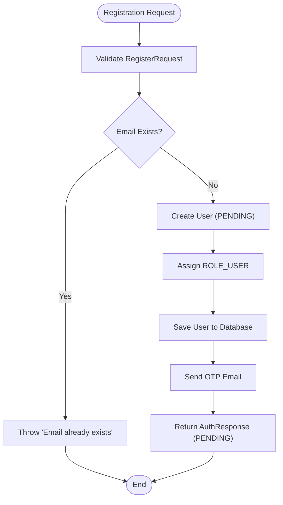
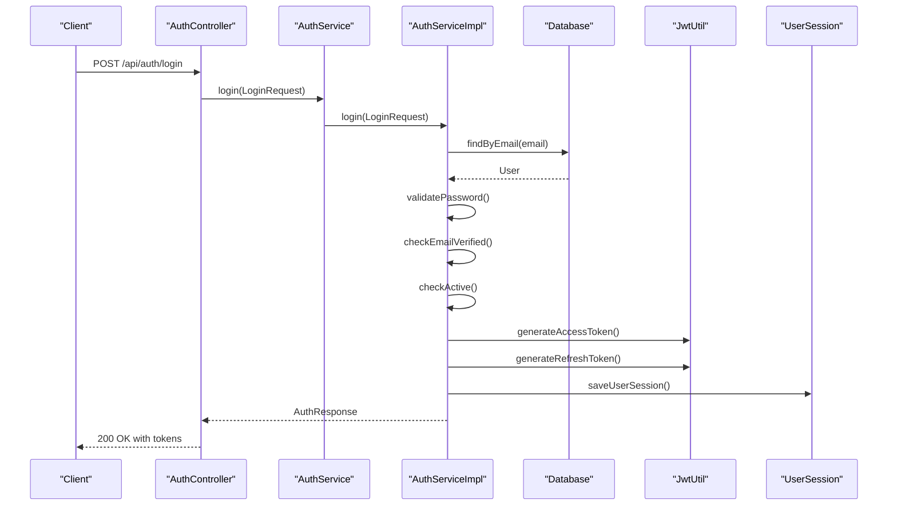
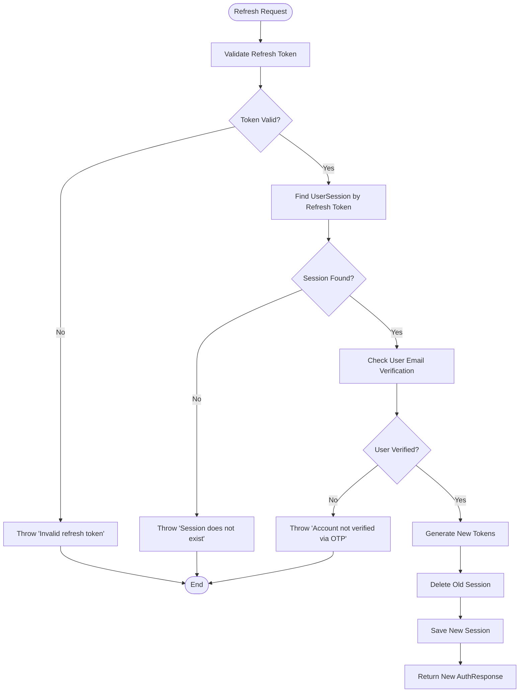
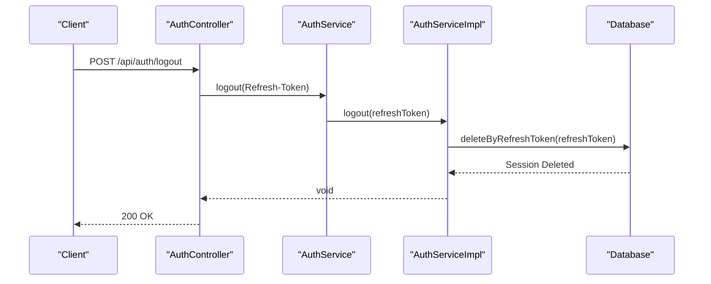
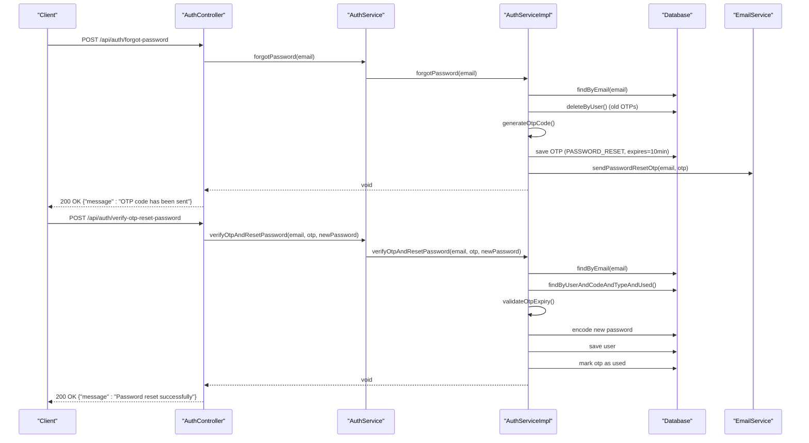
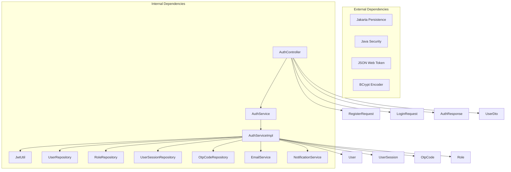

# Authentication API

<cite>
**Referenced Files in This Document**
- [AuthController.java](file://src/backend/src/main/java/com/shoppeclone/backend/auth/controller/AuthController.java)
- [AuthService.java](file://src/backend/src/main/java/com/shoppeclone/backend/auth/service/AuthService.java)
- [AuthServiceImpl.java](file://src/backend/src/main/java/com/shoppeclone/backend/auth/service/impl/AuthServiceImpl.java)
- [RegisterRequest.java](file://src/backend/src/main/java/com/shoppeclone/backend/auth/dto/request/RegisterRequest.java)
- [LoginRequest.java](file://src/backend/src/main/java/com/shoppeclone/backend/auth/dto/request/LoginRequest.java)
- [ForgotPasswordRequest.java](file://src/backend/src/main/java/com/shoppeclone/backend/auth/dto/request/ForgotPasswordRequest.java)
- [VerifyOtpAndResetPasswordRequest.java](file://src/backend/src/main/java/com/shoppeclone/backend/auth/dto/request/VerifyOtpAndResetPasswordRequest.java)
- [VerifyOtpRequest.java](file://src/backend/src/main/java/com/shoppeclone/backend/auth/dto/request/VerifyOtpRequest.java)
- [SendOtpRequest.java](file://src/backend/src/main/java/com/shoppeclone/backend/auth/dto/request/SendOtpRequest.java)
- [AuthResponse.java](file://src/backend/src/main/java/com/shoppeclone/backend/auth/dto/response/AuthResponse.java)
- [UserDto.java](file://src/backend/src/main/java/com/shoppeclone/backend/auth/dto/response/UserDto.java)
- [JwtUtil.java](file://src/backend/src/main/java/com/shoppeclone/backend/auth/security/JwtUtil.java)
- [SecurityConfig.java](file://src/backend/src/main/java/com/shoppeclone/backend/auth/security/SecurityConfig.java)
- [User.java](file://src/backend/src/main/java/com/shoppeclone/backend/auth/model/User.java)
- [UserSession.java](file://src/backend/src/main/java/com/shoppeclone/backend/auth/model/UserSession.java)
- [OtpCode.java](file://src/backend/src/main/java/com/shoppeclone/backend/auth/model/OtpCode.java)
- [application.properties](file://src/backend/src/main/resources/application.properties)
</cite>

## Table of Contents
1. [Introduction](#introduction)
2. [Project Structure](#project-structure)
3. [Core Components](#core-components)
4. [Architecture Overview](#architecture-overview)
5. [Detailed Component Analysis](#detailed-component-analysis)
6. [Dependency Analysis](#dependency-analysis)
7. [Performance Considerations](#performance-considerations)
8. [Troubleshooting Guide](#troubleshooting-guide)
9. [Conclusion](#conclusion)

## Introduction
This document provides comprehensive API documentation for the authentication system, covering user registration, login, token refresh, logout, and password reset functionality. It details HTTP methods, URL patterns, request/response schemas, JWT authentication requirements, refresh token handling, OTP verification processes, and error responses. Examples are included for each endpoint with request/response samples, authentication headers, and common error scenarios.

## Project Structure
The authentication module follows a layered architecture:
- Controller layer handles HTTP requests and delegates to services
- Service layer implements business logic and orchestrates repositories
- Model layer defines domain entities and persistence
- DTO layer encapsulates request/response data transfer objects
- Security layer manages JWT configuration and filter chain



**Diagram sources**
- [AuthController.java:22-26](file://src/backend/src/main/java/com/shoppeclone/backend/auth/controller/AuthController.java#L22-L26)
- [AuthService.java:8-21](file://src/backend/src/main/java/com/shoppeclone/backend/auth/service/AuthService.java#L8-L21)
- [AuthServiceImpl.java:31-44](file://src/backend/src/main/java/com/shoppeclone/backend/auth/service/impl/AuthServiceImpl.java#L31-L44)
- [SecurityConfig.java:22-24](file://src/backend/src/main/java/com/shoppeclone/backend/auth/security/SecurityConfig.java#L22-L24)
- [JwtUtil.java:12-12](file://src/backend/src/main/java/com/shoppeclone/backend/auth/security/JwtUtil.java#L12-L12)

**Section sources**
- [AuthController.java:22-26](file://src/backend/src/main/java/com/shoppeclone/backend/auth/controller/AuthController.java#L22-L26)
- [AuthService.java:8-21](file://src/backend/src/main/java/com/shoppeclone/backend/auth/service/AuthService.java#L8-L21)
- [AuthServiceImpl.java:31-44](file://src/backend/src/main/java/com/shoppeclone/backend/auth/service/impl/AuthServiceImpl.java#L31-L44)
- [SecurityConfig.java:22-24](file://src/backend/src/main/java/com/shoppeclone/backend/auth/security/SecurityConfig.java#L22-L24)

## Core Components
The authentication system consists of several key components working together:

### Authentication Endpoints
- **POST /api/auth/register** - User registration with email verification
- **POST /api/auth/login** - User login with JWT token generation
- **POST /api/auth/refresh-token** - Refresh access token using refresh token
- **POST /api/auth/logout** - Logout by invalidating refresh token
- **GET /api/auth/me** - Get current authenticated user profile

### OTP Management Endpoints
- **POST /api/auth/send-otp** - Send OTP verification code to email
- **POST /api/auth/verify-otp** - Verify OTP for email verification
- **POST /api/auth/check-reset-otp** - Validate OTP for password reset
- **POST /api/auth/forgot-password** - Initiate password reset process
- **POST /api/auth/verify-otp-reset-password** - Complete password reset

### Security Configuration
The system uses stateless JWT authentication with custom filter chain configuration that:
- Disables CSRF protection
- Allows public access to authentication endpoints
- Secures all other API endpoints
- Implements CORS configuration
- Uses session management policy STATELESS

**Section sources**
- [AuthController.java:36-97](file://src/backend/src/main/java/com/shoppeclone/backend/auth/controller/AuthController.java#L36-L97)
- [SecurityConfig.java:27-79](file://src/backend/src/main/java/com/shoppeclone/backend/auth/security/SecurityConfig.java#L27-L79)

## Architecture Overview
The authentication architecture implements a clean separation of concerns with clear boundaries between layers:



**Diagram sources**
- [AuthController.java:36-44](file://src/backend/src/main/java/com/shoppeclone/backend/auth/controller/AuthController.java#L36-L44)
- [AuthServiceImpl.java:45-95](file://src/backend/src/main/java/com/shoppeclone/backend/auth/service/impl/AuthServiceImpl.java#L45-L95)
- [AuthServiceImpl.java:97-137](file://src/backend/src/main/java/com/shoppeclone/backend/auth/service/impl/AuthServiceImpl.java#L97-L137)
- [JwtUtil.java:27-43](file://src/backend/src/main/java/com/shoppeclone/backend/auth/security/JwtUtil.java#L27-L43)

## Detailed Component Analysis

### Authentication Controller
The AuthController exposes all authentication endpoints with proper request validation and response handling.

#### Endpoint Definitions
- **GET /api/auth/me** - Requires authentication header
- **POST /api/auth/register** - No authentication required
- **POST /api/auth/login** - No authentication required  
- **POST /api/auth/refresh-token** - Requires Refresh-Token header
- **POST /api/auth/logout** - Requires Refresh-Token header

#### Request Validation
All endpoints use Jakarta Bean Validation for input sanitization:
- Email format validation using `@Email` constraint
- Required field validation using `@NotBlank`
- Password strength validation with regex patterns
- Phone number format validation
- OTP length validation (6 digits)

**Section sources**
- [AuthController.java:31-97](file://src/backend/src/main/java/com/shoppeclone/backend/auth/controller/AuthController.java#L31-L97)
- [RegisterRequest.java:10-23](file://src/backend/src/main/java/com/shoppeclone/backend/auth/dto/request/RegisterRequest.java#L10-L23)
- [LoginRequest.java:9-14](file://src/backend/src/main/java/com/shoppeclone/backend/auth/dto/request/LoginRequest.java#L9-L14)

### JWT Authentication Implementation
The JWT system provides secure stateless authentication with configurable expiration times.

#### Token Generation
- Access tokens: 15-minute expiration
- Refresh tokens: 7-day expiration  
- HS256 signature algorithm
- Subject contains user email

#### Token Validation
- Validates token signature and expiration
- Extracts user email from token payload
- Handles JWT parsing exceptions gracefully



**Diagram sources**
- [JwtUtil.java:12-65](file://src/backend/src/main/java/com/shoppeclone/backend/auth/security/JwtUtil.java#L12-L65)
- [AuthResponse.java](file://src/backend/src/main/java/com/shoppeclone/backend/auth/dto/response/AuthResponse.java)
- [UserDto.java](file://src/backend/src/main/java/com/shoppeclone/backend/auth/dto/response/UserDto.java)

**Section sources**
- [JwtUtil.java:14-43](file://src/backend/src/main/java/com/shoppeclone/backend/auth/security/JwtUtil.java#L14-L43)
- [AuthResponse.java](file://src/backend/src/main/java/com/shoppeclone/backend/auth/dto/response/AuthResponse.java)
- [UserDto.java](file://src/backend/src/main/java/com/shoppeclone/backend/auth/dto/response/UserDto.java)

### User Registration Flow
The registration process implements a two-stage verification system:



**Diagram sources**
- [AuthServiceImpl.java:45-95](file://src/backend/src/main/java/com/shoppeclone/backend/auth/service/impl/AuthServiceImpl.java#L45-L95)

#### Registration Requirements
- Unique email address
- Password minimum 8 characters with uppercase, lowercase, and number
- Full name required
- Phone number format: 10 digits starting with 0

#### Registration Response
The system returns an `AuthResponse` with:
- Null tokens (registration pending)
- User information with `emailVerified = false`
- Message indicating OTP delivery status

**Section sources**
- [AuthServiceImpl.java:45-95](file://src/backend/src/main/java/com/shoppeclone/backend/auth/service/impl/AuthServiceImpl.java#L45-L95)
- [RegisterRequest.java:10-23](file://src/backend/src/main/java/com/shoppeclone/backend/auth/dto/request/RegisterRequest.java#L10-L23)

### Login Process
The login process validates credentials and generates authentication tokens:



**Diagram sources**
- [AuthController.java:41-44](file://src/backend/src/main/java/com/shoppeclone/backend/auth/controller/AuthController.java#L41-L44)
- [AuthServiceImpl.java:97-137](file://src/backend/src/main/java/com/shoppeclone/backend/auth/service/impl/AuthServiceImpl.java#L97-L137)

#### Login Requirements
- Valid email and password combination
- User must have `emailVerified = true`
- User account must be active (`active = true`)

#### Login Response
Returns an `AuthResponse` containing:
- Access token (JWT)
- Refresh token (JWT)  
- Token type ("Bearer")
- Complete user profile

**Section sources**
- [AuthServiceImpl.java:97-137](file://src/backend/src/main/java/com/shoppeclone/backend/auth/service/impl/AuthServiceImpl.java#L97-L137)
- [LoginRequest.java:9-14](file://src/backend/src/main/java/com/shoppeclone/backend/auth/dto/request/LoginRequest.java#L9-L14)

### Token Refresh Mechanism
The refresh token system provides secure token rotation:



**Diagram sources**
- [AuthServiceImpl.java:139-171](file://src/backend/src/main/java/com/shoppeclone/backend/auth/service/impl/AuthServiceImpl.java#L139-L171)

#### Refresh Token Requirements
- Valid JWT format and signature
- Non-expired refresh token
- Existing user session record
- User must be email verified

#### Refresh Response
Returns new access and refresh tokens while maintaining user session continuity.

**Section sources**
- [AuthServiceImpl.java:139-171](file://src/backend/src/main/java/com/shoppeclone/backend/auth/service/impl/AuthServiceImpl.java#L139-L171)

### Logout Process
The logout mechanism invalidates refresh tokens and removes user sessions:



**Diagram sources**
- [AuthController.java:51-55](file://src/backend/src/main/java/com/shoppeclone/backend/auth/controller/AuthController.java#L51-L55)
- [AuthServiceImpl.java:173-178](file://src/backend/src/main/java/com/shoppeclone/backend/auth/service/impl/AuthServiceImpl.java#L173-L178)

#### Logout Behavior
- Deletes the specific refresh token session
- Invalidates future refresh token requests
- Maintains access token validity until expiration

**Section sources**
- [AuthServiceImpl.java:173-178](file://src/backend/src/main/java/com/shoppeclone/backend/auth/service/impl/AuthServiceImpl.java#L173-L178)

### Password Reset Workflow
The password reset system uses OTP verification for security:



**Diagram sources**
- [AuthController.java:78-97](file://src/backend/src/main/java/com/shoppeclone/backend/auth/controller/AuthController.java#L78-L97)
- [AuthServiceImpl.java:210-286](file://src/backend/src/main/java/com/shoppeclone/backend/auth/service/impl/AuthServiceImpl.java#L210-L286)

#### Password Reset Requirements
- Valid email address
- OTP must be exactly 6 digits
- New password must meet strength requirements
- Password confirmation must match new password
- OTP must not be expired (10-minute window)

#### Password Reset Response
Returns success messages for both OTP delivery and password reset completion.

**Section sources**
- [AuthServiceImpl.java:210-286](file://src/backend/src/main/java/com/shoppeclone/backend/auth/service/impl/AuthServiceImpl.java#L210-L286)
- [ForgotPasswordRequest.java:8-13](file://src/backend/src/main/java/com/shoppeclone/backend/auth/dto/request/ForgotPasswordRequest.java#L8-L13)
- [VerifyOtpAndResetPasswordRequest.java:9-26](file://src/backend/src/main/java/com/shoppeclone/backend/auth/dto/request/VerifyOtpAndResetPasswordRequest.java#L9-L26)

### OTP Management System
The OTP system supports both email verification and password reset scenarios:

#### OTP Types
- **EMAIL_VERIFICATION**: Used during registration for initial email verification
- **PASSWORD_RESET**: Used during password reset process

#### OTP Lifecycle
1. Generate 6-digit random code
2. Store with expiration time (10 minutes for password reset)
3. Send via email service
4. Validate on verification attempts
5. Mark as used after successful reset

**Section sources**
- [AuthServiceImpl.java:210-253](file://src/backend/src/main/java/com/shoppeclone/backend/auth/service/impl/AuthServiceImpl.java#L210-L253)
- [AuthServiceImpl.java:255-286](file://src/backend/src/main/java/com/shoppeclone/backend/auth/service/impl/AuthServiceImpl.java#L255-L286)

## Dependency Analysis
The authentication system exhibits strong cohesion within functional areas and loose coupling between layers:



**Diagram sources**
- [AuthController.java:28-29](file://src/backend/src/main/java/com/shoppeclone/backend/auth/controller/AuthController.java#L28-L29)
- [AuthServiceImpl.java:35-43](file://src/backend/src/main/java/com/shoppeclone/backend/auth/service/impl/AuthServiceImpl.java#L35-L43)

### Security Dependencies
The system integrates multiple security components:
- **Spring Security**: Authentication manager and filter chain
- **JWT Library**: Token generation and validation
- **BCrypt**: Password encoding and comparison
- **Custom Filter Chain**: Stateless authentication processing

### Error Handling Dependencies
Centralized error handling through:
- Global exception handler for consistent error responses
- Runtime exceptions for business logic validation
- Proper HTTP status code mapping

**Section sources**
- [AuthServiceImpl.java:35-43](file://src/backend/src/main/java/com/shoppeclone/backend/auth/service/impl/AuthServiceImpl.java#L35-L43)
- [SecurityConfig.java:27-79](file://src/backend/src/main/java/com/shoppeclone/backend/auth/security/SecurityConfig.java#L27-L79)

## Performance Considerations
The authentication system is designed for optimal performance through several mechanisms:

### Token Expiration Strategy
- **Access tokens**: 15-minute lifespan reduces token exposure
- **Refresh tokens**: 7-day validity balances security and usability
- **OTP expiry**: 10-minute timeout for password reset operations

### Database Optimization
- Indexed email field for fast user lookup
- Separate collections for users, sessions, and OTP codes
- Efficient query patterns using findById and findByEmail

### Memory Efficiency
- Stateless JWT implementation eliminates server-side session storage
- Lazy loading of roles and relationships
- Minimal object creation during authentication flow

### Caching Opportunities
- User roles caching could reduce database queries
- OTP validation caching for frequent resets
- Token blacklist caching for logout verification

## Troubleshooting Guide

### Common Authentication Errors

#### Registration Issues
- **Email Already Exists**: Occurs when attempting to register with existing email
- **OTP Delivery Failure**: Registration succeeds but OTP email fails to send

#### Login Problems
- **Invalid Credentials**: Incorrect email/password combination
- **Unverified Account**: User registered but not completed email verification
- **Locked Account**: User account deactivated by administrator

#### Token Management Issues
- **Invalid Refresh Token**: Expired or malformed refresh token
- **Session Not Found**: Refresh token exists but no matching session
- **Account Not Verified**: Attempt to refresh token without email verification

#### Password Reset Failures
- **Invalid OTP**: Wrong or expired OTP code (10-minute window)
- **Password Mismatch**: New password confirmation doesn't match
- **Email Not Found**: Attempted reset for non-existent email address

### Error Response Patterns
All authentication errors return standardized JSON responses:
```json
{
  "timestamp": "2023-01-01T00:00:00Z",
  "status": 400,
  "error": "Bad Request",
  "exception": "RuntimeException",
  "message": "Specific error message",
  "path": "/api/auth/login"
}
```

### Debugging Tips
1. **Enable Logging**: Check server logs for detailed error traces
2. **Validate Inputs**: Ensure all required fields are present and properly formatted
3. **Check Token Headers**: Verify Authorization header format for protected endpoints
4. **Monitor OTP Expiry**: Confirm OTP codes are used within 10-minute window
5. **Verify Database State**: Check user verification status and account activation

**Section sources**
- [AuthServiceImpl.java:50-54](file://src/backend/src/main/java/com/shoppeclone/backend/auth/service/impl/AuthServiceImpl.java#L50-L54)
- [AuthServiceImpl.java:106-116](file://src/backend/src/main/java/com/shoppeclone/backend/auth/service/impl/AuthServiceImpl.java#L106-L116)
- [AuthServiceImpl.java:144-146](file://src/backend/src/main/java/com/shoppeclone/backend/auth/service/impl/AuthServiceImpl.java#L144-L146)
- [AuthServiceImpl.java:265-273](file://src/backend/src/main/java/com/shoppeclone/backend/auth/service/impl/AuthServiceImpl.java#L265-L273)

## Conclusion
The authentication API provides a comprehensive, secure, and user-friendly authentication system with robust JWT-based token management, OTP verification capabilities, and clear error handling. The modular architecture ensures maintainability and extensibility while the stateless design optimizes performance and scalability. The system successfully balances security requirements with user experience through thoughtful token lifecycle management and intuitive verification processes.