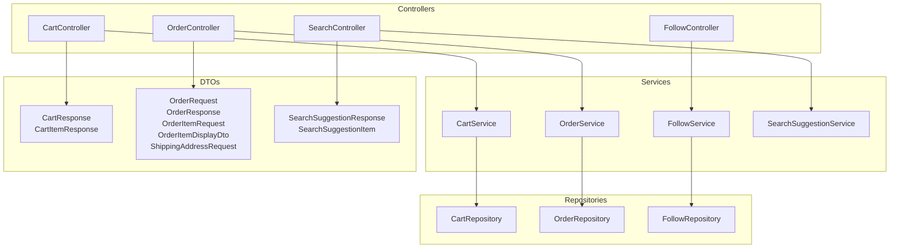
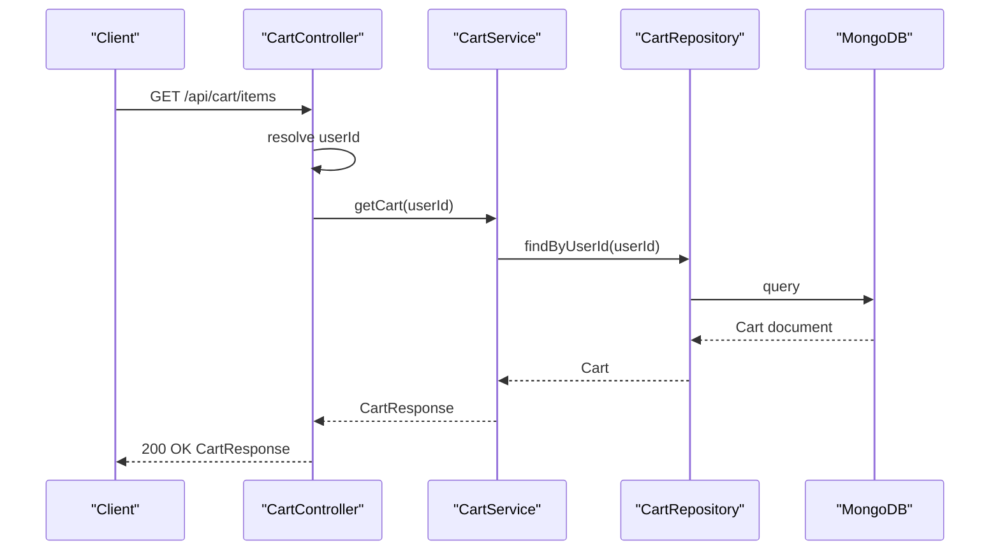
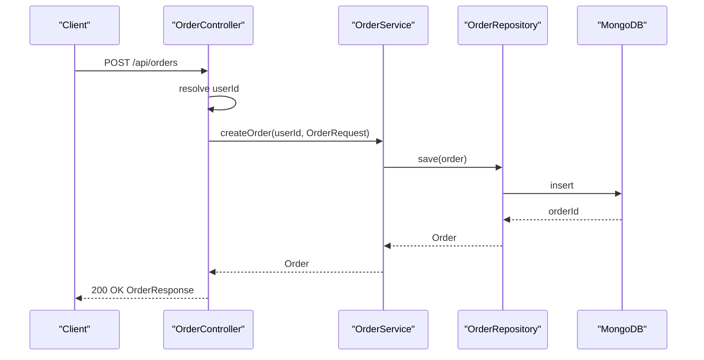
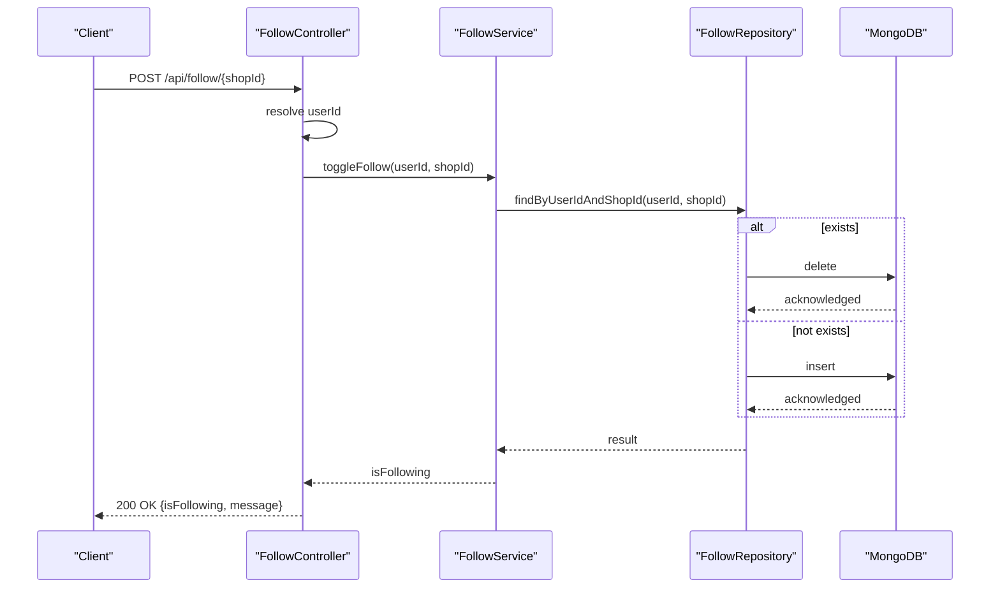
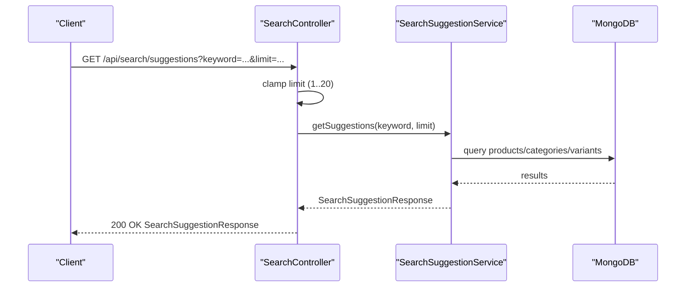
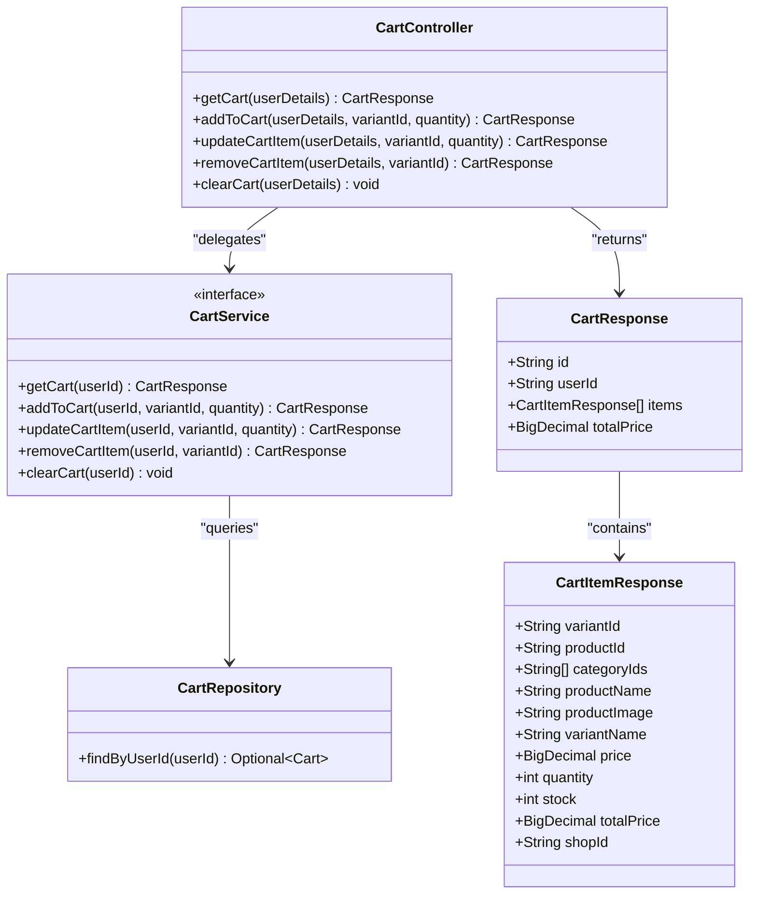
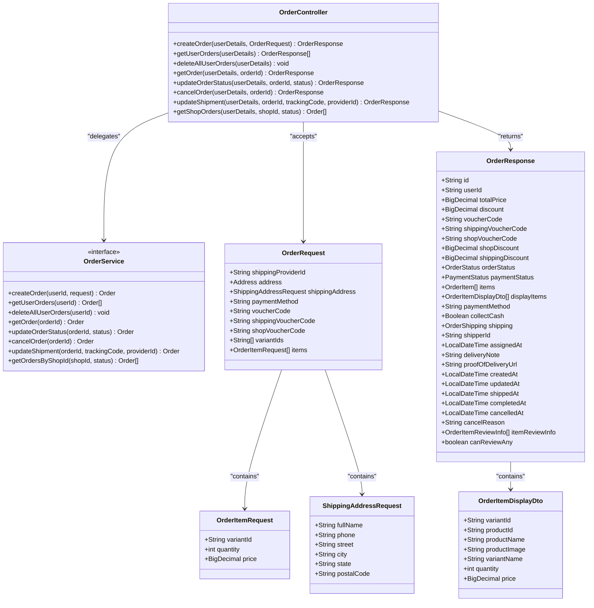
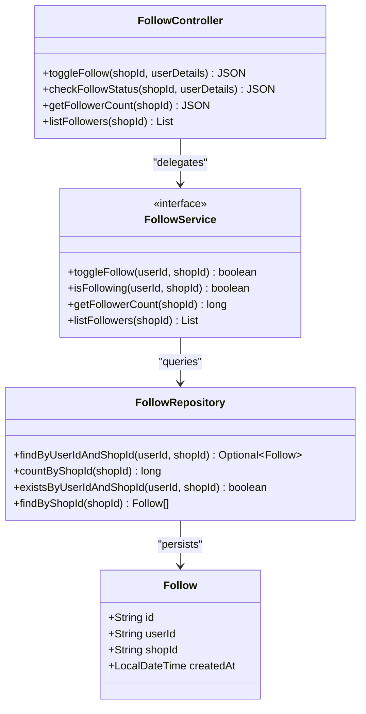
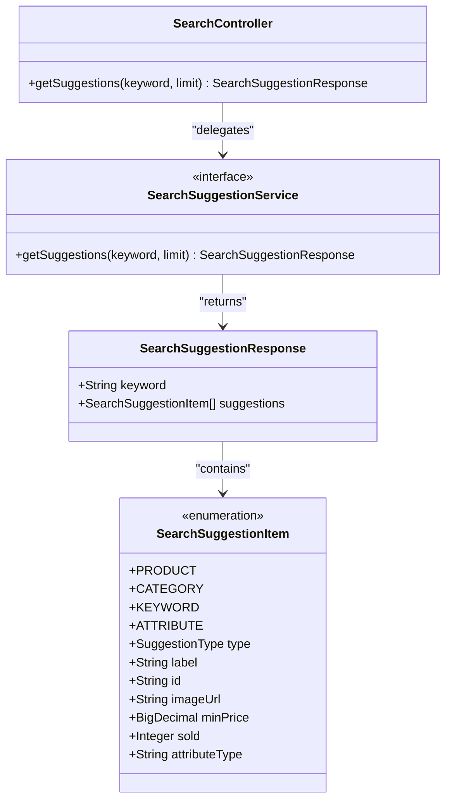
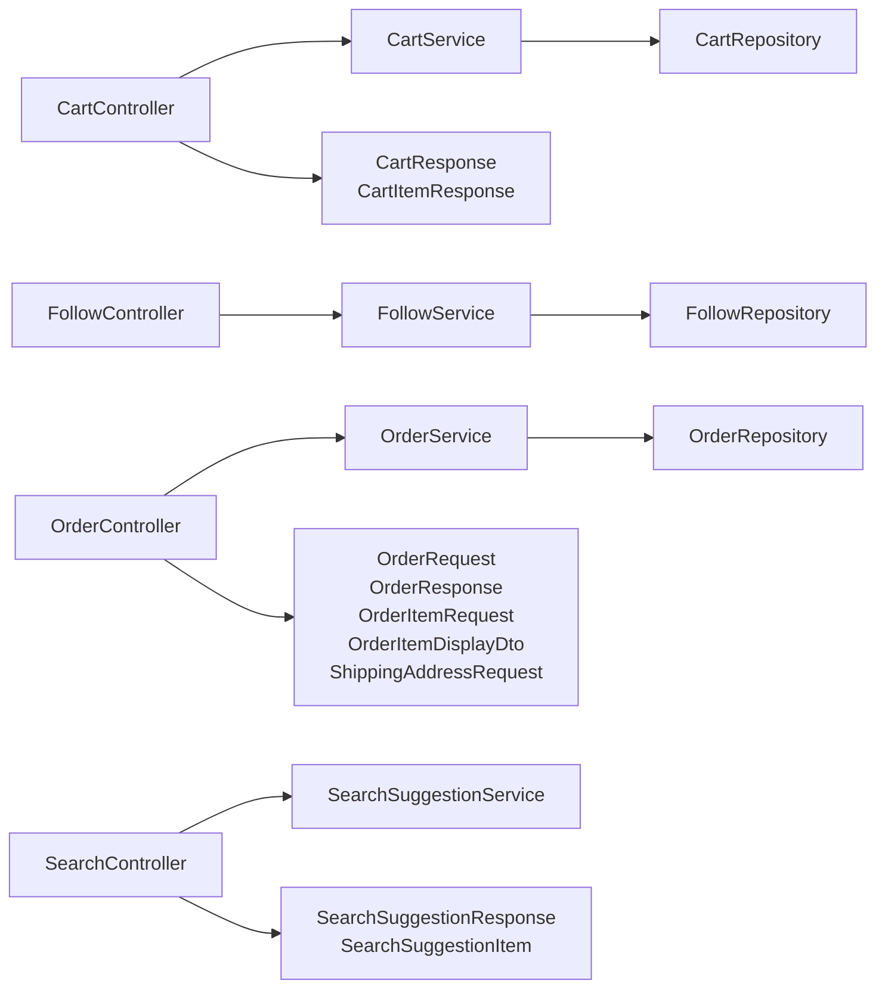

# Commerce Experience API

<cite>
**Referenced Files in This Document**
- [CartController.java](file://src/backend/src/main/java/com/shoppeclone/backend/cart/controller/CartController.java)
- [CartService.java](file://src/backend/src/main/java/com/shoppeclone/backend/cart/service/CartService.java)
- [CartRepository.java](file://src/backend/src/main/java/com/shoppeclone/backend/cart/repository/CartRepository.java)
- [CartResponse.java](file://src/backend/src/main/java/com/shoppeclone/backend/cart/dto/CartResponse.java)
- [CartItemResponse.java](file://src/backend/src/main/java/com/shoppeclone/backend/cart/dto/CartItemResponse.java)
- [OrderController.java](file://src/backend/src/main/java/com/shoppeclone/backend/order/controller/OrderController.java)
- [OrderService.java](file://src/backend/src/main/java/com/shoppeclone/backend/order/service/OrderService.java)
- [OrderRepository.java](file://src/backend/src/main/java/com/shoppeclone/backend/order/repository/OrderRepository.java)
- [OrderRequest.java](file://src/backend/src/main/java/com/shoppeclone/backend/order/dto/OrderRequest.java)
- [OrderResponse.java](file://src/backend/src/main/java/com/shoppeclone/backend/order/dto/OrderResponse.java)
- [OrderItemRequest.java](file://src/backend/src/main/java/com/shoppeclone/backend/order/dto/OrderItemRequest.java)
- [OrderItemDisplayDto.java](file://src/backend/src/main/java/com/shoppeclone/backend/order/dto/OrderItemDisplayDto.java)
- [ShippingAddressRequest.java](file://src/backend/src/main/java/com/shoppeclone/backend/order/dto/ShippingAddressRequest.java)
- [FollowController.java](file://src/backend/src/main/java/com/shoppeclone/backend/follow/controller/FollowController.java)
- [FollowService.java](file://src/backend/src/main/java/com/shoppeclone/backend/follow/service/FollowService.java)
- [FollowRepository.java](file://src/backend/src/main/java/com/shoppeclone/backend/follow/repository/FollowRepository.java)
- [Follow.java](file://src/backend/src/main/java/com/shoppeclone/backend/follow/entity/Follow.java)
- [SearchController.java](file://src/backend/src/main/java/com/shoppeclone/backend/search/controller/SearchController.java)
- [SearchSuggestionService.java](file://src/backend/src/main/java/com/shoppeclone/backend/search/service/SearchSuggestionService.java)
- [SearchSuggestionResponse.java](file://src/backend/src/main/java/com/shoppeclone/backend/search/dto/SearchSuggestionResponse.java)
- [SearchSuggestionItem.java](file://src/backend/src/main/java/com/shoppeclone/backend/search/dto/SearchSuggestionItem.java)
</cite>

## Table of Contents
1. [Introduction](#introduction)
2. [Project Structure](#project-structure)
3. [Core Components](#core-components)
4. [Architecture Overview](#architecture-overview)
5. [Detailed Component Analysis](#detailed-component-analysis)
6. [Dependency Analysis](#dependency-analysis)
7. [Performance Considerations](#performance-considerations)
8. [Troubleshooting Guide](#troubleshooting-guide)
9. [Conclusion](#conclusion)

## Introduction
This document provides comprehensive API documentation for the commerce experience backend, focusing on shopping cart, order processing, product following, and search functionality. It covers endpoint definitions, request/response schemas, data models, persistence mechanisms, lifecycle management, and practical examples for common workflows.

## Project Structure
The backend follows a layered architecture with clear separation of concerns:
- Controllers expose REST endpoints under `/api/*`
- Services encapsulate business logic
- Repositories manage persistence (MongoDB)
- DTOs define request/response contracts
- Entities represent persisted domain objects

**Diagram sources**
- [CartController.java:14-66](file://src/backend/src/main/java/com/shoppeclone/backend/cart/controller/CartController.java#L14-L66)
- [OrderController.java:22-175](file://src/backend/src/main/java/com/shoppeclone/backend/order/controller/OrderController.java#L22-L175)
- [FollowController.java:15-62](file://src/backend/src/main/java/com/shoppeclone/backend/follow/controller/FollowController.java#L15-L62)
- [SearchController.java:10-38](file://src/backend/src/main/java/com/shoppeclone/backend/search/controller/SearchController.java#L10-L38)
- [CartService.java:5-16](file://src/backend/src/main/java/com/shoppeclone/backend/cart/service/CartService.java#L5-L16)
- [OrderService.java](file://src/backend/src/main/java/com/shoppeclone/backend/order/service/OrderService.java)
- [FollowService.java](file://src/backend/src/main/java/com/shoppeclone/backend/follow/service/FollowService.java)
- [SearchSuggestionService.java](file://src/backend/src/main/java/com/shoppeclone/backend/search/service/SearchSuggestionService.java)
- [CartRepository.java:7-9](file://src/backend/src/main/java/com/shoppeclone/backend/cart/repository/CartRepository.java#L7-L9)
- [OrderRepository.java](file://src/backend/src/main/java/com/shoppeclone/backend/order/repository/OrderRepository.java)
- [FollowRepository.java:10-18](file://src/backend/src/main/java/com/shoppeclone/backend/follow/repository/FollowRepository.java#L10-L18)
- [CartResponse.java:15-21](file://src/backend/src/main/java/com/shoppeclone/backend/cart/dto/CartResponse.java#L15-L21)
- [CartItemResponse.java:15-29](file://src/backend/src/main/java/com/shoppeclone/backend/cart/dto/CartItemResponse.java#L15-L29)
- [OrderRequest.java:8-95](file://src/backend/src/main/java/com/shoppeclone/backend/order/dto/OrderRequest.java#L8-L95)
- [OrderResponse.java:22-113](file://src/backend/src/main/java/com/shoppeclone/backend/order/dto/OrderResponse.java#L22-L113)
- [OrderItemRequest.java:6-11](file://src/backend/src/main/java/com/shoppeclone/backend/order/dto/OrderItemRequest.java#L6-L11)
- [OrderItemDisplayDto.java:14-23](file://src/backend/src/main/java/com/shoppeclone/backend/order/dto/OrderItemDisplayDto.java#L14-L23)
- [ShippingAddressRequest.java:7-16](file://src/backend/src/main/java/com/shoppeclone/backend/order/dto/ShippingAddressRequest.java#L7-L16)
- [SearchSuggestionResponse.java:14-22](file://src/backend/src/main/java/com/shoppeclone/backend/search/dto/SearchSuggestionResponse.java#L14-L22)
- [SearchSuggestionItem.java:14-43](file://src/backend/src/main/java/com/shoppeclone/backend/search/dto/SearchSuggestionItem.java#L14-L43)

**Section sources**
- [CartController.java:14-66](file://src/backend/src/main/java/com/shoppeclone/backend/cart/controller/CartController.java#L14-L66)
- [OrderController.java:22-175](file://src/backend/src/main/java/com/shoppeclone/backend/order/controller/OrderController.java#L22-L175)
- [FollowController.java:15-62](file://src/backend/src/main/java/com/shoppeclone/backend/follow/controller/FollowController.java#L15-L62)
- [SearchController.java:10-38](file://src/backend/src/main/java/com/shoppeclone/backend/search/controller/SearchController.java#L10-L38)

## Core Components
This section documents the primary APIs and their schemas.

### Shopping Cart API
- Endpoint: `GET /api/cart/items`
  - Description: Retrieve current cart for authenticated user
  - Authentication: Required
  - Response: CartResponse
  - Example: [CartResponse.java:15-21](file://src/backend/src/main/java/com/shoppeclone/backend/cart/dto/CartResponse.java#L15-L21)

- Endpoint: `POST /api/cart/add`
  - Description: Add item to cart
  - Authentication: Required
  - Query params: variantId (string), quantity (integer)
  - Response: CartResponse
  - Example: [CartController.java:33-40](file://src/backend/src/main/java/com/shoppeclone/backend/cart/controller/CartController.java#L33-L40)

- Endpoint: `PUT /api/cart/update`
  - Description: Update item quantity in cart
  - Authentication: Required
  - Query params: variantId (string), quantity (integer)
  - Response: CartResponse
  - Example: [CartController.java:42-49](file://src/backend/src/main/java/com/shoppeclone/backend/cart/controller/CartController.java#L42-L49)

- Endpoint: `DELETE /api/cart/remove`
  - Description: Remove item from cart
  - Authentication: Required
  - Query params: variantId (string)
  - Response: CartResponse
  - Example: [CartController.java:51-57](file://src/backend/src/main/java/com/shoppeclone/backend/cart/controller/CartController.java#L51-L57)

- Endpoint: `DELETE /api/cart/clear`
  - Description: Clear entire cart
  - Authentication: Required
  - Response: 200 OK
  - Example: [CartController.java:59-64](file://src/backend/src/main/java/com/shoppeclone/backend/cart/controller/CartController.java#L59-L64)

Request/Response Schemas:
- CartResponse
  - Fields: id (string), userId (string), items (array of CartItemResponse), totalPrice (decimal)
  - Reference: [CartResponse.java:15-21](file://src/backend/src/main/java/com/shoppeclone/backend/cart/dto/CartResponse.java#L15-L21)

- CartItemResponse
  - Fields: variantId (string), productId (string), categoryIds (array of string), productName (string), productImage (string), variantName (string), price (decimal), quantity (integer), stock (integer), totalPrice (decimal), shopId (string)
  - Reference: [CartItemResponse.java:15-29](file://src/backend/src/main/java/com/shoppeclone/backend/cart/dto/CartItemResponse.java#L15-L29)

Persistence:
- Cart is stored in MongoDB via CartRepository
- Repository method: findByUserId
- Reference: [CartRepository.java:7-9](file://src/backend/src/main/java/com/shoppeclone/backend/cart/repository/CartRepository.java#L7-L9)

### Order Processing API
- Endpoint: `POST /api/orders`
  - Description: Create a new order
  - Authentication: Required
  - Request body: OrderRequest
  - Response: OrderResponse
  - Example: [OrderController.java:37-70](file://src/backend/src/main/java/com/shoppeclone/backend/order/controller/OrderController.java#L37-L70)

- Endpoint: `GET /api/orders`
  - Description: List user's orders
  - Authentication: Required
  - Response: Array of OrderResponse
  - Example: [OrderController.java:72-78](file://src/backend/src/main/java/com/shoppeclone/backend/order/controller/OrderController.java#L72-L78)

- Endpoint: `DELETE /api/orders`
  - Description: Delete all user orders
  - Authentication: Required
  - Response: 204 No Content
  - Example: [OrderController.java:80-85](file://src/backend/src/main/java/com/shoppeclone/backend/order/controller/OrderController.java#L80-L85)

- Endpoint: `GET /api/orders/{id}`
  - Description: Get order details by ID
  - Authentication: Required
  - Path param: orderId (string)
  - Response: OrderResponse
  - Example: [OrderController.java:87-96](file://src/backend/src/main/java/com/shoppeclone/backend/order/controller/OrderController.java#L87-L96)

- Endpoint: `PUT /api/orders/{id}/status`
  - Description: Update order status (seller only)
  - Authentication: Required
  - Path param: orderId (string)
  - Query param: status (enum)
  - Response: OrderResponse
  - Example: [OrderController.java:98-114](file://src/backend/src/main/java/com/shoppeclone/backend/order/controller/OrderController.java#L98-L114)

- Endpoint: `POST /api/orders/{id}/cancel`
  - Description: Cancel an order (owner or seller)
  - Authentication: Required
  - Path param: orderId (string)
  - Response: OrderResponse
  - Example: [OrderController.java:116-135](file://src/backend/src/main/java/com/shoppeclone/backend/order/controller/OrderController.java#L116-L135)

- Endpoint: `PUT /api/orders/{id}/shipping`
  - Description: Update shipment info (seller only)
  - Authentication: Required
  - Path param: orderId (string)
  - Query params: trackingCode (string), providerId (string)
  - Response: OrderResponse
  - Example: [OrderController.java:137-154](file://src/backend/src/main/java/com/shoppeclone/backend/order/controller/OrderController.java#L137-L154)

- Endpoint: `GET /api/orders/shop/{shopId}`
  - Description: Get shop's orders (seller only)
  - Authentication: Required
  - Path param: shopId (string)
  - Query param: status (enum, optional)
  - Response: Array of Order
  - Example: [OrderController.java:156-172](file://src/backend/src/main/java/com/shoppeclone/backend/order/controller/OrderController.java#L156-L172)

Request/Response Schemas:
- OrderRequest
  - Fields: shippingProviderId (string), address (Address), shippingAddress (ShippingAddressRequest), paymentMethod (string), voucherCode (string), shippingVoucherCode (string), shopVoucherCode (string), variantIds (array of string), items (array of OrderItemRequest)
  - Reference: [OrderRequest.java:8-95](file://src/backend/src/main/java/com/shoppeclone/backend/order/dto/OrderRequest.java#L8-L95)

- OrderResponse
  - Fields: id (string), userId (string), totalPrice (decimal), discount (decimal), voucherCode (string), shippingVoucherCode (string), shopVoucherCode (string), shopDiscount (decimal), shippingDiscount (decimal), orderStatus (enum), paymentStatus (enum), items (array of OrderItem), displayItems (array of OrderItemDisplayDto), paymentMethod (string), collectCash (boolean), shipping (OrderShipping), shipperId (string), assignedAt (datetime), deliveryNote (string), proofOfDeliveryUrl (string), createdAt (datetime), updatedAt (datetime), shippedAt (datetime), completedAt (datetime), cancelledAt (datetime), cancelReason (string), itemReviewInfo (array of OrderItemReviewInfo), canReviewAny (boolean)
  - Reference: [OrderResponse.java:22-113](file://src/backend/src/main/java/com/shoppeclone/backend/order/dto/OrderResponse.java#L22-L113)

- OrderItemRequest
  - Fields: variantId (string), quantity (integer), price (decimal)
  - Reference: [OrderItemRequest.java:6-11](file://src/backend/src/main/java/com/shoppeclone/backend/order/dto/OrderItemRequest.java#L6-L11)

- OrderItemDisplayDto
  - Fields: variantId (string), productId (string), productName (string), productImage (string), variantName (string), quantity (integer), price (decimal)
  - Reference: [OrderItemDisplayDto.java:14-23](file://src/backend/src/main/java/com/shoppeclone/backend/order/dto/OrderItemDisplayDto.java#L14-L23)

- ShippingAddressRequest
  - Fields: fullName (string), phone (string), street (string), city (string), state (string), postalCode (string)
  - Reference: [ShippingAddressRequest.java:7-16](file://src/backend/src/main/java/com/shoppeclone/backend/order/dto/ShippingAddressRequest.java#L7-L16)

Order Lifecycle Management:
- Creation: Validates cart/items, applies vouchers, calculates totals, persists order
- Status transitions: Controlled via PUT /{id}/status with seller authorization
- Cancellation: Allowed by owner or seller under specific conditions
- Shipment updates: Managed via PUT /{id}/shipping with seller authorization
- Persistence: Orders stored in MongoDB via OrderRepository

### Product Following API
- Endpoint: `POST /api/follow/{shopId}`
  - Description: Toggle follow/unfollow for a shop
  - Authentication: Required
  - Path param: shopId (string)
  - Response: JSON with isFollowing (boolean) and message (string)
  - Example: [FollowController.java:21-35](file://src/backend/src/main/java/com/shoppeclone/backend/follow/controller/FollowController.java#L21-L35)

- Endpoint: `GET /api/follow/check/{shopId}`
  - Description: Check follow status for a shop
  - Authentication: Optional (returns false if not authenticated)
  - Path param: shopId (string)
  - Response: JSON with isFollowing (boolean)
  - Example: [FollowController.java:37-49](file://src/backend/src/main/java/com/shoppeclone/backend/follow/controller/FollowController.java#L37-L49)

- Endpoint: `GET /api/follow/count/{shopId}`
  - Description: Get follower count for a shop
  - Authentication: Not required
  - Path param: shopId (string)
  - Response: JSON with count (long)
  - Example: [FollowController.java:51-55](file://src/backend/src/main/java/com/shoppeclone/backend/follow/controller/FollowController.java#L51-L55)

- Endpoint: `GET /api/follow/shop/{shopId}/list`
  - Description: List followers for a shop
  - Authentication: Not required
  - Path param: shopId (string)
  - Response: Followers list
  - Example: [FollowController.java:57-60](file://src/backend/src/main/java/com/shoppeclone/backend/follow/controller/FollowController.java#L57-L60)

Follower Relationships:
- Follow entity indexed by userId and shopId (unique compound index)
- Counting and existence checks supported via FollowRepository
- Persistence: MongoDB collection "follows"

### Search Suggestions API
- Endpoint: `GET /api/search/suggestions`
  - Description: Get mixed suggestions for homepage search
  - Authentication: Not required
  - Query params: keyword (string, required), limit (integer, default 10, min 1, max 20)
  - Response: SearchSuggestionResponse
  - Example: [SearchController.java:29-36](file://src/backend/src/main/java/com/shoppeclone/backend/search/controller/SearchController.java#L29-L36)

- Endpoint: `GET /api/search`
  - Description: Placeholder for future search endpoint
  - Authentication: Not required
  - Response: 404 (not implemented)
  - Example: [SearchController.java:10-12](file://src/backend/src/main/java/com/shoppeclone/backend/search/controller/SearchController.java#L10-L12)

Request/Response Schemas:
- SearchSuggestionResponse
  - Fields: keyword (string), suggestions (array of SearchSuggestionItem)
  - Reference: [SearchSuggestionResponse.java:14-22](file://src/backend/src/main/java/com/shoppeclone/backend/search/dto/SearchSuggestionResponse.java#L14-L22)

- SearchSuggestionItem
  - Enum: SuggestionType { PRODUCT, CATEGORY, KEYWORD, ATTRIBUTE }
  - Fields: type (enum), label (string), id (string), imageUrl (string), minPrice (decimal), sold (integer), attributeType (string)
  - Reference: [SearchSuggestionItem.java:14-43](file://src/backend/src/main/java/com/shoppeclone/backend/search/dto/SearchSuggestionItem.java#L14-L43)

Search Algorithms:
- Mixed suggestion types: Products, Categories, Keywords, Attributes
- Priority order: Products first, then Categories, then Keywords, then Attributes
- Limits enforced client-side (min 1, max 20)

## Architecture Overview
The system uses Spring MVC controllers delegating to service layer, which coordinates repositories and domain entities. MongoDB is used for flexible document storage.

**Diagram sources**
- [CartController.java:27-31](file://src/backend/src/main/java/com/shoppeclone/backend/cart/controller/CartController.java#L27-L31)
- [CartService.java:5-16](file://src/backend/src/main/java/com/shoppeclone/backend/cart/service/CartService.java#L5-L16)
- [CartRepository.java:7-9](file://src/backend/src/main/java/com/shoppeclone/backend/cart/repository/CartRepository.java#L7-L9)

**Diagram sources**
- [OrderController.java:37-70](file://src/backend/src/main/java/com/shoppeclone/backend/order/controller/OrderController.java#L37-L70)
- [OrderService.java](file://src/backend/src/main/java/com/shoppeclone/backend/order/service/OrderService.java)
- [OrderRepository.java](file://src/backend/src/main/java/com/shoppeclone/backend/order/repository/OrderRepository.java)

**Diagram sources**
- [FollowController.java:21-35](file://src/backend/src/main/java/com/shoppeclone/backend/follow/controller/FollowController.java#L21-L35)
- [FollowService.java](file://src/backend/src/main/java/com/shoppeclone/backend/follow/service/FollowService.java)
- [FollowRepository.java:10-18](file://src/backend/src/main/java/com/shoppeclone/backend/follow/repository/FollowRepository.java#L10-L18)

**Diagram sources**
- [SearchController.java:29-36](file://src/backend/src/main/java/com/shoppeclone/backend/search/controller/SearchController.java#L29-L36)
- [SearchSuggestionService.java](file://src/backend/src/main/java/com/shoppeclone/backend/search/service/SearchSuggestionService.java)
- [SearchSuggestionResponse.java:14-22](file://src/backend/src/main/java/com/shoppeclone/backend/search/dto/SearchSuggestionResponse.java#L14-L22)

## Detailed Component Analysis

### Shopping Cart Component
The cart subsystem manages per-user shopping carts with CRUD operations for cart items and supports clearing the cart.

Key behaviors:
- Cart retrieval by userId
- Adding items with variantId and quantity
- Updating quantities
- Removing individual items
- Clearing the entire cart

**Diagram sources**
- [CartController.java:14-66](file://src/backend/src/main/java/com/shoppeclone/backend/cart/controller/CartController.java#L14-L66)
- [CartService.java:5-16](file://src/backend/src/main/java/com/shoppeclone/backend/cart/service/CartService.java#L5-L16)
- [CartRepository.java:7-9](file://src/backend/src/main/java/com/shoppeclone/backend/cart/repository/CartRepository.java#L7-L9)
- [CartResponse.java:15-21](file://src/backend/src/main/java/com/shoppeclone/backend/cart/dto/CartResponse.java#L15-L21)
- [CartItemResponse.java:15-29](file://src/backend/src/main/java/com/shoppeclone/backend/cart/dto/CartItemResponse.java#L15-L29)

**Section sources**
- [CartController.java:27-64](file://src/backend/src/main/java/com/shoppeclone/backend/cart/controller/CartController.java#L27-L64)
- [CartResponse.java:15-21](file://src/backend/src/main/java/com/shoppeclone/backend/cart/dto/CartResponse.java#L15-L21)
- [CartItemResponse.java:15-29](file://src/backend/src/main/java/com/shoppeclone/backend/cart/dto/CartItemResponse.java#L15-L29)
- [CartRepository.java:7-9](file://src/backend/src/main/java/com/shoppeclone/backend/cart/repository/CartRepository.java#L7-L9)

### Order Processing Component
The order subsystem handles order creation, retrieval, cancellation, and status/shipping updates with role-based authorization.

Key behaviors:
- Order creation validates inputs and applies promotions
- Retrieval supports single order and user order listing
- Cancellation allowed by owner or seller
- Status and shipping updates restricted to sellers
- Shop-specific order listing with optional status filter

**Diagram sources**
- [OrderController.java:22-175](file://src/backend/src/main/java/com/shoppeclone/backend/order/controller/OrderController.java#L22-L175)
- [OrderService.java](file://src/backend/src/main/java/com/shoppeclone/backend/order/service/OrderService.java)
- [OrderRequest.java:8-95](file://src/backend/src/main/java/com/shoppeclone/backend/order/dto/OrderRequest.java#L8-L95)
- [OrderResponse.java:22-113](file://src/backend/src/main/java/com/shoppeclone/backend/order/dto/OrderResponse.java#L22-L113)
- [OrderItemRequest.java:6-11](file://src/backend/src/main/java/com/shoppeclone/backend/order/dto/OrderItemRequest.java#L6-L11)
- [OrderItemDisplayDto.java:14-23](file://src/backend/src/main/java/com/shoppeclone/backend/order/dto/OrderItemDisplayDto.java#L14-L23)
- [ShippingAddressRequest.java:7-16](file://src/backend/src/main/java/com/shoppeclone/backend/order/dto/ShippingAddressRequest.java#L7-L16)

**Section sources**
- [OrderController.java:37-172](file://src/backend/src/main/java/com/shoppeclone/backend/order/controller/OrderController.java#L37-L172)
- [OrderRequest.java:8-95](file://src/backend/src/main/java/com/shoppeclone/backend/order/dto/OrderRequest.java#L8-L95)
- [OrderResponse.java:22-113](file://src/backend/src/main/java/com/shoppeclone/backend/order/dto/OrderResponse.java#L22-L113)
- [OrderItemRequest.java:6-11](file://src/backend/src/main/java/com/shoppeclone/backend/order/dto/OrderItemRequest.java#L6-L11)
- [OrderItemDisplayDto.java:14-23](file://src/backend/src/main/java/com/shoppeclone/backend/order/dto/OrderItemDisplayDto.java#L14-L23)
- [ShippingAddressRequest.java:7-16](file://src/backend/src/main/java/com/shoppeclone/backend/order/dto/ShippingAddressRequest.java#L7-L16)

### Product Following Component
The following subsystem manages user-shop relationships with toggle, check, count, and list operations.

Key behaviors:
- Toggle follow/unfollow with single request
- Check follow status (anonymous-friendly)
- Retrieve follower counts
- List followers for a shop

**Diagram sources**
- [FollowController.java:15-62](file://src/backend/src/main/java/com/shoppeclone/backend/follow/controller/FollowController.java#L15-L62)
- [FollowService.java](file://src/backend/src/main/java/com/shoppeclone/backend/follow/service/FollowService.java)
- [FollowRepository.java:10-18](file://src/backend/src/main/java/com/shoppeclone/backend/follow/repository/FollowRepository.java#L10-L18)
- [Follow.java:12-28](file://src/backend/src/main/java/com/shoppeclone/backend/follow/entity/Follow.java#L12-L28)

**Section sources**
- [FollowController.java:21-60](file://src/backend/src/main/java/com/shoppeclone/backend/follow/controller/FollowController.java#L21-L60)
- [FollowRepository.java:10-18](file://src/backend/src/main/java/com/shoppeclone/backend/follow/repository/FollowRepository.java#L10-L18)
- [Follow.java:12-28](file://src/backend/src/main/java/com/shoppeclone/backend/follow/entity/Follow.java#L12-L28)

### Search Suggestions Component
The search subsystem provides mixed-type suggestions for homepage search with strict limit enforcement.

Key behaviors:
- Mixed suggestion types: PRODUCTS, CATEGORIES, KEYWORDS, ATTRIBUTES
- Priority ordering: Products first, then Categories, then Keywords, then Attributes
- Limit clamped between 1 and 20

**Diagram sources**
- [SearchController.java:10-38](file://src/backend/src/main/java/com/shoppeclone/backend/search/controller/SearchController.java#L10-L38)
- [SearchSuggestionService.java](file://src/backend/src/main/java/com/shoppeclone/backend/search/service/SearchSuggestionService.java)
- [SearchSuggestionResponse.java:14-22](file://src/backend/src/main/java/com/shoppeclone/backend/search/dto/SearchSuggestionResponse.java#L14-L22)
- [SearchSuggestionItem.java:14-43](file://src/backend/src/main/java/com/shoppeclone/backend/search/dto/SearchSuggestionItem.java#L14-L43)

**Section sources**
- [SearchController.java:17-36](file://src/backend/src/main/java/com/shoppeclone/backend/search/controller/SearchController.java#L17-L36)
- [SearchSuggestionResponse.java:14-22](file://src/backend/src/main/java/com/shoppeclone/backend/search/dto/SearchSuggestionResponse.java#L14-L22)
- [SearchSuggestionItem.java:14-43](file://src/backend/src/main/java/com/shoppeclone/backend/search/dto/SearchSuggestionItem.java#L14-L43)

## Dependency Analysis
The controllers depend on services, which in turn depend on repositories. DTOs and entities define the data contracts.

**Diagram sources**
- [CartController.java:14-66](file://src/backend/src/main/java/com/shoppeclone/backend/cart/controller/CartController.java#L14-L66)
- [OrderController.java:22-175](file://src/backend/src/main/java/com/shoppeclone/backend/order/controller/OrderController.java#L22-L175)
- [FollowController.java:15-62](file://src/backend/src/main/java/com/shoppeclone/backend/follow/controller/FollowController.java#L15-L62)
- [SearchController.java:10-38](file://src/backend/src/main/java/com/shoppeclone/backend/search/controller/SearchController.java#L10-L38)
- [CartService.java:5-16](file://src/backend/src/main/java/com/shoppeclone/backend/cart/service/CartService.java#L5-L16)
- [OrderService.java](file://src/backend/src/main/java/com/shoppeclone/backend/order/service/OrderService.java)
- [FollowService.java](file://src/backend/src/main/java/com/shoppeclone/backend/follow/service/FollowService.java)
- [SearchSuggestionService.java](file://src/backend/src/main/java/com/shoppeclone/backend/search/service/SearchSuggestionService.java)
- [CartRepository.java:7-9](file://src/backend/src/main/java/com/shoppeclone/backend/cart/repository/CartRepository.java#L7-L9)
- [OrderRepository.java](file://src/backend/src/main/java/com/shoppeclone/backend/order/repository/OrderRepository.java)
- [FollowRepository.java:10-18](file://src/backend/src/main/java/com/shoppeclone/backend/follow/repository/FollowRepository.java#L10-L18)
- [CartResponse.java:15-21](file://src/backend/src/main/java/com/shoppeclone/backend/cart/dto/CartResponse.java#L15-L21)
- [CartItemResponse.java:15-29](file://src/backend/src/main/java/com/shoppeclone/backend/cart/dto/CartItemResponse.java#L15-L29)
- [OrderRequest.java:8-95](file://src/backend/src/main/java/com/shoppeclone/backend/order/dto/OrderRequest.java#L8-L95)
- [OrderResponse.java:22-113](file://src/backend/src/main/java/com/shoppeclone/backend/order/dto/OrderResponse.java#L22-L113)
- [OrderItemRequest.java:6-11](file://src/backend/src/main/java/com/shoppeclone/backend/order/dto/OrderItemRequest.java#L6-L11)
- [OrderItemDisplayDto.java:14-23](file://src/backend/src/main/java/com/shoppeclone/backend/order/dto/OrderItemDisplayDto.java#L14-L23)
- [ShippingAddressRequest.java:7-16](file://src/backend/src/main/java/com/shoppeclone/backend/order/dto/ShippingAddressRequest.java#L7-L16)
- [SearchSuggestionResponse.java:14-22](file://src/backend/src/main/java/com/shoppeclone/backend/search/dto/SearchSuggestionResponse.java#L14-L22)
- [SearchSuggestionItem.java:14-43](file://src/backend/src/main/java/com/shoppeclone/backend/search/dto/SearchSuggestionItem.java#L14-L43)

**Section sources**
- [CartController.java:14-66](file://src/backend/src/main/java/com/shoppeclone/backend/cart/controller/CartController.java#L14-L66)
- [OrderController.java:22-175](file://src/backend/src/main/java/com/shoppeclone/backend/order/controller/OrderController.java#L22-L175)
- [FollowController.java:15-62](file://src/backend/src/main/java/com/shoppeclone/backend/follow/controller/FollowController.java#L15-L62)
- [SearchController.java:10-38](file://src/backend/src/main/java/com/shoppeclone/backend/search/controller/SearchController.java#L10-L38)

## Performance Considerations
- Cart operations: Single query per cart retrieval; consider caching frequently accessed carts for anonymous users.
- Order processing: Batch operations for bulk deletions; ensure proper indexing on userId and shopId for fast filtering.
- Following: Compound index on (userId, shopId) prevents duplicates and speeds up toggle operations.
- Search: Limit suggestions to reduce payload size; consider precomputing popular keywords and attributes.

## Troubleshooting Guide
Common issues and resolutions:
- Authentication failures: Ensure requests include a valid authenticated principal for protected endpoints.
- Serialization errors: OrderResponse serialization is validated in controller; check Jackson configuration and temporal modules.
- Authorization errors: Some endpoints require ownership or seller privileges; verify user roles and shop ownership.
- Repository access: Confirm MongoDB connectivity and collection names match entity mappings.

**Section sources**
- [OrderController.java:42-70](file://src/backend/src/main/java/com/shoppeclone/backend/order/controller/OrderController.java#L42-L70)
- [FollowController.java:24-26](file://src/backend/src/main/java/com/shoppeclone/backend/follow/controller/FollowController.java#L24-L26)
- [SearchController.java:12-12](file://src/backend/src/main/java/com/shoppeclone/backend/search/controller/SearchController.java#L12-L12)

## Conclusion
This API suite provides a robust foundation for commerce operations with clear separation of concerns, explicit DTO contracts, and MongoDB-backed persistence. The documented endpoints, schemas, and workflows enable frontend teams to integrate shopping cart, order processing, product following, and search functionalities effectively.