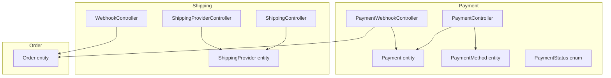
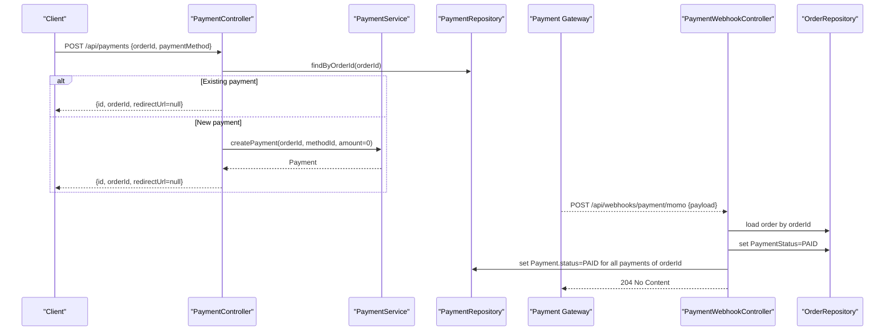
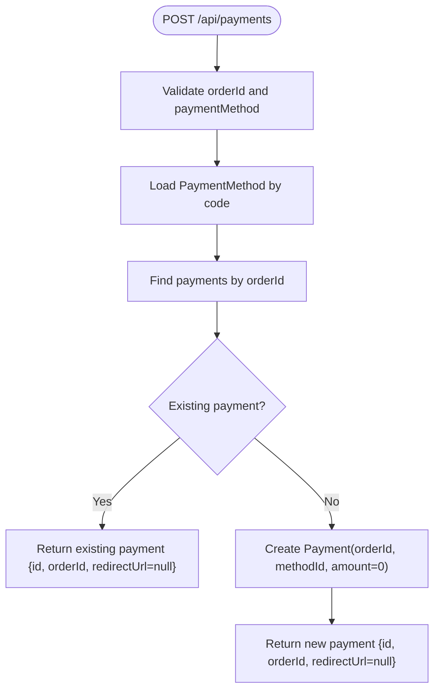
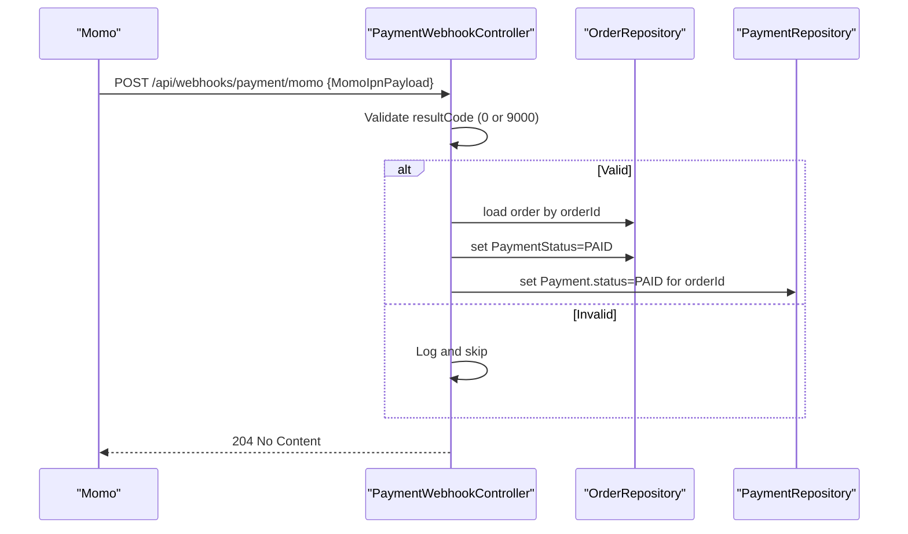
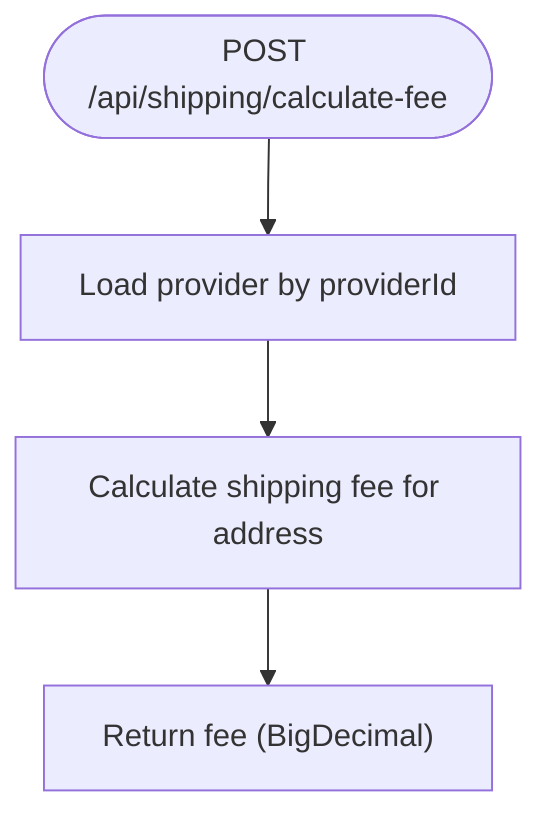
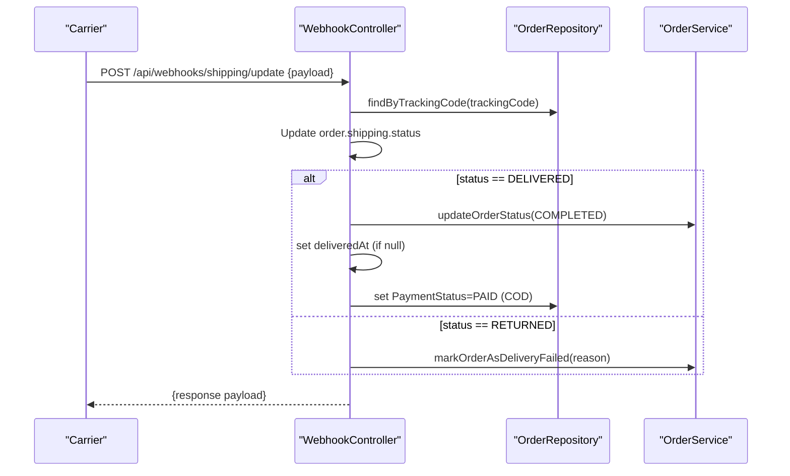
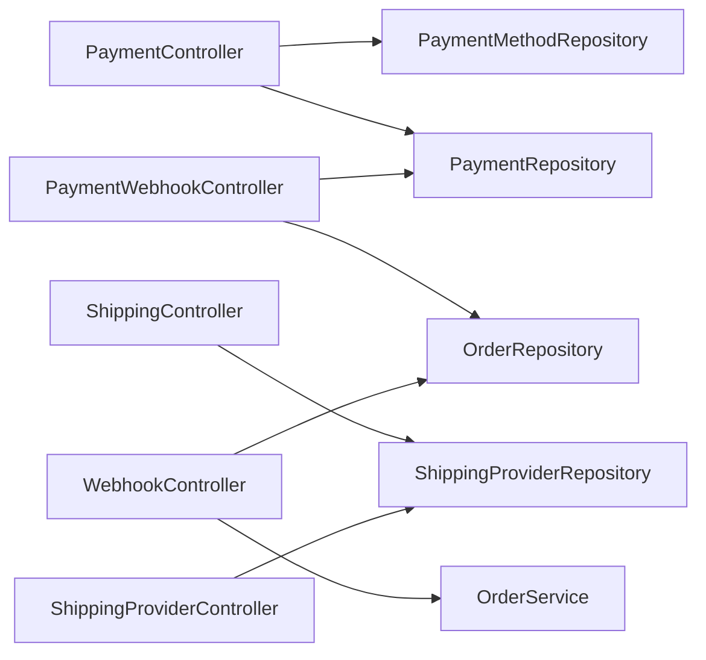

# Payments & Shipping API

<cite>
**Referenced Files in This Document**
- [PaymentController.java](file://src/Backend/src/main/java/com/shoppeclone/backend/payment/controller/PaymentController.java)
- [PaymentWebhookController.java](file://src/Backend/src/main/java/com/shoppeclone/backend/payment/controller/PaymentWebhookController.java)
- [ShippingController.java](file://src/Backend/src/main/java/com/shoppeclone/backend/shipping/controller/ShippingController.java)
- [ShippingProviderController.java](file://src/Backend/src/main/java/com/shoppeclone/backend/shipping/controller/ShippingProviderController.java)
- [WebhookController.java](file://src/Backend/src/main/java/com/shoppeclone/backend/shipping/controller/WebhookController.java)
- [Payment.java](file://src/Backend/src/main/java/com/shoppeclone/backend/payment/entity/Payment.java)
- [PaymentMethod.java](file://src/Backend/src/main/java/com/shoppeclone/backend/payment/entity/PaymentMethod.java)
- [PaymentStatus.java](file://src/Backend/src/main/java/com/shoppeclone/backend/payment/entity/PaymentStatus.java)
- [ShippingProvider.java](file://src/Backend/src/main/java/com/shoppeclone/backend/shipping/entity/ShippingProvider.java)
- [Order.java](file://src/Backend/src/main/java/com/shoppeclone/backend/order/entity/Order.java)
</cite>

## Table of Contents
1. [Introduction](#introduction)
2. [Project Structure](#project-structure)
3. [Core Components](#core-components)
4. [Architecture Overview](#architecture-overview)
5. [Detailed Component Analysis](#detailed-component-analysis)
6. [Dependency Analysis](#dependency-analysis)
7. [Performance Considerations](#performance-considerations)
8. [Troubleshooting Guide](#troubleshooting-guide)
9. [Conclusion](#conclusion)
10. [Appendices](#appendices)

## Introduction
This document describes the Payments & Shipping API surface implemented in the backend. It covers:
- Payment creation and status management
- Payment webhooks for third-party gateways (Momo, VNPAY)
- Shipping provider discovery and fee calculation
- Shipping status updates via webhooks
- Order fulfillment flows triggered by shipping events

It also documents request/response schemas for key entities and webhook payloads, along with practical examples for payment processing, webhook validation, shipping label generation, and delivery status updates.

## Project Structure
The API is organized by domain:
- Payment domain: controllers for payment creation and webhooks
- Shipping domain: controllers for providers, shipping calculations, and shipping webhooks
- Shared domain: Order entity and enums used across payment and shipping flows

**Diagram sources**
- [PaymentController.java:18-74](file://src/Backend/src/main/java/com/shoppeclone/backend/payment/controller/PaymentController.java#L18-L74)
- [PaymentWebhookController.java:21-136](file://src/Backend/src/main/java/com/shoppeclone/backend/payment/controller/PaymentWebhookController.java#L21-L136)
- [ShippingController.java:13-34](file://src/Backend/src/main/java/com/shoppeclone/backend/shipping/controller/ShippingController.java#L13-L34)
- [ShippingProviderController.java:13-25](file://src/Backend/src/main/java/com/shoppeclone/backend/shipping/controller/ShippingProviderController.java#L13-L25)
- [WebhookController.java:20-83](file://src/Backend/src/main/java/com/shoppeclone/backend/shipping/controller/WebhookController.java#L20-L83)
- [Payment.java:11-27](file://src/Backend/src/main/java/com/shoppeclone/backend/payment/entity/Payment.java#L11-L27)
- [PaymentMethod.java:7-16](file://src/Backend/src/main/java/com/shoppeclone/backend/payment/entity/PaymentMethod.java#L7-L16)
- [PaymentStatus.java:3-8](file://src/Backend/src/main/java/com/shoppeclone/backend/payment/entity/PaymentStatus.java#L3-L8)
- [ShippingProvider.java:7-15](file://src/Backend/src/main/java/com/shoppeclone/backend/shipping/entity/ShippingProvider.java#L7-L15)
- [Order.java:12-55](file://src/Backend/src/main/java/com/shoppeclone/backend/order/entity/Order.java#L12-L55)

**Section sources**
- [PaymentController.java:18-74](file://src/Backend/src/main/java/com/shoppeclone/backend/payment/controller/PaymentController.java#L18-L74)
- [PaymentWebhookController.java:21-136](file://src/Backend/src/main/java/com/shoppeclone/backend/payment/controller/PaymentWebhookController.java#L21-L136)
- [ShippingController.java:13-34](file://src/Backend/src/main/java/com/shoppeclone/backend/shipping/controller/ShippingController.java#L13-L34)
- [ShippingProviderController.java:13-25](file://src/Backend/src/main/java/com/shoppeclone/backend/shipping/controller/ShippingProviderController.java#L13-L25)
- [WebhookController.java:20-83](file://src/Backend/src/main/java/com/shoppeclone/backend/shipping/controller/WebhookController.java#L20-L83)
- [Payment.java:11-27](file://src/Backend/src/main/java/com/shoppeclone/backend/payment/entity/Payment.java#L11-L27)
- [PaymentMethod.java:7-16](file://src/Backend/src/main/java/com/shoppeclone/backend/payment/entity/PaymentMethod.java#L7-L16)
- [PaymentStatus.java:3-8](file://src/Backend/src/main/java/com/shoppeclone/backend/payment/entity/PaymentStatus.java#L3-L8)
- [ShippingProvider.java:7-15](file://src/Backend/src/main/java/com/shoppeclone/backend/shipping/entity/ShippingProvider.java#L7-L15)
- [Order.java:12-55](file://src/Backend/src/main/java/com/shoppeclone/backend/order/entity/Order.java#L12-L55)

## Core Components
- Payment endpoints
  - POST /api/payments: Create a payment for an order
  - GET /api/payments/methods: List supported payment methods
  - GET /api/payments/order/{orderId}: Retrieve payment by order ID
  - POST /api/payments/{paymentId}/status: Update payment status (internal)
- Payment webhooks
  - POST /api/webhooks/payment/momo: Momo IPN callback
  - POST /api/webhooks/payment/vnpay: VNPAY IPN callback
- Shipping endpoints
  - GET /api/shipping/providers: List shipping providers
  - POST /api/shipping/calculate-fee: Calculate shipping fee
  - GET /api/shipping-providers: List shipping providers
  - POST /api/webhooks/shipping/update: Receive shipping status updates

**Section sources**
- [PaymentController.java:27-72](file://src/Backend/src/main/java/com/shoppeclone/backend/payment/controller/PaymentController.java#L27-L72)
- [PaymentWebhookController.java:36-107](file://src/Backend/src/main/java/com/shoppeclone/backend/payment/controller/PaymentWebhookController.java#L36-L107)
- [ShippingController.java:20-32](file://src/Backend/src/main/java/com/shoppeclone/backend/shipping/controller/ShippingController.java#L20-L32)
- [ShippingProviderController.java:20-23](file://src/Backend/src/main/java/com/shoppeclone/backend/shipping/controller/ShippingProviderController.java#L20-L23)
- [WebhookController.java:36-80](file://src/Backend/src/main/java/com/shoppeclone/backend/shipping/controller/WebhookController.java#L36-L80)

## Architecture Overview
The system integrates payment and shipping via webhooks and shared order state. Payment webhooks update order and payment statuses upon gateway notifications. Shipping webhooks update order fulfillment status and delivery metadata.

**Diagram sources**
- [PaymentController.java:27-48](file://src/Backend/src/main/java/com/shoppeclone/backend/payment/controller/PaymentController.java#L27-L48)
- [PaymentWebhookController.java:36-75](file://src/Backend/src/main/java/com/shoppeclone/backend/payment/controller/PaymentWebhookController.java#L36-L75)
- [Order.java:34-35](file://src/Backend/src/main/java/com/shoppeclone/backend/order/entity/Order.java#L34-L35)
- [Payment.java:24-25](file://src/Backend/src/main/java/com/shoppeclone/backend/payment/entity/Payment.java#L24-L25)

## Detailed Component Analysis

### Payment Endpoints
- POST /api/payments
  - Purpose: Create or retrieve a payment for an order using a payment method code
  - Request body: { orderId, paymentMethod }
  - Response: { id, orderId, redirectUrl }
  - Behavior:
    - Validates presence of orderId and paymentMethod
    - Loads payment method by code
    - Finds existing payment for orderId; if none, creates a new payment with zero amount
    - Returns minimal payment info with redirectUrl as null (cash-on-delivery or gateway not integrated)
- GET /api/payments/methods
  - Purpose: Enumerate supported payment methods
  - Response: Array of PaymentMethod
- GET /api/payments/order/{orderId}
  - Purpose: Retrieve a payment associated with an order
  - Response: Payment
- POST /api/payments/{paymentId}/status
  - Purpose: Update payment status (internal endpoint)
  - Query params: status
  - Response: 200 OK

**Diagram sources**
- [PaymentController.java:27-48](file://src/Backend/src/main/java/com/shoppeclone/backend/payment/controller/PaymentController.java#L27-L48)

**Section sources**
- [PaymentController.java:27-72](file://src/Backend/src/main/java/com/shoppeclone/backend/payment/controller/PaymentController.java#L27-L72)
- [PaymentMethod.java:9-15](file://src/Backend/src/main/java/com/shoppeclone/backend/payment/entity/PaymentMethod.java#L9-L15)

### Payment Webhooks
- POST /api/webhooks/payment/momo
  - Purpose: Handle Momo Instant Payment Notification
  - Request body: MomoIpnPayload
  - Validation:
    - Checks resultCode equals success (0) or authorized (9000)
  - Effects:
    - Sets Order.paymentStatus to PAID
    - Sets all Payment entries for orderId to PAID and records paidAt
  - Response: 204 No Content (required by Momo)
- POST /api/webhooks/payment/vnpay
  - Purpose: Handle VNPAY IPN
  - Request body: VnpayIpnPayload
  - Validation:
    - Checks vnp_ResponseCode equals "00"
  - Effects:
    - Same as Momo but for VNPAY
  - Response: 204 No Content

**Diagram sources**
- [PaymentWebhookController.java:36-75](file://src/Backend/src/main/java/com/shoppeclone/backend/payment/controller/PaymentWebhookController.java#L36-L75)

**Section sources**
- [PaymentWebhookController.java:36-107](file://src/Backend/src/main/java/com/shoppeclone/backend/payment/controller/PaymentWebhookController.java#L36-L107)
- [Order.java:34-35](file://src/Backend/src/main/java/com/shoppeclone/backend/order/entity/Order.java#L34-L35)
- [Payment.java:24-25](file://src/Backend/src/main/java/com/shoppeclone/backend/payment/entity/Payment.java#L24-L25)

### Shipping Endpoints
- GET /api/shipping/providers
  - Purpose: List all shipping providers
  - Response: Array of ShippingProvider
- POST /api/shipping/calculate-fee
  - Purpose: Estimate shipping fee to an address
  - Query params: providerId
  - Request body: Address
  - Response: Fee (BigDecimal)
- GET /api/shipping-providers
  - Purpose: List all shipping providers
  - Response: Array of ShippingProvider

**Diagram sources**
- [ShippingController.java:25-32](file://src/Backend/src/main/java/com/shoppeclone/backend/shipping/controller/ShippingController.java#L25-L32)

**Section sources**
- [ShippingController.java:20-32](file://src/Backend/src/main/java/com/shoppeclone/backend/shipping/controller/ShippingController.java#L20-L32)
- [ShippingProviderController.java:20-23](file://src/Backend/src/main/java/com/shoppeclone/backend/shipping/controller/ShippingProviderController.java#L20-L23)
- [ShippingProvider.java:9-14](file://src/Backend/src/main/java/com/shoppeclone/backend/shipping/entity/ShippingProvider.java#L9-L14)

### Shipping Webhooks
- POST /api/webhooks/shipping/update
  - Purpose: Update order and shipping status based on carrier events
  - Request body: ShippingUpdatePayload
  - Fields:
    - trackingCode: string
    - status: one of PICKED, DELIVERING, DELIVERED, RETURNED
    - location: string
    - reason: string (optional)
  - Effects:
    - Update order shipping status
    - On DELIVERED:
      - Set order status to COMPLETED
      - Record deliveredAt if unset
      - Mark payment status as PAID (COD assumption)
    - On RETURNED:
      - Mark order as delivery failed with reason
  - Response: { success, orderId, trackingCode, orderStatus, shippingStatus, cancelReason, message, updatedAt }

**Diagram sources**
- [WebhookController.java:36-80](file://src/Backend/src/main/java/com/shoppeclone/backend/shipping/controller/WebhookController.java#L36-L80)

**Section sources**
- [WebhookController.java:28-80](file://src/Backend/src/main/java/com/shoppeclone/backend/shipping/controller/WebhookController.java#L28-L80)
- [Order.java:34-35](file://src/Backend/src/main/java/com/shoppeclone/backend/order/entity/Order.java#L34-L35)

## Dependency Analysis
- Payment domain depends on:
  - PaymentMethod lookup for payment creation
  - Payment persistence for retrieval and updates
  - Order persistence for payment-to-order linkage
- Shipping domain depends on:
  - ShippingProvider catalog for selection
  - Address model for fee calculation
  - Order persistence for shipping status updates
- Webhooks depend on:
  - OrderRepository for order resolution
  - PaymentRepository for payment updates (payment webhooks)
  - OrderService for order state transitions (shipping webhooks)

**Diagram sources**
- [PaymentController.java:23-25](file://src/Backend/src/main/java/com/shoppeclone/backend/payment/controller/PaymentController.java#L23-L25)
- [PaymentWebhookController.java:27-28](file://src/Backend/src/main/java/com/shoppeclone/backend/payment/controller/PaymentWebhookController.java#L27-L28)
- [ShippingController.java:18-18](file://src/Backend/src/main/java/com/shoppeclone/backend/shipping/controller/ShippingController.java#L18-L18)
- [ShippingProviderController.java:18-18](file://src/Backend/src/main/java/com/shoppeclone/backend/shipping/controller/ShippingProviderController.java#L18-L18)
- [WebhookController.java:25-26](file://src/Backend/src/main/java/com/shoppeclone/backend/shipping/controller/WebhookController.java#L25-L26)

**Section sources**
- [PaymentController.java:23-25](file://src/Backend/src/main/java/com/shoppeclone/backend/payment/controller/PaymentController.java#L23-L25)
- [PaymentWebhookController.java:27-28](file://src/Backend/src/main/java/com/shoppeclone/backend/payment/controller/PaymentWebhookController.java#L27-L28)
- [ShippingController.java:18-18](file://src/Backend/src/main/java/com/shoppeclone/backend/shipping/controller/ShippingController.java#L18-L18)
- [ShippingProviderController.java:18-18](file://src/Backend/src/main/java/com/shoppeclone/backend/shipping/controller/ShippingProviderController.java#L18-L18)
- [WebhookController.java:25-26](file://src/Backend/src/main/java/com/shoppeclone/backend/shipping/controller/WebhookController.java#L25-L26)

## Performance Considerations
- Minimize database roundtrips:
  - Batch updates for payment status when multiple payments exist for an order
  - Use findById and findByOrderId queries judiciously
- Asynchronous processing:
  - Consider offloading heavy operations (e.g., carrier API calls) to async tasks
- Caching:
  - Cache frequently accessed payment methods and shipping providers
- Idempotency:
  - Ensure webhook handlers are idempotent to handle retries gracefully

## Troubleshooting Guide
- Payment creation errors
  - Missing orderId or paymentMethod leads to runtime exceptions during payment creation
  - Verify paymentMethod code exists before calling POST /api/payments
- Payment webhook failures
  - Momo/VNPAY require 204 No Content responses; ensure handlers return 204 promptly
  - Validate resultCode/vnp_ResponseCode before marking orders as paid
- Shipping webhook issues
  - Ensure trackingCode uniqueness and correctness
  - Confirm order status transitions align with business rules (DELIVERED vs RETURNED)
- Status synchronization
  - After webhook processing, confirm order and payment statuses are consistent

**Section sources**
- [PaymentController.java:29-31](file://src/Backend/src/main/java/com/shoppeclone/backend/payment/controller/PaymentController.java#L29-L31)
- [PaymentWebhookController.java:73-74](file://src/Backend/src/main/java/com/shoppeclone/backend/payment/controller/PaymentWebhookController.java#L73-L74)
- [WebhookController.java:69-79](file://src/Backend/src/main/java/com/shoppeclone/backend/shipping/controller/WebhookController.java#L69-L79)

## Conclusion
The Payments & Shipping API provides a cohesive set of endpoints for payment initiation and verification, shipping provider discovery, fee estimation, and delivery status updates. Webhooks enable reliable integration with external systems while maintaining internal consistency through shared order state.

## Appendices

### Request/Response Schemas

- Payment entity
  - Fields: id, orderId, paymentMethodId, amount, status, paidAt
  - Example: { "id": "...", "orderId": "...", "paymentMethodId": "...", "amount": 0, "status": "PENDING", "paidAt": null }
- PaymentMethod entity
  - Fields: id, code, name
  - Example: { "id": "...", "code": "COD", "name": "Cash on Delivery" }
- ShippingProvider entity
  - Fields: id, name, apiEndpoint
  - Example: { "id": "...", "name": "FastShip", "apiEndpoint": "https://api.fastship.com" }
- Momo IPN payload
  - Fields: partnerCode, orderId, amount, resultCode, message, transId, requestId, responseTime, signature, orderInfo, extraData, payType, orderType
  - Example: { "orderId": "...", "resultCode": 0, "amount": 100000 }
- VNPAY IPN payload
  - Fields: vnp_TxnRef, vnp_ResponseCode, vnp_TransactionNo, vnp_Amount, vnp_SecureHash, ...
  - Example: { "vnp_TxnRef": "...", "vnp_ResponseCode": "00" }
- Shipping webhook payload
  - Fields: trackingCode, status, location, reason
  - Example: { "trackingCode": "...", "status": "DELIVERED", "location": "Ho Chi Minh City", "reason": "" }

**Section sources**
- [Payment.java:14-26](file://src/Backend/src/main/java/com/shoppeclone/backend/payment/entity/Payment.java#L14-L26)
- [PaymentMethod.java:10-15](file://src/Backend/src/main/java/com/shoppeclone/backend/payment/entity/PaymentMethod.java#L10-L15)
- [ShippingProvider.java:10-14](file://src/Backend/src/main/java/com/shoppeclone/backend/shipping/entity/ShippingProvider.java#L10-L14)
- [PaymentWebhookController.java:109-134](file://src/Backend/src/main/java/com/shoppeclone/backend/payment/controller/PaymentWebhookController.java#L109-L134)
- [WebhookController.java:28-34](file://src/Backend/src/main/java/com/shoppeclone/backend/shipping/controller/WebhookController.java#L28-L34)

### Examples

- Payment processing
  - Step 1: Call POST /api/payments with { orderId, paymentMethod }
  - Step 2: For COD, redirectUrl will be null; for online methods, integrate with the selected gateway
  - Step 3: Listen for payment webhooks to update order/payment status
- Webhook validation
  - Momo: Ensure resultCode is 0 or 9000; respond with 204 No Content
  - VNPAY: Ensure vnp_ResponseCode is "00"; respond with 204 No Content
- Shipping label generation
  - Step 1: Call GET /api/shipping/providers to select a provider
  - Step 2: Call POST /api/shipping/calculate-fee?providerId={id} with Address body
  - Step 3: Use returned fee to create shipping label via provider API (external integration)
- Delivery status updates
  - Step 1: Send POST /api/webhooks/shipping/update with { trackingCode, status, location, reason }
  - Step 2: On DELIVERED, order becomes COMPLETED and payment marked as PAID (COD assumption)
  - Step 3: On RETURNED, order marked as delivery failed with reason

**Section sources**
- [PaymentController.java:27-48](file://src/Backend/src/main/java/com/shoppeclone/backend/payment/controller/PaymentController.java#L27-L48)
- [PaymentWebhookController.java:36-75](file://src/Backend/src/main/java/com/shoppeclone/backend/payment/controller/PaymentWebhookController.java#L36-L75)
- [ShippingController.java:25-32](file://src/Backend/src/main/java/com/shoppeclone/backend/shipping/controller/ShippingController.java#L25-L32)
- [WebhookController.java:36-80](file://src/Backend/src/main/java/com/shoppeclone/backend/shipping/controller/WebhookController.java#L36-L80)