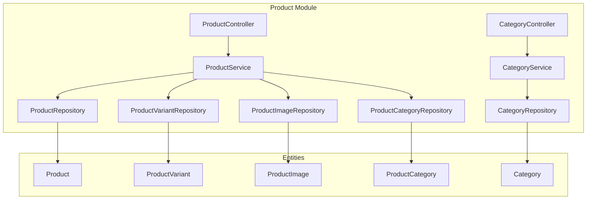
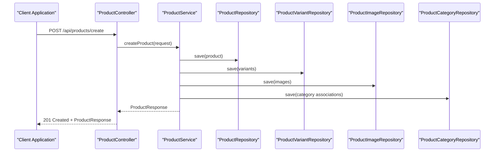
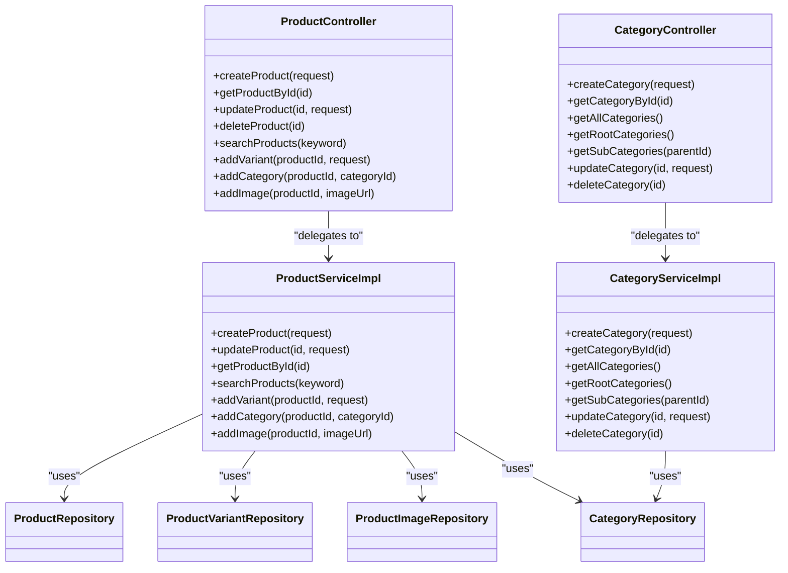

# Product Catalog API

<cite>
**Referenced Files in This Document**
- [ProductController.java](file://src/Backend/src/main/java/com/shoppeclone/backend/product/controller/ProductController.java)
- [CategoryController.java](file://src/Backend/src/main/java/com/shoppeclone/backend/product/controller/CategoryController.java)
- [CreateProductRequest.java](file://src/Backend/src/main/java/com/shoppeclone/backend/product/dto/request/CreateProductRequest.java)
- [UpdateProductRequest.java](file://src/Backend/src/main/java/com/shoppeclone/backend/product/dto/request/UpdateProductRequest.java)
- [CreateCategoryRequest.java](file://src/Backend/src/main/java/com/shoppeclone/backend/product/dto/request/CreateCategoryRequest.java)
- [ProductResponse.java](file://src/Backend/src/main/java/com/shoppeclone/backend/product/dto/response/ProductResponse.java)
- [ProductVariantResponse.java](file://src/Backend/src/main/java/com/shoppeclone/backend/product/dto/response/ProductVariantResponse.java)
- [CreateProductVariantRequest.java](file://src/Backend/src/main/java/com/shoppeclone/backend/product/dto/request/CreateProductVariantRequest.java)
- [ProductServiceImpl.java](file://src/Backend/src/main/java/com/shoppeclone/backend/product/service/impl/ProductServiceImpl.java)
- [CategoryServiceImpl.java](file://src/Backend/src/main/java/com/shoppeclone/backend/product/service/impl/CategoryServiceImpl.java)
- [Category.java](file://src/Backend/src/main/java/com/shoppeclone/backend/product/entity/Category.java)
- [Product.java](file://src/Backend/src/main/java/com/shoppeclone/backend/product/entity/Product.java)
- [ProductVariant.java](file://src/Backend/src/main/java/com/shoppeclone/backend/product/entity/ProductVariant.java)
- [ProductImage.java](file://src/Backend/src/main/java/com/shoppeclone/backend/product/entity/ProductImage.java)
- [ProductStatus.java](file://src/Backend/src/main/java/com/shoppeclone/backend/product/entity/ProductStatus.java)
- [ProductCategory.java](file://src/Backend/src/main/java/com/shoppeclone/backend/product/entity/ProductCategory.java)
- [ProductRepository.java](file://src/Backend/src/main/java/com/shoppeclone/backend/product/repository/ProductRepository.java)
- [CategoryRepository.java](file://src/Backend/src/main/java/com/shoppeclone/backend/product/repository/CategoryRepository.java)
- [ProductVariantRepository.java](file://src/Backend/src/main/java/com/shoppeclone/backend/product/repository/ProductVariantRepository.java)
- [ProductImageRepository.java](file://src/Backend/src/main/java/com/shoppeclone/backend/product/repository/ProductImageRepository.java)
- [ProductCategoryRepository.java](file://src/Backend/src/main/java/com/shoppeclone/backend/product/repository/ProductCategoryRepository.java)
- [CategoryDetectionUtil.java](file://src/Backend/src/main/java/com/shoppeclone/backend/product/util/CategoryDetectionUtil.java)
</cite>

## Table of Contents
1. [Introduction](#introduction)
2. [Project Structure](#project-structure)
3. [Core Components](#core-components)
4. [Architecture Overview](#architecture-overview)
5. [Detailed Component Analysis](#detailed-component-analysis)
6. [Dependency Analysis](#dependency-analysis)
7. [Performance Considerations](#performance-considerations)
8. [Troubleshooting Guide](#troubleshooting-guide)
9. [Conclusion](#conclusion)

## Introduction
This document provides comprehensive API documentation for product and category management in the backend system. It covers product CRUD operations, search and filtering, category management, and product variant handling. It also documents product image upload, category hierarchies, inventory tracking, and product status management. The documentation includes request and response schemas, endpoint definitions, and practical examples for common operations.

## Project Structure
The product and category management functionality is organized under the product module with clear separation of concerns:
- Controllers handle HTTP requests and responses
- Services encapsulate business logic
- Repositories manage data persistence
- DTOs define request/response contracts
- Entities represent domain models

**Diagram sources**
- [ProductController.java:18-22](file://src/Backend/src/main/java/com/shoppeclone/backend/product/controller/ProductController.java#L18-L22)
- [CategoryController.java:14-18](file://src/Backend/src/main/java/com/shoppeclone/backend/product/controller/CategoryController.java#L14-L18)

**Section sources**
- [ProductController.java:1-163](file://src/Backend/src/main/java/com/shoppeclone/backend/product/controller/ProductController.java#L1-L163)
- [CategoryController.java:1-60](file://src/Backend/src/main/java/com/shoppeclone/backend/product/controller/CategoryController.java#L1-L60)

## Core Components
This section outlines the primary components involved in product and category management, including their responsibilities and key interactions.

### Product Management
- ProductController: Exposes REST endpoints for product CRUD, search, variants, categories, and images
- ProductService: Implements business logic for product operations, variant management, and category associations
- ProductRepository: Handles MongoDB persistence for products
- ProductVariantRepository: Manages product variant records
- ProductImageRepository: Stores product image metadata
- ProductCategoryRepository: Links products to categories

### Category Management
- CategoryController: Provides endpoints for category creation, retrieval, updates, and deletion
- CategoryService: Implements category hierarchy logic and validation
- CategoryRepository: Manages hierarchical category data in MongoDB

### Data Transfer Objects
- CreateProductRequest: Defines product creation payload
- UpdateProductRequest: Defines product update payload
- CreateCategoryRequest: Defines category creation payload
- ProductResponse: Standardized product response format
- ProductVariantResponse: Variant-specific response structure

**Section sources**
- [ProductController.java:18-22](file://src/Backend/src/main/java/com/shoppeclone/backend/product/controller/ProductController.java#L18-L22)
- [CategoryController.java:14-18](file://src/Backend/src/main/java/com/shoppeclone/backend/product/controller/CategoryController.java#L14-L18)
- [ProductServiceImpl.java:1-200](file://src/Backend/src/main/java/com/shoppeclone/backend/product/service/impl/ProductServiceImpl.java#L1-L200)
- [CategoryServiceImpl.java:1-39](file://src/Backend/src/main/java/com/shoppeclone/backend/product/service/impl/CategoryServiceImpl.java#L1-L39)

## Architecture Overview
The system follows a layered architecture with clear separation between presentation, business logic, and data access layers. The product and category modules are self-contained with their own controllers, services, repositories, and entities.

**Diagram sources**
- [ProductController.java:26-29](file://src/Backend/src/main/java/com/shoppeclone/backend/product/controller/ProductController.java#L26-L29)
- [ProductServiceImpl.java:100-127](file://src/Backend/src/main/java/com/shoppeclone/backend/product/service/impl/ProductServiceImpl.java#L100-L127)

**Section sources**
- [ProductController.java:26-29](file://src/Backend/src/main/java/com/shoppeclone/backend/product/controller/ProductController.java#L26-L29)
- [ProductServiceImpl.java:100-127](file://src/Backend/src/main/java/com/shoppeclone/backend/product/service/impl/ProductServiceImpl.java#L100-L127)

## Detailed Component Analysis

### Product CRUD Operations

#### Create Product
The create product endpoint accepts a structured request containing shop association, product details, variants, images, and optional flash sale configuration.

**Endpoint**: `POST /api/products/create`
**Request Body**: CreateProductRequest
**Response**: ProductResponse (201 Created)

Key features:
- Automatic category detection from product name when categoryId is not provided
- Multi-variant support with validation
- Batch image upload capability
- Flash sale configuration support

**Section sources**
- [ProductController.java:26-29](file://src/Backend/src/main/java/com/shoppeclone/backend/product/controller/ProductController.java#L26-L29)
- [CreateProductRequest.java:1-26](file://src/Backend/src/main/java/com/shoppeclone/backend/product/dto/request/CreateProductRequest.java#L1-L26)
- [ProductServiceImpl.java:100-127](file://src/Backend/src/main/java/com/shoppeclone/backend/product/service/impl/ProductServiceImpl.java#L100-L127)

#### Update Product
The update product endpoint allows partial updates to product information while preserving variant IDs for order consistency.

**Endpoint**: `PUT /api/products/{id}`
**Path Parameter**: id (String)
**Request Body**: UpdateProductRequest
**Response**: ProductResponse (200 OK)

Important behavior:
- Preserves existing variant IDs to maintain order history integrity
- Validates variant business keys to prevent duplicates
- Supports variant replacement with new configurations

**Section sources**
- [ProductController.java:63-68](file://src/Backend/src/main/java/com/shoppeclone/backend/product/controller/ProductController.java#L63-L68)
- [UpdateProductRequest.java:1-200](file://src/Backend/src/main/java/com/shoppeclone/backend/product/dto/request/UpdateProductRequest.java#L1-L200)
- [ProductServiceImpl.java:256-270](file://src/Backend/src/main/java/com/shoppeclone/backend/product/service/impl/ProductServiceImpl.java#L256-L270)

#### Delete Product
Permanently removes a product and all associated data.

**Endpoint**: `DELETE /api/products/{id}`
**Path Parameter**: id (String)
**Response**: 204 No Content

Automatic cleanup includes:
- Product variants
- Product images
- Category associations
- Order item references

**Section sources**
- [ProductController.java:70-74](file://src/Backend/src/main/java/com/shoppeclone/backend/product/controller/ProductController.java#L70-L74)

### Product Search and Filtering

#### Basic Search
Searches products by keyword across searchable fields.

**Endpoint**: `GET /api/products/search`
**Query Parameter**: keyword (String)
**Response**: List<ProductResponse> (200 OK)

#### Advanced Filtering
Multiple filter endpoints for different use cases:

**Get by Shop**: `GET /api/products/shop/{shopId}?includeHidden={boolean}`
**Get by Category**: `GET /api/products/category/{categoryId}`
**Get Flash Sale Products**: `GET /api/products/flash-sale`
**Get All Products**: `GET /api/products?sort={optional}`

**Section sources**
- [ProductController.java:48-61](file://src/Backend/src/main/java/com/shoppeclone/backend/product/controller/ProductController.java#L48-L61)

### Category Management

#### Category CRUD Operations
Complete category lifecycle management with hierarchical support.

**Create Category**: `POST /api/categories`
**Get Category**: `GET /api/categories/{id}`
**Get All Categories**: `GET /api/categories`
**Get Root Categories**: `GET /api/categories/root`
**Get Subcategories**: `GET /api/categories/{parentId}/subcategories`
**Update Category**: `PUT /api/categories/{id}`
**Delete Category**: `DELETE /api/categories/{id}`

**Section sources**
- [CategoryController.java:22-58](file://src/Backend/src/main/java/com/shoppeclone/backend/product/controller/CategoryController.java#L22-L58)
- [CategoryServiceImpl.java:18-39](file://src/Backend/src/main/java/com/shoppeclone/backend/product/service/impl/CategoryServiceImpl.java#L18-L39)

### Product Variant Handling

#### Variant Management
Full CRUD support for product variants with inventory tracking.

**Add Variant**: `POST /api/products/{productId}/variants`
**Remove Variant**: `DELETE /api/products/variants/{variantId}`
**Get Variant**: `GET /api/products/variant/{variantId}`
**Update Variant Stock**: `PATCH /api/products/variant/{variantId}/stock?stock={integer}`

Variant characteristics:
- Size and color attributes
- Independent pricing and stock
- Preserved IDs for order consistency
- Image association support

**Section sources**
- [ProductController.java:100-128](file://src/Backend/src/main/java/com/shoppeclone/backend/product/controller/ProductController.java#L100-L128)

### Product Image Upload

#### Image Management
Supports both URL-based and direct upload approaches for product images.

**Add Image**: `POST /api/products/{productId}/images`
**Remove Image**: `DELETE /api/products/images/{imageId}`

Image features:
- Display ordering preservation
- Automatic cleanup on product updates
- Multiple image support per product

**Section sources**
- [ProductController.java:147-161](file://src/Backend/src/main/java/com/shoppeclone/backend/product/controller/ProductController.java#L147-L161)

### Product Status Management

#### Visibility and Promotion Controls
Dynamic product status management for visibility and flash sale participation.

**Update Status**: `PATCH /api/products/{id}`
**Supported Updates**:
- `status`: Product visibility (enum)
- `isFlashSale`: Flash sale participation flag

**Section sources**
- [ProductController.java:76-98](file://src/Backend/src/main/java/com/shoppeclone/backend/product/controller/ProductController.java#L76-L98)

## Dependency Analysis

**Diagram sources**
- [ProductController.java:18-22](file://src/Backend/src/main/java/com/shoppeclone/backend/product/controller/ProductController.java#L18-L22)
- [CategoryController.java:14-18](file://src/Backend/src/main/java/com/shoppeclone/backend/product/controller/CategoryController.java#L14-L18)
- [ProductServiceImpl.java:1-50](file://src/Backend/src/main/java/com/shoppeclone/backend/product/service/impl/ProductServiceImpl.java#L1-L50)
- [CategoryServiceImpl.java:1-20](file://src/Backend/src/main/java/com/shoppeclone/backend/product/service/impl/CategoryServiceImpl.java#L1-L20)

**Section sources**
- [ProductController.java:18-22](file://src/Backend/src/main/java/com/shoppeclone/backend/product/controller/ProductController.java#L18-L22)
- [CategoryController.java:14-18](file://src/Backend/src/main/java/com/shoppeclone/backend/product/controller/CategoryController.java#L14-L18)

## Performance Considerations
- **Indexing Strategy**: CategoryRepository includes regex-based search for suggestions, supporting efficient category name lookups
- **Batch Operations**: Product creation supports batch variant and image processing for optimal throughput
- **Memory Management**: Variant ID preservation prevents unnecessary re-indexing during updates
- **Caching Opportunities**: Category hierarchies and product aggregations can benefit from caching layers
- **Connection Pooling**: MongoDB repository usage supports connection pooling for concurrent operations

## Troubleshooting Guide

### Common Issues and Solutions

#### Product Not Found
**Symptoms**: 404 errors when retrieving products
**Causes**: Invalid product ID or soft-deleted records
**Solutions**: Verify product ID format and existence in database

#### Variant Validation Errors
**Symptoms**: 400 errors during variant creation
**Causes**: Duplicate business keys or missing required fields
**Solutions**: Ensure unique size/color combinations and provide required fields

#### Category Hierarchy Issues
**Symptoms**: Infinite loops or orphaned categories
**Causes**: Circular parent-child relationships
**Solutions**: Validate parentId references against existing categories

#### Image Upload Failures
**Symptoms**: 500 errors during image operations
**Causes**: Invalid URLs or storage service issues
**Solutions**: Validate image URLs and check cloud storage connectivity

**Section sources**
- [ProductServiceImpl.java:129-134](file://src/Backend/src/main/java/com/shoppeclone/backend/product/service/impl/ProductServiceImpl.java#L129-L134)
- [CategoryServiceImpl.java:28-32](file://src/Backend/src/main/java/com/shoppeclone/backend/product/service/impl/CategoryServiceImpl.java#L28-L32)

## Conclusion
The Product Catalog API provides a comprehensive, scalable solution for e-commerce product and category management. Its modular architecture supports efficient operations, maintains data integrity through careful variant ID preservation, and offers flexible category hierarchies. The API's design accommodates complex product configurations while maintaining performance and developer usability.