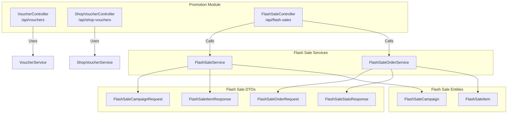
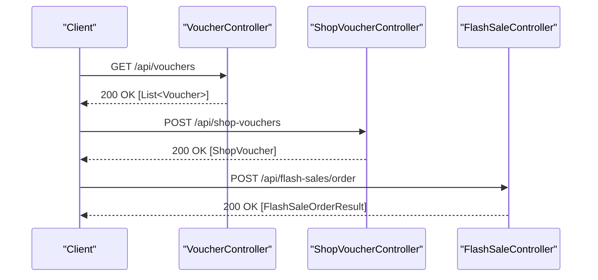
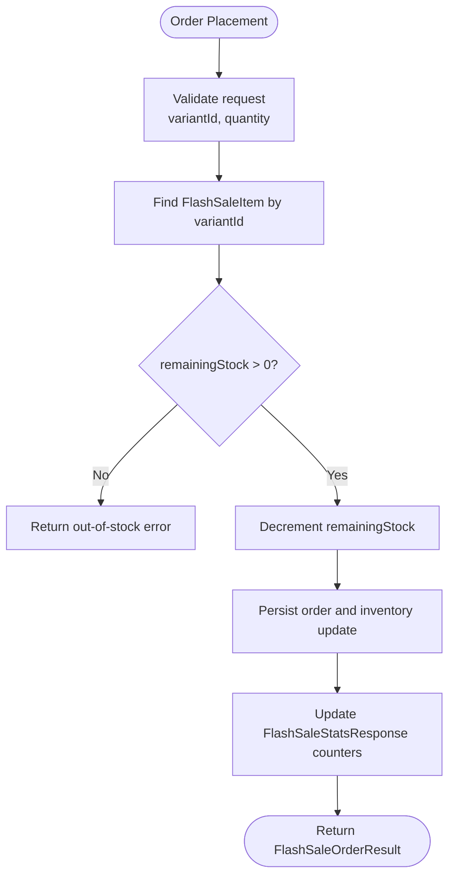
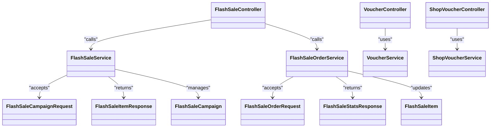

# Promotions & Discounts API

<cite>
**Referenced Files in This Document**
- [VoucherController.java](file://src/Backend/src/main/java/com/shoppeclone/backend/promotion/controller/VoucherController.java)
- [ShopVoucherController.java](file://src/Backend/src/main/java/com/shoppeclone/backend/promotion/controller/ShopVoucherController.java)
- [FlashSaleController.java](file://src/Backend/src/main/java/com/shoppeclone/backend/promotion/flashsale/controller/FlashSaleController.java)
- [FlashSaleCampaignRequest.java](file://src/Backend/src/main/java/com/shoppeclone/backend/promotion/flashsale/dto/FlashSaleCampaignRequest.java)
- [FlashSaleOrderRequest.java](file://src/Backend/src/main/java/com/shoppeclone/backend/promotion/flashsale/dto/FlashSaleOrderRequest.java)
- [FlashSaleStatsResponse.java](file://src/Backend/src/main/java/com/shoppeclone/backend/promotion/flashsale/dto/FlashSaleStatsResponse.java)
- [FlashSaleItemResponse.java](file://src/Backend/src/main/java/com/shoppeclone/backend/promotion/flashsale/dto/FlashSaleItemResponse.java)
- [FlashSaleService.java](file://src/Backend/src/main/java/com/shoppeclone/backend/promotion/flashsale/service/FlashSaleService.java)
- [FlashSaleOrderService.java](file://src/Backend/src/main/java/com/shoppeclone/backend/promotion/flashsale/service/FlashSaleOrderService.java)
- [FlashSaleCampaign.java](file://src/Backend/src/main/java/com/shoppeclone/backend/promotion/flashsale/entity/FlashSaleCampaign.java)
- [FlashSaleItem.java](file://src/Backend/src/main/java/com/shoppeclone/backend/promotion/flashsale/entity/FlashSaleItem.java)
</cite>

## Table of Contents
1. [Introduction](#introduction)
2. [Project Structure](#project-structure)
3. [Core Components](#core-components)
4. [Architecture Overview](#architecture-overview)
5. [Detailed Component Analysis](#detailed-component-analysis)
6. [Dependency Analysis](#dependency-analysis)
7. [Performance Considerations](#performance-considerations)
8. [Troubleshooting Guide](#troubleshooting-guide)
9. [Conclusion](#conclusion)
10. [Appendices](#appendices)

## Introduction
This document provides API documentation for promotions and discounts, covering:
- Voucher management for general platform-wide discounts
- Shop-specific discount management for sellers
- Flash sale functionality including campaigns, registrations, slots, and order processing

It documents endpoints, request/response schemas, discount calculation principles, timing controls, stock allocation, and promotional campaign lifecycle. It also includes practical examples for voucher redemption and flash sale participation.

## Project Structure
The relevant modules are organized under the promotion package with dedicated controllers, DTOs, entities, repositories, and services for both vouchers and flash sales.

**Diagram sources**
- [VoucherController.java:15-45](file://src/Backend/src/main/java/com/shoppeclone/backend/promotion/controller/VoucherController.java#L15-L45)
- [ShopVoucherController.java:11-45](file://src/Backend/src/main/java/com/shoppeclone/backend/promotion/controller/ShopVoucherController.java#L11-L45)
- [FlashSaleController.java:33-198](file://src/Backend/src/main/java/com/shoppeclone/backend/promotion/flashsale/controller/FlashSaleController.java#L33-L198)
- [FlashSaleService.java:11-63](file://src/Backend/src/main/java/com/shoppeclone/backend/promotion/flashsale/service/FlashSaleService.java#L11-L63)
- [FlashSaleOrderService.java:9-18](file://src/Backend/src/main/java/com/shoppeclone/backend/promotion/flashsale/service/FlashSaleOrderService.java#L9-L18)
- [FlashSaleCampaignRequest.java:6-16](file://src/Backend/src/main/java/com/shoppeclone/backend/promotion/flashsale/dto/FlashSaleCampaignRequest.java#L6-L16)
- [FlashSaleOrderRequest.java:5-11](file://src/Backend/src/main/java/com/shoppeclone/backend/promotion/flashsale/dto/FlashSaleOrderRequest.java#L5-L11)
- [FlashSaleStatsResponse.java:11-59](file://src/Backend/src/main/java/com/shoppeclone/backend/promotion/flashsale/dto/FlashSaleStatsResponse.java#L11-L59)
- [FlashSaleItemResponse.java:7-32](file://src/Backend/src/main/java/com/shoppeclone/backend/promotion/flashsale/dto/FlashSaleItemResponse.java#L7-L32)
- [FlashSaleCampaign.java:9-31](file://src/Backend/src/main/java/com/shoppeclone/backend/promotion/flashsale/entity/FlashSaleCampaign.java#L9-L31)
- [FlashSaleItem.java:10-38](file://src/Backend/src/main/java/com/shoppeclone/backend/promotion/flashsale/entity/FlashSaleItem.java#L10-L38)

**Section sources**
- [VoucherController.java:15-45](file://src/Backend/src/main/java/com/shoppeclone/backend/promotion/controller/VoucherController.java#L15-L45)
- [ShopVoucherController.java:11-45](file://src/Backend/src/main/java/com/shoppeclone/backend/promotion/controller/ShopVoucherController.java#L11-L45)
- [FlashSaleController.java:33-198](file://src/Backend/src/main/java/com/shoppeclone/backend/promotion/flashsale/controller/FlashSaleController.java#L33-L198)

## Core Components
- VoucherController: Provides endpoints to list, create, and query platform-wide vouchers and to fetch used codes per user.
- ShopVoucherController: Enables sellers to manage shop-specific vouchers (CRUD) and query by code.
- FlashSaleController: Admin and seller endpoints for campaign management, slot creation, product registration, order placement, and statistics retrieval.

Key responsibilities:
- Voucher operations: listing, creation, code lookup, and used-code reporting by user.
- Shop-specific discount management: CRUD for shop vouchers and code-based lookup.
- Flash sale lifecycle: campaigns, slots, registrations, approvals, orders, and monitoring stats.

**Section sources**
- [VoucherController.java:23-43](file://src/Backend/src/main/java/com/shoppeclone/backend/promotion/controller/VoucherController.java#L23-L43)
- [ShopVoucherController.java:18-43](file://src/Backend/src/main/java/com/shoppeclone/backend/promotion/controller/ShopVoucherController.java#L18-L43)
- [FlashSaleController.java:42-197](file://src/Backend/src/main/java/com/shoppeclone/backend/promotion/flashsale/controller/FlashSaleController.java#L42-L197)

## Architecture Overview
The APIs follow a layered architecture:
- Controllers expose REST endpoints
- Services encapsulate business logic
- DTOs define request/response contracts
- Entities represent persisted data

**Diagram sources**
- [VoucherController.java:23-26](file://src/Backend/src/main/java/com/shoppeclone/backend/promotion/controller/VoucherController.java#L23-L26)
- [ShopVoucherController.java:23-26](file://src/Backend/src/main/java/com/shoppeclone/backend/promotion/controller/ShopVoucherController.java#L23-L26)
- [FlashSaleController.java:179-183](file://src/Backend/src/main/java/com/shoppeclone/backend/promotion/flashsale/controller/FlashSaleController.java#L179-L183)

## Detailed Component Analysis

### Voucher Management API
Endpoints:
- GET /api/vouchers
  - Description: Retrieve all platform-wide vouchers
  - Response: 200 OK with array of vouchers
- GET /api/vouchers/used-codes
  - Description: Get used voucher codes for the authenticated user
  - Response: 200 OK with array of code strings
- POST /api/vouchers
  - Description: Create a new platform-wide voucher
  - Request body: Voucher entity
  - Response: 200 OK with created voucher
- GET /api/vouchers/code/{code}
  - Description: Lookup a voucher by code
  - Response: 200 OK with voucher

Notes:
- Discount calculation and validity checks are handled by the service layer.
- Access control depends on authentication and roles as enforced by Spring Security.

**Section sources**
- [VoucherController.java:23-43](file://src/Backend/src/main/java/com/shoppeclone/backend/promotion/controller/VoucherController.java#L23-L43)

### Shop-Specific Discount API
Endpoints:
- GET /api/shop-vouchers/shop/{shopId}
  - Description: List shop-specific vouchers for a given shop
  - Response: 200 OK with array of shop vouchers
- POST /api/shop-vouchers
  - Description: Create a shop-specific voucher
  - Request body: ShopVoucher entity
  - Response: 200 OK with created shop voucher
- PUT /api/shop-vouchers/{id}
  - Description: Update a shop voucher
  - Request body: ShopVoucher entity
  - Response: 200 OK with updated shop voucher
- GET /api/shop-vouchers/code/{code}
  - Description: Lookup a shop voucher by code
  - Response: 200 OK with shop voucher
- DELETE /api/shop-vouchers/{id}
  - Description: Delete a shop voucher
  - Response: 200 OK

Notes:
- Stock and discount logic are managed by the service layer.
- Sellers can manage their own shop-specific offers.

**Section sources**
- [ShopVoucherController.java:18-43](file://src/Backend/src/main/java/com/shoppeclone/backend/promotion/controller/ShopVoucherController.java#L18-L43)

### Flash Sale API

#### Endpoints Overview
- GET /api/flash-sales/current
  - Description: Get current active flash sale
  - Response: 200 OK with FlashSale or 204 No Content
- GET /api/flash-sales/{flashSaleId}/items
  - Description: List items participating in a flash sale
  - Response: 200 OK with array of FlashSaleItemResponse
- GET /api/flash-sales/campaigns/open
  - Description: List open campaigns (SELLER role)
  - Response: 200 OK with array of FlashSaleCampaign
- POST /api/flash-sales/campaigns
  - Description: Create a campaign (ADMIN role)
  - Request: FlashSaleCampaignRequest
  - Response: 200 OK with created campaign
- GET /api/flash-sales/campaigns
  - Description: List all campaigns (ADMIN role)
  - Response: 200 OK with array of campaigns
- PUT /api/flash-sales/campaigns/{id}
  - Description: Update a campaign (ADMIN role)
  - Request: FlashSaleCampaignRequest
  - Response: 200 OK with updated campaign
- DELETE /api/flash-sales/campaigns/{id}
  - Description: Delete a campaign (ADMIN role)
  - Response: 204 No Content
- GET /api/flash-sales/campaigns/{id}/items
  - Description: List items in a campaign (ADMIN role)
  - Response: 200 OK with array of FlashSaleItemResponse
- GET /api/flash-sales/campaigns/{id}/monitor
  - Description: Get monitoring stats for a campaign (ADMIN role)
  - Response: 200 OK with FlashSaleStatsResponse
- POST /api/flash-sales/slots
  - Description: Create a slot (ADMIN role)
  - Request: FlashSaleSlotRequest
  - Response: 200 OK with created slot
- DELETE /api/flash-sales/slots/{id}
  - Description: Delete a slot (ADMIN role)
  - Response: 204 No Content
- GET /api/flash-sales/slots/{campaignId}
  - Description: List slots by campaign (ADMIN/SELLER role)
  - Response: 200 OK with array of slots
- PUT /api/flash-sales/registrations/{id}/approve
  - Description: Approve a product registration (ADMIN role)
  - Request: ApproveRegistrationRequest
  - Response: 200 OK with approved FlashSaleItem
- GET /api/flash-sales/registrations/status/{status}
  - Description: Filter registrations by status (ADMIN role)
  - Response: 200 OK with array of FlashSaleItemResponse
- GET /api/flash-sales/registrations/slot/{slotId}
  - Description: Filter registrations by slot (ADMIN role)
  - Response: 200 OK with array of FlashSaleItemResponse
- POST /api/flash-sales/registrations
  - Description: Register a product for a slot (SELLER role)
  - Request: FlashSaleRegistrationRequest
  - Response: 200 OK with registered FlashSaleItem
- GET /api/flash-sales/registrations/my
  - Description: List my registrations (SELLER role)
  - Response: 200 OK with array of FlashSaleItem
- GET /api/flash-sales/registrations/my-detail
  - Description: List my registration details (SELLER role)
  - Response: 200 OK with array of FlashSaleItemResponse
- POST /api/flash-sales/campaigns/{id}/emergency-stop
  - Description: Emergency stop a campaign (ADMIN role)
  - Response: 200 OK
- POST /api/flash-sales/slots/{id}/emergency-stop
  - Description: Emergency stop a slot (ADMIN role)
  - Response: 200 OK
- DELETE /api/flash-sales/{id}
  - Description: Delete a flash sale (ADMIN role)
  - Response: 204 No Content
- POST /api/flash-sales/order
  - Description: Place a flash sale order
  - Request: FlashSaleOrderRequest
  - Response: 200 OK with FlashSaleOrderResult
- GET /api/flash-sales/stats/{flashSaleId}
  - Description: Get flash sale stats (ADMIN role)
  - Response: 200 OK with FlashSaleStatsResponse
- GET /api/flash-sales/stats/shop/my
  - Description: Get my shop’s flash sale stats (SELLER role)
  - Response: 200 OK with array of FlashSaleStatsResponse

**Section sources**
- [FlashSaleController.java:42-197](file://src/Backend/src/main/java/com/shoppeclone/backend/promotion/flashsale/controller/FlashSaleController.java#L42-L197)

#### Request/Response Schemas

##### FlashSaleCampaignRequest
- Fields:
  - name: string
  - description: string
  - startDate: datetime
  - endDate: datetime
  - minDiscountPercentage: integer
  - minStockPerProduct: integer
  - registrationDeadline: datetime
  - approvalDeadline: datetime

**Section sources**
- [FlashSaleCampaignRequest.java:6-16](file://src/Backend/src/main/java/com/shoppeclone/backend/promotion/flashsale/dto/FlashSaleCampaignRequest.java#L6-L16)

##### FlashSaleOrderRequest
- Fields:
  - variantId: string
  - quantity: integer
  - note: string (optional)

**Section sources**
- [FlashSaleOrderRequest.java:5-11](file://src/Backend/src/main/java/com/shoppeclone/backend/promotion/flashsale/dto/FlashSaleOrderRequest.java#L5-L11)

##### FlashSaleStatsResponse
- Top-level fields:
  - flashSaleId: string
  - campaignId: string
  - flashSaleStatus: string
  - startTime: string
  - endTime: string
  - totalItems: integer
  - totalSaleStock: integer
  - totalRemainingStock: integer
  - totalSold: integer
  - soldPercentage: number
  - totalRequests: integer
  - successCount: integer
  - outOfStockCount: integer
  - errorCount: integer
  - avgResponseMs: integer
  - minResponseMs: integer
  - maxResponseMs: integer
  - integrityCheckPassed: boolean
  - monitorStatus: string
  - monitorStartedAt: string
  - lastRequestAt: string
  - items: array of ItemStats
- ItemStats fields:
  - itemId: string
  - productId: string
  - variantId: string
  - shopId: string
  - salePrice: decimal
  - saleStock: integer
  - remainingStock: integer
  - sold: integer
  - soldPercentage: number
  - status: string

**Section sources**
- [FlashSaleStatsResponse.java:11-59](file://src/Backend/src/main/java/com/shoppeclone/backend/promotion/flashsale/dto/FlashSaleStatsResponse.java#L11-L59)

##### FlashSaleItemResponse
- Fields:
  - id: string
  - flashSaleId: string
  - campaignId: string
  - campaignName: string
  - slotStartTime: datetime
  - slotEndTime: datetime
  - productId: string
  - productName: string
  - productImage: string
  - variantId: string
  - variantName: string
  - originalPrice: decimal
  - salePrice: decimal
  - saleStock: integer
  - remainingStock: integer
  - status: string
  - adminNote: string
  - shopId: string
  - shopName: string
  - createdAt: datetime
  - updatedAt: datetime
  - approvalDeadline: datetime

**Section sources**
- [FlashSaleItemResponse.java:7-32](file://src/Backend/src/main/java/com/shoppeclone/backend/promotion/flashsale/dto/FlashSaleItemResponse.java#L7-L32)

#### Business Logic Highlights

##### Discount Calculation
- Flash sale price is stored per item during registration/approval.
- The effective discount is computed client-side as a percentage difference between original price and sale price.
- Minimum discount percentage is configurable per campaign and enforced via campaign rules.

##### Flash Sale Timing
- Campaigns have start/end dates and deadlines for registration and approval.
- Slots define the actual sale windows; items are associated with a slot.
- Status transitions are governed by campaign and slot timing.

##### Stock Allocation
- Each FlashSaleItem defines saleStock and remainingStock.
- Orders decrement remainingStock atomically; out-of-stock conditions are tracked in stats.

##### Promotional Campaign Management
- Admin creates and manages campaigns, sets thresholds, and monitors performance.
- Sellers can register products into open campaigns; admins approve or reject registrations.

**Diagram sources**
- [FlashSaleOrderRequest.java:5-11](file://src/Backend/src/main/java/com/shoppeclone/backend/promotion/flashsale/dto/FlashSaleOrderRequest.java#L5-L11)
- [FlashSaleItem.java:12-38](file://src/Backend/src/main/java/com/shoppeclone/backend/promotion/flashsale/entity/FlashSaleItem.java#L12-L38)
- [FlashSaleStatsResponse.java:11-59](file://src/Backend/src/main/java/com/shoppeclone/backend/promotion/flashsale/dto/FlashSaleStatsResponse.java#L11-L59)

**Section sources**
- [FlashSaleService.java:11-63](file://src/Backend/src/main/java/com/shoppeclone/backend/promotion/flashsale/service/FlashSaleService.java#L11-L63)
- [FlashSaleOrderService.java:9-18](file://src/Backend/src/main/java/com/shoppeclone/backend/promotion/flashsale/service/FlashSaleOrderService.java#L9-L18)
- [FlashSaleCampaign.java:11-31](file://src/Backend/src/main/java/com/shoppeclone/backend/promotion/flashsale/entity/FlashSaleCampaign.java#L11-L31)
- [FlashSaleItem.java:12-38](file://src/Backend/src/main/java/com/shoppeclone/backend/promotion/flashsale/entity/FlashSaleItem.java#L12-L38)

## Dependency Analysis
Controllers depend on services; services depend on DTOs and entities. Flash sale endpoints coordinate between campaign, slot, registration, and order services.

**Diagram sources**
- [VoucherController.java:15-45](file://src/Backend/src/main/java/com/shoppeclone/backend/promotion/controller/VoucherController.java#L15-L45)
- [ShopVoucherController.java:11-45](file://src/Backend/src/main/java/com/shoppeclone/backend/promotion/controller/ShopVoucherController.java#L11-L45)
- [FlashSaleController.java:33-198](file://src/Backend/src/main/java/com/shoppeclone/backend/promotion/flashsale/controller/FlashSaleController.java#L33-L198)
- [FlashSaleService.java:11-63](file://src/Backend/src/main/java/com/shoppeclone/backend/promotion/flashsale/service/FlashSaleService.java#L11-L63)
- [FlashSaleOrderService.java:9-18](file://src/Backend/src/main/java/com/shoppeclone/backend/promotion/flashsale/service/FlashSaleOrderService.java#L9-L18)
- [FlashSaleCampaignRequest.java:6-16](file://src/Backend/src/main/java/com/shoppeclone/backend/promotion/flashsale/dto/FlashSaleCampaignRequest.java#L6-L16)
- [FlashSaleOrderRequest.java:5-11](file://src/Backend/src/main/java/com/shoppeclone/backend/promotion/flashsale/dto/FlashSaleOrderRequest.java#L5-L11)
- [FlashSaleStatsResponse.java:11-59](file://src/Backend/src/main/java/com/shoppeclone/backend/promotion/flashsale/dto/FlashSaleStatsResponse.java#L11-L59)
- [FlashSaleItemResponse.java:7-32](file://src/Backend/src/main/java/com/shoppeclone/backend/promotion/flashsale/dto/FlashSaleItemResponse.java#L7-L32)
- [FlashSaleCampaign.java:11-31](file://src/Backend/src/main/java/com/shoppeclone/backend/promotion/flashsale/entity/FlashSaleCampaign.java#L11-L31)
- [FlashSaleItem.java:12-38](file://src/Backend/src/main/java/com/shoppeclone/backend/promotion/flashsale/entity/FlashSaleItem.java#L12-L38)

**Section sources**
- [FlashSaleController.java:33-198](file://src/Backend/src/main/java/com/shoppeclone/backend/promotion/flashsale/controller/FlashSaleController.java#L33-L198)
- [FlashSaleService.java:11-63](file://src/Backend/src/main/java/com/shoppeclone/backend/promotion/flashsale/service/FlashSaleService.java#L11-L63)
- [FlashSaleOrderService.java:9-18](file://src/Backend/src/main/java/com/shoppeclone/backend/promotion/flashsale/service/FlashSaleOrderService.java#L9-L18)

## Performance Considerations
- Use pagination for listing campaigns and items when data volumes grow.
- Indexes on FlashSaleItem fields (flashSaleId, variantId, productId, shopId) improve query performance.
- Monitor FlashSaleStatsResponse metrics to detect hotspots and adjust capacity.
- Batch operations for bulk registration or updates should be considered for high-volume scenarios.

## Troubleshooting Guide
Common issues and resolutions:
- Unauthorized access: Ensure proper roles (ADMIN, SELLER) for protected endpoints.
- Invalid timing: Verify campaign and slot dates; registrations must respect deadlines.
- Out-of-stock errors: Check remainingStock and sold counts in FlashSaleStatsResponse.
- Registration rejections: Confirm approval deadlines and item configurations.

**Section sources**
- [FlashSaleController.java:54-134](file://src/Backend/src/main/java/com/shoppeclone/backend/promotion/flashsale/controller/FlashSaleController.java#L54-L134)
- [FlashSaleStatsResponse.java:15-59](file://src/Backend/src/main/java/com/shoppeclone/backend/promotion/flashsale/dto/FlashSaleStatsResponse.java#L15-L59)

## Conclusion
The promotions and discounts module provides robust APIs for platform-wide and shop-specific vouchers, along with a comprehensive flash sale system. Administrators can manage campaigns and slots, sellers can register products, and customers can participate in flash sales with transparent pricing and real-time statistics.

## Appendices

### Example Workflows

#### Voucher Redemption
- Endpoint: GET /api/vouchers/code/{code}
- Steps:
  - Lookup voucher by code
  - Validate usage constraints (time, user eligibility)
  - Apply discount to cart/order
- Expected outcome: 200 OK with voucher details

**Section sources**
- [VoucherController.java:40-43](file://src/Backend/src/main/java/com/shoppeclone/backend/promotion/controller/VoucherController.java#L40-L43)

#### Flash Sale Participation
- Endpoint: POST /api/flash-sales/order
- Steps:
  - Submit FlashSaleOrderRequest with variantId and quantity
  - System validates availability and applies flash price
  - Returns FlashSaleOrderResult with order status and details
- Expected outcome: 200 OK with order result

**Section sources**
- [FlashSaleController.java:179-183](file://src/Backend/src/main/java/com/shoppeclone/backend/promotion/flashsale/controller/FlashSaleController.java#L179-L183)
- [FlashSaleOrderRequest.java:5-11](file://src/Backend/src/main/java/com/shoppeclone/backend/promotion/flashsale/dto/FlashSaleOrderRequest.java#L5-L11)

#### Promotional Pricing
- Effective discount = ((originalPrice - salePrice) / originalPrice) * 100
- Minimum discount enforced per campaign rules
- Stock allocation ensures fair distribution during peak demand

**Section sources**
- [FlashSaleItemResponse.java:20-22](file://src/Backend/src/main/java/com/shoppeclone/backend/promotion/flashsale/dto/FlashSaleItemResponse.java#L20-L22)
- [FlashSaleCampaignRequest.java:12-13](file://src/Backend/src/main/java/com/shoppeclone/backend/promotion/flashsale/dto/FlashSaleCampaignRequest.java#L12-L13)