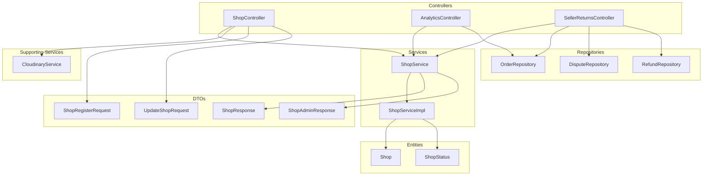
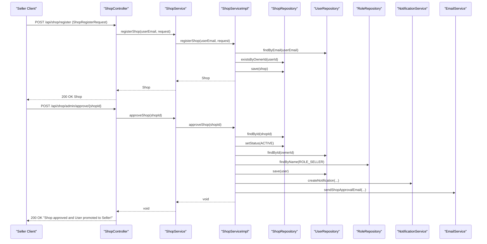
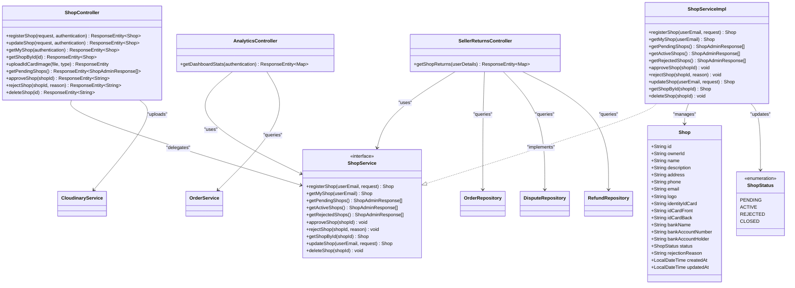
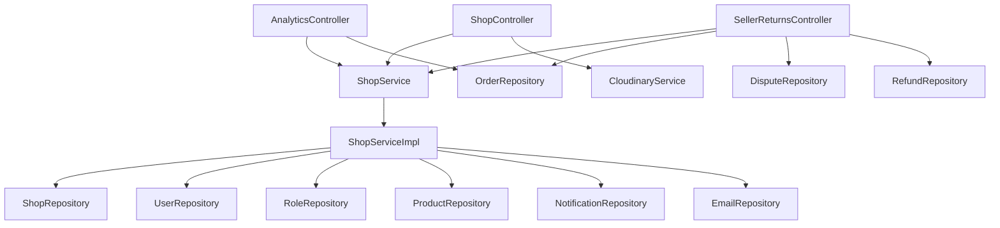

# Shop Management API

<cite>
**Referenced Files in This Document**
- [ShopController.java](file://src\Backend\src\main\java\com\shoppeclone\backend\shop\controller\ShopController.java)
- [AnalyticsController.java](file://src\Backend\src\main\java\com\shoppeclone\backend\shop\controller\AnalyticsController.java)
- [SellerReturnsController.java](file://src\Backend\src\main\java\com\shoppeclone\backend\shop\controller\SellerReturnsController.java)
- [ShopRegisterRequest.java](file://src\Backend\src\main\java\com\shoppeclone\backend\shop\dto\ShopRegisterRequest.java)
- [UpdateShopRequest.java](file://src\Backend\src\main\java\com\shoppeclone\backend\shop\dto\UpdateShopRequest.java)
- [ShopResponse.java](file://src\Backend\src\main\java\com\shoppeclone\backend\shop\dto\response\ShopResponse.java)
- [ShopAdminResponse.java](file://src\Backend\src\main\java\com\shoppeclone\backend\shop\dto\response\ShopAdminResponse.java)
- [ShopService.java](file://src\Backend\src\main\java\com\shoppeclone\backend\shop\service\ShopService.java)
- [ShopServiceImpl.java](file://src\Backend\src\main\java\com\shoppeclone\backend\shop\service\impl\ShopServiceImpl.java)
- [Shop.java](file://src\Backend\src\main\java\com\shoppeclone\backend\shop\entity\Shop.java)
- [ShopStatus.java](file://src\Backend\src\main\java\com\shoppeclone\backend\shop\entity\ShopStatus.java)
- [OrderService.java](file://src\Backend\src\main\java\com\shoppeclone\backend\order\service\OrderService.java)
- [OrderRepository.java](file://src\Backend\src\main\java\com\shoppeclone\backend\order\repository\OrderRepository.java)
- [DisputeRepository.java](file://src\Backend\src\main\java\com\shoppeclone\backend\dispute\repository\DisputeRepository.java)
- [RefundRepository.java](file://src\Backend\src\main\java\com\shoppeclone\backend\refund\repository\RefundRepository.java)
- [CloudinaryService.java](file://src\Backend\src\main\java\com\shoppeclone\backend\common\service\CloudinaryService.java)
- [seller-dashboard.html](file://src\Frontend\seller-dashboard.html)
- [seller-register.html](file://src\Frontend\seller-register.html)
</cite>

## Table of Contents
1. [Introduction](#introduction)
2. [Project Structure](#project-structure)
3. [Core Components](#core-components)
4. [Architecture Overview](#architecture-overview)
5. [Detailed Component Analysis](#detailed-component-analysis)
6. [Dependency Analysis](#dependency-analysis)
7. [Performance Considerations](#performance-considerations)
8. [Troubleshooting Guide](#troubleshooting-guide)
9. [Conclusion](#conclusion)

## Introduction
This document provides comprehensive API documentation for shop management functionality, covering shop registration, updates, analytics, and returns processing. It documents endpoints for shop creation, updates, analytics dashboards, and return/dispute management, along with request/response schemas and operational workflows. The documentation includes shop verification processes, seller dashboard access, sales analytics, and return handling procedures, with practical examples for shop onboarding, performance metrics retrieval, and return processing.

## Project Structure
The shop management feature spans backend controllers, DTOs, services, repositories, and entities, plus frontend pages for seller onboarding and dashboard access. Key components include:
- Controllers: ShopController, AnalyticsController, SellerReturnsController
- DTOs: ShopRegisterRequest, UpdateShopRequest, ShopResponse, ShopAdminResponse
- Services: ShopService interface and ShopServiceImpl implementation
- Entities: Shop, ShopStatus
- Repositories: OrderRepository, DisputeRepository, RefundRepository
- Supporting services: CloudinaryService for image uploads

**Diagram sources**
- [ShopController.java:22-149](file://src\Backend\src\main\java\com\shoppeclone\backend\shop\controller\ShopController.java#L22-L149)
- [AnalyticsController.java:17-73](file://src\Backend\src\main\java\com\shoppeclone\backend\shop\controller\AnalyticsController.java#L17-L73)
- [SellerReturnsController.java:24-58](file://src\Backend\src\main\java\com\shoppeclone\backend\shop\controller\SellerReturnsController.java#L24-L58)
- [ShopService.java:9-30](file://src\Backend\src\main\java\com\shoppeclone\backend\shop\service\ShopService.java#L9-L30)
- [ShopServiceImpl.java:22-252](file://src\Backend\src\main\java\com\shoppeclone\backend\shop\service\impl\ShopServiceImpl.java#L22-L252)
- [ShopRegisterRequest.java:6-32](file://src\Backend\src\main\java\com\shoppeclone\backend\shop\dto\ShopRegisterRequest.java#L6-L32)
- [UpdateShopRequest.java:5-13](file://src\Backend\src\main\java\com\shoppeclone\backend\shop\dto\UpdateShopRequest.java#L5-L13)
- [ShopResponse.java:7-27](file://src\Backend\src\main\java\com\shoppeclone\backend\shop\dto\response\ShopResponse.java#L7-L27)
- [ShopAdminResponse.java:7-23](file://src\Backend\src\main\java\com\shoppeclone\backend\shop\dto\response\ShopAdminResponse.java#L7-L23)
- [Shop.java:12-51](file://src\Backend\src\main\java\com\shoppeclone\backend\shop\entity\Shop.java#L12-L51)
- [ShopStatus.java:3-8](file://src\Backend\src\main\java\com\shoppeclone\backend\shop\entity\ShopStatus.java#L3-L8)
- [OrderRepository.java](file://src\Backend\src\main\java\com\shoppeclone\backend\order\repository\OrderRepository.java)
- [DisputeRepository.java](file://src\Backend\src\main\java\com\shoppeclone\backend\dispute\repository\DisputeRepository.java)
- [RefundRepository.java](file://src\Backend\src\main\java\com\shoppeclone\backend\refund\repository\RefundRepository.java)
- [CloudinaryService.java](file://src\Backend\src\main\java\com\shoppeclone\backend\common\service\CloudinaryService.java)

**Section sources**
- [ShopController.java:22-149](file://src\Backend\src\main\java\com\shoppeclone\backend\shop\controller\ShopController.java#L22-L149)
- [AnalyticsController.java:17-73](file://src\Backend\src\main\java\com\shoppeclone\backend\shop\controller\AnalyticsController.java#L17-L73)
- [SellerReturnsController.java:24-58](file://src\Backend\src\main\java\com\shoppeclone\backend\shop\controller\SellerReturnsController.java#L24-L58)

## Core Components
This section documents the primary API endpoints and their schemas for shop management.

### Shop Registration Endpoint
- Path: `/api/shop/register`
- Method: POST
- Description: Registers a new shop for the authenticated seller. Requires ShopRegisterRequest payload.
- Authentication: Required (Seller context via Authentication principal)
- Response: Shop entity

Request Schema: ShopRegisterRequest
- name: string (required)
- address: string (required)
- phone: string (required)
- email: string (optional)
- description: string (optional)
- identityIdCard: string (optional) - 12-digit ID card number
- bankName: string (optional)
- bankAccountNumber: string (optional)
- bankAccountHolder: string (optional)
- idCardFront: string (optional) - Cloudinary URL
- idCardBack: string (optional) - Cloudinary URL

Response Schema: Shop
- id: string
- ownerId: string
- name: string
- description: string
- address: string
- phone: string
- email: string
- logo: string
- identityIdCard: string
- idCardFront: string
- idCardBack: string
- bankName: string
- bankAccountNumber: string
- bankAccountHolder: string
- status: ShopStatus enum
- rejectionReason: string
- createdAt: datetime
- updatedAt: datetime

Example request payload:
{
  "name": "Example Shop",
  "address": "123 Main St, City, Country",
  "phone": "+1234567890",
  "email": "contact@example.com",
  "description": "Premium products",
  "identityIdCard": "123456789012",
  "bankName": "Bank Name",
  "bankAccountNumber": "ACC123456789",
  "bankAccountHolder": "John Doe",
  "idCardFront": "https://res.cloudinary.com/demo/image/upload/shop_id_cards/front/...",
  "idCardBack": "https://res.cloudinary.com/demo/image/upload/shop_id_cards/back/..."
}

### Shop Update Endpoint
- Path: `/api/shop/my-shop`
- Method: PUT
- Description: Updates shop details for the authenticated seller. Requires UpdateShopRequest payload.
- Authentication: Required
- Response: Shop entity

Request Schema: UpdateShopRequest
- name: string (optional)
- description: string (optional)
- address: string (optional)
- phone: string (optional)
- email: string (optional)
- logo: string (optional)

### Shop Verification Workflow
- Image Upload: `/api/shop/upload-id-card` (multipart/form-data)
  - Parameters:
    - file: image file (required)
    - type: "front" or "back" (required)
  - Response: { url: string, type: string, message: string }
- Registration: Submit ShopRegisterRequest to `/api/shop/register`
- Admin Review: Admin endpoints for pending/active/rejected shops
  - Get pending shops: GET `/api/shop/admin/pending`
  - Approve shop: POST `/api/shop/admin/approve/{shopId}`
  - Reject shop: POST `/api/shop/admin/reject/{shopId}?reason={reason}`
- Promotion: On approval, the shop owner is promoted to ROLE_SELLER and notified

### Analytics Dashboard Endpoint
- Path: `/api/seller/analytics/dashboard-stats`
- Method: GET
- Description: Retrieves seller dashboard statistics including order counts, revenue, and daily revenue trends.
- Authentication: Required (Seller)
- Response: {
  - pendingOrders: integer
  - completedOrders: integer
  - totalRevenue: number
  - revenueByDay: object (date -> amount)
  - orderStatusDistribution: object (status -> count)
}

### Returns and Disputes Endpoint
- Path: `/api/seller/returns`
- Method: GET
- Description: Returns a list of disputes and refunds associated with orders from the seller's shop.
- Authentication: Required (Seller)
- Response: {
  - disputes: array of dispute objects
  - refunds: array of refund objects
}

### Additional Shop Endpoints
- Get current seller's shop: GET `/api/shop/my-shop`
- Get shop by ID: GET `/api/shop/{id}`
- Admin shop deletion: DELETE `/api/shop/admin/delete/{id}`

**Section sources**
- [ShopController.java:39-80](file://src\Backend\src\main\java\com\shoppeclone\backend\shop\controller\ShopController.java#L39-L80)
- [ShopController.java:82-108](file://src\Backend\src\main\java\com\shoppeclone\backend\shop\controller\ShopController.java#L82-L108)
- [ShopController.java:111-148](file://src\Backend\src\main\java\com\shoppeclone\backend\shop\controller\ShopController.java#L111-L148)
- [AnalyticsController.java:25-72](file://src\Backend\src\main\java\com\shoppeclone\backend\shop\controller\AnalyticsController.java#L25-L72)
- [SellerReturnsController.java:37-57](file://src\Backend\src\main\java\com\shoppeclone\backend\shop\controller\SellerReturnsController.java#L37-L57)
- [ShopRegisterRequest.java:7-32](file://src\Backend\src\main\java\com\shoppeclone\backend\shop\dto\ShopRegisterRequest.java#L7-L32)
- [UpdateShopRequest.java:6-13](file://src\Backend\src\main\java\com\shoppeclone\backend\shop\dto\UpdateShopRequest.java#L6-L13)
- [ShopResponse.java:8-27](file://src\Backend\src\main\java\com\shoppeclone\backend\shop\dto\response\ShopResponse.java#L8-L27)
- [ShopAdminResponse.java:8-23](file://src\Backend\src\main\java\com\shoppeclone\backend\shop\dto\response\ShopAdminResponse.java#L8-L23)
- [Shop.java:14-51](file://src\Backend\src\main\java\com\shoppeclone\backend\shop\entity\Shop.java#L14-L51)
- [ShopStatus.java:3-8](file://src\Backend\src\main\java\com\shoppeclone\backend\shop\entity\ShopStatus.java#L3-L8)

## Architecture Overview
The shop management API follows a layered architecture:
- Controllers handle HTTP requests and delegate to services
- Services encapsulate business logic and coordinate with repositories
- DTOs define request/response contracts
- Entities represent persistent data
- Repositories manage data access
- Supporting services (e.g., Cloudinary) handle external integrations

**Diagram sources**
- [ShopController.java:75-80](file://src\Backend\src\main\java\com\shoppeclone\backend\shop\controller\ShopController.java#L75-L80)
- [ShopController.java:127-131](file://src\Backend\src\main\java\com\shoppeclone\backend\shop\controller\ShopController.java#L127-L131)
- [ShopServiceImpl.java:33-66](file://src\Backend\src\main\java\com\shoppeclone\backend\shop\service\impl\ShopServiceImpl.java#L33-L66)
- [ShopServiceImpl.java:95-144](file://src\Backend\src\main\java\com\shoppeclone\backend\shop\service\impl\ShopServiceImpl.java#L95-L144)

## Detailed Component Analysis

### ShopController
Responsibilities:
- Handles shop registration, updates, retrieval, and admin operations
- Provides ID card upload endpoint integrated with Cloudinary
- Secures admin endpoints with pre-authorization

Key endpoints:
- POST /api/shop/register: Creates a shop for the authenticated user
- PUT /api/shop/my-shop: Updates shop details
- GET /api/shop/my-shop: Retrieves current seller's shop
- GET /api/shop/{id}: Retrieves shop by ID
- POST /api/shop/upload-id-card: Uploads ID card images (front/back)
- Admin endpoints: Pending/Active/Rejected shop listings, approve/reject/delete

Security and validation:
- Uses Authentication principal to resolve seller context
- Validates requests using @Valid annotations
- Admin endpoints guarded by method-level security annotations

**Section sources**
- [ShopController.java:22-149](file://src\Backend\src\main\java\com\shoppeclone\backend\shop\controller\ShopController.java#L22-L149)

### AnalyticsController
Responsibilities:
- Computes seller dashboard statistics
- Aggregates order metrics and revenue trends
- Supports order status distribution reporting

Key endpoint:
- GET /api/seller/analytics/dashboard-stats: Returns dashboard metrics

Processing logic:
- Retrieves shop by authenticated seller email
- Loads all orders for the shop
- Counts pending/completed orders
- Sums total revenue from completed orders
- Builds revenue trend for the last 7 days
- Aggregates order status distribution

**Section sources**
- [AnalyticsController.java:17-73](file://src\Backend\src\main\java\com\shoppeclone\backend\shop\controller\AnalyticsController.java#L17-L73)

### SellerReturnsController
Responsibilities:
- Retrieves disputes and refunds linked to seller's shop orders
- Supports return management visibility for sellers

Key endpoint:
- GET /api/seller/returns: Returns combined disputes and refunds

Processing logic:
- Identifies seller's shop from authentication
- Collects all orders belonging to the shop
- Queries disputes and refunds for those order IDs
- Returns structured result containing both collections

**Section sources**
- [SellerReturnsController.java:24-58](file://src\Backend\src\main\java\com\shoppeclone\backend\shop\controller\SellerReturnsController.java#L24-L58)

### ShopService and Implementation
Interface contract:
- registerShop(userEmail, request): Shop
- getMyShop(userEmail): Shop
- getPendingShops(): List<ShopAdminResponse>
- getActiveShops(): List<ShopAdminResponse>
- getRejectedShops(): List<ShopAdminResponse>
- approveShop(shopId): void
- rejectShop(shopId, reason): void
- getShopById(shopId): Shop
- updateShop(userEmail, request): Shop
- deleteShop(shopId): void

Implementation highlights:
- Registration ensures single shop per user and sets status to PENDING
- Approval promotes user to ROLE_SELLER, updates shop status, and sends notifications/emails
- Rejection records reason and notifies seller
- Update supports partial field updates
- Deletion validates absence of products before deletion

**Section sources**
- [ShopService.java:9-30](file://src\Backend\src\main\java\com\shoppeclone\backend\shop\service\ShopService.java#L9-L30)
- [ShopServiceImpl.java:22-252](file://src\Backend\src\main\java\com\shoppeclone\backend\shop\service\impl\ShopServiceImpl.java#L22-L252)

### Data Transfer Objects and Responses
Request DTOs:
- ShopRegisterRequest: Captures shop registration details including identity and banking info
- UpdateShopRequest: Supports partial updates for shop profile

Response DTOs:
- ShopResponse: Standard shop representation for clients
- ShopAdminResponse: Extended shop info for administrative views including owner details and product count

Entity model:
- Shop: MongoDB document with indexed owner ID, identity/banking fields, and status tracking
- ShopStatus: Enumerated lifecycle states

**Section sources**
- [ShopRegisterRequest.java:6-32](file://src\Backend\src\main\java\com\shoppeclone\backend\shop\dto\ShopRegisterRequest.java#L6-L32)
- [UpdateShopRequest.java:5-13](file://src\Backend\src\main\java\com\shoppeclone\backend\shop\dto\UpdateShopRequest.java#L5-L13)
- [ShopResponse.java:7-27](file://src\Backend\src\main\java\com\shoppeclone\backend\shop\dto\response\ShopResponse.java#L7-L27)
- [ShopAdminResponse.java:7-23](file://src\Backend\src\main\java\com\shoppeclone\backend\shop\dto\response\ShopAdminResponse.java#L7-L23)
- [Shop.java:12-51](file://src\Backend\src\main\java\com\shoppeclone\backend\shop\entity\Shop.java#L12-L51)
- [ShopStatus.java:3-8](file://src\Backend\src\main\java\com\shoppeclone\backend\shop\entity\ShopStatus.java#L3-L8)

### Class Model Diagram

**Diagram sources**
- [ShopController.java:22-149](file://src\Backend\src\main\java\com\shoppeclone\backend\shop\controller\ShopController.java#L22-L149)
- [AnalyticsController.java:17-73](file://src\Backend\src\main\java\com\shoppeclone\backend\shop\controller\AnalyticsController.java#L17-L73)
- [SellerReturnsController.java:24-58](file://src\Backend\src\main\java\com\shoppeclone\backend\shop\controller\SellerReturnsController.java#L24-L58)
- [ShopService.java:9-30](file://src\Backend\src\main\java\com\shoppeclone\backend\shop\service\ShopService.java#L9-L30)
- [ShopServiceImpl.java:22-252](file://src\Backend\src\main\java\com\shoppeclone\backend\shop\service\impl\ShopServiceImpl.java#L22-L252)
- [Shop.java:12-51](file://src\Backend\src\main\java\com\shoppeclone\backend\shop\entity\Shop.java#L12-L51)
- [ShopStatus.java:3-8](file://src\Backend\src\main\java\com\shoppeclone\backend\shop\entity\ShopStatus.java#L3-L8)

## Dependency Analysis
The shop management module exhibits clear separation of concerns:
- Controllers depend on services for business logic
- Services depend on repositories for persistence
- Services integrate with supporting services (notifications, email)
- Analytics and returns controllers depend on order/dispute/refund repositories
- No circular dependencies observed among core components

**Diagram sources**
- [ShopController.java:22-149](file://src\Backend\src\main\java\com\shoppeclone\backend\shop\controller\ShopController.java#L22-L149)
- [AnalyticsController.java:17-73](file://src\Backend\src\main\java\com\shoppeclone\backend\shop\controller\AnalyticsController.java#L17-L73)
- [SellerReturnsController.java:24-58](file://src\Backend\src\main\java\com\shoppeclone\backend\shop\controller\SellerReturnsController.java#L24-L58)
- [ShopServiceImpl.java:22-31](file://src\Backend\src\main\java\com\shoppeclone\backend\shop\service\impl\ShopServiceImpl.java#L22-L31)

**Section sources**
- [ShopServiceImpl.java:22-31](file://src\Backend\src\main\java\com\shoppeclone\backend\shop\service\impl\ShopServiceImpl.java#L22-L31)

## Performance Considerations
- Use pagination for admin shop lists when scaling to large datasets
- Cache frequently accessed shop details for update operations
- Batch notifications/emails during bulk admin operations
- Index MongoDB fields used in queries (ownerId, status)
- Monitor Cloudinary upload latency and implement retry logic for uploads
- Consider asynchronous processing for approval/rejection notifications

## Troubleshooting Guide
Common issues and resolutions:
- Shop registration fails with "You already have a shop registered!": Ensure the user has no existing shop before registering
- Approval/rejection failures: Verify shop exists and owner user exists
- Image upload errors: Confirm Cloudinary credentials and file type restrictions
- Analytics returns empty: Ensure orders exist for the shop and completed orders have valid timestamps
- Returns endpoint returns empty: Confirm shop has orders and disputes/refunds exist

Operational checks:
- Validate JWT token presence for protected endpoints
- Confirm user roles (ROLE_SELLER for seller endpoints, ADMIN for admin endpoints)
- Verify MongoDB connectivity and collection indexes
- Test Cloudinary integration for image uploads

**Section sources**
- [ShopServiceImpl.java:38-41](file://src\Backend\src\main\java\com\shoppeclone\backend\shop\service\impl\ShopServiceImpl.java#L38-L41)
- [ShopServiceImpl.java:97-103](file://src\Backend\src\main\java\com\shoppeclone\backend\shop\service\impl\ShopServiceImpl.java#L97-L103)
- [ShopController.java:44-49](file://src\Backend\src\main\java\com\shoppeclone\backend\shop\controller\ShopController.java#L44-L49)

## Conclusion
The shop management API provides a robust foundation for seller onboarding, shop administration, analytics, and returns handling. The modular design with clear DTO boundaries, service-layer business logic, and secure endpoints enables scalable growth. The documented endpoints, schemas, and workflows support efficient integration for frontend applications and third-party systems while maintaining data consistency and user experience.