# Trust & Support API

<cite>
**Referenced Files in This Document**
- [ReviewController.java](file://src/Backend/src/main/java/com/shoppeclone/backend/review/controller/ReviewController.java)
- [CreateReviewRequest.java](file://src/Backend/src/main/java/com/shoppeclone/backend/review/dto/request/CreateReviewRequest.java)
- [UpdateReviewRequest.java](file://src/Backend/src/main/java/com/shoppeclone/backend/review/dto/request/UpdateReviewRequest.java)
- [ReviewResponse.java](file://src/Backend/src/main/java/com/shoppeclone/backend/review/dto/response/ReviewResponse.java)
- [Review.java](file://src/Backend/src/main/java/com/shoppeclone/backend/review/entity/Review.java)
- [RefundController.java](file://src/Backend/src/main/java/com/shoppeclone/backend/refund/controller/RefundController.java)
- [RequestRefundRequest.java](file://src/Backend/src/main/java/com/shoppeclone/backend/refund/dto/request/RequestRefundRequest.java)
- [Refund.java](file://src/Backend/src/main/java/com/shoppeclone/backend/refund/entity/Refund.java)
- [DisputeController.java](file://src/Backend/src/main/java/com/shoppeclone/backend/dispute/controller/DisputeController.java)
- [CreateDisputeRequest.java](file://src/Backend/src/main/java/com/shoppeclone/backend/dispute/dto/request/CreateDisputeRequest.java)
- [UploadDisputeImageRequest.java](file://src/Backend/src/main/java/com/shoppeclone/backend/dispute/dto/request/UploadDisputeImageRequest.java)
- [Dispute.java](file://src/Backend/src/main/java/com/shoppeclone/backend/dispute/entity/Dispute.java)
- [ChatController.java](file://src/Backend/src/main/java/com/shoppeclone/backend/chat/controller/ChatController.java)
- [Conversation.java](file://src/Backend/src/main/java/com/shoppeclone/backend/chat/entity/Conversation.java)
- [Message.java](file://src/Backend/src/main/java/com/shoppeclone/backend/chat/entity/Message.java)
</cite>

## Table of Contents
1. [Introduction](#introduction)
2. [Project Structure](#project-structure)
3. [Core Components](#core-components)
4. [Architecture Overview](#architecture-overview)
5. [Detailed Component Analysis](#detailed-component-analysis)
6. [Dependency Analysis](#dependency-analysis)
7. [Performance Considerations](#performance-considerations)
8. [Troubleshooting Guide](#troubleshooting-guide)
9. [Conclusion](#conclusion)
10. [Appendices](#appendices)

## Introduction
This document describes the Trust & Support API covering:
- Review system: creation, retrieval, updates, deletion, replies, and average ratings
- Refund management: buyer-initiated refund requests and access controls
- Dispute resolution: filing disputes, attaching evidence, and access control
- Customer chat: conversation lifecycle and messaging

It includes endpoint definitions, request/response schemas, workflows, and examples for practical usage.

## Project Structure
The Trust & Support API is implemented as Spring Boot REST controllers backed by MongoDB entities and services. The relevant modules are organized under:
- review: controllers, DTOs, entities, repositories, and services
- refund: controllers, DTOs, entities, repositories, and services
- dispute: controllers, DTOs, entities, repositories, and services
- chat: controllers, entities, repositories, and services

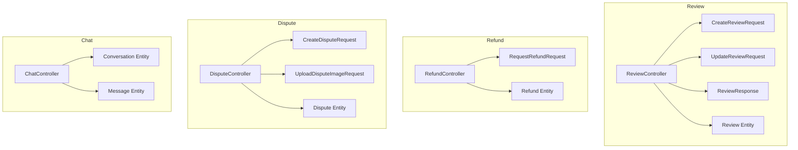

**Diagram sources**
- [ReviewController.java:24-189](file://src/Backend/src/main/java/com/shoppeclone/backend/review/controller/ReviewController.java#L24-L189)
- [CreateReviewRequest.java:12-34](file://src/Backend/src/main/java/com/shoppeclone/backend/review/dto/request/CreateReviewRequest.java#L12-L34)
- [UpdateReviewRequest.java:10-22](file://src/Backend/src/main/java/com/shoppeclone/backend/review/dto/request/UpdateReviewRequest.java#L10-L22)
- [ReviewResponse.java:7-25](file://src/Backend/src/main/java/com/shoppeclone/backend/review/dto/response/ReviewResponse.java#L7-L25)
- [Review.java:11-40](file://src/Backend/src/main/java/com/shoppeclone/backend/review/entity/Review.java#L11-L40)
- [RefundController.java:22-103](file://src/Backend/src/main/java/com/shoppeclone/backend/refund/controller/RefundController.java#L22-L103)
- [RequestRefundRequest.java:9-17](file://src/Backend/src/main/java/com/shoppeclone/backend/refund/dto/request/RequestRefundRequest.java#L9-L17)
- [Refund.java:10-33](file://src/Backend/src/main/java/com/shoppeclone/backend/refund/entity/Refund.java#L10-L33)
- [DisputeController.java:24-130](file://src/Backend/src/main/java/com/shoppeclone/backend/dispute/controller/DisputeController.java#L24-L130)
- [CreateDisputeRequest.java:6-17](file://src/Backend/src/main/java/com/shoppeclone/backend/dispute/dto/request/CreateDisputeRequest.java#L6-L17)
- [UploadDisputeImageRequest.java:6-11](file://src/Backend/src/main/java/com/shoppeclone/backend/dispute/dto/request/UploadDisputeImageRequest.java#L6-L11)
- [Dispute.java:9-34](file://src/Backend/src/main/java/com/shoppeclone/backend/dispute/entity/Dispute.java#L9-L34)
- [ChatController.java:20-134](file://src/Backend/src/main/java/com/shoppeclone/backend/chat/controller/ChatController.java#L20-L134)
- [Conversation.java:13-35](file://src/Backend/src/main/java/com/shoppeclone/backend/chat/entity/Conversation.java#L13-L35)
- [Message.java:11-32](file://src/Backend/src/main/java/com/shoppeclone/backend/chat/entity/Message.java#L11-L32)

**Section sources**
- [ReviewController.java:24-189](file://src/Backend/src/main/java/com/shoppeclone/backend/review/controller/ReviewController.java#L24-L189)
- [RefundController.java:22-103](file://src/Backend/src/main/java/com/shoppeclone/backend/refund/controller/RefundController.java#L22-L103)
- [DisputeController.java:24-130](file://src/Backend/src/main/java/com/shoppeclone/backend/dispute/controller/DisputeController.java#L24-L130)
- [ChatController.java:20-134](file://src/Backend/src/main/java/com/shoppeclone/backend/chat/controller/ChatController.java#L20-L134)

## Core Components
- ReviewController: CRUD and analytics for product reviews, user review lists, review replies, and average ratings
- RefundController: buyer refund requests bound to completed orders and access-controlled retrieval
- DisputeController: dispute filing and image attachments with strict access checks
- ChatController: conversation lifecycle and message sending with role-aware routing

**Section sources**
- [ReviewController.java:24-189](file://src/Backend/src/main/java/com/shoppeclone/backend/review/controller/ReviewController.java#L24-L189)
- [RefundController.java:22-103](file://src/Backend/src/main/java/com/shoppeclone/backend/refund/controller/RefundController.java#L22-L103)
- [DisputeController.java:24-130](file://src/Backend/src/main/java/com/shoppeclone/backend/dispute/controller/DisputeController.java#L24-L130)
- [ChatController.java:20-134](file://src/Backend/src/main/java/com/shoppeclone/backend/chat/controller/ChatController.java#L20-L134)

## Architecture Overview
The API follows a layered architecture:
- Controllers expose REST endpoints and enforce authentication/authorization
- Services encapsulate business logic
- Repositories manage persistence (MongoDB)
- Entities define data models
- DTOs define request/response schemas

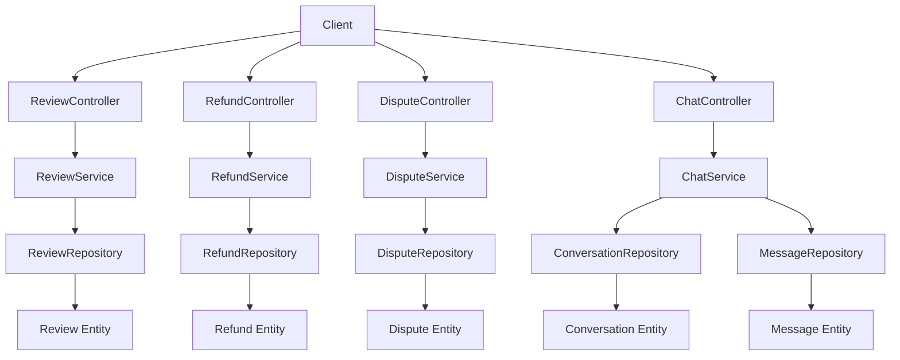

**Diagram sources**
- [ReviewController.java:24-189](file://src/Backend/src/main/java/com/shoppeclone/backend/review/controller/ReviewController.java#L24-L189)
- [RefundController.java:22-103](file://src/Backend/src/main/java/com/shoppeclone/backend/refund/controller/RefundController.java#L22-L103)
- [DisputeController.java:24-130](file://src/Backend/src/main/java/com/shoppeclone/backend/dispute/controller/DisputeController.java#L24-L130)
- [ChatController.java:20-134](file://src/Backend/src/main/java/com/shoppeclone/backend/chat/controller/ChatController.java#L20-L134)
- [Review.java:11-40](file://src/Backend/src/main/java/com/shoppeclone/backend/review/entity/Review.java#L11-L40)
- [Refund.java:10-33](file://src/Backend/src/main/java/com/shoppeclone/backend/refund/entity/Refund.java#L10-L33)
- [Dispute.java:9-34](file://src/Backend/src/main/java/com/shoppeclone/backend/dispute/entity/Dispute.java#L9-L34)
- [Conversation.java:13-35](file://src/Backend/src/main/java/com/shoppeclone/backend/chat/entity/Conversation.java#L13-L35)
- [Message.java:11-32](file://src/Backend/src/main/java/com/shoppeclone/backend/chat/entity/Message.java#L11-L32)

## Detailed Component Analysis

### Review System
Endpoints:
- POST /api/reviews
- POST /api/reviews/upload-image
- GET /api/reviews/product/{productId}
- GET /api/reviews/user/{userId}
- GET /api/reviews/{id}
- PUT /api/reviews/{id}
- DELETE /api/reviews/{id}
- GET /api/reviews/product/{productId}/average-rating
- GET /api/reviews/can-review?orderId={orderId}&productId={productId}
- GET /api/reviews/reviewable-orders
- GET /api/reviews/shop/{shopId}
- POST /api/reviews/{id}/reply

Request/Response Schemas:
- CreateReviewRequest
  - Fields: productId (required), orderId (required), rating (1–5, required), comment (optional), imageUrls (up to 5, optional)
- UpdateReviewRequest
  - Fields: rating (1–5), comment, imageUrls (up to 5)
- ReviewResponse
  - Fields: id, userId, userName, productId, orderId, rating, comment, imageUrls, replyComment, replyAt, isReplyEdited, createdAt, verifiedPurchase, shopId

Processing Logic:
- Reviews are tied to orders and validated for purchase verification
- Sellers can reply to reviews; access restricted to shop ownership
- Average rating computed per product

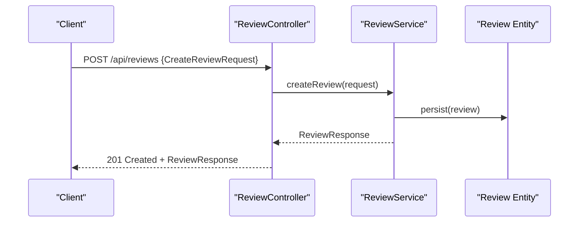

**Diagram sources**
- [ReviewController.java:44-52](file://src/Backend/src/main/java/com/shoppeclone/backend/review/controller/ReviewController.java#L44-L52)
- [CreateReviewRequest.java:12-34](file://src/Backend/src/main/java/com/shoppeclone/backend/review/dto/request/CreateReviewRequest.java#L12-L34)
- [ReviewResponse.java:7-25](file://src/Backend/src/main/java/com/shoppeclone/backend/review/dto/response/ReviewResponse.java#L7-L25)
- [Review.java:11-40](file://src/Backend/src/main/java/com/shoppeclone/backend/review/entity/Review.java#L11-L40)

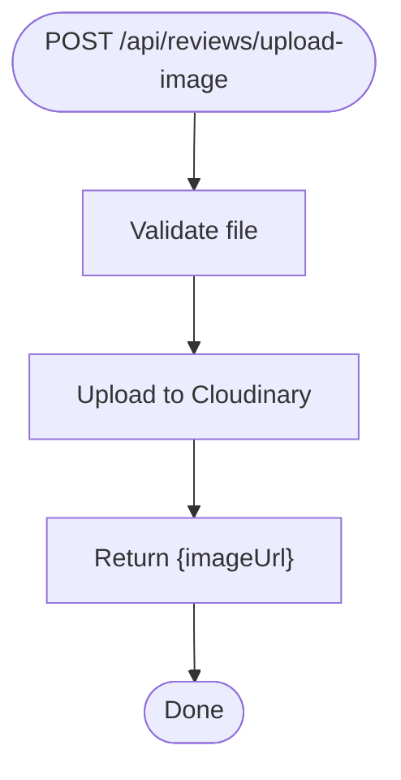

**Diagram sources**
- [ReviewController.java:58-63](file://src/Backend/src/main/java/com/shoppeclone/backend/review/controller/ReviewController.java#L58-L63)

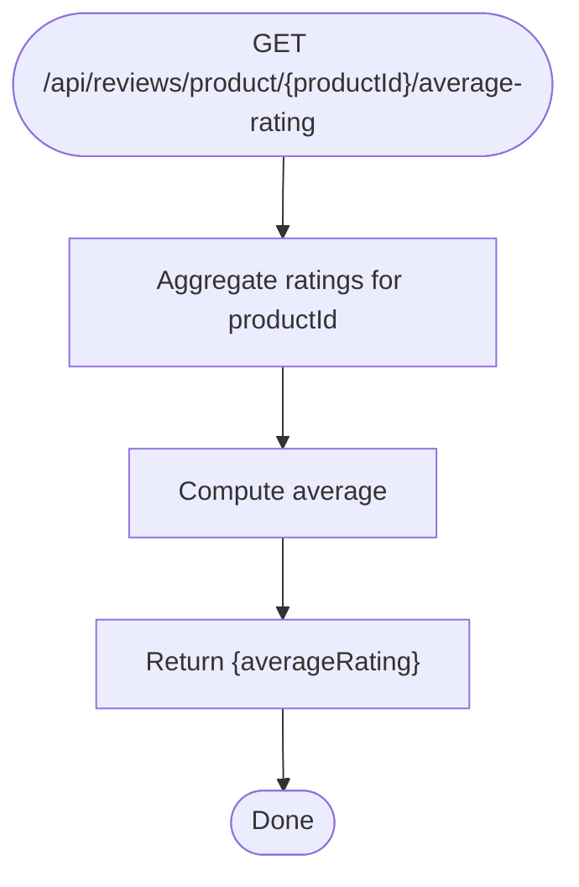

**Diagram sources**
- [ReviewController.java:126-130](file://src/Backend/src/main/java/com/shoppeclone/backend/review/controller/ReviewController.java#L126-L130)

Examples:
- Create a review for a delivered order with a 5-star rating and optional images
- Reply to a review as a shop owner
- Retrieve average rating for a product

**Section sources**
- [ReviewController.java:44-189](file://src/Backend/src/main/java/com/shoppeclone/backend/review/controller/ReviewController.java#L44-L189)
- [CreateReviewRequest.java:12-34](file://src/Backend/src/main/java/com/shoppeclone/backend/review/dto/request/CreateReviewRequest.java#L12-L34)
- [UpdateReviewRequest.java:10-22](file://src/Backend/src/main/java/com/shoppeclone/backend/review/dto/request/UpdateReviewRequest.java#L10-L22)
- [ReviewResponse.java:7-25](file://src/Backend/src/main/java/com/shoppeclone/backend/review/dto/response/ReviewResponse.java#L7-L25)
- [Review.java:11-40](file://src/Backend/src/main/java/com/shoppeclone/backend/review/entity/Review.java#L11-L40)

### Refund Management
Endpoints:
- POST /api/refunds/{orderId}/request
- GET /api/refunds/{orderId}

Request/Response Schemas:
- RequestRefundRequest
  - Fields: reason (required), amount (positive, optional)
- Refund
  - Fields: id, orderId (unique), buyerId, amount, reason, status (default REQUESTED), approvedBy, processedAt, createdAt

Processing Logic:
- Buyers can request refunds only for COMPLETED orders
- Amount defaults to order total if not provided
- Access control allows owner, admin, or seller of the order to retrieve refund status

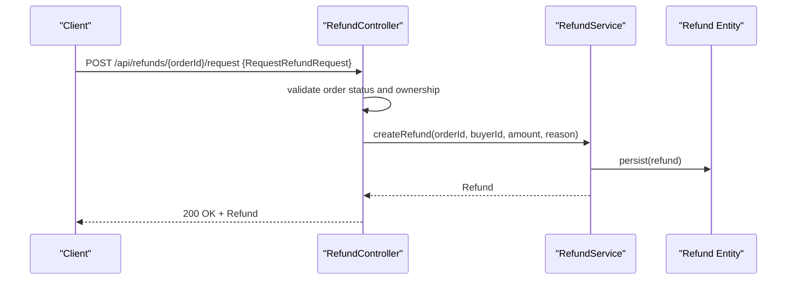

**Diagram sources**
- [RefundController.java:48-78](file://src/Backend/src/main/java/com/shoppeclone/backend/refund/controller/RefundController.java#L48-L78)
- [RequestRefundRequest.java:9-17](file://src/Backend/src/main/java/com/shoppeclone/backend/refund/dto/request/RequestRefundRequest.java#L9-L17)
- [Refund.java:10-33](file://src/Backend/src/main/java/com/shoppeclone/backend/refund/entity/Refund.java#L10-L33)

Examples:
- Submit a refund request for a completed order with a reason and requested amount
- Retrieve refund status for an order you own, are an admin, or sell

**Section sources**
- [RefundController.java:48-103](file://src/Backend/src/main/java/com/shoppeclone/backend/refund/controller/RefundController.java#L48-L103)
- [RequestRefundRequest.java:9-17](file://src/Backend/src/main/java/com/shoppeclone/backend/refund/dto/request/RequestRefundRequest.java#L9-L17)
- [Refund.java:10-33](file://src/Backend/src/main/java/com/shoppeclone/backend/refund/entity/Refund.java#L10-L33)

### Dispute Resolution
Endpoints:
- POST /api/disputes
- POST /api/disputes/{id}/images
- GET /api/disputes/{id}
- GET /api/disputes/{id}/images
- GET /api/disputes/order/{orderId}

Request/Response Schemas:
- CreateDisputeRequest
  - Fields: orderId (required), reason (required), description (required)
- UploadDisputeImageRequest
  - Fields: imageUrl (required)
- Dispute
  - Fields: id, orderId (unique), buyerId, sellerId, reason, description, status (default IN_REVIEW), adminNote, createdAt, resolvedAt

Access Control:
- Only buyers who placed the order, admins, or sellers of the order can access disputes

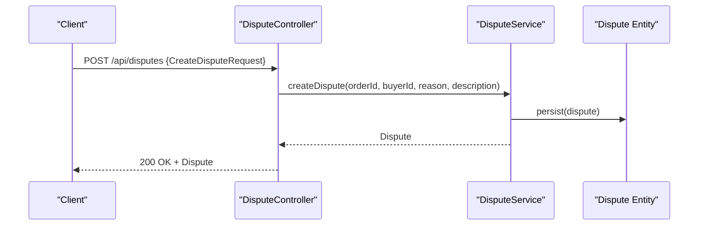

**Diagram sources**
- [DisputeController.java:76-87](file://src/Backend/src/main/java/com/shoppeclone/backend/dispute/controller/DisputeController.java#L76-L87)
- [CreateDisputeRequest.java:6-17](file://src/Backend/src/main/java/com/shoppeclone/backend/dispute/dto/request/CreateDisputeRequest.java#L6-L17)
- [Dispute.java:9-34](file://src/Backend/src/main/java/com/shoppeclone/backend/dispute/entity/Dispute.java#L9-L34)

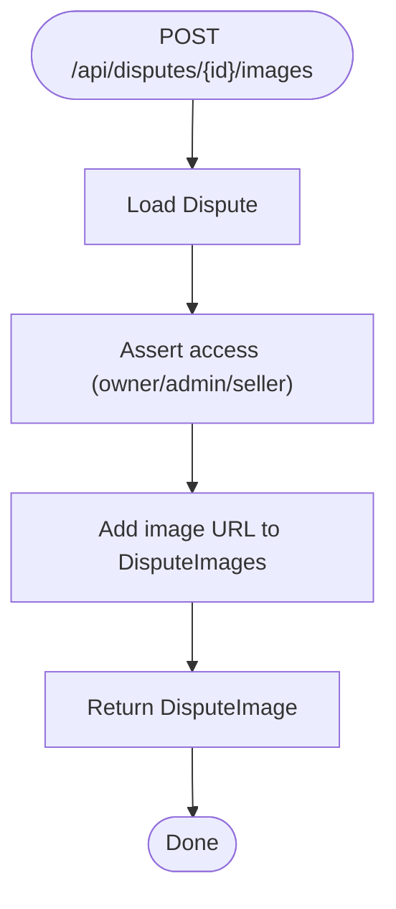

**Diagram sources**
- [DisputeController.java:89-100](file://src/Backend/src/main/java/com/shoppeclone/backend/dispute/controller/DisputeController.java#L89-L100)
- [UploadDisputeImageRequest.java:6-11](file://src/Backend/src/main/java/com/shoppeclone/backend/dispute/dto/request/UploadDisputeImageRequest.java#L6-L11)

Examples:
- File a dispute against a seller for a specific order with reason and description
- Attach supporting images to a dispute you have access to

**Section sources**
- [DisputeController.java:76-130](file://src/Backend/src/main/java/com/shoppeclone/backend/dispute/controller/DisputeController.java#L76-L130)
- [CreateDisputeRequest.java:6-17](file://src/Backend/src/main/java/com/shoppeclone/backend/dispute/dto/request/CreateDisputeRequest.java#L6-L17)
- [UploadDisputeImageRequest.java:6-11](file://src/Backend/src/main/java/com/shoppeclone/backend/dispute/dto/request/UploadDisputeImageRequest.java#L6-L11)
- [Dispute.java:9-34](file://src/Backend/src/main/java/com/shoppeclone/backend/dispute/entity/Dispute.java#L9-L34)

### Customer Chat
Endpoints:
- POST /api/chat/start/{shopId}?userId={userId}
- GET /api/chat/{conversationId}/messages
- GET /api/chat/conversation/{conversationId}
- GET /api/chat/shop/{shopId}/conversations
- POST /api/chat/{conversationId}/messages
- DELETE /api/chat/messages/{messageId}
- DELETE /api/chat/conversations/{conversationId}

Entities:
- Conversation: indexed by userId and shopId, tracks last message metadata
- Message: stores senderId, content, and whether it is a shop message

Access Control:
- Authentication required for all endpoints
- Shop owners can initiate chats with specific followers
- Message deletion and conversation deletion require ownership

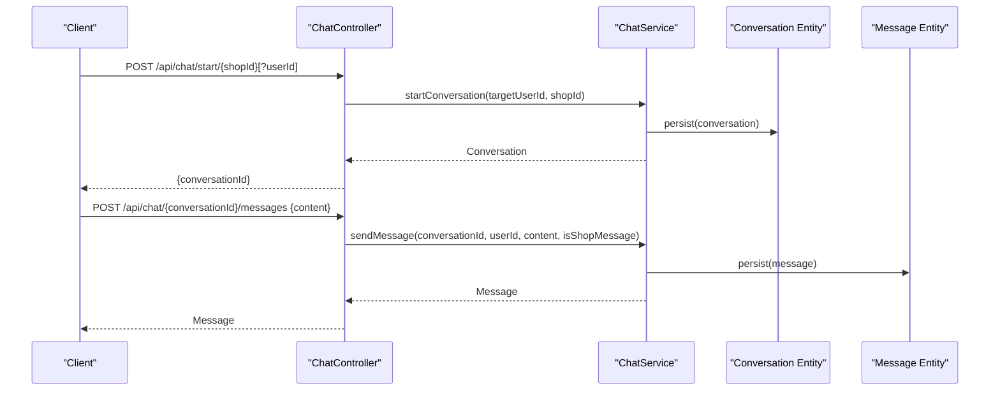

**Diagram sources**
- [ChatController.java:28-101](file://src/Backend/src/main/java/com/shoppeclone/backend/chat/controller/ChatController.java#L28-L101)
- [Conversation.java:13-35](file://src/Backend/src/main/java/com/shoppeclone/backend/chat/entity/Conversation.java#L13-L35)
- [Message.java:11-32](file://src/Backend/src/main/java/com/shoppeclone/backend/chat/entity/Message.java#L11-L32)

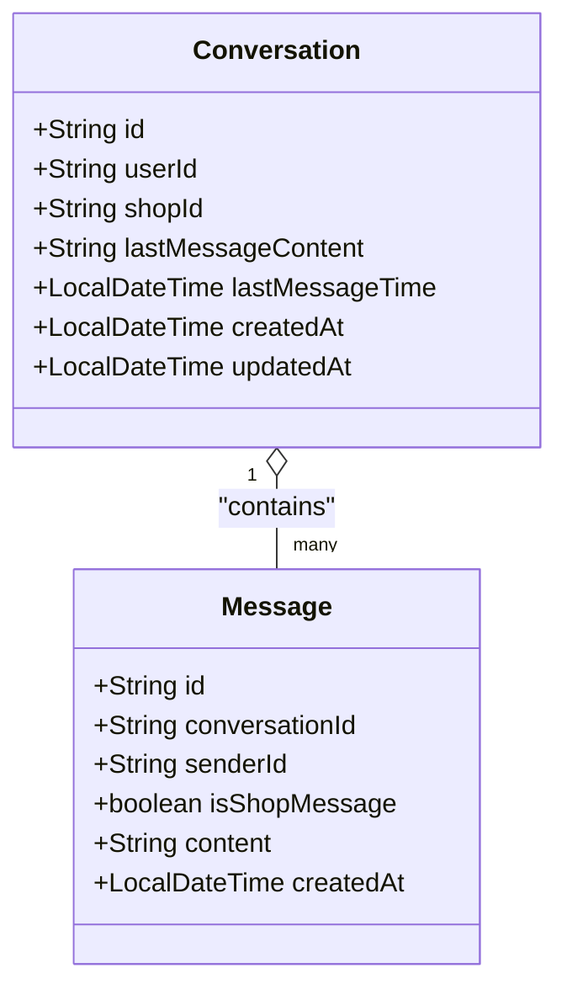

**Diagram sources**
- [Conversation.java:13-35](file://src/Backend/src/main/java/com/shoppeclone/backend/chat/entity/Conversation.java#L13-L35)
- [Message.java:11-32](file://src/Backend/src/main/java/com/shoppeclone/backend/chat/entity/Message.java#L11-L32)

Examples:
- Start a conversation with a shop as a buyer
- Send a message in an existing conversation
- Retrieve messages and conversations for authorized access

**Section sources**
- [ChatController.java:28-134](file://src/Backend/src/main/java/com/shoppeclone/backend/chat/controller/ChatController.java#L28-L134)
- [Conversation.java:13-35](file://src/Backend/src/main/java/com/shoppeclone/backend/chat/entity/Conversation.java#L13-L35)
- [Message.java:11-32](file://src/Backend/src/main/java/com/shoppeclone/backend/chat/entity/Message.java#L11-L32)

## Dependency Analysis
- Controllers depend on services and repositories
- Services encapsulate business rules and coordinate repositories
- Entities define schema and indexing for MongoDB
- DTOs decouple request/response contracts from entities

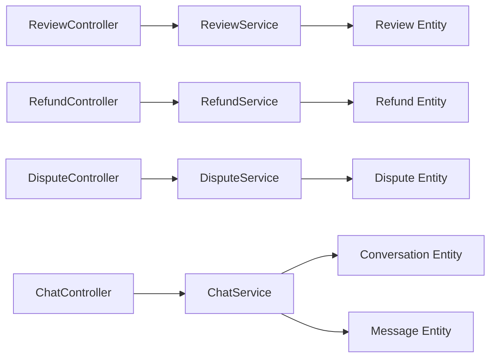

**Diagram sources**
- [ReviewController.java:24-189](file://src/Backend/src/main/java/com/shoppeclone/backend/review/controller/ReviewController.java#L24-L189)
- [RefundController.java:22-103](file://src/Backend/src/main/java/com/shoppeclone/backend/refund/controller/RefundController.java#L22-L103)
- [DisputeController.java:24-130](file://src/Backend/src/main/java/com/shoppeclone/backend/dispute/controller/DisputeController.java#L24-L130)
- [ChatController.java:20-134](file://src/Backend/src/main/java/com/shoppeclone/backend/chat/controller/ChatController.java#L20-L134)
- [Review.java:11-40](file://src/Backend/src/main/java/com/shoppeclone/backend/review/entity/Review.java#L11-L40)
- [Refund.java:10-33](file://src/Backend/src/main/java/com/shoppeclone/backend/refund/entity/Refund.java#L10-L33)
- [Dispute.java:9-34](file://src/Backend/src/main/java/com/shoppeclone/backend/dispute/entity/Dispute.java#L9-L34)
- [Conversation.java:13-35](file://src/Backend/src/main/java/com/shoppeclone/backend/chat/entity/Conversation.java#L13-L35)
- [Message.java:11-32](file://src/Backend/src/main/java/com/shoppeclone/backend/chat/entity/Message.java#L11-L32)

## Performance Considerations
- Indexing: Entities use targeted indexes (e.g., userId, productId, orderId, shopId) to optimize queries
- Pagination: Consider adding pagination for listing reviews, messages, and conversations
- Image storage: Offload images to external services (as used by review image upload)
- Validation: DTO constraints reduce invalid requests and downstream errors

[No sources needed since this section provides general guidance]

## Troubleshooting Guide
Common issues and resolutions:
- Unauthorized access: Ensure proper authentication and roles for refund retrieval and dispute access
- Forbidden actions: Sellers can only reply to reviews and start chats with specific users if they own the shop
- Validation errors: Ensure request bodies conform to DTO constraints (ratings 1–5, required fields, positive amounts)
- Resource not found: Verify entity IDs (orders, conversations, disputes) exist before operations

**Section sources**
- [RefundController.java:32-101](file://src/Backend/src/main/java/com/shoppeclone/backend/refund/controller/RefundController.java#L32-L101)
- [DisputeController.java:47-74](file://src/Backend/src/main/java/com/shoppeclone/backend/dispute/controller/DisputeController.java#L47-L74)
- [ChatController.java:32-131](file://src/Backend/src/main/java/com/shoppeclone/backend/chat/controller/ChatController.java#L32-L131)

## Conclusion
The Trust & Support API provides robust capabilities for managing product reviews, buyer refunds, seller disputes, and customer chat. Clear access controls, structured DTOs, and well-defined workflows enable secure and scalable operations across the platform.

[No sources needed since this section summarizes without analyzing specific files]

## Appendices

### Endpoint Reference Summary
- Reviews
  - POST /api/reviews
  - POST /api/reviews/upload-image
  - GET /api/reviews/product/{productId}
  - GET /api/reviews/user/{userId}
  - GET /api/reviews/{id}
  - PUT /api/reviews/{id}
  - DELETE /api/reviews/{id}
  - GET /api/reviews/product/{productId}/average-rating
  - GET /api/reviews/can-review?orderId={orderId}&productId={productId}
  - GET /api/reviews/reviewable-orders
  - GET /api/reviews/shop/{shopId}
  - POST /api/reviews/{id}/reply
- Refunds
  - POST /api/refunds/{orderId}/request
  - GET /api/refunds/{orderId}
- Disputes
  - POST /api/disputes
  - POST /api/disputes/{id}/images
  - GET /api/disputes/{id}
  - GET /api/disputes/{id}/images
  - GET /api/disputes/order/{orderId}
- Chat
  - POST /api/chat/start/{shopId}?userId={userId}
  - GET /api/chat/{conversationId}/messages
  - GET /api/chat/conversation/{conversationId}
  - GET /api/chat/shop/{shopId}/conversations
  - POST /api/chat/{conversationId}/messages
  - DELETE /api/chat/messages/{messageId}
  - DELETE /api/chat/conversations/{conversationId}

[No sources needed since this section provides general guidance]