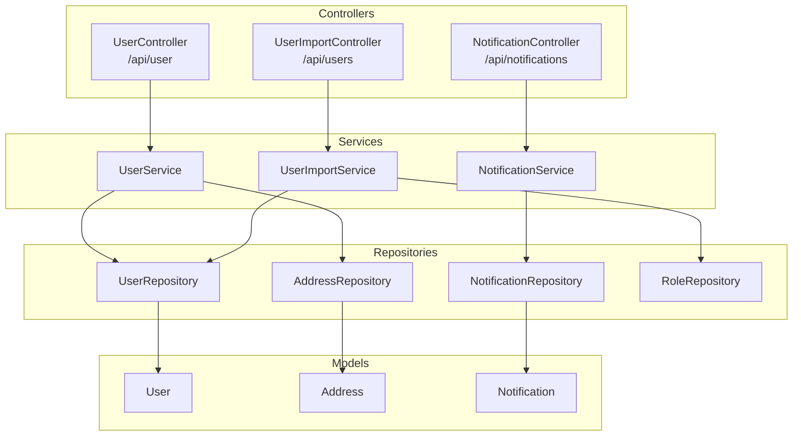
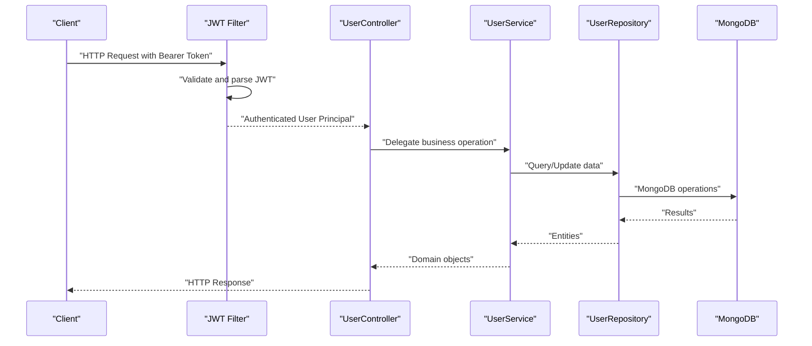
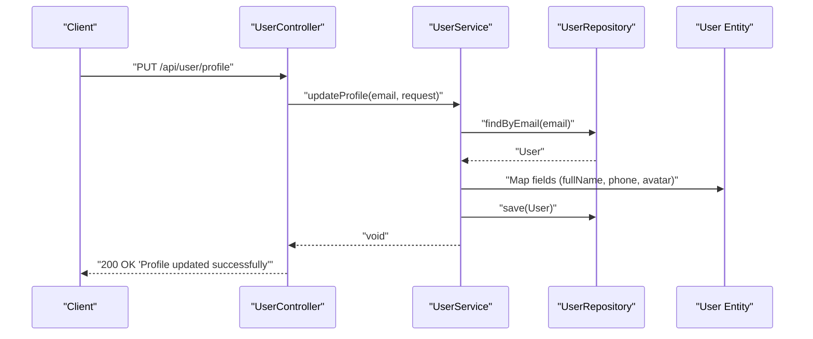
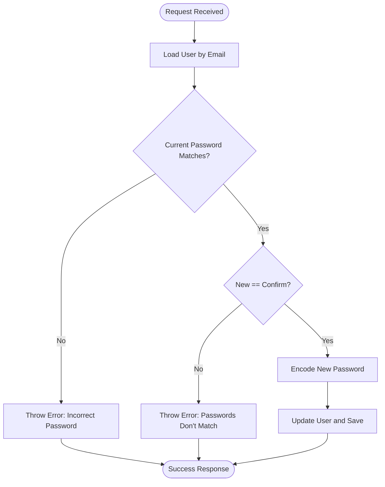
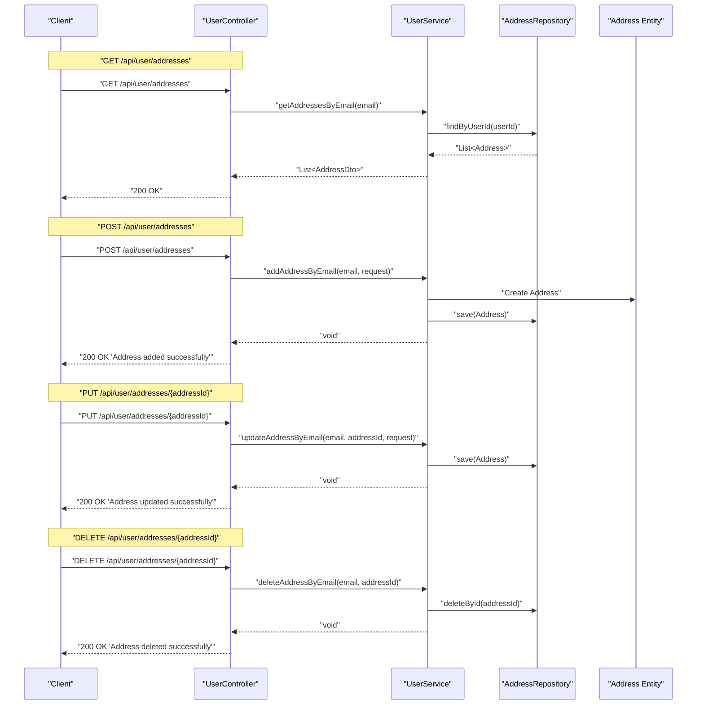
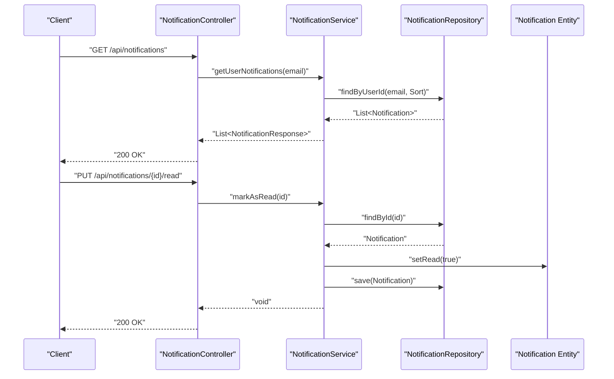
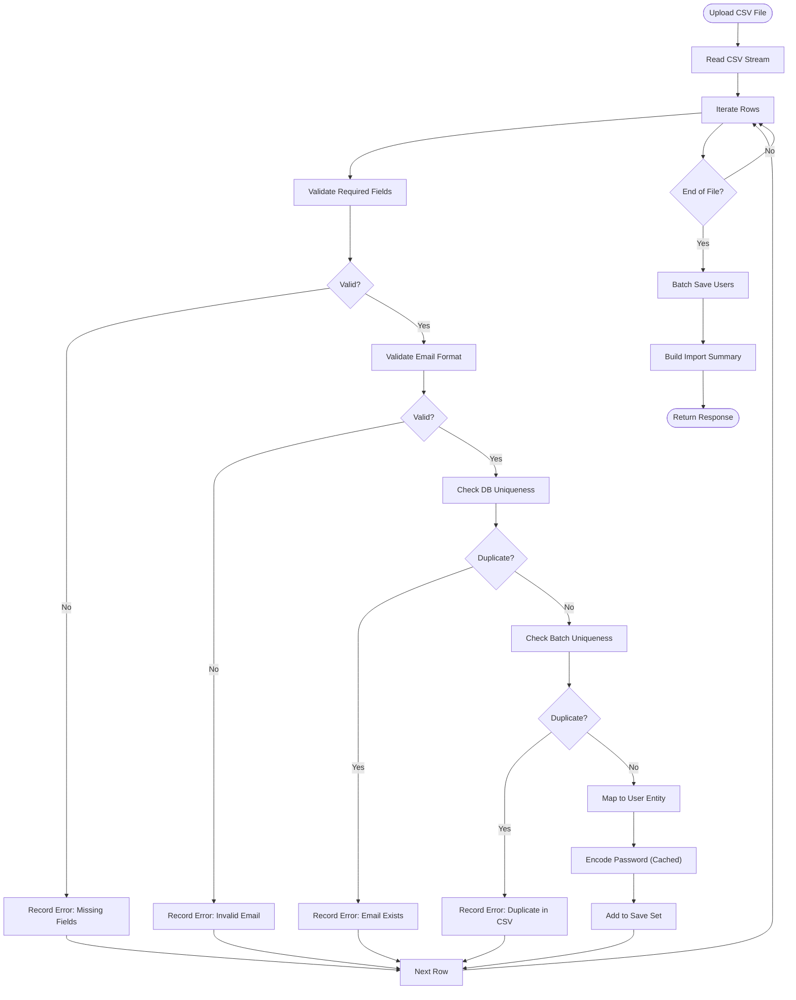
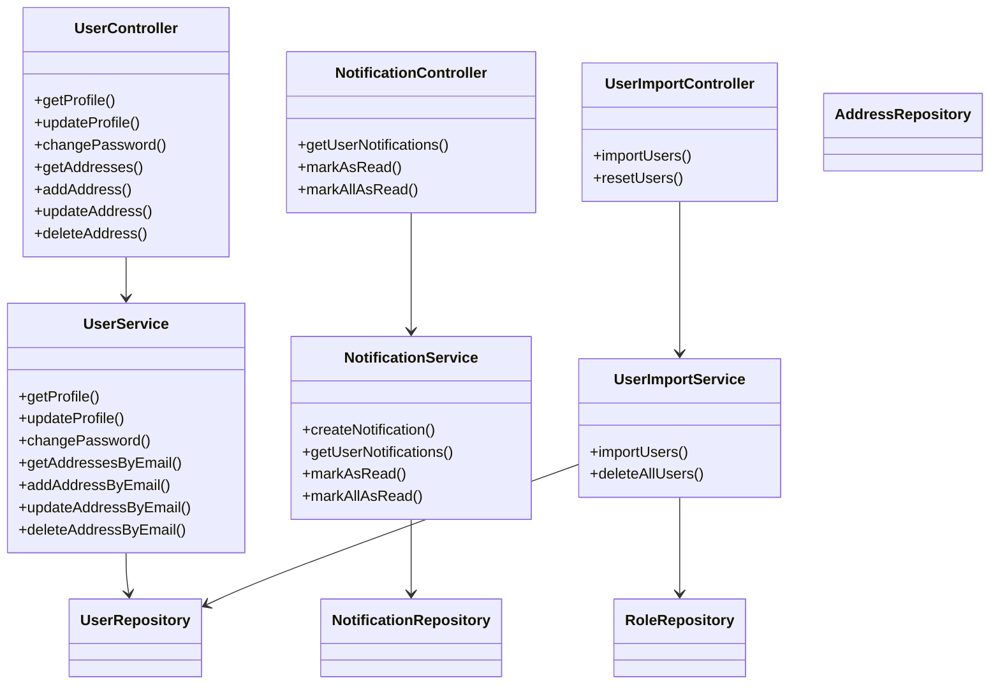

# User Management API

<cite>
**Referenced Files in This Document**
- [UserController.java](file://src/Backend/src/main/java/com/shoppeclone/backend/user/controller/UserController.java)
- [UserImportController.java](file://src/Backend/src/main/java/com/shoppeclone/backend/user/controller/UserImportController.java)
- [NotificationController.java](file://src/Backend/src/main/java/com/shoppeclone/backend/user/controller/NotificationController.java)
- [UserService.java](file://src/Backend/src/main/java/com/shoppeclone/backend/user/service/UserService.java)
- [UserImportService.java](file://src/Backend/src/main/java/com/shoppeclone/backend/user/service/UserImportService.java)
- [NotificationService.java](file://src/Backend/src/main/java/com/shoppeclone/backend/user/service/NotificationService.java)
- [UserServiceImpl.java](file://src/Backend/src/main/java/com/shoppeclone/backend/user/service/impl/UserServiceImpl.java)
- [User.java](file://src/Backend/src/main/java/com/shoppeclone/backend/auth/model/User.java)
- [Address.java](file://src/Backend/src/main/java/com/shoppeclone/backend/user/model/Address.java)
- [Notification.java](file://src/Backend/src/main/java/com/shoppeclone/backend/user/model/Notification.java)
- [UserCsvRepresentation.java](file://src/Backend/src/main/java/com/shoppeclone/backend/user/dto/UserCsvRepresentation.java)
- [NotificationResponse.java](file://src/Backend/src/main/java/com/shoppeclone/backend/user/dto/response/NotificationResponse.java)
- [SecurityConfig.java](file://src/Backend/src/main/java/com/shoppeclone/backend/auth/security/SecurityConfig.java)
- [JwtUtil.java](file://src/Backend/src/main/java/com/shoppeclone/backend/auth/security/JwtUtil.java)
- [JwtAuthFilter.java](file://src/Backend/src/main/java/com/shoppeclone/backend/auth/security/JwtAuthFilter.java)
- [UserRepository.java](file://src/Backend/src/main/java/com/shoppeclone/backend/auth/repository/UserRepository.java)
- [RoleRepository.java](file://src/Backend/src/main/java/com/shoppeclone/backend/auth/repository/RoleRepository.java)
- [AddressRepository.java](file://src/Backend/src/main/java/com/shoppeclone/backend/user/repository/AddressRepository.java)
- [NotificationRepository.java](file://src/Backend/src/main/java/com/shoppeclone/backend/user/repository/NotificationRepository.java)
</cite>

## Table of Contents
1. [Introduction](#introduction)
2. [Project Structure](#project-structure)
3. [Core Components](#core-components)
4. [Architecture Overview](#architecture-overview)
5. [Detailed Component Analysis](#detailed-component-analysis)
6. [Dependency Analysis](#dependency-analysis)
7. [Performance Considerations](#performance-considerations)
8. [Troubleshooting Guide](#troubleshooting-guide)
9. [Conclusion](#conclusion)

## Introduction
This document provides comprehensive API documentation for user management functionality, including profile management, address handling, notification system, and bulk user import capabilities. The APIs are built with Spring Boot and MongoDB, secured via JWT authentication, and designed for RESTful interactions.

## Project Structure
The user management module is organized into controllers, services, repositories, models, and DTOs:

- Controllers expose REST endpoints under `/api/user`, `/api/notifications`, and `/api/users`
- Services encapsulate business logic and coordinate with repositories
- Repositories manage MongoDB persistence
- Models define domain entities
- DTOs represent request/response payloads

**Diagram sources**
- [UserController.java:15-96](file://src/Backend/src/main/java/com/shoppeclone/backend/user/controller/UserController.java#L15-L96)
- [NotificationController.java:13-41](file://src/Backend/src/main/java/com/shoppeclone/backend/user/controller/NotificationController.java#L13-L41)
- [UserImportController.java:12-35](file://src/Backend/src/main/java/com/shoppeclone/backend/user/controller/UserImportController.java#L12-L35)
- [UserService.java:9-28](file://src/Backend/src/main/java/com/shoppeclone/backend/user/service/UserService.java#L9-L28)
- [UserImportService.java:25-153](file://src/Backend/src/main/java/com/shoppeclone/backend/user/service/UserImportService.java#L25-L153)
- [NotificationService.java:7-16](file://src/Backend/src/main/java/com/shoppeclone/backend/user/service/NotificationService.java#L7-L16)

**Section sources**
- [UserController.java:15-96](file://src/Backend/src/main/java/com/shoppeclone/backend/user/controller/UserController.java#L15-L96)
- [UserImportController.java:12-35](file://src/Backend/src/main/java/com/shoppeclone/backend/user/controller/UserImportController.java#L12-L35)
- [NotificationController.java:13-41](file://src/Backend/src/main/java/com/shoppeclone/backend/user/controller/NotificationController.java#L13-L41)

## Core Components
This section documents the primary endpoints and their request/response schemas.

### Authentication and Authorization
- All user endpoints require a valid JWT bearer token in the Authorization header.
- The security filter validates tokens and sets the Authentication context.
- Controllers extract the authenticated user's email from the Authentication principal.

Key security components:
- JWT filter and utilities
- Security configuration
- Role-based access control

**Section sources**
- [SecurityConfig.java](file://src/Backend/src/main/java/com/shoppeclone/backend/auth/security/SecurityConfig.java)
- [JwtUtil.java](file://src/Backend/src/main/java/com/shoppeclone/backend/auth/security/JwtUtil.java)
- [JwtAuthFilter.java](file://src/Backend/src/main/java/com/shoppeclone/backend/auth/security/JwtAuthFilter.java)

### Profile Management
Endpoints for retrieving and updating user profiles, and changing passwords.

- GET /api/user/profile
  - Description: Retrieve the authenticated user's profile
  - Authentication: Required
  - Response: User profile DTO
  - Status: 200 OK

- PUT /api/user/profile
  - Description: Update profile information (full name, phone, avatar)
  - Authentication: Required
  - Request: UpdateProfileRequest
  - Response: Success message
  - Status: 200 OK

- PUT /api/user/change-password
  - Description: Change user password with validation
  - Authentication: Required
  - Request: ChangePasswordRequest
  - Response: Success message
  - Status: 200 OK

Validation rules:
- Current password must match stored hash
- New password must equal confirmation
- Avatar field is optional

**Section sources**
- [UserController.java:29-51](file://src/Backend/src/main/java/com/shoppeclone/backend/user/controller/UserController.java#L29-L51)
- [UserService.java:11-15](file://src/Backend/src/main/java/com/shoppeclone/backend/user/service/UserService.java#L11-L15)
- [UserServiceImpl.java:32-66](file://src/Backend/src/main/java/com/shoppeclone/backend/user/service/impl/UserServiceImpl.java#L32-L66)

### Address Management
Endpoints for managing user addresses.

- GET /api/user/addresses
  - Description: List all addresses for the authenticated user
  - Authentication: Required
  - Response: Array of Address DTOs
  - Status: 200 OK

- POST /api/user/addresses
  - Description: Add a new address
  - Authentication: Required
  - Request: AddressRequest
  - Response: Success message
  - Status: 200 OK

- PUT /api/user/addresses/{addressId}
  - Description: Update an existing address
  - Authentication: Required
  - Request: AddressRequest
  - Response: Success message
  - Status: 200 OK

- DELETE /api/user/addresses/{addressId}
  - Description: Delete an address
  - Authentication: Required
  - Response: Success message
  - Status: 200 OK

Address model fields:
- id, fullName, phone, address, city, district, ward, isDefault, createdAt, updatedAt

**Section sources**
- [UserController.java:55-87](file://src/Backend/src/main/java/com/shoppeclone/backend/user/controller/UserController.java#L55-L87)
- [Address.java:10-23](file://src/Backend/src/main/java/com/shoppeclone/backend/user/model/Address.java#L10-L23)

### Notification Preferences
Endpoints for retrieving and marking notifications.

- GET /api/notifications
  - Description: Get all notifications for the authenticated user
  - Authentication: Required
  - Response: Array of NotificationResponse
  - Status: 200 OK

- PUT /api/notifications/{id}/read
  - Description: Mark a notification as read
  - Authentication: Required
  - Response: Empty body, 200 OK

- PUT /api/notifications/read-all
  - Description: Mark all notifications as read
  - Authentication: Required
  - Response: Empty body, 200 OK

Notification model fields:
- id, userId, title, message, type, isRead, createdAt

**Section sources**
- [NotificationController.java:20-39](file://src/Backend/src/main/java/com/shoppeclone/backend/user/controller/NotificationController.java#L20-L39)
- [Notification.java:16-30](file://src/Backend/src/main/java/com/shoppeclone/backend/user/model/Notification.java#L16-L30)
- [NotificationResponse.java:12-19](file://src/Backend/src/main/java/com/shoppeclone/backend/user/dto/response/NotificationResponse.java#L12-L19)

### Bulk User Import
Endpoints for importing users from CSV and resetting the user collection.

- POST /api/users/import
  - Description: Import users from a CSV file
  - Authentication: Not required by controller (admin-only endpoint)
  - Content-Type: multipart/form-data
  - Form field: file (CSV)
  - Response: Import summary with counts and errors
  - Status: 200 OK or 400 Bad Request

- DELETE /api/users/reset
  - Description: Remove all users from the database
  - Authentication: Not required by controller (admin-only endpoint)
  - Response: Success message
  - Status: 200 OK

CSV schema (UserCsvRepresentation):
- email (required)
- password (required)
- fullName (required)
- phone (optional)

Validation rules during import:
- Email required and valid format
- Full name required
- Email uniqueness (database and batch)
- Default role assignment (ROLE_USER)
- Auto-email verification enabled
- Passwords encoded and cached for performance

**Section sources**
- [UserImportController.java:20-33](file://src/Backend/src/main/java/com/shoppeclone/backend/user/controller/UserImportController.java#L20-L33)
- [UserImportService.java:34-147](file://src/Backend/src/main/java/com/shoppeclone/backend/user/service/UserImportService.java#L34-L147)
- [UserCsvRepresentation.java:13-26](file://src/Backend/src/main/java/com/shoppeclone/backend/user/dto/UserCsvRepresentation.java#L13-L26)

## Architecture Overview
The system follows layered architecture with clear separation of concerns:

**Diagram sources**
- [JwtAuthFilter.java](file://src/Backend/src/main/java/com/shoppeclone/backend/auth/security/JwtAuthFilter.java)
- [UserController.java:23-25](file://src/Backend/src/main/java/com/shoppeclone/backend/user/controller/UserController.java#L23-L25)
- [UserService.java:9-28](file://src/Backend/src/main/java/com/shoppeclone/backend/user/service/UserService.java#L9-L28)
- [UserRepository.java](file://src/Backend/src/main/java/com/shoppeclone/backend/auth/repository/UserRepository.java)

## Detailed Component Analysis

### User Profile Operations

**Diagram sources**
- [UserController.java:35-42](file://src/Backend/src/main/java/com/shoppeclone/backend/user/controller/UserController.java#L35-L42)
- [UserServiceImpl.java:38-48](file://src/Backend/src/main/java/com/shoppeclone/backend/user/service/impl/UserServiceImpl.java#L38-L48)
- [User.java:14-38](file://src/Backend/src/main/java/com/shoppeclone/backend/auth/model/User.java#L14-L38)

**Section sources**
- [UserController.java:35-42](file://src/Backend/src/main/java/com/shoppeclone/backend/user/controller/UserController.java#L35-L42)
- [UserServiceImpl.java:38-48](file://src/Backend/src/main/java/com/shoppeclone/backend/user/service/impl/UserServiceImpl.java#L38-L48)

### Password Change Workflow

**Diagram sources**
- [UserServiceImpl.java:50-66](file://src/Backend/src/main/java/com/shoppeclone/backend/user/service/impl/UserServiceImpl.java#L50-L66)

**Section sources**
- [UserServiceImpl.java:50-66](file://src/Backend/src/main/java/com/shoppeclone/backend/user/service/impl/UserServiceImpl.java#L50-L66)

### Address CRUD Operations

**Diagram sources**
- [UserController.java:55-87](file://src/Backend/src/main/java/com/shoppeclone/backend/user/controller/UserController.java#L55-L87)
- [AddressRepository.java](file://src/Backend/src/main/java/com/shoppeclone/backend/user/repository/AddressRepository.java)
- [Address.java:10-23](file://src/Backend/src/main/java/com/shoppeclone/backend/user/model/Address.java#L10-L23)

**Section sources**
- [UserController.java:55-87](file://src/Backend/src/main/java/com/shoppeclone/backend/user/controller/UserController.java#L55-L87)

### Notification Management

**Diagram sources**
- [NotificationController.java:20-31](file://src/Backend/src/main/java/com/shoppeclone/backend/user/controller/NotificationController.java#L20-L31)
- [NotificationService.java:7-16](file://src/Backend/src/main/java/com/shoppeclone/backend/user/service/NotificationService.java#L7-L16)
- [NotificationRepository.java:10-15](file://src/Backend/src/main/java/com/shoppeclone/backend/user/repository/NotificationRepository.java#L10-L15)
- [Notification.java:16-30](file://src/Backend/src/main/java/com/shoppeclone/backend/user/model/Notification.java#L16-L30)

**Section sources**
- [NotificationController.java:20-39](file://src/Backend/src/main/java/com/shoppeclone/backend/user/controller/NotificationController.java#L20-L39)

### Bulk User Import Process

**Diagram sources**
- [UserImportService.java:34-147](file://src/Backend/src/main/java/com/shoppeclone/backend/user/service/UserImportService.java#L34-L147)
- [UserCsvRepresentation.java:13-26](file://src/Backend/src/main/java/com/shoppeclone/backend/user/dto/UserCsvRepresentation.java#L13-L26)

**Section sources**
- [UserImportService.java:34-147](file://src/Backend/src/main/java/com/shoppeclone/backend/user/service/UserImportService.java#L34-L147)

## Dependency Analysis
The following diagram shows key dependencies among components:

**Diagram sources**
- [UserController.java:15-96](file://src/Backend/src/main/java/com/shoppeclone/backend/user/controller/UserController.java#L15-L96)
- [NotificationController.java:13-41](file://src/Backend/src/main/java/com/shoppeclone/backend/user/controller/NotificationController.java#L13-L41)
- [UserImportController.java:12-35](file://src/Backend/src/main/java/com/shoppeclone/backend/user/controller/UserImportController.java#L12-L35)
- [UserService.java:9-28](file://src/Backend/src/main/java/com/shoppeclone/backend/user/service/UserService.java#L9-L28)
- [NotificationService.java:7-16](file://src/Backend/src/main/java/com/shoppeclone/backend/user/service/NotificationService.java#L7-L16)
- [UserImportService.java:25-153](file://src/Backend/src/main/java/com/shoppeclone/backend/user/service/UserImportService.java#L25-L153)

**Section sources**
- [UserService.java:9-28](file://src/Backend/src/main/java/com/shoppeclone/backend/user/service/UserService.java#L9-L28)
- [NotificationService.java:7-16](file://src/Backend/src/main/java/com/shoppeclone/backend/user/service/NotificationService.java#L7-L16)
- [UserImportService.java:25-153](file://src/Backend/src/main/java/com/shoppeclone/backend/user/service/UserImportService.java#L25-L153)

## Performance Considerations
- Password encoding caching: The import service caches encoded passwords to avoid redundant hashing operations.
- Batch processing: Users are collected and saved in a single batch operation to reduce database round-trips.
- Unique checks: Pre-fetching existing emails reduces repeated database queries for uniqueness validation.
- Pagination: Consider adding pagination for large address lists and notifications.

## Troubleshooting Guide
Common issues and resolutions:

- Authentication failures
  - Ensure the Authorization header contains a valid JWT token
  - Verify the token is not expired and was issued by the backend

- Validation errors
  - Profile update requires non-empty full name
  - Password change requires current password match and confirmation equality
  - Address requests require valid contact information

- Import errors
  - CSV must include required headers: email, password, fullName
  - Email must be unique (both in database and CSV batch)
  - Invalid email format will be rejected

- Database connectivity
  - Verify MongoDB connection settings
  - Check collection existence for users, addresses, notifications

**Section sources**
- [UserServiceImpl.java:50-66](file://src/Backend/src/main/java/com/shoppeclone/backend/user/service/impl/UserServiceImpl.java#L50-L66)
- [UserImportService.java:70-103](file://src/Backend/src/main/java/com/shoppeclone/backend/user/service/UserImportService.java#L70-L103)

## Conclusion
The user management API provides comprehensive functionality for profile maintenance, address handling, notifications, and bulk user import. It leverages JWT authentication, robust validation, and efficient batch processing to deliver a reliable and scalable solution. The modular architecture ensures maintainability and extensibility for future enhancements.