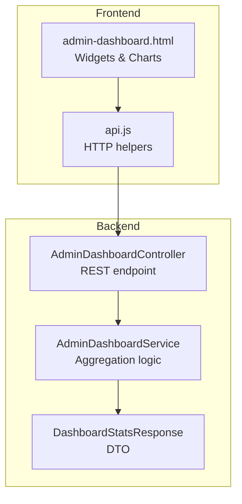
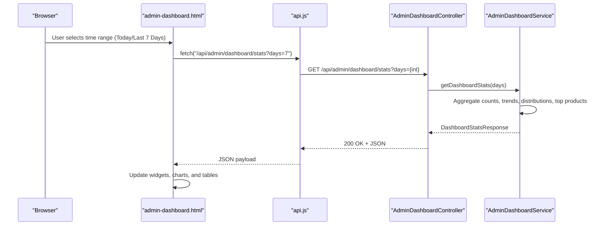
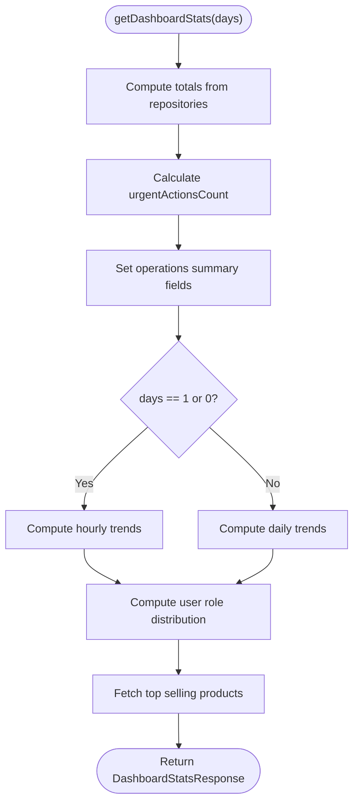
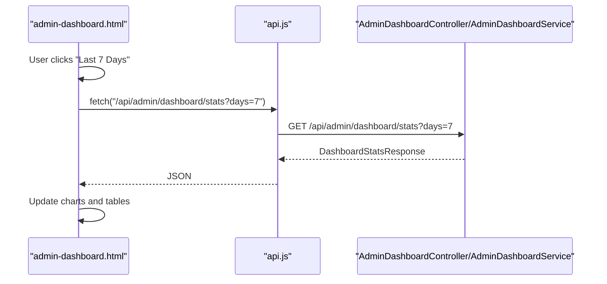
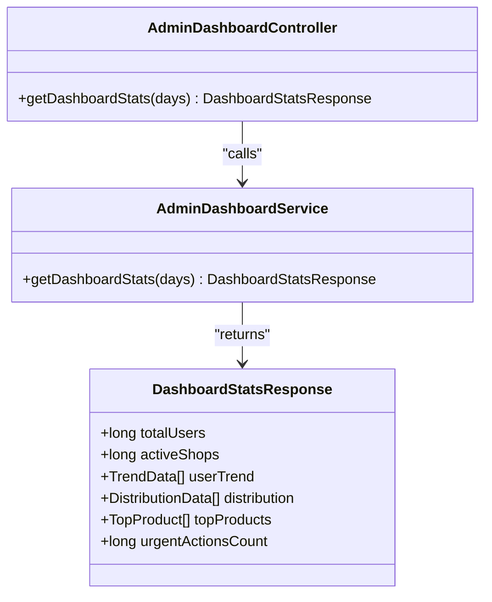

# Admin Dashboard

<cite>
**Referenced Files in This Document**
- [AdminDashboardController.java](file://src/Backend/src/main/java/com/shoppeclone/backend/admin/controller/AdminDashboardController.java)
- [AdminDashboardService.java](file://src/Backend/src/main/java/com/shoppeclone/backend/admin/service/AdminDashboardService.java)
- [DashboardStatsResponse.java](file://src/Backend/src/main/java/com/shoppeclone/backend/admin/dto/response/DashboardStatsResponse.java)
- [admin-dashboard.html](file://src/Frontend/admin-dashboard.html)
- [api.js](file://src/Frontend/js/services/api.js)
- [admin_dashboard_utf8.html](file://src/Frontend/backups/admin_dashboard_utf8.html)
</cite>

## Table of Contents
1. [Introduction](#introduction)
2. [Project Structure](#project-structure)
3. [Core Components](#core-components)
4. [Architecture Overview](#architecture-overview)
5. [Detailed Component Analysis](#detailed-component-analysis)
6. [Dependency Analysis](#dependency-analysis)
7. [Performance Considerations](#performance-considerations)
8. [Troubleshooting Guide](#troubleshooting-guide)
9. [Conclusion](#conclusion)

## Introduction
This document explains the admin dashboard functionality, focusing on the statistics retrieval system, revenue tracking, user analytics, and system metrics display. It documents the REST API endpoint for fetching dashboard data, the DashboardStatsResponse structure, and how it aggregates data from various business modules. It also covers widget implementations, real-time update strategies, and performance considerations including caching.

## Project Structure
The admin dashboard spans both backend and frontend:
- Backend: REST controller and service for computing aggregated statistics, plus DTOs for responses.
- Frontend: HTML page with Chart.js visualizations and JavaScript for fetching and rendering data.

**Diagram sources**
- [AdminDashboardController.java:17-20](file://src/Backend/src/main/java/com/shoppeclone/backend/admin/controller/AdminDashboardController.java#L17-L20)
- [AdminDashboardService.java:40-100](file://src/Backend/src/main/java/com/shoppeclone/backend/admin/service/AdminDashboardService.java#L40-L100)
- [DashboardStatsResponse.java:11-70](file://src/Backend/src/main/java/com/shoppeclone/backend/admin/dto/response/DashboardStatsResponse.java#L11-L70)
- [admin-dashboard.html:1333-2130](file://src/Frontend/admin-dashboard.html#L1333-L2130)
- [api.js:1-446](file://src/Frontend/js/services/api.js#L1-L446)

**Section sources**
- [AdminDashboardController.java:1-22](file://src/Backend/src/main/java/com/shoppeclone/backend/admin/controller/AdminDashboardController.java#L1-L22)
- [AdminDashboardService.java:1-258](file://src/Backend/src/main/java/com/shoppeclone/backend/admin/service/AdminDashboardService.java#L1-L258)
- [DashboardStatsResponse.java:1-70](file://src/Backend/src/main/java/com/shoppeclone/backend/admin/dto/response/DashboardStatsResponse.java#L1-L70)
- [admin-dashboard.html:1-3442](file://src/Frontend/admin-dashboard.html#L1-L3442)
- [api.js:1-446](file://src/Frontend/js/services/api.js#L1-L446)

## Core Components
- REST Endpoint: GET /api/admin/dashboard/stats?days={int}
- Controller: AdminDashboardController
- Service: AdminDashboardService (aggregates counts, trends, distributions, top products)
- Response DTO: DashboardStatsResponse (typed fields for counts, trends, distributions, top products)

Key capabilities:
- Totals: users, active shops, pending/rejected shops, disputes, flash sales
- Operations summary: open disputes, pending registrations
- Trends: hourly (today/yesterday) or daily (last N days) for users, shops, disputes, flash sale registrations
- Distribution: user roles (buyers/sellers/admins)
- Top selling products
- Urgent actions: campaigns nearing deadlines plus pending flash sale registrations

**Section sources**
- [AdminDashboardController.java:17-20](file://src/Backend/src/main/java/com/shoppeclone/backend/admin/controller/AdminDashboardController.java#L17-L20)
- [AdminDashboardService.java:40-100](file://src/Backend/src/main/java/com/shoppeclone/backend/admin/service/AdminDashboardService.java#L40-L100)
- [DashboardStatsResponse.java:11-70](file://src/Backend/src/main/java/com/shoppeclone/backend/admin/dto/response/DashboardStatsResponse.java#L11-L70)

## Architecture Overview
The admin dashboard follows a classic layered architecture:
- Presentation: admin-dashboard.html renders widgets and charts
- Service: AdminDashboardService orchestrates data aggregation from repositories
- Persistence: Repositories accessed via Spring-managed services
- API: AdminDashboardController exposes a single endpoint for dashboard stats

**Diagram sources**
- [AdminDashboardController.java:17-20](file://src/Backend/src/main/java/com/shoppeclone/backend/admin/controller/AdminDashboardController.java#L17-L20)
- [AdminDashboardService.java:40-100](file://src/Backend/src/main/java/com/shoppeclone/backend/admin/service/AdminDashboardService.java#L40-L100)
- [admin-dashboard.html:1333-2130](file://src/Frontend/admin-dashboard.html#L1333-L2130)
- [api.js:1-446](file://src/Frontend/js/services/api.js#L1-L446)

## Detailed Component Analysis

### REST API Endpoint
- Path: /api/admin/dashboard/stats
- Method: GET
- Query Parameter:
  - days: integer
    - 1: hourly trend for today
    - 0: hourly trend for yesterday
    - N (>1): daily trend for last N days
- Authentication: Requires Bearer token
- Response: DashboardStatsResponse

Example request:
- GET http://localhost:8080/api/admin/dashboard/stats?days=7

Response fields overview (see DashboardStatsResponse):
- Totals: totalUsers, activeShops, pendingShops, rejectedShops, totalDisputes, activeFlashSales, upcomingFlashSales, pendingFlashRegistrations, approvedFlashSaleItems
- Operations summary: openDisputes, pendingRegs
- Trends: userTrend, shopTrend, disputeTrend, flashSaleTrend (each TrendData has date/count)
- Distribution: distribution (DistributionData with label/value/percentage)
- Top products: topProducts (TopProduct with name/price/sold/status)
- Urgent actions: urgentActionsCount

**Section sources**
- [AdminDashboardController.java:17-20](file://src/Backend/src/main/java/com/shoppeclone/backend/admin/controller/AdminDashboardController.java#L17-L20)
- [DashboardStatsResponse.java:11-70](file://src/Backend/src/main/java/com/shoppeclone/backend/admin/dto/response/DashboardStatsResponse.java#L11-L70)

### DashboardStatsResponse Structure
The response DTO encapsulates all dashboard metrics and nested structures:
- Top-level fields: long/integers for counts and operations summary
- Nested collections:
  - TrendData: date (string), count (long)
  - DistributionData: label (string), value (long), percentage (int)
  - TopProduct: name (string), price (double), sold (int), status (string)

This structure enables straightforward rendering in the frontend widgets and charts.

**Section sources**
- [DashboardStatsResponse.java:11-70](file://src/Backend/src/main/java/com/shoppeclone/backend/admin/dto/response/DashboardStatsResponse.java#L11-L70)

### Aggregation Logic in AdminDashboardService
The service performs:
- Count aggregations across entities (users, shops, disputes, flash sale campaigns/items)
- Urgent actions calculation combining nearing deadlines and pending registrations
- Operations summary (open disputes, pending registrations)
- Trend calculations:
  - Hourly for today/yesterday
  - Daily for N-day windows
- User distribution by roles
- Top selling products by sold count

**Diagram sources**
- [AdminDashboardService.java:40-100](file://src/Backend/src/main/java/com/shoppeclone/backend/admin/service/AdminDashboardService.java#L40-L100)
- [AdminDashboardService.java:143-256](file://src/Backend/src/main/java/com/shoppeclone/backend/admin/service/AdminDashboardService.java#L143-L256)

**Section sources**
- [AdminDashboardService.java:40-100](file://src/Backend/src/main/java/com/shoppeclone/backend/admin/service/AdminDashboardService.java#L40-L100)
- [AdminDashboardService.java:143-256](file://src/Backend/src/main/java/com/shoppeclone/backend/admin/service/AdminDashboardService.java#L143-L256)

### Widget Implementations and Real-Time Updates
The frontend admin-dashboard.html implements:
- Stats cards for total users, active shops, total disputes
- Registration trend chart (Chart.js) for users, shops, disputes
- Flash sale management hub with urgent actions indicators
- User distribution bars
- Top selling products table
- Time range filters (Today, Yesterday, Last 7 Days, Last 30 Days)

Real-time update strategy:
- On page load and when changing time range, the frontend calls the stats endpoint and re-renders widgets.
- The frontend uses Chart.js to render trends and distributions.
- The fetch interceptor handles token refresh automatically.

**Diagram sources**
- [admin-dashboard.html:1333-2130](file://src/Frontend/admin-dashboard.html#L1333-L2130)
- [api.js:1-446](file://src/Frontend/js/services/api.js#L1-L446)
- [AdminDashboardController.java:17-20](file://src/Backend/src/main/java/com/shoppeclone/backend/admin/controller/AdminDashboardController.java#L17-L20)

**Section sources**
- [admin-dashboard.html:1333-2130](file://src/Frontend/admin-dashboard.html#L1333-L2130)
- [api.js:1-446](file://src/Frontend/js/services/api.js#L1-L446)

### Example Widget Implementations
- Stats cards: display totalUsers, activeShops, totalDisputes
- Registration trend chart: userTrend, shopTrend, disputeTrend mapped to Chart.js datasets
- User distribution bars: distribution mapped to bar widths and percentages
- Top products table: topProducts mapped to rows with name, price, sold, status
- Flash sale management hub: activeFlashSales, upcomingFlashSales, pendingFlashRegistrations, approvedFlashSaleItems, urgentActionsCount

These widgets rely on the typed fields in DashboardStatsResponse for safe rendering.

**Section sources**
- [DashboardStatsResponse.java:11-70](file://src/Backend/src/main/java/com/shoppeclone/backend/admin/dto/response/DashboardStatsResponse.java#L11-L70)
- [admin-dashboard.html:1333-2130](file://src/Frontend/admin-dashboard.html#L1333-L2130)

## Dependency Analysis
- AdminDashboardController depends on AdminDashboardService
- AdminDashboardService depends on multiple repositories (UserRepository, ShopRepository, DisputeRepository, ProductRepository, FlashSaleCampaignRepository, FlashSaleItemRepository)
- Frontend admin-dashboard.html depends on api.js for HTTP calls and Chart.js for visualization
- The DTO (DashboardStatsResponse) is shared contract between backend and frontend

**Diagram sources**
- [AdminDashboardController.java:17-20](file://src/Backend/src/main/java/com/shoppeclone/backend/admin/controller/AdminDashboardController.java#L17-L20)
- [AdminDashboardService.java:40-100](file://src/Backend/src/main/java/com/shoppeclone/backend/admin/service/AdminDashboardService.java#L40-L100)
- [DashboardStatsResponse.java:11-70](file://src/Backend/src/main/java/com/shoppeclone/backend/admin/dto/response/DashboardStatsResponse.java#L11-L70)

**Section sources**
- [AdminDashboardController.java:1-22](file://src/Backend/src/main/java/com/shoppeclone/backend/admin/controller/AdminDashboardController.java#L1-L22)
- [AdminDashboardService.java:1-258](file://src/Backend/src/main/java/com/shoppeclone/backend/admin/service/AdminDashboardService.java#L1-L258)
- [DashboardStatsResponse.java:1-70](file://src/Backend/src/main/java/com/shoppeclone/backend/admin/dto/response/DashboardStatsResponse.java#L1-L70)

## Performance Considerations
- Query volume:
  - The service executes multiple repository queries per request (counts, filtered lists for trends).
  - For large datasets, consider pagination or limiting trend windows.
- Trend computation:
  - groupAndFormatTrendDaily/groupAndFormatTrendHourly iterate through timestamps; ensure repository queries are efficient and use appropriate indices.
- Rendering overhead:
  - Chart.js rendering is client-side; minimize redundant redraws by updating only changed datasets.
- Caching strategies:
  - Short-lived cache (e.g., 1–5 minutes) for /api/admin/dashboard/stats to reduce repeated heavy computations.
  - Cache invalidation on significant business events (e.g., new shop registration, dispute resolution).
  - Consider Redis or in-memory caches keyed by days parameter.
- Token refresh:
  - The frontend fetch interceptor handles automatic token refresh, reducing failed requests and retries.

[No sources needed since this section provides general guidance]

## Troubleshooting Guide
Common issues and resolutions:
- 401 Unauthorized:
  - Ensure Authorization header with Bearer token is present.
  - The frontend fetch interceptor refreshes tokens; verify localStorage contains accessToken/refreshToken.
- CORS errors:
  - Confirm backend allows Authorization header and credentials.
- Empty or stale data:
  - Verify the days parameter is valid (1, 0, or N>1).
  - Re-fetch data after changing time range.
- Chart rendering issues:
  - Ensure Chart.js is loaded and canvas element exists.
  - Re-render charts after updating data.

**Section sources**
- [api.js:1-446](file://src/Frontend/js/services/api.js#L1-L446)
- [admin-dashboard.html:1-3442](file://src/Frontend/admin-dashboard.html#L1-L3442)

## Conclusion
The admin dashboard integrates a focused REST endpoint with a robust aggregation service and a responsive frontend. The DashboardStatsResponse provides a strongly typed contract for rendering diverse metrics, including counts, trends, distributions, and top products. With proper caching and efficient repository queries, the dashboard remains performant while delivering actionable insights for administrators.