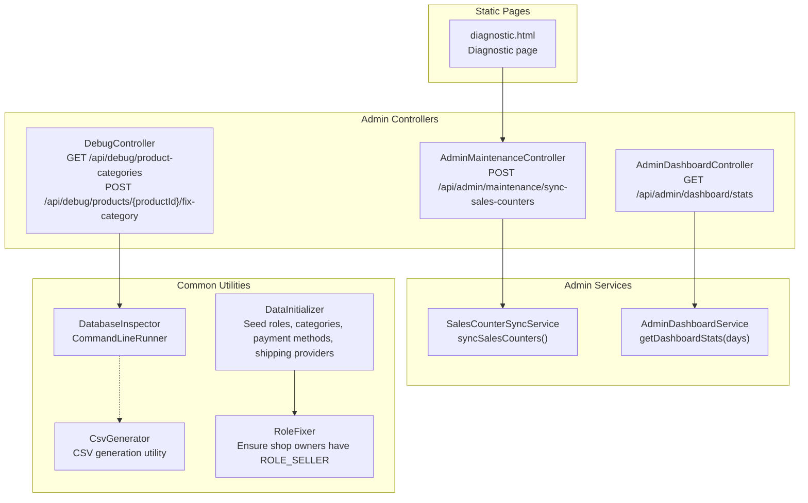
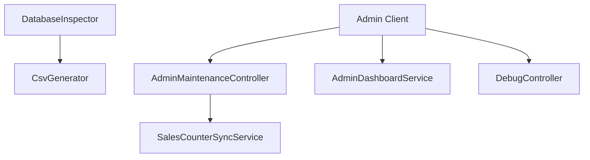
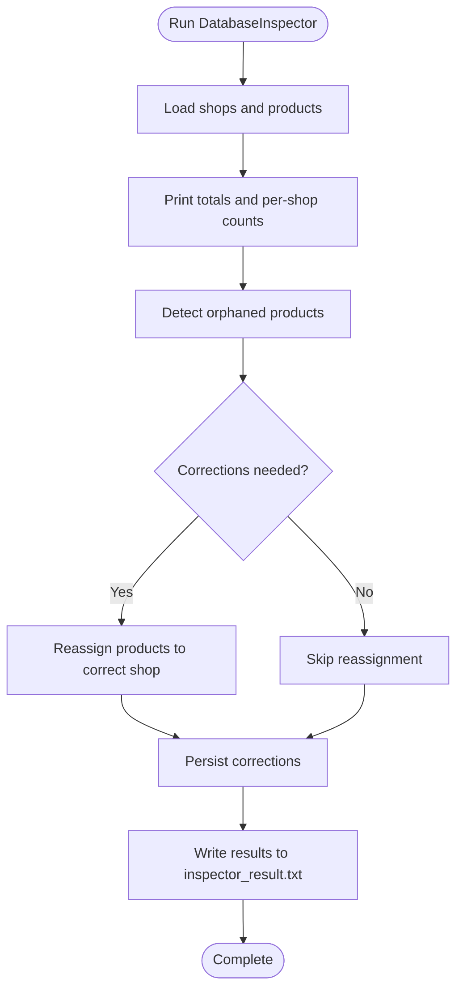
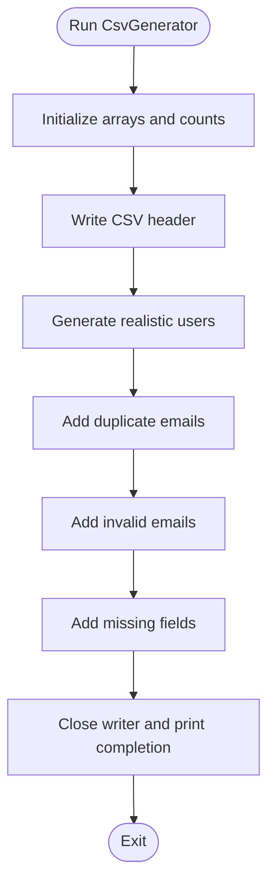
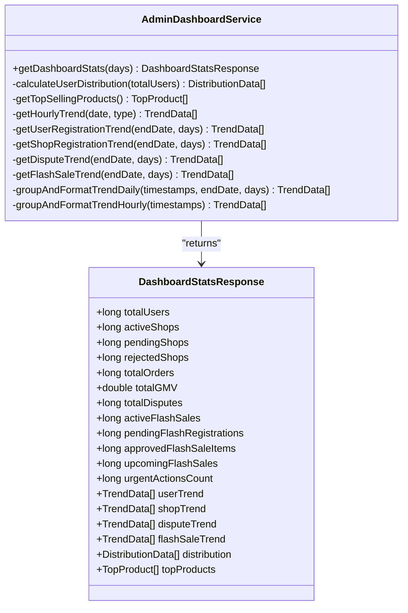
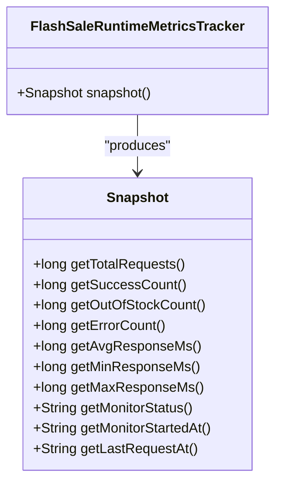
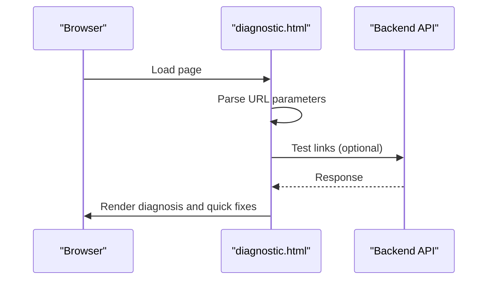

# Admin Maintenance Tools

<cite>
**Referenced Files in This Document**
- [AdminMaintenanceController.java](file://src\Backend\src\main\java\com\shoppeclone\backend\admin\controller\AdminMaintenanceController.java)
- [SalesCounterSyncService.java](file://src\Backend\src\main\java\com\shoppeclone\backend\admin\service\SalesCounterSyncService.java)
- [DatabaseInspector.java](file://src\Backend\src\main\java\com\shoppeclone\backend\common\DatabaseInspector.java)
- [CsvGenerator.java](file://src\Backend\src\main\java\com\shoppeclone\backend\common\utils\CsvGenerator.java)
- [AdminDashboardController.java](file://src\Backend\src\main\java\com\shoppeclone\backend\admin\controller\AdminDashboardController.java)
- [AdminDashboardService.java](file://src\Backend\src\main\java\com\shoppeclone\backend\admin\service\AdminDashboardService.java)
- [DashboardStatsResponse.java](file://src\Backend\src\main\java\com\shoppeclone\backend\admin\dto\response\DashboardStatsResponse.java)
- [DebugController.java](file://src\Backend\src\main\java\com\shoppeclone\backend\common\controller\DebugController.java)
- [DataInitializer.java](file://src\Backend\src\main\java\com\shoppeclone\backend\common\config\DataInitializer.java)
- [RoleFixer.java](file://src\Backend\src\main\java\com\shoppeclone\backend\common\config\RoleFixer.java)
- [FlashSaleRuntimeMetricsTracker.java](file://src\Backend\src\main\java\com\shoppeclone\backend\promotion\flashsale\service\impl\FlashSaleRuntimeMetricsTracker.java)
- [diagnostic.html](file://src\Backend\src\main\resources\static\diagnostic.html)
- [inspector_result.txt](file://data_dumps\inspector_result.txt)
- [users_10k.csv](file://src\Backend\users_10k.csv)
- [import_errors.md](file://docs\import_errors.md)
</cite>

## Table of Contents
1. [Introduction](#introduction)
2. [Project Structure](#project-structure)
3. [Core Components](#core-components)
4. [Architecture Overview](#architecture-overview)
5. [Detailed Component Analysis](#detailed-component-analysis)
6. [Dependency Analysis](#dependency-analysis)
7. [Performance Considerations](#performance-considerations)
8. [Troubleshooting Guide](#troubleshooting-guide)
9. [Conclusion](#conclusion)
10. [Appendices](#appendices)

## Introduction
This document describes the admin maintenance and diagnostic tools available in the backend. It explains database inspection capabilities, system health checks, data integrity validation, and maintenance operation workflows. It documents the REST API endpoints for maintenance tasks, diagnostic queries, and system monitoring, and details the DatabaseInspector functionality for identifying data inconsistencies and structural issues. It also covers the CsvGenerator utility for exporting system data and reports, and provides examples of maintenance procedures, diagnostic workflows, and automated cleanup operations. Finally, it addresses the performance impact of maintenance operations and best practices for scheduled maintenance.

## Project Structure
The maintenance and diagnostics features are primarily located under the admin and common packages, with supporting utilities and static diagnostic pages.

**Diagram sources**
- [AdminMaintenanceController.java:13-25](file://src\Backend\src\main\java\com\shoppeclone\backend\admin\controller\AdminMaintenanceController.java#L13-L25)
- [AdminDashboardController.java:9-21](file://src\Backend\src\main\java\com\shoppeclone\backend\admin\controller\AdminDashboardController.java#L9-L21)
- [DebugController.java:16-57](file://src\Backend\src\main\java\com\shoppeclone\backend\common\controller\DebugController.java#L16-L57)
- [SalesCounterSyncService.java:27-132](file://src\Backend\src\main\java\com\shoppeclone\backend\admin\service\SalesCounterSyncService.java#L27-L132)
- [AdminDashboardService.java:29-257](file://src\Backend\src\main\java\com\shoppeclone\backend\admin\service\AdminDashboardService.java#L29-L257)
- [DatabaseInspector.java:16-86](file://src\Backend\src\main\java\com\shoppeclone\backend\common\DatabaseInspector.java#L16-L86)
- [CsvGenerator.java:9-79](file://src\Backend\src\main\java\com\shoppeclone\backend\common\utils\CsvGenerator.java#L9-L79)
- [DataInitializer.java:24-203](file://src\Backend\src\main\java\com\shoppeclone\backend\common\config\DataInitializer.java#L24-L203)
- [RoleFixer.java:16-90](file://src\Backend\src\main\java\com\shoppeclone\backend\common\config\RoleFixer.java#L16-L90)
- [diagnostic.html:33-87](file://src\Backend\src\main\resources\static\diagnostic.html#L33-L87)

**Section sources**
- [AdminMaintenanceController.java:1-26](file://src\Backend\src\main\java\com\shoppeclone\backend\admin\controller\AdminMaintenanceController.java#L1-L26)
- [AdminDashboardController.java:1-22](file://src\Backend\src\main\java\com\shoppeclone\backend\admin\controller\AdminDashboardController.java#L1-L22)
- [DebugController.java:1-58](file://src\Backend\src\main\java\com\shoppeclone\backend\common\controller\DebugController.java#L1-L58)
- [DatabaseInspector.java:1-87](file://src\Backend\src\main\java\com\shoppeclone\backend\common\DatabaseInspector.java#L1-L87)
- [CsvGenerator.java:1-79](file://src\Backend\src\main\java\com\shoppeclone\backend\common\utils\CsvGenerator.java#L1-L79)
- [DataInitializer.java:1-203](file://src\Backend\src\main\java\com\shoppeclone\backend\common\config\DataInitializer.java#L1-L203)
- [RoleFixer.java:1-90](file://src\Backend\src\main\java\com\shoppeclone\backend\common\config\RoleFixer.java#L1-L90)
- [diagnostic.html:33-87](file://src\Backend\src\main\resources\static\diagnostic.html#L33-L87)

## Core Components
- AdminMaintenanceController: Exposes a single maintenance endpoint to synchronize sales counters across products and variants.
- SalesCounterSyncService: Computes sold quantities from completed orders and flash sale items, updates product and variant counters, and returns a summary of changes.
- DatabaseInspector: Performs a database inspection, detects orphaned products, and performs corrective actions (e.g., reassigning products to the correct shop), writing results to a file.
- CsvGenerator: Generates realistic CSV datasets for testing and diagnostics, including valid users, duplicates, invalid emails, and missing fields.
- AdminDashboardController and AdminDashboardService: Provide administrative dashboard statistics and trends.
- DebugController: Offers debugging endpoints for product categories and category fixes.
- DataInitializer and RoleFixer: Seed and normalize system data and permissions during startup.
- diagnostic.html: Static page for quick diagnostics and tests.

**Section sources**
- [AdminMaintenanceController.java:13-25](file://src\Backend\src\main\java\com\shoppeclone\backend\admin\controller\AdminMaintenanceController.java#L13-L25)
- [SalesCounterSyncService.java:27-132](file://src\Backend\src\main\java\com\shoppeclone\backend\admin\service\SalesCounterSyncService.java#L27-L132)
- [DatabaseInspector.java:16-86](file://src\Backend\src\main\java\com\shoppeclone\backend\common\DatabaseInspector.java#L16-L86)
- [CsvGenerator.java:9-79](file://src\Backend\src\main\java\com\shoppeclone\backend\common\utils\CsvGenerator.java#L9-L79)
- [AdminDashboardController.java:9-21](file://src\Backend\src\main\java\com\shoppeclone\backend\admin\controller\AdminDashboardController.java#L9-L21)
- [AdminDashboardService.java:29-257](file://src\Backend\src\main\java\com\shoppeclone\backend\admin\service\AdminDashboardService.java#L29-L257)
- [DebugController.java:16-57](file://src\Backend\src\main\java\com\shoppeclone\backend\common\controller\DebugController.java#L16-L57)
- [DataInitializer.java:24-203](file://src\Backend\src\main\java\com\shoppeclone\backend\common\config\DataInitializer.java#L24-L203)
- [RoleFixer.java:16-90](file://src\Backend\src\main\java\com\shoppeclone\backend\common\config\RoleFixer.java#L16-L90)
- [diagnostic.html:33-87](file://src\Backend\src\main\resources\static\diagnostic.html#L33-L87)

## Architecture Overview
The maintenance and diagnostic architecture centers around controllers that expose endpoints, services that encapsulate business logic, and utilities for data generation and inspection. The system integrates with repositories to read and write data, and writes diagnostic outputs to files or returns structured responses.

**Diagram sources**
- [AdminMaintenanceController.java:13-25](file://src\Backend\src\main\java\com\shoppeclone\backend\admin\controller\AdminMaintenanceController.java#L13-L25)
- [SalesCounterSyncService.java:27-132](file://src\Backend\src\main\java\com\shoppeclone\backend\admin\service\SalesCounterSyncService.java#L27-L132)
- [DatabaseInspector.java:16-86](file://src\Backend\src\main\java\com\shoppeclone\backend\common\DatabaseInspector.java#L16-L86)
- [CsvGenerator.java:9-79](file://src\Backend\src\main\java\com\shoppeclone\backend\common\utils\CsvGenerator.java#L9-L79)
- [AdminDashboardService.java:29-257](file://src\Backend\src\main\java\com\shoppeclone\backend\admin\service\AdminDashboardService.java#L29-L257)
- [DebugController.java:16-57](file://src\Backend\src\main\java\com\shoppeclone\backend\common\controller\DebugController.java#L16-L57)

## Detailed Component Analysis

### REST API Endpoints for Maintenance and Diagnostics
- POST /api/admin/maintenance/sync-sales-counters
  - Purpose: Synchronize sales counters for products and variants based on completed orders and active flash sale items.
  - Authentication: Requires ADMIN role.
  - Response: JSON map containing success flag, counts of scanned/updated entities, and timestamp of synchronization.
  - Implementation: AdminMaintenanceController delegates to SalesCounterSyncService.
  - Section sources
    - [AdminMaintenanceController.java:13-25](file://src\Backend\src\main\java\com\shoppeclone\backend\admin\controller\AdminMaintenanceController.java#L13-L25)
    - [SalesCounterSyncService.java:27-132](file://src\Backend\src\main\java\com\shoppeclone\backend\admin\service\SalesCounterSyncService.java#L27-L132)

- GET /api/admin/dashboard/stats?days={n}
  - Purpose: Retrieve administrative dashboard statistics and trends.
  - Response: DashboardStatsResponse with totals, counts, distributions, and trend data.
  - Implementation: AdminDashboardController delegates to AdminDashboardService.
  - Section sources
    - [AdminDashboardController.java:9-21](file://src\Backend\src\main\java\com\shoppeclone\backend\admin\controller\AdminDashboardController.java#L9-L21)
    - [AdminDashboardService.java:29-257](file://src\Backend\src\main\java\com\shoppeclone\backend\admin\service\AdminDashboardService.java#L29-L257)
    - [DashboardStatsResponse.java:8-70](file://src\Backend\src\main\java\com\shoppeclone\backend\admin\dto\response\DashboardStatsResponse.java#L8-L70)

- GET /api/debug/product-categories
  - Purpose: Retrieve all product-category associations for debugging.
  - Response: List of product-category mappings.
  - Implementation: DebugController.
  - Section sources
    - [DebugController.java:16-57](file://src\Backend\src\main\java\com\shoppeclone\backend\common\controller\DebugController.java#L16-L57)

- POST /api/debug/products/{productId}/fix-category
  - Purpose: Automatically fix a product’s category by detecting from product name and updating the association.
  - Response: JSON map with message, productId, productName, and category.
  - Implementation: DebugController.
  - Section sources
    - [DebugController.java:16-57](file://src\Backend\src\main\java\com\shoppeclone\backend\common\controller\DebugController.java#L16-L57)

### Database Inspector Functionality
DatabaseInspector performs:
- Counting shops and products.
- Identifying orphaned products (those without a valid shop association).
- Performing corrective actions (e.g., reassigning products from a mis-assigned shop to the correct shop).
- Writing inspection results to a file for later review.

**Diagram sources**
- [DatabaseInspector.java:16-86](file://src\Backend\src\main\java\com\shoppeclone\backend\common\DatabaseInspector.java#L16-L86)

**Section sources**
- [DatabaseInspector.java:16-86](file://src\Backend\src\main\java\com\shoppeclone\backend\common\DatabaseInspector.java#L16-L86)
- [inspector_result.txt:1-7](file://data_dumps\inspector_result.txt#L1-L7)

### CsvGenerator Utility
CsvGenerator creates realistic CSV datasets for testing and diagnostics:
- Generates a header row and realistic Vietnamese user entries.
- Produces controlled duplicates, invalid emails, and missing fields to simulate dirty data.
- Outputs a CSV file suitable for import testing and validation.

**Diagram sources**
- [CsvGenerator.java:9-79](file://src\Backend\src\main\java\com\shoppeclone\backend\common\utils\CsvGenerator.java#L9-L79)

**Section sources**
- [CsvGenerator.java:9-79](file://src\Backend\src\main\java\com\shoppeclone\backend\common\utils\CsvGenerator.java#L9-L79)
- [users_10k.csv:10032-10051](file://src\Backend\users_10k.csv#L10032-L10051)
- [import_errors.md:1-38](file://docs\import_errors.md#L1-L38)

### Administrative Dashboard
AdminDashboardService aggregates:
- Totals and counts for users, shops, disputes, and flash sales.
- Operational summaries and urgent action indicators.
- Trend data for user, shop, dispute, and flash sale registrations.
- User distribution by role and top-selling products.

**Diagram sources**
- [AdminDashboardService.java:29-257](file://src\Backend\src\main\java\com\shoppeclone\backend\admin\service\AdminDashboardService.java#L29-L257)
- [DashboardStatsResponse.java:8-70](file://src\Backend\src\main\java\com\shoppeclone\backend\admin\dto\response\DashboardStatsResponse.java#L8-L70)

**Section sources**
- [AdminDashboardController.java:9-21](file://src\Backend\src\main\java\com\shoppeclone\backend\admin\controller\AdminDashboardController.java#L9-L21)
- [AdminDashboardService.java:29-257](file://src\Backend\src\main\java\com\shoppeclone\backend\admin\service\AdminDashboardService.java#L29-L257)
- [DashboardStatsResponse.java:8-70](file://src\Backend\src\main\java\com\shoppeclone\backend\admin\dto\response\DashboardStatsResponse.java#L8-L70)

### System Health Monitoring
FlashSaleRuntimeMetricsTracker provides runtime metrics snapshots for flash sale operations, including request counts, success/out-of-stock/error counts, and response time statistics. This supports operational monitoring and alerting.

**Diagram sources**
- [FlashSaleRuntimeMetricsTracker.java:37-159](file://src\Backend\src\main\java\com\shoppeclone\backend\promotion\flashsale\service\impl\FlashSaleRuntimeMetricsTracker.java#L37-L159)

**Section sources**
- [FlashSaleRuntimeMetricsTracker.java:37-159](file://src\Backend\src\main\java\com\shoppeclone\backend\promotion\flashsale\service\impl\FlashSaleRuntimeMetricsTracker.java#L37-L159)

### Diagnostic Page
The diagnostic.html page provides quick checks and guidance for common issues, including URL parameter parsing and basic troubleshooting steps.

**Diagram sources**
- [diagnostic.html:33-87](file://src\Backend\src\main\resources\static\diagnostic.html#L33-L87)

**Section sources**
- [diagnostic.html:33-87](file://src\Backend\src\main\resources\static\diagnostic.html#L33-L87)

## Dependency Analysis
The maintenance and diagnostic components interact with repositories and each other as follows:

```mermaid
graph TB
AMC["AdminMaintenanceController"] --> SCS["SalesCounterSyncService"]
SCS --> OR["OrderRepository"]
SCS --> PR["ProductRepository"]
SCS --> PVR["ProductVariantRepository"]
SCS --> FSR["FlashSaleRepository"]
SCS --> FSIR["FlashSaleItemRepository"]
DI["DatabaseInspector"] --> SR["ShopRepository"]
DI --> PR2["ProductRepository"]
DI --> CG["CsvGenerator"]
ADS["AdminDashboardService"] --> UR["UserRepository"]
ADS --> ShR["ShopRepository"]
ADS --> DR["DisputeRepository"]
ADS --> PR3["ProductRepository"]
ADS --> FSCR["FlashSaleCampaignRepository"]
ADS --> FSIR2["FlashSaleItemRepository"]
DC["DebugController"] --> PCR["ProductCategoryRepository"]
DC --> PR4["ProductRepository"]
DC --> CR["CategoryRepository"]
DIH["DataInitializer"] --> RR["RoleRepository"]
DIH --> CR2["CategoryRepository"]
DIH --> PMR["PaymentMethodRepository"]
DIH --> SPR["ShippingProviderRepository"]
DIH --> UR2["UserRepository"]
DIH --> FSS["FlashSaleService"]
RF["RoleFixer"] --> UR3["UserRepository"]
RF --> ShR2["ShopRepository"]
RF --> RR2["RoleRepository"]
RF --> FSCR2["FlashSaleCampaignRepository"]
```

**Diagram sources**
- [AdminMaintenanceController.java:13-25](file://src\Backend\src\main\java\com\shoppeclone\backend\admin\controller\AdminMaintenanceController.java#L13-L25)
- [SalesCounterSyncService.java:27-132](file://src\Backend\src\main\java\com\shoppeclone\backend\admin\service\SalesCounterSyncService.java#L27-L132)
- [DatabaseInspector.java:16-86](file://src\Backend\src\main\java\com\shoppeclone\backend\common\DatabaseInspector.java#L16-L86)
- [AdminDashboardService.java:29-257](file://src\Backend\src\main\java\com\shoppeclone\backend\admin\service\AdminDashboardService.java#L29-L257)
- [DebugController.java:16-57](file://src\Backend\src\main\java\com\shoppeclone\backend\common\controller\DebugController.java#L16-L57)
- [DataInitializer.java:24-203](file://src\Backend\src\main\java\com\shoppeclone\backend\common\config\DataInitializer.java#L24-L203)
- [RoleFixer.java:16-90](file://src\Backend\src\main\java\com\shoppeclone\backend\common\config\RoleFixer.java#L16-L90)

**Section sources**
- [SalesCounterSyncService.java:27-132](file://src\Backend\src\main\java\com\shoppeclone\backend\admin\service\SalesCounterSyncService.java#L27-L132)
- [DatabaseInspector.java:16-86](file://src\Backend\src\main\java\com\shoppeclone\backend\common\DatabaseInspector.java#L16-L86)
- [AdminDashboardService.java:29-257](file://src\Backend\src\main\java\com\shoppeclone\backend\admin\service\AdminDashboardService.java#L29-L257)
- [DebugController.java:16-57](file://src\Backend\src\main\java\com\shoppeclone\backend\common\controller\DebugController.java#L16-L57)
- [DataInitializer.java:24-203](file://src\Backend\src\main\java\com\shoppeclone\backend\common\config\DataInitializer.java#L24-L203)
- [RoleFixer.java:16-90](file://src\Backend\src\main\java\com\shoppeclone\backend\common\config\RoleFixer.java#L16-L90)

## Performance Considerations
- Sales counter synchronization scans all products, variants, and completed orders, then iterates through flash sale items to compute sold quantities. This can be expensive on large datasets. To minimize impact:
  - Schedule the operation during off-peak hours.
  - Consider batching updates and using database indexes on frequently queried fields.
  - Monitor transaction duration and adjust thresholds for live operations.
- DatabaseInspector loads all shops and products into memory to compute counts and detect orphans. On large datasets:
  - Use pagination or streaming where possible.
  - Ensure appropriate indexing on foreign keys (e.g., shopId).
  - Run inspections as part of maintenance windows.
- CsvGenerator writes a large CSV file synchronously. For production environments:
  - Offload generation to background jobs.
  - Use buffered I/O and consider compression.
- Dashboard computations aggregate counts and trends. For high-frequency dashboards:
  - Cache results with TTL.
  - Precompute trending data periodically and serve cached views.

[No sources needed since this section provides general guidance]

## Troubleshooting Guide
- Maintenance endpoint returns unauthorized:
  - Ensure the caller has the ADMIN role.
  - Verify security filters and JWT tokens.
  - Section sources
    - [AdminMaintenanceController.java:13-25](file://src\Backend\src\main\java\com\shoppeclone\backend\admin\controller\AdminMaintenanceController.java#L13-L25)

- Sales counter synchronization does not reflect recent orders:
  - Confirm completed orders exist and are not filtered out by status.
  - Verify flash sale items are approved and within live statuses.
  - Check repository queries and transaction boundaries.
  - Section sources
    - [SalesCounterSyncService.java:27-132](file://src\Backend\src\main\java\com\shoppeclone\backend\admin\service\SalesCounterSyncService.java#L27-L132)

- Orphaned products remain after inspection:
  - Validate shop existence and IDs.
  - Confirm repository updates persisted.
  - Review inspector logs and output file.
  - Section sources
    - [DatabaseInspector.java:16-86](file://src\Backend\src\main\java\com\shoppeclone\backend\common\DatabaseInspector.java#L16-L86)
    - [inspector_result.txt:1-7](file://data_dumps\inspector_result.txt#L1-L7)

- CSV import errors:
  - Review import error report for duplicate emails, invalid formats, and missing fields.
  - Use CsvGenerator to produce clean datasets for testing.
  - Section sources
    - [import_errors.md:1-38](file://docs\import_errors.md#L1-L38)
    - [CsvGenerator.java:9-79](file://src\Backend\src\main\java\com\shoppeclone\backend\common\utils\CsvGenerator.java#L9-L79)

- Role permissions for shop owners:
  - RoleFixer ensures shop owners have ROLE_SELLER; verify execution and logs.
  - Section sources
    - [RoleFixer.java:16-90](file://src\Backend\src\main\java\com\shoppeclone\backend\common\config\RoleFixer.java#L16-L90)

- Flash sale monitoring:
  - Use runtime metrics to assess live status and response times.
  - Section sources
    - [FlashSaleRuntimeMetricsTracker.java:37-159](file://src\Backend\src\main\java\com\shoppeclone\backend\promotion\flashsale\service\impl\FlashSaleRuntimeMetricsTracker.java#L37-L159)

## Conclusion
The admin maintenance and diagnostic toolkit provides robust capabilities for database inspection, sales counter synchronization, dashboard analytics, and operational monitoring. By leveraging the documented endpoints, utilities, and best practices, administrators can maintain system integrity, validate data quality, and ensure smooth operations with minimal performance impact.

[No sources needed since this section summarizes without analyzing specific files]

## Appendices

### Maintenance Procedures Examples
- Synchronize sales counters:
  - Invoke POST /api/admin/maintenance/sync-sales-counters.
  - Review returned summary for updated counts and timestamp.
  - Section sources
    - [AdminMaintenanceController.java:13-25](file://src\Backend\src\main\java\com\shoppeclone\backend\admin\controller\AdminMaintenanceController.java#L13-L25)
    - [SalesCounterSyncService.java:27-132](file://src\Backend\src\main\java\com\shoppeclone\backend\admin\service\SalesCounterSyncService.java#L27-L132)

- Inspect database and correct inconsistencies:
  - Run DatabaseInspector (command-line runner).
  - Review inspector_result.txt for counts and corrections.
  - Section sources
    - [DatabaseInspector.java:16-86](file://src\Backend\src\main\java\com\shoppeclone\backend\common\DatabaseInspector.java#L16-L86)
    - [inspector_result.txt:1-7](file://data_dumps\inspector_result.txt#L1-L7)

- Generate test datasets:
  - Execute CsvGenerator to create users_10k.csv with controlled dirty data.
  - Use import_errors.md as a reference for expected rejection patterns.
  - Section sources
    - [CsvGenerator.java:9-79](file://src\Backend\src\main\java\com\shoppeclone\backend\common\utils\CsvGenerator.java#L9-L79)
    - [import_errors.md:1-38](file://docs\import_errors.md#L1-L38)

### Diagnostic Workflows
- Use diagnostic.html to validate URLs and parameters.
- Apply quick fixes such as hard refresh and clearing browser cache.
- Section sources
    - [diagnostic.html:33-87](file://src\Backend\src\main\resources\static\diagnostic.html#L33-L87)

### Automated Cleanup Operations
- DataInitializer seeds roles, categories, payment methods, and shipping providers, ensuring baseline consistency.
- RoleFixer grants ROLE_SELLER to shop owners automatically.
- Section sources
    - [DataInitializer.java:24-203](file://src\Backend\src\main\java\com\shoppeclone\backend\common\config\DataInitializer.java#L24-L203)
    - [RoleFixer.java:16-90](file://src\Backend\src\main\java\com\shoppeclone\backend\common\config\RoleFixer.java#L16-L90)