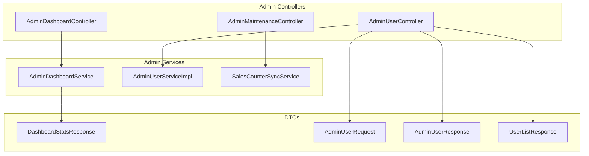
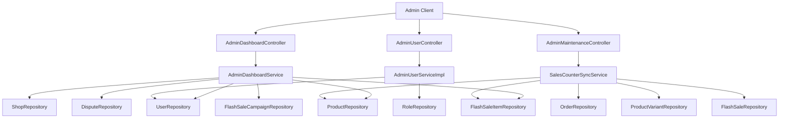
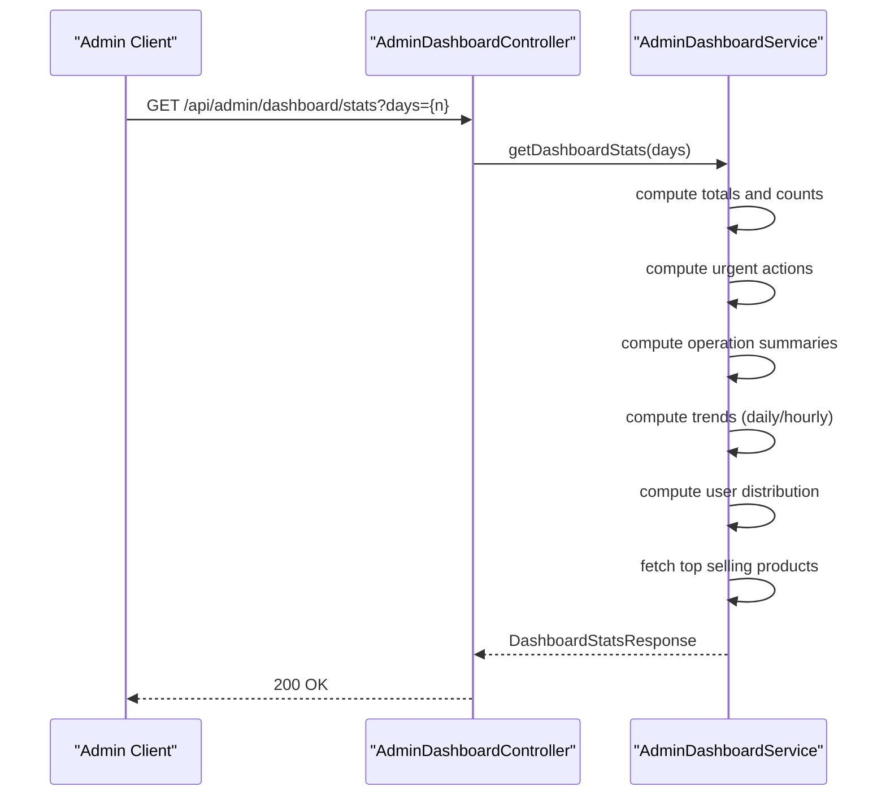
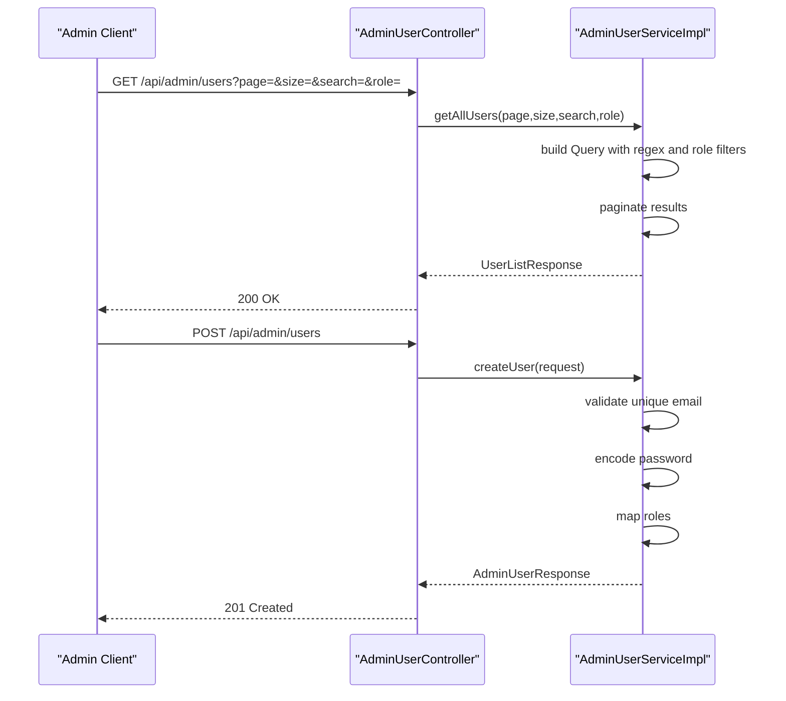
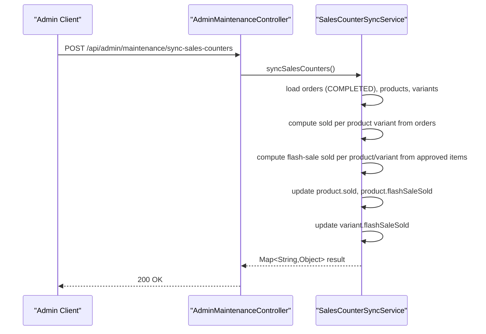
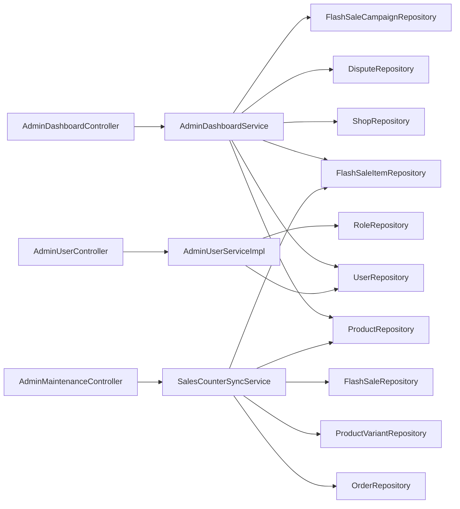

# Admin Panel System

<cite>
**Referenced Files in This Document**
- [AdminDashboardController.java](file://src\Backend\src\main\java\com\shoppeclone\backend\admin\controller\AdminDashboardController.java)
- [AdminUserController.java](file://src\Backend\src\main\java\com\shoppeclone\backend\admin\controller\AdminUserController.java)
- [AdminMaintenanceController.java](file://src\Backend\src\main\java\com\shoppeclone\backend\admin\controller\AdminMaintenanceController.java)
- [AdminDashboardService.java](file://src\Backend\src\main\java\com\shoppeclone\backend\admin\service\AdminDashboardService.java)
- [AdminUserService.java](file://src\Backend\src\main\java\com\shoppeclone\backend\admin\service\AdminUserService.java)
- [AdminUserServiceImpl.java](file://src\Backend\src\main\java\com\shoppeclone\backend\admin\service\impl\AdminUserServiceImpl.java)
- [SalesCounterSyncService.java](file://src\Backend\src\main\java\com\shoppeclone\backend\admin\service\SalesCounterSyncService.java)
- [AdminUserRequest.java](file://src\Backend\src\main\java\com\shoppeclone\backend\admin\dto\request\AdminUserRequest.java)
- [DashboardStatsResponse.java](file://src\Backend\src\main\java\com\shoppeclone\backend\admin\dto\response\DashboardStatsResponse.java)
- [AdminUserResponse.java](file://src\Backend\src\main\java\com\shoppeclone\backend\admin\dto\response\AdminUserResponse.java)
- [UserListResponse.java](file://src\Backend\src\main\java\com\shoppeclone\backend\admin\dto\response\UserListResponse.java)
- [SecurityConfig.java](file://src\Backend\src\main\java\com\shoppeclone\backend\auth\security\SecurityConfig.java)
- [Role.java](file://src\Backend\src\main\java\com\shoppeclone\backend\auth\model\Role.java)
</cite>

## Table of Contents
1. [Introduction](#introduction)
2. [Project Structure](#project-structure)
3. [Core Components](#core-components)
4. [Architecture Overview](#architecture-overview)
5. [Detailed Component Analysis](#detailed-component-analysis)
6. [Dependency Analysis](#dependency-analysis)
7. [Performance Considerations](#performance-considerations)
8. [Troubleshooting Guide](#troubleshooting-guide)
9. [Conclusion](#conclusion)
10. [Appendices](#appendices)

## Introduction
This document explains the Admin Panel System, covering the admin dashboard, user management, maintenance tools, sales counter synchronization, and system monitoring capabilities. It provides concrete examples from the codebase, documents configuration options and parameters, outlines return values, and describes relationships with other business modules. It also includes administrative permissions, system health monitoring, and operational reporting guidance, designed to be accessible to beginners while offering sufficient technical depth for experienced developers.

## Project Structure
The admin panel is implemented as a Spring Boot REST API module with three primary controllers:
- AdminDashboardController: exposes dashboard statistics endpoints
- AdminUserController: manages users (CRUD, status toggling, role updates)
- AdminMaintenanceController: triggers maintenance tasks such as sales counter synchronization

These controllers delegate to services that encapsulate business logic and interact with repositories/models across the system.

**Diagram sources**
- [AdminDashboardController.java:1-22](file://src\Backend\src\main\java\com\shoppeclone\backend\admin\controller\AdminDashboardController.java#L1-L22)
- [AdminUserController.java:1-112](file://src\Backend\src\main\java\com\shoppeclone\backend\admin\controller\AdminUserController.java#L1-L112)
- [AdminMaintenanceController.java:1-26](file://src\Backend\src\main\java\com\shoppeclone\backend\admin\controller\AdminMaintenanceController.java#L1-L26)
- [AdminDashboardService.java:1-258](file://src\Backend\src\main\java\com\shoppeclone\backend\admin\service\AdminDashboardService.java#L1-L258)
- [AdminUserServiceImpl.java:1-238](file://src\Backend\src\main\java\com\shoppeclone\backend\admin\service\impl\AdminUserServiceImpl.java#L1-L238)
- [SalesCounterSyncService.java:1-133](file://src\Backend\src\main\java\com\shoppeclone\backend\admin\service\SalesCounterSyncService.java#L1-L133)
- [DashboardStatsResponse.java:1-70](file://src\Backend\src\main\java\com\shoppeclone\backend\admin\dto\response\DashboardStatsResponse.java#L1-L70)
- [AdminUserRequest.java:1-15](file://src\Backend\src\main\java\com\shoppeclone\backend\admin\dto\request\AdminUserRequest.java#L1-L15)
- [AdminUserResponse.java:1-23](file://src\Backend\src\main\java\com\shoppeclone\backend\admin\dto\response\AdminUserResponse.java#L1-L23)
- [UserListResponse.java:1-18](file://src\Backend\src\main\java\com\shoppeclone\backend\admin\dto\response\UserListResponse.java#L1-L18)

**Section sources**
- [AdminDashboardController.java:1-22](file://src\Backend\src\main\java\com\shoppeclone\backend\admin\controller\AdminDashboardController.java#L1-L22)
- [AdminUserController.java:1-112](file://src\Backend\src\main\java\com\shoppeclone\backend\admin\controller\AdminUserController.java#L1-L112)
- [AdminMaintenanceController.java:1-26](file://src\Backend\src\main\java\com\shoppeclone\backend\admin\controller\AdminMaintenanceController.java#L1-L26)

## Core Components
- AdminDashboardController: Exposes GET /api/admin/dashboard/stats with a days parameter to fetch aggregated metrics and trends.
- AdminUserController: Provides endpoints for listing, retrieving, creating, updating, deleting users, toggling status, and updating roles.
- AdminMaintenanceController: Exposes POST /api/admin/maintenance/sync-sales-counters to synchronize sales counters across products and variants.
- AdminDashboardService: Computes totals, urgent actions, operation summaries, trend data (hourly/daily), user distribution, and top selling products.
- AdminUserService and AdminUserServiceImpl: Define and implement user management operations with MongoDB queries, pagination, filtering, and role mapping.
- SalesCounterSyncService: Performs transactional reconciliation of sold quantities for regular and flash-sale items and updates product/product variant counters.

**Section sources**
- [AdminDashboardController.java:17-20](file://src\Backend\src\main\java\com\shoppeclone\backend\admin\controller\AdminDashboardController.java#L17-L20)
- [AdminUserController.java:29-110](file://src\Backend\src\main\java\com\shoppeclone\backend\admin\controller\AdminUserController.java#L29-L110)
- [AdminMaintenanceController.java:21-24](file://src\Backend\src\main\java\com\shoppeclone\backend\admin\controller\AdminMaintenanceController.java#L21-L24)
- [AdminDashboardService.java:40-100](file://src\Backend\src\main\java\com\shoppeclone\backend\admin\service\AdminDashboardService.java#L40-L100)
- [AdminUserServiceImpl.java:40-75](file://src\Backend\src\main\java\com\shoppeclone\backend\admin\service\impl\AdminUserServiceImpl.java#L40-L75)
- [SalesCounterSyncService.java:40-131](file://src\Backend\src\main\java\com\shoppeclone\backend\admin\service\SalesCounterSyncService.java#L40-L131)

## Architecture Overview
The admin panel follows a layered architecture:
- Presentation: REST controllers handle HTTP requests and responses
- Application: Services encapsulate business logic and orchestrate data retrieval
- Persistence: Repositories and MongoDB collections store domain entities
- Security: Method-level authorization enforces ADMIN role for sensitive endpoints

**Diagram sources**
- [AdminDashboardController.java:1-22](file://src\Backend\src\main\java\com\shoppeclone\backend\admin\controller\AdminDashboardController.java#L1-L22)
- [AdminUserController.java:1-112](file://src\Backend\src\main\java\com\shoppeclone\backend\admin\controller\AdminUserController.java#L1-L112)
- [AdminMaintenanceController.java:1-26](file://src\Backend\src\main\java\com\shoppeclone\backend\admin\controller\AdminMaintenanceController.java#L1-L26)
- [AdminDashboardService.java:33-38](file://src\Backend\src\main\java\com\shoppeclone\backend\admin\service\AdminDashboardService.java#L33-L38)
- [AdminUserServiceImpl.java:34-37](file://src\Backend\src\main\java\com\shoppeclone\backend\admin\service\impl\AdminUserServiceImpl.java#L34-L37)
- [SalesCounterSyncService.java:33-37](file://src\Backend\src\main\java\com\shoppeclone\backend\admin\service\SalesCounterSyncService.java#L33-L37)

## Detailed Component Analysis

### Admin Dashboard
The dashboard aggregates system-wide KPIs and presents trends and distributions.

- Endpoint: GET /api/admin/dashboard/stats
  - Parameter: days (default 7)
  - Returns: DashboardStatsResponse with:
    - Totals: totalUsers, activeShops, pendingShops, rejectedShops, totalDisputes, activeFlashSales, upcomingFlashSales, pendingFlashRegistrations, approvedFlashSaleItems
    - Operations summary: openDisputes, pendingRegs
    - Trends: userTrend, shopTrend, disputeTrend, flashSaleTrend (hourly for day=1/-1, daily otherwise)
    - Distribution: user role distribution (Buyers, Sellers, Admins)
    - Top products: name, price, sold, status

- Implementation highlights:
  - Counts and statuses drawn from repositories for users, shops, disputes, products, flash-sale campaigns/items
  - Urgent actions computed as near-deadline flash-sale registrations plus pending items
  - Trend calculation supports hourly windows for current/yesterday and daily windows for multi-day periods
  - Distribution computed from user roles
  - Top products derived from product sold counts

**Diagram sources**
- [AdminDashboardController.java:17-20](file://src\Backend\src\main\java\com\shoppeclone\backend\admin\controller\AdminDashboardController.java#L17-L20)
- [AdminDashboardService.java:40-100](file://src\Backend\src\main\java\com\shoppeclone\backend\admin\service\AdminDashboardService.java#L40-L100)

**Section sources**
- [AdminDashboardController.java:17-20](file://src\Backend\src\main\java\com\shoppeclone\backend\admin\controller\AdminDashboardController.java#L17-L20)
- [AdminDashboardService.java:40-100](file://src\Backend\src\main\java\com\shoppeclone\backend\admin\service\AdminDashboardService.java#L40-L100)
- [DashboardStatsResponse.java:11-68](file://src\Backend\src\main\java\com\shoppeclone\backend\admin\dto\response\DashboardStatsResponse.java#L11-L68)

### User Management
The admin user management API supports full CRUD plus status toggling and role updates.

- Endpoints:
  - GET /api/admin/users?page&size&search&role
  - GET /api/admin/users/{id}
  - POST /api/admin/users
  - PUT /api/admin/users/{id}
  - DELETE /api/admin/users/{id}
  - PATCH /api/admin/users/{id}/status
  - PATCH /api/admin/users/{id}/roles

- Parameters:
  - Pagination: page (default 0), size (default 10)
  - Search: search (email or fullName regex match, case-insensitive)
  - Filter: role (by role name)
  - Body for create/update: AdminUserRequest (email, fullName, phone, password, roles, active)

- Responses:
  - List: UserListResponse (users[], totalElements, totalPages, currentPage, pageSize)
  - Single user: AdminUserResponse (id, email, fullName, phone, roles, emailVerified, active, createdAt, updatedAt)

- Implementation highlights:
  - MongoDB aggregation with regex search and role filtering
  - Pagination via Pageable and MongoTemplate
  - Password encoding via PasswordEncoder
  - Role mapping from role names to Role entities
  - Business rules:
    - Prevent deletion of the last admin user
    - Enforce unique email constraints during create/update
    - Toggle active status atomically

**Diagram sources**
- [AdminUserController.java:29-38](file://src\Backend\src\main\java\com\shoppeclone\backend\admin\controller\AdminUserController.java#L29-L38)
- [AdminUserServiceImpl.java:40-75](file://src\Backend\src\main\java\com\shoppeclone\backend\admin\service\impl\AdminUserServiceImpl.java#L40-L75)
- [AdminUserRequest.java:7-14](file://src\Backend\src\main\java\com\shoppeclone\backend\admin\dto\request\AdminUserRequest.java#L7-L14)
- [UserListResponse.java:11-17](file://src\Backend\src\main\java\com\shoppeclone\backend\admin\dto\response\UserListResponse.java#L11-L17)

**Section sources**
- [AdminUserController.java:29-110](file://src\Backend\src\main\java\com\shoppeclone\backend\admin\controller\AdminUserController.java#L29-L110)
- [AdminUserServiceImpl.java:40-200](file://src\Backend\src\main\java\com\shoppeclone\backend\admin\service\impl\AdminUserServiceImpl.java#L40-L200)
- [AdminUserRequest.java:7-14](file://src\Backend\src\main\java\com\shoppeclone\backend\admin\dto\request\AdminUserRequest.java#L7-L14)
- [AdminUserResponse.java:12-22](file://src\Backend\src\main\java\com\shoppeclone\backend\admin\dto\response\AdminUserResponse.java#L12-L22)
- [UserListResponse.java:11-17](file://src\Backend\src\main\java\com\shoppeclone\backend\admin\dto\response\UserListResponse.java#L11-L17)

### Maintenance Tools: Sales Counter Synchronization
This endpoint reconciles sold quantities for products and variants based on completed orders and approved flash-sale items.

- Endpoint: POST /api/admin/maintenance/sync-sales-counters
- Authorization: Requires ADMIN role
- Returns: Map<String,Object> with:
  - success: boolean
  - completedOrders: number of processed orders
  - productsScanned: number of products evaluated
  - variantsScanned: number of variants evaluated
  - productsUpdated: number of products modified
  - variantsUpdated: number of variants modified
  - productSoldEntries: distinct products with sold counts
  - productFlashSaleEntries: distinct products with flash-sale sold counts
  - variantFlashSaleEntries: distinct variants with flash-sale sold counts
  - syncedAt: timestamp

- Processing logic:
  - Scan completed orders and sum quantities per product variant
  - Aggregate flash-sale sold quantities from approved items in live flash-sale slots
  - Update product.sold and product.flashSaleSold
  - Update variant.flashSaleSold
  - Track changes and return statistics

**Diagram sources**
- [AdminMaintenanceController.java:21-24](file://src\Backend\src\main\java\com\shoppeclone\backend\admin\controller\AdminMaintenanceController.java#L21-L24)
- [SalesCounterSyncService.java:40-131](file://src\Backend\src\main\java\com\shoppeclone\backend\admin\service\SalesCounterSyncService.java#L40-L131)

**Section sources**
- [AdminMaintenanceController.java:21-24](file://src\Backend\src\main\java\com\shoppeclone\backend\admin\controller\AdminMaintenanceController.java#L21-L24)
- [SalesCounterSyncService.java:40-131](file://src\Backend\src\main\java\com\shoppeclone\backend\admin\service\SalesCounterSyncService.java#L40-L131)

### Administrative Permissions and Security
- Controllers enforce method-level security:
  - AdminMaintenanceController requires ADMIN role for sales counter sync
  - AdminUserController endpoints are annotated with PreAuthorize("hasRole('ADMIN')") but currently commented out in code
- SecurityConfig defines global security policy:
  - Stateless JWT sessions
  - Public endpoints for auth, uploads, webhooks, and selected GET routes
  - Other /api/** routes require authentication
- Roles:
  - Role model defines role names (e.g., ROLE_USER, ROLE_ADMIN, ROLE_SELLER)

Recommendation:
- Uncomment and activate method security annotations on AdminUserController endpoints to align with SecurityConfig’s intent and maintain least-privilege access.

**Section sources**
- [AdminMaintenanceController.java](file://src\Backend\src\main\java\com\shoppeclone\backend\admin\controller\AdminMaintenanceController.java#L16)
- [AdminUserController.java:30-31](file://src\Backend\src\main\java\com\shoppeclone\backend\admin\controller\AdminUserController.java#L30-L31)
- [SecurityConfig.java](file://src\Backend\src\main\java\com\shoppeclone\backend\auth\security\SecurityConfig.java#L69)
- [Role.java:14-15](file://src\Backend\src\main\java\com\shoppeclone\backend\auth\model\Role.java#L14-L15)

### System Monitoring and Operational Reporting
- Dashboard endpoints provide:
  - Real-time KPIs (users, shops, disputes, flash sales)
  - Urgent actions count for timely interventions
  - Operation summaries (open disputes, pending registrations)
  - Trend charts for user/shop/dispute/flash-sale activity
  - Top selling products for revenue insights
- Maintenance sync endpoint provides:
  - Audit trail of reconciliation runs (counts, updated records, timestamps)

Operational guidance:
- Schedule periodic dashboard polling for dashboards and alerting
- Use sync endpoint after major order spikes or flash-sale transitions
- Monitor returned counts to detect anomalies (e.g., zero updates despite order volume)

**Section sources**
- [AdminDashboardService.java:40-100](file://src\Backend\src\main\java\com\shoppeclone\backend\admin\service\AdminDashboardService.java#L40-L100)
- [SalesCounterSyncService.java:119-130](file://src\Backend\src\main\java\com\shoppeclone\backend\admin\service\SalesCounterSyncService.java#L119-L130)

## Dependency Analysis
The admin module depends on:
- Auth module for User, Role, and security infrastructure
- Shop module for Shop and ShopStatus
- Product module for Product, ProductVariant, and related repositories
- Promotion module for FlashSale and FlashSaleItem
- Order module for Order and OrderItem

**Diagram sources**
- [AdminDashboardService.java:33-38](file://src\Backend\src\main\java\com\shoppeclone\backend\admin\service\AdminDashboardService.java#L33-L38)
- [AdminUserServiceImpl.java:34-37](file://src\Backend\src\main\java\com\shoppeclone\backend\admin\service\impl\AdminUserServiceImpl.java#L34-L37)
- [SalesCounterSyncService.java:33-37](file://src\Backend\src\main\java\com\shoppeclone\backend\admin\service\SalesCounterSyncService.java#L33-L37)

**Section sources**
- [AdminDashboardService.java:33-38](file://src\Backend\src\main\java\com\shoppeclone\backend\admin\service\AdminDashboardService.java#L33-L38)
- [AdminUserServiceImpl.java:34-37](file://src\Backend\src\main\java\com\shoppeclone\backend\admin\service\impl\AdminUserServiceImpl.java#L34-L37)
- [SalesCounterSyncService.java:33-37](file://src\Backend\src\main\java\com\shoppeclone\backend\admin\service\SalesCounterSyncService.java#L33-L37)

## Performance Considerations
- Dashboard trend computations:
  - Daily grouping uses a TreeMap to ensure sorted keys; consider precomputing or caching for very large datasets
  - Hourly trend scans all entities for the given day; consider indexing createdAt fields
- User listing:
  - Regex-based search on email/fullName is efficient with proper indexes; avoid excessive sizes for large deployments
  - Pagination reduces payload size; ensure sort direction and criteria are indexed
- Sales counter sync:
  - Aggregates across all completed orders and flash-sale items; consider batching and limiting to recent time windows if needed
  - Transactional writes to products and variants; monitor write amplification

[No sources needed since this section provides general guidance]

## Troubleshooting Guide
Common issues and resolutions:
- Unauthorized access to admin endpoints:
  - Symptom: 403 Forbidden on /api/admin/*
  - Cause: Missing ADMIN role or method security disabled
  - Resolution: Enable method security annotations and ensure user has ROLE_ADMIN
- Cannot delete last admin:
  - Symptom: Error when attempting to delete admin user
  - Cause: Business rule prevents removal of sole admin
  - Resolution: Promote another user to ADMIN or adjust roles before deletion
- Duplicate email during create/update:
  - Symptom: Validation error indicating email already exists
  - Cause: Non-unique email violation
  - Resolution: Use a unique email address
- Empty role set on user creation:
  - Behavior: Defaults to ROLE_USER if roles are missing
  - Resolution: Provide explicit roles or rely on default
- Sync shows zero updates:
  - Symptom: productsUpdated and variantsUpdated are zero
  - Cause: No completed orders or approved flash-sale items meeting criteria
  - Resolution: Verify order completion status and flash-sale item approvals

**Section sources**
- [AdminUserController.java:30-31](file://src\Backend\src\main\java\com\shoppeclone\backend\admin\controller\AdminUserController.java#L30-L31)
- [AdminUserServiceImpl.java:162-172](file://src\Backend\src\main\java\com\shoppeclone\backend\admin\service\impl\AdminUserServiceImpl.java#L162-L172)
- [AdminUserServiceImpl.java:86-89](file://src\Backend\src\main\java\com\shoppeclone\backend\admin\service\impl\AdminUserServiceImpl.java#L86-L89)
- [AdminUserServiceImpl.java:221-227](file://src\Backend\src\main\java\com\shoppeclone\backend\admin\service\impl\AdminUserServiceImpl.java#L221-L227)
- [SalesCounterSyncService.java:119-130](file://src\Backend\src\main\java\com\shoppeclone\backend\admin\service\SalesCounterSyncService.java#L119-L130)

## Conclusion
The Admin Panel System provides a comprehensive toolkit for administrators to monitor system health, manage users, and reconcile sales data. Its modular design, clear separation of concerns, and method-level security enable safe and scalable administration. By leveraging the dashboard KPIs, user management APIs, and maintenance sync tool, administrators can maintain system integrity and drive operational insights.

[No sources needed since this section summarizes without analyzing specific files]

## Appendices

### API Reference Summary
- Admin Dashboard
  - GET /api/admin/dashboard/stats?days={n}
  - Response: DashboardStatsResponse
- Admin Users
  - GET /api/admin/users?page={p}&size={s}&search={term}&role={name}
  - GET /api/admin/users/{id}
  - POST /api/admin/users
  - PUT /api/admin/users/{id}
  - DELETE /api/admin/users/{id}
  - PATCH /api/admin/users/{id}/status
  - PATCH /api/admin/users/{id}/roles
  - Responses: UserListResponse, AdminUserResponse
- Maintenance
  - POST /api/admin/maintenance/sync-sales-counters
  - Response: Map<String,Object> with reconciliation metrics

**Section sources**
- [AdminDashboardController.java:17-20](file://src\Backend\src\main\java\com\shoppeclone\backend\admin\controller\AdminDashboardController.java#L17-L20)
- [AdminUserController.java:29-110](file://src\Backend\src\main\java\com\shoppeclone\backend\admin\controller\AdminUserController.java#L29-L110)
- [AdminMaintenanceController.java:21-24](file://src\Backend\src\main\java\com\shoppeclone\backend\admin\controller\AdminMaintenanceController.java#L21-L24)