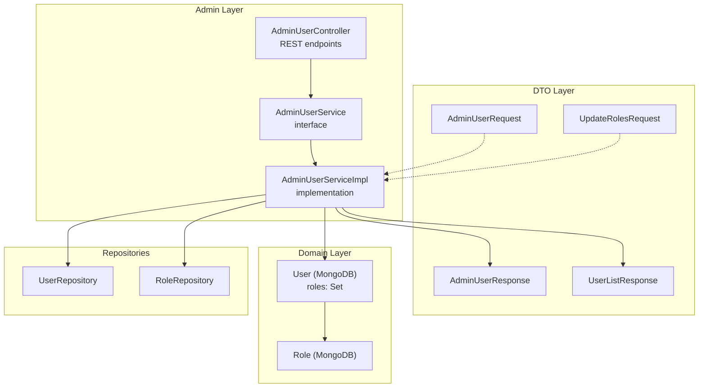
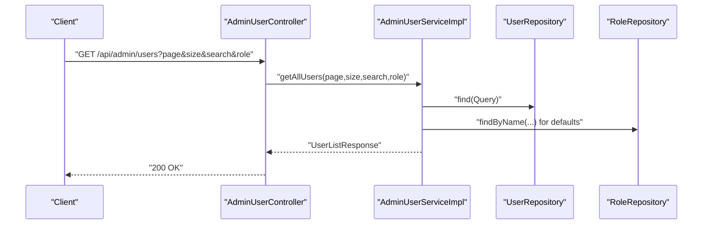
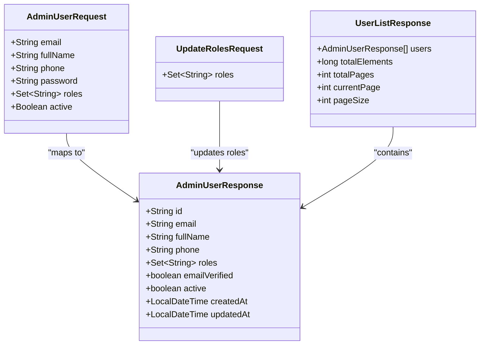
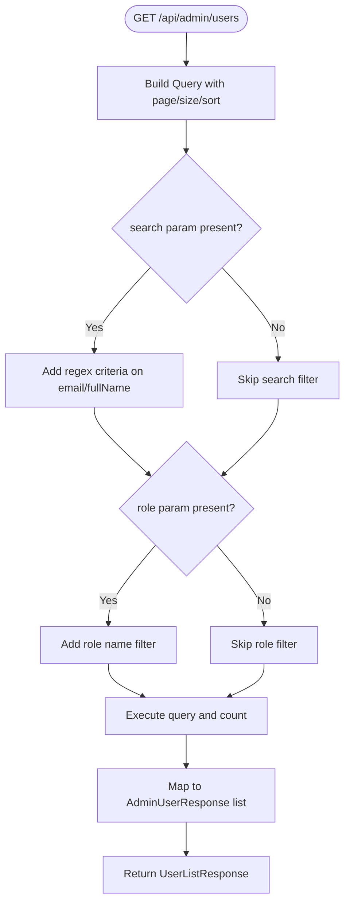
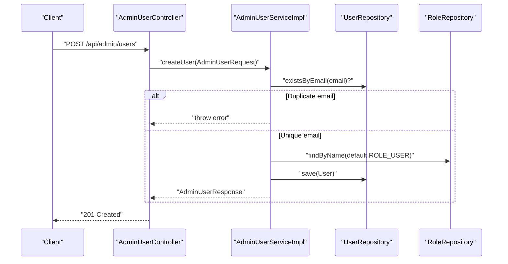
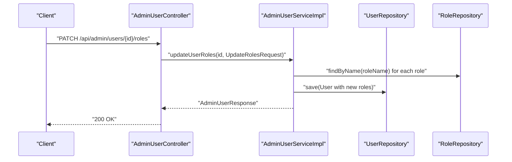
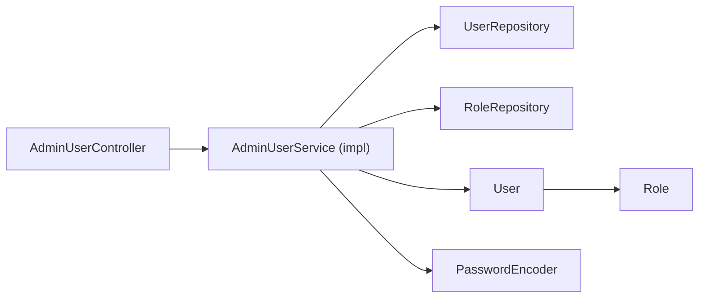

# Admin User Management

<cite>
**Referenced Files in This Document**
- [AdminUserController.java](file://src\Backend\src\main\java\com\shoppeclone\backend\admin\controller\AdminUserController.java)
- [AdminUserService.java](file://src\Backend\src\main\java\com\shoppeclone\backend\admin\service\AdminUserService.java)
- [AdminUserServiceImpl.java](file://src\Backend\src\main\java\com\shoppeclone\backend\admin\service\impl\AdminUserServiceImpl.java)
- [AdminUserRequest.java](file://src\Backend\src\main\java\com\shoppeclone\backend\admin\dto\request\AdminUserRequest.java)
- [UpdateRolesRequest.java](file://src\Backend\src\main\java\com\shoppeclone\backend\admin\dto\request\UpdateRolesRequest.java)
- [AdminUserResponse.java](file://src\Backend\src\main\java\com\shoppeclone\backend\admin\dto\response\AdminUserResponse.java)
- [UserListResponse.java](file://src\Backend\src\main\java\com\shoppeclone\backend\admin\dto\response\UserListResponse.java)
- [Role.java](file://src\Backend\src\main\java\com\shoppeclone\backend\auth\model\Role.java)
- [User.java](file://src\Backend\src\main\java\com\shoppeclone\backend\auth\model\User.java)
</cite>

## Table of Contents
1. [Introduction](#introduction)
2. [Project Structure](#project-structure)
3. [Core Components](#core-components)
4. [Architecture Overview](#architecture-overview)
5. [Detailed Component Analysis](#detailed-component-analysis)
6. [Dependency Analysis](#dependency-analysis)
7. [Performance Considerations](#performance-considerations)
8. [Troubleshooting Guide](#troubleshooting-guide)
9. [Conclusion](#conclusion)

## Introduction
This document explains the admin user management system, covering user account administration, role assignment, user status management, and bulk user operations. It documents all REST API endpoints for user CRUD operations, role updates, and user listings, and clarifies the relationship between AdminUserRequest, UpdateRolesRequest, and their corresponding responses. It also addresses user permission hierarchies, account verification workflows, administrative access controls, and provides troubleshooting guidance for common user management scenarios.

## Project Structure
The admin user management feature is implemented under the admin package with a layered architecture:
- Controller layer exposes REST endpoints for admin users.
- Service layer encapsulates business logic for user operations.
- DTO layer defines request/response contracts.
- Model layer defines domain entities (User, Role) persisted in MongoDB.
- Repositories provide data access for User and Role.

**Diagram sources**
- [AdminUserController.java:17-112](file://src\Backend\src\main\java\com\shoppeclone\backend\admin\controller\AdminUserController.java#L17-L112)
- [AdminUserService.java:8-44](file://src\Backend\src\main\java\com\shoppeclone\backend\admin\service\AdminUserService.java#L8-L44)
- [AdminUserServiceImpl.java:30-238](file://src\Backend\src\main\java\com\shoppeclone\backend\admin\service\impl\AdminUserServiceImpl.java#L30-L238)
- [AdminUserRequest.java:7-14](file://src\Backend\src\main\java\com\shoppeclone\backend\admin\dto\request\AdminUserRequest.java#L7-L14)
- [UpdateRolesRequest.java:7-9](file://src\Backend\src\main\java\com\shoppeclone\backend\admin\dto\request\UpdateRolesRequest.java#L7-L9)
- [AdminUserResponse.java:12-22](file://src\Backend\src\main\java\com\shoppeclone\backend\admin\dto\response\AdminUserResponse.java#L12-L22)
- [UserListResponse.java:11-17](file://src\Backend\src\main\java\com\shoppeclone\backend\admin\dto\response\UserListResponse.java#L11-L17)
- [User.java:15-38](file://src\Backend\src\main\java\com\shoppeclone\backend\auth\model\User.java#L15-L38)
- [Role.java:10-18](file://src\Backend\src\main\java\com\shoppeclone\backend\auth\model\Role.java#L10-L18)

**Section sources**
- [AdminUserController.java:17-112](file://src\Backend\src\main\java\com\shoppeclone\backend\admin\controller\AdminUserController.java#L17-L112)
- [AdminUserServiceImpl.java:30-238](file://src\Backend\src\main\java\com\shoppeclone\backend\admin\service\impl\AdminUserServiceImpl.java#L30-L238)
- [User.java:15-38](file://src\Backend\src\main\java\com\shoppeclone\backend\auth\model\User.java#L15-L38)
- [Role.java:10-18](file://src\Backend\src\main\java\com\shoppeclone\backend\auth\model\Role.java#L10-L18)

## Core Components
- AdminUserController: Exposes REST endpoints for listing, retrieving, creating, updating, deleting users, toggling user status, and updating user roles.
- AdminUserService and AdminUserServiceImpl: Encapsulate business logic including search/filter, pagination, role resolution, password encoding, and safety checks (e.g., preventing deletion of the last admin).
- DTOs:
  - AdminUserRequest: Defines fields for creating/updating users (email, fullName, phone, optional password, roles, active flag).
  - UpdateRolesRequest: Defines fields for updating user roles.
  - AdminUserResponse: Response payload for user details including roles, verification, and timestamps.
  - UserListResponse: Paginated response containing user list and metadata.
- Domain Entities:
  - User: MongoDB entity with embedded roles, verification flag, and activity flag.
  - Role: MongoDB entity representing role definitions.

Key capabilities:
- User listing with pagination, search by email/full name, and role filtering.
- User creation with optional password and role assignment.
- User update with selective field updates, password change, and role updates.
- User status toggle (active/banned).
- Role updates via dedicated endpoint.
- Safety checks (e.g., preventing deletion of the last admin).

**Section sources**
- [AdminUserController.java:25-110](file://src\Backend\src\main\java\com\shoppeclone\backend\admin\controller\AdminUserController.java#L25-L110)
- [AdminUserService.java:8-44](file://src\Backend\src\main\java\com\shoppeclone\backend\admin\service\AdminUserService.java#L8-L44)
- [AdminUserRequest.java:7-14](file://src\Backend\src\main\java\com\shoppeclone\backend\admin\dto\request\AdminUserRequest.java#L7-L14)
- [UpdateRolesRequest.java:7-9](file://src\Backend\src\main\java\com\shoppeclone\backend\admin\dto\request\UpdateRolesRequest.java#L7-L9)
- [AdminUserResponse.java:12-22](file://src\Backend\src\main\java\com\shoppeclone\backend\admin\dto\response\AdminUserResponse.java#L12-L22)
- [UserListResponse.java:11-17](file://src\Backend\src\main\java\com\shoppeclone\backend\admin\dto\response\UserListResponse.java#L11-L17)
- [User.java:15-38](file://src\Backend\src\main\java\com\shoppeclone\backend\auth\model\User.java#L15-L38)
- [Role.java:10-18](file://src\Backend\src\main\java\com\shoppeclone\backend\auth\model\Role.java#L10-L18)

## Architecture Overview
The admin user management follows a clean architecture with clear separation of concerns:
- REST endpoints delegate to service layer.
- Service layer orchestrates repositories and domain entities.
- DTOs decouple API contracts from domain models.
- MongoDB stores User and Role entities with embedded roles in User.

**Diagram sources**
- [AdminUserController.java:29-38](file://src\Backend\src\main\java\com\shoppeclone\backend\admin\controller\AdminUserController.java#L29-L38)
- [AdminUserServiceImpl.java:40-75](file://src\Backend\src\main\java\com\shoppeclone\backend\admin\service\impl\AdminUserServiceImpl.java#L40-L75)
- [User.java:15-38](file://src\Backend\src\main\java\com\shoppeclone\backend\auth\model\User.java#L15-L38)
- [Role.java:10-18](file://src\Backend\src\main\java\com\shoppeclone\backend\auth\model\Role.java#L10-L18)

## Detailed Component Analysis

### REST API Endpoints
All endpoints are exposed under /api/admin/users. Authentication and authorization are enforced via Spring Security pre-authorize annotations on the controller methods.

- GET /api/admin/users
  - Purpose: List users with pagination, search, and role filter.
  - Query params:
    - page: integer, default 0
    - size: integer, default 10
    - search: string, optional (email or fullName regex match)
    - role: string, optional (role name filter)
  - Response: UserListResponse
  - Example request: GET /api/admin/users?page=0&size=10&search=john&role=ROLE_USER
  - Example response: UserListResponse with users array and pagination metadata

- GET /api/admin/users/{id}
  - Purpose: Retrieve a single user by ID.
  - Path param: id (string)
  - Response: AdminUserResponse
  - Example request: GET /api/admin/users/507f1f77bcf86cd799439011
  - Example response: AdminUserResponse with user details

- POST /api/admin/users
  - Purpose: Create a new user.
  - Request body: AdminUserRequest
  - Response: AdminUserResponse
  - Example request body:
    {
      "email": "admin@example.com",
      "fullName": "Admin User",
      "phone": "123456789",
      "password": "SecurePass!2024",
      "roles": ["ROLE_USER"],
      "active": true
    }
  - Example response: AdminUserResponse with created user details

- PUT /api/admin/users/{id}
  - Purpose: Update an existing user.
  - Path param: id (string)
  - Request body: AdminUserRequest (fields to update)
  - Response: AdminUserResponse
  - Example request body:
    {
      "fullName": "Updated Name",
      "phone": "999888777",
      "password": "NewPass!2024",
      "roles": ["ROLE_USER", "ROLE_ADMIN"],
      "active": false
    }

- DELETE /api/admin/users/{id}
  - Purpose: Delete a user.
  - Path param: id (string)
  - Response: JSON { "message": "User deleted successfully" }
  - Notes: Cannot delete the last admin user.

- PATCH /api/admin/users/{id}/status
  - Purpose: Toggle user active status (ban/unban).
  - Path param: id (string)
  - Response: AdminUserResponse reflecting new status

- PATCH /api/admin/users/{id}/roles
  - Purpose: Update user roles.
  - Path param: id (string)
  - Request body: UpdateRolesRequest
  - Response: AdminUserResponse with updated roles

**Section sources**
- [AdminUserController.java:25-110](file://src\Backend\src\main\java\com\shoppeclone\backend\admin\controller\AdminUserController.java#L25-L110)
- [AdminUserRequest.java:7-14](file://src\Backend\src\main\java\com\shoppeclone\backend\admin\dto\request\AdminUserRequest.java#L7-L14)
- [UpdateRolesRequest.java:7-9](file://src\Backend\src\main\java\com\shoppeclone\backend\admin\dto\request\UpdateRolesRequest.java#L7-L9)
- [AdminUserResponse.java:12-22](file://src\Backend\src\main\java\com\shoppeclone\backend\admin\dto\response\AdminUserResponse.java#L12-L22)
- [UserListResponse.java:11-17](file://src\Backend\src\main\java\com\shoppeclone\backend\admin\dto\response\UserListResponse.java#L11-L17)

### Request/Response Contracts and Relationships
- AdminUserRequest
  - Fields: email, fullName, phone, password (optional), roles (Set<String>), active (Boolean)
  - Used by: POST /api/admin/users (create), PUT /api/admin/users/{id} (update)
- UpdateRolesRequest
  - Fields: roles (Set<String>)
  - Used by: PATCH /api/admin/users/{id}/roles
- AdminUserResponse
  - Fields: id, email, fullName, phone, roles (Set<String>), emailVerified, active, createdAt, updatedAt
  - Returned by: GET /api/admin/users/{id}, POST/PUT/PATCH role/status operations
- UserListResponse
  - Fields: users (List<AdminUserResponse>), totalElements, totalPages, currentPage, pageSize
  - Returned by: GET /api/admin/users

**Diagram sources**
- [AdminUserRequest.java:7-14](file://src\Backend\src\main\java\com\shoppeclone\backend\admin\dto\request\AdminUserRequest.java#L7-L14)
- [UpdateRolesRequest.java:7-9](file://src\Backend\src\main\java\com\shoppeclone\backend\admin\dto\request\UpdateRolesRequest.java#L7-L9)
- [AdminUserResponse.java:12-22](file://src\Backend\src\main\java\com\shoppeclone\backend\admin\dto\response\AdminUserResponse.java#L12-L22)
- [UserListResponse.java:11-17](file://src\Backend\src\main\java\com\shoppeclone\backend\admin\dto\response\UserListResponse.java#L11-L17)

### Business Logic and Workflows

#### Listing Users with Pagination, Search, and Role Filter

**Diagram sources**
- [AdminUserServiceImpl.java:40-75](file://src\Backend\src\main\java\com\shoppeclone\backend\admin\service\impl\AdminUserServiceImpl.java#L40-L75)

#### Creating a New User

**Diagram sources**
- [AdminUserController.java:55-60](file://src\Backend\src\main\java\com\shoppeclone\backend\admin\controller\AdminUserController.java#L55-L60)
- [AdminUserServiceImpl.java:84-111](file://src\Backend\src\main\java\com\shoppeclone\backend\admin\service\impl\AdminUserServiceImpl.java#L84-L111)
- [User.java:15-38](file://src\Backend\src\main\java\com\shoppeclone\backend\auth\model\User.java#L15-L38)
- [Role.java:10-18](file://src\Backend\src\main\java\com\shoppeclone\backend\auth\model\Role.java#L10-L18)

#### Updating User Roles

**Diagram sources**
- [AdminUserController.java:103-110](file://src\Backend\src\main\java\com\shoppeclone\backend\admin\controller\AdminUserController.java#L103-L110)
- [AdminUserServiceImpl.java:189-200](file://src\Backend\src\main\java\com\shoppeclone\backend\admin\service\impl\AdminUserServiceImpl.java#L189-L200)
- [Role.java:10-18](file://src\Backend\src\main\java\com\shoppeclone\backend\auth\model\Role.java#L10-L18)

### Permission Hierarchies and Access Controls
- Endpoint-level authorization: Methods are annotated with pre-authorize checks to restrict access to administrators. These are currently commented out in the controller, indicating that authorization enforcement is deferred to global security configuration.
- Role model: Roles are stored as documents with unique names (e.g., ROLE_USER, ROLE_ADMIN, ROLE_SELLER).
- Embedded roles: User entities embed a set of roles, enabling efficient retrieval without joins.

Recommendation:
- Uncomment and enforce @PreAuthorize annotations on controller methods to ensure strict RBAC.
- Define fine-grained permissions per endpoint and integrate with Spring Security’s method security.

**Section sources**
- [AdminUserController.java:30-31](file://src\Backend\src\main\java\com\shoppeclone\backend\admin\controller\AdminUserController.java#L30-L31)
- [AdminUserController.java:44-46](file://src\Backend\src\main\java\com\shoppeclone\backend\admin\controller\AdminUserController.java#L44-L46)
- [AdminUserController.java:66-73](file://src\Backend\src\main\java\com\shoppeclone\backend\admin\controller\AdminUserController.java#L66-L73)
- [AdminUserController.java:92-97](file://src\Backend\src\main\java\com\shoppeclone\backend\admin\controller\AdminUserController.java#L92-L97)
- [AdminUserController.java:103-110](file://src\Backend\src\main\java\com\shoppeclone\backend\admin\controller\AdminUserController.java#L103-L110)
- [Role.java:10-18](file://src\Backend\src\main\java\com\shoppeclone\backend\auth\model\Role.java#L10-L18)
- [User.java:29-30](file://src\Backend\src\main\java\com\shoppeclone\backend\auth\model\User.java#L29-L30)

### Account Verification Workflow
- Field: emailVerified (boolean) is part of the User entity.
- Behavior: Creation sets emailVerified to false by default; the service does not implement verification logic in the current code.
- Recommendation: Introduce verification tokens, email delivery, and a dedicated endpoint to mark users as verified.

**Section sources**
- [User.java:26-27](file://src\Backend\src\main\java\com\shoppeclone\backend\auth\model\User.java#L26-L27)
- [AdminUserServiceImpl.java:105-106](file://src\Backend\src\main\java\com\shoppeclone\backend\admin\service\impl\AdminUserServiceImpl.java#L105-L106)

### Bulk Operations
- Current implementation supports individual user operations (create, update, delete, toggle status, update roles).
- Bulk operations (e.g., bulk delete, bulk role updates) are not implemented in the current codebase.
- Recommendation: Add batch endpoints with transactional safeguards and rate limiting.

**Section sources**
- [AdminUserController.java:55-86](file://src\Backend\src\main\java\com\shoppeclone\backend\admin\controller\AdminUserController.java#L55-L86)
- [AdminUserServiceImpl.java:157-175](file://src\Backend\src\main\java\com\shoppeclone\backend\admin\service\impl\AdminUserServiceImpl.java#L157-L175)

## Dependency Analysis
The service layer depends on repositories and the PasswordEncoder to manage users and roles. The controller delegates to the service, and DTOs decouple API contracts from domain models.

**Diagram sources**
- [AdminUserController.java:23-24](file://src\Backend\src\main\java\com\shoppeclone\backend\admin\controller\AdminUserController.java#L23-L24)
- [AdminUserServiceImpl.java:34-37](file://src\Backend\src\main\java\com\shoppeclone\backend\admin\service\impl\AdminUserServiceImpl.java#L34-L37)
- [User.java:15-38](file://src\Backend\src\main\java\com\shoppeclone\backend\auth\model\User.java#L15-L38)
- [Role.java:10-18](file://src\Backend\src\main\java\com\shoppeclone\backend\auth\model\Role.java#L10-L18)

**Section sources**
- [AdminUserServiceImpl.java:34-37](file://src\Backend\src\main\java\com\shoppeclone\backend\admin\service\impl\AdminUserServiceImpl.java#L34-L37)
- [User.java:15-38](file://src\Backend\src\main\java\com\shoppeclone\backend\auth\model\User.java#L15-L38)
- [Role.java:10-18](file://src\Backend\src\main\java\com\shoppeclone\backend\auth\model\Role.java#L10-L18)

## Performance Considerations
- Pagination: Implemented server-side with PageRequest and count queries to avoid loading entire collections.
- Indexing: User email is indexed; consider indexing roles.name for efficient role filtering.
- Regex search: Case-insensitive regex on email/fullName can be expensive; consider full-text search or additional indices.
- Role resolution: Role lookup by name is performed per request; cache role entities if frequent role updates are not required.
- Password encoding: Applied only when passwords change to minimize overhead.

[No sources needed since this section provides general guidance]

## Troubleshooting Guide
Common issues and resolutions:
- Duplicate email during create/update
  - Symptom: Error indicating email already exists.
  - Cause: Email uniqueness constraint violated.
  - Resolution: Use a unique email address.

- User not found
  - Symptom: Error when retrieving/updating/deleting/toggling a user.
  - Cause: Invalid or missing user ID.
  - Resolution: Verify the user ID and existence in the database.

- Cannot delete the last admin
  - Symptom: Error when attempting to delete the final administrator.
  - Cause: Safety check prevents removal of the last admin.
  - Resolution: Promote another user to admin or keep at least one admin.

- Role not found
  - Symptom: Error indicating a requested role does not exist.
  - Cause: Role name mismatch or missing role in the database.
  - Resolution: Confirm role names against existing roles and ensure roles are seeded.

- Password not changing
  - Symptom: Password remains unchanged after update.
  - Cause: Password field not provided or empty.
  - Resolution: Provide a non-empty password value in the request.

- Status toggle not reflected
  - Symptom: User status does not switch after PATCH.
  - Cause: Incorrect ID or service failure.
  - Resolution: Validate ID and retry; check logs for exceptions.

**Section sources**
- [AdminUserServiceImpl.java:87-89](file://src\Backend\src\main\java\com\shoppeclone\backend\admin\service\impl\AdminUserServiceImpl.java#L87-L89)
- [AdminUserServiceImpl.java:121-124](file://src\Backend\src\main\java\com\shoppeclone\backend\admin\service\impl\AdminUserServiceImpl.java#L121-L124)
- [AdminUserServiceImpl.java:162-172](file://src\Backend\src\main\java\com\shoppeclone\backend\admin\service\impl\AdminUserServiceImpl.java#L162-L172)
- [AdminUserServiceImpl.java:231-233](file://src\Backend\src\main\java\com\shoppeclone\backend\admin\service\impl\AdminUserServiceImpl.java#L231-L233)

## Conclusion
The admin user management system provides a robust foundation for user administration with clear separation of concerns, strong typing via DTOs, and MongoDB-backed persistence. It supports listing, CRUD operations, role updates, and status toggling with built-in safety checks. Enhancements such as enabling authorization annotations, adding verification workflows, and implementing bulk operations would further strengthen the system.