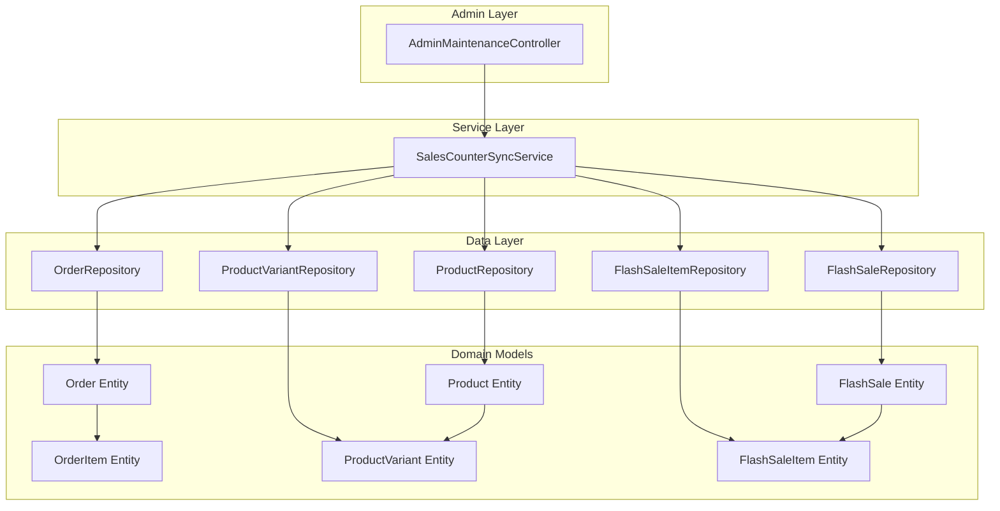
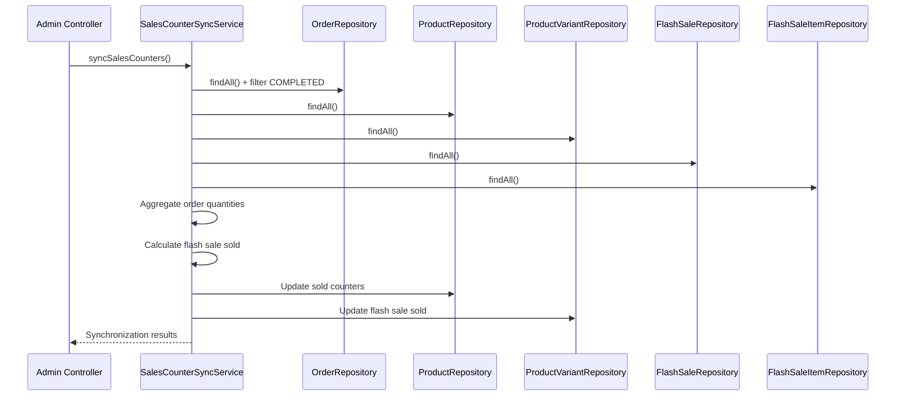
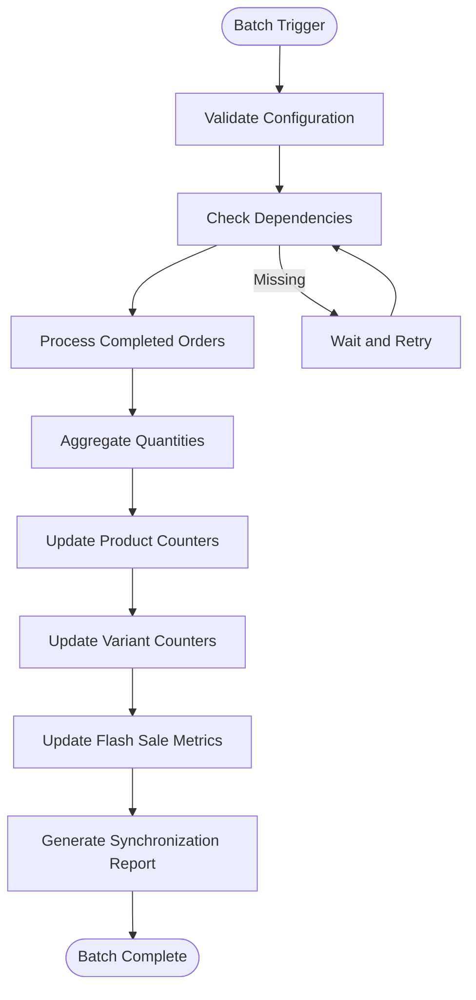

# Sales Counter Synchronization

<cite>
**Referenced Files in This Document**
- [SalesCounterSyncService.java](file://src/Backend/src/main/java/com/shoppeclone/backend/admin/service/SalesCounterSyncService.java)
- [AdminMaintenanceController.java](file://src/Backend/src/main/java/com/shoppeclone/backend/admin/controller/AdminMaintenanceController.java)
- [OrderRepository.java](file://src/Backend/src/main/java/com/shoppeclone/backend/order/repository/OrderRepository.java)
- [ProductRepository.java](file://src/Backend/src/main/java/com/shoppeclone/backend/product/repository/ProductRepository.java)
- [ProductVariantRepository.java](file://src/Backend/src/main/java/com/shoppeclone/backend/product/repository/ProductVariantRepository.java)
- [FlashSaleRepository.java](file://src/Backend/src/main/java/com/shoppeclone/backend/promotion/flashsale/repository/FlashSaleRepository.java)
- [FlashSaleItemRepository.java](file://src/Backend/src/main/java/com/shoppeclone/backend/promotion/flashsale/repository/FlashSaleItemRepository.java)
- [Order.java](file://src/Backend/src/main/java/com/shoppeclone/backend/order/entity/Order.java)
- [OrderItem.java](file://src/Backend/src/main/java/com/shoppeclone/backend/order/entity/OrderItem.java)
- [OrderStatus.java](file://src/Backend/src/main/java/com/shoppeclone/backend/order/entity/OrderStatus.java)
- [Product.java](file://src/Backend/src/main/java/com/shoppeclone/backend/product/entity/Product.java)
- [ProductVariant.java](file://src/Backend/src/main/java/com/shoppeclone/backend/product/entity/ProductVariant.java)
- [FlashSale.java](file://src/Backend/src/main/java/com/shoppeclone/backend/promotion/flashsale/entity/FlashSale.java)
- [FlashSaleItem.java](file://src/Backend/src/main/java/com/shoppeclone/backend/promotion/flashsale/entity/FlashSaleItem.java)
</cite>

## Table of Contents
1. [Introduction](#introduction)
2. [System Architecture](#system-architecture)
3. [Core Components](#core-components)
4. [Synchronization Mechanisms](#synchronization-mechanisms)
5. [Data Consistency and Validation](#data-consistency-and-validation)
6. [Conflict Resolution Strategies](#conflict-resolution-strategies)
7. [External System Integration](#external-system-integration)
8. [Performance Considerations](#performance-considerations)
9. [Batch Processing Workflows](#batch-processing-workflows)
10. [Error Handling Procedures](#error-handling-procedures)
11. [Audit Trail Maintenance](#audit-trail-maintenance)
12. [Troubleshooting Guide](#troubleshooting-guide)
13. [Conclusion](#conclusion)

## Introduction

The Sales Counter Synchronization system is a critical component responsible for maintaining accurate real-time sales data across the e-commerce platform. This system ensures that product sold counters, flash sale sold quantities, and inventory availability remain synchronized with actual transaction data from completed orders and promotional campaigns.

The system operates through automated synchronization processes that scan completed transactions, calculate sales metrics, and update product inventory counters accordingly. It serves as the backbone for revenue tracking, inventory management, and sales analytics across the entire platform.

## System Architecture

The Sales Counter Synchronization system follows a service-oriented architecture with clear separation of concerns and transactional boundaries:

**Diagram sources**
- [SalesCounterSyncService.java:27-37](file://src/Backend/src/main/java/com/shoppeclone/backend/admin/service/SalesCounterSyncService.java#L27-L37)
- [AdminMaintenanceController.java:13-24](file://src/Backend/src/main/java/com/shoppeclone/backend/admin/controller/AdminMaintenanceController.java#L13-L24)

## Core Components

### SalesCounterSyncService

The central orchestrator of the synchronization process, implementing the core business logic for sales counter updates:

**Key Responsibilities:**
- Aggregate sales data from completed orders
- Calculate flash sale sold quantities
- Update product and variant sold counters
- Maintain audit trails and operation metadata

**Transaction Management:**
- All synchronization operations occur within a single transaction
- Ensures atomic updates to maintain data consistency
- Rollback capability for partial failures

**Data Aggregation Strategy:**
- Processes all completed orders from the OrderRepository
- Scans all products and variants for comprehensive coverage
- Filters flash sale items by approved status and active campaigns

**Section sources**
- [SalesCounterSyncService.java:27-131](file://src/Backend/src/main/java/com/shoppeclone/backend/admin/service/SalesCounterSyncService.java#L27-L131)

### Repository Layer

The system leverages Spring Data MongoDB repositories for efficient data access:

**OrderRepository Features:**
- Supports complex queries by shop ID and status
- Provides tracking code lookup for shipping integration
- Handles user-specific order filtering

**ProductRepository Capabilities:**
- Enables shop-specific product queries
- Supports status-based filtering
- Provides ranking and search capabilities

**FlashSaleRepository Functionality:**
- Manages flash sale campaign lifecycle
- Supports status-based filtering
- Enables temporal queries for active campaigns

**Section sources**
- [OrderRepository.java:8-25](file://src/Backend/src/main/java/com/shoppeclone/backend/order/repository/OrderRepository.java#L8-L25)
- [ProductRepository.java:11-40](file://src/Backend/src/main/java/com/shoppeclone/backend/product/repository/ProductRepository.java#L11-L40)
- [FlashSaleRepository.java](file://src/Backend/src/main/java/com/shoppeclone/backend/promotion/flashsale/repository/FlashSaleRepository.java)

## Synchronization Mechanisms

### Real-Time Data Processing

The synchronization process operates through a multi-stage pipeline designed for optimal performance and accuracy:

**Diagram sources**
- [SalesCounterSyncService.java:39-131](file://src/Backend/src/main/java/com/shoppeclone/backend/admin/service/SalesCounterSyncService.java#L39-L131)

### Inventory Counter Updates

The system maintains dual counter mechanisms for comprehensive inventory tracking:

**Product-Level Counters:**
- `sold`: Total units sold across all variants
- `flashSaleSold`: Units sold during flash sale campaigns
- Updated only when values change to minimize unnecessary writes

**Variant-Level Counters:**
- `flashSaleSold`: Units sold for individual product variants
- Maintained separately for granular inventory tracking

**Section sources**
- [SalesCounterSyncService.java:92-117](file://src/Backend/src/main/java/com/shoppeclone/backend/admin/service/SalesCounterSyncService.java#L92-L117)

### Revenue Tracking Integration

Revenue calculation integrates seamlessly with the synchronization process:

**Calculation Methodology:**
- Revenue derived from completed order quantities and item prices
- Flash sale revenue calculated using promotional pricing
- Timestamp tracking for audit and reporting purposes

**Data Structure:**
- Returns comprehensive statistics including processed counts
- Tracks synchronization timing for monitoring and debugging
- Provides detailed operation metrics for system health assessment

**Section sources**
- [SalesCounterSyncService.java:119-130](file://src/Backend/src/main/java/com/shoppeclone/backend/admin/service/SalesCounterSyncService.java#L119-L130)

## Data Consistency and Validation

### Transaction Isolation

The synchronization process ensures data consistency through:

**Atomic Operations:**
- Single transaction encompasses all repository updates
- Prevents partial updates during concurrent operations
- Maintains referential integrity across related entities

**Validation Rules:**
- Flash sale items validated against active campaigns
- Product existence verified before counter updates
- Quantity calculations performed with overflow protection

### Data Integrity Guarantees

**Consistency Checks:**
- Change detection prevents unnecessary database writes
- Duplicate calculation elimination through aggregation maps
- Status validation ensures only approved flash sale items contribute

**Error Containment:**
- Transaction rollback on any failure
- Partial success scenarios handled gracefully
- Audit trail maintained for failed operations

**Section sources**
- [SalesCounterSyncService.java:39-131](file://src/Backend/src/main/java/com/shoppeclone/backend/admin/service/SalesCounterSyncService.java#L39-L131)

## Conflict Resolution Strategies

### Concurrent Access Handling

The system implements robust conflict resolution for high-concurrency environments:

**Race Condition Prevention:**
- Optimistic locking through timestamp updates
- Change detection before database writes
- Transaction isolation level ensures consistent reads

**Resolution Mechanisms:**
- Last-write-wins strategy for counter updates
- Idempotent operation design prevents duplicate processing
- Conflict detection through comparison of expected vs. actual values

### Data Synchronization Conflicts

**Flash Sale Item Conflicts:**
- Approved status verification before inclusion
- Campaign validity checks against active periods
- Stock calculation validation using sale and remaining stock

**Inventory Conflicts:**
- Variant existence validation
- Product association verification
- Stock level reconciliation across multiple sources

**Section sources**
- [SalesCounterSyncService.java:60-90](file://src/Backend/src/main/java/com/shoppeclone/backend/admin/service/SalesCounterSyncService.java#L60-L90)

## External System Integration

### Point-of-Sale Integration

The synchronization system integrates with external POS systems through:

**Order Data Synchronization:**
- Real-time order status updates
- Product variant identification mapping
- Transaction timestamp synchronization

**Inventory Management:**
- Stock level adjustments based on sales
- Low-stock threshold notifications
- Bulk inventory updates for promotional periods

### Third-Party Platform Integration

**Marketplace Integration:**
- Multi-channel sales tracking
- Cross-platform inventory synchronization
- Unified reporting across sales channels

**Payment Gateway Integration:**
- Payment status correlation with sales
- Refund processing synchronization
- Revenue recognition timing

**Section sources**
- [OrderRepository.java:8-25](file://src/Backend/src/main/java/com/shoppeclone/backend/order/repository/OrderRepository.java#L8-L25)

## Performance Considerations

### High-Frequency Operation Optimization

The system is designed for high-frequency synchronization operations:

**Memory Management:**
- Efficient HashMap usage for quantity aggregation
- Stream processing for large dataset filtering
- Lazy loading for repository entities

**Database Optimization:**
- Batch operations for counter updates
- Index utilization for query optimization
- Connection pooling for concurrent access

### Scalability Features

**Horizontal Scaling:**
- Stateless service design supports clustering
- Shared database backend enables multiple instances
- Queue-based processing for distributed workloads

**Resource Management:**
- Memory-efficient data structures
- Connection timeout configuration
- Thread pool sizing for optimal throughput

**Section sources**
- [SalesCounterSyncService.java:43-47](file://src/Backend/src/main/java/com/shoppeclone/backend/admin/service/SalesCounterSyncService.java#L43-L47)

## Batch Processing Workflows

### Scheduled Synchronization

The system supports automated batch processing:

**Diagram sources**
- [SalesCounterSyncService.java:39-131](file://src/Backend/src/main/java/com/shoppeclone/backend/admin/service/SalesCounterSyncService.java#L39-L131)

### Incremental Processing

**Efficient Update Strategy:**
- Change detection prevents unnecessary writes
- Batch updates reduce database overhead
- Progress tracking enables resumption after failures

**Resource Optimization:**
- Memory-constrained processing for large datasets
- Streaming operations for reduced memory footprint
- Parallel processing capabilities for multi-core systems

**Section sources**
- [SalesCounterSyncService.java:92-117](file://src/Backend/src/main/java/com/shoppeclone/backend/admin/service/SalesCounterSyncService.java#L92-L117)

## Error Handling Procedures

### Exception Management

The system implements comprehensive error handling:

**Transaction Rollback:**
- Automatic rollback on any synchronization failure
- State restoration to prevent partial updates
- Error logging with contextual information

**Graceful Degradation:**
- Partial success scenarios handled without system failure
- Individual item processing continues despite errors
- Audit trail maintained for failed operations

### Monitoring and Alerting

**Health Monitoring:**
- Synchronization success rates tracking
- Performance metrics collection
- Dependency health checks

**Alerting Mechanisms:**
- Automated notifications for repeated failures
- Threshold-based alerts for performance degradation
- Integration with monitoring systems

**Section sources**
- [SalesCounterSyncService.java:39-131](file://src/Backend/src/main/java/com/shoppeclone/backend/admin/service/SalesCounterSyncService.java#L39-L131)

## Audit Trail Maintenance

### Comprehensive Logging

The system maintains detailed audit trails:

**Operation Metadata:**
- Timestamps for all synchronization events
- User identification for administrative operations
- System metrics and performance data

**Change Tracking:**
- Before/after state comparison for modified records
- Reason codes for manual interventions
- Approval workflows for significant changes

### Compliance Features

**Data Retention:**
- Configurable retention policies for audit logs
- Secure storage of sensitive operational data
- Export capabilities for regulatory compliance

**Traceability:**
- End-to-end operation tracing
- Cross-reference capabilities between systems
- Historical trend analysis

**Section sources**
- [SalesCounterSyncService.java:119-130](file://src/Backend/src/main/java/com/shoppeclone/backend/admin/service/SalesCounterSyncService.java#L119-L130)

## Troubleshooting Guide

### Common Issues and Solutions

**Synchronization Failures:**
- Verify database connectivity and permissions
- Check repository configuration and indexing
- Review transaction isolation levels

**Performance Degradation:**
- Monitor database query performance
- Analyze memory usage patterns
- Review concurrent access bottlenecks

**Data Inconsistencies:**
- Validate repository data integrity
- Check for orphaned records
- Review cascade deletion configurations

### Diagnostic Procedures

**System Health Checks:**
- Repository connectivity verification
- Transaction processing validation
- Memory and CPU utilization monitoring

**Data Validation:**
- Cross-reference with source systems
- Statistical validation of counter values
- Trend analysis for anomaly detection

### Support Resources

**Documentation:**
- API reference for administrative operations
- Configuration guidelines for deployment
- Performance tuning recommendations

**Contact Information:**
- Technical support escalation procedures
- Community forums and knowledge bases
- Professional services for complex issues

**Section sources**
- [AdminMaintenanceController.java:13-24](file://src/Backend/src/main/java/com/shoppeclone/backend/admin/controller/AdminMaintenanceController.java#L13-L24)

## Conclusion

The Sales Counter Synchronization system provides a robust foundation for maintaining accurate sales data across the e-commerce platform. Through its transactional architecture, comprehensive validation mechanisms, and efficient processing capabilities, it ensures reliable synchronization between sales transactions and inventory counters.

The system's design accommodates high-frequency operations while maintaining data consistency and providing comprehensive audit capabilities. Its integration points with external systems enable seamless operation within complex multi-channel retail environments.

Future enhancements could include real-time streaming capabilities, advanced conflict resolution strategies, and enhanced monitoring and alerting features to further improve operational efficiency and system reliability.