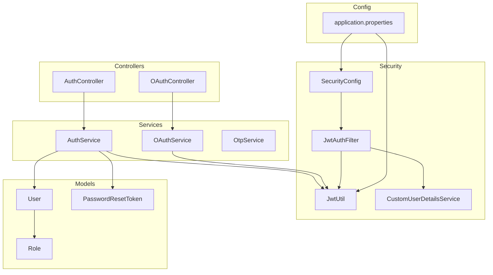
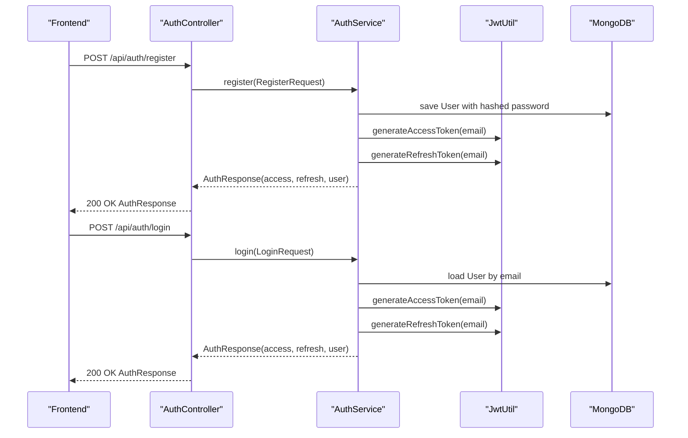
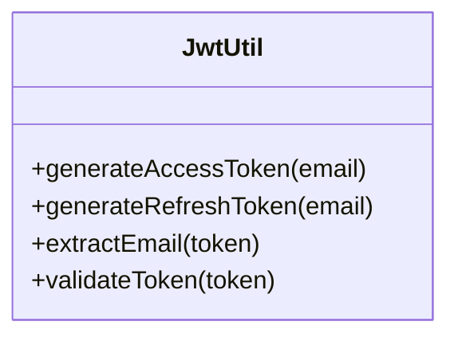
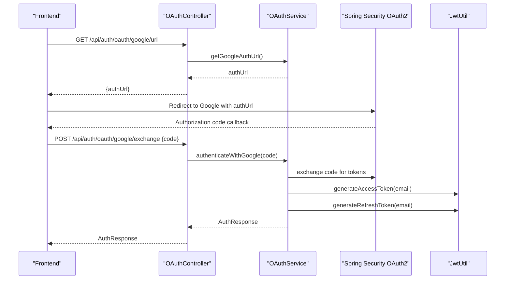
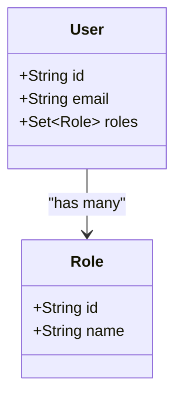
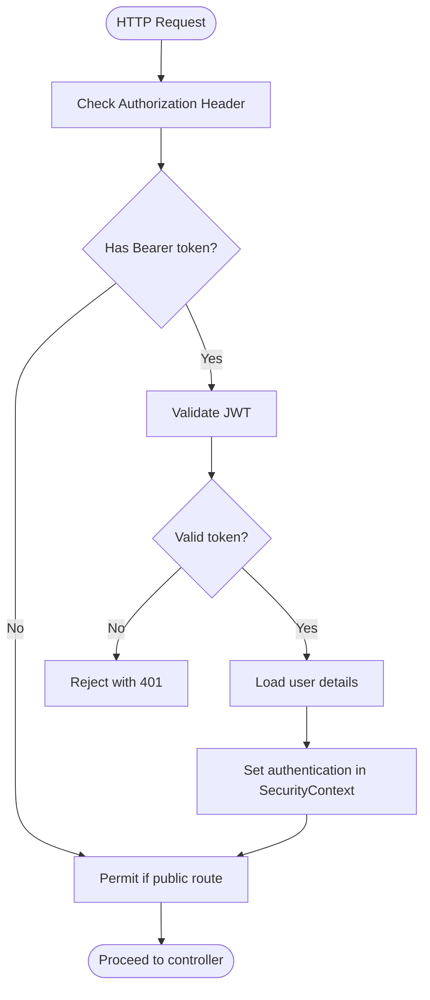
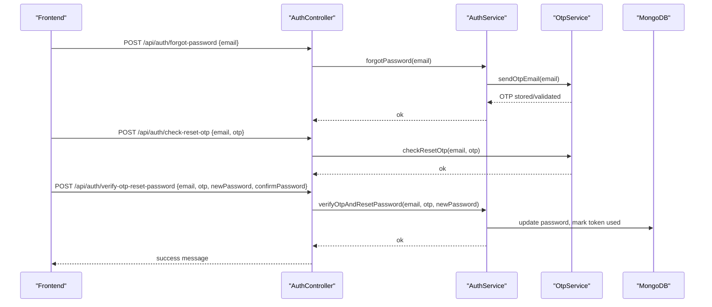
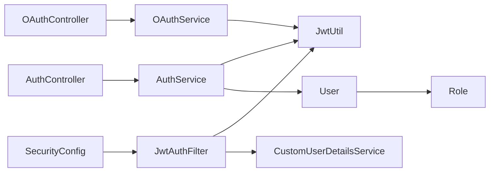

# Authentication & Authorization System

<cite>
**Referenced Files in This Document**
- [AuthController.java](file://src/backend/src/main/java/com/shoppeclone/backend/auth/controller/AuthController.java)
- [OAuthController.java](file://src/backend/src/main/java/com/shoppeclone/backend/auth/controller/OAuthController.java)
- [AuthService.java](file://src/backend/src/main/java/com/shoppeclone/backend/auth/service/AuthService.java)
- [OAuthService.java](file://src/backend/src/main/java/com/shoppeclone/backend/auth/service/OAuthService.java)
- [JwtUtil.java](file://src/backend/src/main/java/com/shoppeclone/backend/auth/security/JwtUtil.java)
- [JwtAuthFilter.java](file://src/backend/src/main/java/com/shoppeclone/backend/auth/security/JwtAuthFilter.java)
- [SecurityConfig.java](file://src/backend/src/main/java/com/shoppeclone/backend/auth/security/SecurityConfig.java)
- [CustomUserDetailsService.java](file://src/backend/src/main/java/com/shoppeclone/backend/auth/security/CustomUserDetailsService.java)
- [User.java](file://src/backend/src/main/java/com/shoppeclone/backend/auth/model/User.java)
- [Role.java](file://src/backend/src/main/java/com/shoppeclone/backend/auth/model/Role.java)
- [PasswordResetToken.java](file://src/backend/src/main/java/com/shoppeclone/backend/auth/model/PasswordResetToken.java)
- [application.properties](file://src/backend/src/main/resources/application.properties)
- [AuthResponse.java](file://src/backend/src/main/java/com/shoppeclone/backend/auth/dto/response/AuthResponse.java)
- [LoginRequest.java](file://src/backend/src/main/java/com/shoppeclone/backend/auth/dto/request/LoginRequest.java)
</cite>

## Table of Contents
1. [Introduction](#introduction)
2. [Project Structure](#project-structure)
3. [Core Components](#core-components)
4. [Architecture Overview](#architecture-overview)
5. [Detailed Component Analysis](#detailed-component-analysis)
6. [Dependency Analysis](#dependency-analysis)
7. [Performance Considerations](#performance-considerations)
8. [Troubleshooting Guide](#troubleshooting-guide)
9. [Conclusion](#conclusion)

## Introduction
This document explains the authentication and authorization system of the backend, focusing on JWT token management, OAuth2 Google integration, role-based access control (RBAC), and security configuration. It covers token generation, validation, refresh mechanisms, and password reset flows. Both conceptual overviews for beginners and technical details for experienced developers are included, with practical examples and diagrams illustrating authentication flows and security architecture.

## Project Structure
The authentication subsystem is organized around controllers, services, security filters, JWT utilities, and domain models. Controllers expose REST endpoints for registration, login, logout, refresh, OTP verification, and Google OAuth. Services encapsulate business logic for authentication, OAuth exchanges, and OTP handling. SecurityConfig defines HTTP security policies, while JwtUtil and JwtAuthFilter handle token parsing and request filtering. Domain models represent users, roles, and password reset tokens.

**Diagram sources**
- [AuthController.java:22-98](file://src/backend/src/main/java/com/shoppeclone/backend/auth/controller/AuthController.java#L22-L98)
- [OAuthController.java:11-36](file://src/backend/src/main/java/com/shoppeclone/backend/auth/controller/OAuthController.java#L11-L36)
- [AuthService.java:8-21](file://src/backend/src/main/java/com/shoppeclone/backend/auth/service/AuthService.java#L8-L21)
- [OAuthService.java:5-11](file://src/backend/src/main/java/com/shoppeclone/backend/auth/service/OAuthService.java#L5-L11)
- [SecurityConfig.java:18-92](file://src/backend/src/main/java/com/shoppeclone/backend/auth/security/SecurityConfig.java#L18-L92)
- [JwtAuthFilter.java:16-46](file://src/backend/src/main/java/com/shoppeclone/backend/auth/security/JwtAuthFilter.java#L16-L46)
- [JwtUtil.java:12-65](file://src/backend/src/main/java/com/shoppeclone/backend/auth/security/JwtUtil.java#L12-L65)
- [User.java:13-38](file://src/backend/src/main/java/com/shoppeclone/backend/auth/model/User.java#L13-L38)
- [Role.java:8-18](file://src/backend/src/main/java/com/shoppeclone/backend/auth/model/Role.java#L8-L18)
- [PasswordResetToken.java:9-23](file://src/backend/src/main/java/com/shoppeclone/backend/auth/model/PasswordResetToken.java#L9-L23)
- [application.properties:1-114](file://src/backend/src/main/resources/application.properties#L1-L114)

**Section sources**
- [AuthController.java:22-98](file://src/backend/src/main/java/com/shoppeclone/backend/auth/controller/AuthController.java#L22-L98)
- [OAuthController.java:11-36](file://src/backend/src/main/java/com/shoppeclone/backend/auth/controller/OAuthController.java#L11-L36)
- [SecurityConfig.java:18-92](file://src/backend/src/main/java/com/shoppeclone/backend/auth/security/SecurityConfig.java#L18-L92)
- [application.properties:1-114](file://src/backend/src/main/resources/application.properties#L1-L114)

## Core Components
- AuthController: Public authentication endpoints for registration, login, logout, refresh, OTP-based flows, and password reset.
- OAuthController: Endpoints to obtain Google OAuth URL and exchange authorization code for JWT tokens.
- AuthService: Business logic for JWT issuance, refresh, logout, current user retrieval, forgot password, and OTP-based password reset.
- OAuthService: Google OAuth URL generation and code-to-JWT exchange.
- SecurityConfig: HTTP security configuration, CORS, CSRF disabled, stateless sessions, and endpoint authorization rules.
- JwtUtil: JWT access and refresh token generation, validation, and email extraction.
- JwtAuthFilter: Extracts Bearer tokens, validates them, loads user details, and sets authentication in the security context.
- CustomUserDetailsService: Loads user details by email for authentication.
- Models: User, Role, and PasswordResetToken define identity, permissions, and password reset lifecycle.
- application.properties: JWT secrets and expirations, OAuth2 client/provider settings, email, OTP, and CORS configurations.

**Section sources**
- [AuthController.java:22-98](file://src/backend/src/main/java/com/shoppeclone/backend/auth/controller/AuthController.java#L22-L98)
- [OAuthController.java:11-36](file://src/backend/src/main/java/com/shoppeclone/backend/auth/controller/OAuthController.java#L11-L36)
- [AuthService.java:8-21](file://src/backend/src/main/java/com/shoppeclone/backend/auth/service/AuthService.java#L8-L21)
- [OAuthService.java:5-11](file://src/backend/src/main/java/com/shoppeclone/backend/auth/service/OAuthService.java#L5-L11)
- [SecurityConfig.java:18-92](file://src/backend/src/main/java/com/shoppeclone/backend/auth/security/SecurityConfig.java#L18-L92)
- [JwtUtil.java:12-65](file://src/backend/src/main/java/com/shoppeclone/backend/auth/security/JwtUtil.java#L12-L65)
- [JwtAuthFilter.java:16-46](file://src/backend/src/main/java/com/shoppeclone/backend/auth/security/JwtAuthFilter.java#L16-L46)
- [application.properties:19-82](file://src/backend/src/main/resources/application.properties#L19-L82)

## Architecture Overview
The system uses stateless JWT authentication with refresh tokens. Requests are filtered by JwtAuthFilter, which validates the Authorization header and populates the security context. OAuth2 Google integration is configured via Spring Security OAuth2 client settings, exposing endpoints to obtain an authorization URL and exchange an authorization code for JWT tokens. RBAC is modeled via User roles stored in MongoDB.

**Diagram sources**
- [AuthController.java:36-44](file://src/backend/src/main/java/com/shoppeclone/backend/auth/controller/AuthController.java#L36-L44)
- [AuthService.java:10-12](file://src/backend/src/main/java/com/shoppeclone/backend/auth/service/AuthService.java#L10-L12)
- [JwtUtil.java:27-43](file://src/backend/src/main/java/com/shoppeclone/backend/auth/security/JwtUtil.java#L27-L43)
- [User.java:13-38](file://src/backend/src/main/java/com/shoppeclone/backend/auth/model/User.java#L13-L38)

**Section sources**
- [AuthController.java:36-44](file://src/backend/src/main/java/com/shoppeclone/backend/auth/controller/AuthController.java#L36-L44)
- [AuthService.java:10-12](file://src/backend/src/main/java/com/shoppeclone/backend/auth/service/AuthService.java#L10-L12)
- [JwtUtil.java:27-43](file://src/backend/src/main/java/com/shoppeclone/backend/auth/security/JwtUtil.java#L27-L43)

## Detailed Component Analysis

### JWT Token Management
- Generation: Access tokens and refresh tokens are generated using HS256 with a shared secret. Access tokens expire after a short period; refresh tokens expire after a longer period.
- Validation: Tokens are validated by parsing and verifying signatures; invalid/expired tokens are rejected.
- Extraction: The email (subject) is extracted from tokens for user identification.
- Refresh: Clients send the refresh token in the Refresh-Token header to obtain a new access token pair.

**Diagram sources**
- [JwtUtil.java:12-65](file://src/backend/src/main/java/com/shoppeclone/backend/auth/security/JwtUtil.java#L12-L65)

**Section sources**
- [JwtUtil.java:14-43](file://src/backend/src/main/java/com/shoppeclone/backend/auth/security/JwtUtil.java#L14-L43)
- [application.properties:23-31](file://src/backend/src/main/resources/application.properties#L23-L31)

### OAuth2 Google Integration
- Authorization URL: Frontend requests a Google OAuth URL from the backend.
- Code Exchange: Frontend obtains an authorization code and sends it to the backend, which exchanges it for JWT tokens using configured OAuth2 client settings.
- Provider Configuration: Authorization, token, and userinfo endpoints are defined in application properties.

**Diagram sources**
- [OAuthController.java:18-34](file://src/backend/src/main/java/com/shoppeclone/backend/auth/controller/OAuthController.java#L18-L34)
- [OAuthService.java:7-9](file://src/backend/src/main/java/com/shoppeclone/backend/auth/service/OAuthService.java#L7-L9)
- [application.properties:58-67](file://src/backend/src/main/resources/application.properties#L58-L67)
- [JwtUtil.java:27-43](file://src/backend/src/main/java/com/shoppeclone/backend/auth/security/JwtUtil.java#L27-L43)

**Section sources**
- [OAuthController.java:18-34](file://src/backend/src/main/java/com/shoppeclone/backend/auth/controller/OAuthController.java#L18-L34)
- [application.properties:58-67](file://src/backend/src/main/resources/application.properties#L58-L67)

### Role-Based Access Control (RBAC)
- User roles: Users have a set of roles stored directly in the User model.
- Security rules: SecurityConfig permits unauthenticated access to specific public endpoints and requires authentication for most API routes. Method-level security is enabled, allowing role-based method protection elsewhere in the codebase.
- Implementation pattern: Roles are loaded via CustomUserDetailsService and attached to the authentication object for downstream authorization checks.

**Diagram sources**
- [User.java:13-38](file://src/backend/src/main/java/com/shoppeclone/backend/auth/model/User.java#L13-L38)
- [Role.java:8-18](file://src/backend/src/main/java/com/shoppeclone/backend/auth/model/Role.java#L8-L18)

**Section sources**
- [User.java:29-30](file://src/backend/src/main/java/com/shoppeclone/backend/auth/model/User.java#L29-L30)
- [Role.java:14-15](file://src/backend/src/main/java/com/shoppeclone/backend/auth/model/Role.java#L14-L15)
- [SecurityConfig.java:35-70](file://src/backend/src/main/java/com/shoppeclone/backend/auth/security/SecurityConfig.java#L35-L70)

### Security Configuration
- Stateless sessions: SessionCreationPolicy is set to STATELESS to enforce JWT-only authentication.
- CSRF disabled: CSRF protection is disabled for stateless APIs.
- CORS: Uses shared CORS configuration; development allows broad origins.
- Endpoint authorization: Public routes (auth, uploads, webhooks, read-only GETs) are permitted without authentication; other /api/** routes require authentication.
- Password encoding: BCryptPasswordEncoder is configured for secure password hashing.

**Diagram sources**
- [SecurityConfig.java:27-80](file://src/backend/src/main/java/com/shoppeclone/backend/auth/security/SecurityConfig.java#L27-L80)
- [JwtAuthFilter.java:23-44](file://src/backend/src/main/java/com/shoppeclone/backend/auth/security/JwtAuthFilter.java#L23-L44)

**Section sources**
- [SecurityConfig.java:27-80](file://src/backend/src/main/java/com/shoppeclone/backend/auth/security/SecurityConfig.java#L27-L80)
- [JwtAuthFilter.java:23-44](file://src/backend/src/main/java/com/shoppeclone/backend/auth/security/JwtAuthFilter.java#L23-L44)

### Password Reset Flow
- OTP-based reset: Forgot password triggers OTP delivery; OTP verification confirms eligibility to reset; new password is applied after confirmation.
- Token model: PasswordResetToken stores a UUID token, expiration, usage flag, and association to the user.
- DTOs: AuthResponse includes optional message field for user feedback.

**Diagram sources**
- [AuthController.java:78-97](file://src/backend/src/main/java/com/shoppeclone/backend/auth/controller/AuthController.java#L78-L97)
- [AuthService.java:18-20](file://src/backend/src/main/java/com/shoppeclone/backend/auth/service/AuthService.java#L18-L20)
- [PasswordResetToken.java:9-23](file://src/backend/src/main/java/com/shoppeclone/backend/auth/model/PasswordResetToken.java#L9-L23)
- [AuthResponse.java:10-24](file://src/backend/src/main/java/com/shoppeclone/backend/auth/dto/response/AuthResponse.java#L10-L24)

**Section sources**
- [AuthController.java:78-97](file://src/backend/src/main/java/com/shoppeclone/backend/auth/controller/AuthController.java#L78-L97)
- [PasswordResetToken.java:15-20](file://src/backend/src/main/java/com/shoppeclone/backend/auth/model/PasswordResetToken.java#L15-L20)

### Public Interfaces and Endpoints
- Authentication endpoints:
  - GET /api/auth/me
  - POST /api/auth/register
  - POST /api/auth/login
  - POST /api/auth/refresh-token
  - POST /api/auth/logout
  - POST /api/auth/send-otp
  - POST /api/auth/verify-otp
  - POST /api/auth/check-reset-otp
  - POST /api/auth/forgot-password
  - POST /api/auth/verify-otp-reset-password
- OAuth endpoints:
  - GET /api/auth/oauth/google/url
  - POST /api/auth/oauth/google/exchange

Headers:
- Authorization: Bearer <access-token> for protected routes
- Refresh-Token: <refresh-token> for refresh and logout

DTOs:
- AuthResponse: accessToken, refreshToken, tokenType, user, message
- LoginRequest: email, password

**Section sources**
- [AuthController.java:31-97](file://src/backend/src/main/java/com/shoppeclone/backend/auth/controller/AuthController.java#L31-L97)
- [OAuthController.java:18-34](file://src/backend/src/main/java/com/shoppeclone/backend/auth/controller/OAuthController.java#L18-L34)
- [AuthResponse.java:10-24](file://src/backend/src/main/java/com/shoppeclone/backend/auth/dto/response/AuthResponse.java#L10-L24)
- [LoginRequest.java:8-15](file://src/backend/src/main/java/com/shoppeclone/backend/auth/dto/request/LoginRequest.java#L8-L15)

## Dependency Analysis
- Controllers depend on services for business logic.
- Services depend on JwtUtil for token operations and repositories/models for persistence.
- SecurityConfig wires JwtAuthFilter into the filter chain.
- JwtAuthFilter depends on JwtUtil and CustomUserDetailsService.
- Models define relationships between User and Role.

**Diagram sources**
- [AuthController.java:22-98](file://src/backend/src/main/java/com/shoppeclone/backend/auth/controller/AuthController.java#L22-L98)
- [OAuthController.java:11-36](file://src/backend/src/main/java/com/shoppeclone/backend/auth/controller/OAuthController.java#L11-L36)
- [AuthService.java:8-21](file://src/backend/src/main/java/com/shoppeclone/backend/auth/service/AuthService.java#L8-L21)
- [OAuthService.java:5-11](file://src/backend/src/main/java/com/shoppeclone/backend/auth/service/OAuthService.java#L5-L11)
- [SecurityConfig.java:18-92](file://src/backend/src/main/java/com/shoppeclone/backend/auth/security/SecurityConfig.java#L18-L92)
- [JwtAuthFilter.java:16-46](file://src/backend/src/main/java/com/shoppeclone/backend/auth/security/JwtAuthFilter.java#L16-L46)
- [JwtUtil.java:12-65](file://src/backend/src/main/java/com/shoppeclone/backend/auth/security/JwtUtil.java#L12-L65)
- [User.java:13-38](file://src/backend/src/main/java/com/shoppeclone/backend/auth/model/User.java#L13-L38)
- [Role.java:8-18](file://src/backend/src/main/java/com/shoppeclone/backend/auth/model/Role.java#L8-L18)

**Section sources**
- [SecurityConfig.java:24-77](file://src/backend/src/main/java/com/shoppeclone/backend/auth/security/SecurityConfig.java#L24-L77)
- [JwtAuthFilter.java:20-41](file://src/backend/src/main/java/com/shoppeclone/backend/auth/security/JwtAuthFilter.java#L20-L41)

## Performance Considerations
- Token expiration tuning: Adjust jwt.expiration and jwt.refresh-expiration to balance security and UX.
- Filter overhead: JwtAuthFilter runs per request; keep validations lightweight.
- MongoDB indexing: Ensure email and role indexes are present for efficient user loading.
- CORS configuration: Limit allowed origins in production to reduce preflight overhead.
- Tomcat threads: Increase max threads for high-concurrency scenarios (e.g., flash sale events).

[No sources needed since this section provides general guidance]

## Troubleshooting Guide
- 401 Unauthorized on protected routes:
  - Ensure Authorization header starts with "Bearer " and contains a valid, unexpired access token.
  - Verify JwtAuthFilter is registered and SecurityConfig permits authentication for the route.
- Refresh token errors:
  - Confirm Refresh-Token header is provided and valid.
  - Check jwt.refresh-expiration configuration.
- OAuth login issues:
  - Validate GOOGLE_CLIENT_ID and GOOGLE_CLIENT_SECRET environment variables.
  - Confirm redirect URI and provider endpoints in application properties.
- Password reset failures:
  - Verify OTP expiration and usage flags in PasswordResetToken.
  - Ensure new password matches confirmation.
- CORS problems:
  - Check spring.web.cors.allowed-origins in application properties.

**Section sources**
- [JwtAuthFilter.java:27-42](file://src/backend/src/main/java/com/shoppeclone/backend/auth/security/JwtAuthFilter.java#L27-L42)
- [SecurityConfig.java:27-80](file://src/backend/src/main/java/com/shoppeclone/backend/auth/security/SecurityConfig.java#L27-L80)
- [application.properties:58-95](file://src/backend/src/main/resources/application.properties#L58-L95)
- [PasswordResetToken.java:18-20](file://src/backend/src/main/java/com/shoppeclone/backend/auth/model/PasswordResetToken.java#L18-L20)

## Conclusion
The authentication system combines stateless JWT with refresh tokens, supports Google OAuth2, and enforces RBAC via user roles. SecurityConfig establishes robust policy defaults, while JwtUtil and JwtAuthFilter provide efficient token validation. The OTP-based password reset flow ensures secure account recovery. Proper configuration of secrets, expirations, and CORS is essential for production readiness.