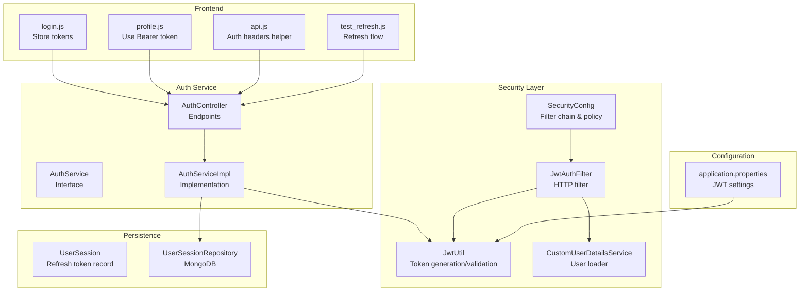
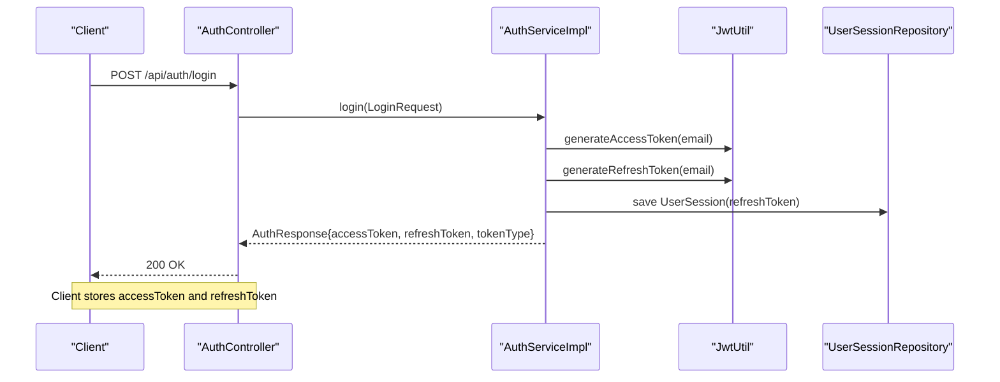
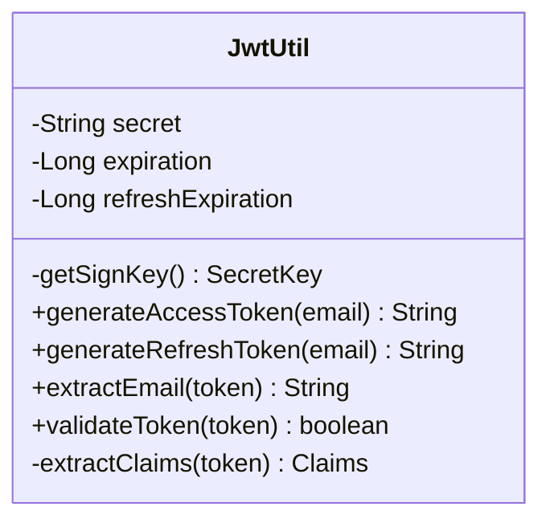
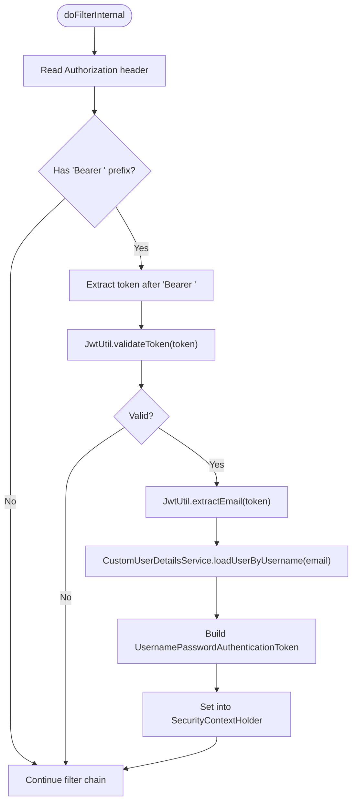
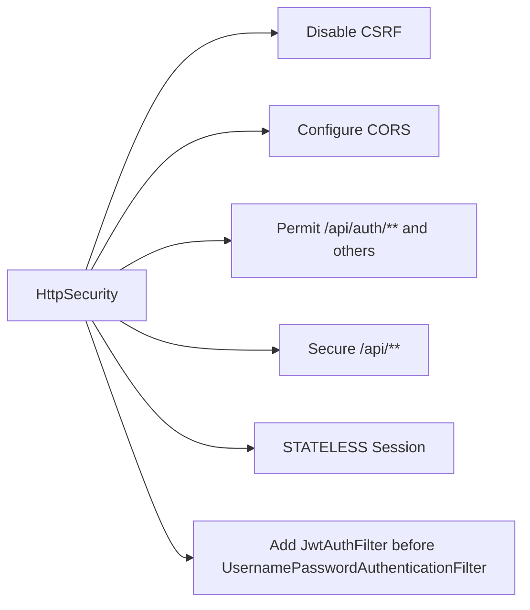
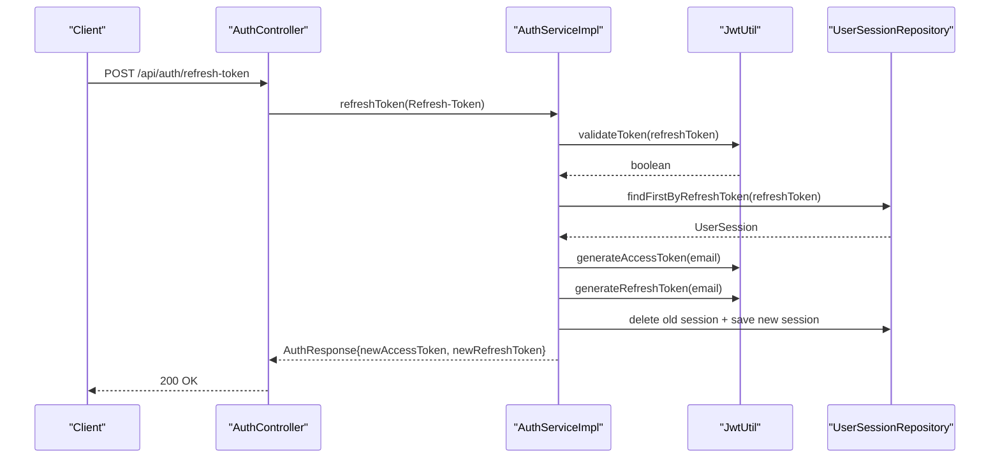
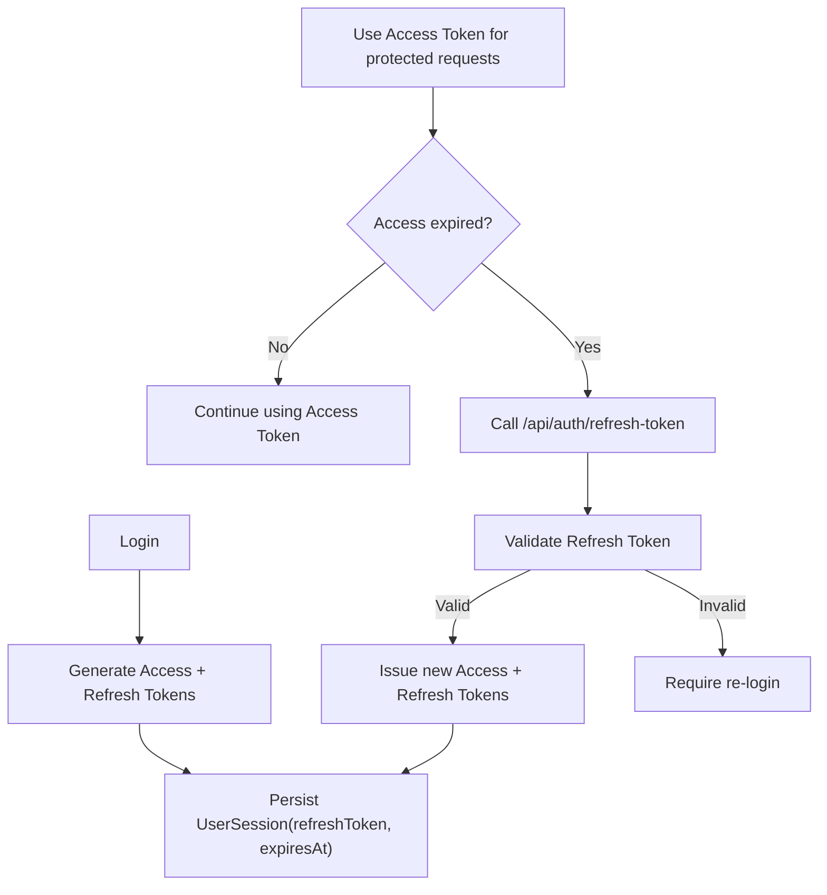
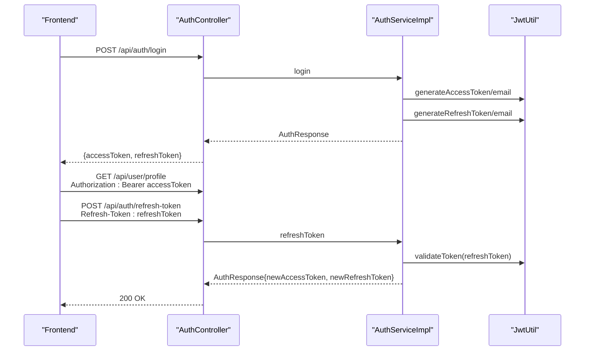
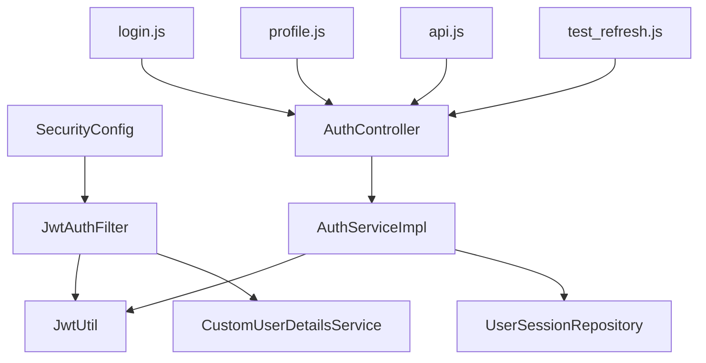

# JWT Authentication Implementation

<cite>
**Referenced Files in This Document**
- [JwtUtil.java](file://src/Backend/src/main/java/com/shoppeclone/backend/auth/security/JwtUtil.java)
- [JwtAuthFilter.java](file://src/Backend/src/main/java/com/shoppeclone/backend/auth/security/JwtAuthFilter.java)
- [SecurityConfig.java](file://src/Backend/src/main/java/com/shoppeclone/backend/auth/security/SecurityConfig.java)
- [AuthService.java](file://src/Backend/src/main/java/com/shoppeclone/backend/auth/service/AuthService.java)
- [AuthServiceImpl.java](file://src/Backend/src/main/java/com/shoppeclone/backend/auth/service/impl/AuthServiceImpl.java)
- [AuthController.java](file://src/Backend/src/main/java/com/shoppeclone/backend/auth/controller/AuthController.java)
- [application.properties](file://src/Backend/src/main/resources/application.properties)
- [UserSession.java](file://src/Backend/src/main/java/com/shoppeclone/backend/auth/model/UserSession.java)
- [UserSessionRepository.java](file://src/Backend/src/main/java/com/shoppeclone/backend/auth/repository/UserSessionRepository.java)
- [CustomUserDetailsService.java](file://src/Backend/src/main/java/com/shoppeclone/backend/auth/security/CustomUserDetailsService.java)
- [login.js](file://src/Frontend/js/login.js)
- [profile.js](file://src/Frontend/js/profile.js)
- [api.js](file://src/Frontend/js/services/api.js)
- [test_refresh.js](file://src/Frontend/js/test_refresh.js)
</cite>

## Table of Contents
1. [Introduction](#introduction)
2. [Project Structure](#project-structure)
3. [Core Components](#core-components)
4. [Architecture Overview](#architecture-overview)
5. [Detailed Component Analysis](#detailed-component-analysis)
6. [Dependency Analysis](#dependency-analysis)
7. [Performance Considerations](#performance-considerations)
8. [Troubleshooting Guide](#troubleshooting-guide)
9. [Conclusion](#conclusion)
10. [Appendices](#appendices)

## Introduction
This document explains the JWT authentication implementation in the backend. It covers token generation, validation, refresh mechanisms, and the automatic validation filter. It documents the JwtUtil class functionality, the JwtAuthFilter pipeline, and practical usage patterns for tokens in HTTP requests. It also outlines token lifecycle management, expiration policies, secure storage recommendations, and common JWT security considerations.

## Project Structure
The JWT authentication spans several packages:
- Security utilities: JwtUtil, JwtAuthFilter, SecurityConfig, CustomUserDetailsService
- Authentication service: AuthService and its implementation AuthServiceImpl
- Authentication controller: AuthController exposing login, refresh-token, logout, and profile endpoints
- Configuration: application.properties for JWT secrets and expiration
- Persistence: UserSession and UserSessionRepository for refresh token lifecycle
- Frontend examples: JavaScript files demonstrating token usage in login, profile, and refresh flows

**Diagram sources**
- [JwtUtil.java:1-65](file://src/Backend/src/main/java/com/shoppeclone/backend/auth/security/JwtUtil.java#L1-L65)
- [JwtAuthFilter.java:1-46](file://src/Backend/src/main/java/com/shoppeclone/backend/auth/security/JwtAuthFilter.java#L1-L46)
- [SecurityConfig.java:1-92](file://src/Backend/src/main/java/com/shoppeclone/backend/auth/security/SecurityConfig.java#L1-L92)
- [AuthService.java:1-21](file://src/Backend/src/main/java/com/shoppeclone/backend/auth/service/AuthService.java#L1-L21)
- [AuthServiceImpl.java:1-294](file://src/Backend/src/main/java/com/shoppeclone/backend/auth/service/impl/AuthServiceImpl.java#L1-L294)
- [AuthController.java:1-98](file://src/Backend/src/main/java/com/shoppeclone/backend/auth/controller/AuthController.java#L1-L98)
- [application.properties:19-32](file://src/Backend/src/main/resources/application.properties#L19-L32)
- [UserSession.java:1-23](file://src/Backend/src/main/java/com/shoppeclone/backend/auth/model/UserSession.java#L1-L23)
- [UserSessionRepository.java:1-11](file://src/Backend/src/main/java/com/shoppeclone/backend/auth/repository/UserSessionRepository.java#L1-L11)
- [login.js:1-40](file://src/Frontend/js/login.js#L1-L40)
- [profile.js:1-65](file://src/Frontend/js/profile.js#L1-L65)
- [api.js:1-446](file://src/Frontend/js/services/api.js#L1-L446)
- [test_refresh.js:1-37](file://src/Frontend/js/test_refresh.js#L1-L37)

**Section sources**
- [JwtUtil.java:1-65](file://src/Backend/src/main/java/com/shoppeclone/backend/auth/security/JwtUtil.java#L1-L65)
- [JwtAuthFilter.java:1-46](file://src/Backend/src/main/java/com/shoppeclone/backend/auth/security/JwtAuthFilter.java#L1-L46)
- [SecurityConfig.java:1-92](file://src/Backend/src/main/java/com/shoppeclone/backend/auth/security/SecurityConfig.java#L1-L92)
- [AuthServiceImpl.java:1-294](file://src/Backend/src/main/java/com/shoppeclone/backend/auth/service/impl/AuthServiceImpl.java#L1-L294)
- [application.properties:19-32](file://src/Backend/src/main/resources/application.properties#L19-L32)

## Core Components
- JwtUtil: Generates access and refresh tokens, validates tokens, and extracts claims (email).
- JwtAuthFilter: Intercepts HTTP requests, reads Authorization headers, validates JWTs, and populates SecurityContext.
- SecurityConfig: Defines stateless session policy, permits unauthenticated routes, and registers the JWT filter.
- AuthService/AuthServiceImpl: Implements login, refresh-token, logout, and user session persistence.
- AuthController: Exposes endpoints for authentication flows and refresh/logout.
- UserSession/UserSessionRepository: Stores refresh tokens and expiry metadata for lifecycle management.
- CustomUserDetailsService: Loads user details for the filter to establish authentication context.
- Frontend scripts: Demonstrate storing tokens, sending Authorization headers, and refresh flows.

**Section sources**
- [JwtUtil.java:23-64](file://src/Backend/src/main/java/com/shoppeclone/backend/auth/security/JwtUtil.java#L23-L64)
- [JwtAuthFilter.java:23-44](file://src/Backend/src/main/java/com/shoppeclone/backend/auth/security/JwtAuthFilter.java#L23-L44)
- [SecurityConfig.java:26-78](file://src/Backend/src/main/java/com/shoppeclone/backend/auth/security/SecurityConfig.java#L26-L78)
- [AuthServiceImpl.java:124-178](file://src/Backend/src/main/java/com/shoppeclone/backend/auth/service/impl/AuthServiceImpl.java#L124-L178)
- [AuthController.java:41-55](file://src/Backend/src/main/java/com/shoppeclone/backend/auth/controller/AuthController.java#L41-L55)
- [UserSession.java:11-23](file://src/Backend/src/main/java/com/shoppeclone/backend/auth/model/UserSession.java#L11-L23)
- [UserSessionRepository.java:7-11](file://src/Backend/src/main/java/com/shoppeclone/backend/auth/repository/UserSessionRepository.java#L7-L11)
- [CustomUserDetailsService.java:19-32](file://src/Backend/src/main/java/com/shoppeclone/backend/auth/security/CustomUserDetailsService.java#L19-L32)

## Architecture Overview
The authentication architecture enforces stateless JWT-based authentication:
- Stateless session policy ensures no server-side session storage.
- JwtAuthFilter extracts Bearer tokens from Authorization headers, validates them, loads user details, and sets SecurityContext.
- AuthController exposes login, refresh-token, logout, and profile endpoints.
- AuthServiceImpl generates tokens, persists refresh tokens, and manages token lifecycles.
- Frontend stores tokens locally and sends Authorization headers for protected routes.

**Diagram sources**
- [AuthController.java:41-44](file://src/Backend/src/main/java/com/shoppeclone/backend/auth/controller/AuthController.java#L41-L44)
- [AuthServiceImpl.java:124-137](file://src/Backend/src/main/java/com/shoppeclone/backend/auth/service/impl/AuthServiceImpl.java#L124-L137)
- [JwtUtil.java:27-43](file://src/Backend/src/main/java/com/shoppeclone/backend/auth/security/JwtUtil.java#L27-L43)
- [UserSessionRepository.java:7-11](file://src/Backend/src/main/java/com/shoppeclone/backend/auth/repository/UserSessionRepository.java#L7-L11)

## Detailed Component Analysis

### JwtUtil: Token Generation, Validation, and Claims Extraction
- Secret and expiration are injected from configuration.
- Access tokens are short-lived; refresh tokens are long-lived.
- Token generation uses HS256 signing with a derived HMAC key.
- Validation parses and verifies signatures; invalid/expired tokens are rejected.
- Claims extraction retrieves the subject (email) from the token payload.

**Diagram sources**
- [JwtUtil.java:14-64](file://src/Backend/src/main/java/com/shoppeclone/backend/auth/security/JwtUtil.java#L14-L64)

**Section sources**
- [JwtUtil.java:23-64](file://src/Backend/src/main/java/com/shoppeclone/backend/auth/security/JwtUtil.java#L23-L64)
- [application.properties:23-31](file://src/Backend/src/main/resources/application.properties#L23-L31)

### JwtAuthFilter: Automatic Token Validation in HTTP Requests
- Reads Authorization header and expects "Bearer " prefix.
- Validates token via JwtUtil; on success, loads user details and sets authentication in SecurityContext.
- Allows filter chain to proceed with authenticated context.

**Diagram sources**
- [JwtAuthFilter.java:23-44](file://src/Backend/src/main/java/com/shoppeclone/backend/auth/security/JwtAuthFilter.java#L23-L44)
- [JwtUtil.java:49-56](file://src/Backend/src/main/java/com/shoppeclone/backend/auth/security/JwtUtil.java#L49-L56)
- [CustomUserDetailsService.java:19-32](file://src/Backend/src/main/java/com/shoppeclone/backend/auth/security/CustomUserDetailsService.java#L19-L32)

**Section sources**
- [JwtAuthFilter.java:23-44](file://src/Backend/src/main/java/com/shoppeclone/backend/auth/security/JwtAuthFilter.java#L23-L44)
- [JwtUtil.java:49-56](file://src/Backend/src/main/java/com/shoppeclone/backend/auth/security/JwtUtil.java#L49-L56)
- [CustomUserDetailsService.java:19-32](file://src/Backend/src/main/java/com/shoppeclone/backend/auth/security/CustomUserDetailsService.java#L19-L32)

### SecurityConfig: Statelessness and Filter Chain
- Disables CSRF and configures CORS.
- Permits unauthenticated access to specific routes (e.g., auth, uploads, webhooks).
- Secures remaining /api/** endpoints.
- Sets stateless session management.
- Registers JwtAuthFilter before the default UsernamePasswordAuthenticationFilter.

**Diagram sources**
- [SecurityConfig.java:26-78](file://src/Backend/src/main/java/com/shoppeclone/backend/auth/security/SecurityConfig.java#L26-L78)

**Section sources**
- [SecurityConfig.java:26-78](file://src/Backend/src/main/java/com/shoppeclone/backend/auth/security/SecurityConfig.java#L26-L78)

### AuthService and AuthServiceImpl: Authentication Flows
- Login: Validates credentials, checks email verification and account status, generates access and refresh tokens, persists refresh token, returns AuthResponse.
- Refresh-token: Validates refresh token, loads associated session, regenerates tokens, replaces session, returns new tokens.
- Logout: Deletes refresh token session.

**Diagram sources**
- [AuthController.java:46-49](file://src/Backend/src/main/java/com/shoppeclone/backend/auth/controller/AuthController.java#L46-L49)
- [AuthServiceImpl.java:139-171](file://src/Backend/src/main/java/com/shoppeclone/backend/auth/service/impl/AuthServiceImpl.java#L139-L171)
- [JwtUtil.java:36-43](file://src/Backend/src/main/java/com/shoppeclone/backend/auth/security/JwtUtil.java#L36-L43)
- [UserSessionRepository.java:7-11](file://src/Backend/src/main/java/com/shoppeclone/backend/auth/repository/UserSessionRepository.java#L7-L11)

**Section sources**
- [AuthServiceImpl.java:124-178](file://src/Backend/src/main/java/com/shoppeclone/backend/auth/service/impl/AuthServiceImpl.java#L124-L178)
- [AuthController.java:41-55](file://src/Backend/src/main/java/com/shoppeclone/backend/auth/controller/AuthController.java#L41-L55)

### Token Lifecycle Management and Expiration Policies
- Access token expiration is configured via jwt.expiration.
- Refresh token expiration is configured via jwt.refresh-expiration.
- Sessions are persisted with an explicit expiresAt timestamp for refresh tokens.
- Logout removes the refresh token session.

**Diagram sources**
- [application.properties:27-31](file://src/Backend/src/main/resources/application.properties#L27-L31)
- [UserSession.java:18-20](file://src/Backend/src/main/java/com/shoppeclone/backend/auth/model/UserSession.java#L18-L20)
- [AuthServiceImpl.java:180-188](file://src/Backend/src/main/java/com/shoppeclone/backend/auth/service/impl/AuthServiceImpl.java#L180-L188)

**Section sources**
- [application.properties:23-31](file://src/Backend/src/main/resources/application.properties#L23-L31)
- [UserSession.java:18-20](file://src/Backend/src/main/java/com/shoppeclone/backend/auth/model/UserSession.java#L18-L20)
- [AuthServiceImpl.java:180-188](file://src/Backend/src/main/java/com/shoppeclone/backend/auth/service/impl/AuthServiceImpl.java#L180-L188)

### Practical Examples: Token Usage in Authentication Flows
- Header formatting: Authorization: Bearer <access-token>.
- Login stores accessToken and refreshToken in localStorage.
- Protected requests include Authorization header with Bearer token.
- Refresh flow sends Refresh-Token header to /api/auth/refresh-token.

**Diagram sources**
- [login.js:21-26](file://src/Frontend/js/login.js#L21-L26)
- [profile.js:5-19](file://src/Frontend/js/profile.js#L5-L19)
- [api.js:5-10](file://src/Frontend/js/services/api.js#L5-L10)
- [test_refresh.js:18-31](file://src/Frontend/js/test_refresh.js#L18-L31)
- [AuthController.java:41-49](file://src/Backend/src/main/java/com/shoppeclone/backend/auth/controller/AuthController.java#L41-L49)

**Section sources**
- [login.js:21-26](file://src/Frontend/js/login.js#L21-L26)
- [profile.js:5-19](file://src/Frontend/js/profile.js#L5-L19)
- [api.js:5-10](file://src/Frontend/js/services/api.js#L5-L10)
- [test_refresh.js:18-31](file://src/Frontend/js/test_refresh.js#L18-L31)
- [AuthController.java:41-49](file://src/Backend/src/main/java/com/shoppeclone/backend/auth/controller/AuthController.java#L41-L49)

## Dependency Analysis
- JwtAuthFilter depends on JwtUtil and CustomUserDetailsService.
- AuthServiceImpl depends on JwtUtil, UserSessionRepository, and repositories for user and roles.
- SecurityConfig wires JwtAuthFilter into the filter chain.
- Frontend scripts depend on backend endpoints and token storage.

**Diagram sources**
- [JwtAuthFilter.java:20-21](file://src/Backend/src/main/java/com/shoppeclone/backend/auth/security/JwtAuthFilter.java#L20-L21)
- [JwtUtil.java:1-65](file://src/Backend/src/main/java/com/shoppeclone/backend/auth/security/JwtUtil.java#L1-L65)
- [CustomUserDetailsService.java:1-33](file://src/Backend/src/main/java/com/shoppeclone/backend/auth/security/CustomUserDetailsService.java#L1-L33)
- [AuthServiceImpl.java:35-43](file://src/Backend/src/main/java/com/shoppeclone/backend/auth/service/impl/AuthServiceImpl.java#L35-L43)
- [UserSessionRepository.java:1-11](file://src/Backend/src/main/java/com/shoppeclone/backend/auth/repository/UserSessionRepository.java#L1-L11)
- [SecurityConfig.java:24-24](file://src/Backend/src/main/java/com/shoppeclone/backend/auth/security/SecurityConfig.java#L24-L24)
- [AuthController.java:1-98](file://src/Backend/src/main/java/com/shoppeclone/backend/auth/controller/AuthController.java#L1-L98)
- [login.js:1-40](file://src/Frontend/js/login.js#L1-L40)
- [profile.js:1-65](file://src/Frontend/js/profile.js#L1-L65)
- [api.js:1-446](file://src/Frontend/js/services/api.js#L1-L446)
- [test_refresh.js:1-37](file://src/Frontend/js/test_refresh.js#L1-L37)

**Section sources**
- [JwtAuthFilter.java:20-21](file://src/Backend/src/main/java/com/shoppeclone/backend/auth/security/JwtAuthFilter.java#L20-L21)
- [AuthServiceImpl.java:35-43](file://src/Backend/src/main/java/com/shoppeclone/backend/auth/service/impl/AuthServiceImpl.java#L35-L43)
- [SecurityConfig.java:24-24](file://src/Backend/src/main/java/com/shoppeclone/backend/auth/security/SecurityConfig.java#L24-L24)

## Performance Considerations
- Stateless design eliminates server-side session storage overhead.
- Token validation is lightweight; avoid excessive token parsing by caching keys if scaling horizontally.
- Keep access token short-lived to minimize exposure windows.
- Use refresh tokens with bounded rotation and periodic regeneration to reduce long-term risk.

## Troubleshooting Guide
Common issues and resolutions:
- 401 Unauthorized on protected endpoints:
  - Ensure Authorization header includes "Bearer " followed by a valid access token.
  - Confirm the token is not expired.
- Invalid refresh token:
  - Validate the refresh token signature and existence in UserSession.
  - Regenerate tokens if the session is missing or invalidated.
- Login fails due to unverified email:
  - Ensure email verification is completed before login.
- Logout does not terminate sessions:
  - Verify refresh token deletion in UserSessionRepository.

**Section sources**
- [JwtAuthFilter.java:27-42](file://src/Backend/src/main/java/com/shoppeclone/backend/auth/security/JwtAuthFilter.java#L27-L42)
- [AuthServiceImpl.java:144-150](file://src/Backend/src/main/java/com/shoppeclone/backend/auth/service/impl/AuthServiceImpl.java#L144-L150)
- [AuthServiceImpl.java:112-116](file://src/Backend/src/main/java/com/shoppeclone/backend/auth/service/impl/AuthServiceImpl.java#L112-L116)
- [AuthServiceImpl.java:174-178](file://src/Backend/src/main/java/com/shoppeclone/backend/auth/service/impl/AuthServiceImpl.java#L174-L178)

## Conclusion
The JWT authentication implementation enforces stateless, secure authentication across the backend. JwtUtil handles token creation and validation, JwtAuthFilter integrates seamlessly into the Spring Security filter chain, and AuthServiceImpl orchestrates login, refresh, and logout flows with persistent refresh sessions. Frontend scripts demonstrate proper header formatting and token lifecycle usage. Adhering to the recommended security practices and configurations ensures robust protection against common JWT vulnerabilities.

## Appendices

### Security Best Practices for JWT
- Use strong, randomly generated secrets and rotate them periodically.
- Keep access tokens short-lived; use refresh tokens for prolonged sessions.
- Store refresh tokens securely server-side (as implemented) and invalidate on logout.
- Enforce HTTPS to prevent token interception.
- Validate token expiration and issuer; consider adding jti and aud claims for extra checks.
- Limit sensitive claims in tokens; keep payloads minimal.

### Configuration Reference
- jwt.secret: Environment variable for the HMAC signing key.
- jwt.expiration: Access token TTL in milliseconds.
- jwt.refresh-expiration: Refresh token TTL in milliseconds.

**Section sources**
- [application.properties:23-31](file://src/Backend/src/main/resources/application.properties#L23-L31)