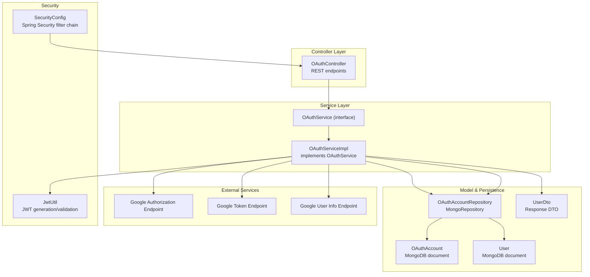
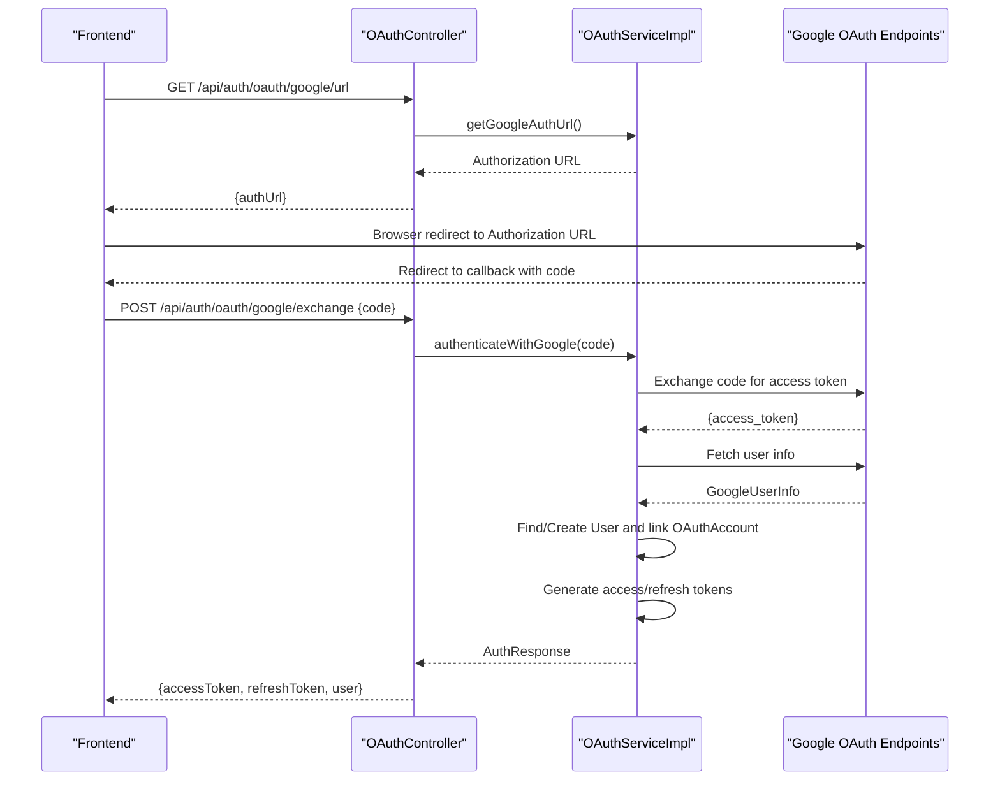
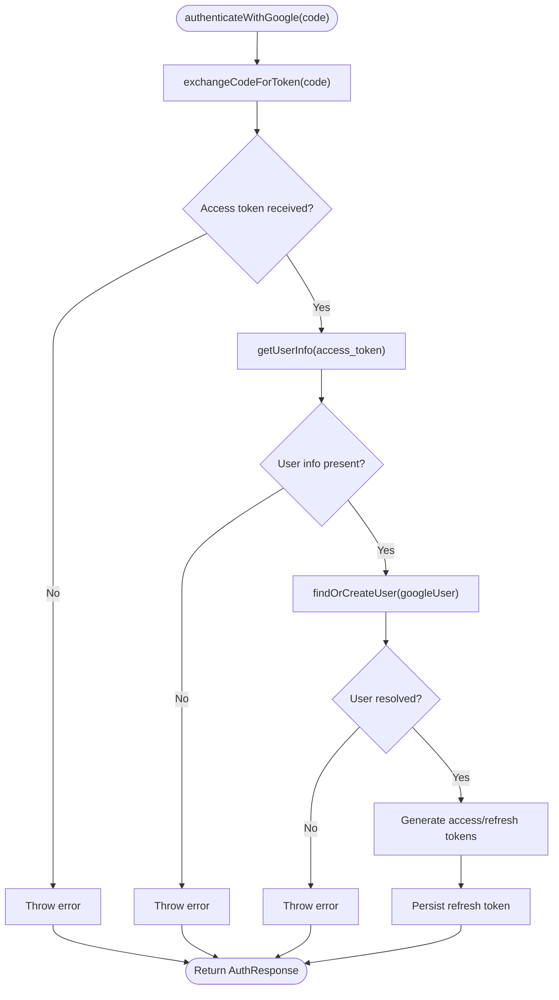
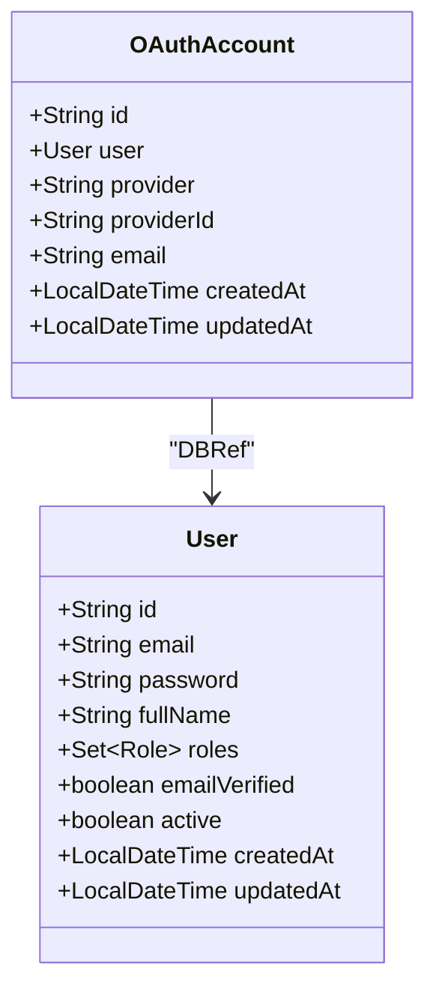
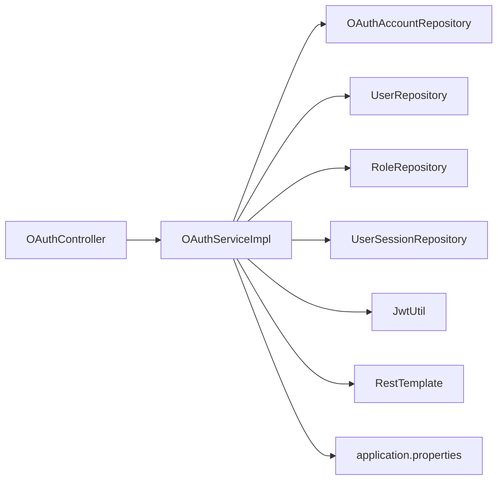

# OAuth2 Google Integration

<cite>
**Referenced Files in This Document**
- [OAuthController.java](file://src\Backend\src\main\java\com\shoppeclone\backend\auth\controller\OAuthController.java)
- [OAuthService.java](file://src\Backend\src\main\java\com\shoppeclone\backend\auth\service\OAuthService.java)
- [OAuthServiceImpl.java](file://src\Backend\src\main\java\com\shoppeclone\backend\auth\service\impl\OAuthServiceImpl.java)
- [OAuthAccount.java](file://src\Backend\src\main\java\com\shoppeclone\backend\auth\model\OAuthAccount.java)
- [OAuthAccountRepository.java](file://src\Backend\src\main\java\com\shoppeclone\backend\auth\repository\OAuthAccountRepository.java)
- [application.properties](file://src\Backend\src\main\resources\application.properties)
- [GoogleUserInfo.java](file://src\Backend\src\main\java\com\shoppeclone\backend\auth\dto\response\GoogleUserInfo.java)
- [AuthResponse.java](file://src\Backend\src\main\java\com\shoppeclone\backend\auth\dto\response\AuthResponse.java)
- [User.java](file://src\Backend\src\main\java\com\shoppeclone\backend\auth\model\User.java)
- [UserDto.java](file://src\Backend\src\main\java\com\shoppeclone\backend\auth\dto\response\UserDto.java)
- [JwtUtil.java](file://src\Backend\src\main\java\com\shoppeclone\backend\auth\security\JwtUtil.java)
- [SecurityConfig.java](file://src\Backend\src\main\java\com\shoppeclone\backend\auth\security\SecurityConfig.java)
</cite>

## Table of Contents
1. [Introduction](#introduction)
2. [Project Structure](#project-structure)
3. [Core Components](#core-components)
4. [Architecture Overview](#architecture-overview)
5. [Detailed Component Analysis](#detailed-component-analysis)
6. [Dependency Analysis](#dependency-analysis)
7. [Performance Considerations](#performance-considerations)
8. [Troubleshooting Guide](#troubleshooting-guide)
9. [Conclusion](#conclusion)

## Introduction
This document explains the OAuth2 Google integration implemented in the backend. It covers the OAuthController endpoints, the OAuthService implementation, the OAuthAccount model for storing third-party authentication data, and the complete OAuth2 flow including redirect URLs, callback handling, and user info retrieval. It also documents configuration requirements for Google OAuth credentials, scope management, consent handling, error handling strategies, account linking and merging scenarios, and security considerations for third-party authentication.

## Project Structure
The OAuth2 Google integration spans several packages:
- Controller layer: exposes endpoints for initiating Google OAuth and exchanging the authorization code for tokens
- Service layer: orchestrates the OAuth flow, interacts with external Google APIs, manages user creation/linking, and generates JWT tokens
- Model and persistence: stores OAuth account associations and user data
- Security configuration: integrates JWT-based stateless authentication and configures OAuth2 client settings

**Diagram sources**
- [OAuthController.java:11-36](file://src\Backend\src\main\java\com\shoppeclone\backend\auth\controller\OAuthController.java#L11-L36)
- [OAuthService.java:5-10](file://src\Backend\src\main\java\com\shoppeclone\backend\auth\service\OAuthService.java#L5-L10)
- [OAuthServiceImpl.java:24-293](file://src\Backend\src\main\java\com\shoppeclone\backend\auth\service\impl\OAuthServiceImpl.java#L24-L293)
- [OAuthAccount.java:9-23](file://src\Backend\src\main\java\com\shoppeclone\backend\auth\model\OAuthAccount.java#L9-L23)
- [OAuthAccountRepository.java:7-11](file://src\Backend\src\main\java\com\shoppeclone\backend\auth\repository\OAuthAccountRepository.java#L7-L11)
- [User.java:13-38](file://src\Backend\src\main\java\com\shoppeclone\backend\auth\model\User.java#L13-L38)
- [UserDto.java:6-15](file://src\Backend\src\main\java\com\shoppeclone\backend\auth\dto\response\UserDto.java#L6-L15)
- [JwtUtil.java:11-65](file://src\Backend\src\main\java\com\shoppeclone\backend\auth\security\JwtUtil.java#L11-L65)
- [SecurityConfig.java:18-92](file://src\Backend\src\main\java\com\shoppeclone\backend\auth\security\SecurityConfig.java#L18-L92)

**Section sources**
- [OAuthController.java:11-36](file://src\Backend\src\main\java\com\shoppeclone\backend\auth\controller\OAuthController.java#L11-L36)
- [OAuthService.java:5-10](file://src\Backend\src\main\java\com\shoppeclone\backend\auth\service\OAuthService.java#L5-L10)
- [OAuthServiceImpl.java:24-293](file://src\Backend\src\main\java\com\shoppeclone\backend\auth\service\impl\OAuthServiceImpl.java#L24-L293)
- [OAuthAccount.java:9-23](file://src\Backend\src\main\java\com\shoppeclone\backend\auth\model\OAuthAccount.java#L9-L23)
- [OAuthAccountRepository.java:7-11](file://src\Backend\src\main\java\com\shoppeclone\backend\auth\repository\OAuthAccountRepository.java#L7-L11)
- [User.java:13-38](file://src\Backend\src\main\java\com\shoppeclone\backend\auth\model\User.java#L13-L38)
- [UserDto.java:6-15](file://src\Backend\src\main\java\com\shoppeclone\backend\auth\dto\response\UserDto.java#L6-L15)
- [JwtUtil.java:11-65](file://src\Backend\src\main\java\com\shoppeclone\backend\auth\security\JwtUtil.java#L11-L65)
- [SecurityConfig.java:18-92](file://src\Backend\src\main\java\com\shoppeclone\backend\auth\security\SecurityConfig.java#L18-L92)

## Core Components
- OAuthController: Exposes two endpoints:
  - GET /api/auth/oauth/google/url: Returns a Google OAuth authorization URL constructed with configured client credentials and scopes
  - POST /api/auth/oauth/google/exchange: Accepts an authorization code and exchanges it for tokens, retrieves user info, creates/links accounts, and returns an AuthResponse containing access/refresh tokens and user details
- OAuthService/OAuthServiceImpl: Implements the OAuth flow:
  - Builds the authorization URL with scopes and prompt for consent
  - Exchanges the authorization code for an access token via Google token endpoint
  - Retrieves user info from Google user info endpoint
  - Finds or creates a local User, links to OAuthAccount if needed, generates JWT tokens, and persists a refresh token
- OAuthAccount and OAuthAccountRepository: Persist third-party OAuth associations with provider, providerId, and email
- GoogleUserInfo: DTO mapping for Google user info response
- AuthResponse: Response DTO for authentication tokens and user info
- SecurityConfig and JwtUtil: Configure stateless JWT authentication and handle token generation/validation

**Section sources**
- [OAuthController.java:11-36](file://src\Backend\src\main\java\com\shoppeclone\backend\auth\controller\OAuthController.java#L11-L36)
- [OAuthService.java:5-10](file://src\Backend\src\main\java\com\shoppeclone\backend\auth\service\OAuthService.java#L5-L10)
- [OAuthServiceImpl.java:53-108](file://src\Backend\src\main\java\com\shoppeclone\backend\auth\service\impl\OAuthServiceImpl.java#L53-L108)
- [OAuthAccount.java:9-23](file://src\Backend\src\main\java\com\shoppeclone\backend\auth\model\OAuthAccount.java#L9-L23)
- [OAuthAccountRepository.java:7-11](file://src\Backend\src\main\java\com\shoppeclone\backend\auth\repository\OAuthAccountRepository.java#L7-L11)
- [GoogleUserInfo.java:6-26](file://src\Backend\src\main\java\com\shoppeclone\backend\auth\dto\response\GoogleUserInfo.java#L6-L26)
- [AuthResponse.java:10-24](file://src\Backend\src\main\java\com\shoppeclone\backend\auth\dto\response\AuthResponse.java#L10-L24)
- [JwtUtil.java:23-43](file://src\Backend\src\main\java\com\shoppeclone\backend\auth\security\JwtUtil.java#L23-L43)
- [SecurityConfig.java:26-78](file://src\Backend\src\main\java\com\shoppeclone\backend\auth\security\SecurityConfig.java#L26-L78)

## Architecture Overview
The OAuth2 Google integration follows a stateless JWT-based flow:
- Frontend initiates OAuth by requesting the authorization URL from the backend
- Google redirects the user back to a configured redirect URI with an authorization code
- Frontend posts the code to the backend endpoint
- Backend exchanges the code for tokens, fetches user info, resolves or creates a local account, and issues JWT tokens

**Diagram sources**
- [OAuthController.java:19-34](file://src\Backend\src\main\java\com\shoppeclone\backend\auth\controller\OAuthController.java#L19-L34)
- [OAuthServiceImpl.java:53-108](file://src\Backend\src\main\java\com\shoppeclone\backend\auth\service\impl\OAuthServiceImpl.java#L53-L108)
- [GoogleUserInfo.java:6-26](file://src\Backend\src\main\java\com\shoppeclone\backend\auth\dto\response\GoogleUserInfo.java#L6-L26)
- [AuthResponse.java:10-24](file://src\Backend\src\main\java\com\shoppeclone\backend\auth\dto\response\AuthResponse.java#L10-L24)

## Detailed Component Analysis

### OAuthController
Responsibilities:
- Expose GET endpoint to obtain the Google authorization URL
- Expose POST endpoint to exchange the authorization code for tokens and return an AuthResponse

Key behaviors:
- Delegates URL construction to OAuthService
- Receives authorization code from frontend and delegates authentication to OAuthService
- Returns structured AuthResponse with tokens and user info

**Section sources**
- [OAuthController.java:11-36](file://src\Backend\src\main\java\com\shoppeclone\backend\auth\controller\OAuthController.java#L11-L36)

### OAuthService and OAuthServiceImpl
Responsibilities:
- Build authorization URL with scopes and consent prompt
- Exchange authorization code for access token
- Retrieve Google user info
- Resolve or create a local User, link to OAuthAccount, and persist refresh token
- Generate JWT access and refresh tokens

Implementation highlights:
- Hardcoded redirect URI for Google OAuth callback
- Uses RestTemplate to call Google token and user info endpoints
- Validates responses and handles errors explicitly
- Manages account linking and merging scenarios

**Diagram sources**
- [OAuthServiceImpl.java:71-108](file://src\Backend\src\main\java\com\shoppeclone\backend\auth\service\impl\OAuthServiceImpl.java#L71-L108)
- [OAuthServiceImpl.java:112-140](file://src\Backend\src\main\java\com\shoppeclone\backend\auth\service\impl\OAuthServiceImpl.java#L112-L140)
- [OAuthServiceImpl.java:142-161](file://src\Backend\src\main\java\com\shoppeclone\backend\auth\service\impl\OAuthServiceImpl.java#L142-L161)
- [OAuthServiceImpl.java:163-236](file://src\Backend\src\main\java\com\shoppeclone\backend\auth\service\impl\OAuthServiceImpl.java#L163-L236)

**Section sources**
- [OAuthService.java:5-10](file://src\Backend\src\main\java\com\shoppeclone\backend\auth\service\OAuthService.java#L5-L10)
- [OAuthServiceImpl.java:53-108](file://src\Backend\src\main\java\com\shoppeclone\backend\auth\service\impl\OAuthServiceImpl.java#L53-L108)
- [OAuthServiceImpl.java:112-161](file://src\Backend\src\main\java\com\shoppeclone\backend\auth\service\impl\OAuthServiceImpl.java#L112-L161)
- [OAuthServiceImpl.java:163-236](file://src\Backend\src\main\java\com\shoppeclone\backend\auth\service\impl\OAuthServiceImpl.java#L163-L236)

### OAuthAccount Model and Repository
Purpose:
- Store third-party OAuth associations with provider, providerId, and email
- Enable linking Google accounts to existing local users

Schema highlights:
- References a User via DBRef
- Stores provider ("google"), providerId (Google user ID), email, and timestamps

**Diagram sources**
- [OAuthAccount.java:9-23](file://src\Backend\src\main\java\com\shoppeclone\backend\auth\model\OAuthAccount.java#L9-L23)
- [User.java:13-38](file://src\Backend\src\main\java\com\shoppeclone\backend\auth\model\User.java#L13-L38)

**Section sources**
- [OAuthAccount.java:9-23](file://src\Backend\src\main\java\com\shoppeclone\backend\auth\model\OAuthAccount.java#L9-L23)
- [OAuthAccountRepository.java:7-11](file://src\Backend\src\main\java\com\shoppeclone\backend\auth\repository\OAuthAccountRepository.java#L7-L11)

### GoogleUserInfo DTO
Maps Google user info response fields to Java properties, including:
- id (mapped from "sub")
- email
- email_verified
- name
- picture
- given_name
- family_name

**Section sources**
- [GoogleUserInfo.java:6-26](file://src\Backend\src\main\java\com\shoppeclone\backend\auth\dto\response\GoogleUserInfo.java#L6-L26)

### AuthResponse DTO
Encapsulates:
- accessToken
- refreshToken
- tokenType
- user (UserDto)
- message (optional field)

**Section sources**
- [AuthResponse.java:10-24](file://src\Backend\src\main\java\com\shoppeclone\backend\auth\dto\response\AuthResponse.java#L10-L24)

### JWT and Security Configuration
- JwtUtil generates access and refresh tokens using HS256 with configurable secrets and expirations
- SecurityConfig configures stateless sessions, permits OAuth-related endpoints, and applies JWT filter globally

**Section sources**
- [JwtUtil.java:23-43](file://src\Backend\src\main\java\com\shoppeclone\backend\auth\security\JwtUtil.java#L23-L43)
- [SecurityConfig.java:26-78](file://src\Backend\src\main\java\com\shoppeclone\backend\auth\security\SecurityConfig.java#L26-L78)

## Dependency Analysis
The OAuthServiceImpl depends on:
- Repositories for OAuthAccount and User persistence
- JwtUtil for token generation
- RestTemplate for external Google API calls
- Environment properties for client credentials and endpoint URIs

**Diagram sources**
- [OAuthController.java:11-36](file://src\Backend\src\main\java\com\shoppeclone\backend\auth\controller\OAuthController.java#L11-L36)
- [OAuthServiceImpl.java:31-39](file://src\Backend\src\main\java\com\shoppeclone\backend\auth\service\impl\OAuthServiceImpl.java#L31-L39)
- [application.properties:58-68](file://src\Backend\src\main\resources\application.properties#L58-L68)

**Section sources**
- [OAuthServiceImpl.java:31-39](file://src\Backend\src\main\java\com\shoppeclone\backend\auth\service\impl\OAuthServiceImpl.java#L31-L39)
- [application.properties:58-68](file://src\Backend\src\main\resources\application.properties#L58-L68)

## Performance Considerations
- Minimize external API calls: reuse access tokens where possible and cache non-sensitive user info briefly
- Use async operations for non-critical tasks (e.g., sending welcome emails) to avoid blocking the authentication flow
- Monitor token endpoint rate limits and handle transient failures gracefully
- Keep JWT expiration short for access tokens and refresh tokens appropriately long to balance security and UX

## Troubleshooting Guide
Common issues and resolutions:
- Authorization URL mismatch: Ensure the redirect URI configured in Google matches the hardcoded value used by the service
- Missing access token: Verify client credentials and that the token endpoint responds with an access_token
- Null user info: Confirm the user info endpoint is reachable and the access token is valid
- Account linking failures: Check OAuthAccountRepository queries and ensure provider/providerId uniqueness
- JWT validation errors: Verify JWT secret and expiration configurations

Error handling strategies:
- Explicit validation of Google responses and throwing descriptive exceptions
- Logging around token exchange and user info retrieval for diagnostics
- Graceful fallbacks when OAuthAccount references a missing User

**Section sources**
- [OAuthServiceImpl.java:112-140](file://src\Backend\src\main\java\com\shoppeclone\backend\auth\service\impl\OAuthServiceImpl.java#L112-L140)
- [OAuthServiceImpl.java:142-161](file://src\Backend\src\main\java\com\shoppeclone\backend\auth\service\impl\OAuthServiceImpl.java#L142-L161)
- [OAuthServiceImpl.java:163-236](file://src\Backend\src\main\java\com\shoppeclone\backend\auth\service\impl\OAuthServiceImpl.java#L163-L236)
- [OAuthServiceImpl.java:103-107](file://src\Backend\src\main\java\com\shoppeclone\backend\auth\service\impl\OAuthServiceImpl.java#L103-L107)

## Conclusion
The OAuth2 Google integration provides a robust, stateless authentication flow using JWT tokens. It supports account linking and merging, validates responses from Google endpoints, and persists OAuth associations. Proper configuration of client credentials, redirect URIs, scopes, and consent prompts ensures a smooth user experience while maintaining security.