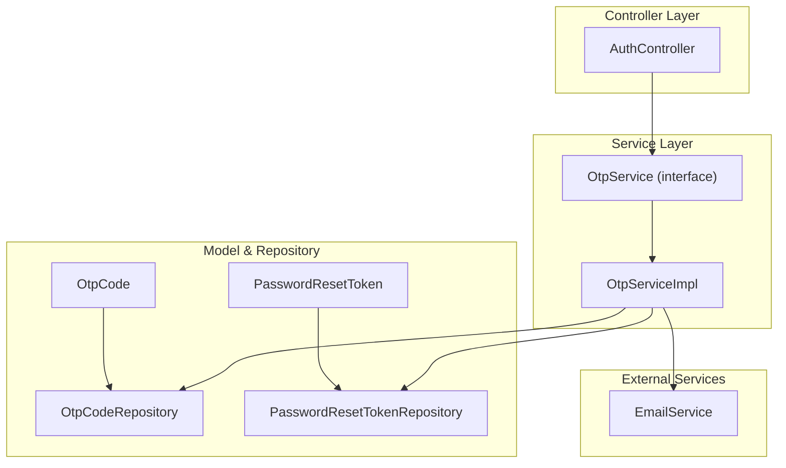
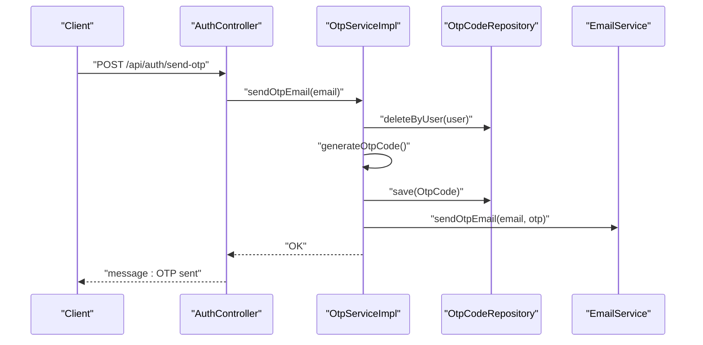
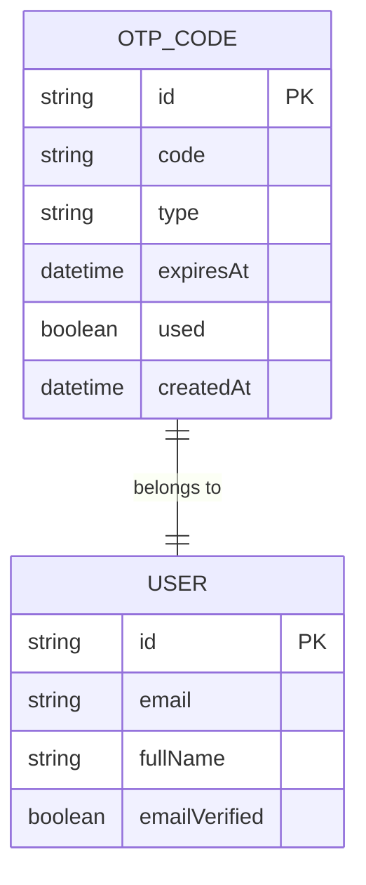
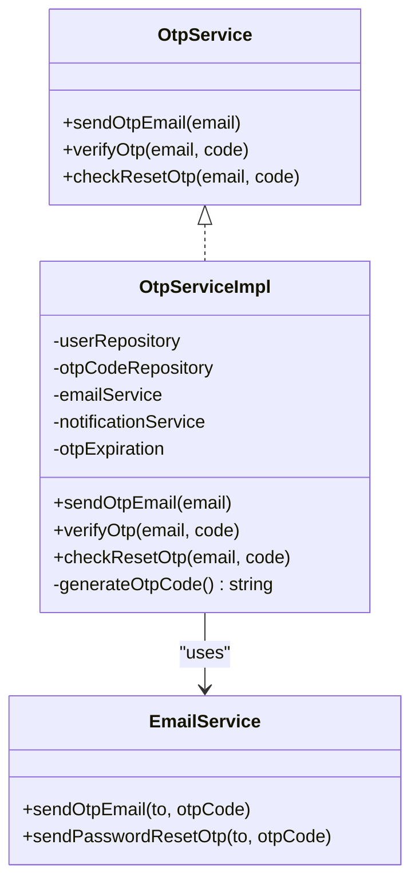
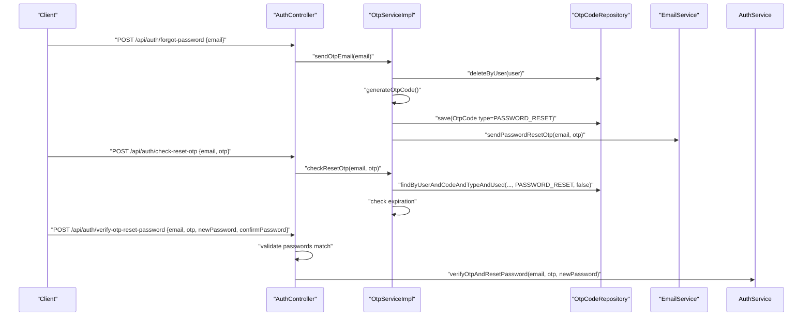
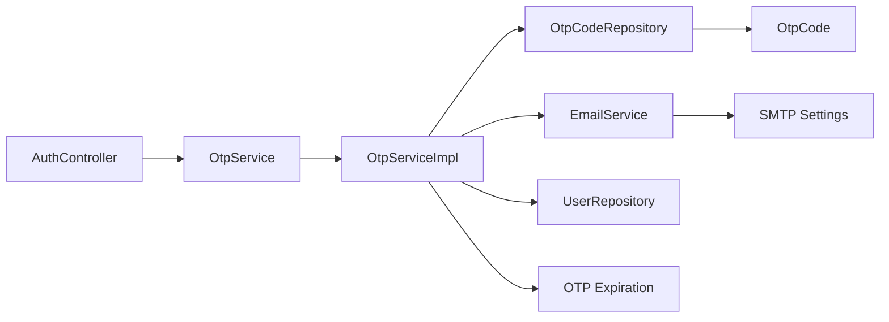

# OTP & Password Reset System

<cite>
**Referenced Files in This Document**
- [OtpCode.java](file://src/Backend/src/main/java/com/shoppeclone/backend/auth/model/OtpCode.java)
- [PasswordResetToken.java](file://src/Backend/src/main/java/com/shoppeclone/backend/auth/model/PasswordResetToken.java)
- [OtpCodeRepository.java](file://src/Backend/src/main/java/com/shoppeclone/backend/auth/repository/OtpCodeRepository.java)
- [PasswordResetTokenRepository.java](file://src/Backend/src/main/java/com/shoppeclone/backend/auth/repository/PasswordResetTokenRepository.java)
- [OtpService.java](file://src/Backend/src/main/java/com/shoppeclone/backend/auth/service/OtpService.java)
- [OtpServiceImpl.java](file://src/Backend/src/main/java/com/shoppeclone/backend/auth/service/impl/OtpServiceImpl.java)
- [EmailService.java](file://src/Backend/src/main/java/com/shoppeclone/backend/common/service/EmailService.java)
- [AuthController.java](file://src/Backend/src/main/java/com/shoppeclone/backend/auth/controller/AuthController.java)
- [application.properties](file://src/Backend/src/main/resources/application.properties)
- [SendOtpRequest.java](file://src/Backend/src/main/java/com/shoppeclone/backend/auth/dto/request/SendOtpRequest.java)
- [VerifyOtpRequest.java](file://src/Backend/src/main/java/com/shoppeclone/backend/auth/dto/request/VerifyOtpRequest.java)
- [ForgotPasswordRequest.java](file://src/Backend/src/main/java/com/shoppeclone/backend/auth/dto/request/ForgotPasswordRequest.java)
- [VerifyOtpAndResetPasswordRequest.java](file://src/Backend/src/main/java/com/shoppeclone/backend/auth/dto/request/VerifyOtpAndResetPasswordRequest.java)
</cite>

## Table of Contents
1. [Introduction](#introduction)
2. [Project Structure](#project-structure)
3. [Core Components](#core-components)
4. [Architecture Overview](#architecture-overview)
5. [Detailed Component Analysis](#detailed-component-analysis)
6. [Dependency Analysis](#dependency-analysis)
7. [Performance Considerations](#performance-considerations)
8. [Troubleshooting Guide](#troubleshooting-guide)
9. [Conclusion](#conclusion)

## Introduction
This document explains the OTP and password reset functionality implemented in the backend. It covers OTP generation, validation, expiration handling, and the lifecycle of the OtpCode entity. It also documents the complete password reset flow from initiating an OTP request to confirming a new password. Security considerations such as rate limiting and brute-force protection are addressed, along with email integration for OTP delivery, template management, and error handling strategies. Common issues like expired OTPs, invalid codes, and user experience considerations are included.

## Project Structure
The OTP and password reset system spans several packages:
- Model layer: OtpCode and PasswordResetToken entities
- Repository layer: MongoDB repositories for persistence
- Service layer: OtpService interface and OtpServiceImpl implementation
- Controller layer: AuthController endpoints for OTP and password reset
- Email service: EmailService for sending OTP emails
- Configuration: application.properties for OTP expiration and email settings
- DTOs: Request DTOs for OTP-related operations

**Diagram sources**
- [AuthController.java:22-98](file://src/Backend/src/main/java/com/shoppeclone/backend/auth/controller/AuthController.java#L22-L98)
- [OtpService.java:3-9](file://src/Backend/src/main/java/com/shoppeclone/backend/auth/service/OtpService.java#L3-L9)
- [OtpServiceImpl.java:16-153](file://src/Backend/src/main/java/com/shoppeclone/backend/auth/service/impl/OtpServiceImpl.java#L16-L153)
- [OtpCode.java:10-24](file://src/Backend/src/main/java/com/shoppeclone/backend/auth/model/OtpCode.java#L10-L24)
- [PasswordResetToken.java:9-23](file://src/Backend/src/main/java/com/shoppeclone/backend/auth/model/PasswordResetToken.java#L9-L23)
- [OtpCodeRepository.java:8-12](file://src/Backend/src/main/java/com/shoppeclone/backend/auth/repository/OtpCodeRepository.java#L8-L12)
- [PasswordResetTokenRepository.java:10-16](file://src/Backend/src/main/java/com/shoppeclone/backend/auth/repository/PasswordResetTokenRepository.java#L10-L16)
- [EmailService.java:10-197](file://src/Backend/src/main/java/com/shoppeclone/backend/common/service/EmailService.java#L10-L197)

**Section sources**
- [AuthController.java:22-98](file://src/Backend/src/main/java/com/shoppeclone/backend/auth/controller/AuthController.java#L22-L98)
- [OtpService.java:3-9](file://src/Backend/src/main/java/com/shoppeclone/backend/auth/service/OtpService.java#L3-L9)
- [OtpServiceImpl.java:16-153](file://src/Backend/src/main/java/com/shoppeclone/backend/auth/service/impl/OtpServiceImpl.java#L16-L153)
- [OtpCode.java:10-24](file://src/Backend/src/main/java/com/shoppeclone/backend/auth/model/OtpCode.java#L10-L24)
- [PasswordResetToken.java:9-23](file://src/Backend/src/main/java/com/shoppeclone/backend/auth/model/PasswordResetToken.java#L9-L23)
- [OtpCodeRepository.java:8-12](file://src/Backend/src/main/java/com/shoppeclone/backend/auth/repository/OtpCodeRepository.java#L8-L12)
- [PasswordResetTokenRepository.java:10-16](file://src/Backend/src/main/java/com/shoppeclone/backend/auth/repository/PasswordResetTokenRepository.java#L10-L16)
- [EmailService.java:10-197](file://src/Backend/src/main/java/com/shoppeclone/backend/common/service/EmailService.java#L10-L197)
- [application.properties:81-83](file://src/Backend/src/main/resources/application.properties#L81-L83)

## Core Components
- OtpCode entity: Stores a single-use 6-digit OTP linked to a user, with type (EMAIL_VERIFICATION or PASSWORD_RESET), expiration timestamp, usage flag, and creation timestamp.
- OtpCodeRepository: Provides queries to find OTPs by user, code, type, and usage state, and to clean up old OTPs per user.
- OtpService interface and OtpServiceImpl: Define and implement OTP operations including sending verification OTPs, verifying email verification OTPs, and checking password reset OTP validity.
- EmailService: Sends OTP emails with subject and body tailored for OTP verification and password reset, including validity duration messaging.
- AuthController endpoints: Expose /api/auth/send-otp, /api/auth/verify-otp, /api/auth/check-reset-otp, /api/auth/forgot-password, and /api/auth/verify-otp-reset-password.
- Configuration: OTP expiration is configured via application.properties; email settings are configured for SMTP.

Key implementation references:
- OTP entity lifecycle and fields: [OtpCode.java:10-24](file://src/Backend/src/main/java/com/shoppeclone/backend/auth/model/OtpCode.java#L10-L24)
- OTP repository methods: [OtpCodeRepository.java:8-12](file://src/Backend/src/main/java/com/shoppeclone/backend/auth/repository/OtpCodeRepository.java#L8-L12)
- OTP service contract: [OtpService.java:3-9](file://src/Backend/src/main/java/com/shoppeclone/backend/auth/service/OtpService.java#L3-L9)
- OTP service implementation: [OtpServiceImpl.java:16-153](file://src/Backend/src/main/java/com/shoppeclone/backend/auth/service/impl/OtpServiceImpl.java#L16-L153)
- Email templates for OTP and password reset: [EmailService.java:14-46](file://src/Backend/src/main/java/com/shoppeclone/backend/common/service/EmailService.java#L14-L46)
- Controller endpoints: [AuthController.java:57-97](file://src/Backend/src/main/java/com/shoppeclone/backend/auth/controller/AuthController.java#L57-L97)
- OTP expiration setting: [application.properties:82](file://src/Backend/src/main/resources/application.properties#L82)

**Section sources**
- [OtpCode.java:10-24](file://src/Backend/src/main/java/com/shoppeclone/backend/auth/model/OtpCode.java#L10-L24)
- [OtpCodeRepository.java:8-12](file://src/Backend/src/main/java/com/shoppeclone/backend/auth/repository/OtpCodeRepository.java#L8-L12)
- [OtpService.java:3-9](file://src/Backend/src/main/java/com/shoppeclone/backend/auth/service/OtpService.java#L3-L9)
- [OtpServiceImpl.java:16-153](file://src/Backend/src/main/java/com/shoppeclone/backend/auth/service/impl/OtpServiceImpl.java#L16-L153)
- [EmailService.java:14-46](file://src/Backend/src/main/java/com/shoppeclone/backend/common/service/EmailService.java#L14-L46)
- [AuthController.java:57-97](file://src/Backend/src/main/java/com/shoppeclone/backend/auth/controller/AuthController.java#L57-L97)
- [application.properties:82](file://src/Backend/src/main/resources/application.properties#L82)

## Architecture Overview
The OTP and password reset flow integrates the controller, service, repository, and email service layers. The system supports two OTP types:
- EMAIL_VERIFICATION: Used during initial email verification and welcome notifications.
- PASSWORD_RESET: Used during password reset after validating the OTP.

**Diagram sources**
- [AuthController.java:57-62](file://src/Backend/src/main/java/com/shoppeclone/backend/auth/controller/AuthController.java#L57-L62)
- [OtpServiceImpl.java:28-57](file://src/Backend/src/main/java/com/shoppeclone/backend/auth/service/impl/OtpServiceImpl.java#L28-L57)
- [OtpCodeRepository.java:11](file://src/Backend/src/main/java/com/shoppeclone/backend/auth/repository/OtpCodeRepository.java#L11)
- [EmailService.java:14-27](file://src/Backend/src/main/java/com/shoppeclone/backend/common/service/EmailService.java#L14-L27)

## Detailed Component Analysis

### OtpCode Entity and Lifecycle
The OtpCode entity encapsulates:
- User reference via DBRef
- 6-digit numeric code
- Type: EMAIL_VERIFICATION or PASSWORD_RESET
- Expiration timestamp
- Used flag
- Creation timestamp

Lifecycle management:
- Generation: OTP is generated as a 6-digit random number and persisted with an expiration derived from the OTP expiration setting.
- Validation: Lookup by user, code, type, and unused flag; expiration checked against current time.
- Cleanup: Old OTPs are removed per user before generating a new OTP.

**Diagram sources**
- [OtpCode.java:10-24](file://src/Backend/src/main/java/com/shoppeclone/backend/auth/model/OtpCode.java#L10-L24)

**Section sources**
- [OtpCode.java:10-24](file://src/Backend/src/main/java/com/shoppeclone/backend/auth/model/OtpCode.java#L10-L24)
- [OtpCodeRepository.java:8-12](file://src/Backend/src/main/java/com/shoppeclone/backend/auth/repository/OtpCodeRepository.java#L8-L12)
- [application.properties:82](file://src/Backend/src/main/resources/application.properties#L82)

### OtpService Implementation
Responsibilities:
- Send OTP email for general verification (EMAIL_VERIFICATION).
- Verify OTP for email verification and mark it used; update user emailVerified flag.
- Check OTP validity for password reset without marking used.

OTP generation:
- Generates a 6-digit random integer in the range 100000–999999.

Validation and expiration:
- Finds OTP by user, code, type, and unused flag.
- Compares expiresAt with current time to detect expiration.
- Marks OTP as used upon successful verification.

Email delivery:
- Uses EmailService to send templated OTP emails with appropriate subjects and validity durations.

**Diagram sources**
- [OtpService.java:3-9](file://src/Backend/src/main/java/com/shoppeclone/backend/auth/service/OtpService.java#L3-L9)
- [OtpServiceImpl.java:16-153](file://src/Backend/src/main/java/com/shoppeclone/backend/auth/service/impl/OtpServiceImpl.java#L16-L153)
- [EmailService.java:14-46](file://src/Backend/src/main/java/com/shoppeclone/backend/common/service/EmailService.java#L14-L46)

**Section sources**
- [OtpServiceImpl.java:28-151](file://src/Backend/src/main/java/com/shoppeclone/backend/auth/service/impl/OtpServiceImpl.java#L28-L151)
- [EmailService.java:14-46](file://src/Backend/src/main/java/com/shoppeclone/backend/common/service/EmailService.java#L14-L46)

### Password Reset Flow
End-to-end flow from OTP request to password confirmation:
1. Request OTP for password reset:
   - Client calls POST /api/auth/forgot-password with email.
   - AuthService triggers OTP generation and email delivery.
2. Verify OTP validity for password reset:
   - Client calls POST /api/auth/check-reset-otp with email and OTP.
   - OtpServiceImpl checks OTP existence, type PASSWORD_RESET, and expiration.
3. Confirm password reset:
   - Client calls POST /api/auth/verify-otp-reset-password with email, OTP, new password, and confirmation.
   - AuthController validates password confirmation and delegates to AuthService to verify OTP and update password.

**Diagram sources**
- [AuthController.java:78-97](file://src/Backend/src/main/java/com/shoppeclone/backend/auth/controller/AuthController.java#L78-L97)
- [OtpServiceImpl.java:28-57](file://src/Backend/src/main/java/com/shoppeclone/backend/auth/service/impl/OtpServiceImpl.java#L28-L57)
- [OtpServiceImpl.java:128-145](file://src/Backend/src/main/java/com/shoppeclone/backend/auth/service/impl/OtpServiceImpl.java#L128-L145)
- [EmailService.java:29-46](file://src/Backend/src/main/java/com/shoppeclone/backend/common/service/EmailService.java#L29-L46)

**Section sources**
- [AuthController.java:78-97](file://src/Backend/src/main/java/com/shoppeclone/backend/auth/controller/AuthController.java#L78-L97)
- [OtpServiceImpl.java:28-57](file://src/Backend/src/main/java/com/shoppeclone/backend/auth/service/impl/OtpServiceImpl.java#L28-L57)
- [OtpServiceImpl.java:128-145](file://src/Backend/src/main/java/com/shoppeclone/backend/auth/service/impl/OtpServiceImpl.java#L128-L145)
- [EmailService.java:29-46](file://src/Backend/src/main/java/com/shoppeclone/backend/common/service/EmailService.java#L29-L46)

### Data Validation and Request DTOs
Request DTOs enforce client-side validation:
- SendOtpRequest: Validates email format and presence.
- VerifyOtpRequest: Validates email and non-empty code.
- ForgotPasswordRequest: Validates email presence and format.
- VerifyOtpAndResetPasswordRequest: Validates email, 6-digit OTP, minimum 8-character new password with at least one uppercase, lowercase, and digit, and confirm password match.

These DTOs ensure robust input validation before reaching the service layer.

**Section sources**
- [SendOtpRequest.java:8-12](file://src/Backend/src/main/java/com/shoppeclone/backend/auth/dto/request/SendOtpRequest.java#L8-L12)
- [VerifyOtpRequest.java:8-15](file://src/Backend/src/main/java/com/shoppeclone/backend/auth/dto/request/VerifyOtpRequest.java#L8-L15)
- [ForgotPasswordRequest.java:8-14](file://src/Backend/src/main/java/com/shoppeclone/backend/auth/dto/request/ForgotPasswordRequest.java#L8-L14)
- [VerifyOtpAndResetPasswordRequest.java:9-27](file://src/Backend/src/main/java/com/shoppeclone/backend/auth/dto/request/VerifyOtpAndResetPasswordRequest.java#L9-L27)

## Dependency Analysis
The OTP and password reset system exhibits clear separation of concerns:
- AuthController depends on OtpService and AuthService for orchestration.
- OtpServiceImpl depends on UserRepository, OtpCodeRepository, EmailService, and NotificationService.
- OtpCodeRepository persists and queries OTP records.
- EmailService handles SMTP-based OTP delivery.
- application.properties centralizes OTP expiration and email configuration.

**Diagram sources**
- [AuthController.java:22-98](file://src/Backend/src/main/java/com/shoppeclone/backend/auth/controller/AuthController.java#L22-L98)
- [OtpService.java:3-9](file://src/Backend/src/main/java/com/shoppeclone/backend/auth/service/OtpService.java#L3-L9)
- [OtpServiceImpl.java:16-153](file://src/Backend/src/main/java/com/shoppeclone/backend/auth/service/impl/OtpServiceImpl.java#L16-L153)
- [OtpCodeRepository.java:8-12](file://src/Backend/src/main/java/com/shoppeclone/backend/auth/repository/OtpCodeRepository.java#L8-L12)
- [EmailService.java:10-197](file://src/Backend/src/main/java/com/shoppeclone/backend/common/service/EmailService.java#L10-L197)
- [application.properties:81-83](file://src/Backend/src/main/resources/application.properties#L81-L83)

**Section sources**
- [AuthController.java:22-98](file://src/Backend/src/main/java/com/shoppeclone/backend/auth/controller/AuthController.java#L22-L98)
- [OtpServiceImpl.java:16-153](file://src/Backend/src/main/java/com/shoppeclone/backend/auth/service/impl/OtpServiceImpl.java#L16-L153)
- [OtpCodeRepository.java:8-12](file://src/Backend/src/main/java/com/shoppeclone/backend/auth/repository/OtpCodeRepository.java#L8-L12)
- [EmailService.java:10-197](file://src/Backend/src/main/java/com/shoppeclone/backend/common/service/EmailService.java#L10-L197)
- [application.properties:81-83](file://src/Backend/src/main/resources/application.properties#L81-L83)

## Performance Considerations
- OTP expiration: Controlled by application.properties; ensure the value balances usability with security. Too long increases risk exposure; too short may frustrate users.
- Database queries: OtpCodeRepository provides targeted queries by user, code, type, and used flag. Indexes on these fields improve lookup performance.
- Email throughput: EmailService uses synchronous SMTP sending. For high-volume scenarios, consider asynchronous queuing and retry policies.
- Memory footprint: OTP generation is lightweight; avoid storing unnecessary metadata in OtpCode beyond what is required for validation and logging.

[No sources needed since this section provides general guidance]

## Troubleshooting Guide
Common issues and resolutions:
- Expired OTP:
  - Symptom: Validation fails with an expiration error.
  - Cause: expiresAt precedes current time.
  - Resolution: Request a new OTP; ensure system time is synchronized.
  - Reference: [OtpServiceImpl.java:84-87](file://src/Backend/src/main/java/com/shoppeclone/backend/auth/service/impl/OtpServiceImpl.java#L84-L87), [OtpServiceImpl.java:140-142](file://src/Backend/src/main/java/com/shoppeclone/backend/auth/service/impl/OtpServiceImpl.java#L140-L142)
- Invalid OTP:
  - Symptom: Validation throws an invalid OTP error.
  - Cause: No matching record for user, code, type, and unused flag.
  - Resolution: Ensure correct email/code combination; verify OTP type (EMAIL_VERIFICATION vs PASSWORD_RESET).
  - Reference: [OtpServiceImpl.java:72-79](file://src/Backend/src/main/java/com/shoppeclone/backend/auth/service/impl/OtpServiceImpl.java#L72-L79), [OtpServiceImpl.java:138](file://src/Backend/src/main/java/com/shoppeclone/backend/auth/service/impl/OtpServiceImpl.java#L138)
- Password mismatch:
  - Symptom: Endpoint rejects password confirmation.
  - Cause: newPassword does not equal confirmPassword.
  - Resolution: Ensure both fields match before submission.
  - Reference: [AuthController.java:90-93](file://src/Backend/src/main/java/com/shoppeclone/backend/auth/controller/AuthController.java#L90-L93)
- Email delivery failures:
  - Symptom: Users report not receiving OTP emails.
  - Causes: Incorrect SMTP configuration, spam filters, or invalid email address.
  - Resolution: Verify application.properties email settings; check mailSender logs; resend OTP.
  - Reference: [application.properties:73-80](file://src/Backend/src/main/resources/application.properties#L73-L80), [EmailService.java:14-27](file://src/Backend/src/main/java/com/shoppeclone/backend/common/service/EmailService.java#L14-L27), [EmailService.java:29-46](file://src/Backend/src/main/java/com/shoppeclone/backend/common/service/EmailService.java#L29-L46)
- Rate limiting and brute-force protection:
  - Recommendation: Implement rate limiting at the controller or gateway level (e.g., per IP/email per minute/hour). Add circuit breaker patterns and CAPTCHA for high-risk endpoints.
  - Reference: [AuthController.java:57-97](file://src/Backend/src/main/java/com/shoppeclone/backend/auth/controller/AuthController.java#L57-L97)

**Section sources**
- [OtpServiceImpl.java:72-79](file://src/Backend/src/main/java/com/shoppeclone/backend/auth/service/impl/OtpServiceImpl.java#L72-L79)
- [OtpServiceImpl.java:84-87](file://src/Backend/src/main/java/com/shoppeclone/backend/auth/service/impl/OtpServiceImpl.java#L84-L87)
- [OtpServiceImpl.java:138](file://src/Backend/src/main/java/com/shoppeclone/backend/auth/service/impl/OtpServiceImpl.java#L138)
- [OtpServiceImpl.java:140-142](file://src/Backend/src/main/java/com/shoppeclone/backend/auth/service/impl/OtpServiceImpl.java#L140-L142)
- [AuthController.java:90-93](file://src/Backend/src/main/java/com/shoppeclone/backend/auth/controller/AuthController.java#L90-L93)
- [application.properties:73-80](file://src/Backend/src/main/resources/application.properties#L73-L80)
- [EmailService.java:14-27](file://src/Backend/src/main/java/com/shoppeclone/backend/common/service/EmailService.java#L14-L27)
- [EmailService.java:29-46](file://src/Backend/src/main/java/com/shoppeclone/backend/common/service/EmailService.java#L29-L46)
- [AuthController.java:57-97](file://src/Backend/src/main/java/com/shoppeclone/backend/auth/controller/AuthController.java#L57-L97)

## Conclusion
The OTP and password reset system provides a secure, modular foundation for email verification and password recovery. The OtpCode entity and repository manage OTP lifecycle, while OtpServiceImpl encapsulates generation, validation, and expiration logic. EmailService delivers OTPs with clear validity messages. The AuthController exposes straightforward endpoints for the entire flow. To enhance resilience, consider adding rate limiting, circuit breakers, and asynchronous email delivery. Proper configuration of OTP expiration and SMTP settings ensures reliability and user trust.