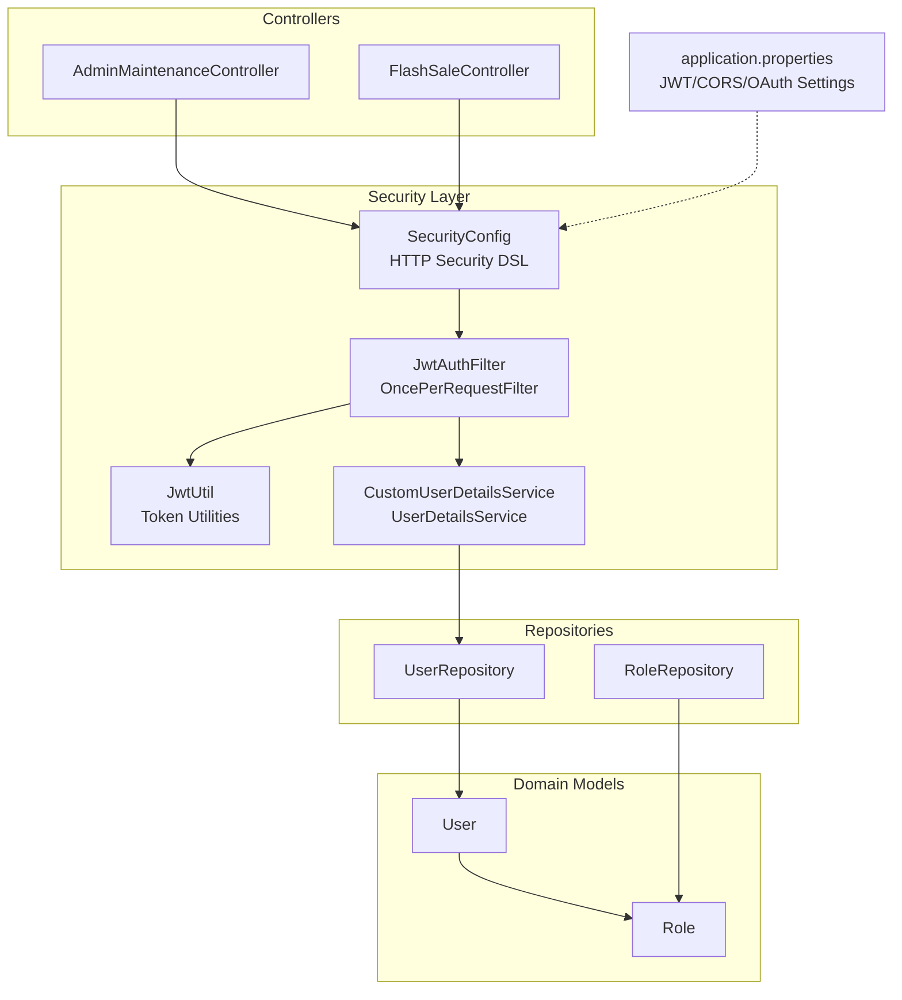
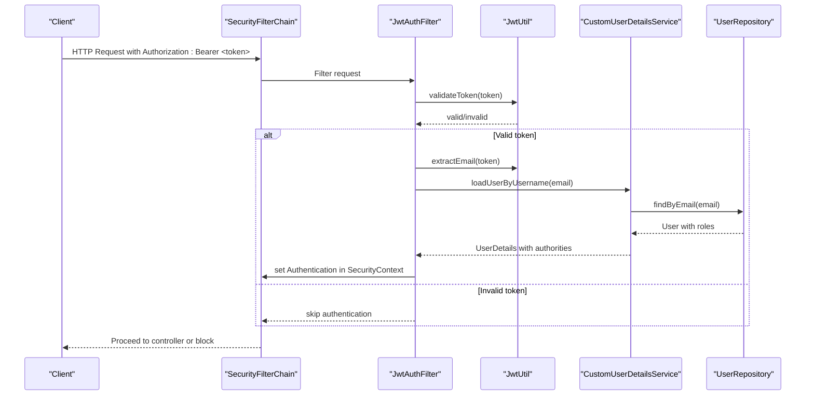
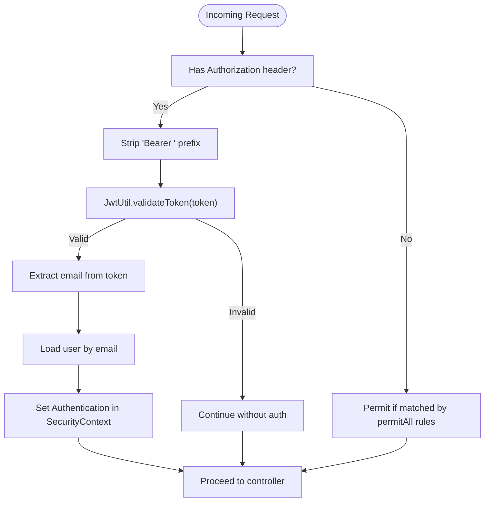
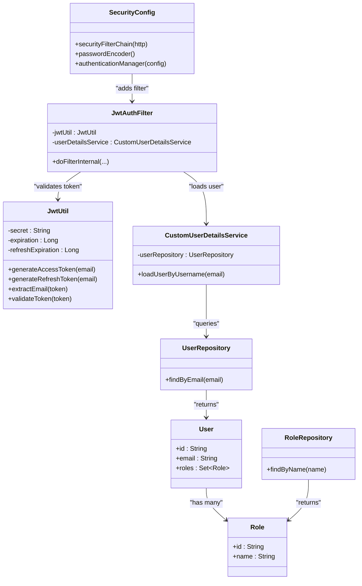

# Security Configuration & Access Control

<cite>
**Referenced Files in This Document**
- [SecurityConfig.java](file://src/Backend/src/main/java/com/shoppeclone/backend/auth/security/SecurityConfig.java)
- [CustomUserDetailsService.java](file://src/Backend/src/main/java/com/shoppeclone/backend/auth/security/CustomUserDetailsService.java)
- [JwtAuthFilter.java](file://src/Backend/src/main/java/com/shoppeclone/backend/auth/security/JwtAuthFilter.java)
- [JwtUtil.java](file://src/Backend/src/main/java/com/shoppeclone/backend/auth/security/JwtUtil.java)
- [Role.java](file://src/Backend/src/main/java/com/shoppeclone/backend/auth/model/Role.java)
- [User.java](file://src/Backend/src/main/java/com/shoppeclone/backend/auth/model/User.java)
- [UserRepository.java](file://src/Backend/src/main/java/com/shoppeclone/backend/auth/repository/UserRepository.java)
- [RoleRepository.java](file://src/Backend/src/main/java/com/shoppeclone/backend/auth/repository/RoleRepository.java)
- [application.properties](file://src/Backend/src/main/resources/application.properties)
- [AdminMaintenanceController.java](file://src/Backend/src/main/java/com/shoppeclone/backend/admin/controller/AdminMaintenanceController.java)
- [FlashSaleController.java](file://src/Backend/src/main/java/com/shoppeclone/backend/promotion/flashsale/controller/FlashSaleController.java)
- [DataInitializer.java](file://src/Backend/src/main/java/com/shoppeclone/backend/common/config/DataInitializer.java)
</cite>

## Table of Contents
1. [Introduction](#introduction)
2. [Project Structure](#project-structure)
3. [Core Components](#core-components)
4. [Architecture Overview](#architecture-overview)
5. [Detailed Component Analysis](#detailed-component-analysis)
6. [Dependency Analysis](#dependency-analysis)
7. [Performance Considerations](#performance-considerations)
8. [Troubleshooting Guide](#troubleshooting-guide)
9. [Conclusion](#conclusion)

## Introduction
This document explains the security configuration and access control mechanisms implemented in the backend. It covers HTTP security settings, CORS configuration, JWT-based authentication and authorization, user details loading, role-based access control, method-level security annotations, and best practices for CSRF protection and session management. It also highlights common vulnerabilities and mitigation strategies observed in the codebase.

## Project Structure
Security-related components are primarily located under the auth.security package and auth.model/repository packages. Configuration is driven by Spring Security’s declarative HTTP security DSL and method-level security annotations. CORS is configured via application properties and a shared CORS bean is referenced in security configuration.

**Diagram sources**
- [SecurityConfig.java:26-80](file://src/Backend/src/main/java/com/shoppeclone/backend/auth/security/SecurityConfig.java#L26-L80)
- [JwtAuthFilter.java:18-46](file://src/Backend/src/main/java/com/shoppeclone/backend/auth/security/JwtAuthFilter.java#L18-L46)
- [JwtUtil.java:12-65](file://src/Backend/src/main/java/com/shoppeclone/backend/auth/security/JwtUtil.java#L12-L65)
- [CustomUserDetailsService.java:14-33](file://src/Backend/src/main/java/com/shoppeclone/backend/auth/security/CustomUserDetailsService.java#L14-L33)
- [User.java:14-38](file://src/Backend/src/main/java/com/shoppeclone/backend/auth/model/User.java#L14-L38)
- [Role.java:8-18](file://src/Backend/src/main/java/com/shoppeclone/backend/auth/model/Role.java#L8-L18)
- [UserRepository.java:7-15](file://src/Backend/src/main/java/com/shoppeclone/backend/auth/repository/UserRepository.java#L7-L15)
- [RoleRepository.java:7-9](file://src/Backend/src/main/java/com/shoppeclone/backend/auth/repository/RoleRepository.java#L7-L9)
- [AdminMaintenanceController.java:16-26](file://src/Backend/src/main/java/com/shoppeclone/backend/admin/controller/AdminMaintenanceController.java#L16-L26)
- [FlashSaleController.java:34-198](file://src/Backend/src/main/java/com/shoppeclone/backend/promotion/flashsale/controller/FlashSaleController.java#L34-L198)
- [application.properties:25-31](file://src/Backend/src/main/resources/application.properties#L25-L31)

**Section sources**
- [SecurityConfig.java:26-91](file://src/Backend/src/main/java/com/shoppeclone/backend/auth/security/SecurityConfig.java#L26-L91)
- [application.properties:92-96](file://src/Backend/src/main/resources/application.properties#L92-L96)

## Core Components
- SecurityConfig: Defines HTTP security rules, CORS, CSRF, session management, and filter chain.
- JwtAuthFilter: Extracts Authorization header, validates JWT, loads user details, and sets authentication in SecurityContext.
- JwtUtil: Generates and validates access/refresh tokens and extracts claims.
- CustomUserDetailsService: Loads user by email and maps roles to authorities.
- Role and User models: Define roles and user-role relationships.
- Method-level security: Controllers use @PreAuthorize annotations to enforce role-based access.

**Section sources**
- [SecurityConfig.java:26-91](file://src/Backend/src/main/java/com/shoppeclone/backend/auth/security/SecurityConfig.java#L26-L91)
- [JwtAuthFilter.java:23-45](file://src/Backend/src/main/java/com/shoppeclone/backend/auth/security/JwtAuthFilter.java#L23-L45)
- [JwtUtil.java:27-56](file://src/Backend/src/main/java/com/shoppeclone/backend/auth/security/JwtUtil.java#L27-L56)
- [CustomUserDetailsService.java:19-32](file://src/Backend/src/main/java/com/shoppeclone/backend/auth/security/CustomUserDetailsService.java#L19-L32)
- [Role.java:10-18](file://src/Backend/src/main/java/com/shoppeclone/backend/auth/model/Role.java#L10-L18)
- [User.java:14-38](file://src/Backend/src/main/java/com/shoppeclone/backend/auth/model/User.java#L14-L38)

## Architecture Overview
The security architecture enforces stateless JWT authentication across all API endpoints except explicitly permitted paths. CORS is centrally configured and referenced in security. Method-level security restricts administrative actions to ADMIN users.

**Diagram sources**
- [SecurityConfig.java:27-79](file://src/Backend/src/main/java/com/shoppeclone/backend/auth/security/SecurityConfig.java#L27-L79)
- [JwtAuthFilter.java:24-44](file://src/Backend/src/main/java/com/shoppeclone/backend/auth/security/JwtAuthFilter.java#L24-L44)
- [JwtUtil.java:49-56](file://src/Backend/src/main/java/com/shoppeclone/backend/auth/security/JwtUtil.java#L49-L56)
- [CustomUserDetailsService.java:20-32](file://src/Backend/src/main/java/com/shoppeclone/backend/auth/security/CustomUserDetailsService.java#L20-L32)
- [UserRepository.java:7-8](file://src/Backend/src/main/java/com/shoppeclone/backend/auth/repository/UserRepository.java#L7-L8)

## Detailed Component Analysis

### HTTP Security Settings and Filter Chain
- CSRF is disabled, suitable for stateless APIs.
- CORS is enabled and references a shared CORS configuration.
- URL-based access rules:
  - Public endpoints: authentication, uploads, webhooks, and specific GET routes.
  - Developer-friendly POST endpoints for debugging and flash sale simulator.
  - OPTIONS preflight allowed globally.
  - All /api/** requires authentication except the above exceptions.
- Session management is stateless (STATELESS).
- JwtAuthFilter is added before UsernamePasswordAuthenticationFilter to intercept requests.

**Diagram sources**
- [SecurityConfig.java:27-79](file://src/Backend/src/main/java/com/shoppeclone/backend/auth/security/SecurityConfig.java#L27-L79)
- [JwtAuthFilter.java:27-42](file://src/Backend/src/main/java/com/shoppeclone/backend/auth/security/JwtAuthFilter.java#L27-L42)
- [JwtUtil.java:49-56](file://src/Backend/src/main/java/com/shoppeclone/backend/auth/security/JwtUtil.java#L49-L56)

**Section sources**
- [SecurityConfig.java:27-80](file://src/Backend/src/main/java/com/shoppeclone/backend/auth/security/SecurityConfig.java#L27-L80)

### CORS Configuration
- CORS is configured via application properties with allowed origins, methods, headers, and credentials support.
- SecurityConfig references CORS without overriding, relying on the shared configuration.

**Section sources**
- [application.properties:92-96](file://src/Backend/src/main/resources/application.properties#L92-L96)
- [SecurityConfig.java:32-33](file://src/Backend/src/main/java/com/shoppeclone/backend/auth/security/SecurityConfig.java#L32-L33)

### JWT Filter Chain Setup
- JwtAuthFilter reads Authorization header, checks for Bearer scheme, validates token, extracts email, loads user details, and sets authentication.
- Uses SecurityContextHolder to propagate authentication to the rest of the request lifecycle.

**Section sources**
- [JwtAuthFilter.java:23-45](file://src/Backend/src/main/java/com/shoppeclone/backend/auth/security/JwtAuthFilter.java#L23-L45)

### JWT Utilities
- Generates access tokens and refresh tokens with HS256 signing.
- Validates tokens and extracts subject (email).
- Reads expiration and refresh expiration from application properties.

**Section sources**
- [JwtUtil.java:27-56](file://src/Backend/src/main/java/com/shoppeclone/backend/auth/security/JwtUtil.java#L27-L56)
- [application.properties:25-31](file://src/Backend/src/main/resources/application.properties#L25-L31)

### User Details Loading and Role Mapping
- CustomUserDetailsService loads a user by email and maps roles to authorities.
- Handles OAuth users who may not have a password by assigning a placeholder.

**Section sources**
- [CustomUserDetailsService.java:19-32](file://src/Backend/src/main/java/com/shoppeclone/backend/auth/security/CustomUserDetailsService.java#L19-L32)
- [UserRepository.java:7-8](file://src/Backend/src/main/java/com/shoppeclone/backend/auth/repository/UserRepository.java#L7-L8)
- [User.java:29-30](file://src/Backend/src/main/java/com/shoppeclone/backend/auth/model/User.java#L29-L30)
- [Role.java:14-15](file://src/Backend/src/main/java/com/shoppeclone/backend/auth/model/Role.java#L14-L15)

### Role Model and Initialization
- Role is stored as a document with unique indexed name.
- DataInitializer ensures ROLE_USER, ROLE_ADMIN, and ROLE_SELLER exist and seeds an admin user.

**Section sources**
- [Role.java:8-18](file://src/Backend/src/main/java/com/shoppeclone/backend/auth/model/Role.java#L8-L18)
- [DataInitializer.java:40-43](file://src/Backend/src/main/java/com/shoppeclone/backend/common/config/DataInitializer.java#L40-L43)
- [DataInitializer.java:86-110](file://src/Backend/src/main/java/com/shoppeclone/backend/common/config/DataInitializer.java#L86-L110)

### Method-Level Security Annotations
- Controllers use @PreAuthorize to enforce role-based access:
  - Admin-only endpoints: maintenance and flash sale administration.
  - Seller-only endpoints: flash sale registration and statistics.
  - Mixed roles: some flash sale endpoints require ADMIN or SELLER.

**Section sources**
- [AdminMaintenanceController.java:16-26](file://src/Backend/src/main/java/com/shoppeclone/backend/admin/controller/AdminMaintenanceController.java#L16-L26)
- [FlashSaleController.java:54-58](file://src/Backend/src/main/java/com/shoppeclone/backend/promotion/flashsale/controller/FlashSaleController.java#L54-L58)
- [FlashSaleController.java:60-64](file://src/Backend/src/main/java/com/shoppeclone/backend/promotion/flashsale/controller/FlashSaleController.java#L60-L64)
- [FlashSaleController.java:111-115](file://src/Backend/src/main/java/com/shoppeclone/backend/promotion/flashsale/controller/FlashSaleController.java#L111-L115)
- [FlashSaleController.java:136-142](file://src/Backend/src/main/java/com/shoppeclone/backend/promotion/flashsale/controller/FlashSaleController.java#L136-L142)
- [FlashSaleController.java:185-189](file://src/Backend/src/main/java/com/shoppeclone/backend/promotion/flashsale/controller/FlashSaleController.java#L185-L189)
- [FlashSaleController.java:191-196](file://src/Backend/src/main/java/com/shoppeclone/backend/promotion/flashsale/controller/FlashSaleController.java#L191-L196)

### URL-Based Access Rules
- Public routes: authentication, uploads, webhooks, and selected GET endpoints.
- Developer routes: specific POST endpoints for debugging and flash sale simulator.
- OPTIONS preflight allowed globally.
- All other /api/** endpoints require authentication.

**Section sources**
- [SecurityConfig.java:35-70](file://src/Backend/src/main/java/com/shoppeclone/backend/auth/security/SecurityConfig.java#L35-L70)

### Custom Permission Handling
- The codebase does not implement custom permission expressions beyond role checks (@PreAuthorize with hasRole, hasAnyRole).
- No custom PermissionEvaluator is present.

**Section sources**
- [AdminMaintenanceController.java:16-26](file://src/Backend/src/main/java/com/shoppeclone/backend/admin/controller/AdminMaintenanceController.java#L16-L26)
- [FlashSaleController.java:54-58](file://src/Backend/src/main/java/com/shoppeclone/backend/promotion/flashsale/controller/FlashSaleController.java#L54-L58)

### CSRF Protection and Session Management
- CSRF is disabled because the application uses stateless JWT authentication.
- Session management is configured to STATELESS to prevent server-side session creation.

**Section sources**
- [SecurityConfig.java:29-74](file://src/Backend/src/main/java/com/shoppeclone/backend/auth/security/SecurityConfig.java#L29-L74)

## Dependency Analysis

**Diagram sources**
- [SecurityConfig.java:24-25](file://src/Backend/src/main/java/com/shoppeclone/backend/auth/security/SecurityConfig.java#L24-L25)
- [JwtAuthFilter.java:20-21](file://src/Backend/src/main/java/com/shoppeclone/backend/auth/security/JwtAuthFilter.java#L20-L21)
- [JwtUtil.java:14-21](file://src/Backend/src/main/java/com/shoppeclone/backend/auth/security/JwtUtil.java#L14-L21)
- [CustomUserDetailsService.java:17-18](file://src/Backend/src/main/java/com/shoppeclone/backend/auth/security/CustomUserDetailsService.java#L17-L18)
- [User.java:16-30](file://src/Backend/src/main/java/com/shoppeclone/backend/auth/model/User.java#L16-L30)
- [Role.java:11-15](file://src/Backend/src/main/java/com/shoppeclone/backend/auth/model/Role.java#L11-L15)
- [UserRepository.java:7-8](file://src/Backend/src/main/java/com/shoppeclone/backend/auth/repository/UserRepository.java#L7-L8)
- [RoleRepository.java:7-8](file://src/Backend/src/main/java/com/shoppeclone/backend/auth/repository/RoleRepository.java#L7-L8)

**Section sources**
- [SecurityConfig.java:24-25](file://src/Backend/src/main/java/com/shoppeclone/backend/auth/security/SecurityConfig.java#L24-L25)
- [JwtAuthFilter.java:20-21](file://src/Backend/src/main/java/com/shoppeclone/backend/auth/security/JwtAuthFilter.java#L20-L21)
- [CustomUserDetailsService.java:17-18](file://src/Backend/src/main/java/com/shoppeclone/backend/auth/security/CustomUserDetailsService.java#L17-L18)
- [UserRepository.java:7-8](file://src/Backend/src/main/java/com/shoppeclone/backend/auth/repository/UserRepository.java#L7-L8)
- [RoleRepository.java:7-8](file://src/Backend/src/main/java/com/shoppeclone/backend/auth/repository/RoleRepository.java#L7-L8)

## Performance Considerations
- Stateless JWT eliminates server-side session storage overhead.
- Token validation occurs per request; caching validated tokens is not implemented in the current code.
- Consider adding token blacklisting or short-lived access tokens with refresh token rotation for enhanced security and reduced risk.

## Troubleshooting Guide
- Authentication failures:
  - Verify Authorization header format and token validity.
  - Confirm token expiration and secret configuration.
- Role-based access denials:
  - Ensure the user has the required role in the database.
  - Confirm method-level annotations match intended roles.
- CORS issues:
  - Validate allowed origins, methods, and headers in application properties.
- CSRF-related errors:
  - Expected for stateless JWT; keep CSRF disabled for REST APIs.

**Section sources**
- [JwtUtil.java:49-56](file://src/Backend/src/main/java/com/shoppeclone/backend/auth/security/JwtUtil.java#L49-L56)
- [application.properties:92-96](file://src/Backend/src/main/resources/application.properties#L92-L96)
- [DataInitializer.java:86-110](file://src/Backend/src/main/java/com/shoppeclone/backend/common/config/DataInitializer.java#L86-L110)

## Conclusion
The backend implements a robust, stateless JWT-based security model with centralized HTTP security rules, CORS configuration, and method-level authorization. Role-based access control is enforced via annotations and user details loading. CSRF is disabled for REST APIs, and sessions are stateless. To further strengthen security, consider implementing token blacklisting, refresh token rotation, and custom permission evaluation for fine-grained controls.