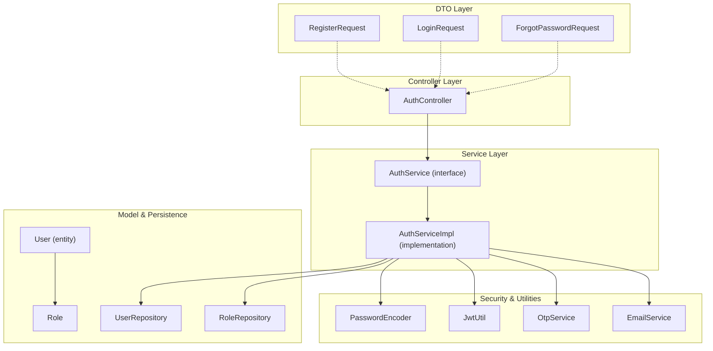
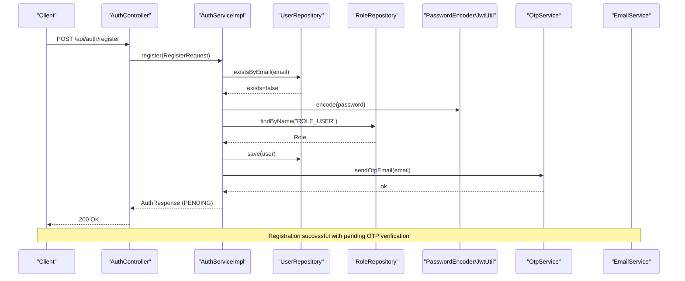
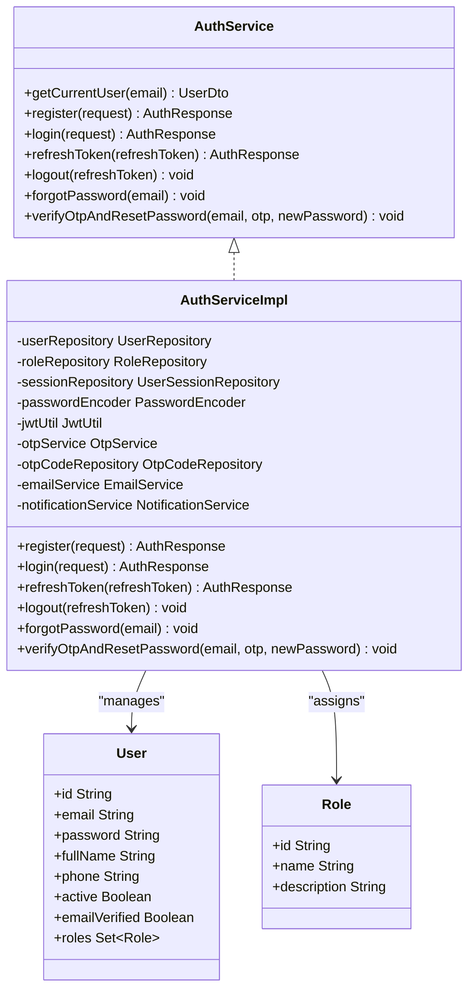
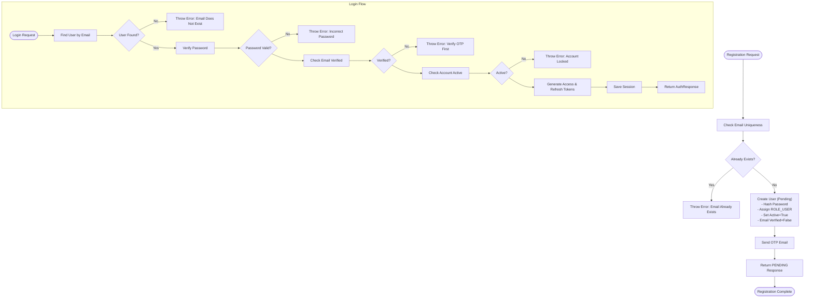
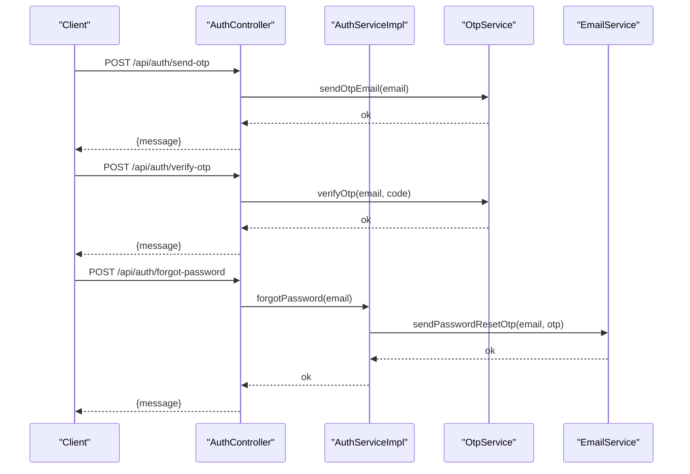
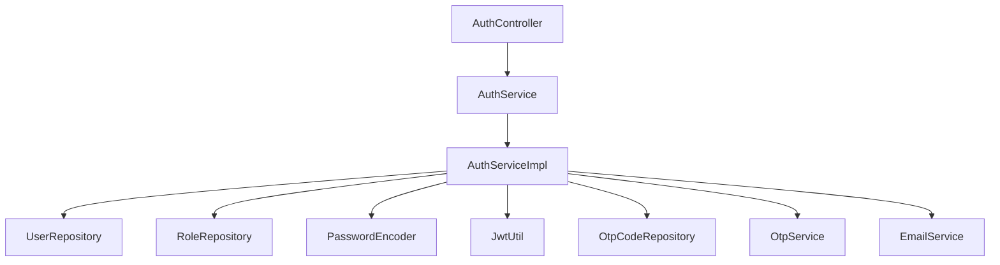

# User Registration & Account Management

<cite>
**Referenced Files in This Document**
- [AuthService.java](file://src/Backend/src/main/java/com/shoppeclone/backend/auth/service/AuthService.java)
- [AuthServiceImpl.java](file://src/Backend/src/main/java/com/shoppeclone/backend/auth/service/impl/AuthServiceImpl.java)
- [AuthController.java](file://src/Backend/src/main/java/com/shoppeclone/backend/auth/controller/AuthController.java)
- [RegisterRequest.java](file://src/Backend/src/main/java/com/shoppeclone/backend/auth/dto/request/RegisterRequest.java)
- [LoginRequest.java](file://src/Backend/src/main/java/com/shoppeclone/backend/auth/dto/request/LoginRequest.java)
- [ForgotPasswordRequest.java](file://src/Backend/src/main/java/com/shoppeclone/backend/auth/dto/request/ForgotPasswordRequest.java)
- [Role.java](file://src/Backend/src/main/java/com/shoppeclone/backend/auth/model/Role.java)
- [UserRepository.java](file://src/Backend/src/main/java/com/shoppeclone/backend/auth/repository/UserRepository.java)
</cite>

## Table of Contents
1. [Introduction](#introduction)
2. [Project Structure](#project-structure)
3. [Core Components](#core-components)
4. [Architecture Overview](#architecture-overview)
5. [Detailed Component Analysis](#detailed-component-analysis)
6. [Dependency Analysis](#dependency-analysis)
7. [Performance Considerations](#performance-considerations)
8. [Troubleshooting Guide](#troubleshooting-guide)
9. [Conclusion](#conclusion)

## Introduction
This document explains the user registration and account management functionality implemented in the backend. It covers the authentication service, user registration flow, login validation, account lifecycle management, DTO structures, password hashing, user validation rules, role assignment, account status management, email verification requirements, and password security practices. The goal is to provide both technical depth and practical guidance for developers and stakeholders.

## Project Structure
The authentication subsystem is organized around a clean separation of concerns:
- Controller layer exposes REST endpoints for authentication operations
- Service layer implements business logic for registration, login, token refresh, logout, and password reset
- DTO layer defines validated request/response structures
- Model and repository layers manage domain entities and persistence
- Security utilities handle JWT generation and password encoding

**Diagram sources**
- [AuthController.java:22-98](file://src/Backend/src/main/java/com/shoppeclone/backend/auth/controller/AuthController.java#L22-L98)
- [AuthService.java:8-21](file://src/Backend/src/main/java/com/shoppeclone/backend/auth/service/AuthService.java#L8-L21)
- [AuthServiceImpl.java:31-294](file://src/Backend/src/main/java/com/shoppeclone/backend/auth/service/impl/AuthServiceImpl.java#L31-L294)
- [RegisterRequest.java:8-24](file://src/Backend/src/main/java/com/shoppeclone/backend/auth/dto/request/RegisterRequest.java#L8-L24)
- [LoginRequest.java:7-15](file://src/Backend/src/main/java/com/shoppeclone/backend/auth/dto/request/LoginRequest.java#L7-L15)
- [ForgotPasswordRequest.java:7-14](file://src/Backend/src/main/java/com/shoppeclone/backend/auth/dto/request/ForgotPasswordRequest.java#L7-L14)
- [Role.java:8-18](file://src/Backend/src/main/java/com/shoppeclone/backend/auth/model/Role.java#L8-L18)
- [UserRepository.java:7-15](file://src/Backend/src/main/java/com/shoppeclone/backend/auth/repository/UserRepository.java#L7-L15)

**Section sources**
- [AuthController.java:22-98](file://src/Backend/src/main/java/com/shoppeclone/backend/auth/controller/AuthController.java#L22-L98)
- [AuthService.java:8-21](file://src/Backend/src/main/java/com/shoppeclone/backend/auth/service/AuthService.java#L8-L21)
- [AuthServiceImpl.java:31-294](file://src/Backend/src/main/java/com/shoppeclone/backend/auth/service/impl/AuthServiceImpl.java#L31-L294)

## Core Components
This section documents the primary building blocks for user registration and account management.

- Authentication Controller
  - Exposes endpoints for registration, login, token refresh, logout, OTP operations, and password reset
  - Uses validation annotations on DTOs and delegates business logic to the service layer

- Authentication Service Interface and Implementation
  - Defines methods for user registration, login, token refresh, logout, forgot password, and OTP-based password reset
  - Implements password hashing, role assignment, session management, and email verification gating

- Request DTOs
  - RegisterRequest: Validates email format, password strength, full name, and phone number
  - LoginRequest: Validates email and password presence
  - ForgotPasswordRequest: Validates email presence and format

- Domain Models and Repositories
  - Role entity with indexed unique name
  - UserRepository with email lookup and existence checks

**Section sources**
- [AuthController.java:22-98](file://src/Backend/src/main/java/com/shoppeclone/backend/auth/controller/AuthController.java#L22-L98)
- [AuthService.java:8-21](file://src/Backend/src/main/java/com/shoppeclone/backend/auth/service/AuthService.java#L8-L21)
- [AuthServiceImpl.java:31-294](file://src/Backend/src/main/java/com/shoppeclone/backend/auth/service/impl/AuthServiceImpl.java#L31-L294)
- [RegisterRequest.java:8-24](file://src/Backend/src/main/java/com/shoppeclone/backend/auth/dto/request/RegisterRequest.java#L8-L24)
- [LoginRequest.java:7-15](file://src/Backend/src/main/java/com/shoppeclone/backend/auth/dto/request/LoginRequest.java#L7-L15)
- [ForgotPasswordRequest.java:7-14](file://src/Backend/src/main/java/com/shoppeclone/backend/auth/dto/request/ForgotPasswordRequest.java#L7-L14)
- [Role.java:8-18](file://src/Backend/src/main/java/com/shoppeclone/backend/auth/model/Role.java#L8-L18)
- [UserRepository.java:7-15](file://src/Backend/src/main/java/com/shoppeclone/backend/auth/repository/UserRepository.java#L7-L15)

## Architecture Overview
The authentication flow follows a layered architecture with explicit boundaries between presentation, business logic, persistence, and external services.

**Diagram sources**
- [AuthController.java:36-39](file://src/Backend/src/main/java/com/shoppeclone/backend/auth/controller/AuthController.java#L36-L39)
- [AuthServiceImpl.java:45-95](file://src/Backend/src/main/java/com/shoppeclone/backend/auth/service/impl/AuthServiceImpl.java#L45-L95)
- [UserRepository.java:8-10](file://src/Backend/src/main/java/com/shoppeclone/backend/auth/repository/UserRepository.java#L8-L10)
- [Role.java:14](file://src/Backend/src/main/java/com/shoppeclone/backend/auth/model/Role.java#L14)

## Detailed Component Analysis

### Authentication Service Implementation
The service orchestrates user registration, login validation, token lifecycle, and password reset with robust error handling and security practices.

Key responsibilities:
- Registration: validate uniqueness, hash password, assign default role, persist pending user, and trigger OTP delivery
- Login: validate credentials, enforce email verification and account activity, generate tokens, and record sessions
- Token Refresh: validate refresh tokens, ensure account verification, rotate tokens, and manage sessions
- Logout: invalidate refresh token sessions
- Password Reset: generate and validate OTP codes, enforce expiration, and update hashed passwords

**Diagram sources**
- [AuthService.java:8-21](file://src/Backend/src/main/java/com/shoppeclone/backend/auth/service/AuthService.java#L8-L21)
- [AuthServiceImpl.java:31-294](file://src/Backend/src/main/java/com/shoppeclone/backend/auth/service/impl/AuthServiceImpl.java#L31-L294)
- [Role.java:8-18](file://src/Backend/src/main/java/com/shoppeclone/backend/auth/model/Role.java#L8-L18)

**Section sources**
- [AuthServiceImpl.java:31-294](file://src/Backend/src/main/java/com/shoppeclone/backend/auth/service/impl/AuthServiceImpl.java#L31-L294)

### RegisterRequest DTO Structure and Validation Rules
The registration DTO enforces strict input validation to ensure secure and consistent user data.

Validation rules:
- Email: required, must be a valid email format
- Password: required, minimum length of 8 characters, must contain at least one uppercase letter, one lowercase letter, and one digit
- Full Name: required
- Phone: optional pattern requiring 10 digits and starting with 0

These constraints prevent weak credentials and malformed contact information during registration.

**Section sources**
- [RegisterRequest.java:8-24](file://src/Backend/src/main/java/com/shoppeclone/backend/auth/dto/request/RegisterRequest.java#L8-L24)

### Password Hashing Mechanisms
Password security is implemented using a password encoder to hash credentials before storage. During registration, the plaintext password is encoded and stored, ensuring that only hashed values are persisted. Login validation compares the provided password against the stored hash using a secure comparison method.

Best practices applied:
- Never store plaintext passwords
- Use a strong, well-vetted password encoding strategy
- Enforce strong password policies at the DTO level

**Section sources**
- [AuthServiceImpl.java:59](file://src/Backend/src/main/java/com/shoppeclone/backend/auth/service/impl/AuthServiceImpl.java#L59)
- [AuthServiceImpl.java:107](file://src/Backend/src/main/java/com/shoppeclone/backend/auth/service/impl/AuthServiceImpl.java#L107)

### User Validation Rules and Account Lifecycle
Account lifecycle stages:
- Registration: user is created with pending email verification and default role assignment
- Email Verification: login attempts are blocked until the user verifies their email
- Active Status: accounts are marked active upon registration; login requires active status
- Session Management: successful login generates access and refresh tokens and persists a session
- Token Refresh: refresh tokens are validated, sessions rotated, and verification enforced
- Logout: removes the refresh token session
- Password Reset: OTP-based reset with expiration enforcement

**Diagram sources**
- [AuthServiceImpl.java:45-95](file://src/Backend/src/main/java/com/shoppeclone/backend/auth/service/impl/AuthServiceImpl.java#L45-L95)
- [AuthServiceImpl.java:97-137](file://src/Backend/src/main/java/com/shoppeclone/backend/auth/service/impl/AuthServiceImpl.java#L97-L137)

**Section sources**
- [AuthServiceImpl.java:45-95](file://src/Backend/src/main/java/com/shoppeclone/backend/auth/service/impl/AuthServiceImpl.java#L45-L95)
- [AuthServiceImpl.java:97-137](file://src/Backend/src/main/java/com/shoppeclone/backend/auth/service/impl/AuthServiceImpl.java#L97-L137)

### Role Assignment and Account Status Management
Role assignment:
- New users are assigned the default role ROLE_USER upon successful registration
- Role retrieval uses a repository lookup by name with fallback handling

Account status management:
- Users are created with active status enabled
- Login and refresh token operations enforce that the account remains active
- Email verification acts as a prerequisite for login and token refresh

**Section sources**
- [AuthServiceImpl.java:67-72](file://src/Backend/src/main/java/com/shoppeclone/backend/auth/service/impl/AuthServiceImpl.java#L67-L72)
- [AuthServiceImpl.java:118-122](file://src/Backend/src/main/java/com/shoppeclone/backend/auth/service/impl/AuthServiceImpl.java#L118-L122)
- [AuthServiceImpl.java:154-157](file://src/Backend/src/main/java/com/shoppeclone/backend/auth/service/impl/AuthServiceImpl.java#L154-L157)

### Email Verification Requirements and OTP Operations
Email verification is mandatory before login or token refresh:
- Registration creates a pending user and triggers OTP delivery
- Login rejects unverified users with a specific error
- Refresh token requests also require verified accounts

OTP operations exposed via controller endpoints:
- Send OTP for general verification
- Verify OTP for general verification
- Check OTP validity for password reset flow
- Forgot password initiates OTP-based reset process

**Diagram sources**
- [AuthController.java:57-83](file://src/Backend/src/main/java/com/shoppeclone/backend/auth/controller/AuthController.java#L57-L83)
- [AuthServiceImpl.java:210-253](file://src/Backend/src/main/java/com/shoppeclone/backend/auth/service/impl/AuthServiceImpl.java#L210-L253)

**Section sources**
- [AuthController.java:57-83](file://src/Backend/src/main/java/com/shoppeclone/backend/auth/controller/AuthController.java#L57-L83)
- [AuthServiceImpl.java:97-137](file://src/Backend/src/main/java/com/shoppeclone/backend/auth/service/impl/AuthServiceImpl.java#L97-L137)
- [AuthServiceImpl.java:210-253](file://src/Backend/src/main/java/com/shoppeclone/backend/auth/service/impl/AuthServiceImpl.java#L210-L253)

### Password Security Practices and Data Protection Measures
Security measures implemented:
- Strong password policy enforced at the DTO level (length, character variety)
- Passwords are hashed using a secure encoder before persistence
- Login and refresh token operations enforce email verification and active account status
- OTP-based password reset ensures controlled credential updates with expiration
- Sessions are stored with expiration and securely rotated on refresh

Data protection:
- Minimal user data exposure in DTOs returned to clients
- Email verification prevents unauthorized access until verification completes
- OTP codes are time-bound and marked as used after successful reset

**Section sources**
- [RegisterRequest.java:14-17](file://src/Backend/src/main/java/com/shoppeclone/backend/auth/dto/request/RegisterRequest.java#L14-L17)
- [AuthServiceImpl.java:59](file://src/Backend/src/main/java/com/shoppeclone/backend/auth/service/impl/AuthServiceImpl.java#L59)
- [AuthServiceImpl.java:112-122](file://src/Backend/src/main/java/com/shoppeclone/backend/auth/service/impl/AuthServiceImpl.java#L112-L122)
- [AuthServiceImpl.java:255-286](file://src/Backend/src/main/java/com/shoppeclone/backend/auth/service/impl/AuthServiceImpl.java#L255-L286)

## Dependency Analysis
The authentication service depends on repositories, security utilities, and external services for OTP and email delivery. The controller coordinates request handling and delegates to the service layer.

**Diagram sources**
- [AuthController.java:28-29](file://src/Backend/src/main/java/com/shoppeclone/backend/auth/controller/AuthController.java#L28-L29)
- [AuthServiceImpl.java:35-43](file://src/Backend/src/main/java/com/shoppeclone/backend/auth/service/impl/AuthServiceImpl.java#L35-L43)

**Section sources**
- [AuthController.java:28-29](file://src/Backend/src/main/java/com/shoppeclone/backend/auth/controller/AuthController.java#L28-L29)
- [AuthServiceImpl.java:35-43](file://src/Backend/src/main/java/com/shoppeclone/backend/auth/service/impl/AuthServiceImpl.java#L35-L43)

## Performance Considerations
- Password hashing is computationally intensive; ensure the encoder configuration is tuned appropriately
- OTP generation uses a simple random number generator; consider cryptographic randomness for production environments
- Session storage and token validation should be optimized for frequent refresh operations
- Email delivery reliability impacts user experience; implement retry and monitoring for OTP/email failures

## Troubleshooting Guide
Common issues and resolutions:
- Registration fails with "Email already exists": Ensure the email is unique before attempting registration
- Login fails with "Verify OTP before logging in": Prompt the user to complete email verification via OTP
- Login fails with "Account is locked": Confirm the user account is active and not suspended
- Refresh token fails with "Account not verified via OTP": Require the user to verify their email before token refresh
- Password reset fails with "Invalid or used OTP code": Confirm OTP validity, expiration, and usage status

Operational tips:
- Monitor OTP delivery failures and provide manual resend capabilities
- Log detailed error messages for debugging while avoiding sensitive data disclosure
- Implement rate limiting for OTP requests to prevent abuse

**Section sources**
- [AuthServiceImpl.java:50-54](file://src/Backend/src/main/java/com/shoppeclone/backend/auth/service/impl/AuthServiceImpl.java#L50-L54)
- [AuthServiceImpl.java:112-116](file://src/Backend/src/main/java/com/shoppeclone/backend/auth/service/impl/AuthServiceImpl.java#L112-L116)
- [AuthServiceImpl.java:118-122](file://src/Backend/src/main/java/com/shoppeclone/backend/auth/service/impl/AuthServiceImpl.java#L118-L122)
- [AuthServiceImpl.java:154-157](file://src/Backend/src/main/java/com/shoppeclone/backend/auth/service/impl/AuthServiceImpl.java#L154-L157)
- [AuthServiceImpl.java:265-273](file://src/Backend/src/main/java/com/shoppeclone/backend/auth/service/impl/AuthServiceImpl.java#L265-L273)

## Conclusion
The authentication subsystem provides a secure, extensible foundation for user registration and account management. By enforcing strong validation rules, mandatory email verification, robust password hashing, and OTP-based operations, it ensures both usability and security. The layered architecture supports maintainability and future enhancements, such as additional role types, advanced session controls, and expanded verification channels.