# Common Utilities & Configuration

<cite>
**Referenced Files in This Document**
- [EmailService.java](file://src/Backend/src/main/java/com/shoppeclone/backend/common/service/EmailService.java)
- [CloudinaryService.java](file://src/Backend/src/main/java/com/shoppeclone/backend/common/service/CloudinaryService.java)
- [CsvGenerator.java](file://src/Backend/src/main/java/com/shoppeclone/backend/common/utils/CsvGenerator.java)
- [CloudinaryConfig.java](file://src/Backend/src/main/java/com/shoppeclone/backend/common/config/CloudinaryConfig.java)
- [CorsConfig.java](file://src/Backend/src/main/java/com/shoppeclone/backend/common/config/CorsConfig.java)
- [DataInitializer.java](file://src/Backend/src/main/java/com/shoppeclone/backend/common/config/DataInitializer.java)
- [RoleFixer.java](file://src/Backend/src/main/java/com/shoppeclone/backend/common/config/RoleFixer.java)
- [TimezoneConfig.java](file://src/Backend/src/main/java/com/shoppeclone/backend/common/config/TimezoneConfig.java)
- [DebugController.java](file://src/Backend/src/main/java/com/shoppeclone/backend/common/controller/DebugController.java)
- [UploadController.java](file://src/Backend/src/main/java/com/shoppeclone/backend/common/controller/UploadController.java)
- [application.properties](file://src/Backend/src/main/resources/application.properties)
</cite>

## Table of Contents
1. [Introduction](#introduction)
2. [Project Structure](#project-structure)
3. [Core Components](#core-components)
4. [Architecture Overview](#architecture-overview)
5. [Detailed Component Analysis](#detailed-component-analysis)
6. [Dependency Analysis](#dependency-analysis)
7. [Performance Considerations](#performance-considerations)
8. [Troubleshooting Guide](#troubleshooting-guide)
9. [Conclusion](#conclusion)

## Introduction
This section documents the common utilities and configuration system that underpins shared services, cross-cutting concerns, and foundational infrastructure across the platform. It covers:
- Shared services for email delivery and media upload with fallback behavior
- Configuration management for external integrations (SMTP, Cloudinary, CORS, JWT, OAuth)
- Utility functions for data generation and debugging
- Cross-cutting concerns such as timezone enforcement and role normalization
- Practical usage patterns and integration points for developers

The goal is to provide both conceptual overviews for beginners and precise technical details for experienced developers, with diagrams where appropriate to illustrate architecture and integration patterns.

## Project Structure
The common utilities and configuration reside primarily under the common package, organized by responsibility:
- config: Spring configuration beans and bootstrapping helpers
- service: Shared services for email and media
- utils: General-purpose utilities
- controller: Minimal endpoints for debugging and upload testing

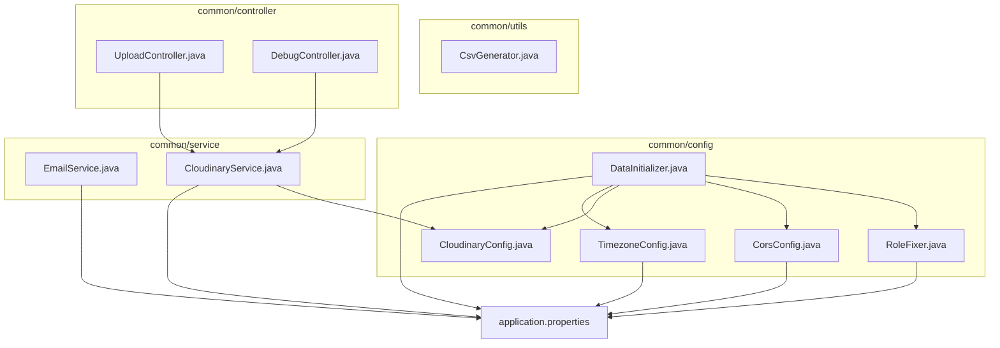

**Diagram sources**
- [DataInitializer.java:24-203](file://src/Backend/src/main/java/com/shoppeclone/backend/common/config/DataInitializer.java#L24-L203)
- [RoleFixer.java:16-90](file://src/Backend/src/main/java/com/shoppeclone/backend/common/config/RoleFixer.java#L16-L90)
- [CorsConfig.java:11-30](file://src/Backend/src/main/java/com/shoppeclone/backend/common/config/CorsConfig.java#L11-L30)
- [CloudinaryConfig.java:9-30](file://src/Backend/src/main/java/com/shoppeclone/backend/common/config/CloudinaryConfig.java#L9-L30)
- [TimezoneConfig.java:14-27](file://src/Backend/src/main/java/com/shoppeclone/backend/common/config/TimezoneConfig.java#L14-L27)
- [EmailService.java:8-197](file://src/Backend/src/main/java/com/shoppeclone/backend/common/service/EmailService.java#L8-L197)
- [CloudinaryService.java:20-137](file://src/Backend/src/main/java/com/shoppeclone/backend/common/service/CloudinaryService.java#L20-L137)
- [CsvGenerator.java:9-79](file://src/Backend/src/main/java/com/shoppeclone/backend/common/utils/CsvGenerator.java#L9-L79)
- [UploadController.java:12-34](file://src/Backend/src/main/java/com/shoppeclone/backend/common/controller/UploadController.java#L12-L34)
- [DebugController.java:16-58](file://src/Backend/src/main/java/com/shoppeclone/backend/common/controller/DebugController.java#L16-L58)
- [application.properties:1-114](file://src/Backend/src/main/resources/application.properties#L1-L114)

**Section sources**
- [application.properties:1-114](file://src/Backend/src/main/resources/application.properties#L1-L114)

## Core Components
This section introduces the primary shared components and their responsibilities.

- EmailService: Provides OTP and transactional emails via Spring Mail, with subject and body templates for various scenarios (verification, password reset, login alerts, shop approvals/rejections, flash sale updates, and campaign invitations).
- CloudinaryService: Handles image uploads with Cloudinary as the primary provider and falls back to local storage when Cloudinary is unavailable. Includes validation for file size/type and deletion support by public ID.
- CloudinaryConfig: Registers a Cloudinary bean configured from environment variables.
- CorsConfig: Defines global CORS policy for development and testing.
- DataInitializer: Seeds roles, categories, payment methods, shipping providers, and optionally creates a default flash sale campaign and admin user during application startup.
- RoleFixer: Ensures shop owners have the ROLE_SELLER permission by scanning shops and users at startup.
- TimezoneConfig: Forces JVM timezone to Asia/Ho_Chi_Minh at startup to align all LocalDateTime operations with Vietnam time.
- UploadController: Exposes a minimal endpoint to upload images to Cloudinary with optional folder targeting.
- DebugController: Provides debugging endpoints for product category fixing and listing associations.
- CsvGenerator: Generates synthetic CSV datasets for users (including dirty data) for testing and load scenarios.

Practical usage patterns:
- Inject EmailService wherever notifications are needed; call the appropriate method for the scenario.
- Inject CloudinaryService for any image upload; handle exceptions for invalid files or upload failures.
- Configure environment variables for SMTP, Cloudinary, and JWT as per application.properties.
- Use UploadController for quick testing of image uploads in development.
- Use DebugController endpoints to fix product categories and inspect associations.

**Section sources**
- [EmailService.java:8-197](file://src/Backend/src/main/java/com/shoppeclone/backend/common/service/EmailService.java#L8-L197)
- [CloudinaryService.java:20-137](file://src/Backend/src/main/java/com/shoppeclone/backend/common/service/CloudinaryService.java#L20-L137)
- [CloudinaryConfig.java:9-30](file://src/Backend/src/main/java/com/shoppeclone/backend/common/config/CloudinaryConfig.java#L9-L30)
- [CorsConfig.java:11-30](file://src/Backend/src/main/java/com/shoppeclone/backend/common/config/CorsConfig.java#L11-L30)
- [DataInitializer.java:24-203](file://src/Backend/src/main/java/com/shoppeclone/backend/common/config/DataInitializer.java#L24-L203)
- [RoleFixer.java:16-90](file://src/Backend/src/main/java/com/shoppeclone/backend/common/config/RoleFixer.java#L16-L90)
- [TimezoneConfig.java:14-27](file://src/Backend/src/main/java/com/shoppeclone/backend/common/config/TimezoneConfig.java#L14-L27)
- [UploadController.java:12-34](file://src/Backend/src/main/java/com/shoppeclone/backend/common/controller/UploadController.java#L12-L34)
- [DebugController.java:16-58](file://src/Backend/src/main/java/com/shoppeclone/backend/common/controller/DebugController.java#L16-L58)
- [CsvGenerator.java:9-79](file://src/Backend/src/main/java/com/shoppeclone/backend/common/utils/CsvGenerator.java#L9-L79)

## Architecture Overview
The common utilities integrate with Spring Boot’s dependency injection and configuration system. External services are configured via environment variables and application.properties. The upload pipeline prioritizes Cloudinary with a robust fallback to local storage. Email delivery leverages Spring Mail with Gmail SMTP settings.

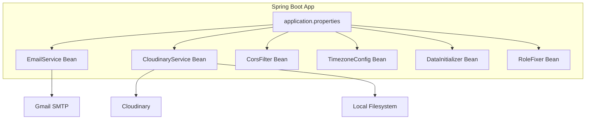

**Diagram sources**
- [application.properties:1-114](file://src/Backend/src/main/resources/application.properties#L1-L114)
- [EmailService.java:8-197](file://src/Backend/src/main/java/com/shoppeclone/backend/common/service/EmailService.java#L8-L197)
- [CloudinaryService.java:20-137](file://src/Backend/src/main/java/com/shoppeclone/backend/common/service/CloudinaryService.java#L20-L137)
- [CloudinaryConfig.java:9-30](file://src/Backend/src/main/java/com/shoppeclone/backend/common/config/CloudinaryConfig.java#L9-L30)
- [CorsConfig.java:11-30](file://src/Backend/src/main/java/com/shoppeclone/backend/common/config/CorsConfig.java#L11-L30)
- [TimezoneConfig.java:14-27](file://src/Backend/src/main/java/com/shoppeclone/backend/common/config/TimezoneConfig.java#L14-L27)
- [DataInitializer.java:24-203](file://src/Backend/src/main/java/com/shoppeclone/backend/common/config/DataInitializer.java#L24-L203)
- [RoleFixer.java:16-90](file://src/Backend/src/main/java/com/shoppeclone/backend/common/config/RoleFixer.java#L16-L90)

## Detailed Component Analysis

### EmailService
EmailService encapsulates transactional email operations using Spring’s JavaMailSender. It supports:
- OTP delivery for verification and password reset
- Login security alerts
- Shop application approval/rejection notifications
- Welcome messages
- Flash sale registration approval/rejection
- Campaign invitation emails with localized date formatting

Implementation highlights:
- Uses SimpleMailMessage for straightforward text emails
- Reads credentials and SMTP settings from application.properties
- Logs outcomes for operational visibility

Usage pattern:
- Inject EmailService into controllers or services
- Call the appropriate method with recipient, dynamic content, and context-specific parameters

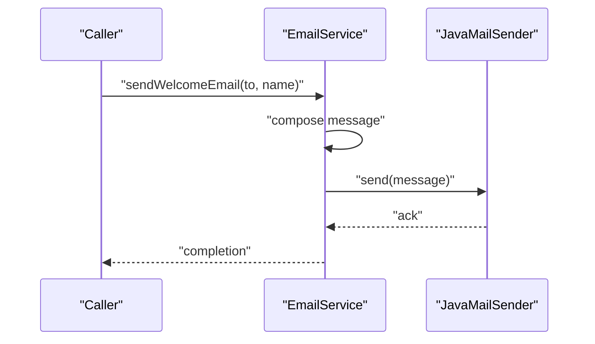

**Diagram sources**
- [EmailService.java:104-119](file://src/Backend/src/main/java/com/shoppeclone/backend/common/service/EmailService.java#L104-L119)

**Section sources**
- [EmailService.java:8-197](file://src/Backend/src/main/java/com/shoppeclone/backend/common/service/EmailService.java#L8-L197)
- [application.properties:70-83](file://src/Backend/src/main/resources/application.properties#L70-L83)

### CloudinaryService
CloudinaryService provides resilient image upload with validation and fallback:
- Validates file emptiness, size (<= 3 MB), and MIME type (image/*)
- Supports specific formats: JPEG, JPG, PNG, WEBP
- Attempts Cloudinary upload; falls back to local storage on failure
- Returns a secure HTTPS URL when available, otherwise a local URL
- Supports deletion by public ID with graceful error handling

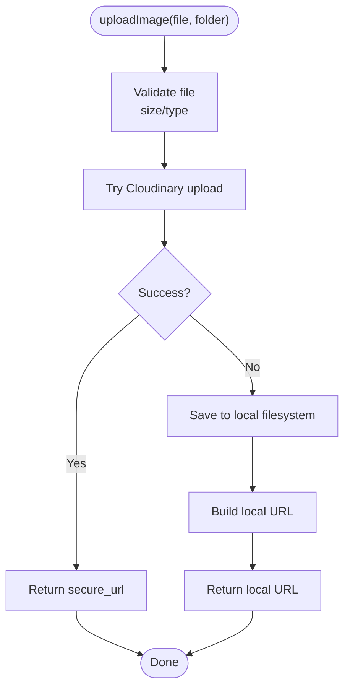

**Diagram sources**
- [CloudinaryService.java:36-88](file://src/Backend/src/main/java/com/shoppeclone/backend/common/service/CloudinaryService.java#L36-L88)

**Section sources**
- [CloudinaryService.java:20-137](file://src/Backend/src/main/java/com/shoppeclone/backend/common/service/CloudinaryService.java#L20-L137)
- [CloudinaryConfig.java:9-30](file://src/Backend/src/main/java/com/shoppeclone/backend/common/config/CloudinaryConfig.java#L9-L30)
- [application.properties:85-89](file://src/Backend/src/main/resources/application.properties#L85-L89)

### UploadController
UploadController exposes a simple endpoint to upload images using CloudinaryService. It:
- Accepts multipart/form-data with file and optional folder
- Delegates to CloudinaryService and returns the resulting URL
- Handles validation errors and IO exceptions

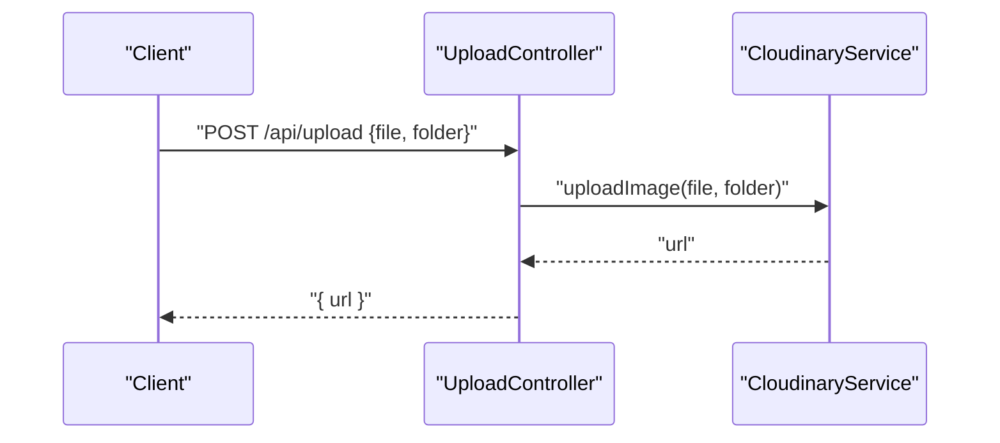

**Diagram sources**
- [UploadController.java:20-32](file://src/Backend/src/main/java/com/shoppeclone/backend/common/controller/UploadController.java#L20-L32)
- [CloudinaryService.java:36-58](file://src/Backend/src/main/java/com/shoppeclone/backend/common/service/CloudinaryService.java#L36-L58)

**Section sources**
- [UploadController.java:12-34](file://src/Backend/src/main/java/com/shoppeclone/backend/common/controller/UploadController.java#L12-L34)

### DataInitializer
DataInitializer seeds foundational data at startup:
- Roles: USER, ADMIN, SELLER
- Categories: Whitelisted set with cleanup of deprecated ones
- Payment methods: COD, CARD, CREDIT_CARD, E_WALLET, MOMO, VNPAY
- Shipping providers: standard, express
- Optional default flash sale campaign creation
- Admin user promotion and cleanup of temporary admin

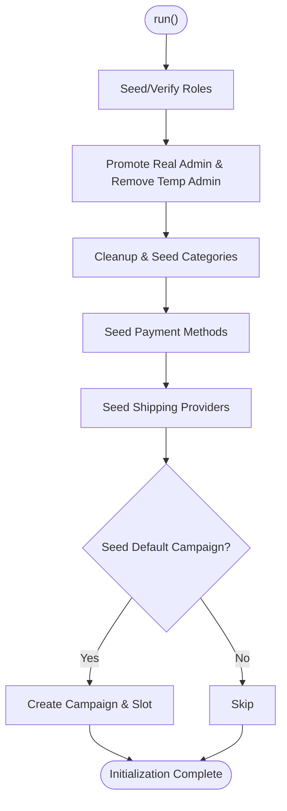

**Diagram sources**
- [DataInitializer.java:37-84](file://src/Backend/src/main/java/com/shoppeclone/backend/common/config/DataInitializer.java#L37-L84)

**Section sources**
- [DataInitializer.java:24-203](file://src/Backend/src/main/java/com/shoppeclone/backend/common/config/DataInitializer.java#L24-L203)

### RoleFixer
RoleFixer ensures shop owners have ROLE_SELLER:
- Creates ROLE_SELLER if missing
- Iterates shops and grants the role to owners who lack it
- Logs inspection of flash sale campaigns for debugging

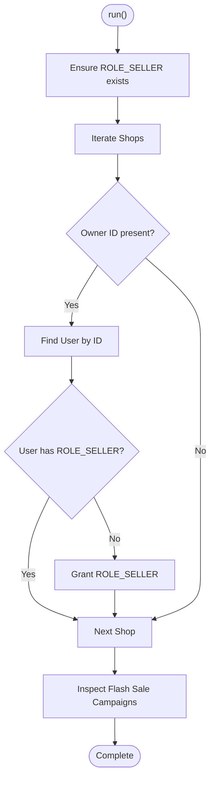

**Diagram sources**
- [RoleFixer.java:25-88](file://src/Backend/src/main/java/com/shoppeclone/backend/common/config/RoleFixer.java#L25-L88)

**Section sources**
- [RoleFixer.java:16-90](file://src/Backend/src/main/java/com/shoppeclone/backend/common/config/RoleFixer.java#L16-L90)

### TimezoneConfig
TimezoneConfig enforces Asia/Ho_Chi_Minh at JVM startup so all LocalDateTime.now() calls reflect Vietnam time consistently.

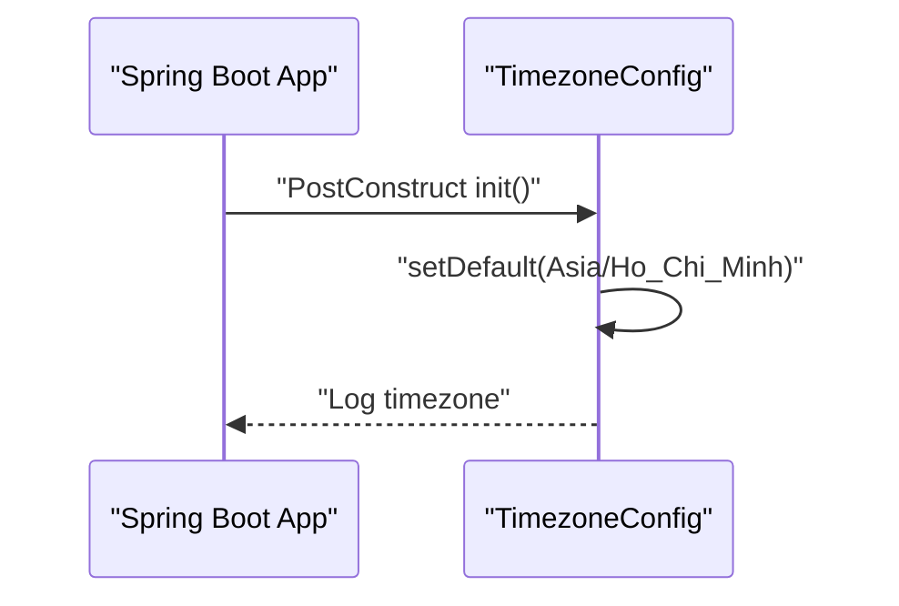

**Diagram sources**
- [TimezoneConfig.java:18-24](file://src/Backend/src/main/java/com/shoppeclone/backend/common/config/TimezoneConfig.java#L18-L24)

**Section sources**
- [TimezoneConfig.java:14-27](file://src/Backend/src/main/java/com/shoppeclone/backend/common/config/TimezoneConfig.java#L14-L27)
- [application.properties:111-114](file://src/Backend/src/main/resources/application.properties#L111-L114)

### DebugController
DebugController offers endpoints for diagnostics:
- List product-category associations
- Fix a product’s category by auto-detection from product name and re-linking to a category

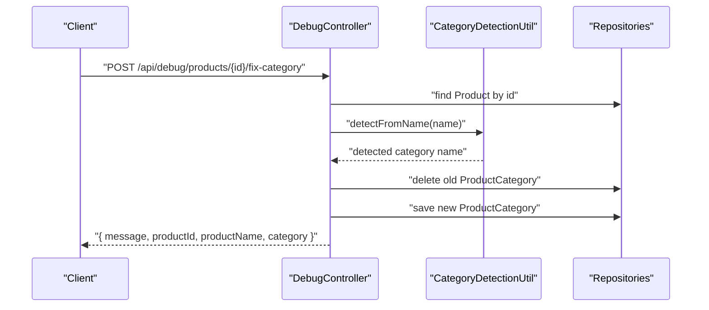

**Diagram sources**
- [DebugController.java:36-56](file://src/Backend/src/main/java/com/shoppeclone/backend/common/controller/DebugController.java#L36-L56)

**Section sources**
- [DebugController.java:16-58](file://src/Backend/src/main/java/com/shoppeclone/backend/common/controller/DebugController.java#L16-L58)

### CsvGenerator
CsvGenerator produces synthetic user data for testing:
- Generates realistic Vietnamese names and emails
- Includes controlled dirty data (duplicates, invalid emails, missing fields)
- Outputs a CSV file suitable for import testing

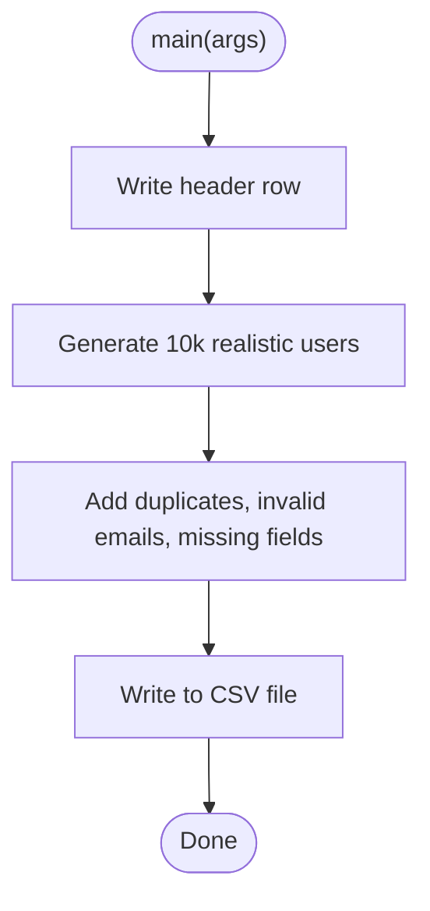

**Diagram sources**
- [CsvGenerator.java:16-77](file://src/Backend/src/main/java/com/shoppeclone/backend/common/utils/CsvGenerator.java#L16-L77)

**Section sources**
- [CsvGenerator.java:9-79](file://src/Backend/src/main/java/com/shoppeclone/backend/common/utils/CsvGenerator.java#L9-L79)

## Dependency Analysis
Shared dependencies and integration points:
- EmailService depends on Spring Mail and application.properties SMTP settings
- CloudinaryService depends on CloudinaryConfig and application.properties Cloudinary credentials
- UploadController depends on CloudinaryService
- DataInitializer and RoleFixer depend on repositories and services for seeding and permission normalization
- TimezoneConfig influences Jackson serialization and all time-sensitive logic

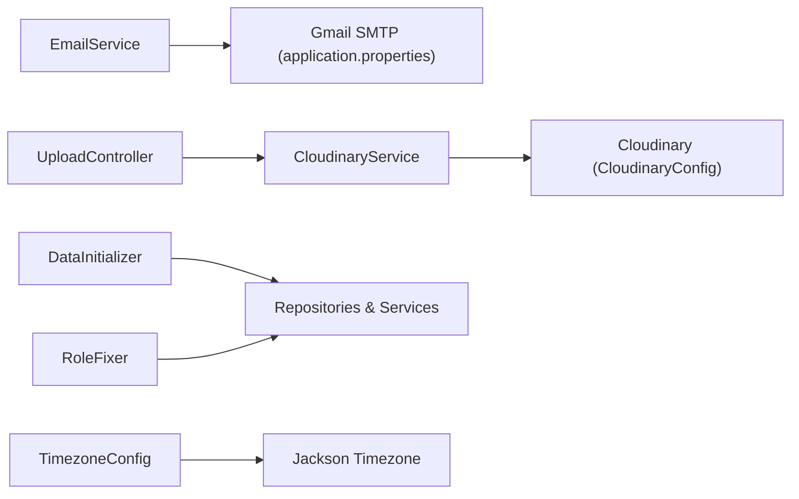

**Diagram sources**
- [EmailService.java:8-197](file://src/Backend/src/main/java/com/shoppeclone/backend/common/service/EmailService.java#L8-L197)
- [CloudinaryService.java:20-137](file://src/Backend/src/main/java/com/shoppeclone/backend/common/service/CloudinaryService.java#L20-L137)
- [CloudinaryConfig.java:9-30](file://src/Backend/src/main/java/com/shoppeclone/backend/common/config/CloudinaryConfig.java#L9-L30)
- [UploadController.java:12-34](file://src/Backend/src/main/java/com/shoppeclone/backend/common/controller/UploadController.java#L12-L34)
- [DataInitializer.java:24-203](file://src/Backend/src/main/java/com/shoppeclone/backend/common/config/DataInitializer.java#L24-L203)
- [RoleFixer.java:16-90](file://src/Backend/src/main/java/com/shoppeclone/backend/common/config/RoleFixer.java#L16-L90)
- [TimezoneConfig.java:14-27](file://src/Backend/src/main/java/com/shoppeclone/backend/common/config/TimezoneConfig.java#L14-L27)
- [application.properties:70-114](file://src/Backend/src/main/resources/application.properties#L70-L114)

**Section sources**
- [application.properties:1-114](file://src/Backend/src/main/resources/application.properties#L1-114)

## Performance Considerations
- Email throughput: Configure Gmail SMTP appropriately and consider rate limits; batch or queue heavy notifications if needed.
- Image uploads: Cloudinary provides CDN benefits; monitor upload latency and fallback local storage for resilience.
- Startup initialization: DataInitializer and RoleFixer run at startup; keep seed data minimal and deterministic to reduce cold-start impact.
- Timezone alignment: Enforcing JVM timezone avoids conversion overhead and prevents time drift across services.
- CORS: Keep allowed origins narrow in production to reduce preflight overhead.

## Troubleshooting Guide
Common issues and resolutions:
- Email delivery failures:
  - Verify MAIL_USERNAME and MAIL_PASSWORD environment variables
  - Confirm SMTP settings in application.properties
  - Check firewall and TLS requirements
- Cloudinary upload failures:
  - Ensure CLOUDINARY_CLOUD_NAME, CLOUDINARY_API_KEY, and CLOUDINARY_API_SECRET are set
  - Confirm network connectivity to Cloudinary endpoints
  - Review fallback behavior to local storage
- CORS errors:
  - Adjust allowed origins in application.properties or enable CorsConfig for development
- Role and permission mismatches:
  - Run RoleFixer to grant ROLE_SELLER to shop owners
  - Verify role creation in DataInitializer
- Timezone discrepancies:
  - Confirm TimezoneConfig is active and Jackson timezone is set
  - Validate server locale and container timezone

**Section sources**
- [application.properties:70-114](file://src/Backend/src/main/resources/application.properties#L70-L114)
- [CloudinaryConfig.java:9-30](file://src/Backend/src/main/java/com/shoppeclone/backend/common/config/CloudinaryConfig.java#L9-L30)
- [CorsConfig.java:11-30](file://src/Backend/src/main/java/com/shoppeclone/backend/common/config/CorsConfig.java#L11-L30)
- [RoleFixer.java:16-90](file://src/Backend/src/main/java/com/shoppeclone/backend/common/config/RoleFixer.java#L16-L90)
- [DataInitializer.java:24-203](file://src/Backend/src/main/java/com/shoppeclone/backend/common/config/DataInitializer.java#L24-L203)
- [TimezoneConfig.java:14-27](file://src/Backend/src/main/java/com/shoppeclone/backend/common/config/TimezoneConfig.java#L14-L27)

## Conclusion
The common utilities and configuration system centralizes cross-cutting concerns essential for reliable operation:
- EmailService and CloudinaryService provide robust, configurable communication and media handling
- DataInitializer and RoleFixer ensure consistent, correct baseline data and permissions
- TimezoneConfig and CORS configuration standardize behavior across the platform
- DebugController and CsvGenerator support development and testing workflows

By leveraging these components and following the documented configuration patterns, teams can maintain consistency, improve reliability, and accelerate development.