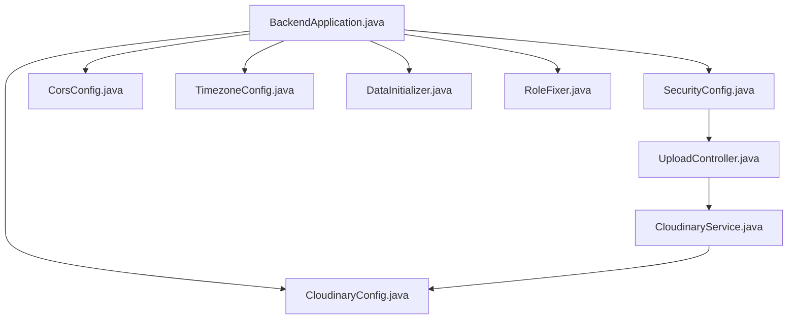
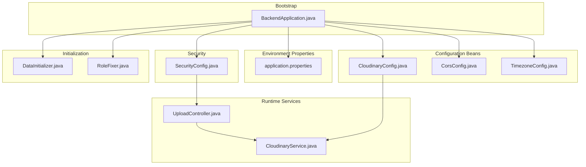
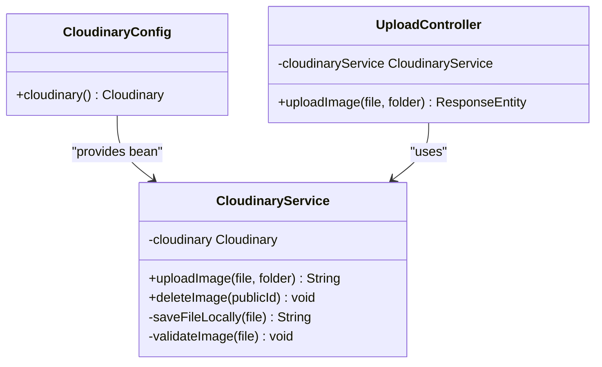
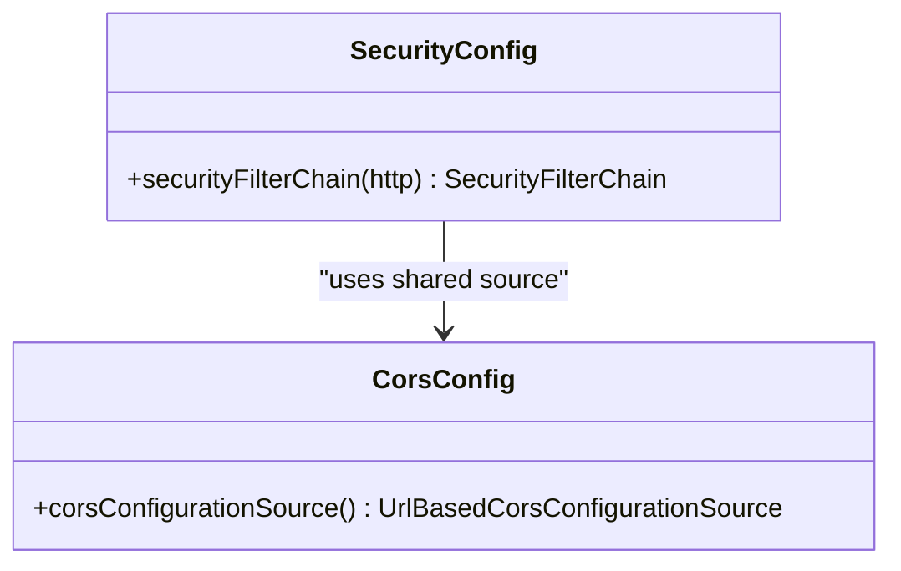
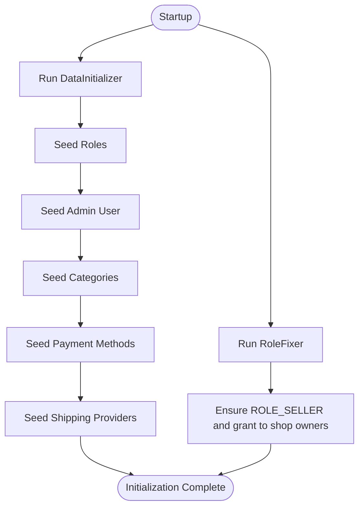
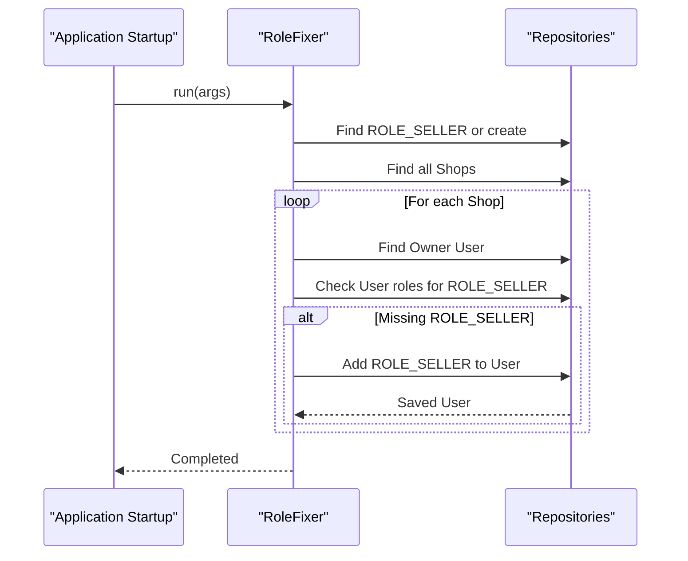
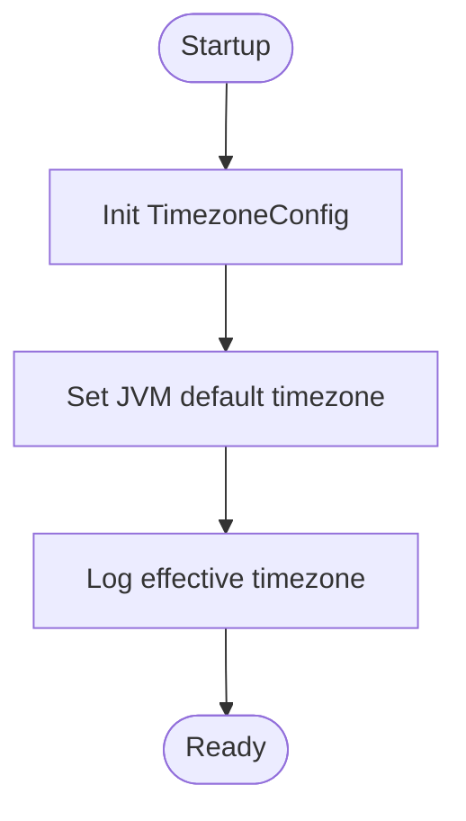
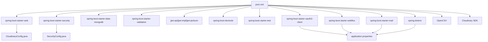

# Configuration Management

<cite>
**Referenced Files in This Document**
- [BackendApplication.java](file://src/backend/src/main/java/com/shoppeclone/backend/BackendApplication.java)
- [application.properties](file://src/backend/src/main/resources/application.properties)
- [CloudinaryConfig.java](file://src/backend/src/main/java/com/shoppeclone/backend/common/config/CloudinaryConfig.java)
- [CorsConfig.java](file://src/backend/src/main/java/com/shoppeclone/backend/common/config/CorsConfig.java)
- [DataInitializer.java](file://src/backend/src/main/java/com/shoppeclone/backend/common/config/DataInitializer.java)
- [RoleFixer.java](file://src/backend/src/main/java/com/shoppeclone/backend/common/config/RoleFixer.java)
- [TimezoneConfig.java](file://src/backend/src/main/java/com/shoppeclone/backend/common/config/TimezoneConfig.java)
- [SecurityConfig.java](file://src/backend/src/main/java/com/shoppeclone/backend/auth/security/SecurityConfig.java)
- [CloudinaryService.java](file://src/backend/src/main/java/com/shoppeclone/backend/common/service/CloudinaryService.java)
- [UploadController.java](file://src/backend/src/main/java/com/shoppeclone/backend/common/controller/UploadController.java)
- [pom.xml](file://src/backend/pom.xml)
</cite>

## Table of Contents
1. [Introduction](#introduction)
2. [Project Structure](#project-structure)
3. [Core Components](#core-components)
4. [Architecture Overview](#architecture-overview)
5. [Detailed Component Analysis](#detailed-component-analysis)
6. [Dependency Analysis](#dependency-analysis)
7. [Performance Considerations](#performance-considerations)
8. [Troubleshooting Guide](#troubleshooting-guide)
9. [Conclusion](#conclusion)

## Introduction
This section documents the Spring Boot configuration management system, focusing on environment-specific settings, cross-cutting concerns, and operational initialization. It explains how configuration beans are created, properties are injected via environment variables, and system-wide policies are enforced. Practical examples demonstrate configuration patterns, dependency injection, and initialization sequences, including Cloudinary image storage, CORS policy setup, data seeding and role management fixes, and timezone handling.

## Project Structure
The configuration system spans several packages:
- Application bootstrap and scheduling enablement
- Common configuration beans for external integrations and environment policies
- Security configuration integrating CORS and JWT-based authentication
- Services and controllers consuming configuration for runtime behavior

**Diagram sources**
- [BackendApplication.java:1-14](file://src/backend/src/main/java/com/shoppeclone/backend/BackendApplication.java#L1-L14)
- [SecurityConfig.java:1-92](file://src/backend/src/main/java/com/shoppeclone/backend/auth/security/SecurityConfig.java#L1-L92)
- [CloudinaryConfig.java:1-30](file://src/backend/src/main/java/com/shoppeclone/backend/common/config/CloudinaryConfig.java#L1-L30)
- [CorsConfig.java:1-30](file://src/backend/src/main/java/com/shoppeclone/backend/common/config/CorsConfig.java#L1-L30)
- [TimezoneConfig.java:1-27](file://src/backend/src/main/java/com/shoppeclone/backend/common/config/TimezoneConfig.java#L1-L27)
- [DataInitializer.java:1-203](file://src/backend/src/main/java/com/shoppeclone/backend/common/config/DataInitializer.java#L1-L203)
- [RoleFixer.java:1-90](file://src/backend/src/main/java/com/shoppeclone/backend/common/config/RoleFixer.java#L1-L90)
- [UploadController.java:1-34](file://src/backend/src/main/java/com/shoppeclone/backend/common/controller/UploadController.java#L1-L34)
- [CloudinaryService.java:1-137](file://src/backend/src/main/java/com/shoppeclone/backend/common/service/CloudinaryService.java#L1-L137)

**Section sources**
- [BackendApplication.java:1-14](file://src/backend/src/main/java/com/shoppeclone/backend/BackendApplication.java#L1-L14)
- [application.properties:1-114](file://src/backend/src/main/resources/application.properties#L1-L114)

## Core Components
- Application bootstrap: Enables scheduling and serves as the primary entry point.
- Environment configuration: Centralized via application.properties with environment variable placeholders.
- Cloudinary integration: Bean-based configuration with property injection and service-level fallback behavior.
- CORS policy: Shared configuration applied globally through Spring Security.
- Initialization pipeline: Command-line runners for roles, categories, payment methods, shipping providers, and admin user management.
- Role management fixer: Post-startup verification and correction of seller permissions.
- Timezone enforcement: JVM-wide timezone initialization at startup.

**Section sources**
- [BackendApplication.java:1-14](file://src/backend/src/main/java/com/shoppeclone/backend/BackendApplication.java#L1-L14)
- [application.properties:1-114](file://src/backend/src/main/resources/application.properties#L1-L114)
- [CloudinaryConfig.java:1-30](file://src/backend/src/main/java/com/shoppeclone/backend/common/config/CloudinaryConfig.java#L1-L30)
- [CorsConfig.java:1-30](file://src/backend/src/main/java/com/shoppeclone/backend/common/config/CorsConfig.java#L1-L30)
- [DataInitializer.java:1-203](file://src/backend/src/main/java/com/shoppeclone/backend/common/config/DataInitializer.java#L1-L203)
- [RoleFixer.java:1-90](file://src/backend/src/main/java/com/shoppeclone/backend/common/config/RoleFixer.java#L1-L90)
- [TimezoneConfig.java:1-27](file://src/backend/src/main/java/com/shoppeclone/backend/common/config/TimezoneConfig.java#L1-L27)

## Architecture Overview
The configuration architecture integrates environment properties, configuration beans, and runtime services. The diagram below maps the primary configuration components and their relationships.

**Diagram sources**
- [BackendApplication.java:1-14](file://src/backend/src/main/java/com/shoppeclone/backend/BackendApplication.java#L1-L14)
- [application.properties:1-114](file://src/backend/src/main/resources/application.properties#L1-L114)
- [CloudinaryConfig.java:1-30](file://src/backend/src/main/java/com/shoppeclone/backend/common/config/CloudinaryConfig.java#L1-L30)
- [CorsConfig.java:1-30](file://src/backend/src/main/java/com/shoppeclone/backend/common/config/CorsConfig.java#L1-L30)
- [TimezoneConfig.java:1-27](file://src/backend/src/main/java/com/shoppeclone/backend/common/config/TimezoneConfig.java#L1-L27)
- [SecurityConfig.java:1-92](file://src/backend/src/main/java/com/shoppeclone/backend/auth/security/SecurityConfig.java#L1-L92)
- [DataInitializer.java:1-203](file://src/backend/src/main/java/com/shoppeclone/backend/common/config/DataInitializer.java#L1-L203)
- [RoleFixer.java:1-90](file://src/backend/src/main/java/com/shoppeclone/backend/common/config/RoleFixer.java#L1-L90)
- [CloudinaryService.java:1-137](file://src/backend/src/main/java/com/shoppeclone/backend/common/service/CloudinaryService.java#L1-L137)
- [UploadController.java:1-34](file://src/backend/src/main/java/com/shoppeclone/backend/common/controller/UploadController.java#L1-L34)

## Detailed Component Analysis

### Cloudinary Image Storage Configuration
Cloudinary is configured as a Spring bean with property injection from environment variables. The service encapsulates upload and deletion operations, with a fallback to local storage when Cloudinary is unavailable.

Key behaviors:
- Property injection for cloud credentials and secure flag
- Upload validation for size, type, and format
- Fallback to local storage with generated URLs
- Deletion attempts with graceful fallback

**Diagram sources**
- [CloudinaryConfig.java:1-30](file://src/backend/src/main/java/com/shoppeclone/backend/common/config/CloudinaryConfig.java#L1-L30)
- [CloudinaryService.java:1-137](file://src/backend/src/main/java/com/shoppeclone/backend/common/service/CloudinaryService.java#L1-L137)
- [UploadController.java:1-34](file://src/backend/src/main/java/com/shoppeclone/backend/common/controller/UploadController.java#L1-L34)

Practical examples:
- Configuration bean creation: [CloudinaryConfig.java:21-28](file://src/backend/src/main/java/com/shoppeclone/backend/common/config/CloudinaryConfig.java#L21-L28)
- Property injection via environment variables: [application.properties:87-89](file://src/backend/src/main/resources/application.properties#L87-L89)
- Upload flow: [UploadController.java:20-32](file://src/backend/src/main/java/com/shoppeclone/backend/common/controller/UploadController.java#L20-L32), [CloudinaryService.java:36-58](file://src/backend/src/main/java/com/shoppeclone/backend/common/service/CloudinaryService.java#L36-L58)

**Section sources**
- [CloudinaryConfig.java:1-30](file://src/backend/src/main/java/com/shoppeclone/backend/common/config/CloudinaryConfig.java#L1-L30)
- [CloudinaryService.java:1-137](file://src/backend/src/main/java/com/shoppeclone/backend/common/service/CloudinaryService.java#L1-L137)
- [UploadController.java:1-34](file://src/backend/src/main/java/com/shoppeclone/backend/common/controller/UploadController.java#L1-L34)
- [application.properties:85-89](file://src/backend/src/main/resources/application.properties#L85-L89)

### CORS Policy Setup
CORS is configured centrally to allow credentials, broad headers, and methods, registering a global configuration source. Security configuration references this shared source.

Key behaviors:
- Allow credentials and wildcard origins for development
- Define exposed and allowed headers and methods
- Register global pattern for all paths

**Diagram sources**
- [CorsConfig.java:14-28](file://src/backend/src/main/java/com/shoppeclone/backend/common/config/CorsConfig.java#L14-L28)
- [SecurityConfig.java:26-34](file://src/backend/src/main/java/com/shoppeclone/backend/auth/security/SecurityConfig.java#L26-L34)

Practical examples:
- Global CORS configuration: [CorsConfig.java:14-28](file://src/backend/src/main/java/com/shoppeclone/backend/common/config/CorsConfig.java#L14-L28)
- Security integration: [SecurityConfig.java:31-33](file://src/backend/src/main/java/com/shoppeclone/backend/auth/security/SecurityConfig.java#L31-L33)

**Section sources**
- [CorsConfig.java:1-30](file://src/backend/src/main/java/com/shoppeclone/backend/common/config/CorsConfig.java#L1-L30)
- [SecurityConfig.java:1-92](file://src/backend/src/main/java/com/shoppeclone/backend/auth/security/SecurityConfig.java#L1-L92)

### Data Initialization Processes
The initialization pipeline seeds roles, categories, payment methods, shipping providers, and admin users. It runs at startup with ordering guarantees and includes optional flash sale campaign seeding.

Key behaviors:
- Role verification and creation
- Admin user promotion and cleanup of temporary accounts
- Category pruning and seeding
- Payment method and shipping provider seeding
- Optional flash sale campaign creation

**Diagram sources**
- [DataInitializer.java:27-49](file://src/backend/src/main/java/com/shoppeclone/backend/common/config/DataInitializer.java#L27-L49)
- [DataInitializer.java:86-110](file://src/backend/src/main/java/com/shoppeclone/backend/common/config/DataInitializer.java#L86-L110)
- [DataInitializer.java:112-151](file://src/backend/src/main/java/com/shoppeclone/backend/common/config/DataInitializer.java#L112-L151)
- [DataInitializer.java:165-184](file://src/backend/src/main/java/com/shoppeclone/backend/common/config/DataInitializer.java#L165-L184)
- [DataInitializer.java:186-202](file://src/backend/src/main/java/com/shoppeclone/backend/common/config/DataInitializer.java#L186-L202)
- [RoleFixer.java:18-68](file://src/backend/src/main/java/com/shoppeclone/backend/common/config/RoleFixer.java#L18-L68)

Practical examples:
- Role creation guard: [DataInitializer.java:153-163](file://src/backend/src/main/java/com/shoppeclone/backend/common/config/DataInitializer.java#L153-L163)
- Admin promotion and cleanup: [DataInitializer.java:86-110](file://src/backend/src/main/java/com/shoppeclone/backend/common/config/DataInitializer.java#L86-L110)
- Category seeding and pruning: [DataInitializer.java:112-151](file://src/backend/src/main/java/com/shoppeclone/backend/common/config/DataInitializer.java#L112-L151)
- Payment method seeding: [DataInitializer.java:165-184](file://src/backend/src/main/java/com/shoppeclone/backend/common/config/DataInitializer.java#L165-L184)
- Shipping provider seeding: [DataInitializer.java:186-202](file://src/backend/src/main/java/com/shoppeclone/backend/common/config/DataInitializer.java#L186-L202)

**Section sources**
- [DataInitializer.java:1-203](file://src/backend/src/main/java/com/shoppeclone/backend/common/config/DataInitializer.java#L1-L203)
- [RoleFixer.java:1-90](file://src/backend/src/main/java/com/shoppeclone/backend/common/config/RoleFixer.java#L1-L90)

### Role Management Fixes
The RoleFixer ensures shop owners have the ROLE_SELLER permission and auto-creates the role if missing. It also logs debug information about flash sale campaigns.

Key behaviors:
- Auto-create ROLE_SELLER if absent
- Iterate shops and grant role to owners lacking it
- Log campaign statuses for diagnostics

**Diagram sources**
- [RoleFixer.java:18-68](file://src/backend/src/main/java/com/shoppeclone/backend/common/config/RoleFixer.java#L18-L68)

Practical examples:
- Role existence check and creation: [RoleFixer.java:29-37](file://src/backend/src/main/java/com/shoppeclone/backend/common/config/RoleFixer.java#L29-L37)
- Granting role to shop owners: [RoleFixer.java:42-61](file://src/backend/src/main/java/com/shoppeclone/backend/common/config/RoleFixer.java#L42-L61)

**Section sources**
- [RoleFixer.java:1-90](file://src/backend/src/main/java/com/shoppeclone/backend/common/config/RoleFixer.java#L1-L90)

### Timezone Handling
The system enforces a JVM-wide timezone at startup to ensure consistent time handling across the application.

Key behaviors:
- Set default JVM timezone to Asia/Ho_Chi_Minh during initialization
- Log the effective timezone for verification

**Diagram sources**
- [TimezoneConfig.java:18-24](file://src/backend/src/main/java/com/shoppeclone/backend/common/config/TimezoneConfig.java#L18-L24)

Practical examples:
- JVM timezone initialization: [TimezoneConfig.java:18-24](file://src/backend/src/main/java/com/shoppeclone/backend/common/config/TimezoneConfig.java#L18-L24)
- Jackson timezone property: [application.properties:113](file://src/backend/src/main/resources/application.properties#L113)

**Section sources**
- [TimezoneConfig.java:1-27](file://src/backend/src/main/java/com/shoppeclone/backend/common/config/TimezoneConfig.java#L1-L27)
- [application.properties:113](file://src/backend/src/main/resources/application.properties#L113)

### Environment Variables and Property Injection
Environment variables are injected into configuration beans and application properties. Examples include Cloudinary credentials, JWT secrets, OAuth client settings, email credentials, and CORS allowances.

Practical examples:
- Cloudinary properties: [application.properties:87-89](file://src/backend/src/main/resources/application.properties#L87-L89)
- JWT secret and expiration: [application.properties:25-31](file://src/backend/src/main/resources/application.properties#L25-L31)
- OAuth client registration: [application.properties:58-67](file://src/backend/src/main/resources/application.properties#L58-L67)
- Email SMTP settings: [application.properties:73-80](file://src/backend/src/main/resources/application.properties#L73-L80)
- CORS overrides: [application.properties:92-95](file://src/backend/src/main/resources/application.properties#L92-L95)

**Section sources**
- [application.properties:1-114](file://src/backend/src/main/resources/application.properties#L1-L114)

### Configuration Patterns and Dependency Injection
- Configuration beans: Defined with @Configuration and @Bean, injected via @Value or constructor-based DI.
- Security filter chain: Integrates CORS configuration and JWT filter chain.
- Service-level fallback: CloudinaryService falls back to local storage when external service is unavailable.
- Initialization sequencing: CommandLineRunner components execute in order with @Order.

Practical examples:
- Bean definition and injection: [CloudinaryConfig.java:21-28](file://src/backend/src/main/java/com/shoppeclone/backend/common/config/CloudinaryConfig.java#L21-L28)
- Security filter chain and CORS: [SecurityConfig.java:26-79](file://src/backend/src/main/java/com/shoppeclone/backend/auth/security/SecurityConfig.java#L26-L79)
- Service fallback behavior: [CloudinaryService.java:40-57](file://src/backend/src/main/java/com/shoppeclone/backend/common/service/CloudinaryService.java#L40-L57)
- Initialization ordering: [DataInitializer.java:25](file://src/backend/src/main/java/com/shoppeclone/backend/common/config/DataInitializer.java#L25)

**Section sources**
- [CloudinaryConfig.java:1-30](file://src/backend/src/main/java/com/shoppeclone/backend/common/config/CloudinaryConfig.java#L1-L30)
- [SecurityConfig.java:1-92](file://src/backend/src/main/java/com/shoppeclone/backend/auth/security/SecurityConfig.java#L1-L92)
- [CloudinaryService.java:1-137](file://src/backend/src/main/java/com/shoppeclone/backend/common/service/CloudinaryService.java#L1-L137)
- [DataInitializer.java:1-203](file://src/backend/src/main/java/com/shoppeclone/backend/common/config/DataInitializer.java#L1-L203)

## Dependency Analysis
External dependencies relevant to configuration include Cloudinary SDK, Spring Security, OAuth2 client, WebFlux for HTTP client needs, mail starter, dotenv for environment loading, and MongoDB starter.

**Diagram sources**
- [pom.xml:23-135](file://src/backend/pom.xml#L23-L135)
- [CloudinaryConfig.java:1-30](file://src/backend/src/main/java/com/shoppeclone/backend/common/config/CloudinaryConfig.java#L1-L30)
- [SecurityConfig.java:1-92](file://src/backend/src/main/java/com/shoppeclone/backend/auth/security/SecurityConfig.java#L1-L92)
- [application.properties:1-114](file://src/backend/src/main/resources/application.properties#L1-L114)

**Section sources**
- [pom.xml:1-173](file://src/backend/pom.xml#L1-L173)

## Performance Considerations
- CORS configuration allows broad headers and methods; restrict origins and headers in production environments.
- Cloudinary fallback to local storage reduces latency but increases local disk usage; monitor storage capacity.
- JVM timezone enforcement avoids per-request timezone computations and ensures consistent time handling.
- Tomcat thread tuning is configured for higher concurrency; validate under load and adjust accept count and timeouts accordingly.
- Circular references are allowed to fix startup errors; investigate underlying circular dependencies for maintainability.

[No sources needed since this section provides general guidance]

## Troubleshooting Guide
Common issues and resolutions:
- Missing Cloudinary configuration: The service logs warnings and falls back to local storage. Verify environment variables and Cloudinary credentials.
  - Evidence: [CloudinaryService.java:52-57](file://src/backend/src/main/java/com/shoppeclone/backend/common/service/CloudinaryService.java#L52-L57)
- CORS preflight failures: Ensure allowed origins, headers, and methods match frontend requests.
  - Evidence: [CorsConfig.java:18-22](file://src/backend/src/main/java/com/shoppeclone/backend/common/config/CorsConfig.java#L18-L22)
- Role-related access denials: Confirm ROLE_SELLER assignment for shop owners via RoleFixer logs.
  - Evidence: [RoleFixer.java:64-68](file://src/backend/src/main/java/com/shoppeclone/backend/common/config/RoleFixer.java#L64-L68)
- Timezone inconsistencies: Verify JVM timezone initialization and Jackson timezone property.
  - Evidence: [TimezoneConfig.java:20-23](file://src/backend/src/main/java/com/shoppeclone/backend/common/config/TimezoneConfig.java#L20-L23), [application.properties:113](file://src/backend/src/main/resources/application.properties#L113)
- Admin user not promoted: Check DataInitializer logs for admin promotion and cleanup steps.
  - Evidence: [DataInitializer.java:86-110](file://src/backend/src/main/java/com/shoppeclone/backend/common/config/DataInitializer.java#L86-L110)

**Section sources**
- [CloudinaryService.java:1-137](file://src/backend/src/main/java/com/shoppeclone/backend/common/service/CloudinaryService.java#L1-L137)
- [CorsConfig.java:1-30](file://src/backend/src/main/java/com/shoppeclone/backend/common/config/CorsConfig.java#L1-L30)
- [RoleFixer.java:1-90](file://src/backend/src/main/java/com/shoppeclone/backend/common/config/RoleFixer.java#L1-L90)
- [TimezoneConfig.java:1-27](file://src/backend/src/main/java/com/shoppeclone/backend/common/config/TimezoneConfig.java#L1-L27)
- [application.properties:113](file://src/backend/src/main/resources/application.properties#L113)
- [DataInitializer.java:1-203](file://src/backend/src/main/java/com/shoppeclone/backend/common/config/DataInitializer.java#L1-L203)

## Conclusion
The configuration management system leverages Spring Boot’s environment-driven configuration, centralized configuration beans, and command-line initialization to deliver a robust, maintainable setup. Cloudinary integration, CORS policy, role management, and timezone handling are implemented with clear separation of concerns and fallback strategies. Production deployments should tighten CORS, validate environment variables, and monitor resource usage while preserving the initialization pipeline for reliable system bootstrapping.