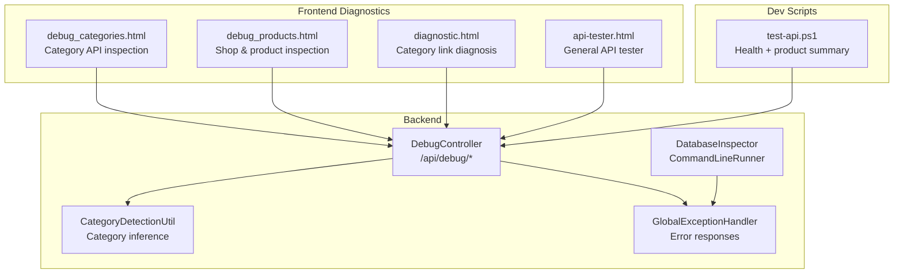
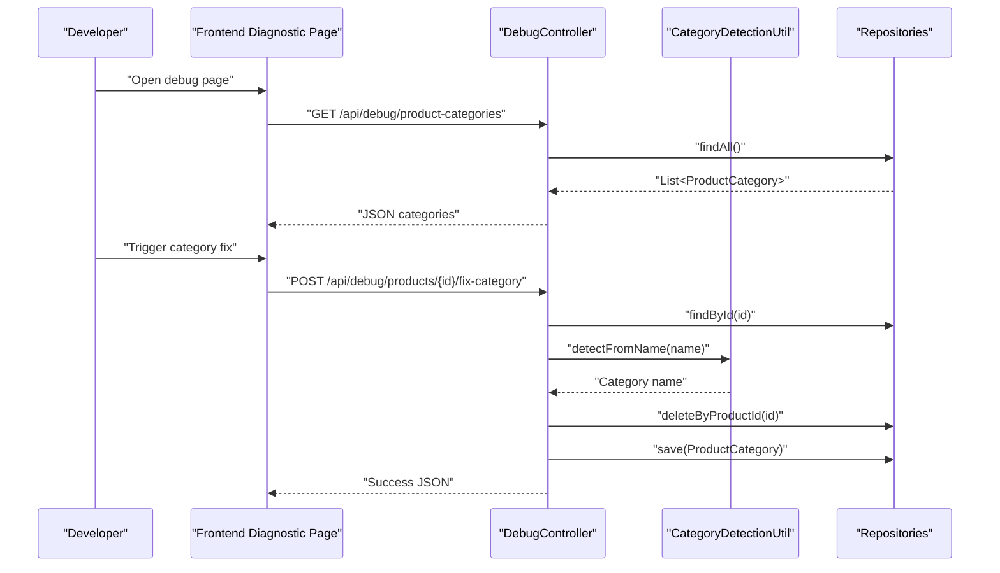
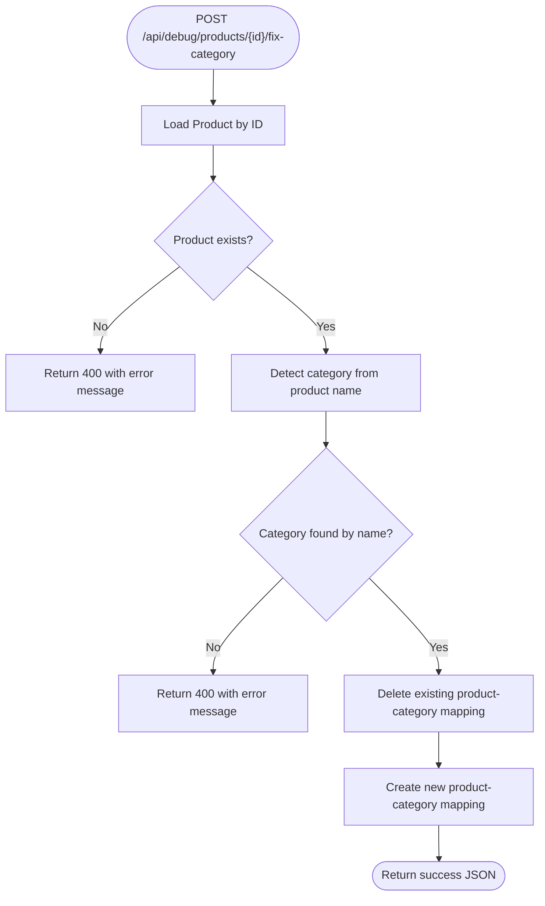
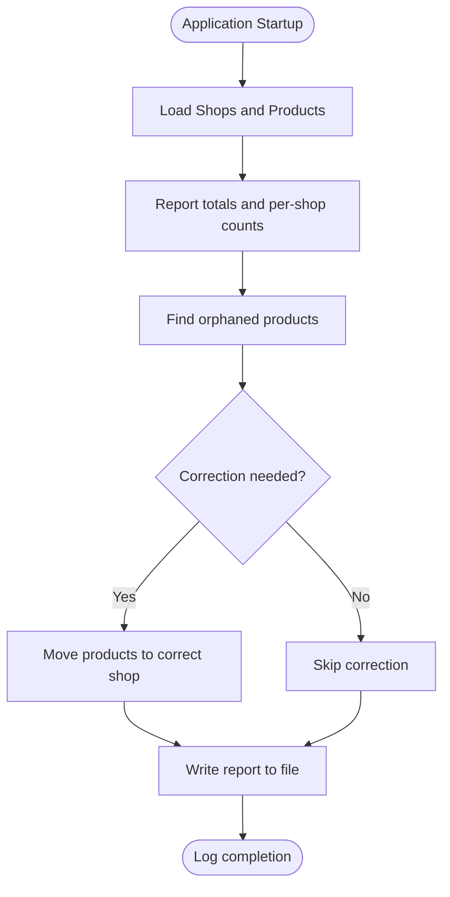
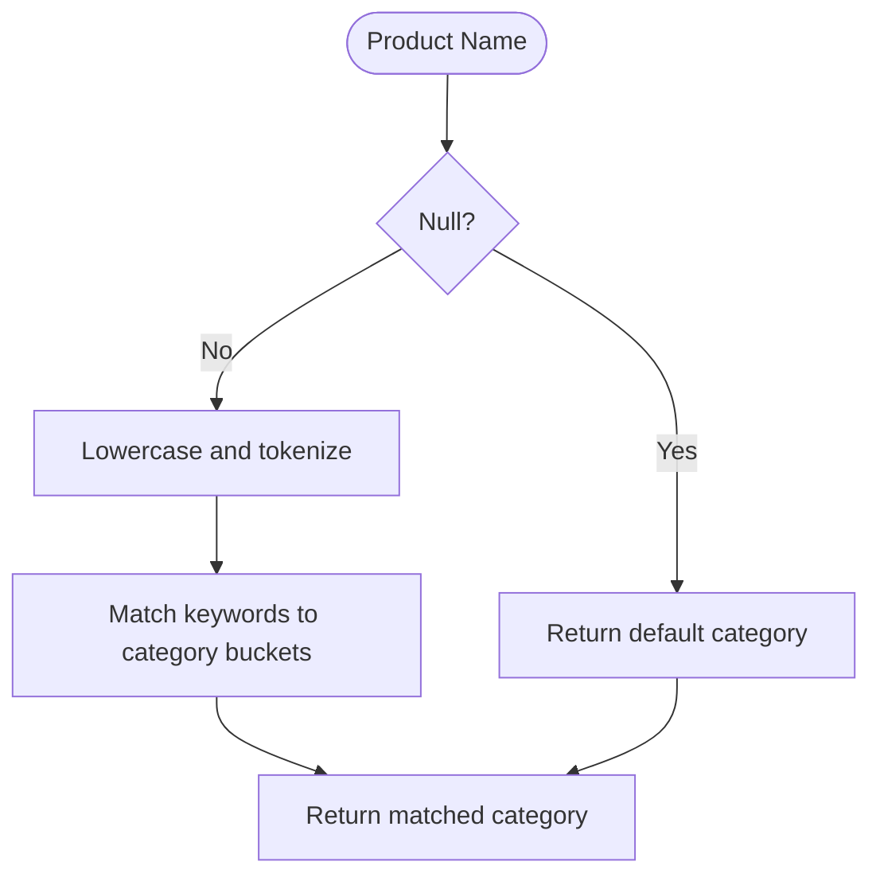
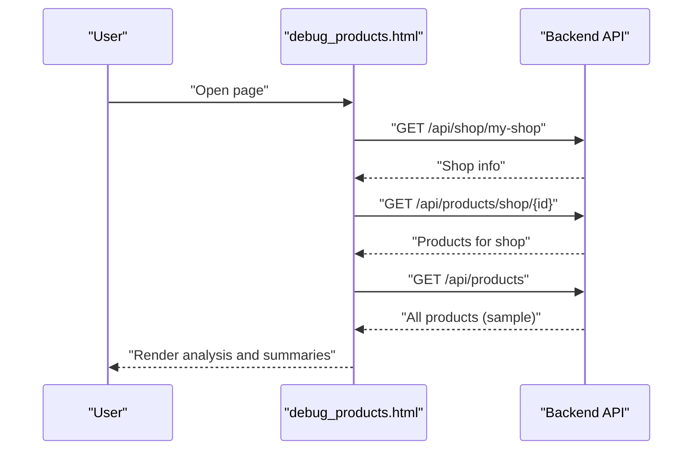
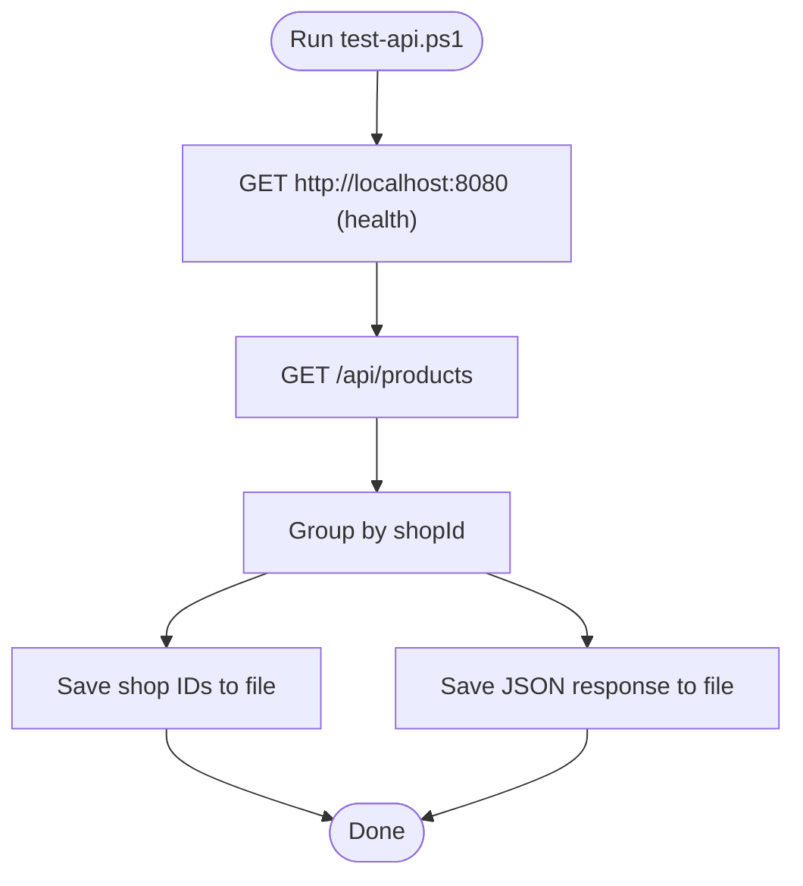
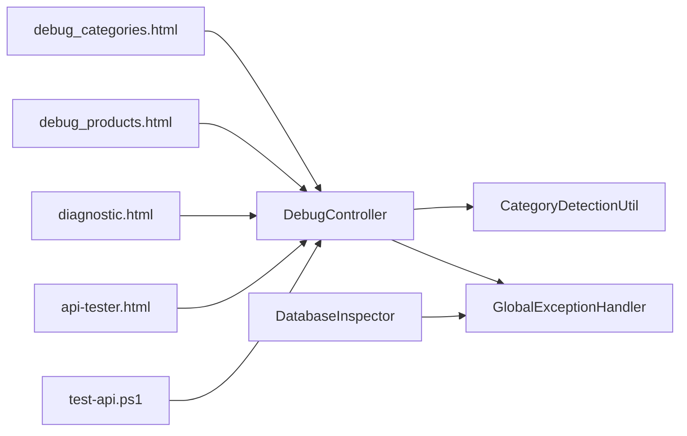

# Debugging & Diagnostic Tools

<cite>
**Referenced Files in This Document**
- [DebugController.java](file://src/backend/src/main/java/com/shoppeclone/backend/common/controller/DebugController.java)
- [DatabaseInspector.java](file://src/backend/src/main/java/com/shoppeclone/backend/common/DatabaseInspector.java)
- [CategoryDetectionUtil.java](file://src/backend/src/main/java/com/shoppeclone/backend/product/util/CategoryDetectionUtil.java)
- [GlobalExceptionHandler.java](file://src/backend/src/main/java/com/shoppeclone/backend/common/exception/GlobalExceptionHandler.java)
- [diagnostic.html](file://src/backend/src/main/resources/static/diagnostic.html)
- [debug_categories.html](file://src/backend/src/main/resources/static/debug_categories.html)
- [debug_products.html](file://src/backend/src/main/resources/static/debug_products.html)
- [api-tester.html](file://src/backend/src/main/resources/static/api-tester.html)
- [test-api.ps1](file://tools/test-api.ps1)
- [inspector_result.txt](file://data_dumps/inspector_result.txt)
</cite>

## Table of Contents
1. [Introduction](#introduction)
2. [Project Structure](#project-structure)
3. [Core Components](#core-components)
4. [Architecture Overview](#architecture-overview)
5. [Detailed Component Analysis](#detailed-component-analysis)
6. [Dependency Analysis](#dependency-analysis)
7. [Performance Considerations](#performance-considerations)
8. [Troubleshooting Guide](#troubleshooting-guide)
9. [Conclusion](#conclusion)

## Introduction
This document explains the debugging and diagnostic tools available in the backend and frontend assets. It covers the debug controller endpoints, development-time utilities, diagnostic pages, and scripts designed to help developers inspect system state, validate API behavior, and troubleshoot common issues during development and maintenance.

The materials are organized for both beginners and experienced developers, with conceptual overviews, technical details, and practical usage examples mapped to actual source files.

## Project Structure
The debugging and diagnostics span three layers:
- Backend REST endpoints for development-time fixes and inspections
- Command-line database inspector for batch diagnostics
- Frontend diagnostic pages and scripts for runtime inspection and quick fixes

**Diagram sources**
- [DebugController.java:16-58](file://src/backend/src/main/java/com/shoppeclone/backend/common/controller/DebugController.java#L16-L58)
- [DatabaseInspector.java:16-87](file://src/backend/src/main/java/com/shoppeclone/backend/common/DatabaseInspector.java#L16-L87)
- [CategoryDetectionUtil.java:1-72](file://src/backend/src/main/java/com/shoppeclone/backend/product/util/CategoryDetectionUtil.java#L1-L72)
- [GlobalExceptionHandler.java:1-109](file://src/backend/src/main/java/com/shoppeclone/backend/common/exception/GlobalExceptionHandler.java#L1-L109)
- [debug_categories.html:1-86](file://src/backend/src/main/resources/static/debug_categories.html#L1-L86)
- [debug_products.html:1-118](file://src/backend/src/main/resources/static/debug_products.html#L1-L118)
- [diagnostic.html:1-133](file://src/backend/src/main/resources/static/diagnostic.html#L1-L133)
- [api-tester.html](file://src/backend/src/main/resources/static/api-tester.html)
- [test-api.ps1:1-94](file://tools/test-api.ps1#L1-L94)

**Section sources**
- [DebugController.java:16-58](file://src/backend/src/main/java/com/shoppeclone/backend/common/controller/DebugController.java#L16-L58)
- [DatabaseInspector.java:16-87](file://src/backend/src/main/java/com/shoppeclone/backend/common/DatabaseInspector.java#L16-L87)
- [debug_categories.html:1-86](file://src/backend/src/main/resources/static/debug_categories.html#L1-L86)
- [debug_products.html:1-118](file://src/backend/src/main/resources/static/debug_products.html#L1-L118)
- [diagnostic.html:1-133](file://src/backend/src/main/resources/static/diagnostic.html#L1-L133)
- [api-tester.html](file://src/backend/src/main/resources/static/api-tester.html)
- [test-api.ps1:1-94](file://tools/test-api.ps1#L1-L94)

## Core Components
- DebugController: Exposes development-time endpoints to list categories and fix product category assignments via name-based detection.
- DatabaseInspector: Runs at startup to produce a structured report of shops, products, and corrective actions, writing results to a file.
- CategoryDetectionUtil: Provides deterministic category inference from product names for consistent assignment.
- GlobalExceptionHandler: Centralizes error responses for robust diagnostics and predictable failure reporting.
- Frontend diagnostic pages: Provide interactive checks for category links, product shop associations, and general API behavior.
- Dev script: Performs health checks and aggregates product distribution across shops.

**Section sources**
- [DebugController.java:16-58](file://src/backend/src/main/java/com/shoppeclone/backend/common/controller/DebugController.java#L16-L58)
- [DatabaseInspector.java:16-87](file://src/backend/src/main/java/com/shoppeclone/backend/common/DatabaseInspector.java#L16-L87)
- [CategoryDetectionUtil.java:1-72](file://src/backend/src/main/java/com/shoppeclone/backend/product/util/CategoryDetectionUtil.java#L1-L72)
- [GlobalExceptionHandler.java:1-109](file://src/backend/src/main/java/com/shoppeclone/backend/common/exception/GlobalExceptionHandler.java#L1-L109)
- [debug_categories.html:1-86](file://src/backend/src/main/resources/static/debug_categories.html#L1-L86)
- [debug_products.html:1-118](file://src/backend/src/main/resources/static/debug_products.html#L1-L118)
- [diagnostic.html:1-133](file://src/backend/src/main/resources/static/diagnostic.html#L1-L133)
- [api-tester.html](file://src/backend/src/main/resources/static/api-tester.html)
- [test-api.ps1:1-94](file://tools/test-api.ps1#L1-L94)

## Architecture Overview
The debug and diagnostic architecture integrates backend endpoints, frontend tools, and scripts to support iterative development and maintenance tasks.

**Diagram sources**
- [DebugController.java:25-56](file://src/backend/src/main/java/com/shoppeclone/backend/common/controller/DebugController.java#L25-L56)
- [CategoryDetectionUtil.java:12-70](file://src/backend/src/main/java/com/shoppeclone/backend/product/util/CategoryDetectionUtil.java#L12-L70)

## Detailed Component Analysis

### DebugController
Purpose:
- Provide development-time endpoints to inspect and repair data inconsistencies.

Endpoints:
- GET /api/debug/product-categories: Returns all product-category records for inspection.
- POST /api/debug/products/{productId}/fix-category: Detects category from product name and re-links the product to the correct category.

Processing logic:
- Validates product existence; throws an error if not found.
- Infers category name from product name using CategoryDetectionUtil.
- Looks up category by name; returns bad request if not found.
- Removes existing product-category mapping and creates a new mapping.

**Diagram sources**
- [DebugController.java:36-56](file://src/backend/src/main/java/com/shoppeclone/backend/common/controller/DebugController.java#L36-L56)
- [CategoryDetectionUtil.java:12-70](file://src/backend/src/main/java/com/shoppeclone/backend/product/util/CategoryDetectionUtil.java#L12-L70)

**Section sources**
- [DebugController.java:25-56](file://src/backend/src/main/java/com/shoppeclone/backend/common/controller/DebugController.java#L25-L56)

### DatabaseInspector
Purpose:
- Run at application startup to produce a diagnostic report summarizing shops, products, and corrective actions, writing output to a file.

Behavior:
- Loads all shops and products.
- Counts per-shop product counts.
- Identifies orphaned products (no shop or shop not present).
- Applies corrections (e.g., moving products from one shop to another).
- Writes a structured report to a file and logs completion.

**Diagram sources**
- [DatabaseInspector.java:24-85](file://src/backend/src/main/java/com/shoppeclone/backend/common/DatabaseInspector.java#L24-L85)

**Section sources**
- [DatabaseInspector.java:16-87](file://src/backend/src/main/java/com/shoppeclone/backend/common/DatabaseInspector.java#L16-L87)
- [inspector_result.txt:1-7](file://data_dumps/inspector_result.txt#L1-L7)

### CategoryDetectionUtil
Purpose:
- Provide deterministic category inference from product names using keyword matching.

Usage:
- Used by DebugController to fix product categories.
- Also used elsewhere for consistent category assignment.

**Diagram sources**
- [CategoryDetectionUtil.java:12-70](file://src/backend/src/main/java/com/shoppeclone/backend/product/util/CategoryDetectionUtil.java#L12-L70)

**Section sources**
- [CategoryDetectionUtil.java:1-72](file://src/backend/src/main/java/com/shoppeclone/backend/product/util/CategoryDetectionUtil.java#L1-L72)

### Frontend Diagnostic Pages
- debug_categories.html: Tests category API, validates response shape, and generates category.html navigation URLs.
- debug_products.html: Inspects current shop, shop’s products, and a sample of all products to detect mismatches.
- diagnostic.html: Analyzes category link parameters, validates presence and length, and offers quick fixes.
- api-tester.html: General-purpose API tester for common endpoints.

**Diagram sources**
- [debug_products.html:39-114](file://src/backend/src/main/resources/static/debug_products.html#L39-L114)

**Section sources**
- [debug_categories.html:1-86](file://src/backend/src/main/resources/static/debug_categories.html#L1-L86)
- [debug_products.html:1-118](file://src/backend/src/main/resources/static/debug_products.html#L1-L118)
- [diagnostic.html:1-133](file://src/backend/src/main/resources/static/diagnostic.html#L1-L133)
- [api-tester.html](file://src/backend/src/main/resources/static/api-tester.html)

### Dev Script: test-api.ps1
Purpose:
- Perform automated health checks and product distribution analysis.

Capabilities:
- GET /api/products and summarize counts per shop.
- Save shop IDs and full API response to files for later inspection.
- Verify backend availability.

**Diagram sources**
- [test-api.ps1:14-68](file://tools/test-api.ps1#L14-L68)

**Section sources**
- [test-api.ps1:1-94](file://tools/test-api.ps1#L1-L94)

## Dependency Analysis
- DebugController depends on repositories for product, category, and product-category relations, and uses CategoryDetectionUtil for inference.
- GlobalExceptionHandler centralizes error handling for all controllers, ensuring consistent diagnostics.
- Frontend pages depend on backend endpoints; they are decoupled from backend internals and only require stable API contracts.
- DatabaseInspector runs independently at startup and writes diagnostics to a file, decoupled from runtime requests.

**Diagram sources**
- [DebugController.java:21-23](file://src/backend/src/main/java/com/shoppeclone/backend/common/controller/DebugController.java#L21-L23)
- [CategoryDetectionUtil.java:1-72](file://src/backend/src/main/java/com/shoppeclone/backend/product/util/CategoryDetectionUtil.java#L1-L72)
- [GlobalExceptionHandler.java:1-109](file://src/backend/src/main/java/com/shoppeclone/backend/common/exception/GlobalExceptionHandler.java#L1-L109)
- [DatabaseInspector.java:16-87](file://src/backend/src/main/java/com/shoppeclone/backend/common/DatabaseInspector.java#L16-L87)
- [debug_categories.html:1-86](file://src/backend/src/main/resources/static/debug_categories.html#L1-L86)
- [debug_products.html:1-118](file://src/backend/src/main/resources/static/debug_products.html#L1-L118)
- [diagnostic.html:1-133](file://src/backend/src/main/resources/static/diagnostic.html#L1-L133)
- [api-tester.html](file://src/backend/src/main/resources/static/api-tester.html)
- [test-api.ps1:1-94](file://tools/test-api.ps1#L1-L94)

**Section sources**
- [DebugController.java:21-23](file://src/backend/src/main/java/com/shoppeclone/backend/common/controller/DebugController.java#L21-L23)
- [GlobalExceptionHandler.java:1-109](file://src/backend/src/main/java/com/shoppeclone/backend/common/exception/GlobalExceptionHandler.java#L1-L109)
- [DatabaseInspector.java:16-87](file://src/backend/src/main/java/com/shoppeclone/backend/common/DatabaseInspector.java#L16-L87)

## Performance Considerations
- DebugController endpoints are lightweight and intended for development. Avoid exposing them in production environments.
- CategoryDetectionUtil performs simple string matching; keep product names normalized to improve accuracy.
- Frontend diagnostic pages fetch small samples of data; avoid running them against very large datasets in production.
- DatabaseInspector runs at startup and writes to disk; ensure sufficient disk space and permissions.

## Troubleshooting Guide
Common scenarios and safe usage patterns:

- Category link broken in frontend:
  - Use diagnostic.html to validate URL parameters and suggest fixes.
  - Trigger category fix via POST /api/debug/products/{id}/fix-category to reconcile category linkage.

- Shop-product mismatch:
  - Use debug_products.html to compare shop-specific product lists with global product lists.
  - Confirm shop ownership and correct shopId values.

- API health and data distribution:
  - Run test-api.ps1 to verify backend health and inspect product distribution across shops.
  - Review saved files for quick reference.

- Consistent error responses:
  - GlobalExceptionHandler ensures predictable error payloads across endpoints, aiding diagnosis.

Safe usage patterns:
- Always run category fix after verifying product existence and category availability.
- Use frontend diagnostic pages with a local backend instance to avoid polluting production data.
- Keep sensitive endpoints behind authentication and restrict access to trusted networks.

**Section sources**
- [diagnostic.html:76-100](file://src/backend/src/main/resources/static/diagnostic.html#L76-L100)
- [debug_products.html:81-111](file://src/backend/src/main/resources/static/debug_products.html#L81-L111)
- [test-api.ps1:70-82](file://tools/test-api.ps1#L70-L82)
- [GlobalExceptionHandler.java:24-94](file://src/backend/src/main/java/com/shoppeclone/backend/common/exception/GlobalExceptionHandler.java#L24-L94)

## Conclusion
The debugging and diagnostic toolkit combines backend endpoints, centralized error handling, command-line inspection, and frontend diagnostic pages to streamline development and maintenance workflows. By leveraging these tools, developers can quickly diagnose issues, validate API behavior, and maintain data consistency with minimal risk to production systems.