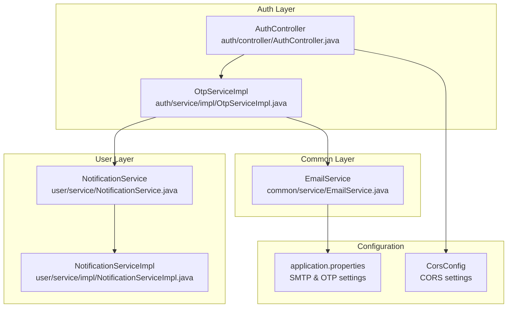
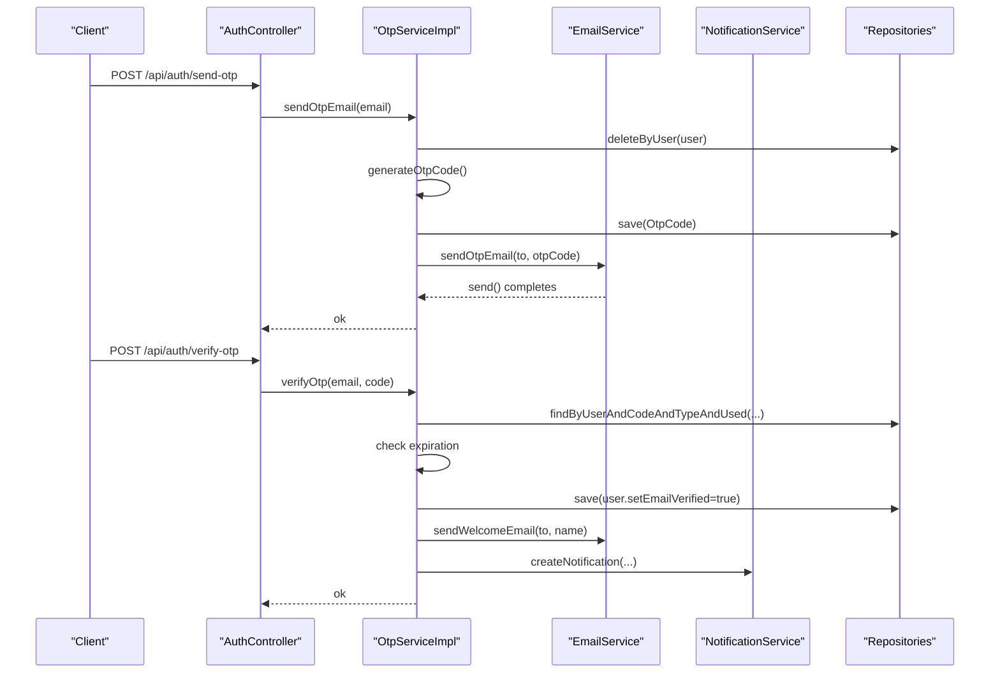
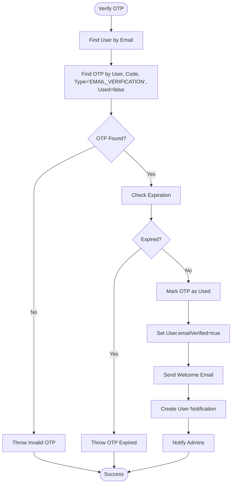
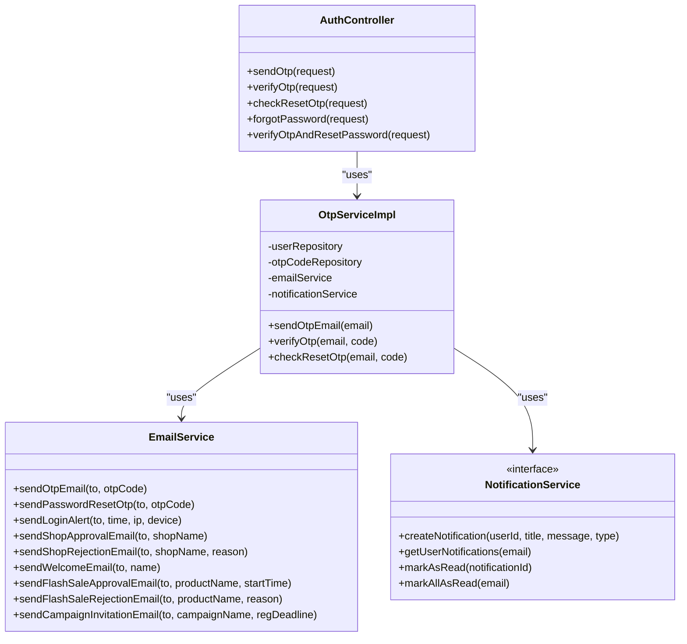

# Email Services

<cite>
**Referenced Files in This Document**
- [EmailService.java](file://src/backend/src/main/java/com/shoppeclone/backend/common/service/EmailService.java)
- [application.properties](file://src/backend/src/main/resources/application.properties)
- [OtpServiceImpl.java](file://src/backend/src/main/java/com/shoppeclone/backend/auth/service/impl/OtpServiceImpl.java)
- [AuthController.java](file://src/backend/src/main/java/com/shoppeclone/backend/auth/controller/AuthController.java)
- [NotificationService.java](file://src/backend/src/main/java/com/shoppeclone/backend/user/service/NotificationService.java)
- [NotificationServiceImpl.java](file://src/backend/src/main/java/com/shoppeclone/backend/user/service/impl/NotificationServiceImpl.java)
- [CorsConfig.java](file://src/backend/src/main/java/com/shoppeclone/backend/common/config/CorsConfig.java)
- [log_AI.md](file://docs/ai_logs/log_AI.md)
</cite>

## Table of Contents
1. [Introduction](#introduction)
2. [Project Structure](#project-structure)
3. [Core Components](#core-components)
4. [Architecture Overview](#architecture-overview)
5. [Detailed Component Analysis](#detailed-component-analysis)
6. [Dependency Analysis](#dependency-analysis)
7. [Performance Considerations](#performance-considerations)
8. [Troubleshooting Guide](#troubleshooting-guide)
9. [Conclusion](#conclusion)

## Introduction
This section documents the email notification system in the backend. It explains the SMTP configuration, email template management approach, and the implementation details of email sending mechanisms. It also covers error handling, delivery status tracking, and integration patterns with other system components such as authentication, OTP verification, and notifications. Both conceptual overviews for beginners and technical details for experienced developers are included, with diagrams to illustrate email flows and system integration points.

## Project Structure
The email service is implemented as a dedicated service component that integrates with Spring's JavaMailSender. Configuration is centralized in the application properties file, and the service is consumed by authentication and user management components.

**Diagram sources**
- [EmailService.java:10-12](file://src/backend/src/main/java/com/shoppeclone/backend/common/service/EmailService.java#L10-L12)
- [application.properties:70-83](file://src/backend/src/main/resources/application.properties#L70-L83)
- [OtpServiceImpl.java:22-23](file://src/backend/src/main/java/com/shoppeclone/backend/auth/service/impl/OtpServiceImpl.java#L22-L23)
- [AuthController.java:29-29](file://src/backend/src/main/java/com/shoppeclone/backend/auth/controller/AuthController.java#L29-L29)
- [NotificationService.java:7-15](file://src/backend/src/main/java/com/shoppeclone/backend/user/service/NotificationService.java#L7-L15)
- [CorsConfig.java:14-28](file://src/backend/src/main/java/com/shoppeclone/backend/common/config/CorsConfig.java#L14-L28)

**Section sources**
- [EmailService.java:10-12](file://src/backend/src/main/java/com/shoppeclone/backend/common/service/EmailService.java#L10-L12)
- [application.properties:70-83](file://src/backend/src/main/resources/application.properties#L70-L83)

## Core Components
- EmailService: Provides methods to send various transactional emails (OTP, password reset, login alerts, shop approvals/rejections, welcome messages, flash sale approvals/rejections, and campaign invitations). It uses Spring's JavaMailSender to deliver messages via SMTP.
- SMTP Configuration: Defined in application.properties under the email configuration section, specifying host, port, credentials, and TLS settings.
- Authentication Integration: OtpServiceImpl coordinates OTP generation, persistence, and email dispatch through EmailService, and triggers welcome notifications upon successful verification.
- Notification Integration: After successful email verification, the system creates in-app notifications and optionally sends administrative alerts.

Key responsibilities and relationships:
- EmailService depends on JavaMailSender and constructs SimpleMailMessage instances for each email type.
- OtpServiceImpl orchestrates OTP lifecycle and delegates email sending to EmailService.
- NotificationService and NotificationServiceImpl handle in-app notifications triggered alongside email actions.

**Section sources**
- [EmailService.java:14-197](file://src/backend/src/main/java/com/shoppeclone/backend/common/service/EmailService.java#L14-L197)
- [application.properties:70-83](file://src/backend/src/main/resources/application.properties#L70-L83)
- [OtpServiceImpl.java:22-126](file://src/backend/src/main/java/com/shoppeclone/backend/auth/service/impl/OtpServiceImpl.java#L22-L126)
- [NotificationService.java:7-15](file://src/backend/src/main/java/com/shoppeclone/backend/user/service/NotificationService.java#L7-L15)

## Architecture Overview
The email service architecture follows a layered design:
- Presentation/Controller: AuthController exposes endpoints for OTP send/verify/reset flows.
- Service: OtpServiceImpl manages OTP business logic and integrates EmailService and NotificationService.
- Infrastructure: EmailService encapsulates email sending using JavaMailSender configured via application.properties.
- Persistence: OTP records are stored in the database for verification and expiration checks.

**Diagram sources**
- [AuthController.java:58-69](file://src/backend/src/main/java/com/shoppeclone/backend/auth/controller/AuthController.java#L58-L69)
- [OtpServiceImpl.java:29-126](file://src/backend/src/main/java/com/shoppeclone/backend/auth/service/impl/OtpServiceImpl.java#L29-L126)
- [EmailService.java:14-27](file://src/backend/src/main/java/com/shoppeclone/backend/common/service/EmailService.java#L14-L27)
- [NotificationService.java:7-15](file://src/backend/src/main/java/com/shoppeclone/backend/user/service/NotificationService.java#L7-L15)

## Detailed Component Analysis

### EmailService Implementation
EmailService is a Spring-managed service that encapsulates email sending logic. It uses JavaMailSender to send SimpleMailMessage instances. The service defines methods for:
- OTP verification emails
- Password reset OTP emails
- Login security alerts
- Shop application approval/rejection emails
- Welcome emails
- Flash sale approval/rejection emails
- Campaign invitation emails with localized date formatting

Implementation patterns:
- Each method constructs a SimpleMailMessage with recipient, subject, and body text.
- The service relies on Spring's JavaMailSender bean configured via application.properties.
- Methods print console logs upon successful send operations for observability.

Template management:
- Current implementation uses inline text bodies for all emails.
- There are no Thymeleaf or FreeMarker templates present in the repository; emails are plain-text.

Error handling:
- No explicit try/catch blocks are present in EmailService methods.
- Exceptions thrown by JavaMailSender propagate to callers, which may be handled by Spring MVC exception handlers or upstream services.

Delivery status tracking:
- The current implementation does not persist delivery receipts or track email status beyond successful send completion.

Practical usage examples:
- OTP verification: Called from OtpServiceImpl during user registration and verification.
- Welcome email: Sent after successful email verification.
- Shop and flash sale updates: Sent by administrative workflows to notify sellers.

**Section sources**
- [EmailService.java:14-197](file://src/backend/src/main/java/com/shoppeclone/backend/common/service/EmailService.java#L14-L197)

### SMTP Configuration
SMTP settings are configured in application.properties under the email configuration section:
- Host: smtp.gmail.com
- Port: 587
- Username: ${MAIL_USERNAME}
- Password: ${MAIL_PASSWORD}
- TLS: enabled via starttls properties

OTP configuration:
- otp.expiration: ${OTP_EXPIRATION:300000} (default 5 minutes)

Environment variables:
- MAIL_USERNAME and MAIL_PASSWORD are expected to be provided via environment variables or externalized configuration.
- The log_AI.md documentation clarifies that MAIL_PASSWORD corresponds to a Gmail App Password used for SMTP authentication.

CORS considerations:
- While not directly related to email, CORS configuration allows cross-origin requests that may trigger email-related endpoints.

**Section sources**
- [application.properties:70-83](file://src/backend/src/main/resources/application.properties#L70-L83)
- [log_AI.md:12898-12911](file://docs/ai_logs/log_AI.md#L12898-L12911)
- [CorsConfig.java:14-28](file://src/backend/src/main/java/com/shoppeclone/backend/common/config/CorsConfig.java#L14-L28)

### Authentication Integration (OTP and Verification)
OtpServiceImpl coordinates the OTP lifecycle:
- Retrieves user by email
- Deletes existing OTP entries
- Generates a 6-digit OTP code
- Persists OTP with expiration and creation timestamps
- Sends OTP email via EmailService
- On verification success:
  - Marks OTP as used
  - Updates user email verification flag
  - Sends welcome email
  - Creates in-app notifications for user and admins

Endpoints:
- /api/auth/send-otp: Triggers OTP email dispatch
- /api/auth/verify-otp: Verifies OTP and completes user verification
- /api/auth/check-reset-otp: Validates OTP for password reset flow
- /api/auth/forgot-password: Initiates password reset OTP flow

**Diagram sources**
- [OtpServiceImpl.java:60-126](file://src/backend/src/main/java/com/shoppeclone/backend/auth/service/impl/OtpServiceImpl.java#L60-L126)
- [EmailService.java:104-119](file://src/backend/src/main/java/com/shoppeclone/backend/common/service/EmailService.java#L104-L119)
- [NotificationService.java:7-15](file://src/backend/src/main/java/com/shoppeclone/backend/user/service/NotificationService.java#L7-L15)

**Section sources**
- [OtpServiceImpl.java:29-126](file://src/backend/src/main/java/com/shoppeclone/backend/auth/service/impl/OtpServiceImpl.java#L29-L126)
- [AuthController.java:58-76](file://src/backend/src/main/java/com/shoppeclone/backend/auth/controller/AuthController.java#L58-L76)

### Notification Integration
After successful email verification, the system creates in-app notifications:
- A personalized welcome notification for the user
- Administrative alerts for all administrators

NotificationService defines the contract for creating, retrieving, marking as read, and batch-marking notifications as read. NotificationServiceImpl implements these operations against the persistence layer.

Integration points:
- OtpServiceImpl invokes NotificationService.createNotification after successful verification.
- Frontend JavaScript consumes the notification API to render and manage notifications.

**Section sources**
- [OtpServiceImpl.java:102-122](file://src/backend/src/main/java/com/shoppeclone/backend/auth/service/impl/OtpServiceImpl.java#L102-L122)
- [NotificationService.java:7-15](file://src/backend/src/main/java/com/shoppeclone/backend/user/service/NotificationService.java#L7-L15)
- [NotificationServiceImpl.java:32-77](file://src/backend/src/main/java/com/shoppeclone/backend/user/service/impl/NotificationServiceImpl.java#L32-L77)

### Template Management
Current implementation:
- All emails are constructed with inline text bodies.
- No template engine (e.g., Thymeleaf) is present in the repository.
- Campaign invitation emails include basic date formatting logic for Vietnamese locale display.

Recommendations for enhancement:
- Introduce Thymeleaf templates for maintainable HTML emails.
- Centralize email content and localization.
- Add support for attachments and HTML formatting.

[No sources needed since this section provides general guidance]

## Dependency Analysis
EmailService depends on:
- JavaMailSender (configured in application.properties)
- Spring's SimpleMailMessage for constructing messages

Integration dependencies:
- OtpServiceImpl depends on EmailService, NotificationService, and repositories for OTP and user management.
- AuthController depends on OtpService for OTP-related endpoints.
- NotificationService and NotificationServiceImpl depend on repositories for persistence.

**Diagram sources**
- [EmailService.java:10-197](file://src/backend/src/main/java/com/shoppeclone/backend/common/service/EmailService.java#L10-L197)
- [OtpServiceImpl.java:18-23](file://src/backend/src/main/java/com/shoppeclone/backend/auth/service/impl/OtpServiceImpl.java#L18-L23)
- [AuthController.java:26-29](file://src/backend/src/main/java/com/shoppeclone/backend/auth/controller/AuthController.java#L26-L29)
- [NotificationService.java:7-15](file://src/backend/src/main/java/com/shoppeclone/backend/user/service/NotificationService.java#L7-L15)

**Section sources**
- [EmailService.java:10-197](file://src/backend/src/main/java/com/shoppeclone/backend/common/service/EmailService.java#L10-L197)
- [OtpServiceImpl.java:18-23](file://src/backend/src/main/java/com/shoppeclone/backend/auth/service/impl/OtpServiceImpl.java#L18-L23)
- [AuthController.java:26-29](file://src/backend/src/main/java/com/shoppeclone/backend/auth/controller/AuthController.java#L26-L29)
- [NotificationService.java:7-15](file://src/backend/src/main/java/com/shoppeclone/backend/user/service/NotificationService.java#L7-L15)

## Performance Considerations
- Synchronous sending: EmailService.send uses synchronous JavaMailSender.send, which blocks the calling thread. For high-volume scenarios, consider asynchronous processing with a task queue (e.g., Spring TaskExecutor or external messaging).
- Concurrency: The Tomcat thread pool is tuned for high concurrency; ensure email operations do not block threads unnecessarily.
- Template rendering: If adopting Thymeleaf, pre-process templates and cache rendered content to reduce overhead.
- Retry and dead-letter queues: Implement retry logic and dead-letter handling for transient SMTP failures.

[No sources needed since this section provides general guidance]

## Troubleshooting Guide
Common issues and resolutions:
- SMTP authentication failure:
  - Ensure MAIL_USERNAME and MAIL_PASSWORD are set correctly.
  - Confirm Gmail App Password usage as documented in log_AI.md.
- Network connectivity:
  - Verify outbound SMTP 587 access to smtp.gmail.com.
- OTP expiration:
  - Check otp.expiration setting and ensure client-side timing aligns with server configuration.
- Email delivery failures:
  - Since there is no built-in delivery tracking, monitor logs and consider adding delivery receipts or external email delivery platforms.
- CORS errors:
  - Ensure frontend origins are permitted by CORS configuration.

Operational indicators:
- Console logs in EmailService methods indicate successful sends.
- OtpServiceImpl prints detailed logs for OTP lifecycle events.

**Section sources**
- [application.properties:70-83](file://src/backend/src/main/resources/application.properties#L70-L83)
- [log_AI.md:12898-12911](file://docs/ai_logs/log_AI.md#L12898-L12911)
- [EmailService.java:45-196](file://src/backend/src/main/java/com/shoppeclone/backend/common/service/EmailService.java#L45-L196)
- [OtpServiceImpl.java:29-126](file://src/backend/src/main/java/com/shoppeclone/backend/auth/service/impl/OtpServiceImpl.java#L29-L126)
- [CorsConfig.java:14-28](file://src/backend/src/main/java/com/shoppeclone/backend/common/config/CorsConfig.java#L14-L28)

## Conclusion
The email notification system leverages Spring JavaMailSender to deliver transactional emails for authentication, verification, and administrative updates. The current implementation is straightforward and effective for development and small-scale production use. For enhanced reliability, scalability, and maintainability, consider introducing asynchronous processing, template engines, and delivery tracking. The integration with OTP and notifications provides a cohesive user experience, and the configuration is centralized for easy management.