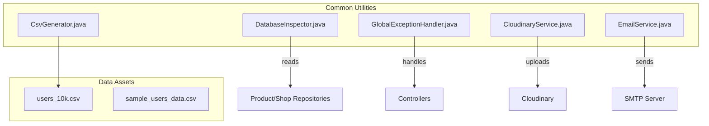
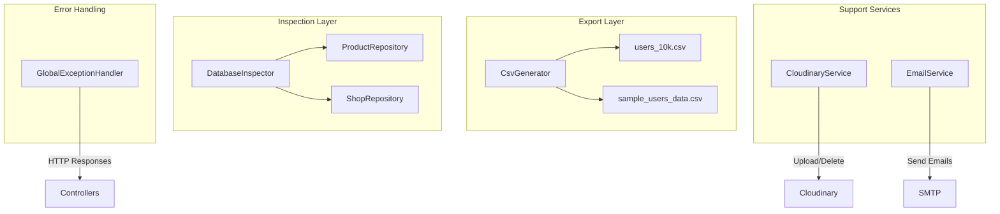
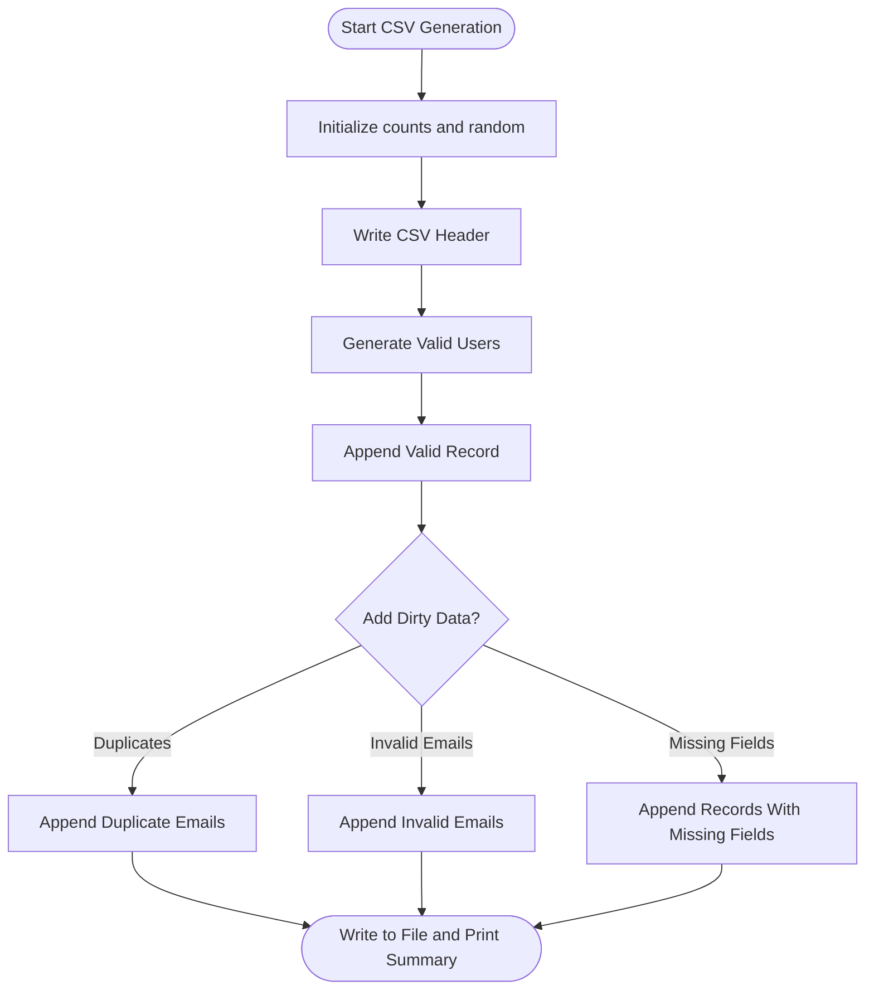
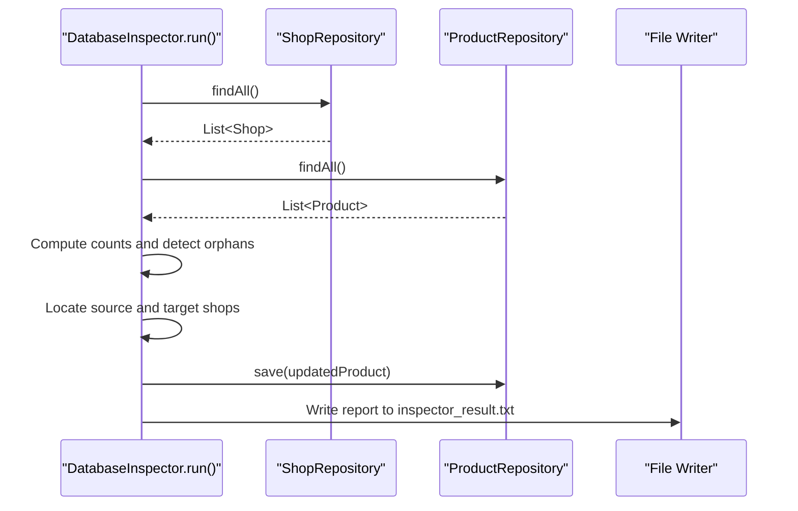
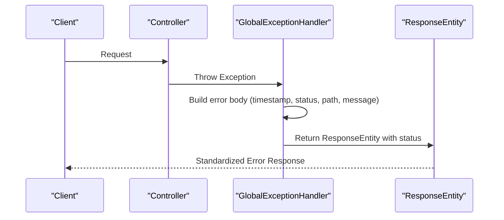
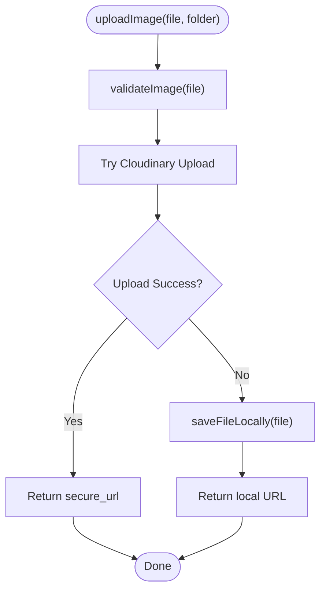
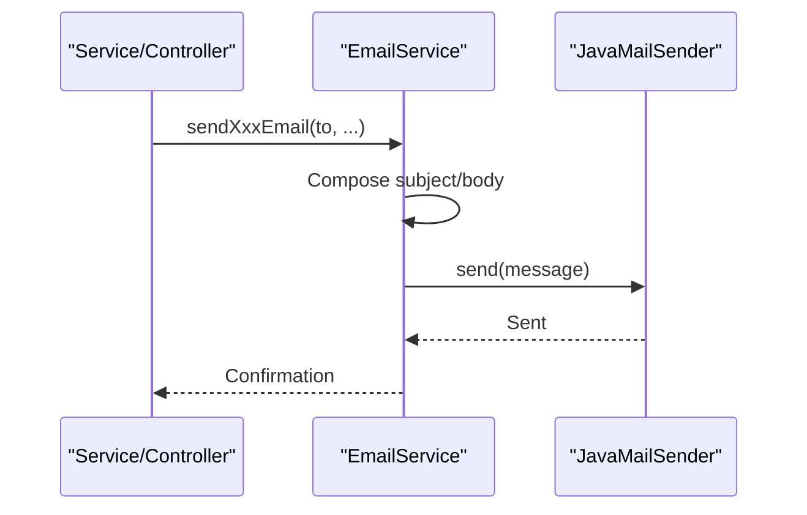
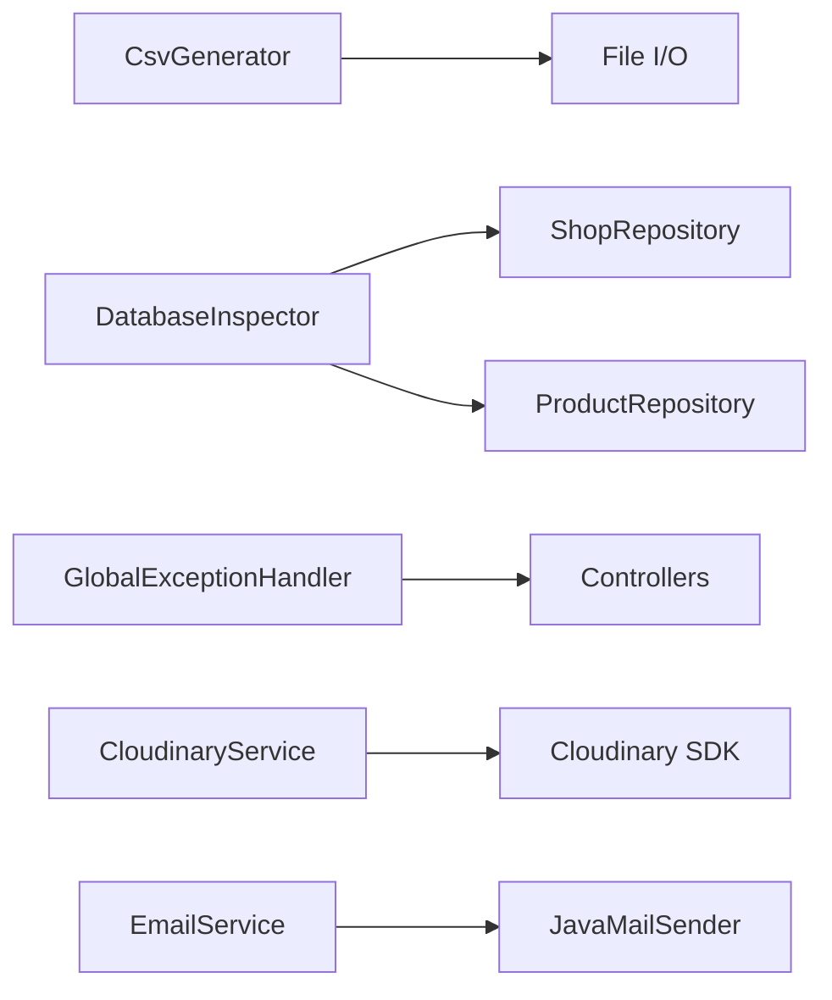

# Shared Utilities & Helpers

<cite>
**Referenced Files in This Document**
- [CsvGenerator.java](file://src/Backend/src/main/java/com/shoppeclone/backend/common/utils/CsvGenerator.java)
- [DatabaseInspector.java](file://src/Backend/src/main/java/com/shoppeclone/backend/common/DatabaseInspector.java)
- [GlobalExceptionHandler.java](file://src/Backend/src/main/java/com/shoppeclone/backend/common/exception/GlobalExceptionHandler.java)
- [CloudinaryService.java](file://src/Backend/src/main/java/com/shoppeclone/backend/common/service/CloudinaryService.java)
- [EmailService.java](file://src/Backend/src/main/java/com/shoppeclone/backend/common/service/EmailService.java)
- [users_10k.csv](file://src/Backend/users_10k.csv)
- [sample_users_data.csv](file://data/sample_users_data.csv)
</cite>

## Table of Contents
1. [Introduction](#introduction)
2. [Project Structure](#project-structure)
3. [Core Components](#core-components)
4. [Architecture Overview](#architecture-overview)
5. [Detailed Component Analysis](#detailed-component-analysis)
6. [Dependency Analysis](#dependency-analysis)
7. [Performance Considerations](#performance-considerations)
8. [Troubleshooting Guide](#troubleshooting-guide)
9. [Conclusion](#conclusion)
10. [Appendices](#appendices)

## Introduction
This section documents the shared utility functions and helper classes that support data export, database diagnostics, and centralized error handling across the system. It covers:
- CSV generation utilities for synthetic and sample datasets
- Database inspection tools for integrity checks and corrections
- Global exception handling mechanisms for consistent error responses
- Supporting services for image upload and email notifications
The goal is to provide both conceptual overviews for beginners and precise technical details for experienced developers, with diagrams where appropriate.

## Project Structure
The shared utilities are organized under the common package and include:
- Data export utilities: CSV generator for synthetic datasets
- Database inspection: CLI runner that inspects and corrects anomalies
- Centralized error handling: Spring’s @ControllerAdvice for uniform HTTP responses
- Supporting services: Cloudinary image upload with fallback and email notifications

**Diagram sources**
- [CsvGenerator.java:16-77](file://src/Backend/src/main/java/com/shoppeclone/backend/common/utils/CsvGenerator.java#L16-L77)
- [DatabaseInspector.java:19-85](file://src/Backend/src/main/java/com/shoppeclone/backend/common/DatabaseInspector.java#L19-L85)
- [GlobalExceptionHandler.java:19-108](file://src/Backend/src/main/java/com/shoppeclone/backend/common/exception/GlobalExceptionHandler.java#L19-L108)
- [CloudinaryService.java:36-58](file://src/Backend/src/main/java/com/shoppeclone/backend/common/service/CloudinaryService.java#L36-L58)
- [EmailService.java:14-27](file://src/Backend/src/main/java/com/shoppeclone/backend/common/service/EmailService.java#L14-L27)

**Section sources**
- [CsvGenerator.java:1-79](file://src/Backend/src/main/java/com/shoppeclone/backend/common/utils/CsvGenerator.java#L1-L79)
- [DatabaseInspector.java:1-87](file://src/Backend/src/main/java/com/shoppeclone/backend/common/DatabaseInspector.java#L1-L87)
- [GlobalExceptionHandler.java:1-109](file://src/Backend/src/main/java/com/shoppeclone/backend/common/exception/GlobalExceptionHandler.java#L1-L109)
- [CloudinaryService.java:1-137](file://src/Backend/src/main/java/com/shoppeclone/backend/common/service/CloudinaryService.java#L1-L137)
- [EmailService.java:1-197](file://src/Backend/src/main/java/com/shoppeclone/backend/common/service/EmailService.java#L1-L197)

## Core Components
- CSV Generation Utility: Generates synthetic user datasets with realistic Vietnamese names, emails, and phone numbers, including dirty data scenarios for testing.
- Database Inspector: Performs integrity checks across Product and Shop entities, detects orphaned products, and performs corrective updates.
- Global Exception Handler: Centralizes error responses for validation failures, business exceptions, runtime errors, access denials, and generic exceptions.
- Cloudinary Image Upload Service: Provides image upload with Cloudinary fallback to local storage, including validation and deletion support.
- Email Notification Service: Sends OTP, password reset, login alerts, shop approvals/rejections, welcome messages, and flash sale invitations.

Practical usage examples:
- CSV Export: Run the CSV generator to produce a large dataset for load testing or seed data.
- Database Health: Execute the Database Inspector to generate a report and apply corrections.
- Error Handling: Integrate the Global Exception Handler to standardize API error responses.
- Media Upload: Use CloudinaryService for image uploads with robust fallback behavior.
- Notifications: Use EmailService methods to send templated emails for various events.

**Section sources**
- [CsvGenerator.java:16-77](file://src/Backend/src/main/java/com/shoppeclone/backend/common/utils/CsvGenerator.java#L16-L77)
- [DatabaseInspector.java:24-84](file://src/Backend/src/main/java/com/shoppeclone/backend/common/DatabaseInspector.java#L24-L84)
- [GlobalExceptionHandler.java:24-107](file://src/Backend/src/main/java/com/shoppeclone/backend/common/exception/GlobalExceptionHandler.java#L24-L107)
- [CloudinaryService.java:36-135](file://src/Backend/src/main/java/com/shoppeclone/backend/common/service/CloudinaryService.java#L36-L135)
- [EmailService.java:14-196](file://src/Backend/src/main/java/com/shoppeclone/backend/common/service/EmailService.java#L14-L196)

## Architecture Overview
The shared utilities form a cohesive layer that supports higher-level services and controllers:
- Data export utilities feed seeders and test suites
- Database inspection ensures referential integrity and operational correctness
- Exception handling ensures consistent error reporting across the API
- Supporting services encapsulate third-party integrations and provide fallbacks

**Diagram sources**
- [CsvGenerator.java:16-77](file://src/Backend/src/main/java/com/shoppeclone/backend/common/utils/CsvGenerator.java#L16-L77)
- [DatabaseInspector.java:21-22](file://src/Backend/src/main/java/com/shoppeclone/backend/common/DatabaseInspector.java#L21-L22)
- [GlobalExceptionHandler.java:19-108](file://src/Backend/src/main/java/com/shoppeclone/backend/common/exception/GlobalExceptionHandler.java#L19-L108)
- [CloudinaryService.java:25-135](file://src/Backend/src/main/java/com/shoppeclone/backend/common/service/CloudinaryService.java#L25-L135)
- [EmailService.java:12-196](file://src/Backend/src/main/java/com/shoppeclone/backend/common/service/EmailService.java#L12-L196)

## Detailed Component Analysis

### CSV Generation Utility
Purpose:
- Generate synthetic user datasets for testing, seeding, and load simulation
- Include realistic Vietnamese names, normalized emails, and varied phone numbers
- Produce dirty data (duplicates, invalid emails, missing fields) for robustness testing

Key behaviors:
- Writes header row and iterates to produce records
- Applies normalization and sanitization for email creation
- Emits controlled dirty data to simulate real-world anomalies
- Outputs to a CSV file for downstream consumption

**Diagram sources**
- [CsvGenerator.java:16-77](file://src/Backend/src/main/java/com/shoppeclone/backend/common/utils/CsvGenerator.java#L16-L77)

Usage examples:
- Generate a large dataset for performance testing
- Create seed data with known anomalies for validation pipelines
- Use the resulting CSV files as input for importers and analyzers

Integration points:
- Consumed by data dump scripts and test harnesses
- Used alongside sample datasets for development and QA

**Section sources**
- [CsvGenerator.java:16-77](file://src/Backend/src/main/java/com/shoppeclone/backend/common/utils/CsvGenerator.java#L16-L77)
- [users_10k.csv:1-200](file://src/Backend/users_10k.csv#L1-L200)
- [sample_users_data.csv:1-200](file://data/sample_users_data.csv#L1-L200)

### Database Inspection Tool
Purpose:
- Inspect database integrity across Shop and Product entities
- Detect orphaned products (products without a valid shop association)
- Apply corrective actions by reassigning products to the intended shop
- Generate a diagnostic report and persist it to a file

Key behaviors:
- Loads all shops and products
- Counts products per shop and identifies orphaned entries
- Locates specific shops by name and reassigns affected products
- Persists a structured report to a text file

**Diagram sources**
- [DatabaseInspector.java:24-84](file://src/Backend/src/main/java/com/shoppeclone/backend/common/DatabaseInspector.java#L24-L84)

Usage examples:
- Run during maintenance windows to validate referential integrity
- Use the generated report to track historical changes and corrective actions
- Integrate into CI/CD pipelines to prevent regressions

**Section sources**
- [DatabaseInspector.java:24-84](file://src/Backend/src/main/java/com/shoppeclone/backend/common/DatabaseInspector.java#L24-L84)

### Global Exception Handling Mechanism
Purpose:
- Provide centralized, standardized HTTP error responses across controllers
- Handle validation errors, business exceptions, runtime errors, access denials, and generic exceptions

Key behaviors:
- Handles validation failures with field-specific messages
- Maps domain/business exceptions to appropriate HTTP status codes
- Wraps unexpected errors with internal server error responses
- Includes contextual metadata such as timestamp, path, and status

**Diagram sources**
- [GlobalExceptionHandler.java:24-107](file://src/Backend/src/main/java/com/shoppeclone/backend/common/exception/GlobalExceptionHandler.java#L24-L107)

Usage examples:
- Ensure all controller exceptions are consistently formatted
- Support frontend error handling with predictable payload structures
- Facilitate debugging with embedded timestamps and request paths

**Section sources**
- [GlobalExceptionHandler.java:24-107](file://src/Backend/src/main/java/com/shoppeclone/backend/common/exception/GlobalExceptionHandler.java#L24-L107)

### Supporting Services

#### Cloudinary Image Upload Service
Purpose:
- Upload images to Cloudinary with robust fallback to local storage
- Validate file size, type, and format
- Provide deletion capability by public ID

Key behaviors:
- Validates input files and throws descriptive errors for invalid inputs
- Attempts Cloudinary upload; falls back to local storage on failure
- Saves files to both target and src locations for persistence and immediate serving
- Constructs a public URL for served assets

**Diagram sources**
- [CloudinaryService.java:36-88](file://src/Backend/src/main/java/com/shoppeclone/backend/common/service/CloudinaryService.java#L36-L88)

Usage examples:
- Use for user avatar uploads, product images, and shop identification documents
- Leverage fallback behavior to maintain availability during external service outages

**Section sources**
- [CloudinaryService.java:36-135](file://src/Backend/src/main/java/com/shoppeclone/backend/common/service/CloudinaryService.java#L36-L135)

#### Email Notification Service
Purpose:
- Send templated emails for OTP verification, password resets, security alerts, shop approvals/rejections, welcome messages, and flash sale invitations

Key behaviors:
- Composes subject and body for each email type
- Sends via configured JavaMailSender
- Formats campaign deadlines and localization-aware messages

**Diagram sources**
- [EmailService.java:14-196](file://src/Backend/src/main/java/com/shoppeclone/backend/common/service/EmailService.java#L14-L196)

Usage examples:
- Trigger OTP emails during authentication flows
- Notify sellers about shop application outcomes
- Alert users about security events

**Section sources**
- [EmailService.java:14-196](file://src/Backend/src/main/java/com/shoppeclone/backend/common/service/EmailService.java#L14-L196)

## Dependency Analysis
- CsvGenerator depends on file I/O and standard libraries to write CSV files
- DatabaseInspector depends on ShopRepository and ProductRepository for data access and on logging for diagnostics
- GlobalExceptionHandler is a Spring-managed component that intercepts exceptions thrown by controllers
- CloudinaryService depends on Cloudinary SDK and Spring’s URI builder for URL construction
- EmailService depends on JavaMailSender for SMTP communication

**Diagram sources**
- [CsvGenerator.java:23-76](file://src/Backend/src/main/java/com/shoppeclone/backend/common/utils/CsvGenerator.java#L23-L76)
- [DatabaseInspector.java:21-22](file://src/Backend/src/main/java/com/shoppeclone/backend/common/DatabaseInspector.java#L21-L22)
- [GlobalExceptionHandler.java:19-108](file://src/Backend/src/main/java/com/shoppeclone/backend/common/exception/GlobalExceptionHandler.java#L19-L108)
- [CloudinaryService.java:25-87](file://src/Backend/src/main/java/com/shoppeclone/backend/common/service/CloudinaryService.java#L25-L87)
- [EmailService.java:12-196](file://src/Backend/src/main/java/com/shoppeclone/backend/common/service/EmailService.java#L12-L196)

**Section sources**
- [CsvGenerator.java:23-76](file://src/Backend/src/main/java/com/shoppeclone/backend/common/utils/CsvGenerator.java#L23-L76)
- [DatabaseInspector.java:21-22](file://src/Backend/src/main/java/com/shoppeclone/backend/common/DatabaseInspector.java#L21-L22)
- [GlobalExceptionHandler.java:19-108](file://src/Backend/src/main/java/com/shoppeclone/backend/common/exception/GlobalExceptionHandler.java#L19-L108)
- [CloudinaryService.java:25-87](file://src/Backend/src/main/java/com/shoppeclone/backend/common/service/CloudinaryService.java#L25-L87)
- [EmailService.java:12-196](file://src/Backend/src/main/java/com/shoppeclone/backend/common/service/EmailService.java#L12-L196)

## Performance Considerations
- CSV generation: Writing large files can be I/O bound; ensure adequate disk space and consider streaming for extremely large datasets
- Database inspection: Iterating over all entities can be expensive; schedule during off-peak hours and consider pagination or batch updates for large datasets
- Exception handling: Keep error payloads concise; avoid leaking sensitive information and include only necessary metadata
- Cloudinary fallback: Local storage introduces additional I/O; monitor disk usage and consider CDN caching strategies
- Email service: Batch sending and rate limiting can help manage SMTP throughput and avoid throttling

## Troubleshooting Guide
Common issues and resolutions:
- CSV generation failures: Verify file permissions and disk space; ensure the working directory is writable
- Database inspection anomalies: Confirm repository connectivity and entity mappings; review logs for orphan detection and correction steps
- Exception handler not invoked: Ensure @ControllerAdvice is scanned and that exceptions are thrown rather than swallowed
- Cloudinary upload failures: Check configuration and network connectivity; confirm fallback to local storage is functioning
- Email delivery problems: Validate SMTP settings and credentials; test with a small subset of recipients

Diagnostic capabilities:
- CSV generator prints completion summaries to console
- Database inspector writes a structured report to a file for post-mortem analysis
- Exception handler embeds timestamps and request paths to aid debugging
- Cloudinary service logs warnings on fallback events
- Email service logs confirmation messages upon successful sends

**Section sources**
- [CsvGenerator.java:74-76](file://src/Backend/src/main/java/com/shoppeclone/backend/common/utils/CsvGenerator.java#L74-L76)
- [DatabaseInspector.java:83-84](file://src/Backend/src/main/java/com/shoppeclone/backend/common/DatabaseInspector.java#L83-L84)
- [GlobalExceptionHandler.java:33-38](file://src/Backend/src/main/java/com/shoppeclone/backend/common/exception/GlobalExceptionHandler.java#L33-L38)
- [CloudinaryService.java:52-57](file://src/Backend/src/main/java/com/shoppeclone/backend/common/service/CloudinaryService.java#L52-L57)
- [EmailService.java:45-196](file://src/Backend/src/main/java/com/shoppeclone/backend/common/service/EmailService.java#L45-L196)

## Conclusion
The shared utilities provide essential capabilities for data export, database integrity, centralized error handling, media upload, and notifications. They are designed to be robust, configurable, and easy to integrate across the system. By leveraging these components, teams can maintain consistency, improve reliability, and accelerate development while ensuring predictable behavior under both normal and exceptional conditions.

## Appendices
- Practical examples:
  - Run the CSV generator to produce datasets for testing and seeding
  - Execute the Database Inspector to validate and correct referential integrity
  - Integrate the Global Exception Handler to standardize API error responses
  - Use CloudinaryService for resilient image uploads with fallback behavior
  - Employ EmailService methods to deliver timely and localized notifications