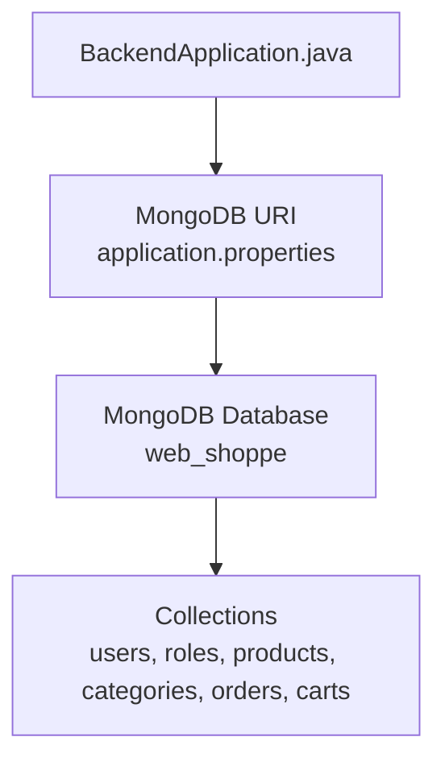
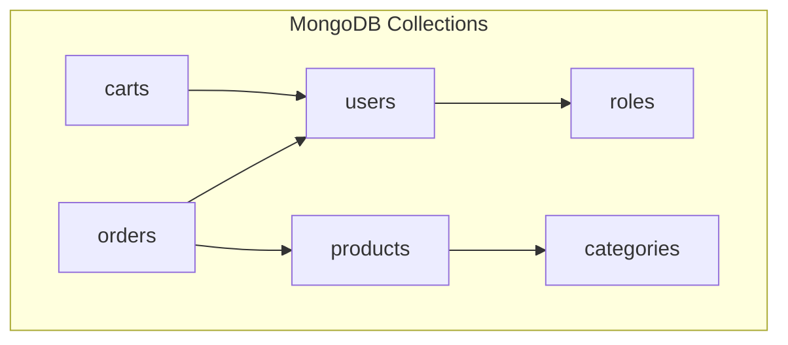
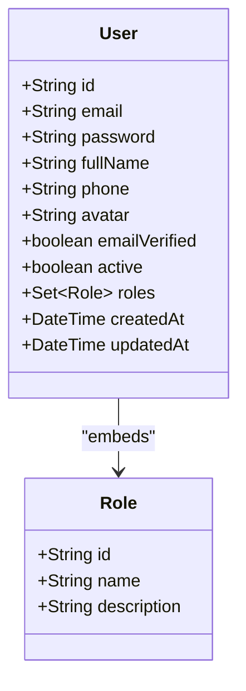
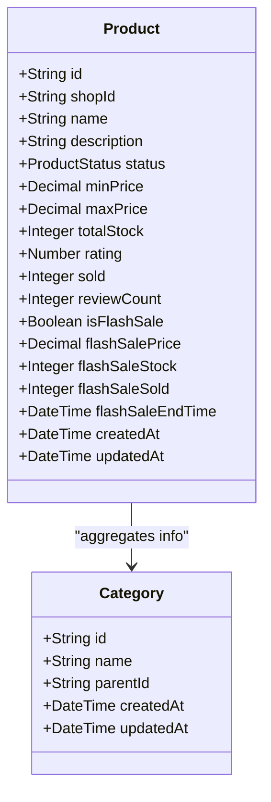
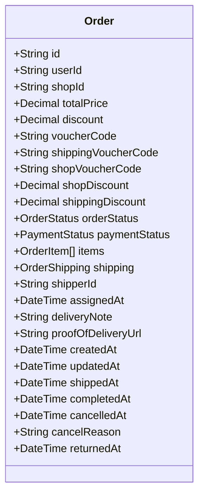
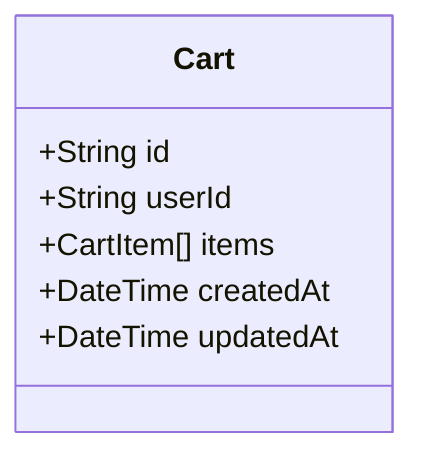
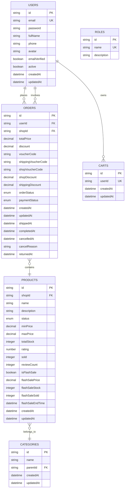

# Database Schema & Data Models

<cite>
**Referenced Files in This Document**
- [README.md](file://README.md)
- [application.properties](file://src/Backend/src/main/resources/application.properties)
- [MONGODB_SETUP_GUIDE.md](file://src/Backend/MONGODB_SETUP_GUIDE.md)
- [BackendApplication.java](file://src/Backend/src/main/java/com/shoppeclone/backend/BackendApplication.java)
- [User.java](file://src/Backend/src/main/java/com/shoppeclone/backend/auth/model/User.java)
- [Role.java](file://src/Backend/src/main/java/com/shoppeclone/backend/auth/model/Role.java)
- [Product.java](file://src/Backend/src/main/java/com/shoppeclone/backend/product/entity/Product.java)
- [Category.java](file://src/Backend/src/main/java/com/shoppeclone/backend/product/entity/Category.java)
- [Order.java](file://src/Backend/src/main/java/com/shoppeclone/backend/order/entry/Order.java)
- [Cart.java](file://src/Backend/src/main/java/com/shoppeclone/backend/cart/entry/Cart.java)
</cite>

## Table of Contents
1. [Introduction](#introduction)
2. [Project Structure](#project-structure)
3. [Core Components](#core-components)
4. [Architecture Overview](#architecture-overview)
5. [Detailed Component Analysis](#detailed-component-analysis)
6. [Dependency Analysis](#dependency-analysis)
7. [Performance Considerations](#performance-considerations)
8. [Troubleshooting Guide](#troubleshooting-guide)
9. [Conclusion](#conclusion)
10. [Appendices](#appendices)

## Introduction
This document provides comprehensive data model documentation for the MongoDB entities and relationships in the backend. It covers entity relationships, field definitions, data types, primary/foreign keys, indexes, constraints, validation and business rules, schema diagrams, sample data, data access patterns, caching strategies, performance considerations, data lifecycle and retention, archival rules, migration paths and versioning, security and privacy controls, and access control. The focus is on the core entities used in the system: users, roles, products, categories, orders, and carts.

## Project Structure
The backend is a Spring Boot application using MongoDB as the primary datastore. The application connects to MongoDB via Spring Data MongoDB and exposes REST APIs for business modules. The database configuration and environment variables are managed through application properties.

**Diagram sources**
- [application.properties:14-17](file://src/Backend/src/main/resources/application.properties#L14-L17)
- [BackendApplication.java](file://src/Backend/src/main/java/com/shoppeclone/backend/BackendApplication.java)

**Section sources**
- [README.md:150-157](file://README.md#L150-L157)
- [application.properties:14-17](file://src/Backend/src/main/resources/application.properties#L14-L17)

## Core Components
This section documents the core MongoDB entities and their relationships. Each entity is described with its fields, data types, and constraints. Indexes and foreign keys are highlighted to clarify data access patterns and referential integrity.

- Users
  - Collection: users
  - Fields:
    - id: String (ObjectId)
    - email: String (unique)
    - password: String
    - fullName: String
    - phone: String
    - avatar: String
    - emailVerified: Boolean
    - active: Boolean
    - roles: Set of Role (embedded)
    - createdAt: DateTime
    - updatedAt: DateTime
  - Constraints:
    - Unique index on email
    - Embedded roles set
  - Notes:
    - Roles are embedded directly in the user document.

- Roles
  - Collection: roles
  - Fields:
    - id: String (ObjectId)
    - name: String (unique)
    - description: String
  - Constraints:
    - Unique index on name

- Products
  - Collection: products
  - Fields:
    - id: String (ObjectId)
    - shopId: String (FK to shops.id)
    - name: String
    - description: String
    - status: Enum (ACTIVE, HIDDEN)
    - minPrice: Decimal
    - maxPrice: Decimal
    - totalStock: Integer
    - rating: Number
    - sold: Integer
    - reviewCount: Integer
    - isFlashSale: Boolean
    - flashSalePrice: Decimal
    - flashSaleStock: Integer
    - flashSaleSold: Integer
    - flashSaleEndTime: DateTime
    - createdAt: DateTime
    - updatedAt: DateTime
  - Constraints:
    - Index on shopId

- Categories
  - Collection: categories
  - Fields:
    - id: String (ObjectId)
    - name: String
    - parentId: String (FK to categories.id)
    - createdAt: DateTime
    - updatedAt: DateTime
  - Constraints:
    - Self-referencing via parentId

- Orders
  - Collection: orders
  - Fields:
    - id: String (ObjectId)
    - userId: String (FK to users.id)
    - shopId: String (FK to shops.id)
    - totalPrice: Decimal
    - discount: Decimal
    - voucherCode: String
    - shippingVoucherCode: String
    - shopVoucherCode: String
    - shopDiscount: Decimal
    - shippingDiscount: Decimal
    - orderStatus: Enum (PENDING, CONFIRMED, SHIPPED, COMPLETED, CANCELLED)
    - paymentStatus: Enum (UNPAID, PAID, FAILED, REFUNDED)
    - items: Array of OrderItem
    - shipping: OrderShipping
    - shipperId: String
    - assignedAt: DateTime
    - deliveryNote: String
    - proofOfDeliveryUrl: String
    - createdAt: DateTime
    - updatedAt: DateTime
    - shippedAt: DateTime
    - completedAt: DateTime
    - cancelledAt: DateTime
    - cancelReason: String
    - returnedAt: DateTime
  - Constraints:
    - Index on userId
    - Index on shopId

- Carts
  - Collection: carts
  - Fields:
    - id: String (ObjectId)
    - userId: String (unique)
    - items: Array of CartItem
    - createdAt: DateTime
    - updatedAt: DateTime
  - Constraints:
    - Unique index on userId

**Section sources**
- [User.java:13-38](file://src/Backend/src/main/java/com/shoppeclone/backend/auth/model/User.java#L13-L38)
- [Role.java:8-18](file://src/Backend/src/main/java/com/shoppeclone/backend/auth/model/Role.java#L8-L18)
- [Product.java:10-51](file://src/Backend/src/main/java/com/shoppeclone/backend/product/entity/Product.java#L10-L51)
- [Category.java:8-22](file://src/Backend/src/main/java/com/shoppeclone/backend/product/entity/Category.java#L8-L22)
- [Order.java:12-55](file://src/Backend/src/main/java/com/shoppeclone/backend/order/entry/Order.java#L12-L55)
- [Cart.java:11-25](file://src/Backend/src/main/java/com/shoppeclone/backend/cart/entry/Cart.java#L11-L25)

## Architecture Overview
The system follows a layered architecture with Spring MVC controllers, service layers, and repositories backed by MongoDB. Entities are mapped to collections with explicit indexes for common query patterns. Relationships are modeled using embedded documents and foreign keys stored as strings.

**Diagram sources**
- [User.java:29-30](file://src/Backend/src/main/java/com/shoppeclone/backend/auth/model/User.java#L29-L30)
- [Product.java:16-17](file://src/Backend/src/main/java/com/shoppeclone/backend/product/entity/Product.java#L16-L17)
- [Category.java:17](file://src/Backend/src/main/java/com/shoppeclone/backend/product/entity/Category.java#L17)
- [Order.java:20-24](file://src/Backend/src/main/java/com/shoppeclone/backend/order/entry/Order.java#L20-L24)
- [Cart.java:17-18](file://src/Backend/src/main/java/com/shoppeclone/backend/cart/entry/Cart.java#L17-L18)

## Detailed Component Analysis

### Users and Roles
- Embedding vs References:
  - Roles are embedded directly in the User document. This simplifies reads but requires updates to the entire user document when roles change.
- Indexing:
  - Unique index on email ensures uniqueness and efficient lookups by email.
- Constraints:
  - Active flag and email verification support account lifecycle management.
- Business Rules:
  - Default role assignment and promotion logic are handled during user creation and initialization.

**Diagram sources**
- [User.java:13-38](file://src/Backend/src/main/java/com/shoppeclone/backend/auth/model/User.java#L13-L38)
- [Role.java:8-18](file://src/Backend/src/main/java/com/shoppeclone/backend/auth/model/Role.java#L8-L18)

**Section sources**
- [User.java:19-20](file://src/Backend/src/main/java/com/shoppeclone/backend/auth/model/User.java#L19-L20)
- [User.java:29-30](file://src/Backend/src/main/java/com/shoppeclone/backend/auth/model/User.java#L29-L30)

### Products and Categories
- Hierarchical Categories:
  - Categories support a self-referencing parent-child relationship via parentId, enabling nested category structures.
- Product Aggregation:
  - Product documents maintain aggregated metrics (min/max price, total stock, rating, sold, review count) for efficient display.
- Flash Sale Fields:
  - Dedicated fields for flash sale pricing, stock, sold count, and end time facilitate promotional campaigns.
- Indexing:
  - shopId is indexed to optimize queries by shop ownership.

**Diagram sources**
- [Category.java:8-22](file://src/Backend/src/main/java/com/shoppeclone/backend/product/entity/Category.java#L8-L22)
- [Product.java:10-51](file://src/Backend/src/main/java/com/shoppeclone/backend/product/entity/Product.java#L10-L51)

**Section sources**
- [Category.java:16-17](file://src/Backend/src/main/java/com/shoppeclone/backend/product/entity/Category.java#L16-L17)
- [Product.java:16-17](file://src/Backend/src/main/java/com/shoppeclone/backend/product/entity/Product.java#L16-L17)
- [Product.java:33-39](file://src/Backend/src/main/java/com/shoppeclone/backend/product/entity/Product.java#L33-L39)
- [Product.java:41-46](file://src/Backend/src/main/java/com/shoppeclone/backend/product/entity/Product.java#L41-L46)

### Orders
- Composite Fields:
  - Multiple discount fields and voucher codes capture promotional discounts applied at different levels.
- Status Tracking:
  - Separate orderStatus and paymentStatus enums track lifecycle and payment state.
- Shipper Integration:
  - Fields for shipper assignment, delivery note, and proof of delivery image support logistics workflows.
- Indexing:
  - userId and shopId are indexed to accelerate order retrieval by user and shop.

**Diagram sources**
- [Order.java:12-55](file://src/Backend/src/main/java/com/shoppeclone/backend/order/entry/Order.java#L12-L55)

**Section sources**
- [Order.java:20-24](file://src/Backend/src/main/java/com/shoppeclone/backend/order/entry/Order.java#L20-L24)
- [Order.java:34-35](file://src/Backend/src/main/java/com/shoppeclone/backend/order/entry/Order.java#L34-L35)

### Carts
- One-to-One Relationship:
  - Each user has exactly one cart, enforced by a unique index on userId.
- Items Management:
  - CartItems array stores selected products and quantities for checkout.

**Diagram sources**
- [Cart.java:11-25](file://src/Backend/src/main/java/com/shoppeclone/backend/cart/entry/Cart.java#L11-L25)

**Section sources**
- [Cart.java:17-18](file://src/Backend/src/main/java/com/shoppeclone/backend/cart/entry/Cart.java#L17-L18)

### Data Access Patterns and Indexes
- Indexed Fields:
  - users.email: unique
  - carts.userId: unique
  - products.shopId
  - orders.userId
  - orders.shopId
- Query Patterns:
  - Lookup by email for authentication
  - Retrieve user’s cart by userId
  - Filter products by shopId
  - Fetch orders by userId or shopId
- Index Creation:
  - Unique indexes are declared via annotations; compound indexes can be added as needed for multi-field queries.

**Section sources**
- [User.java:19-20](file://src/Backend/src/main/java/com/shoppeclone/backend/auth/model/User.java#L19-L20)
- [Cart.java:17-18](file://src/Backend/src/main/java/com/shoppeclone/backend/cart/entry/Cart.java#L17-L18)
- [Product.java:16](file://src/Backend/src/main/java/com/shoppeclone/backend/product/entity/Product.java#L16)
- [Order.java:20-24](file://src/Backend/src/main/java/com/shoppeclone/backend/order/entry/Order.java#L20-L24)

### Sample Data
Below are representative samples for each collection. These illustrate typical shapes and relationships.

- Users
  - Example shape:
    - id: ObjectId
    - email: unique string
    - roles: array of embedded role objects
    - active: boolean
    - createdAt/updatedAt: timestamps

- Roles
  - Example shape:
    - id: ObjectId
    - name: unique string (e.g., ROLE_USER)
    - description: string

- Products
  - Example shape:
    - id: ObjectId
    - shopId: ObjectId
    - name: string
    - status: enum
    - minPrice/maxPrice: decimals
    - totalStock: integer
    - rating/sold/reviewCount: numbers
    - isFlashSale: boolean
    - flashSalePrice/stock/sold: decimals/integers
    - createdAt/updatedAt: timestamps

- Categories
  - Example shape:
    - id: ObjectId
    - name: string
    - parentId: ObjectId or null

- Orders
  - Example shape:
    - id: ObjectId
    - userId: ObjectId
    - shopId: ObjectId
    - orderStatus/paymentStatus: enums
    - items: array of order item objects
    - shipping: shipping object
    - timestamps for lifecycle events

- Carts
  - Example shape:
    - id: ObjectId
    - userId: ObjectId
    - items: array of cart item objects
    - createdAt/updatedAt: timestamps

**Section sources**
- [User.java:13-38](file://src/Backend/src/main/java/com/shoppeclone/backend/auth/model/User.java#L13-L38)
- [Role.java:8-18](file://src/Backend/src/main/java/com/shoppeclone/backend/auth/model/Role.java#L8-L18)
- [Product.java:10-51](file://src/Backend/src/main/java/com/shoppeclone/backend/product/entity/Product.java#L10-L51)
- [Category.java:8-22](file://src/Backend/src/main/java/com/shoppeclone/backend/product/entity/Category.java#L8-L22)
- [Order.java:12-55](file://src/Backend/src/main/java/com/shoppeclone/backend/order/entry/Order.java#L12-L55)
- [Cart.java:11-25](file://src/Backend/src/main/java/com/shoppeclone/backend/cart/entry/Cart.java#L11-L25)

## Dependency Analysis
Relationships among entities are primarily modeled as:
- Embedded: roles within users
- Foreign Keys: shopId in products, userId/shopId in orders, userId in carts
- Self-referencing: parentId in categories

**Diagram sources**
- [User.java:13-38](file://src/Backend/src/main/java/com/shoppeclone/backend/auth/model/User.java#L13-L38)
- [Role.java:8-18](file://src/Backend/src/main/java/com/shoppeclone/backend/auth/model/Role.java#L8-L18)
- [Product.java:10-51](file://src/Backend/src/main/java/com/shoppeclone/backend/product/entity/Product.java#L10-L51)
- [Category.java:8-22](file://src/Backend/src/main/java/com/shoppeclone/backend/product/entity/Category.java#L8-L22)
- [Order.java:12-55](file://src/Backend/src/main/java/com/shoppeclone/backend/order/entry/Order.java#L12-L55)
- [Cart.java:11-25](file://src/Backend/src/main/java/com/shoppeclone/backend/cart/entry/Cart.java#L11-L25)

**Section sources**
- [User.java:29-30](file://src/Backend/src/main/java/com/shoppeclone/backend/auth/model/User.java#L29-L30)
- [Product.java:16](file://src/Backend/src/main/java/com/shoppeclone/backend/product/entity/Product.java#L16)
- [Category.java:17](file://src/Backend/src/main/java/com/shoppeclone/backend/product/entity/Category.java#L17)
- [Order.java:20-24](file://src/Backend/src/main/java/com/shoppeclone/backend/order/entry/Order.java#L20-L24)
- [Cart.java:17-18](file://src/Backend/src/main/java/com/shoppeclone/backend/cart/entry/Cart.java#L17-L18)

## Performance Considerations
- Indexing Strategy:
  - Ensure unique indexes on frequently queried unique fields (users.email, carts.userId).
  - Add compound indexes for multi-field filters (e.g., shopId + status for products).
- Aggregation Fields:
  - Maintain aggregated fields in products to reduce join costs and improve read performance.
- Pagination and Sorting:
  - Use cursor-based pagination for large collections to avoid deep pagination overhead.
- Caching:
  - Cache frequently accessed static data (e.g., categories, roles) in memory to reduce DB load.
- Write Patterns:
  - Batch writes for bulk operations (e.g., seeding initial data).
- Concurrency:
  - Use atomic operations and optimistic locking for inventory updates (e.g., flash sale stock adjustments).

[No sources needed since this section provides general guidance]

## Troubleshooting Guide
- Connection Issues:
  - Verify MongoDB URI and credentials in application properties.
  - Confirm network connectivity and firewall rules for cloud instances.
- Authentication Failures:
  - Ensure correct username/password and authSource configuration.
- Startup Errors:
  - Check for circular dependency warnings and resolve bean wiring issues.
- Index Creation:
  - Unique constraint violations indicate missing or conflicting indexes; create unique indexes as needed.

**Section sources**
- [application.properties:14-17](file://src/Backend/src/main/resources/application.properties#L14-L17)
- [MONGODB_SETUP_GUIDE.md:159-173](file://src/Backend/MONGODB_SETUP_GUIDE.md#L159-L173)

## Conclusion
The MongoDB schema in this backend emphasizes embedded documents for roles and foreign key references for ownership relationships. Indexes are strategically placed to support common query patterns. Aggregated fields in products streamline display logic, while separate enums for order and payment statuses enable robust lifecycle tracking. The schema supports scalability through indexing, caching, and atomic write patterns, and it accommodates business needs such as flash sales and shipping workflows.

[No sources needed since this section summarizes without analyzing specific files]

## Appendices

### Data Lifecycle, Retention, and Archival
- Data Lifecycle:
  - Users: created, verified, active/inactive, deleted per policy.
  - Products: created, updated, hidden, archived via status.
  - Orders: pending -> confirmed -> shipped -> completed or cancelled; historical records retained.
  - Carts: ephemeral per user session; cleared after checkout or expiry.
- Retention Policies:
  - Define retention windows for orders and user sessions; archive old orders to cold storage if needed.
- Archival Rules:
  - Move inactive product catalogs and historical reports to separate collections or external storage.

[No sources needed since this section provides general guidance]

### Migration Paths and Version Management
- Schema Evolution:
  - Use explicit field additions and deprecations; avoid removing required fields.
  - Maintain backward compatibility for enums and optional fields.
- Migration Scripts:
  - Apply migrations via service initialization or dedicated scripts; record migration versions.
- Data Seeding:
  - Use seeders for initial data; ensure deterministic behavior and idempotency.

[No sources needed since this section provides general guidance]

### Security, Privacy, and Access Control
- Authentication:
  - JWT tokens for protected endpoints; refresh token rotation.
- Authorization:
  - Role-based access control (RBAC) enforced via method-level security and controller checks.
- Data Privacy:
  - Mask sensitive fields in logs; restrict exposure of personal data.
- Access Control:
  - Enforce ownership checks for user data and shop data; limit admin actions with audit trails.

**Section sources**
- [README.md:71-77](file://README.md#L71-L77)