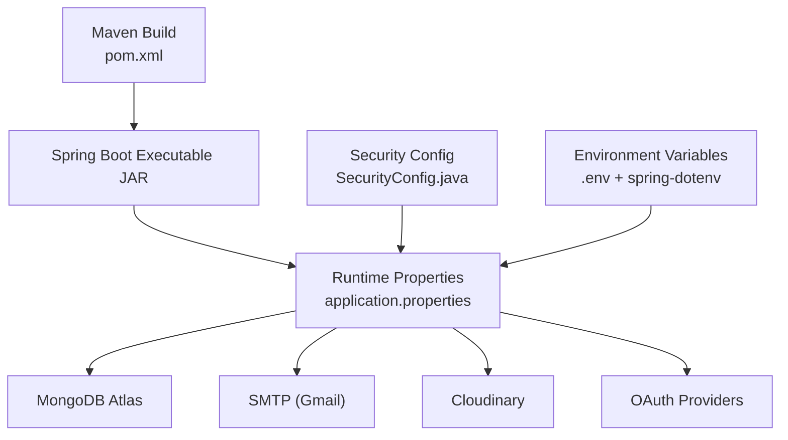
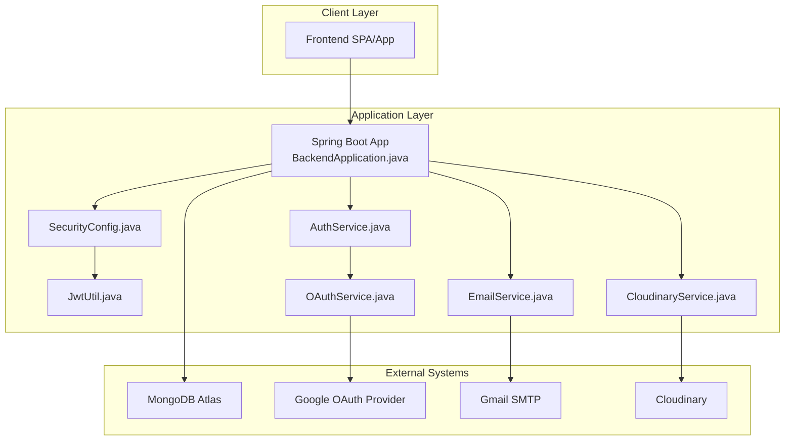
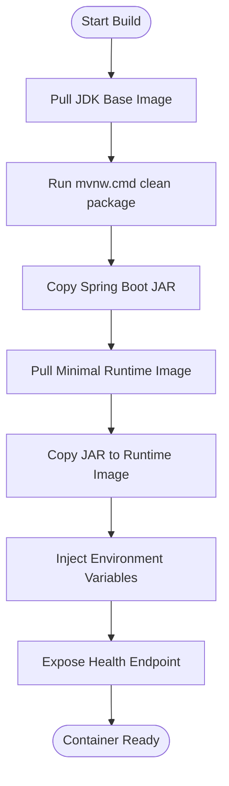
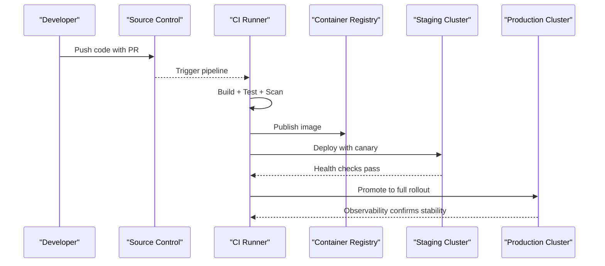
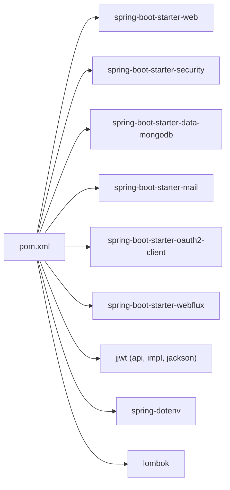

# Deployment & Production Configuration

<cite>
**Referenced Files in This Document**
- [pom.xml](file://src\Backend\pom.xml)
- [application.properties](file://src\Backend\src\main\resources\application.properties)
- [run-dev.bat](file://src\Backend\run-dev.bat)
- [mvnw.cmd](file://src\Backend\mvnw.cmd)
- [BackendApplication.java](file://src\Backend\src\main\java\com\shoppeclone\backend\BackendApplication.java)
- [SecurityConfig.java](file://src\Backend\src\main\java\com\shoppeclone\backend\auth\security\SecurityConfig.java)
- [JwtUtil.java](file://src\Backend\src\main\java\com\shoppeclone\backend\auth\security\JwtUtil.java)
- [CloudinaryConfig.java](file://src\Backend\src\main\java\com\shoppeclone\backend\common\config\CloudinaryConfig.java)
- [CorsConfig.java](file://src\Backend\src\main\java\com\shoppeclone\backend\common\config\CorsConfig.java)
- [DataInitializer.java](file://src\Backend\src\main\java\com\shoppeclone\backend\common\config\DataInitializer.java)
- [TimezoneConfig.java](file://src\Backend\src\main\java\com\shoppeclone\backend\common\config\TimezoneConfig.java)
- [OAuthService.java](file://src\Backend\src\main\java\com\shoppeclone\backend\auth\service\OAuthService.java)
- [AuthService.java](file://src\Backend\src\main\java\com\shoppeclone\backend\auth\service\AuthService.java)
- [EmailService.java](file://src\Backend\src\main\java\com\shoppeclone\backend\common\service\EmailService.java)
- [CloudinaryService.java](file://src\Backend\src\main\java\com\shoppeclone\backend\common\service\CloudinaryService.java)
- [log_AI.md](file://docs\ai_logs\log_AI.md)
</cite>

## Table of Contents
1. [Introduction](#introduction)
2. [Project Structure](#project-structure)
3. [Core Components](#core-components)
4. [Architecture Overview](#architecture-overview)
5. [Detailed Component Analysis](#detailed-component-analysis)
6. [Dependency Analysis](#dependency-analysis)
7. [Performance Considerations](#performance-considerations)
8. [Troubleshooting Guide](#troubleshooting-guide)
9. [Conclusion](#conclusion)
10. [Appendices](#appendices)

## Introduction
This section documents production-grade deployment and configuration for the backend service. It covers environment setup, configuration management, containerization options, deployment strategies, security hardening, monitoring and logging, performance tuning, CI/CD pipeline setup, rollback procedures, and disaster recovery planning. The guidance balances beginner-friendly explanations with technical depth for experienced operators, using terminology consistent with the codebase.

## Project Structure
The backend is a Spring Boot application configured via Maven and Spring properties. Key production-relevant elements include:
- Build and packaging via Maven with Spring Boot plugin
- Runtime configuration via externalized properties and environment variables
- Security configuration for production-grade authentication and authorization
- External integrations for email, image storage, and OAuth providers
- Development scripts for local startup and port management

**Diagram sources**
- [pom.xml:137-171](file://src\Backend\pom.xml#L137-L171)
- [application.properties:14-114](file://src\Backend\src\main\resources\application.properties#L14-L114)
- [SecurityConfig.java](file://src\Backend\src\main\java\com\shoppeclone\backend\auth\security\SecurityConfig.java)
- [log_AI.md:3096-3105](file://docs\ai_logs\log_AI.md#L3096-L3105)

**Section sources**
- [pom.xml:1-173](file://src\Backend\pom.xml#L1-L173)
- [application.properties:1-114](file://src\Backend\src\main\resources\application.properties#L1-L114)
- [run-dev.bat:1-12](file://src\Backend\run-dev.bat#L1-L12)
- [mvnw.cmd:1-190](file://src\Backend\mvnw.cmd#L1-L190)

## Core Components
- Build and Packaging
  - Maven coordinates Java 21, Spring Boot 3.2.3, and Spring Data MongoDB.
  - Spring Boot Maven Plugin configures the main class and excludes Lombok from the final artifact.
- Runtime Configuration
  - application.properties externalizes secrets and feature toggles via environment variables.
  - CORS, Tomcat thread pool, and timezone settings are tuned for production throughput and correctness.
- Security
  - JWT-based authentication with configurable expiration and signing.
  - OAuth2 client configuration for Google provider.
- Integrations
  - SMTP for OTP/email notifications.
  - Cloudinary for image upload.
- Initialization
  - DataInitializer seeds roles and other bootstrap data on startup.

**Section sources**
- [pom.xml:18-21](file://src\Backend\pom.xml#L18-L21)
- [pom.xml:155-169](file://src\Backend\pom.xml#L155-L169)
- [application.properties:14-114](file://src\Backend\src\main\resources\application.properties#L14-L114)
- [SecurityConfig.java](file://src\Backend\src\main\java\com\shoppeclone\backend\auth\security\SecurityConfig.java)
- [JwtUtil.java](file://src\Backend\src\main\java\com\shoppeclone\backend\auth\security\JwtUtil.java)
- [DataInitializer.java](file://src\Backend\src\main\java\com\shoppeclone\backend\common\config\DataInitializer.java)

## Architecture Overview
Production runtime architecture centers on a single Spring Boot process serving HTTP traffic, connecting to MongoDB Atlas, integrating with Google OAuth, sending emails via SMTP, and uploading images to Cloudinary. Security is enforced centrally via Spring Security and JWT.

**Diagram sources**
- [BackendApplication.java](file://src\Backend\src\main\java\com\shoppeclone\backend\BackendApplication.java)
- [SecurityConfig.java](file://src\Backend\src\main\java\com\shoppeclone\backend\auth\security\SecurityConfig.java)
- [JwtUtil.java](file://src\Backend\src\main\java\com\shoppeclone\backend\auth\security\JwtUtil.java)
- [AuthService.java](file://src\Backend\src\main\java\com\shoppeclone\backend\auth\service\AuthService.java)
- [OAuthService.java](file://src\Backend\src\main\java\com\shoppeclone\backend\auth\service\OAuthService.java)
- [EmailService.java](file://src\Backend\src\main\java\com\shoppeclone\backend\common\service\EmailService.java)
- [CloudinaryService.java](file://src\Backend\src\main\java\com\shoppeclone\backend\common\service\CloudinaryService.java)

## Detailed Component Analysis

### Configuration Management and Environment Variables
- Externalized Secrets
  - JWT secret, expiration, refresh expiration, and OTP expiration are loaded from environment variables.
  - OAuth client credentials and SMTP credentials are injected via environment variables.
  - Cloudinary credentials are environment-driven.
- Environment Files
  - spring-dotenv enables loading .env into the JVM for local development.
  - A .env.example template is maintained for team onboarding without exposing secrets.
- Property Precedence
  - application.properties uses placeholders that resolve to environment variables at runtime.
- CORS and Timezone
  - CORS allowed origins and methods are configurable.
  - Timezone is set to Asia/Ho_Chi_Minh for consistent date/time behavior.

Practical example scenarios:
- Local development: Create .env from .env.example, populate secrets, run run-dev.bat to start with port management.
- Staging: Set environment variables in the platform (e.g., Docker Compose or cloud provider secrets), ensure CORS matches staging frontend origin.
- Production: Use platform-managed secrets and immutable deployments; avoid committing .env.

**Section sources**
- [application.properties:25-89](file://src\Backend\src\main\resources\application.properties#L25-L89)
- [log_AI.md:3096-3105](file://docs\ai_logs\log_AI.md#L3096-L3105)
- [run-dev.bat:1-12](file://src\Backend\run-dev.bat#L1-L12)

### Security Considerations
- Authentication and Authorization
  - JWT-based session management with configurable expiration.
  - Centralized security configuration for request filters and access rules.
- OAuth Integration
  - Google OAuth client registration and provider endpoints are configured via properties.
- Secrets Handling
  - Never commit secrets; rely on environment variables and platform secret stores.
  - Use strong JWT secrets and rotate periodically.
- CORS Hardening
  - Restrict allowed origins to production domains in production environments.

**Section sources**
- [JwtUtil.java](file://src\Backend\src\main\java\com\shoppeclone\backend\auth\security\JwtUtil.java)
- [SecurityConfig.java](file://src\Backend\src\main\java\com\shoppeclone\backend\auth\security\SecurityConfig.java)
- [application.properties:58-67](file://src\Backend\src\main\resources\application.properties#L58-L67)

### Containerization Options
Recommended approaches:
- Multi-stage Docker build
  - Stage 1: Build with Maven wrapper (mvnw.cmd) using a JDK 21 base image.
  - Stage 2: Copy the Spring Boot fat JAR into a minimal runtime image (e.g., distroless or Alpine with JRE).
  - Entrypoint runs the main class configured in pom.xml.
- Environment injection
  - Pass secrets via environment variables at container launch.
  - Mount .env for local development if desired, but exclude from production images.
- Health checks
  - Add an HTTP health endpoint (e.g., GET /actuator/health) for liveness/readiness probes.

Containerization flow:

**Diagram sources**
- [mvnw.cmd:1-190](file://src\Backend\mvnw.cmd#L1-L190)
- [pom.xml:155-169](file://src\Backend\pom.xml#L155-L169)
- [application.properties:1-5](file://src\Backend\src\main\resources\application.properties#L1-L5)

### Deployment Strategies
- Rolling Updates
  - Deploy new image behind a load balancer; drain old instances after health checks pass.
- Blue-Green or Canary
  - Route a subset of traffic to the new version; monitor metrics and rollback if anomalies detected.
- Immutable Infrastructure
  - Replace containers instead of modifying running instances; enforce configuration via environment variables only.
- Secrets Management
  - Use platform secret managers (e.g., AWS Secrets Manager, Azure Key Vault, HashiCorp Vault) to inject secrets at runtime.

### Monitoring, Logging, and Observability
- Logging
  - Adjust log levels per package in application.properties for production (e.g., INFO for root, DEBUG selectively).
  - Ensure structured logging for centralized log aggregation (e.g., ELK or similar).
- Metrics
  - Expose Prometheus-compatible metrics via Spring Boot Actuator and scrape with Prometheus.
- Tracing
  - Integrate distributed tracing (e.g., OpenTelemetry) to track requests across services.
- Health Checks
  - Use /actuator/health for readiness/liveness probes.

**Section sources**
- [application.properties:45-49](file://src\Backend\src\main\resources\application.properties#L45-L49)

### Performance Tuning
- Tomcat Thread Pool
  - Increase max threads and accept count for high concurrency (e.g., during flash sale events).
  - Tune connection timeout to prevent resource exhaustion.
- Database and Caching
  - Use connection pooling and consider read replicas for MongoDB Atlas.
  - Add caching for frequently accessed data (e.g., product catalogs).
- Asynchronous Operations
  - Offload long-running tasks (email, image processing) to async workers.

**Section sources**
- [application.properties:103-108](file://src\Backend\src\main\resources\application.properties#L103-L108)

### CI/CD Pipeline Setup
Recommended stages:
- Build
  - Run mvnw.cmd clean verify to compile and test.
- Package
  - Produce Spring Boot JAR via Spring Boot Maven Plugin.
- Scan and Secure
  - Static analysis, SCA, SAST, and dependency vulnerability scans.
- Test
  - Unit and integration tests (ensure test databases are isolated).
- Release
  - Tag releases and publish artifacts.
- Deploy
  - Deploy to staging; run smoke tests; promote to production.
- Rollback
  - Keep previous image tag; swap routing to previous revision if needed.

[No sources needed since this diagram shows conceptual workflow, not actual code structure]

### Disaster Recovery Planning
- Backups
  - Schedule automated MongoDB Atlas backups; retain snapshots per RPO/RTO targets.
- Restore Drills
  - Periodically validate restoration procedures for critical data (users, orders, products).
- Multi-region
  - Deploy to multiple regions; use global load balancing with failover policies.
- Secrets Rotation
  - Automate rotation of JWT secrets, OAuth credentials, and SMTP credentials; update secrets in secret manager and redeploy.

## Dependency Analysis
Key runtime dependencies and their roles:
- Spring Boot Web: HTTP server and MVC stack
- Spring Security: Authentication and authorization
- Spring Data MongoDB: Persistence
- Spring Mail: Email delivery
- Spring OAuth2 Client: OAuth integrations
- JWT libraries: Token generation and validation
- spring-dotenv: Local .env support

**Diagram sources**
- [pom.xml:23-135](file://src\Backend\pom.xml#L23-L135)

**Section sources**
- [pom.xml:23-135](file://src\Backend\pom.xml#L23-L135)

## Performance Considerations
- Concurrency
  - Increase Tomcat threads and accept count for high-load scenarios.
- Network and Timeouts
  - Tune connection timeouts and keep-alive settings.
- Database
  - Use Atlas connection pooling and appropriate indexes; monitor slow queries.
- Caching and Async
  - Cache hot paths; offload email/image processing to async tasks.

**Section sources**
- [application.properties:103-108](file://src\Backend\src\main\resources\application.properties#L103-L108)

## Troubleshooting Guide
Common production issues and resolutions:
- Google OAuth 401 invalid_client
  - Ensure real OAuth client credentials are set in environment variables.
- Missing .env or secrets
  - Verify environment variable injection and .env presence for local runs.
- Port conflicts during local startup
  - Use run-dev.bat to kill processes on the configured port before starting.
- CORS errors
  - Confirm allowed origins match the deployed frontend domain.

**Section sources**
- [log_AI.md:16719-16722](file://docs\ai_logs\log_AI.md#L16719-L16722)
- [run-dev.bat:4-8](file://src\Backend\run-dev.bat#L4-L8)
- [application.properties:92-95](file://src\Backend\src\main\resources\application.properties#L92-L95)

## Conclusion
This guide provides a production-ready blueprint for deploying and operating the backend service. By externalizing configuration, enforcing security best practices, adopting robust deployment strategies, and instrumenting observability, teams can achieve reliable, scalable, and maintainable operations across environments.

## Appendices

### Appendix A: Environment Variable Reference
- JWT
  - JWT_SECRET: Strong secret for signing tokens
  - JWT_EXPIRATION: Access token TTL (milliseconds)
  - JWT_REFRESH_EXPIRATION: Refresh token TTL (milliseconds)
  - OTP_EXPIRATION: OTP TTL (milliseconds)
- MongoDB
  - MONGODB_URI: MongoDB Atlas connection string
- OAuth (Google)
  - GOOGLE_CLIENT_ID
  - GOOGLE_CLIENT_SECRET
- Email (Gmail SMTP)
  - MAIL_USERNAME
  - MAIL_PASSWORD
- Cloudinary
  - CLOUDINARY_CLOUD_NAME
  - CLOUDINARY_API_KEY
  - CLOUDINARY_API_SECRET
- CORS
  - Allowed origins, methods, headers, and credentials are configured in application.properties

**Section sources**
- [application.properties:25-89](file://src\Backend\src\main\resources\application.properties#L25-L89)

### Appendix B: Startup and Local Development
- Local run
  - Use run-dev.bat to manage port conflicts and start the app.
  - Maven wrapper (mvnw.cmd) ensures consistent builds across environments.

**Section sources**
- [run-dev.bat:1-12](file://src\Backend\run-dev.bat#L1-L12)
- [mvnw.cmd:1-190](file://src\Backend\mvnw.cmd#L1-L190)