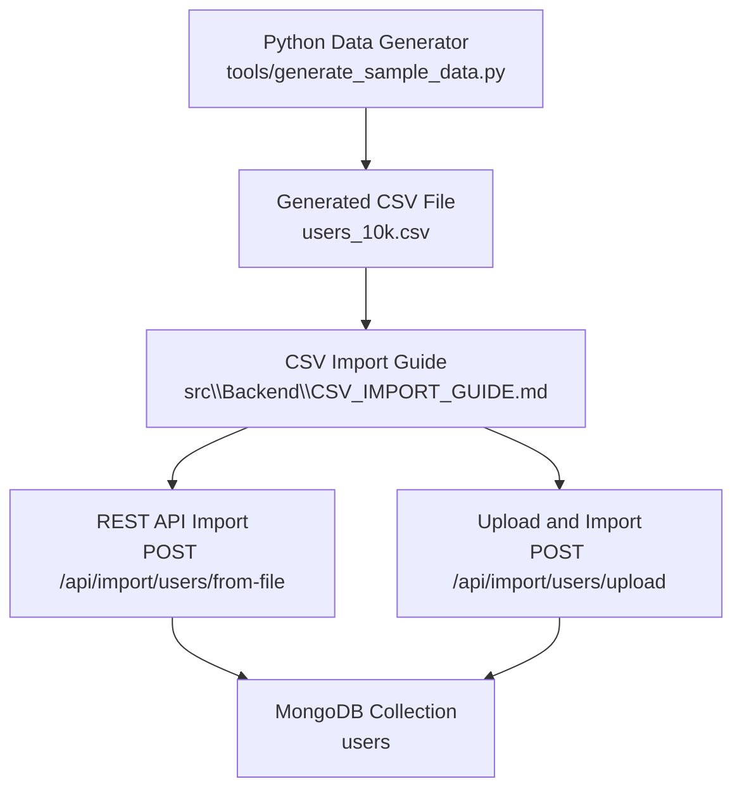
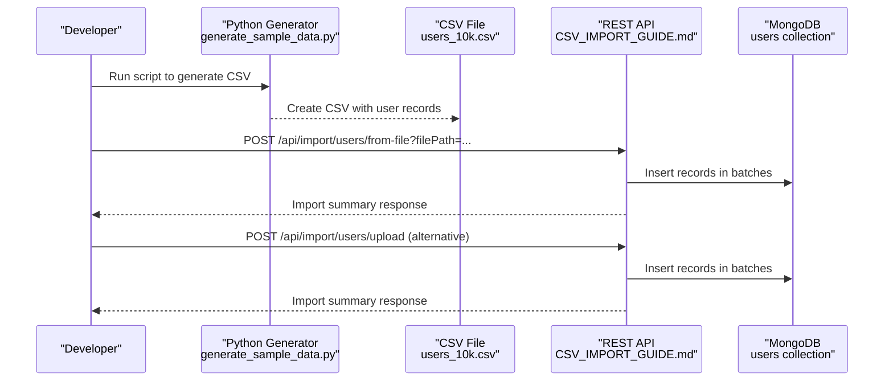
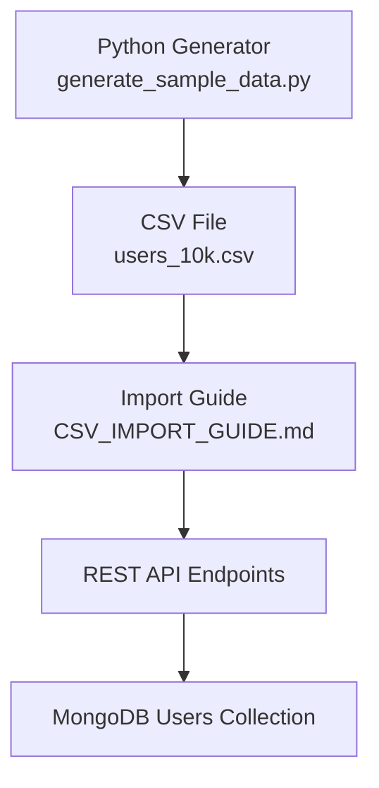

# Data Generation & Sample Data Tools

<cite>
**Referenced Files in This Document**
- [generate_sample_data.py](file://tools/generate_sample_data.py)
- [CSV_IMPORT_GUIDE.md](file://src\Backend\CSV_IMPORT_GUIDE.md)
- [SAMPLE_DATA_README.md](file://src\Backend\SAMPLE_DATA_README.md)
- [users_10k.csv](file://src\Backend\users_10k.csv)
</cite>

## Table of Contents
1. [Introduction](#introduction)
2. [Project Structure](#project-structure)
3. [Core Components](#core-components)
4. [Architecture Overview](#architecture-overview)
5. [Detailed Component Analysis](#detailed-component-analysis)
6. [Dependency Analysis](#dependency-analysis)
7. [Performance Considerations](#performance-considerations)
8. [Troubleshooting Guide](#troubleshooting-guide)
9. [Conclusion](#conclusion)
10. [Appendices](#appendices)

## Introduction
This section documents the data generation and sample data utilities for creating realistic test data. It explains the purpose of the Python data generator script, the CSV import guide for loading data into the system, and the configuration options for generating different types of sample data. Practical examples demonstrate how to generate large datasets, import CSV data, and validate data integrity. The document also covers CSV formatting standards, bulk data loading procedures, data validation rules, error handling mechanisms, best practices, and performance considerations.

## Project Structure
The data generation and import workflow spans two primary areas:
- Python data generator: Creates CSV files with realistic user records.
- CSV import guide: Documents how to import CSV data into the system via REST APIs and MongoDB.

**Diagram sources**
- [generate_sample_data.py](file://tools/generate_sample_data.py)
- [CSV_IMPORT_GUIDE.md](file://src\Backend\CSV_IMPORT_GUIDE.md)
- [users_10k.csv](file://src\Backend\users_10k.csv)

**Section sources**
- [CSV_IMPORT_GUIDE.md](file://src\Backend\CSV_IMPORT_GUIDE.md)
- [SAMPLE_DATA_README.md](file://src\Backend\SAMPLE_DATA_README.md)

## Core Components
- Python data generator script: Produces CSV files with configurable record counts and realistic Vietnamese user attributes.
- CSV import guide: Provides step-by-step instructions for importing CSV data via REST APIs and validating the results.
- Pre-generated CSV dataset: Includes a ready-to-use CSV file with 10,000 user records for immediate testing.

Key capabilities:
- Generate large datasets quickly with customizable record counts.
- Produce CSV files with UTF-8-BOM encoding for international character support.
- Provide REST endpoints for server-side file import and direct upload import.
- Offer batch processing guidance and performance tips for bulk imports.

**Section sources**
- [generate_sample_data.py](file://tools/generate_sample_data.py)
- [CSV_IMPORT_GUIDE.md](file://src\Backend\CSV_IMPORT_GUIDE.md)
- [SAMPLE_DATA_README.md](file://src\Backend\SAMPLE_DATA_README.md)
- [users_10k.csv](file://src\Backend\users_10k.csv)

## Architecture Overview
The data generation and import pipeline integrates a Python script with a Spring Boot REST API and MongoDB. The Python script generates CSV files locally, which are then imported either by uploading them to the API or by pointing the API to a server-side file path.

**Diagram sources**
- [generate_sample_data.py](file://tools/generate_sample_data.py)
- [CSV_IMPORT_GUIDE.md](file://src\Backend\CSV_IMPORT_GUIDE.md)
- [users_10k.csv](file://src\Backend\users_10k.csv)

## Detailed Component Analysis

### Python Data Generator
Purpose:
- Create CSV files containing realistic user records with Vietnamese names, emails, passwords, and phone numbers.

Implementation highlights:
- Generates full names using Vietnamese surnames, middle names, and first names.
- Creates usernames by normalizing Vietnamese names and applying multiple pattern strategies.
- Produces emails using common domains and appends a numeric suffix for uniqueness.
- Generates phone numbers conforming to Vietnamese mobile prefixes.
- Writes CSV with UTF-8-BOM encoding and a fixed set of columns.

Configuration options:
- Record count: Modify the argument passed to the generation function to produce more or fewer records.
- Output file: The script writes to a predefined CSV filename.

Data generation algorithm:
- Iterates over the desired number of records.
- For each record, constructs a full name, username, email, password, and phone number.
- Writes each row to the CSV file and prints progress updates.

CSV formatting standards:
- Header row defines the column order.
- Values are separated by commas.
- File encoding is UTF-8-BOM to support Vietnamese characters.

Bulk data loading procedures:
- The script itself does not perform bulk inserts; it produces a CSV file for later import via REST APIs.

Validation and error handling:
- The script prints progress during generation.
- No explicit error handling for file writing is present in the script.

Practical example:
- Generate a CSV with 10,000 records by invoking the script with the appropriate argument.
- Use the resulting CSV file to import data via the REST API endpoints documented in the CSV import guide.

**Section sources**
- [generate_sample_data.py](file://tools/generate_sample_data.py)

### CSV Import Guide
Purpose:
- Provide a comprehensive guide to import CSV data into MongoDB using REST APIs and validate the results.

Endpoints:
- Import from server file: POST endpoint that accepts an absolute file path.
- Upload and import: POST endpoint that accepts multipart form data containing the CSV file.
- Count users: GET endpoint to retrieve total user count.
- Clear users: DELETE endpoint to remove all users (use with caution).

Import behavior:
- Batch processing is recommended to optimize memory usage and performance.
- The guide specifies typical batch sizes and expected performance characteristics.

Data validation rules:
- Unique constraints on identifiers (e.g., username or email) may cause duplicates if not handled.
- The guide advises clearing existing data or ensuring unique identifiers before importing.

Error handling mechanisms:
- Guidance for common issues such as file path errors, connection problems, and duplicate key conflicts.
- Recommendations to back up the database before large imports.

Practical example:
- Start the Spring Boot application.
- Use the POST endpoint to import from a server-side file or upload a CSV via multipart form data.
- Verify the import by checking the user count and optionally retrieving a subset of records.

**Section sources**
- [CSV_IMPORT_GUIDE.md](file://src\Backend\CSV_IMPORT_GUIDE.md)

### Pre-generated CSV Dataset
Purpose:
- Provide a ready-to-use CSV dataset for immediate testing and validation.

Characteristics:
- Contains 10,000 user records.
- Includes headers and UTF-8-BOM encoding.
- Suitable for direct import via REST APIs or MongoDB import tools.

Usage:
- Import using the documented REST endpoints or MongoDB import utilities.
- Validate the import by querying the database and verifying counts.

**Section sources**
- [users_10k.csv](file://src\Backend\users_10k.csv)

## Dependency Analysis
The data generation and import workflow involves the following dependencies:
- Python generator depends on standard libraries for CSV writing and randomization.
- CSV import guide references REST API endpoints and MongoDB collection names.
- Pre-generated CSV file serves as the input artifact for import operations.

**Diagram sources**
- [generate_sample_data.py](file://tools/generate_sample_data.py)
- [CSV_IMPORT_GUIDE.md](file://src\Backend\CSV_IMPORT_GUIDE.md)
- [users_10k.csv](file://src\Backend\users_10k.csv)

**Section sources**
- [CSV_IMPORT_GUIDE.md](file://src\Backend\CSV_IMPORT_GUIDE.md)

## Performance Considerations
- Batch size: Use batch processing to manage memory usage and improve throughput during imports.
- Record count: Larger datasets require more time and resources; adjust batch sizes accordingly.
- Encoding: UTF-8-BOM ensures proper rendering of Vietnamese characters in CSV files.
- Network and disk I/O: For server-side file imports, ensure the file path is accessible and the disk has sufficient I/O capacity.
- Database indexing: Unique indexes on identifiers can impact import performance and may require careful handling of duplicates.

[No sources needed since this section provides general guidance]

## Troubleshooting Guide
Common issues and resolutions:
- File path errors: Ensure the absolute file path is correct and accessible by the API server.
- Connection problems: Verify MongoDB connectivity and connection string configuration.
- Duplicate key conflicts: Clear existing data or ensure unique identifiers before importing.
- Large dataset import: Increase batch size and consider backing up the database prior to import.

**Section sources**
- [CSV_IMPORT_GUIDE.md](file://src\Backend\CSV_IMPORT_GUIDE.md)

## Conclusion
The data generation and sample data tools provide a streamlined workflow for creating realistic test data and importing it efficiently into MongoDB via REST APIs. The Python generator produces CSV files with UTF-8-BOM encoding, while the CSV import guide outlines robust procedures for bulk imports, validation, and troubleshooting. By following the documented endpoints and best practices, developers can generate large datasets, import them reliably, and maintain data integrity.

[No sources needed since this section summarizes without analyzing specific files]

## Appendices
- Quick start steps:
  - Generate CSV using the Python script.
  - Start the Spring Boot application.
  - Import data via the documented REST endpoints.
  - Validate the import by checking counts and retrieving sample records.

- Additional resources:
  - Refer to the CSV import guide for detailed API documentation and troubleshooting tips.
  - Consult the sample data readme for quick-start instructions and performance notes.

**Section sources**
- [CSV_IMPORT_GUIDE.md](file://src\Backend\CSV_IMPORT_GUIDE.md)
- [SAMPLE_DATA_README.md](file://src\Backend\SAMPLE_DATA_README.md)