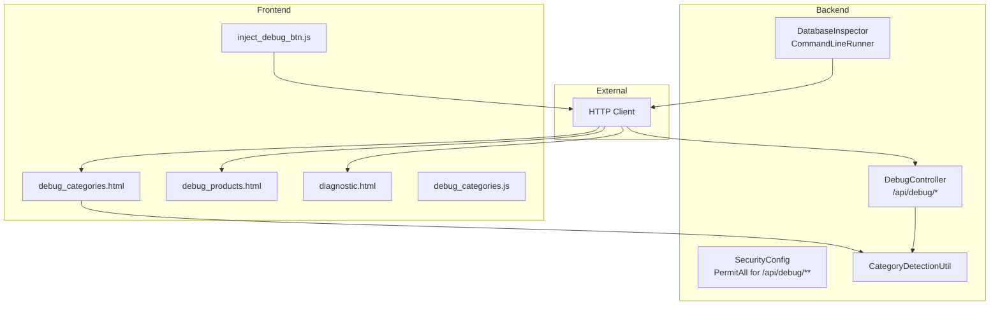
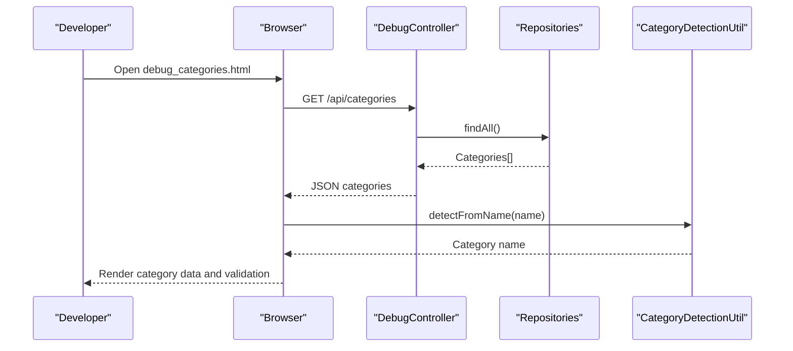
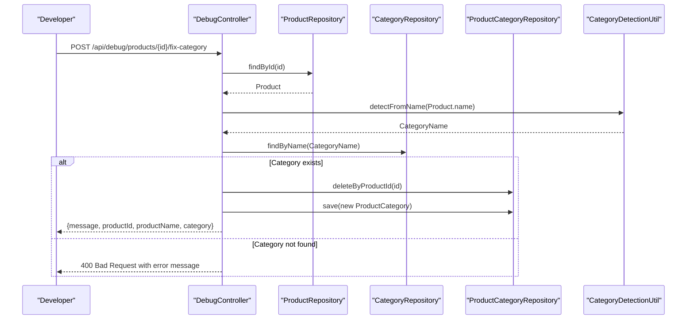
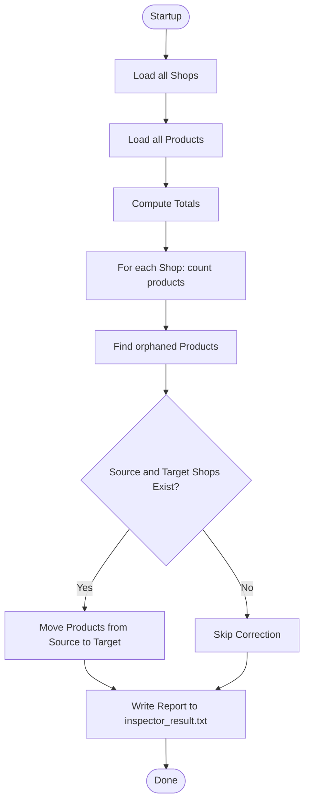
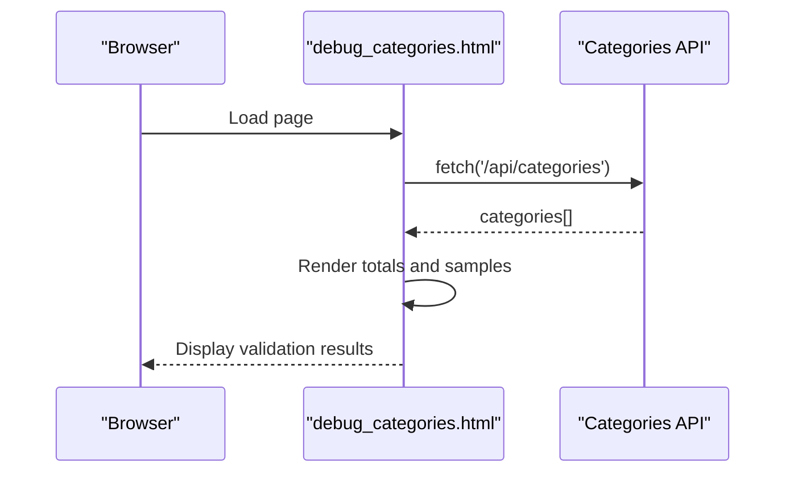
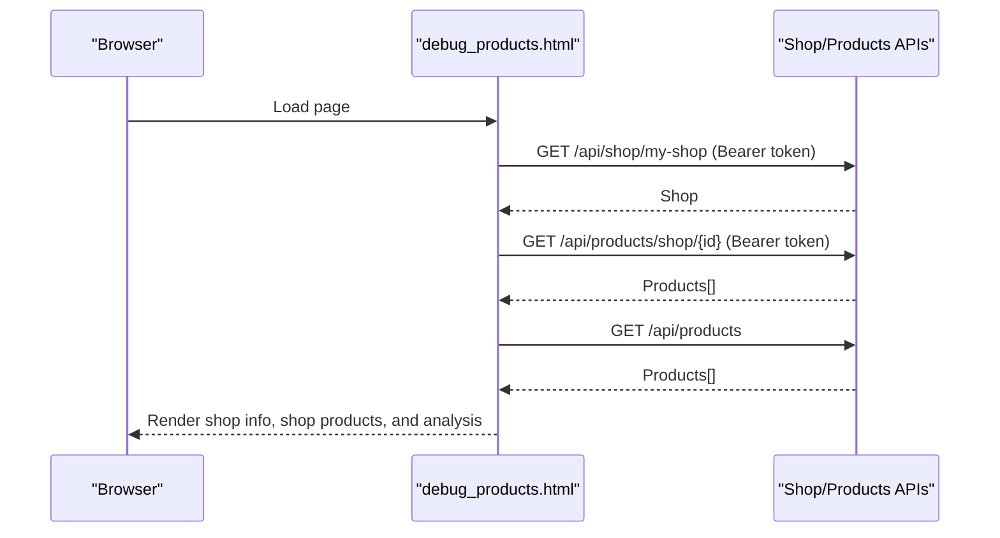
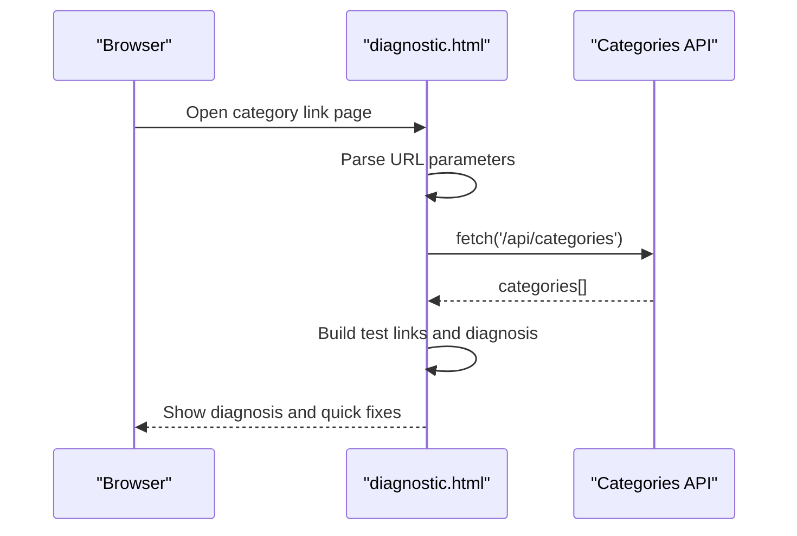
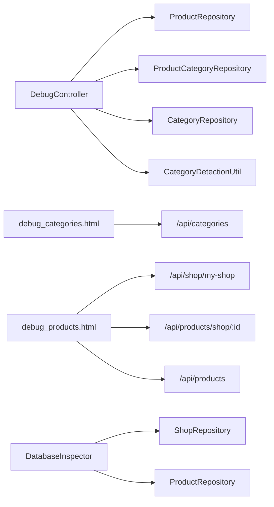

# Debugging & Diagnostic Tools

<cite>
**Referenced Files in This Document**
- [DebugController.java](file://src/backend/src/main/java/com/shoppeclone/backend/common/controller/DebugController.java)
- [DatabaseInspector.java](file://src/backend/src/main/java/com/shoppeclone/backend/common/DatabaseInspector.java)
- [SecurityConfig.java](file://src/backend/src/main/java/com/shoppeclone/backend/auth/security/SecurityConfig.java)
- [CategoryDetectionUtil.java](file://src/backend/src/main/java/com/shoppeclone/backend/product/util/CategoryDetectionUtil.java)
- [debug_categories.html](file://src/backend/src/main/resources/static/debug_categories.html)
- [debug_products.html](file://src/backend/src/main/resources/static/debug_products.html)
- [diagnostic.html](file://src/backend/src/main/resources/static/diagnostic.html)
- [debug_categories.js](file://src/Frontend/js/debug_categories.js)
- [inject_debug_btn.js](file://src/Frontend/js/inject_debug_btn.js)
- [application.properties](file://src/backend/src/main/resources/application.properties)
- [test-api.ps1](file://tools/test-api.ps1)
</cite>

## Table of Contents
1. [Introduction](#introduction)
2. [Project Structure](#project-structure)
3. [Core Components](#core-components)
4. [Architecture Overview](#architecture-overview)
5. [Detailed Component Analysis](#detailed-component-analysis)
6. [Dependency Analysis](#dependency-analysis)
7. [Performance Considerations](#performance-considerations)
8. [Troubleshooting Guide](#troubleshooting-guide)
9. [Conclusion](#conclusion)

## Introduction
This section documents the debugging and diagnostic utilities built into the application. It covers:
- DebugController endpoints for testing API responses and fixing product categories
- DatabaseInspector for runtime diagnostics and consistency checks
- Static HTML diagnostic pages for front-end debugging and URL parameter validation
- Configuration options for enabling debug endpoints and interpreting results
- Practical examples for troubleshooting API issues, validating database consistency, and testing front-end functionality
- Best practices and security considerations for debug tools

## Project Structure
The debugging and diagnostics span three layers:
- Backend REST endpoints under /api/debug
- Command-line database inspector that writes diagnostics to a file
- Static HTML pages and JavaScript utilities for front-end debugging

**Diagram sources**
- [DebugController.java:16-58](file://src/backend/src/main/java/com/shoppeclone/backend/common/controller/DebugController.java#L16-L58)
- [SecurityConfig.java:56-65](file://src/backend/src/main/java/com/shoppeclone/backend/auth/security/SecurityConfig.java#L56-L65)
- [DatabaseInspector.java:19-86](file://src/backend/src/main/java/com/shoppeclone/backend/common/DatabaseInspector.java#L19-L86)
- [CategoryDetectionUtil.java:12-70](file://src/backend/src/main/java/com/shoppeclone/backend/product/util/CategoryDetectionUtil.java#L12-L70)
- [debug_categories.html:42-83](file://src/backend/src/main/resources/static/debug_categories.html#L42-L83)
- [debug_products.html:35-115](file://src/backend/src/main/resources/static/debug_products.html#L35-L115)
- [diagnostic.html:55-130](file://src/backend/src/main/resources/static/diagnostic.html#L55-L130)
- [debug_categories.js:1-19](file://src/Frontend/js/debug_categories.js#L1-L19)
- [inject_debug_btn.js:1-37](file://src/Frontend/js/inject_debug_btn.js#L1-L37)

**Section sources**
- [DebugController.java:16-58](file://src/backend/src/main/java/com/shoppeclone/backend/common/controller/DebugController.java#L16-L58)
- [DatabaseInspector.java:19-86](file://src/backend/src/main/java/com/shoppeclone/backend/common/DatabaseInspector.java#L19-L86)
- [SecurityConfig.java:56-65](file://src/backend/src/main/java/com/shoppeclone/backend/auth/security/SecurityConfig.java#L56-L65)
- [debug_categories.html:1-86](file://src/backend/src/main/resources/static/debug_categories.html#L1-L86)
- [debug_products.html:1-118](file://src/backend/src/main/resources/static/debug_products.html#L1-L118)
- [diagnostic.html:1-133](file://src/backend/src/main/resources/static/diagnostic.html#L1-L133)

## Core Components
- DebugController: Provides endpoints to list product-category mappings and to auto-fix a product’s category by name detection.
- DatabaseInspector: Runs at startup to inspect shop-product counts, detect orphaned products, and write a report to a file.
- Static diagnostic pages: Provide front-end testing and URL parameter validation for category navigation.
- Front-end utilities: JavaScript helpers to inspect API responses and inject temporary debug buttons.

**Section sources**
- [DebugController.java:25-56](file://src/backend/src/main/java/com/shoppeclone/backend/common/controller/DebugController.java#L25-L56)
- [DatabaseInspector.java:24-84](file://src/backend/src/main/java/com/shoppeclone/backend/common/DatabaseInspector.java#L24-L84)
- [debug_categories.html:42-83](file://src/backend/src/main/resources/static/debug_categories.html#L42-L83)
- [debug_products.html:39-114](file://src/backend/src/main/resources/static/debug_products.html#L39-L114)
- [diagnostic.html:55-130](file://src/backend/src/main/resources/static/diagnostic.html#L55-L130)
- [debug_categories.js:1-19](file://src/Frontend/js/debug_categories.js#L1-L19)
- [inject_debug_btn.js:1-37](file://src/Frontend/js/inject_debug_btn.js#L1-L37)

## Architecture Overview
The debug architecture integrates REST endpoints, static pages, and CLI diagnostics:
- REST endpoints are permitted without authentication for development (/api/debug/**)
- Static pages run client-side and call backend APIs
- DatabaseInspector runs once at startup and logs a summary to a file

**Diagram sources**
- [debug_categories.html:42-83](file://src/backend/src/main/resources/static/debug_categories.html#L42-L83)
- [DebugController.java:25-28](file://src/backend/src/main/java/com/shoppeclone/backend/common/controller/DebugController.java#L25-L28)
- [CategoryDetectionUtil.java:12-70](file://src/backend/src/main/java/com/shoppeclone/backend/product/util/CategoryDetectionUtil.java#L12-L70)

## Detailed Component Analysis

### DebugController Endpoints
Purpose:
- Expose a read-only endpoint to list product-category mappings for inspection
- Provide a mutation endpoint to reassign a product’s category based on its name

Endpoints:
- GET /api/debug/product-categories
  - Returns all product-category records
  - Useful for verifying referential integrity between products and categories
- POST /api/debug/products/{productId}/fix-category
  - Detects category from product name and updates the product-category mapping
  - Helps ensure promotional vouchers apply correctly when a product lacks a category

Implementation highlights:
- Uses repositories to fetch product, category, and mapping entities
- Applies CategoryDetectionUtil to infer category name from product name
- Returns structured messages indicating success or failure

**Diagram sources**
- [DebugController.java:36-56](file://src/backend/src/main/java/com/shoppeclone/backend/common/controller/DebugController.java#L36-L56)
- [CategoryDetectionUtil.java:12-70](file://src/backend/src/main/java/com/shoppeclone/backend/product/util/CategoryDetectionUtil.java#L12-L70)

**Section sources**
- [DebugController.java:25-56](file://src/backend/src/main/java/com/shoppeclone/backend/common/controller/DebugController.java#L25-L56)
- [CategoryDetectionUtil.java:12-70](file://src/backend/src/main/java/com/shoppeclone/backend/product/util/CategoryDetectionUtil.java#L12-L70)

### DatabaseInspector (CLI Diagnostic)
Purpose:
- At startup, scan shops and products to compute counts and detect anomalies
- Write a human-readable report to inspector_result.txt

Key behaviors:
- Counts total shops and products
- For each shop, counts associated products
- Identifies orphaned products (missing or invalid shopId)
- Performs corrective moves of products between specific shops when discrepancies are found
- Logs the entire inspection and correction process to a file

**Diagram sources**
- [DatabaseInspector.java:24-84](file://src/backend/src/main/java/com/shoppeclone/backend/common/DatabaseInspector.java#L24-L84)

**Section sources**
- [DatabaseInspector.java:19-86](file://src/backend/src/main/java/com/shoppeclone/backend/common/DatabaseInspector.java#L19-L86)

### Static HTML Diagnostic Pages

#### debug_categories.html
- Purpose: Inspect category API responses and validate data structure
- Behavior:
  - Automatically tests the categories endpoint on load
  - Displays total categories, per-category details, and generated URLs for category.html
  - Highlights presence of id/_id fields and validates URL construction

**Diagram sources**
- [debug_categories.html:42-83](file://src/backend/src/main/resources/static/debug_categories.html#L42-L83)

**Section sources**
- [debug_categories.html:1-86](file://src/backend/src/main/resources/static/debug_categories.html#L1-L86)

#### debug_products.html
- Purpose: Validate shop and product associations for the current user
- Behavior:
  - Reads access token from local storage
  - Fetches current shop info and products by shop
  - Lists all products (first 20) with a quick mismatch analysis against the current shop ID

**Diagram sources**
- [debug_products.html:39-114](file://src/backend/src/main/resources/static/debug_products.html#L39-L114)

**Section sources**
- [debug_products.html:1-118](file://src/backend/src/main/resources/static/debug_products.html#L1-L118)

#### diagnostic.html
- Purpose: Diagnose category link navigation issues by inspecting URL parameters and generating test links
- Behavior:
  - Parses current URL parameters and reports validity
  - Generates clickable test links using real category IDs from the API
  - Provides quick fixes for common navigation problems

**Diagram sources**
- [diagnostic.html:55-130](file://src/backend/src/main/resources/static/diagnostic.html#L55-L130)

**Section sources**
- [diagnostic.html:1-133](file://src/backend/src/main/resources/static/diagnostic.html#L1-L133)

### Front-end Debugging Utilities

#### debug_categories.js
- Purpose: Inspect categories API response in the browser console
- Behavior:
  - Calls the categories endpoint
  - Logs the keys and a sample of the first category for inspection

**Section sources**
- [debug_categories.js:1-19](file://src/Frontend/js/debug_categories.js#L1-L19)

#### inject_debug_btn.js
- Purpose: Inject a temporary debug button into a profile page to test refresh token flow
- Behavior:
  - Reads a local HTML file, injects a button, and attaches a handler to call the refresh endpoint
  - Demonstrates manual token refresh testing during development

**Section sources**
- [inject_debug_btn.js:1-37](file://src/Frontend/js/inject_debug_btn.js#L1-L37)

## Dependency Analysis
- DebugController depends on repositories for product, category, and product-category mappings, and on CategoryDetectionUtil for inference
- Static pages depend on backend endpoints and local storage tokens
- DatabaseInspector depends on shop and product repositories and writes to a file
- SecurityConfig permitsAll for /api/debug/** and POST /api/debug/products/*/fix-category, enabling development testing without authentication

**Diagram sources**
- [DebugController.java:21-23](file://src/backend/src/main/java/com/shoppeclone/backend/common/controller/DebugController.java#L21-L23)
- [CategoryDetectionUtil.java:12-70](file://src/backend/src/main/java/com/shoppeclone/backend/product/util/CategoryDetectionUtil.java#L12-L70)
- [debug_categories.html:42-83](file://src/backend/src/main/resources/static/debug_categories.html#L42-L83)
- [debug_products.html:39-114](file://src/backend/src/main/resources/static/debug_products.html#L39-L114)
- [DatabaseInspector.java:21-22](file://src/backend/src/main/java/com/shoppeclone/backend/common/DatabaseInspector.java#L21-L22)

**Section sources**
- [SecurityConfig.java:56-65](file://src/backend/src/main/java/com/shoppeclone/backend/auth/security/SecurityConfig.java#L56-L65)
- [DebugController.java:21-23](file://src/backend/src/main/java/com/shoppeclone/backend/common/controller/DebugController.java#L21-L23)
- [DatabaseInspector.java:21-22](file://src/backend/src/main/java/com/shoppeclone/backend/common/DatabaseInspector.java#L21-L22)

## Performance Considerations
- DebugController endpoints are lightweight and suitable for development but should not be exposed in production due to lack of authentication
- Static diagnostic pages perform small API calls and are efficient for interactive debugging
- DatabaseInspector runs once at startup and writes to disk; avoid running it frequently in production environments

## Troubleshooting Guide

### How to enable and access debug endpoints
- Debug endpoints are permitted without authentication in the current security configuration
- Access via:
  - GET http://localhost:8080/api/debug/product-categories
  - POST http://localhost:8080/api/debug/products/{productId}/fix-category

**Section sources**
- [SecurityConfig.java:56-65](file://src/backend/src/main/java/com/shoppeclone/backend/auth/security/SecurityConfig.java#L56-L65)

### Using debug_categories.html
- Open the page in a browser
- The page automatically calls the categories endpoint and displays:
  - Total number of categories
  - Sample category data structure
  - Generated links to category.html using id/name parameters
- Use the output to verify id/_id presence and URL correctness

**Section sources**
- [debug_categories.html:42-83](file://src/backend/src/main/resources/static/debug_categories.html#L42-L83)

### Using debug_products.html
- Ensure a valid access token is present in local storage
- The page:
  - Loads current shop info
  - Loads products for the current shop
  - Lists up to 20 products with a mismatch analysis against the current shop ID
- Use the analysis to confirm shop-product associations

**Section sources**
- [debug_products.html:39-114](file://src/backend/src/main/resources/static/debug_products.html#L39-L114)

### Using diagnostic.html
- Open the page from the category link URL
- The page:
  - Shows current URL and parsed parameters
  - Validates presence and length of category ID and name
  - Generates test links using real category IDs
- Follow the quick fixes to resolve navigation issues

**Section sources**
- [diagnostic.html:55-130](file://src/backend/src/main/resources/static/diagnostic.html#L55-L130)

### Running DatabaseInspector diagnostics
- Start the application; DatabaseInspector runs at startup
- Check inspector_result.txt for:
  - Total counts of shops and products
  - Per-shop product counts
  - Orphaned product detection
  - Correction actions performed
- Use the report to validate data consistency

**Section sources**
- [DatabaseInspector.java:24-84](file://src/backend/src/main/java/com/shoppeclone/backend/common/DatabaseInspector.java#L24-L84)

### Practical examples

- Troubleshooting API issues
  - Use debug_categories.html to verify categories endpoint returns expected fields and structure
  - Use debug_products.html to confirm shop and product associations for the current user

- Validating database consistency
  - Review inspector_result.txt after startup to check for orphaned products and corrective actions
  - Use GET /api/debug/product-categories to inspect product-category mappings

- Testing front-end functionality
  - Use diagnostic.html to validate URL parameters passed to category.html
  - Use debug_categories.js to inspect category API response in the console

- Fixing product category issues
  - Call POST /api/debug/products/{productId}/fix-category to reassign category based on product name
  - Verify the change by retrieving product-category mappings

**Section sources**
- [debug_categories.html:42-83](file://src/backend/src/main/resources/static/debug_categories.html#L42-L83)
- [debug_products.html:39-114](file://src/backend/src/main/resources/static/debug_products.html#L39-L114)
- [diagnostic.html:55-130](file://src/backend/src/main/resources/static/diagnostic.html#L55-L130)
- [DatabaseInspector.java:24-84](file://src/backend/src/main/java/com/shoppeclone/backend/common/DatabaseInspector.java#L24-L84)
- [DebugController.java:36-56](file://src/backend/src/main/java/com/shoppeclone/backend/common/controller/DebugController.java#L36-L56)

### Best practices for debug tool usage
- Keep debug endpoints disabled or restricted in production
- Use static diagnostic pages for front-end validation during development
- Run DatabaseInspector periodically to catch orphaned records early
- Prefer automated scripts (like test-api.ps1) for health checks and repetitive tasks

**Section sources**
- [test-api.ps1:76-82](file://tools/test-api.ps1#L76-L82)

### Security considerations for debug endpoints
- Current configuration permitsAll for /api/debug/**
- Recommended: Restrict access to trusted networks or disable in production
- Avoid exposing sensitive mutations in public debug routes

**Section sources**
- [SecurityConfig.java:56-65](file://src/backend/src/main/java/com/shoppeclone/backend/auth/security/SecurityConfig.java#L56-L65)

## Conclusion
The application provides a comprehensive set of debugging and diagnostic tools:
- REST endpoints for quick inspection and category fixes
- Static pages for front-end validation and URL parameter diagnosis
- Startup diagnostics to maintain data consistency
- Front-end utilities for interactive testing

Adopt the recommended best practices and security measures to ensure safe and effective use of these tools during development.