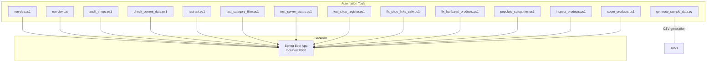
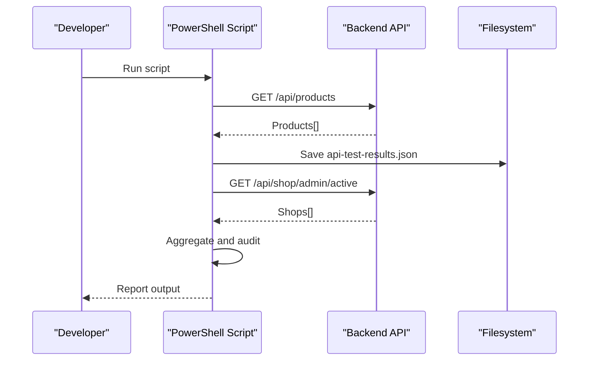
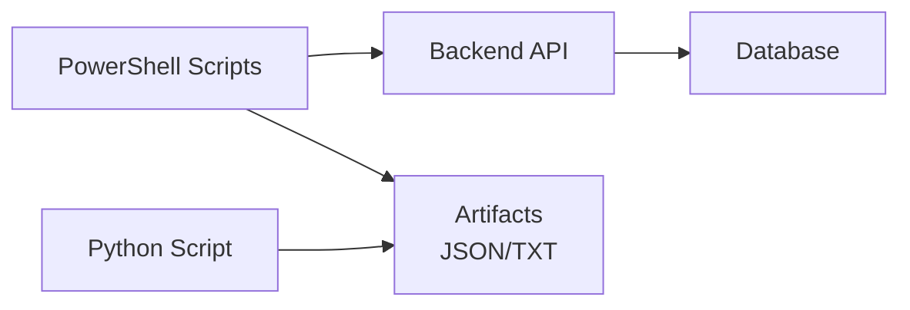

# Development Scripts & Automation

<cite>
**Referenced Files in This Document**
- [run-dev.ps1](file://tools/run-dev.ps1)
- [run-dev.bat](file://src\Backend\run-dev.bat)
- [audit_shops.ps1](file://tools/audit_shops.ps1)
- [check_current_data.ps1](file://tools/check_current_data.ps1)
- [test-api.ps1](file://tools/test-api.ps1)
- [test_category_filter.ps1](file://tools/test_category_filter.ps1)
- [test_server_status.ps1](file://tools/test_server_status.ps1)
- [test_shop_register.ps1](file://tools/test_shop_register.ps1)
- [fix_shop_links_safe.ps1](file://tools/fix_shop_links_safe.ps1)
- [fix_baribanai_products.ps1](file://tools/fix_baribanai_products.ps1)
- [populate_categories.ps1](file://tools/populate_categories.ps1)
- [inspect_products.ps1](file://tools/inspect_products.ps1)
- [count_products.ps1](file://tools/count_products.ps1)
- [generate_sample_data.py](file://tools/generate_sample_data.py)
</cite>

## Table of Contents
1. [Introduction](#introduction)
2. [Project Structure](#project-structure)
3. [Core Components](#core-components)
4. [Architecture Overview](#architecture-overview)
5. [Detailed Component Analysis](#detailed-component-analysis)
6. [Dependency Analysis](#dependency-analysis)
7. [Performance Considerations](#performance-considerations)
8. [Troubleshooting Guide](#troubleshooting-guide)
9. [Conclusion](#conclusion)

## Introduction
This section documents the PowerShell development scripts and automation tools used to streamline local development, data auditing, product fixes, and API testing. It explains the purpose and functionality of each script, implementation details, configuration options, usage patterns, and integration with the development workflow. Practical examples demonstrate how to use scripts for data cleanup, system maintenance, and automated testing. Guidance is also provided for script parameters, error handling, troubleshooting, best practices for execution, environment preparation, and batch operations for large-scale data manipulation.

## Project Structure
The automation tools reside under the tools directory and complement the Spring Boot backend located under src\Backend. Development scripts are organized by purpose:
- Local development startup and port management
- Data auditing and inspection
- Product fixes and category population
- API testing and health checks
- Utility scripts for counts and sample data generation

**Diagram sources**
- [run-dev.ps1:1-14](file://tools/run-dev.ps1#L1-L14)
- [run-dev.bat:1-12](file://src\Backend\run-dev.bat#L1-L12)
- [audit_shops.ps1:1-66](file://tools/audit_shops.ps1#L1-L66)
- [check_current_data.ps1:1-66](file://tools/check_current_data.ps1#L1-L66)
- [test-api.ps1:1-94](file://tools/test-api.ps1#L1-L94)
- [test_category_filter.ps1:1-90](file://tools/test_category_filter.ps1#L1-L90)
- [test_server_status.ps1:1-33](file://tools/test_server_status.ps1#L1-L33)
- [test_shop_register.ps1:1-41](file://tools/test_shop_register.ps1#L1-L41)
- [fix_shop_links_safe.ps1:1-94](file://tools/fix_shop_links_safe.ps1#L1-L94)
- [fix_baribanai_products.ps1:1-45](file://tools/fix_baribanai_products.ps1#L1-L45)
- [populate_categories.ps1:1-55](file://tools/populate_categories.ps1#L1-L55)
- [inspect_products.ps1:1-27](file://tools/inspect_products.ps1#L1-L27)
- [count_products.ps1:1-18](file://tools/count_products.ps1#L1-L18)
- [generate_sample_data.py:1-140](file://tools/generate_sample_data.py#L1-L140)

**Section sources**
- [run-dev.ps1:1-14](file://tools/run-dev.ps1#L1-L14)
- [run-dev.bat:1-12](file://src\Backend\run-dev.bat#L1-L12)

## Core Components
This section outlines the primary automation scripts and their roles in the development workflow.

- Local Development Startup
  - run-dev.ps1: Checks for a process using the configured port, terminates it if present, and starts the Spring Boot application.
  - run-dev.bat: Equivalent batch script for Windows environments with similar port management and startup behavior.

- Data Auditing and Inspection
  - audit_shops.ps1: Retrieves active, pending, and rejected shops and associated products, aggregates unique shops, and prints a structured audit report.
  - check_current_data.ps1: Iterates through active, pending, and rejected shops to list product counts and details per shop.

- API Testing and Verification
  - test-api.ps1: Validates product retrieval, groups products by shop, saves shop IDs and full API responses to files, and performs a basic backend health check.
  - test_category_filter.ps1: Enumerates categories and tests filtering by category, reporting counts and a summary.
  - test_server_status.ps1: Tests a protected endpoint using a bearer token and interprets common HTTP responses.

- Product Fixes and Maintenance
  - fix_shop_links_safe.ps1: Identifies orphaned products pointing to non-existent shops and safely updates them to a correct shop without deleting products.
  - fix_baribanai_products.ps1: Moves products from specified shops to a target shop via API updates.

- Category Population and Validation
  - populate_categories.ps1: Loads categories and products, detects categories based on product names, assigns mappings via API, and verifies totals.

- Utilities and Counts
  - inspect_products.ps1: Lists all products with names, IDs, and shop IDs for quick inspection.
  - count_products.ps1: Counts products for two specific shops.

- Sample Data Generation
  - generate_sample_data.py: Generates a large CSV of Vietnamese-sounding user data with appropriate encoding for import.

**Section sources**
- [run-dev.ps1:1-14](file://tools/run-dev.ps1#L1-L14)
- [run-dev.bat:1-12](file://src\Backend\run-dev.bat#L1-L12)
- [audit_shops.ps1:1-66](file://tools/audit_shops.ps1#L1-L66)
- [check_current_data.ps1:1-66](file://tools/check_current_data.ps1#L1-L66)
- [test-api.ps1:1-94](file://tools/test-api.ps1#L1-L94)
- [test_category_filter.ps1:1-90](file://tools/test_category_filter.ps1#L1-L90)
- [test_server_status.ps1:1-33](file://tools/test_server_status.ps1#L1-L33)
- [fix_shop_links_safe.ps1:1-94](file://tools/fix_shop_links_safe.ps1#L1-L94)
- [fix_baribanai_products.ps1:1-45](file://tools/fix_baribanai_products.ps1#L1-L45)
- [populate_categories.ps1:1-55](file://tools/populate_categories.ps1#L1-L55)
- [inspect_products.ps1:1-27](file://tools/inspect_products.ps1#L1-L27)
- [count_products.ps1:1-18](file://tools/count_products.ps1#L1-L18)
- [generate_sample_data.py:1-140](file://tools/generate_sample_data.py#L1-L140)

## Architecture Overview
The scripts interact with the Spring Boot backend over HTTP endpoints. They follow a consistent pattern:
- Define a base URL for the API
- Perform GET requests to retrieve data
- Optionally perform PUT/POST operations to update or assign data
- Handle errors gracefully and produce actionable output
- Persist artifacts (JSON, TXT) for later inspection

**Diagram sources**
- [test-api.ps1:14-58](file://tools/test-api.ps1#L14-L58)
- [audit_shops.ps1:14-63](file://tools/audit_shops.ps1#L14-L63)

## Detailed Component Analysis

### Local Development Startup: run-dev.ps1
Purpose:
- Ensure a clean development environment by releasing a conflicting port and launching the backend.

Key behaviors:
- Detects TCP connections on the configured port and terminates the owning process.
- Starts the Spring Boot application using Maven wrapper.

Usage pattern:
- Execute from the tools directory after ensuring the backend is built and configured.

Best practices:
- Run with administrative privileges if port termination is blocked.
- Verify the backend’s application properties for the correct port before execution.

**Section sources**
- [run-dev.ps1:1-14](file://tools/run-dev.ps1#L1-L14)

### Local Development Startup: run-dev.bat
Purpose:
- Windows-native equivalent to run-dev.ps1 with identical logic.

Key behaviors:
- Uses netstat to detect the listening PID and kills it.
- Launches the Spring Boot application.

Usage pattern:
- Execute from the src\Backend directory.

**Section sources**
- [run-dev.bat:1-12](file://src\Backend\run-dev.bat#L1-L12)

### Data Audit: audit_shops.ps1
Purpose:
- Audit shop statuses and associated products to validate data consistency.

Key behaviors:
- Retrieves active, pending, and rejected shops.
- Retrieves all products.
- Aggregates unique shops by ID to avoid duplication.
- Prints a formatted report with shop status and product counts.

Implementation details:
- Uses a helper function to fetch data with error handling.
- Filters products by shop ID or nested shop ID.
- Outputs color-coded status indicators and product summaries.

Usage pattern:
- Run after starting the backend and populating data.

Practical example:
- Use to confirm that ACTIVE shops have products and PENDING shops are empty prior to promotion activation.

**Section sources**
- [audit_shops.ps1:1-66](file://tools/audit_shops.ps1#L1-L66)

### Data Inspection: check_current_data.ps1
Purpose:
- Inspect current shop and product relationships for active, pending, and rejected shops.

Key behaviors:
- Iterates through each shop group and retrieves products per shop.
- Prints counts and product details for each shop.

Usage pattern:
- Useful for pre-fix or post-fix validation during data maintenance.

**Section sources**
- [check_current_data.ps1:1-66](file://tools/check_current_data.ps1#L1-L66)

### API Diagnostic: test-api.ps1
Purpose:
- Validate product retrieval, group by shop, save artifacts, and check backend health.

Key behaviors:
- Calls the products endpoint and groups results by shopId.
- Saves shop IDs to a text file and the raw JSON response to a file.
- Performs a basic health check against the root endpoint.

Usage pattern:
- Run after data seeding to confirm availability and structure.

Practical example:
- After running, open the generated JSON and IDs file to verify expected counts and shop distribution.

**Section sources**
- [test-api.ps1:1-94](file://tools/test-api.ps1#L1-L94)

### Category Filtering Test: test_category_filter.ps1
Purpose:
- Validate category filtering endpoints and summarize coverage.

Key behaviors:
- Retrieves all categories and iterates to test filtering by category ID.
- Reports counts and previews product listings per category.
- Produces a summary of categories with and without products.

Usage pattern:
- Run after category seeding to ensure filters work as expected.

**Section sources**
- [test_category_filter.ps1:1-90](file://tools/test_category_filter.ps1#L1-L90)

### Server Status Test: test_server_status.ps1
Purpose:
- Verify server availability and protected endpoint access with a bearer token.

Key behaviors:
- Attempts to call a protected endpoint with Authorization header.
- Interprets common HTTP responses (e.g., 401 unauthorized, 404 not found) and prints actionable messages.

Usage pattern:
- Use to confirm token validity and endpoint responsiveness.

**Section sources**
- [test_server_status.ps1:1-33](file://tools/test_server_status.ps1#L1-L33)

### Shop Registration Test: test_shop_register.ps1
Purpose:
- Demonstrate user registration flow and highlight OTP verification challenges in automated contexts.

Key behaviors:
- Prepares a registration payload and posts to the registration endpoint.
- Notes the OTP verification requirement and suggests alternative approaches.

Usage pattern:
- Use as a template for manual verification or extend with OTP handling if available.

**Section sources**
- [test_shop_register.ps1:1-41](file://tools/test_shop_register.ps1#L1-L41)

### Safe Product Fix: fix_shop_links_safe.ps1
Purpose:
- Safely re-link orphaned products to a valid shop without deleting data.

Key behaviors:
- Fetches all products and identifies those with invalid shop IDs.
- Prompts for confirmation before updating product shopId via PUT.
- Tracks successes and failures and reports a summary.

Usage pattern:
- Run after identifying orphaned products via audit or inspection scripts.

Practical example:
- Use to consolidate orphaned items into a designated shop for testing.

**Section sources**
- [fix_shop_links_safe.ps1:1-94](file://tools/fix_shop_links_safe.ps1#L1-L94)

### Product Transfer: fix_baribanai_products.ps1
Purpose:
- Move products from specified shops to a target shop.

Key behaviors:
- Iterates through all products, detects current shop ID, and updates to the target shop via PUT.
- Logs success/failure per product and summarizes total moves.

Usage pattern:
- Use for bulk reassignment during data cleanup or consolidation.

**Section sources**
- [fix_baribanai_products.ps1:1-45](file://tools/fix_baribanai_products.ps1#L1-L45)

### Category Population: populate_categories.ps1
Purpose:
- Automatically assign categories to products based on product names.

Key behaviors:
- Loads categories and products, applies a simple detection heuristic, and POSTs category assignments.
- Verifies total mappings after assignment.

Usage pattern:
- Use after product seeding to improve discoverability.

**Section sources**
- [populate_categories.ps1:1-55](file://tools/populate_categories.ps1#L1-L55)

### Product Inspection: inspect_products.ps1
Purpose:
- Quickly inspect product lists with essential attributes.

Key behaviors:
- Retrieves all products and prints a formatted table of product name, ID, and shop ID.

Usage pattern:
- Use for rapid visual verification of product records.

**Section sources**
- [inspect_products.ps1:1-27](file://tools/inspect_products.ps1#L1-L27)

### Product Counting: count_products.ps1
Purpose:
- Compare product counts across specific shops.

Key behaviors:
- Queries products filtered by shop IDs and prints counts.

Usage pattern:
- Use to validate before and after scenarios for product transfers or deletions.

**Section sources**
- [count_products.ps1:1-18](file://tools/count_products.ps1#L1-L18)

### Sample Data Generation: generate_sample_data.py
Purpose:
- Generate a large CSV of realistic Vietnamese-sounding user data with proper encoding.

Key behaviors:
- Creates usernames, emails, passwords, full names, and Vietnamese phone numbers.
- Writes a UTF-8-BOM CSV suitable for import into databases.

Usage pattern:
- Use to seed user data for testing or load testing.

**Section sources**
- [generate_sample_data.py:1-140](file://tools/generate_sample_data.py#L1-L140)

## Dependency Analysis
The scripts depend on:
- A running Spring Boot backend exposing the documented API endpoints
- Network connectivity to localhost:8080
- Proper authentication tokens for protected endpoints (when applicable)
- PowerShell and Python environments for script execution

**Diagram sources**
- [test_api_script:14-58](file://tools/test-api.ps1#L14-L58)
- [populate_categories_script:32-47](file://tools/populate_categories.ps1#L32-L47)
- [generate_sample_data_script:89-124](file://tools/generate_sample_data.py#L89-L124)

**Section sources**
- [test-api.ps1:1-94](file://tools/test-api.ps1#L1-L94)
- [populate_categories.ps1:1-55](file://tools/populate_categories.ps1#L1-L55)
- [generate_sample_data.py:1-140](file://tools/generate_sample_data.py#L1-L140)

## Performance Considerations
- Batch operations: Prefer scripts that operate in bulk (e.g., fix_baribanai_products.ps1, populate_categories.ps1) to minimize repeated network calls.
- Conditional checks: Use safe scripts (e.g., fix_shop_links_safe.ps1) to avoid unnecessary writes and reduce risk.
- Artifact persistence: Saving JSON and text files enables offline analysis and reduces repeated API calls.
- Concurrency: Avoid running multiple scripts that modify data concurrently to prevent race conditions.

## Troubleshooting Guide
Common issues and resolutions:
- Port conflicts during startup:
  - Ensure the port is released before launching the backend.
  - Use the provided scripts to kill conflicting processes.
- Backend not reachable:
  - Confirm the backend is running locally on the expected port.
  - Use the server status script to diagnose connectivity and token issues.
- Authentication failures:
  - For protected endpoints, ensure a valid bearer token is included.
  - Refresh or regenerate tokens as needed.
- Data inconsistencies:
  - Use audit and inspection scripts to identify discrepancies.
  - Apply safe fixes (e.g., fix_shop_links_safe.ps1) to reconcile orphaned records.
- Large dataset operations:
  - Generate sample data with the Python script to validate ingestion pipelines.
  - Validate category assignments with the category filter test script.

**Section sources**
- [run-dev.ps1:1-14](file://tools/run-dev.ps1#L1-L14)
- [test_server_status.ps1:1-33](file://tools/test_server_status.ps1#L1-L33)
- [fix_shop_links_safe.ps1:1-94](file://tools/fix_shop_links_safe.ps1#L1-L94)
- [generate_sample_data.py:1-140](file://tools/generate_sample_data.py#L1-L140)

## Conclusion
The automation scripts provide a robust toolkit for local development, data auditing, product maintenance, and API verification. By leveraging these scripts, developers can efficiently prepare environments, validate data integrity, perform safe fixes, and automate testing workflows. Following the best practices and troubleshooting guidance ensures reliable and repeatable operations across development and testing cycles.