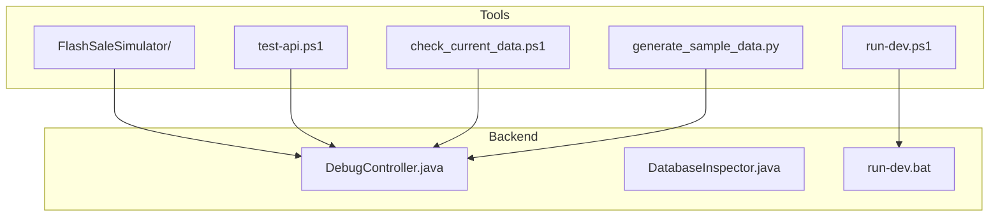
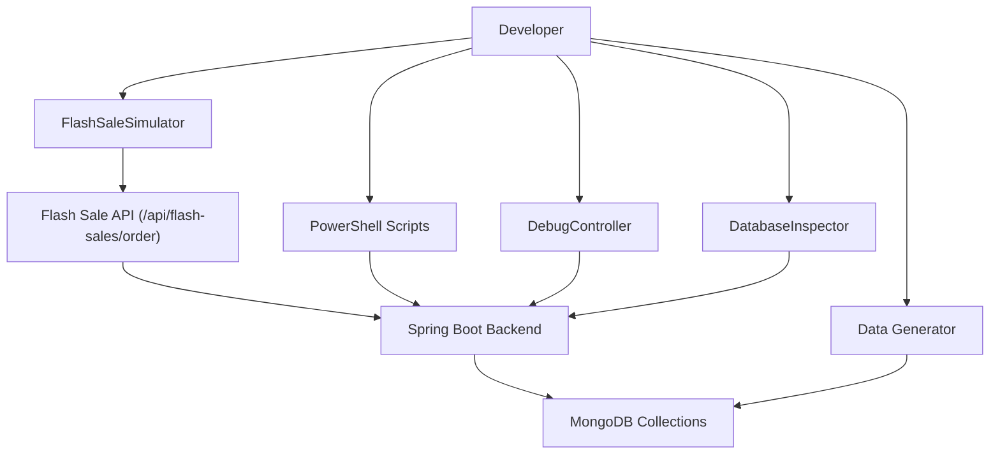
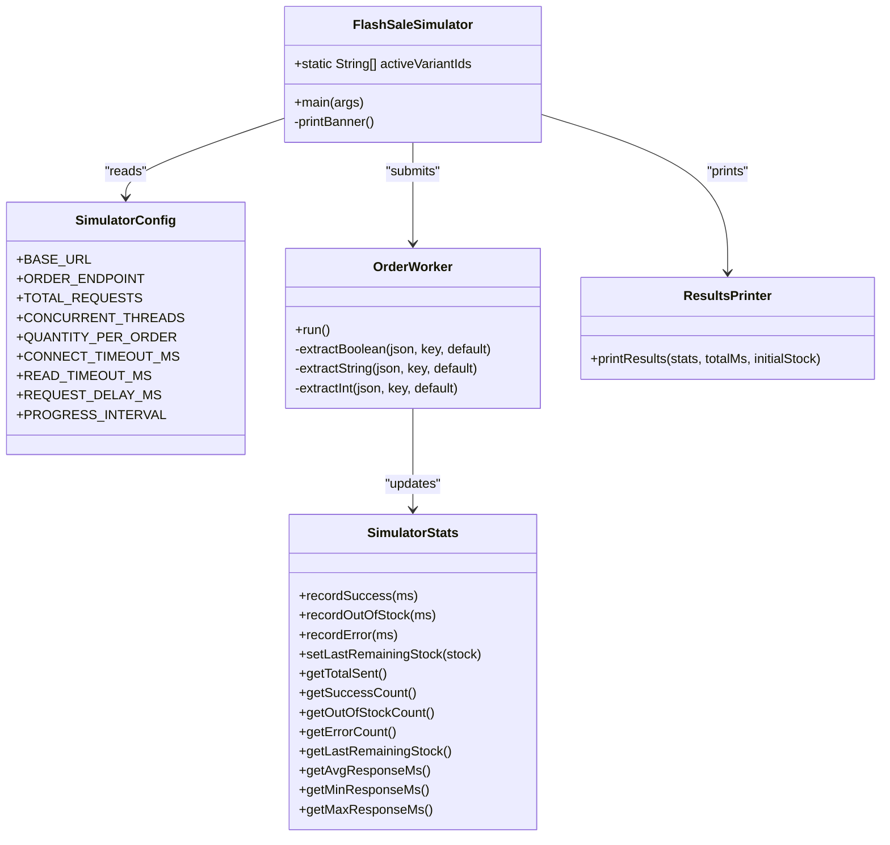
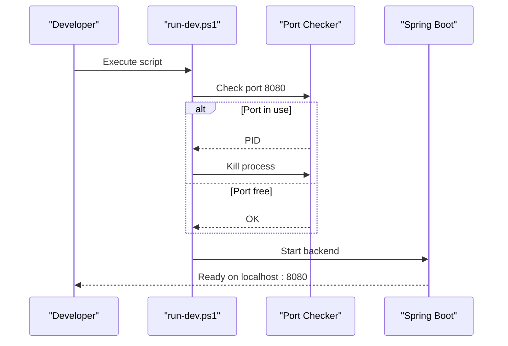
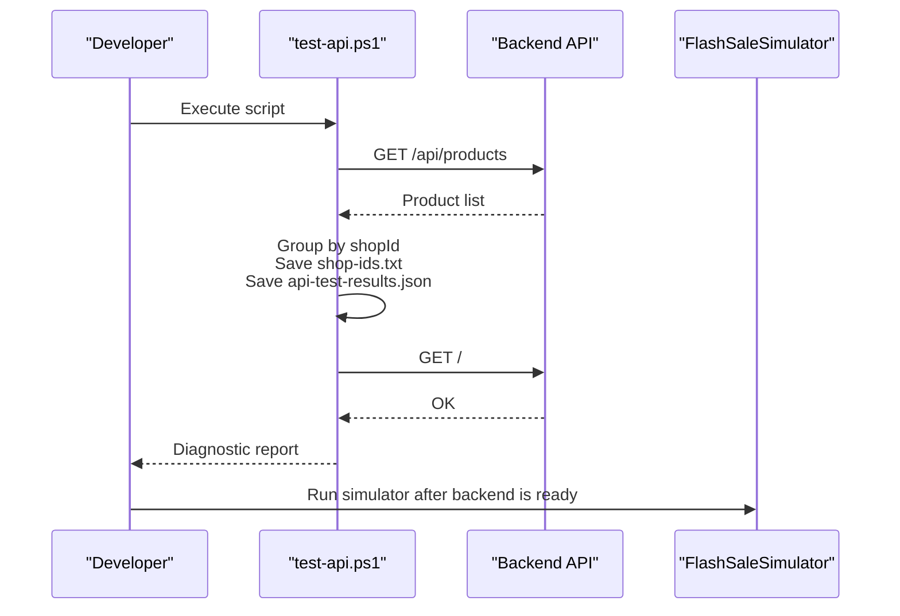
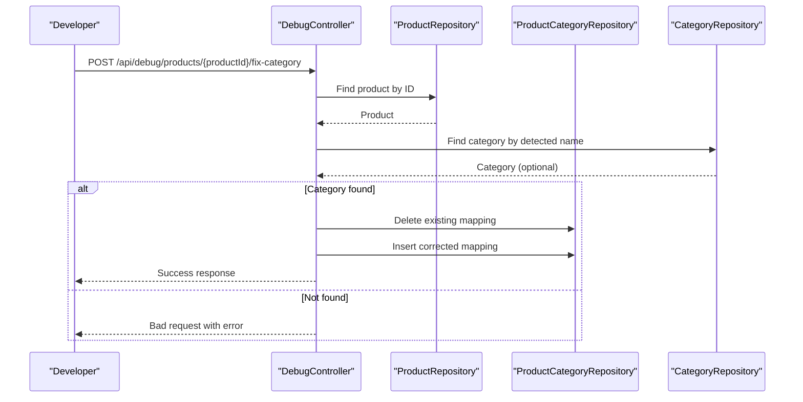
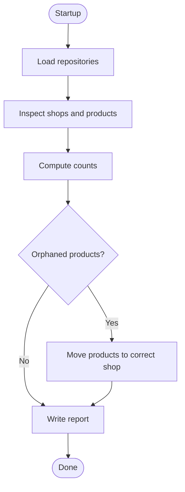
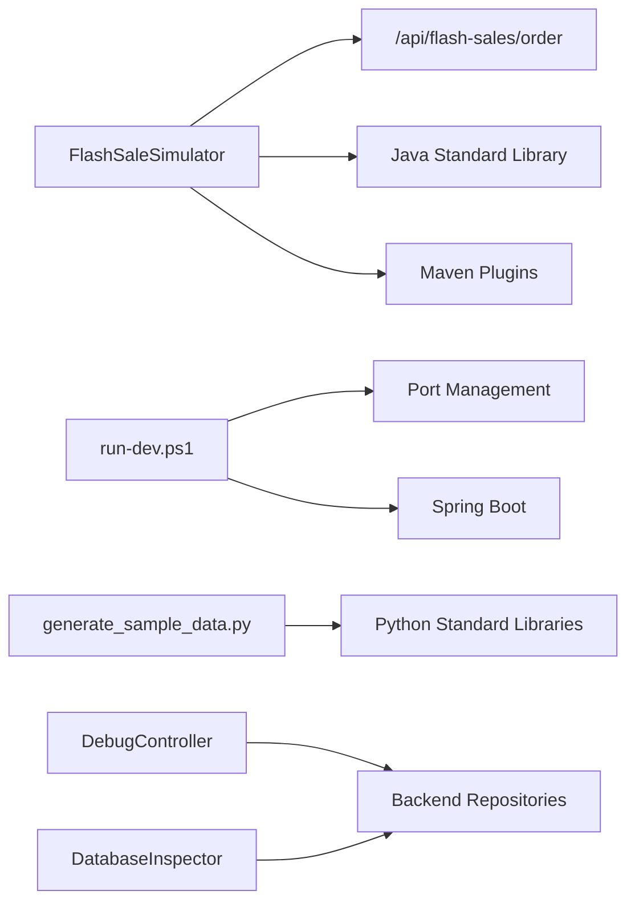

# Development Tools & Utilities

<cite>
**Referenced Files in This Document**
- [FlashSaleSimulator README](file://tools/FlashSaleSimulator/README.md)
- [FlashSaleSimulator pom.xml](file://tools/FlashSaleSimulator/pom.xml)
- [FlashSaleSimulator FlashSaleSimulator.java](file://tools/FlashSaleSimulator/src/main/java/simulator/FlashSaleSimulator.java)
- [FlashSaleSimulator SimulatorConfig.java](file://tools/FlashSaleSimulator/src/main/java/simulator/SimulatorConfig.java)
- [FlashSaleSimulator OrderWorker.java](file://tools/FlashSaleSimulator/src/main/java/simulator/OrderWorker.java)
- [FlashSaleSimulator SimulatorStats.java](file://tools/FlashSaleSimulator/src/main/java/simulator/SimulatorStats.java)
- [FlashSaleSimulator ResultsPrinter.java](file://tools/FlashSaleSimulator/src/main/java/simulator/ResultsPrinter.java)
- [generate_sample_data.py](file://tools/generate_sample_data.py)
- [run-dev.ps1](file://tools/run-dev.ps1)
- [run-dev.bat](file://src\Backend\run-dev.bat)
- [test-api.ps1](file://tools/test-api.ps1)
- [check_current_data.ps1](file://tools/check_current_data.ps1)
- [DebugController.java](file://src\Backend\src\main\java\com\shoppeclone\backend\common\controller\DebugController.java)
- [DatabaseInspector.java](file://src\Backend\src\main\java\com\shoppeclone\backend\common\DatabaseInspector.java)
</cite>

## Table of Contents
1. [Introduction](#introduction)
2. [Project Structure](#project-structure)
3. [Core Components](#core-components)
4. [Architecture Overview](#architecture-overview)
5. [Detailed Component Analysis](#detailed-component-analysis)
6. [Dependency Analysis](#dependency-analysis)
7. [Performance Considerations](#performance-considerations)
8. [Troubleshooting Guide](#troubleshooting-guide)
9. [Conclusion](#conclusion)
10. [Appendices](#appendices)

## Introduction
This section documents the development tools and utilities used during local development and performance testing. It covers:
- Flash Sale Simulator: a load-testing tool for flash sale ordering endpoints
- Development scripts: PowerShell and batch scripts for local server startup and API diagnostics
- Data generation utilities: Python script to generate realistic CSV datasets
- Debugging utilities: backend debug endpoints and database inspection tool
- Workflow optimization tips and troubleshooting guidance

These tools streamline development tasks such as validating flash sale stock integrity, diagnosing API issues, generating seed data, and automating local environment setup.

## Project Structure
The development tools are organized under two primary areas:
- tools/: standalone utilities and simulators
- src/Backend/: backend application code with debug endpoints and initialization utilities

**Diagram sources**
- [FlashSaleSimulator README:1-71](file://tools/FlashSaleSimulator/README.md#L1-L71)
- [run-dev.ps1:1-14](file://tools/run-dev.ps1#L1-L14)
- [run-dev.bat:1-12](file://src\Backend\run-dev.bat#L1-L12)
- [test-api.ps1:1-94](file://tools/test-api.ps1#L1-L94)
- [check_current_data.ps1:1-66](file://tools/check_current_data.ps1#L1-L66)
- [generate_sample_data.py:1-140](file://tools/generate_sample_data.py#L1-L140)
- [DebugController.java:1-58](file://src\Backend\src\main\java\com\shoppeclone\backend\common\controller\DebugController.java#L1-L58)
- [DatabaseInspector.java:1-87](file://src\Backend\src\main\java\com\shoppeclone\backend\common\DatabaseInspector.java#L1-L87)

**Section sources**
- [FlashSaleSimulator README:1-71](file://tools/FlashSaleSimulator/README.md#L1-L71)
- [run-dev.ps1:1-14](file://tools/run-dev.ps1#L1-L14)
- [run-dev.bat:1-12](file://src\Backend\run-dev.bat#L1-L12)
- [test-api.ps1:1-94](file://tools/test-api.ps1#L1-L94)
- [check_current_data.ps1:1-66](file://tools/check_current_data.ps1#L1-L66)
- [generate_sample_data.py:1-140](file://tools/generate_sample_data.py#L1-L140)
- [DebugController.java:1-58](file://src\Backend\src\main\java\com\shoppeclone\backend\common\controller\DebugController.java#L1-L58)
- [DatabaseInspector.java:1-87](file://src\Backend\src\main\java\com\shoppeclone\backend\common\DatabaseInspector.java#L1-L87)

## Core Components
- Flash Sale Simulator: a Java-based load tester that sends concurrent requests to the backend flash sale endpoint, measures outcomes, and validates stock integrity.
- Development Scripts: PowerShell and batch scripts to start the backend safely on port 8080 and to diagnose API health and product data.
- Data Generation Utility: a Python script to generate large CSV datasets with Vietnamese names, emails, and phone numbers.
- Debugging Utilities: backend endpoints for quick fixes (e.g., category assignment) and a database inspector that writes diagnostic reports.

**Section sources**
- [FlashSaleSimulator README:1-71](file://tools/FlashSaleSimulator/README.md#L1-L71)
- [FlashSaleSimulator pom.xml:1-57](file://tools/FlashSaleSimulator/pom.xml#L1-L57)
- [run-dev.ps1:1-14](file://tools/run-dev.ps1#L1-L14)
- [run-dev.bat:1-12](file://src\Backend\run-dev.bat#L1-L12)
- [generate_sample_data.py:1-140](file://tools/generate_sample_data.py#L1-L140)
- [DebugController.java:1-58](file://src\Backend\src\main\java\com\shoppeclone\backend\common\controller\DebugController.java#L1-L58)
- [DatabaseInspector.java:1-87](file://src\Backend\src\main\java\com\shoppeclone\backend\common\DatabaseInspector.java#L1-L87)

## Architecture Overview
The development workflow integrates CLI tools, backend endpoints, and data generators to support rapid iteration and validation.

**Diagram sources**
- [FlashSaleSimulator FlashSaleSimulator.java:1-134](file://tools/FlashSaleSimulator/src/main/java/simulator/FlashSaleSimulator.java#L1-L134)
- [FlashSaleSimulator README:65-70](file://tools/FlashSaleSimulator/README.md#L65-L70)
- [test-api.ps1:1-94](file://tools/test-api.ps1#L1-L94)
- [generate_sample_data.py:1-140](file://tools/generate_sample_data.py#L1-L140)
- [DebugController.java:1-58](file://src\Backend\src\main\java\com\shoppeclone\backend\common\controller\DebugController.java#L1-L58)
- [DatabaseInspector.java:1-87](file://src\Backend\src\main\java\com\shoppeclone\backend\common\DatabaseInspector.java#L1-L87)

## Detailed Component Analysis

### Flash Sale Simulator
The simulator is a Maven-built Java application that:
- Fetches active flash sale variants from the backend
- Spawns a configurable number of concurrent threads
- Sends POST requests to the flash sale order endpoint
- Aggregates results and prints an ASCII summary with stock integrity checks

Key implementation details:
- Configuration via a central config class with tunable parameters (requests, threads, timeouts)
- Worker threads submit individual orders and parse lightweight JSON responses
- Thread-safe statistics counters track outcomes and response timings
- Results printer formats a summary table and a simple bar chart

**Diagram sources**
- [FlashSaleSimulator FlashSaleSimulator.java:1-134](file://tools/FlashSaleSimulator/src/main/java/simulator/FlashSaleSimulator.java#L1-L134)
- [FlashSaleSimulator SimulatorConfig.java:1-39](file://tools/FlashSaleSimulator/src/main/java/simulator/SimulatorConfig.java#L1-L39)
- [FlashSaleSimulator OrderWorker.java:1-179](file://tools/FlashSaleSimulator/src/main/java/simulator/OrderWorker.java#L1-L179)
- [FlashSaleSimulator SimulatorStats.java:1-98](file://tools/FlashSaleSimulator/src/main/java/simulator/SimulatorStats.java#L1-L98)
- [FlashSaleSimulator ResultsPrinter.java:1-108](file://tools/FlashSaleSimulator/src/main/java/simulator/ResultsPrinter.java#L1-L108)

Usage and configuration:
- Before running, ensure the backend is started locally on port 8080 and an active flash sale exists
- Configure the simulator via the configuration class for total requests, concurrent threads, and timeouts
- Run with Maven exec or package and run the fat JAR
- Review the printed ASCII results and the stock integrity check

**Section sources**
- [FlashSaleSimulator README:1-71](file://tools/FlashSaleSimulator/README.md#L1-L71)
- [FlashSaleSimulator pom.xml:1-57](file://tools/FlashSaleSimulator/pom.xml#L1-L57)
- [FlashSaleSimulator FlashSaleSimulator.java:1-134](file://tools/FlashSaleSimulator/src/main/java/simulator/FlashSaleSimulator.java#L1-L134)
- [FlashSaleSimulator SimulatorConfig.java:1-39](file://tools/FlashSaleSimulator/src/main/java/simulator/SimulatorConfig.java#L1-L39)
- [FlashSaleSimulator OrderWorker.java:1-179](file://tools/FlashSaleSimulator/src/main/java/simulator/OrderWorker.java#L1-L179)
- [FlashSaleSimulator SimulatorStats.java:1-98](file://tools/FlashSaleSimulator/src/main/java/simulator/SimulatorStats.java#L1-L98)
- [FlashSaleSimulator ResultsPrinter.java:1-108](file://tools/FlashSaleSimulator/src/main/java/simulator/ResultsPrinter.java#L1-L108)

### Development Scripts
- PowerShell script for Windows: checks port 8080, kills existing process if present, then starts the Spring Boot app
- Batch script mirror for Windows environments
- API diagnostic script: fetches products, groups by shop, saves results and shop IDs to files, and performs a basic health check

**Diagram sources**
- [run-dev.ps1:1-14](file://tools/run-dev.ps1#L1-L14)
- [run-dev.bat:1-12](file://src\Backend\run-dev.bat#L1-L12)

**Diagram sources**
- [test-api.ps1:1-94](file://tools/test-api.ps1#L1-L94)

Practical examples:
- Start backend cleanly: run the PowerShell or batch script before importing data or running tests
- Diagnose product data: run the API diagnostic script to verify product counts per shop and save artifacts for later analysis
- Verify server readiness: use the health check endpoint to confirm the backend responds

**Section sources**
- [run-dev.ps1:1-14](file://tools/run-dev.ps1#L1-L14)
- [run-dev.bat:1-12](file://src\Backend\run-dev.bat#L1-L12)
- [test-api.ps1:1-94](file://tools/test-api.ps1#L1-L94)

### Data Generation Tools
The Python script generates a CSV dataset suitable for user import and testing:
- Creates realistic Vietnamese names, usernames, emails, and phone numbers
- Supports configurable record count and UTF-8-BOM encoding for better international character support
- Outputs structured metadata and usage guidance

Common scenarios:
- Seed user data for testing registration flows
- Generate large datasets for performance and stress testing
- Prepare CSV files compatible with importers and loaders

**Section sources**
- [generate_sample_data.py:1-140](file://tools/generate_sample_data.py#L1-L140)

### Debugging Utilities
Backend debug endpoints and utilities:
- DebugController: exposes endpoints to inspect product categories and to auto-fix product categories based on product names
- DatabaseInspector: runs at startup, inspects shop-product relationships, applies corrections, and writes a diagnostic report to a file

**Diagram sources**
- [DebugController.java:1-58](file://src\Backend\src\main\java\com\shoppeclone\backend\common\controller\DebugController.java#L1-L58)

**Diagram sources**
- [DatabaseInspector.java:1-87](file://src\Backend\src\main\java\com\shoppeclone\backend\common\DatabaseInspector.java#L1-L87)

Practical examples:
- Auto-correct product categories when promotions fail to apply due to missing category mapping
- Investigate orphaned products and reconcile shop ownership automatically

**Section sources**
- [DebugController.java:1-58](file://src\Backend\src\main\java\com\shoppeclone\backend\common\controller\DebugController.java#L1-L58)
- [DatabaseInspector.java:1-87](file://src\Backend\src\main\java\com\shoppeclone\backend\common\DatabaseInspector.java#L1-L87)

## Dependency Analysis
- Flash Sale Simulator depends on:
  - Backend flash sale endpoint for order submission
  - Java standard library for networking and JSON parsing
  - Maven plugins for building and running the simulator
- Development scripts depend on:
  - Local backend availability on port 8080
  - PowerShell/Windows networking commands
- Data generation utility is self-contained and depends on Python standard libraries
- Debugging utilities depend on backend repositories and Spring Boot runtime

**Diagram sources**
- [FlashSaleSimulator pom.xml:1-57](file://tools/FlashSaleSimulator/pom.xml#L1-L57)
- [FlashSaleSimulator FlashSaleSimulator.java:1-134](file://tools/FlashSaleSimulator/src/main/java/simulator/FlashSaleSimulator.java#L1-L134)
- [run-dev.ps1:1-14](file://tools/run-dev.ps1#L1-L14)
- [generate_sample_data.py:1-140](file://tools/generate_sample_data.py#L1-L140)
- [DebugController.java:1-58](file://src\Backend\src\main\java\com\shoppeclone\backend\common\controller\DebugController.java#L1-L58)
- [DatabaseInspector.java:1-87](file://src\Backend\src\main\java\com\shoppeclone\backend\common\DatabaseInspector.java#L1-L87)

**Section sources**
- [FlashSaleSimulator pom.xml:1-57](file://tools/FlashSaleSimulator/pom.xml#L1-L57)
- [FlashSaleSimulator FlashSaleSimulator.java:1-134](file://tools/FlashSaleSimulator/src/main/java/simulator/FlashSaleSimulator.java#L1-L134)
- [run-dev.ps1:1-14](file://tools/run-dev.ps1#L1-L14)
- [generate_sample_data.py:1-140](file://tools/generate_sample_data.py#L1-L140)
- [DebugController.java:1-58](file://src\Backend\src\main\java\com\shoppeclone\backend\common\controller\DebugController.java#L1-L58)
- [DatabaseInspector.java:1-87](file://src\Backend\src\main\java\com\shoppeclone\backend\common\DatabaseInspector.java#L1-L87)

## Performance Considerations
- Concurrency tuning: adjust concurrent threads and total requests in the simulator configuration to match hardware capacity and backend throughput
- Network timeouts: configure connect and read timeouts appropriately to avoid premature failures under load
- Progress reporting: use the progress interval to monitor throughput and detect stalls
- Stock integrity: rely on the built-in stock integrity check to ensure atomic stock updates remain non-negative
- Local environment: use the development scripts to ensure a clean 8080 port and a fresh backend instance before load testing

[No sources needed since this section provides general guidance]

## Troubleshooting Guide
Common issues and resolutions:
- Backend not reachable on port 8080:
  - Use the development script to kill any conflicting process and restart the backend
  - Confirm the backend responds to the root endpoint
- No active flash sale found:
  - Ensure an active flash sale exists and is approved in the admin panel
  - Verify the simulator configuration points to the correct base URL and endpoint
- Excessive errors during simulation:
  - Increase timeouts or reduce concurrency
  - Check network stability and backend resource usage
- Category not applied to products:
  - Use the debug endpoint to auto-fix category mapping based on product name
- Orphaned products or incorrect shop ownership:
  - Rerun the backend to trigger the database inspector, which writes a diagnostic report and attempts corrections

**Section sources**
- [run-dev.ps1:1-14](file://tools/run-dev.ps1#L1-L14)
- [run-dev.bat:1-12](file://src\Backend\run-dev.bat#L1-L12)
- [test-api.ps1:1-94](file://tools/test-api.ps1#L1-L94)
- [FlashSaleSimulator README:60-70](file://tools/FlashSaleSimulator/README.md#L60-L70)
- [DebugController.java:1-58](file://src\Backend\src\main\java\com\shoppeclone\backend\common\controller\DebugController.java#L1-L58)
- [DatabaseInspector.java:1-87](file://src\Backend\src\main\java\com\shoppeclone\backend\common\DatabaseInspector.java#L1-L87)

## Conclusion
The development tools and utilities provide a cohesive toolkit for local development, performance validation, and operational diagnostics. The Flash Sale Simulator offers robust load testing with clear outcome metrics and stock integrity verification. The development scripts simplify environment setup and API diagnostics. The data generation utility supports realistic dataset creation. The backend debugging endpoints and database inspector streamline common maintenance tasks.

[No sources needed since this section summarizes without analyzing specific files]

## Appendices

### Installation and Setup
- Flash Sale Simulator:
  - Build and run with Maven or package a fat JAR
  - Ensure the backend is running and an active flash sale exists
- Development scripts:
  - PowerShell script for Windows: run to start the backend cleanly on port 8080
  - Batch script mirror for Windows environments
- Data generation:
  - Install Python and run the script to generate CSV files with UTF-8-BOM encoding

**Section sources**
- [FlashSaleSimulator README:27-39](file://tools/FlashSaleSimulator/README.md#L27-L39)
- [FlashSaleSimulator pom.xml:18-54](file://tools/FlashSaleSimulator/pom.xml#L18-L54)
- [run-dev.ps1:1-14](file://tools/run-dev.ps1#L1-L14)
- [run-dev.bat:1-12](file://src\Backend\run-dev.bat#L1-L12)
- [generate_sample_data.py:132-140](file://tools/generate_sample_data.py#L132-L140)

### Configuration Options
- Simulator configuration:
  - Base URL and order endpoint
  - Total requests, concurrent threads, quantity per order
  - Connect/read timeouts and optional delays
  - Progress reporting interval
- API diagnostic script:
  - Base URL for API endpoints
  - Output file paths for results and shop IDs

**Section sources**
- [FlashSaleSimulator SimulatorConfig.java:1-39](file://tools/FlashSaleSimulator/src/main/java/simulator/SimulatorConfig.java#L1-L39)
- [test-api.ps1:7-8](file://tools/test-api.ps1#L7-L8)

### Practical Examples
- Running the simulator:
  - Start the backend, configure variant selection, and execute the simulator
  - Review the ASCII results and stock integrity check
- Diagnosing product data:
  - Run the API diagnostic script to group products by shop and save artifacts
- Generating seed data:
  - Run the data generator with desired record count and import the resulting CSV

**Section sources**
- [FlashSaleSimulator README:27-70](file://tools/FlashSaleSimulator/README.md#L27-L70)
- [test-api.ps1:1-94](file://tools/test-api.ps1#L1-L94)
- [generate_sample_data.py:89-140](file://tools/generate_sample_data.py#L89-L140)