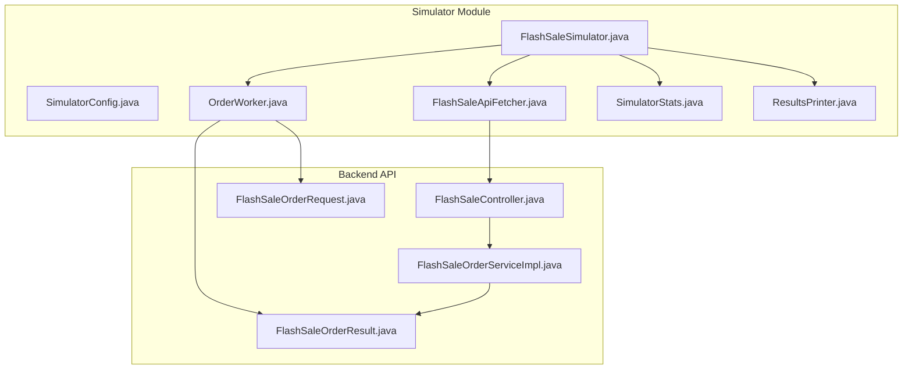
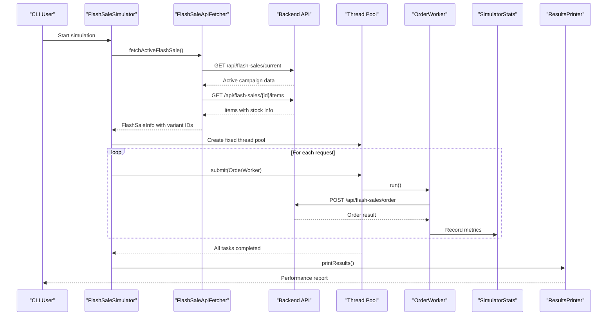
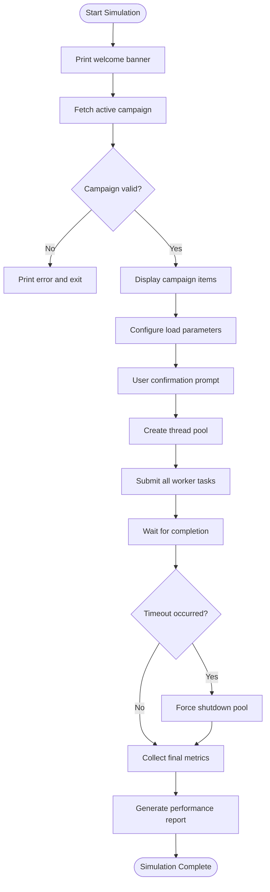
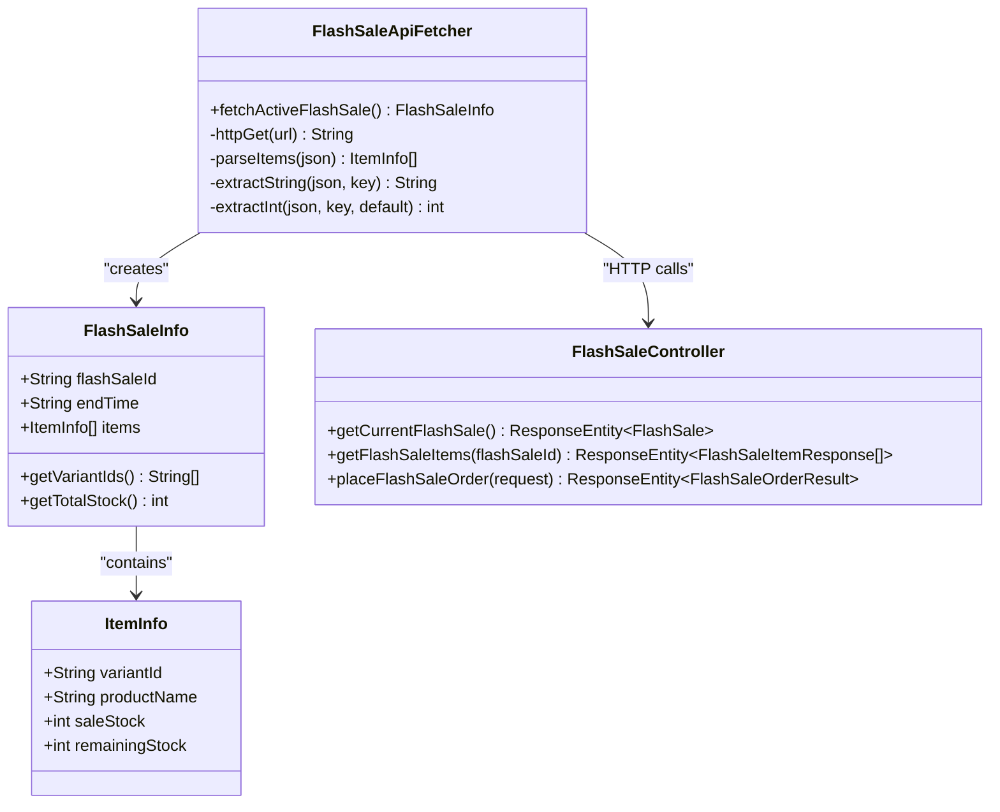
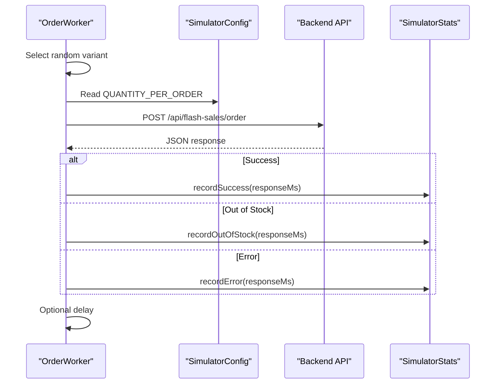
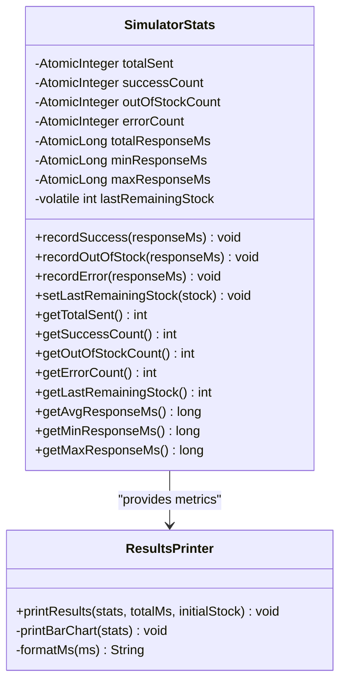
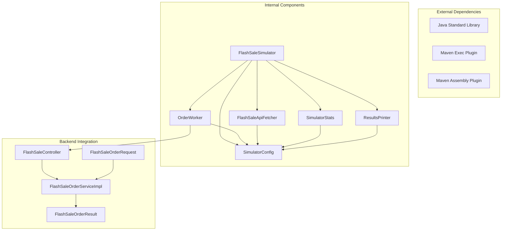

# Flash Sale Simulator

<cite>
**Referenced Files in This Document**
- [FlashSaleSimulator.java](file://tools/FlashSaleSimulator/src/main/java/simulator/FlashSaleSimulator.java)
- [SimulatorConfig.java](file://tools/FlashSaleSimulator/src/main/java/simulator/SimulatorConfig.java)
- [FlashSaleApiFetcher.java](file://tools/FlashSaleSimulator/src/main/java/simulator/FlashSaleApiFetcher.java)
- [OrderWorker.java](file://tools/FlashSaleSimulator/src/main/java/simulator/OrderWorker.java)
- [SimulatorStats.java](file://tools/FlashSaleSimulator/src/main/java/simulator/SimulatorStats.java)
- [ResultsPrinter.java](file://tools/FlashSaleSimulator/src/main/java/simulator/ResultsPrinter.java)
- [pom.xml](file://tools/FlashSaleSimulator/pom.xml)
- [README.md](file://tools/FlashSaleSimulator/README.md)
- [FlashSaleController.java](file://src/Backend/src/main/java/com/shoppeclone/backend/promotion/flashsale/controller/FlashSaleController.java)
- [FlashSaleOrderServiceImpl.java](file://src/Backend/src/main/java/com/shoppeclone/backend/promotion/flashsale/service/impl/FlashSaleOrderServiceImpl.java)
- [FlashSaleOrderRequest.java](file://src/Backend/src/main/java/com/shoppeclone/backend/promotion/flashsale/dto/FlashSaleOrderRequest.java)
- [FlashSaleOrderResult.java](file://src/Backend/src/main/java/com/shoppeclone/backend/promotion/flashsale/dto/FlashSaleOrderResult.java)
</cite>

## Table of Contents
1. [Introduction](#introduction)
2. [Project Structure](#project-structure)
3. [Core Components](#core-components)
4. [Architecture Overview](#architecture-overview)
5. [Detailed Component Analysis](#detailed-component-analysis)
6. [Dependency Analysis](#dependency-analysis)
7. [Performance Considerations](#performance-considerations)
8. [Troubleshooting Guide](#troubleshooting-guide)
9. [Conclusion](#conclusion)
10. [Appendices](#appendices)

## Introduction
The Flash Sale Simulator is a high-concurrency load testing tool designed to validate the performance and correctness of flash sale systems under realistic traffic conditions. It simulates thousands of concurrent users attempting to purchase flash sale items, automatically fetching active campaigns and variants from the backend API, and collecting comprehensive performance metrics. The tool focuses on:
- Validating atomic stock management to prevent overselling
- Measuring latency and throughput under load
- Ensuring system stability during peak traffic events
- Providing actionable insights for capacity planning and optimization

## Project Structure
The simulator is organized as a standalone Maven module with a clear separation of concerns:
- Configuration and entry point
- API integration for campaign discovery
- Worker threads for concurrent request generation
- Metrics collection and reporting
- Backend API integration for order placement

**Diagram sources**
- [FlashSaleSimulator.java:1-134](file://tools/FlashSaleSimulator/src/main/java/simulator/FlashSaleSimulator.java#L1-L134)
- [FlashSaleApiFetcher.java:1-188](file://tools/FlashSaleSimulator/src/main/java/simulator/FlashSaleApiFetcher.java#L1-L188)
- [OrderWorker.java:1-179](file://tools/FlashSaleSimulator/src/main/java/simulator/OrderWorker.java#L1-L179)
- [SimulatorStats.java:1-98](file://tools/FlashSaleSimulator/src/main/java/simulator/SimulatorStats.java#L1-L98)
- [ResultsPrinter.java:1-108](file://tools/FlashSaleSimulator/src/main/java/simulator/ResultsPrinter.java#L1-L108)
- [FlashSaleController.java:1-198](file://src/Backend/src/main/java/com/shoppeclone/backend/promotion/flashsale/controller/FlashSaleController.java#L1-L198)
- [FlashSaleOrderServiceImpl.java:1-294](file://src/Backend/src/main/java/com/shoppeclone/backend/promotion/flashsale/service/impl/FlashSaleOrderServiceImpl.java#L1-L294)

**Section sources**
- [pom.xml:1-57](file://tools/FlashSaleSimulator/pom.xml#L1-L57)
- [README.md:1-71](file://tools/FlashSaleSimulator/README.md#L1-L71)

## Core Components
The simulator consists of five primary components that work together to deliver reliable load testing results:

### Configuration Management
The [SimulatorConfig.java:1-39](file://tools/FlashSaleSimulator/src/main/java/simulator/SimulatorConfig.java#L1-L39) class centralizes all configurable parameters:
- Base URLs for backend integration
- Load testing parameters (total requests, concurrent threads)
- Network timeouts and delays
- Output formatting preferences

### Campaign Discovery
The [FlashSaleApiFetcher.java:1-188](file://tools/FlashSaleSimulator/src/main/java/simulator/FlashSaleApiFetcher.java#L1-L188) handles automatic discovery of active flash sale campaigns:
- Fetches current active campaign metadata
- Retrieves all approved items with stock information
- Parses JSON responses without external dependencies
- Provides variant ID arrays for workers

### Concurrent Execution Engine
The [OrderWorker.java:1-179](file://tools/FlashSaleSimulator/src/main/java/simulator/OrderWorker.java#L1-L179) implements individual request execution:
- Random variant selection from fetched list
- HTTP POST request construction with JSON payload
- Response parsing and status classification
- Thread-safe statistics recording

### Metrics Collection
The [SimulatorStats.java:1-98](file://tools/FlashSaleSimulator/src/main/java/simulator/SimulatorStats.java#L1-L98) maintains thread-safe performance metrics:
- Counters for success, out-of-stock, and error scenarios
- Response time statistics (min, max, average)
- Last observed remaining stock tracking
- Atomic operations for concurrency safety

### Results Reporting
The [ResultsPrinter.java:1-108](file://tools/FlashSaleSimulator/src/main/java/simulator/ResultsPrinter.java#L1-L108) generates human-readable performance reports:
- ASCII table formatting for console output
- Distribution charts for result categories
- Stock integrity verification
- Performance benchmark summaries

**Section sources**
- [SimulatorConfig.java:1-39](file://tools/FlashSaleSimulator/src/main/java/simulator/SimulatorConfig.java#L1-L39)
- [FlashSaleApiFetcher.java:1-188](file://tools/FlashSaleSimulator/src/main/java/simulator/FlashSaleApiFetcher.java#L1-L188)
- [OrderWorker.java:1-179](file://tools/FlashSaleSimulator/src/main/java/simulator/OrderWorker.java#L1-L179)
- [SimulatorStats.java:1-98](file://tools/FlashSaleSimulator/src/main/java/simulator/SimulatorStats.java#L1-L98)
- [ResultsPrinter.java:1-108](file://tools/FlashSaleSimulator/src/main/java/simulator/ResultsPrinter.java#L1-L108)

## Architecture Overview
The simulator follows a producer-consumer pattern with centralized configuration and automatic campaign discovery:

**Diagram sources**
- [FlashSaleSimulator.java:27-121](file://tools/FlashSaleSimulator/src/main/java/simulator/FlashSaleSimulator.java#L27-L121)
- [FlashSaleApiFetcher.java:43-72](file://tools/FlashSaleSimulator/src/main/java/simulator/FlashSaleApiFetcher.java#L43-L72)
- [OrderWorker.java:24-113](file://tools/FlashSaleSimulator/src/main/java/simulator/OrderWorker.java#L24-L113)
- [FlashSaleController.java:179-183](file://src/Backend/src/main/java/com/shoppeclone/backend/promotion/flashsale/controller/FlashSaleController.java#L179-L183)

## Detailed Component Analysis

### Flash Sale Simulator Main Class
The main orchestrator coordinates the entire simulation workflow:

**Diagram sources**
- [FlashSaleSimulator.java:27-121](file://tools/FlashSaleSimulator/src/main/java/simulator/FlashSaleSimulator.java#L27-L121)

Key responsibilities include:
- Automatic campaign discovery and validation
- Dynamic variant ID population for workers
- Thread pool management with timeout handling
- Comprehensive result aggregation and reporting

### API Integration Layer
The simulator integrates with backend APIs through a two-stage discovery process:

**Diagram sources**
- [FlashSaleApiFetcher.java:14-72](file://tools/FlashSaleSimulator/src/main/java/simulator/FlashSaleApiFetcher.java#L14-L72)
- [FlashSaleController.java:42-52](file://src/Backend/src/main/java/com/shoppeclone/backend/promotion/flashsale/controller/FlashSaleController.java#L42-L52)

The fetcher implements robust error handling for network failures and malformed responses, ensuring the simulator can gracefully handle backend unavailability.

### Concurrent Worker Implementation
Each worker represents a simulated user performing a purchase:

**Diagram sources**
- [OrderWorker.java:24-113](file://tools/FlashSaleSimulator/src/main/java/simulator/OrderWorker.java#L24-L113)
- [FlashSaleOrderServiceImpl.java:36-116](file://src/Backend/src/main/java/com/shoppeclone/backend/promotion/flashsale/service/impl/FlashSaleOrderServiceImpl.java#L36-L116)

The worker implementation ensures thread safety through atomic operations and provides detailed logging for debugging and monitoring.

### Performance Metrics Collection
The statistics system tracks multiple dimensions of system performance:

**Diagram sources**
- [SimulatorStats.java:10-97](file://tools/FlashSaleSimulator/src/main/java/simulator/SimulatorStats.java#L10-L97)
- [ResultsPrinter.java:13-56](file://tools/FlashSaleSimulator/src/main/java/simulator/ResultsPrinter.java#L13-L56)

The metrics system uses atomic operations to eliminate synchronization overhead while maintaining accuracy across thousands of concurrent requests.

**Section sources**
- [FlashSaleSimulator.java:27-121](file://tools/FlashSaleSimulator/src/main/java/simulator/FlashSaleSimulator.java#L27-L121)
- [FlashSaleApiFetcher.java:43-72](file://tools/FlashSaleSimulator/src/main/java/simulator/FlashSaleApiFetcher.java#L43-L72)
- [OrderWorker.java:24-113](file://tools/FlashSaleSimulator/src/main/java/simulator/OrderWorker.java#L24-L113)
- [SimulatorStats.java:10-97](file://tools/FlashSaleSimulator/src/main/java/simulator/SimulatorStats.java#L10-L97)
- [ResultsPrinter.java:13-56](file://tools/FlashSaleSimulator/src/main/java/simulator/ResultsPrinter.java#L13-L56)

## Dependency Analysis
The simulator maintains minimal external dependencies while providing comprehensive functionality:

**Diagram sources**
- [pom.xml:18-54](file://tools/FlashSaleSimulator/pom.xml#L18-L54)
- [FlashSaleSimulator.java:1-134](file://tools/FlashSaleSimulator/src/main/java/simulator/FlashSaleSimulator.java#L1-L134)
- [FlashSaleApiFetcher.java:1-188](file://tools/FlashSaleSimulator/src/main/java/simulator/FlashSaleApiFetcher.java#L1-L188)
- [OrderWorker.java:1-179](file://tools/FlashSaleSimulator/src/main/java/simulator/OrderWorker.java#L1-L179)
- [FlashSaleController.java:1-198](file://src/Backend/src/main/java/com/shoppeclone/backend/promotion/flashsale/controller/FlashSaleController.java#L1-L198)

The modular design enables easy maintenance and extension while keeping the codebase lightweight and portable.

**Section sources**
- [pom.xml:1-57](file://tools/FlashSaleSimulator/pom.xml#L1-L57)
- [FlashSaleSimulator.java:1-134](file://tools/FlashSaleSimulator/src/main/java/simulator/FlashSaleSimulator.java#L1-L134)

## Performance Considerations
The simulator is designed for high-throughput load testing with several built-in optimizations:

### Thread Pool Configuration
- Fixed thread pool size controlled by [CONCURRENT_THREADS](file://tools/FlashSaleSimulator/src/main/java/simulator/SimulatorConfig.java#L21)
- Graceful shutdown with 5-minute timeout protection
- Configurable request delays between batches

### Memory Management
- Minimal object allocation per request
- Reusable connection instances with proper cleanup
- Efficient JSON parsing without external libraries

### Network Optimization
- Configurable connect and read timeouts
- Automatic retry handling for transient failures
- Connection pooling through HTTP client reuse

### Monitoring and Diagnostics
- Real-time progress reporting every [PROGRESS_INTERVAL](file://tools/FlashSaleSimulator/src/main/java/simulator/SimulatorConfig.java#L37) requests
- Comprehensive performance metrics collection
- Stock integrity verification against initial campaign stock

**Section sources**
- [SimulatorConfig.java:16-38](file://tools/FlashSaleSimulator/src/main/java/simulator/SimulatorConfig.java#L16-L38)
- [FlashSaleSimulator.java:98-115](file://tools/FlashSaleSimulator/src/main/java/simulator/FlashSaleSimulator.java#L98-L115)
- [OrderWorker.java:92-94](file://tools/FlashSaleSimulator/src/main/java/simulator/OrderWorker.java#L92-L94)

## Troubleshooting Guide

### Common Issues and Solutions

#### No Active Flash Sale Found
**Symptoms:** Error message indicating no active flash sale campaign
**Causes:**
- Backend service not running
- No approved flash sale items exist
- Incorrect base URL configuration

**Solutions:**
1. Verify backend is running on configured port
2. Ensure at least one flash sale item has APPROVED status
3. Confirm [BASE_URL](file://tools/FlashSaleSimulator/src/main/java/simulator/SimulatorConfig.java#L13) points to correct backend instance

#### Network Connectivity Problems
**Symptoms:** HTTP errors or timeouts during API calls
**Causes:**
- Firewall blocking connections
- Incorrect endpoint URLs
- Network latency exceeding timeout limits

**Solutions:**
1. Increase [CONNECT_TIMEOUT_MS](file://tools/FlashSaleSimulator/src/main/java/simulator/SimulatorConfig.java#L27) and [READ_TIMEOUT_MS](file://tools/FlashSaleSimulator/src/main/java/simulator/SimulatorConfig.java#L30)
2. Test connectivity using curl or Postman
3. Verify network routing between simulator and backend

#### Stock Management Failures
**Symptoms:** Unexpected out-of-stock responses despite sufficient inventory
**Causes:**
- Race conditions in stock updates
- Inconsistent stock tracking between flash sale items and variants
- Database transaction isolation issues

**Solutions:**
1. Monitor backend logs for stock update conflicts
2. Verify atomic operation implementation in [FlashSaleOrderServiceImpl:67-99](file://src/Backend/src/main/java/com/shoppeclone/backend/promotion/flashsale/service/impl/FlashSaleOrderServiceImpl.java#L67-L99)
3. Check database connection pooling configuration

#### Performance Degradation
**Symptoms:** Slow response times or increased error rates under load
**Causes:**
- Insufficient thread pool size
- Network bottleneck at backend
- Database contention during peak loads

**Solutions:**
1. Adjust [CONCURRENT_THREADS](file://tools/FlashSaleSimulator/src/main/java/simulator/SimulatorConfig.java#L21) based on system capacity
2. Implement request batching with [REQUEST_DELAY_MS](file://tools/FlashSaleSimulator/src/main/java/simulator/SimulatorConfig.java#L33)
3. Monitor backend resource utilization during testing

**Section sources**
- [FlashSaleSimulator.java:37-42](file://tools/FlashSaleSimulator/src/main/java/simulator/FlashSaleSimulator.java#L37-L42)
- [FlashSaleApiFetcher.java:76-100](file://tools/FlashSaleSimulator/src/main/java/simulator/FlashSaleApiFetcher.java#L76-L100)
- [OrderWorker.java:96-102](file://tools/FlashSaleSimulator/src/main/java/simulator/OrderWorker.java#L96-L102)
- [FlashSaleOrderServiceImpl.java:67-115](file://src/Backend/src/main/java/com/shoppeclone/backend/promotion/flashsale/service/impl/FlashSaleOrderServiceImpl.java#L67-L115)

## Conclusion
The Flash Sale Simulator provides a comprehensive solution for load testing flash sale systems with automatic campaign discovery, high-concurrency execution, and detailed performance analytics. Its modular architecture, thread-safe metrics collection, and robust error handling make it suitable for validating production-like scenarios while maintaining reliability and ease of use.

Key strengths include:
- Automatic variant fetching eliminates manual configuration overhead
- Thread-safe statistics collection ensures accurate performance metrics
- Comprehensive error handling and timeout protection
- Detailed reporting with stock integrity verification
- Minimal external dependencies for portability

The tool serves as both a testing utility and a diagnostic instrument, enabling teams to validate system performance, identify bottlenecks, and optimize flash sale infrastructure before live deployment.

## Appendices

### Configuration Reference
Complete list of configurable parameters and their effects:

| Parameter | Type | Default | Description |
|-----------|------|---------|-------------|
| BASE_URL | String | http://localhost:8080 | Backend service URL |
| ORDER_ENDPOINT | String | BASE_URL + /api/flash-sales/order | Order placement endpoint |
| TOTAL_REQUESTS | Integer | 1000 | Total number of requests to simulate |
| CONCURRENT_THREADS | Integer | 100 | Number of concurrent worker threads |
| QUANTITY_PER_ORDER | Integer | 1 | Purchase quantity per request |
| CONNECT_TIMEOUT_MS | Integer | 5000 | Connection establishment timeout |
| READ_TIMEOUT_MS | Integer | 10000 | Response reading timeout |
| REQUEST_DELAY_MS | Integer | 0 | Delay between request batches |
| PROGRESS_INTERVAL | Integer | 100 | Progress reporting interval |

### Usage Patterns
Recommended approaches for different testing scenarios:

#### Production Capacity Testing
- Set TOTAL_REQUESTS to expected peak concurrent users
- Configure CONCURRENT_THREADS based on available CPU cores
- Monitor stock integrity checks for overselling prevention
- Use REQUEST_DELAY_MS to simulate realistic user behavior

#### Latency Benchmarking
- Reduce CONCURRENT_THREADS to baseline system capacity
- Focus on response time statistics (min/max/average)
- Analyze ResultsPrinter output for performance trends
- Compare metrics across different hardware configurations

#### Stress Testing
- Gradually increase CONCURRENT_THREADS until system failure
- Monitor error rates and out-of-stock responses
- Identify breaking points in stock management
- Document failure modes for capacity planning

### Integration Best Practices
- Ensure backend flash sale items have sufficient stock for simulation
- Configure proper database connection pooling for backend services
- Monitor both simulator and backend resource utilization
- Implement proper logging for debugging and analysis
- Validate results against known good baselines