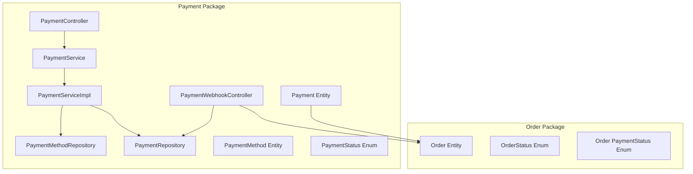
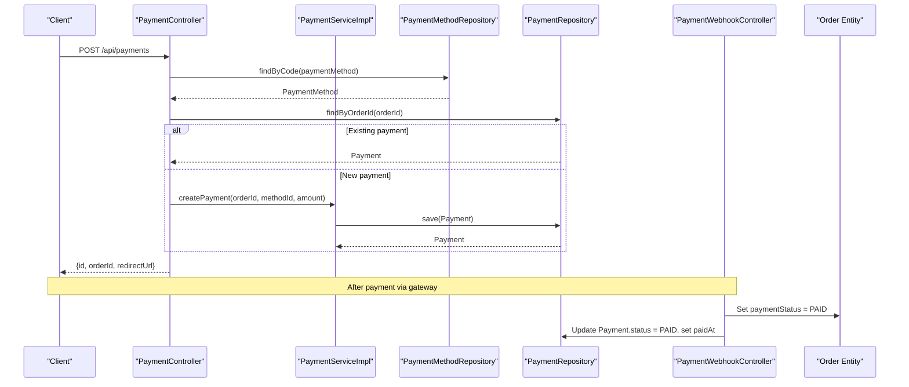
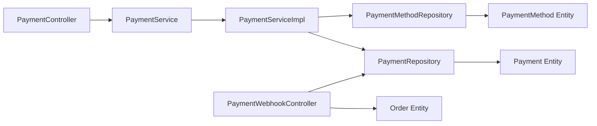

# Payment Processing System

<cite>
**Referenced Files in This Document**
- [PaymentController.java](file://src/Backend/src/main/java/com/shoppeclone/backend/payment/controller/PaymentController.java)
- [PaymentWebhookController.java](file://src/Backend/src/main/java/com/shoppeclone/backend/payment/controller/PaymentWebhookController.java)
- [PaymentService.java](file://src/Backend/src/main/java/com/shoppeclone/backend/payment/service/PaymentService.java)
- [PaymentServiceImpl.java](file://src/Backend/src/main/java/com/shoppeclone/backend/payment/service/impl/PaymentServiceImpl.java)
- [PaymentRepository.java](file://src/Backend/src/main/java/com/shoppeclone/backend/payment/repository/PaymentRepository.java)
- [PaymentMethodRepository.java](file://src/Backend/src/main/java/com/shoppeclone/backend/payment/repository/PaymentMethodRepository.java)
- [Payment.java](file://src/Backend/src/main/java/com/shoppeclone/backend/payment/entity/Payment.java)
- [PaymentMethod.java](file://src/Backend/src/main/java/com/shoppeclone/backend/payment/entity/PaymentMethod.java)
- [PaymentStatus.java](file://src/Backend/src/main/java/com/shoppeclone/backend/payment/entity/PaymentStatus.java)
- [Order.java](file://src/Backend/src/main/java/com/shoppeclone/backend/order/entity/Order.java)
- [OrderStatus.java](file://src/Backend/src/main/java/com/shoppeclone/backend/order/entity/OrderStatus.java)
- [PaymentStatus.java](file://src/Backend/src/main/java/com/shoppeclone/backend/order/entity/PaymentStatus.java)
</cite>

## Table of Contents
1. [Introduction](#introduction)
2. [Project Structure](#project-structure)
3. [Core Components](#core-components)
4. [Architecture Overview](#architecture-overview)
5. [Detailed Component Analysis](#detailed-component-analysis)
6. [Dependency Analysis](#dependency-analysis)
7. [Performance Considerations](#performance-considerations)
8. [Troubleshooting Guide](#troubleshooting-guide)
9. [Conclusion](#conclusion)

## Introduction
This document describes the payment processing system, covering payment creation workflows, payment method management, and payment status tracking. It documents the payment controller endpoints, the payment entity structure, payment method codes, and integration with external payment gateways (Momo and VNPAY). It also includes examples of payment initialization, redirect URL handling, webhook processing, Cash on Delivery (COD) implementation, validation, error handling strategies, and security considerations including tokenization and PCI compliance.

## Project Structure
The payment system is organized around Spring MVC controllers, service layer, repositories, and MongoDB entities. Payment-related components are located under the payment package, while integration with order entities ensures payment status synchronization.

**Diagram sources**
- [PaymentController.java:18-74](file://src/Backend/src/main/java/com/shoppeclone/backend/payment/controller/PaymentController.java#L18-L74)
- [PaymentWebhookController.java:21-136](file://src/Backend/src/main/java/com/shoppeclone/backend/payment/controller/PaymentWebhookController.java#L21-L136)
- [PaymentServiceImpl.java:15-65](file://src/Backend/src/main/java/com/shoppeclone/backend/payment/service/impl/PaymentServiceImpl.java#L15-L65)
- [PaymentRepository.java:9-13](file://src/Backend/src/main/java/com/shoppeclone/backend/payment/repository/PaymentRepository.java#L9-L13)
- [PaymentMethodRepository.java:9-13](file://src/Backend/src/main/java/com/shoppeclone/backend/payment/repository/PaymentMethodRepository.java#L9-L13)
- [Payment.java:11-27](file://src/Backend/src/main/java/com/shoppeclone/backend/payment/entity/Payment.java#L11-L27)
- [PaymentMethod.java:7-16](file://src/Backend/src/main/java/com/shoppeclone/backend/payment/entity/PaymentMethod.java#L7-L16)
- [PaymentStatus.java:3-7](file://src/Backend/src/main/java/com/shoppeclone/backend/payment/entity/PaymentStatus.java#L3-L7)
- [Order.java:12-55](file://src/Backend/src/main/java/com/shoppeclone/backend/order/entity/Order.java#L12-L55)
- [OrderStatus.java:3-12](file://src/Backend/src/main/java/com/shoppeclone/backend/order/entity/OrderStatus.java#L3-L12)
- [PaymentStatus.java:3-7](file://src/Backend/src/main/java/com/shoppeclone/backend/order/entity/PaymentStatus.java#L3-L7)

**Section sources**
- [PaymentController.java:18-74](file://src/Backend/src/main/java/com/shoppeclone/backend/payment/controller/PaymentController.java#L18-L74)
- [PaymentWebhookController.java:21-136](file://src/Backend/src/main/java/com/shoppeclone/backend/payment/controller/PaymentWebhookController.java#L21-L136)
- [PaymentServiceImpl.java:15-65](file://src/Backend/src/main/java/com/shoppeclone/backend/payment/service/impl/PaymentServiceImpl.java#L15-L65)
- [PaymentRepository.java:9-13](file://src/Backend/src/main/java/com/shoppeclone/backend/payment/repository/PaymentRepository.java#L9-L13)
- [PaymentMethodRepository.java:9-13](file://src/Backend/src/main/java/com/shoppeclone/backend/payment/repository/PaymentMethodRepository.java#L9-L13)
- [Payment.java:11-27](file://src/Backend/src/main/java/com/shoppeclone/backend/payment/entity/Payment.java#L11-L27)
- [PaymentMethod.java:7-16](file://src/Backend/src/main/java/com/shoppeclone/backend/payment/entity/PaymentMethod.java#L7-L16)
- [PaymentStatus.java:3-7](file://src/Backend/src/main/java/com/shoppeclone/backend/payment/entity/PaymentStatus.java#L3-L7)
- [Order.java:12-55](file://src/Backend/src/main/java/com/shoppeclone/backend/order/entity/Order.java#L12-L55)
- [OrderStatus.java:3-12](file://src/Backend/src/main/java/com/shoppeclone/backend/order/entity/OrderStatus.java#L3-L12)
- [PaymentStatus.java:3-7](file://src/Backend/src/main/java/com/shoppeclone/backend/order/entity/PaymentStatus.java#L3-L7)

## Core Components
- PaymentController: Exposes endpoints for payment creation, retrieving payment methods, fetching payment by order, and internal status updates.
- PaymentWebhookController: Handles payment gateway callbacks (Momo and VNPAY) to update order and payment statuses.
- PaymentService and PaymentServiceImpl: Business logic for payment creation, retrieval, and status updates.
- Repositories: PaymentRepository and PaymentMethodRepository for persistence.
- Entities: Payment, PaymentMethod, PaymentStatus; integrated with Order entity for payment status synchronization.

Key capabilities:
- Payment creation with method validation and deduplication by order.
- Retrieval of available payment methods.
- Payment status updates via internal endpoint and external webhooks.
- Integration with order payment status for unified tracking.

**Section sources**
- [PaymentController.java:27-72](file://src/Backend/src/main/java/com/shoppeclone/backend/payment/controller/PaymentController.java#L27-L72)
- [PaymentWebhookController.java:36-107](file://src/Backend/src/main/java/com/shoppeclone/backend/payment/controller/PaymentWebhookController.java#L36-L107)
- [PaymentService.java:8-16](file://src/Backend/src/main/java/com/shoppeclone/backend/payment/service/PaymentService.java#L8-L16)
- [PaymentServiceImpl.java:22-63](file://src/Backend/src/main/java/com/shoppeclone/backend/payment/service/impl/PaymentServiceImpl.java#L22-L63)
- [PaymentRepository.java:10-12](file://src/Backend/src/main/java/com/shoppeclone/backend/payment/repository/PaymentRepository.java#L10-L12)
- [PaymentMethodRepository.java:10-11](file://src/Backend/src/main/java/com/shoppeclone/backend/payment/repository/PaymentMethodRepository.java#L10-L11)
- [Payment.java:13-26](file://src/Backend/src/main/java/com/shoppeclone/backend/payment/entity/Payment.java#L13-L26)
- [PaymentMethod.java:9-15](file://src/Backend/src/main/java/com/shoppeclone/backend/payment/entity/PaymentMethod.java#L9-L15)
- [PaymentStatus.java:3-7](file://src/Backend/src/main/java/com/shoppeclone/backend/payment/entity/PaymentStatus.java#L3-L7)
- [Order.java:34-35](file://src/Backend/src/main/java/com/shoppeclone/backend/order/entity/Order.java#L34-L35)

## Architecture Overview
The payment system follows a layered architecture:
- Controllers handle HTTP requests and delegate to services.
- Services encapsulate business logic and orchestrate repository operations.
- Repositories manage persistence against MongoDB collections.
- Entities define the data model for payments, payment methods, and their statuses.

External integrations:
- Payment gateway webhooks (Momo, VNPAY) update payment and order statuses.
- Order entity maintains synchronized payment status with payment records.

**Diagram sources**
- [PaymentController.java:27-48](file://src/Backend/src/main/java/com/shoppeclone/backend/payment/controller/PaymentController.java#L27-L48)
- [PaymentServiceImpl.java:27-36](file://src/Backend/src/main/java/com/shoppeclone/backend/payment/service/impl/PaymentServiceImpl.java#L27-L36)
- [PaymentMethodRepository.java:10-11](file://src/Backend/src/main/java/com/shoppeclone/backend/payment/repository/PaymentMethodRepository.java#L10-L11)
- [PaymentRepository.java:10-12](file://src/Backend/src/main/java/com/shoppeclone/backend/payment/repository/PaymentRepository.java#L10-L12)
- [PaymentWebhookController.java:36-68](file://src/Backend/src/main/java/com/shoppeclone/backend/payment/controller/PaymentWebhookController.java#L36-L68)
- [Order.java:34-35](file://src/Backend/src/main/java/com/shoppeclone/backend/order/entity/Order.java#L34-L35)

## Detailed Component Analysis

### Payment Controller Endpoints
- POST /api/payments: Creates or retrieves a payment for an order using a payment method code. Returns payment id, order id, and optional redirect URL (gateway-specific).
- GET /api/payments/methods: Lists available payment methods.
- GET /api/payments/order/{orderId}: Retrieves the payment associated with an order.
- POST /api/payments/{paymentId}/status: Updates payment status (internal endpoint).

Validation and behavior:
- Requires orderId and paymentMethod in creation request.
- Validates payment method code existence.
- Deduplicates payments by order id, returning the first match if present.

**Section sources**
- [PaymentController.java:27-72](file://src/Backend/src/main/java/com/shoppeclone/backend/payment/controller/PaymentController.java#L27-L72)

### Payment Webhook Processing
- POST /api/webhooks/payment/momo: Processes Momo IPN notifications. Updates order and payment statuses to PAID when resultCode indicates success.
- POST /api/webhooks/payment/vnpay: Processes VNPAY IPN notifications. Updates order and payment statuses to PAID when response code indicates success.

Processing logic:
- Extracts order id from payload.
- Loads order and sets paymentStatus to PAID.
- Updates all payments linked to the order to PAID and sets paidAt timestamp.
- Returns HTTP 204 for Momo as required.

**Section sources**
- [PaymentWebhookController.java:36-107](file://src/Backend/src/main/java/com/shoppeclone/backend/payment/controller/PaymentWebhookController.java#L36-L107)

### Payment Entity Structure
- Collection: payments
- Fields: id, orderId (indexed), paymentMethodId (indexed), amount, status (PENDING, PAID, FAILED), paidAt

Indexing:
- orderId and paymentMethodId are indexed for efficient queries.

**Section sources**
- [Payment.java:11-27](file://src/Backend/src/main/java/com/shoppeclone/backend/payment/entity/Payment.java#L11-L27)

### Payment Method Codes
- PaymentMethod collection stores payment method definitions.
- Example codes include COD and BANKING.
- The system validates incoming payment method codes against stored methods.

**Section sources**
- [PaymentMethod.java:7-16](file://src/Backend/src/main/java/com/shoppeclone/backend/payment/entity/PaymentMethod.java#L7-L16)
- [PaymentMethodRepository.java:10-11](file://src/Backend/src/main/java/com/shoppeclone/backend/payment/repository/PaymentMethodRepository.java#L10-L11)

### Payment Status Tracking
- PaymentStatus enum defines PENDING, PAID, FAILED.
- Order integrates PaymentStatus for payment state alignment with payment records.
- Webhooks update both order and payment entities to maintain consistency.

**Section sources**
- [PaymentStatus.java:3-7](file://src/Backend/src/main/java/com/shoppeclone/backend/payment/entity/PaymentStatus.java#L3-L7)
- [Order.java:34-35](file://src/Backend/src/main/java/com/shoppeclone/backend/order/entity/Order.java#L34-L35)
- [PaymentStatus.java:3-7](file://src/Backend/src/main/java/com/shoppeclone/backend/order/entity/PaymentStatus.java#L3-L7)

### COD Implementation
- COD is represented as a payment method code (e.g., COD).
- Payment creation endpoint supports COD by passing the appropriate payment method code.
- Redirect URL is intentionally null for COD, indicating no external gateway redirection.

**Section sources**
- [PaymentController.java:43-47](file://src/Backend/src/main/java/com/shoppeclone/backend/payment/controller/PaymentController.java#L43-L47)
- [PaymentMethod.java](file://src/Backend/src/main/java/com/shoppeclone/backend/payment/entity/PaymentMethod.java#L13)

### Payment Validation and Error Handling
- Creation endpoint validates presence of orderId and paymentMethod.
- Payment method lookup throws runtime exception if not found.
- Status update endpoint validates status string and throws on invalid values.
- Webhooks log warnings and return no-content responses when order ids are missing or orders not found.

**Section sources**
- [PaymentController.java:29-33](file://src/Backend/src/main/java/com/shoppeclone/backend/payment/controller/PaymentController.java#L29-L33)
- [PaymentServiceImpl.java:48-63](file://src/Backend/src/main/java/com/shoppeclone/backend/payment/service/impl/PaymentServiceImpl.java#L48-L63)
- [PaymentWebhookController.java:44-53](file://src/Backend/src/main/java/com/shoppeclone/backend/payment/controller/PaymentWebhookController.java#L44-L53)

### Redirect URL Handling
- Payment creation returns redirectUrl for gateway-based methods.
- For COD, redirectUrl is null, signaling no redirection is required.
- Frontend should check redirectUrl and navigate accordingly when present.

**Section sources**
- [PaymentController.java:43-47](file://src/Backend/src/main/java/com/shoppeclone/backend/payment/controller/PaymentController.java#L43-L47)

### Integration with External Payment Gateways
- Momo: Webhook endpoint receives IPN with resultCode; success triggers PAID status updates.
- VNPAY: Webhook endpoint receives IPN with response code; success triggers PAID status updates.
- Both webhooks require minimal payload validation and respond with HTTP 204/200 as applicable.

**Section sources**
- [PaymentWebhookController.java:36-107](file://src/Backend/src/main/java/com/shoppeclone/backend/payment/controller/PaymentWebhookController.java#L36-L107)

### Examples

#### Payment Initialization
- Client calls POST /api/payments with orderId and paymentMethod.
- System validates method code, checks for existing payment by order, and either returns existing payment or creates a new PENDING payment.

**Section sources**
- [PaymentController.java:27-48](file://src/Backend/src/main/java/com/shoppeclone/backend/payment/controller/PaymentController.java#L27-L48)
- [PaymentServiceImpl.java:27-36](file://src/Backend/src/main/java/com/shoppeclone/backend/payment/service/impl/PaymentServiceImpl.java#L27-L36)

#### Redirect URL Handling
- If redirectUrl is present, client redirects to external gateway; otherwise, proceed to order success flow.

**Section sources**
- [PaymentController.java:43-47](file://src/Backend/src/main/java/com/shoppeclone/backend/payment/controller/PaymentController.java#L43-L47)

#### Webhook Processing
- Momo IPN: On resultCode success, set order and payment to PAID.
- VNPAY IPN: On response code success, set order and payment to PAID.

**Section sources**
- [PaymentWebhookController.java:36-107](file://src/Backend/src/main/java/com/shoppeclone/backend/payment/controller/PaymentWebhookController.java#L36-L107)

### Security Considerations
- Tokenization: Payment method codes are validated against stored methods; sensitive data is not transmitted to clients.
- PCI Compliance: Gateway credentials and tokens are not handled by the system; only gateway callbacks are processed.
- Authentication: Webhook endpoints are exposed publicly; consider adding signature verification for Momo/VNPAY in production.

[No sources needed since this section provides general guidance]

## Dependency Analysis
The payment system exhibits low coupling and clear separation of concerns:
- Controllers depend on services.
- Services depend on repositories and enums.
- Entities are mapped to MongoDB collections with indexing on frequently queried fields.
- Webhooks depend on order and payment repositories to synchronize state.

**Diagram sources**
- [PaymentController.java:23-25](file://src/Backend/src/main/java/com/shoppeclone/backend/payment/controller/PaymentController.java#L23-L25)
- [PaymentServiceImpl.java:19-20](file://src/Backend/src/main/java/com/shoppeclone/backend/payment/service/impl/PaymentServiceImpl.java#L19-L20)
- [PaymentWebhookController.java:27-28](file://src/Backend/src/main/java/com/shoppeclone/backend/payment/controller/PaymentWebhookController.java#L27-L28)
- [PaymentRepository.java:10-12](file://src/Backend/src/main/java/com/shoppeclone/backend/payment/repository/PaymentRepository.java#L10-L12)
- [PaymentMethodRepository.java:10-11](file://src/Backend/src/main/java/com/shoppeclone/backend/payment/repository/PaymentMethodRepository.java#L10-L11)
- [Payment.java:11-27](file://src/Backend/src/main/java/com/shoppeclone/backend/payment/entity/Payment.java#L11-L27)
- [PaymentMethod.java:7-16](file://src/Backend/src/main/java/com/shoppeclone/backend/payment/entity/PaymentMethod.java#L7-L16)
- [Order.java:12-55](file://src/Backend/src/main/java/com/shoppeclone/backend/order/entity/Order.java#L12-L55)

**Section sources**
- [PaymentController.java:23-25](file://src/Backend/src/main/java/com/shoppeclone/backend/payment/controller/PaymentController.java#L23-L25)
- [PaymentServiceImpl.java:19-20](file://src/Backend/src/main/java/com/shoppeclone/backend/payment/service/impl/PaymentServiceImpl.java#L19-L20)
- [PaymentWebhookController.java:27-28](file://src/Backend/src/main/java/com/shoppeclone/backend/payment/controller/PaymentWebhookController.java#L27-L28)
- [PaymentRepository.java:10-12](file://src/Backend/src/main/java/com/shoppeclone/backend/payment/repository/PaymentRepository.java#L10-L12)
- [PaymentMethodRepository.java:10-11](file://src/Backend/src/main/java/com/shoppeclone/backend/payment/repository/PaymentMethodRepository.java#L10-L11)
- [Payment.java:11-27](file://src/Backend/src/main/java/com/shoppeclone/backend/payment/entity/Payment.java#L11-L27)
- [PaymentMethod.java:7-16](file://src/Backend/src/main/java/com/shoppeclone/backend/payment/entity/PaymentMethod.java#L7-L16)
- [Order.java:12-55](file://src/Backend/src/main/java/com/shoppeclone/backend/order/entity/Order.java#L12-L55)

## Performance Considerations
- Indexes on orderId and paymentMethodId improve query performance for payment retrieval and method lookup.
- Webhook processing performs single-order lookups and batch updates for related payments.
- Consider caching frequently accessed payment method metadata for high-volume scenarios.

[No sources needed since this section provides general guidance]

## Troubleshooting Guide
Common issues and resolutions:
- Missing orderId or paymentMethod during creation: Ensure both fields are provided; the endpoint throws a runtime exception if missing.
- Payment method not found: Verify payment method code exists in payment_methods collection.
- Invalid payment status string: Only accepted values are defined in PaymentStatus enum; ensure correct casing and spelling.
- Webhook not updating order: Confirm webhook URL is configured and reachable; verify payload correctness and order id presence.
- Redirect URL null for COD: Expected behavior; no redirection is performed for COD.

**Section sources**
- [PaymentController.java:29-33](file://src/Backend/src/main/java/com/shoppeclone/backend/payment/controller/PaymentController.java#L29-L33)
- [PaymentServiceImpl.java:48-63](file://src/Backend/src/main/java/com/shoppeclone/backend/payment/service/impl/PaymentServiceImpl.java#L48-L63)
- [PaymentWebhookController.java:44-53](file://src/Backend/src/main/java/com/shoppeclone/backend/payment/controller/PaymentWebhookController.java#L44-L53)

## Conclusion
The payment processing system provides a robust foundation for payment creation, method management, and status tracking. It integrates seamlessly with order entities and supports external payment gateway webhooks for automated status updates. While COD and bank-based methods are supported, production deployments should incorporate signature verification for webhooks and secure handling of gateway credentials outside the application scope.