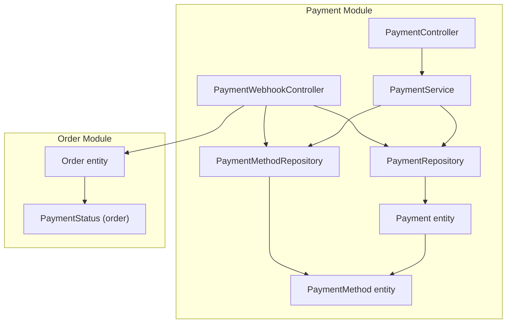
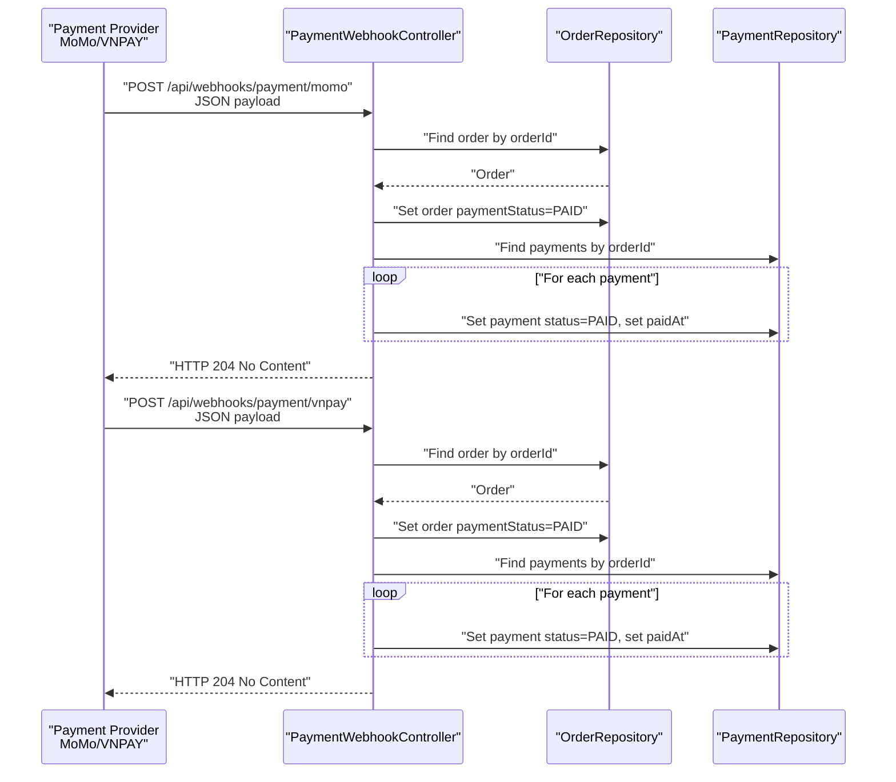
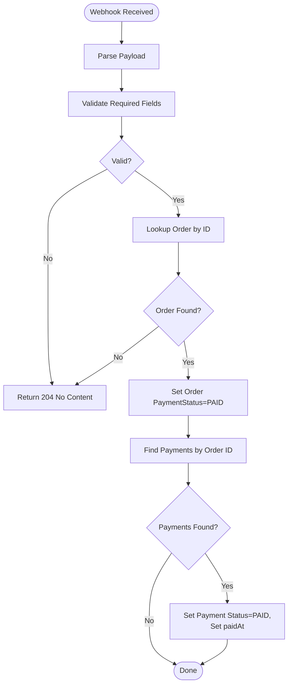
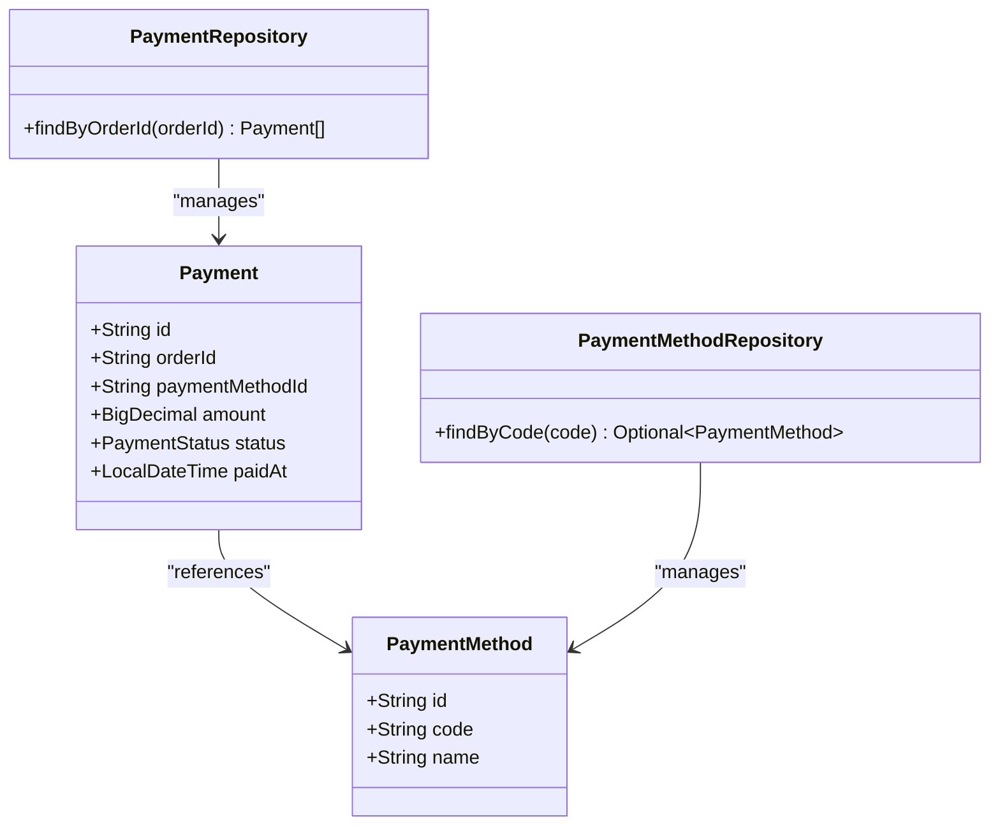
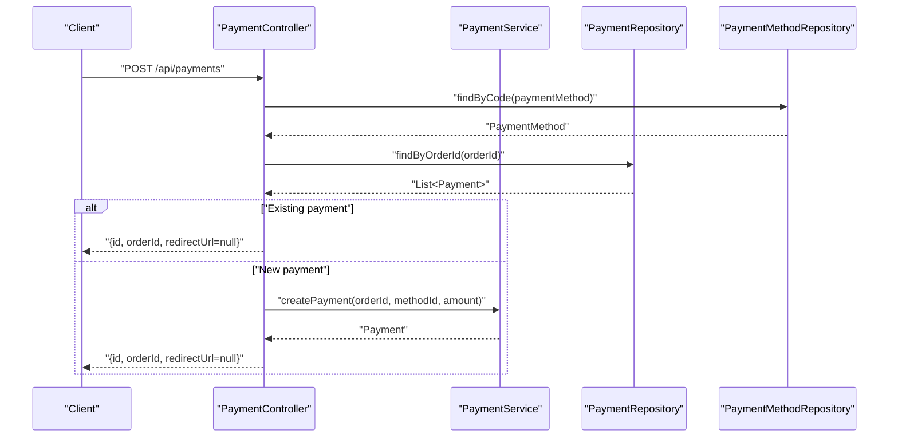
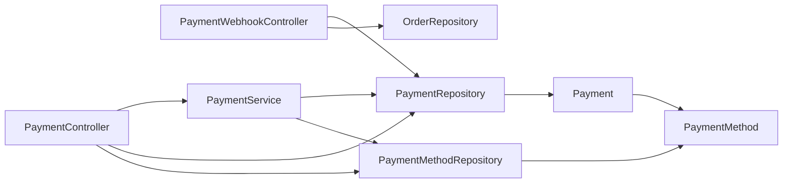

# Payment Webhook Integration

<cite>
**Referenced Files in This Document**
- [PaymentWebhookController.java](file://src/Backend/src/main/java/com/shoppeclone/backend/payment/controller/PaymentWebhookController.java)
- [PaymentController.java](file://src/Backend/src/main/java/com/shoppeclone/backend/payment/controller/PaymentController.java)
- [PaymentService.java](file://src/Backend/src/main/java/com/shoppeclone/backend/payment/service/PaymentService.java)
- [Payment.java](file://src/Backend/src/main/java/com/shoppeclone/backend/payment/entity/Payment.java)
- [PaymentMethod.java](file://src/Backend/src/main/java/com/shoppeclone/backend/payment/entity/PaymentMethod.java)
- [PaymentStatus.java (payment entity)](file://src/Backend/src/main/java/com/shoppeclone/backend/payment/entity/PaymentStatus.java)
- [PaymentStatus.java (order entity)](file://src/Backend/src/main/java/com/shoppeclone/backend/order/entity/PaymentStatus.java)
- [PaymentRepository.java](file://src/Backend/src/main/java/com/shoppeclone/backend/payment/repository/PaymentRepository.java)
- [PaymentMethodRepository.java](file://src/Backend/src/main/java/com/shoppeclone/backend/payment/repository/PaymentMethodRepository.java)
</cite>

## Table of Contents
1. [Introduction](#introduction)
2. [Project Structure](#project-structure)
3. [Core Components](#core-components)
4. [Architecture Overview](#architecture-overview)
5. [Detailed Component Analysis](#detailed-component-analysis)
6. [Dependency Analysis](#dependency-analysis)
7. [Performance Considerations](#performance-considerations)
8. [Troubleshooting Guide](#troubleshooting-guide)
9. [Conclusion](#conclusion)
10. [Appendices](#appendices)

## Introduction
This document explains the payment webhook integration and external payment gateway communication within the backend. It covers webhook endpoint configuration, event processing workflows, and integration patterns with MoMo and VNPAY. It also documents webhook security considerations, duplicate prevention, retry mechanisms, testing and debugging approaches, and common integration challenges with solutions.

## Project Structure
The payment webhook functionality resides under the payment module and interacts with order and payment entities. The key components are:
- PaymentWebhookController: Exposes webhook endpoints for MoMo and VNPAY.
- PaymentController: Handles payment creation and retrieval.
- PaymentService: Defines payment operations and status updates.
- Payment and PaymentMethod entities: Represent payment records and supported payment methods.
- Repositories: Persist and query payment and payment method data.

**Diagram sources**
- [PaymentWebhookController.java:21-107](file://src/Backend/src/main/java/com/shoppeclone/backend/payment/controller/PaymentWebhookController.java#L21-L107)
- [PaymentController.java:18-73](file://src/Backend/src/main/java/com/shoppeclone/backend/payment/controller/PaymentController.java#L18-L73)
- [PaymentService.java:8-16](file://src/Backend/src/main/java/com/shoppeclone/backend/payment/service/PaymentService.java#L8-L16)
- [PaymentRepository.java:9-12](file://src/Backend/src/main/java/com/shoppeclone/backend/payment/repository/PaymentRepository.java#L9-L12)
- [PaymentMethodRepository.java:9-12](file://src/Backend/src/main/java/com/shoppeclone/backend/payment/repository/PaymentMethodRepository.java#L9-L12)
- [Payment.java:11-26](file://src/Backend/src/main/java/com/shoppeclone/backend/payment/entity/Payment.java#L11-L26)
- [PaymentMethod.java:7-15](file://src/Backend/src/main/java/com/shoppeclone/backend/payment/entity/PaymentMethod.java#L7-L15)

**Section sources**
- [PaymentWebhookController.java:21-107](file://src/Backend/src/main/java/com/shoppeclone/backend/payment/controller/PaymentWebhookController.java#L21-L107)
- [PaymentController.java:18-73](file://src/Backend/src/main/java/com/shoppeclone/backend/payment/controller/PaymentController.java#L18-L73)
- [PaymentService.java:8-16](file://src/Backend/src/main/java/com/shoppeclone/backend/payment/service/PaymentService.java#L8-L16)
- [PaymentRepository.java:9-12](file://src/Backend/src/main/java/com/shoppeclone/backend/payment/repository/PaymentRepository.java#L9-L12)
- [PaymentMethodRepository.java:9-12](file://src/Backend/src/main/java/com/shoppeclone/backend/payment/repository/PaymentMethodRepository.java#L9-L12)
- [Payment.java:11-26](file://src/Backend/src/main/java/com/shoppeclone/backend/payment/entity/Payment.java#L11-L26)
- [PaymentMethod.java:7-15](file://src/Backend/src/main/java/com/shoppeclone/backend/payment/entity/PaymentMethod.java#L7-L15)

## Core Components
- PaymentWebhookController: Provides two webhook endpoints:
  - POST /api/webhooks/payment/momo for MoMo IPN callbacks.
  - POST /api/webhooks/payment/vnpay for VNPAY IPN callbacks.
- PaymentController: Manages payment lifecycle via internal APIs (creation, retrieval, and status updates).
- PaymentService: Declares payment operations and status update contract.
- Payment and PaymentMethod entities: Define payment records and supported payment methods.
- Repositories: Persist and query payment and payment method data.

Key responsibilities:
- Validate incoming webhook payloads.
- Update order and payment statuses upon successful notifications.
- Respond promptly to payment providers as required by their SLAs.

**Section sources**
- [PaymentWebhookController.java:21-107](file://src/Backend/src/main/java/com/shoppeclone/backend/payment/controller/PaymentWebhookController.java#L21-L107)
- [PaymentController.java:18-73](file://src/Backend/src/main/java/com/shoppeclone/backend/payment/controller/PaymentController.java#L18-L73)
- [PaymentService.java:8-16](file://src/Backend/src/main/java/com/shoppeclone/backend/payment/service/PaymentService.java#L8-L16)
- [Payment.java:11-26](file://src/Backend/src/main/java/com/shoppeclone/backend/payment/entity/Payment.java#L11-L26)
- [PaymentMethod.java:7-15](file://src/Backend/src/main/java/com/shoppeclone/backend/payment/entity/PaymentMethod.java#L7-L15)

## Architecture Overview
The webhook architecture integrates external payment providers with internal order and payment systems. MoMo and VNPAY send asynchronous notifications to the backend. The backend validates and processes the events, updating order and payment records accordingly.

**Diagram sources**
- [PaymentWebhookController.java:36-107](file://src/Backend/src/main/java/com/shoppeclone/backend/payment/controller/PaymentWebhookController.java#L36-L107)
- [PaymentRepository.java:10-11](file://src/Backend/src/main/java/com/shoppeclone/backend/payment/repository/PaymentRepository.java#L10-L11)

## Detailed Component Analysis

### PaymentWebhookController
Responsibilities:
- Receive MoMo IPN and VNPAY IPN callbacks.
- Parse payloads and extract identifiers and status indicators.
- Update order and payment records when transactions succeed.
- Return HTTP 204 No Content as required by MoMo.

Processing logic highlights:
- MoMo IPN:
  - Validates result code (success or authorized).
  - Finds the order by orderId.
  - Sets order payment status to PAID and updates timestamps.
  - Updates all associated payments to PAID and sets paidAt.
- VNPAY IPN:
  - Validates response code indicating success.
  - Finds the order by transaction reference.
  - Updates order and payment records similarly.

**Diagram sources**
- [PaymentWebhookController.java:36-107](file://src/Backend/src/main/java/com/shoppeclone/backend/payment/controller/PaymentWebhookController.java#L36-L107)

**Section sources**
- [PaymentWebhookController.java:36-107](file://src/Backend/src/main/java/com/shoppeclone/backend/payment/controller/PaymentWebhookController.java#L36-L107)

### MoMo IPN Endpoint
Endpoint: POST /api/webhooks/payment/momo
- Accepts JSON payload with fields including orderId, amount, resultCode, and optional signature.
- Processes only successful or authorized transactions (resultCode indicates success).
- Updates order and related payments to PAID.
- Returns HTTP 204 No Content.

Security note:
- The MoMo payload includes a signature field. The current implementation does not verify the signature. Signature verification should be added to prevent tampering.

Duplicate prevention:
- The current implementation does not include duplicate detection logic. Consider de-duplication using orderId or a unique webhook identifier.

Retry handling:
- The current implementation does not implement retries. Configure provider retries and idempotent processing at the caller level.

**Section sources**
- [PaymentWebhookController.java:36-75](file://src/Backend/src/main/java/com/shoppeclone/backend/payment/controller/PaymentWebhookController.java#L36-L75)
- [PaymentStatus.java (order entity):3-7](file://src/Backend/src/main/java/com/shoppeclone/backend/order/entity/PaymentStatus.java#L3-L7)
- [PaymentStatus.java (payment entity):3-7](file://src/Backend/src/main/java/com/shoppeclone/backend/payment/entity/PaymentStatus.java#L3-L7)

### VNPAY IPN Endpoint
Endpoint: POST /api/webhooks/payment/vnpay
- Accepts JSON payload with fields including vnp_TxnRef (order ID) and vnp_ResponseCode.
- Processes only successful transactions (vnp_ResponseCode equals success indicator).
- Updates order and related payments to PAID.
- Returns HTTP 204 No Content.

Security note:
- The VNPAY payload includes a secure hash field. The current implementation does not verify the secure hash. Add verification to ensure authenticity.

Duplicate prevention:
- No de-duplication logic exists. Implement idempotency checks using orderId or transaction reference.

Retry handling:
- No built-in retry mechanism. Implement provider-side retries and idempotent processing.

**Section sources**
- [PaymentWebhookController.java:80-107](file://src/Backend/src/main/java/com/shoppeclone/backend/payment/controller/PaymentWebhookController.java#L80-L107)
- [PaymentStatus.java (order entity):3-7](file://src/Backend/src/main/java/com/shoppeclone/backend/order/entity/PaymentStatus.java#L3-L7)
- [PaymentStatus.java (payment entity):3-7](file://src/Backend/src/main/java/com/shoppeclone/backend/payment/entity/PaymentStatus.java#L3-L7)

### Payment Entities and Repositories
Entities:
- Payment: Holds order association, payment method reference, amount, status, and paidAt timestamp.
- PaymentMethod: Holds payment method metadata (code, name).

Repositories:
- PaymentRepository: Finds payments by order ID.
- PaymentMethodRepository: Finds payment methods by code.

**Diagram sources**
- [Payment.java:11-26](file://src/Backend/src/main/java/com/shoppeclone/backend/payment/entity/Payment.java#L11-L26)
- [PaymentMethod.java:7-15](file://src/Backend/src/main/java/com/shoppeclone/backend/payment/entity/PaymentMethod.java#L7-L15)
- [PaymentRepository.java:9-12](file://src/Backend/src/main/java/com/shoppeclone/backend/payment/repository/PaymentRepository.java#L9-L12)
- [PaymentMethodRepository.java:9-12](file://src/Backend/src/main/java/com/shoppeclone/backend/payment/repository/PaymentMethodRepository.java#L9-L12)

**Section sources**
- [Payment.java:11-26](file://src/Backend/src/main/java/com/shoppeclone/backend/payment/entity/Payment.java#L11-L26)
- [PaymentMethod.java:7-15](file://src/Backend/src/main/java/com/shoppeclone/backend/payment/entity/PaymentMethod.java#L7-L15)
- [PaymentRepository.java:9-12](file://src/Backend/src/main/java/com/shoppeclone/backend/payment/repository/PaymentRepository.java#L9-L12)
- [PaymentMethodRepository.java:9-12](file://src/Backend/src/main/java/com/shoppeclone/backend/payment/repository/PaymentMethodRepository.java#L9-L12)

### PaymentController and PaymentService
- PaymentController exposes internal endpoints for payment creation, retrieval, and status updates.
- PaymentService defines the contract for payment operations and status updates.

**Diagram sources**
- [PaymentController.java:27-48](file://src/Backend/src/main/java/com/shoppeclone/backend/payment/controller/PaymentController.java#L27-L48)
- [PaymentService.java:8-16](file://src/Backend/src/main/java/com/shoppeclone/backend/payment/service/PaymentService.java#L8-L16)
- [PaymentRepository.java:10-11](file://src/Backend/src/main/java/com/shoppeclone/backend/payment/repository/PaymentRepository.java#L10-L11)
- [PaymentMethodRepository.java:10-11](file://src/Backend/src/main/java/com/shoppeclone/backend/payment/repository/PaymentMethodRepository.java#L10-L11)

**Section sources**
- [PaymentController.java:27-48](file://src/Backend/src/main/java/com/shoppeclone/backend/payment/controller/PaymentController.java#L27-L48)
- [PaymentService.java:8-16](file://src/Backend/src/main/java/com/shoppeclone/backend/payment/service/PaymentService.java#L8-L16)

## Dependency Analysis
- PaymentWebhookController depends on OrderRepository and PaymentRepository to update order and payment records.
- PaymentController depends on PaymentService, PaymentRepository, and PaymentMethodRepository for payment operations.
- PaymentService defines the abstraction for payment operations used by PaymentController.
- Payment entity references PaymentMethod via paymentMethodId.

**Diagram sources**
- [PaymentWebhookController.java:27-28](file://src/Backend/src/main/java/com/shoppeclone/backend/payment/controller/PaymentWebhookController.java#L27-L28)
- [PaymentController.java:23-25](file://src/Backend/src/main/java/com/shoppeclone/backend/payment/controller/PaymentController.java#L23-L25)
- [PaymentService.java:8-16](file://src/Backend/src/main/java/com/shoppeclone/backend/payment/service/PaymentService.java#L8-L16)
- [PaymentRepository.java:9-12](file://src/Backend/src/main/java/com/shoppeclone/backend/payment/repository/PaymentRepository.java#L9-L12)
- [PaymentMethodRepository.java:9-12](file://src/Backend/src/main/java/com/shoppeclone/backend/payment/repository/PaymentMethodRepository.java#L9-L12)
- [Payment.java:11-26](file://src/Backend/src/main/java/com/shoppeclone/backend/payment/entity/Payment.java#L11-L26)
- [PaymentMethod.java:7-15](file://src/Backend/src/main/java/com/shoppeclone/backend/payment/entity/PaymentMethod.java#L7-L15)

**Section sources**
- [PaymentWebhookController.java:27-28](file://src/Backend/src/main/java/com/shoppeclone/backend/payment/controller/PaymentWebhookController.java#L27-L28)
- [PaymentController.java:23-25](file://src/Backend/src/main/java/com/shoppeclone/backend/payment/controller/PaymentController.java#L23-L25)
- [PaymentService.java:8-16](file://src/Backend/src/main/java/com/shoppeclone/backend/payment/service/PaymentService.java#L8-L16)
- [PaymentRepository.java:9-12](file://src/Backend/src/main/java/com/shoppeclone/backend/payment/repository/PaymentRepository.java#L9-L12)
- [PaymentMethodRepository.java:9-12](file://src/Backend/src/main/java/com/shoppeclone/backend/payment/repository/PaymentMethodRepository.java#L9-L12)
- [Payment.java:11-26](file://src/Backend/src/main/java/com/shoppeclone/backend/payment/entity/Payment.java#L11-L26)
- [PaymentMethod.java:7-15](file://src/Backend/src/main/java/com/shoppeclone/backend/payment/entity/PaymentMethod.java#L7-L15)

## Performance Considerations
- Minimize database writes: Batch updates where possible; currently, updates occur per payment record.
- Indexing: Ensure orderId is indexed in Payment collection for efficient lookups.
- Concurrency: Use optimistic locking or atomic updates if multiple webhooks can arrive concurrently for the same order.
- Logging overhead: Avoid excessive logging in hot paths; keep logs concise and structured.

## Troubleshooting Guide
Common issues and resolutions:
- Empty or missing orderId:
  - Symptom: Webhook ignored, 204 returned.
  - Resolution: Ensure payment provider sends valid orderId; validate payload early.
- Order not found:
  - Symptom: Webhook processed but order not found.
  - Resolution: Verify order exists before webhook processing; reconcile missing orders.
- Duplicate notifications:
  - Symptom: Multiple webhooks for the same transaction.
  - Resolution: Implement idempotency using orderId or transaction reference; deduplicate by checking payment status.
- Incorrect status updates:
  - Symptom: Order remains unpaid despite successful provider notification.
  - Resolution: Confirm result code/response code mapping and update logic.
- Provider-specific requirements:
  - MoMo requires HTTP 204 within a strict timeframe; ensure fast response and minimal latency.
  - VNPAY requires verifying secure hash; implement signature verification.

Testing and debugging:
- Use local testing tools to simulate provider callbacks.
- Enable structured logging for webhook requests and responses.
- Monitor response times and error rates for webhook endpoints.
- Implement health checks for dependent repositories and services.

**Section sources**
- [PaymentWebhookController.java:36-107](file://src/Backend/src/main/java/com/shoppeclone/backend/payment/controller/PaymentWebhookController.java#L36-L107)

## Conclusion
The payment webhook integration supports MoMo and VNPAY callbacks, updating order and payment records upon successful transactions. To enhance security and reliability, implement signature verification, idempotent processing, and robust retry mechanisms. Expand payload parsing to include provider-specific fields and improve error handling and observability.

## Appendices

### Webhook Endpoint Reference
- MoMo IPN: POST /api/webhooks/payment/momo
  - Expected payload fields: orderId, amount, resultCode, signature, and others.
  - Response: HTTP 204 No Content.
- VNPAY IPN: POST /api/webhooks/payment/vnpay
  - Expected payload fields: vnp_TxnRef, vnp_ResponseCode, vnp_SecureHash, and others.
  - Response: HTTP 204 No Content.

### Example Notifications
- Successful payment notification (MoMo):
  - Trigger: Payment completed with success result code.
  - Outcome: Order and associated payments marked as PAID.
- Failed payment alert (MoMo):
  - Trigger: Non-zero result code.
  - Outcome: No status change; log event for monitoring.
- Refund notification:
  - Current implementation does not process refunds; extend webhook handlers to support refund events if needed.

### Security Measures
- Signature verification:
  - MoMo: Verify signature against calculated HMAC-SHA256 using shared secret and payload.
  - VNPAY: Verify secure hash against computed value using shared secret and payload.
- Idempotency:
  - Use orderId or transaction reference to detect duplicates.
- Transport security:
  - Enforce HTTPS and restrict webhook endpoints to trusted provider IPs if possible.

### Retry Mechanisms
- Configure provider retries with exponential backoff.
- Implement idempotent processing to handle duplicate deliveries safely.
- Add dead-letter handling for unprocessable events.