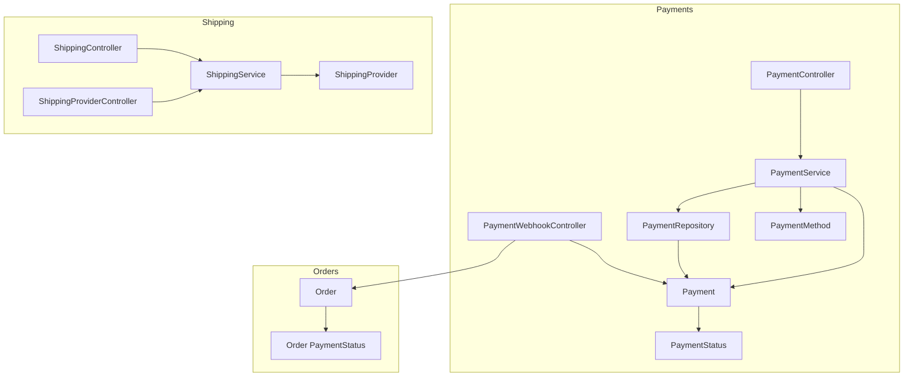
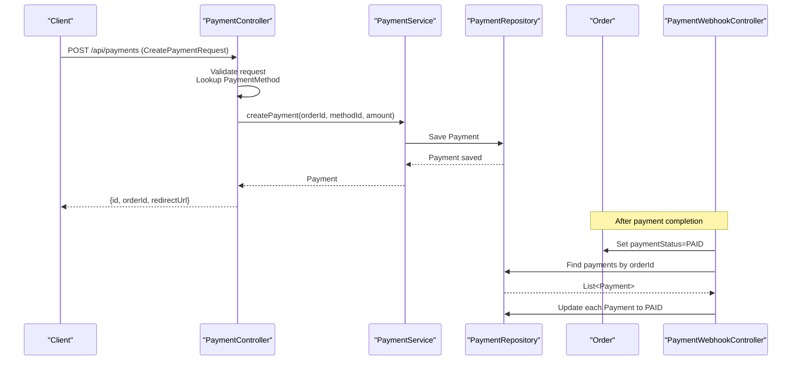
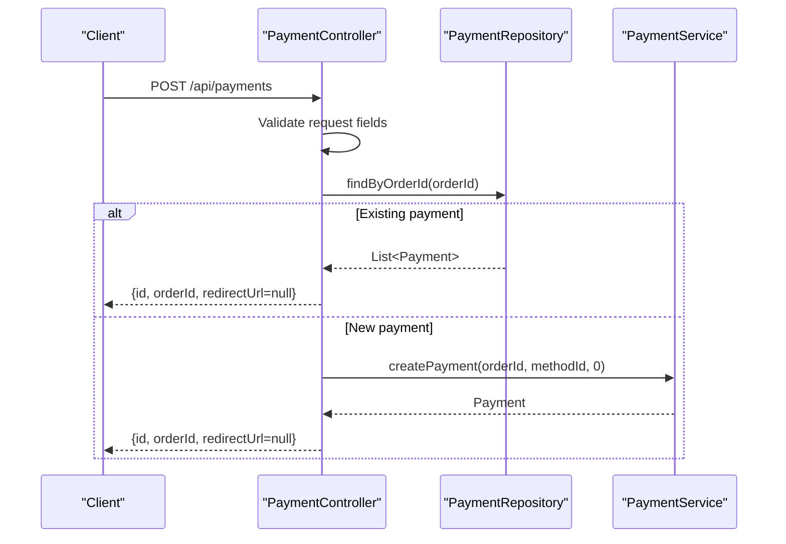
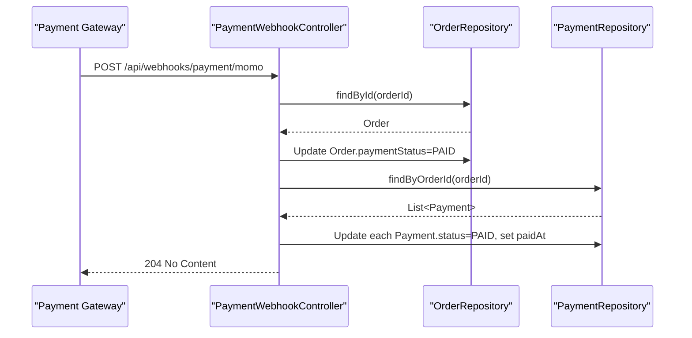
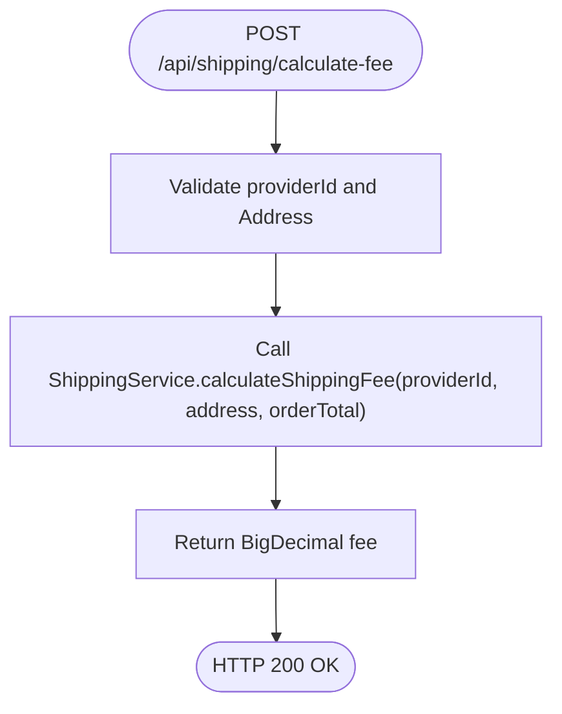
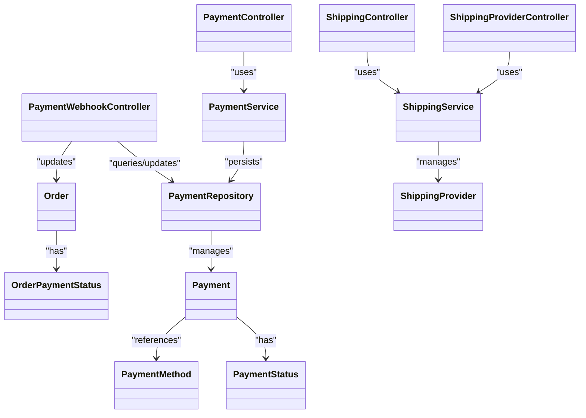

# Payments & Shipping System

<cite>
**Referenced Files in This Document**
- [PaymentController.java](file://src/Backend/src/main/java/com/shoppeclone/backend/payment/controller/PaymentController.java)
- [PaymentWebhookController.java](file://src/Backend/src/main/java/com/shoppeclone/backend/payment/controller/PaymentWebhookController.java)
- [PaymentService.java](file://src/Backend/src/main/java/com/shoppeclone/backend/payment/service/PaymentService.java)
- [PaymentServiceImpl.java](file://src/Backend/src/main/java/com/shoppeclone/backend/payment/service/impl/PaymentServiceImpl.java)
- [PaymentRepository.java](file://src/Backend/src/main/java/com/shoppeclone/backend/payment/repository/PaymentRepository.java)
- [Payment.java](file://src/Backend/src/main/java/com/shoppeclone/backend/payment/entity/Payment.java)
- [PaymentMethod.java](file://src/Backend/src/main/java/com/shoppeclone/backend/payment/entity/PaymentMethod.java)
- [PaymentStatus.java](file://src/Backend/src/main/java/com/shoppeclone/backend/payment/entity/PaymentStatus.java)
- [Order.java](file://src/Backend/src/main/java/com/shoppeclone/backend/order/entity/Order.java)
- [OrderPaymentStatus.java](file://src/Backend/src/main/java/com/shoppeclone/backend/order/entity/PaymentStatus.java)
- [ShippingController.java](file://src/Backend/src/main/java/com/shoppeclone/backend/shipping/controller/ShippingController.java)
- [ShippingProviderController.java](file://src/Backend/src/main/java/com/shoppeclone/backend/shipping/controller/ShippingProviderController.java)
- [ShippingService.java](file://src/Backend/src/main/java/com/shoppeclone/backend/shipping/service/ShippingService.java)
- [ShippingServiceImpl.java](file://src/Backend/src/main/java/com/shoppeclone/backend/shipping/service/impl/ShippingServiceImpl.java)
- [ShippingProvider.java](file://src/Backend/src/main/java/com/shoppeclone/backend/shipping/entity/ShippingProvider.java)
- [application.properties](file://src/Backend/src/main/resources/application.properties)
</cite>

## Table of Contents
1. [Introduction](#introduction)
2. [Project Structure](#project-structure)
3. [Core Components](#core-components)
4. [Architecture Overview](#architecture-overview)
5. [Detailed Component Analysis](#detailed-component-analysis)
6. [Dependency Analysis](#dependency-analysis)
7. [Performance Considerations](#performance-considerations)
8. [Troubleshooting Guide](#troubleshooting-guide)
9. [Conclusion](#conclusion)

## Introduction
This document explains the payments and shipping subsystems of the backend. It covers:
- Payment creation and status updates via controllers and services
- Webhook integration for payment gateways (Momo and VNPAY)
- Shipping provider management and shipping fee calculation
- Relationships with order processing and external APIs
- Configuration options, parameters, and return values
- Common issues and their solutions

The goal is to make the system understandable for beginners while providing sufficient technical depth for experienced developers.

## Project Structure
The payments and shipping system is organized by feature with clear separation of concerns:
- Controllers expose HTTP endpoints for client and gateway integrations
- Services encapsulate business logic and orchestrate repositories
- Entities define data models persisted in MongoDB
- Repositories provide data access for MongoDB collections
- Configuration defines runtime behavior (MongoDB, CORS, logging, etc.)

**Diagram sources**
- [PaymentController.java:1-74](file://src/Backend/src/main/java/com/shoppeclone/backend/payment/controller/PaymentController.java#L1-L74)
- [PaymentWebhookController.java:1-136](file://src/Backend/src/main/java/com/shoppeclone/backend/payment/controller/PaymentWebhookController.java#L1-L136)
- [PaymentService.java:1-17](file://src/Backend/src/main/java/com/shoppeclone/backend/payment/service/PaymentService.java#L1-L17)
- [PaymentRepository.java:1-13](file://src/Backend/src/main/java/com/shoppeclone/backend/payment/repository/PaymentRepository.java#L1-L13)
- [Payment.java:1-27](file://src/Backend/src/main/java/com/shoppeclone/backend/payment/entity/Payment.java#L1-L27)
- [PaymentMethod.java:1-16](file://src/Backend/src/main/java/com/shoppeclone/backend/payment/entity/PaymentMethod.java#L1-L16)
- [PaymentStatus.java:1-8](file://src/Backend/src/main/java/com/shoppeclone/backend/payment/entity/PaymentStatus.java#L1-L8)
- [Order.java:1-55](file://src/Backend/src/main/java/com/shoppeclone/backend/order/entity/Order.java#L1-L55)
- [OrderPaymentStatus.java:1-8](file://src/Backend/src/main/java/com/shoppeclone/backend/order/entity/PaymentStatus.java#L1-L8)
- [ShippingController.java:1-34](file://src/Backend/src/main/java/com/shoppeclone/backend/shipping/controller/ShippingController.java#L1-L34)
- [ShippingProviderController.java:1-25](file://src/Backend/src/main/java/com/shoppeclone/backend/shipping/controller/ShippingProviderController.java#L1-L25)
- [ShippingService.java:1-14](file://src/Backend/src/main/java/com/shoppeclone/backend/shipping/service/ShippingService.java#L1-L14)
- [ShippingProvider.java:1-15](file://src/Backend/src/main/java/com/shoppeclone/backend/shipping/entity/ShippingProvider.java#L1-L15)

**Section sources**
- [PaymentController.java:1-74](file://src/Backend/src/main/java/com/shoppeclone/backend/payment/controller/PaymentController.java#L1-L74)
- [PaymentWebhookController.java:1-136](file://src/Backend/src/main/java/com/shoppeclone/backend/payment/controller/PaymentWebhookController.java#L1-L136)
- [PaymentService.java:1-17](file://src/Backend/src/main/java/com/shoppeclone/backend/payment/service/PaymentService.java#L1-L17)
- [PaymentRepository.java:1-13](file://src/Backend/src/main/java/com/shoppeclone/backend/payment/repository/PaymentRepository.java#L1-L13)
- [Payment.java:1-27](file://src/Backend/src/main/java/com/shoppeclone/backend/payment/entity/Payment.java#L1-L27)
- [PaymentMethod.java:1-16](file://src/Backend/src/main/java/com/shoppeclone/backend/payment/entity/PaymentMethod.java#L1-L16)
- [PaymentStatus.java:1-8](file://src/Backend/src/main/java/com/shoppeclone/backend/payment/entity/PaymentStatus.java#L1-L8)
- [Order.java:1-55](file://src/Backend/src/main/java/com/shoppeclone/backend/order/entity/Order.java#L1-L55)
- [OrderPaymentStatus.java:1-8](file://src/Backend/src/main/java/com/shoppeclone/backend/order/entity/PaymentStatus.java#L1-L8)
- [ShippingController.java:1-34](file://src/Backend/src/main/java/com/shoppeclone/backend/shipping/controller/ShippingController.java#L1-L34)
- [ShippingProviderController.java:1-25](file://src/Backend/src/main/java/com/shoppeclone/backend/shipping/controller/ShippingProviderController.java#L1-L25)
- [ShippingService.java:1-14](file://src/Backend/src/main/java/com/shoppeclone/backend/shipping/service/ShippingService.java#L1-L14)
- [ShippingProvider.java:1-15](file://src/Backend/src/main/java/com/shoppeclone/backend/shipping/entity/ShippingProvider.java#L1-L15)
- [application.properties:1-114](file://src/Backend/src/main/resources/application.properties#L1-L114)

## Core Components
- PaymentController: Creates payments, lists payment methods, retrieves payment by order, and updates payment status internally.
- PaymentWebhookController: Handles payment gateway IPNs (Momo and VNPAY) to mark orders and payments as paid.
- PaymentService: Defines payment lifecycle operations (create, list methods, get by order, update status).
- PaymentRepository: Persists and queries Payment entities in MongoDB.
- Payment entity: Stores payment metadata linked to an order and payment method.
- PaymentMethod entity: Defines supported payment methods (e.g., COD, BANKING).
- Order entity: Tracks order totals, discounts, and payment status; integrates with payments.
- ShippingController and ShippingProviderController: Manage shipping providers and calculate shipping fees.
- ShippingService: Calculates shipping costs based on provider and destination.
- ShippingProvider entity: Holds provider metadata including API endpoint.

Key configuration:
- MongoDB connection and database selection
- CORS settings for cross-origin requests
- Logging levels for development
- Tomcat thread pool tuning for concurrency

**Section sources**
- [PaymentController.java:27-72](file://src/Backend/src/main/java/com/shoppeclone/backend/payment/controller/PaymentController.java#L27-L72)
- [PaymentWebhookController.java:36-107](file://src/Backend/src/main/java/com/shoppeclone/backend/payment/controller/PaymentWebhookController.java#L36-L107)
- [PaymentService.java:8-16](file://src/Backend/src/main/java/com/shoppeclone/backend/payment/service/PaymentService.java#L8-L16)
- [PaymentRepository.java:10-12](file://src/Backend/src/main/java/com/shoppeclone/backend/payment/repository/PaymentRepository.java#L10-L12)
- [Payment.java:11-26](file://src/Backend/src/main/java/com/shoppeclone/backend/payment/entity/Payment.java#L11-L26)
- [PaymentMethod.java:7-15](file://src/Backend/src/main/java/com/shoppeclone/backend/payment/entity/PaymentMethod.java#L7-L15)
- [Order.java:34-35](file://src/Backend/src/main/java/com/shoppeclone/backend/order/entity/Order.java#L34-L35)
- [ShippingController.java:20-32](file://src/Backend/src/main/java/com/shoppeclone/backend/shipping/controller/ShippingController.java#L20-L32)
- [ShippingProviderController.java:20-23](file://src/Backend/src/main/java/com/shoppeclone/backend/shipping/controller/ShippingProviderController.java#L20-L23)
- [ShippingService.java:9-13](file://src/Backend/src/main/java/com/shoppeclone/backend/shipping/service/ShippingService.java#L9-L13)
- [ShippingProvider.java:7-14](file://src/Backend/src/main/java/com/shoppeclone/backend/shipping/entity/ShippingProvider.java#L7-L14)
- [application.properties:14-17](file://src/Backend/src/main/resources/application.properties#L14-L17)
- [application.properties:92-95](file://src/Backend/src/main/resources/application.properties#L92-L95)
- [application.properties:104-108](file://src/Backend/src/main/resources/application.properties#L104-L108)

## Architecture Overview
The payments and shipping system integrates with order processing and external payment gateways:
- Payment creation links to an order and selects a payment method
- Payment webhooks update both Order and Payment entities upon gateway notifications
- Shipping providers are queried and fees are calculated for checkout scenarios

**Diagram sources**
- [PaymentController.java:27-48](file://src/Backend/src/main/java/com/shoppeclone/backend/payment/controller/PaymentController.java#L27-L48)
- [PaymentService.java:11-11](file://src/Backend/src/main/java/com/shoppeclone/backend/payment/service/PaymentService.java#L11-L11)
- [PaymentRepository.java:10-12](file://src/Backend/src/main/java/com/shoppeclone/backend/payment/repository/PaymentRepository.java#L10-L12)
- [Order.java:34-35](file://src/Backend/src/main/java/com/shoppeclone/backend/order/entity/Order.java#L34-L35)
- [PaymentWebhookController.java:36-75](file://src/Backend/src/main/java/com/shoppeclone/backend/payment/controller/PaymentWebhookController.java#L36-L75)

## Detailed Component Analysis

### Payment Processing
- Endpoint: POST /api/payments
  - Request body: CreatePaymentRequest with orderId and paymentMethod
  - Behavior:
    - Validates presence of orderId and paymentMethod
    - Resolves PaymentMethod by code
    - Checks for existing Payment for the order; reuses if present
    - Delegates to PaymentService to create Payment with amount zero if new
    - Returns Payment id, orderId, and redirectUrl (null for COD or unimplemented gateway)
- Endpoint: GET /api/payments/methods
  - Returns list of PaymentMethod entries
- Endpoint: GET /api/payments/order/{orderId}
  - Retrieves Payment associated with an order
- Endpoint: POST /api/payments/{paymentId}/status
  - Updates Payment status (internal use or callback)

**Diagram sources**
- [PaymentController.java:27-48](file://src/Backend/src/main/java/com/shoppeclone/backend/payment/controller/PaymentController.java#L27-L48)
- [PaymentRepository.java:10-12](file://src/Backend/src/main/java/com/shoppeclone/backend/payment/repository/PaymentRepository.java#L10-L12)
- [PaymentService.java:11-11](file://src/Backend/src/main/java/com/shoppeclone/backend/payment/service/PaymentService.java#L11-L11)

Parameters and return values:
- CreatePaymentRequest: orderId (required), paymentMethod (required)
- Response: id, orderId, redirectUrl (nullable)

Relationships:
- Payment is indexed by orderId and paymentMethodId
- PaymentStatus transitions: PENDING → PAID/FAILED

**Section sources**
- [PaymentController.java:27-72](file://src/Backend/src/main/java/com/shoppeclone/backend/payment/controller/PaymentController.java#L27-L72)
- [Payment.java:17-25](file://src/Backend/src/main/java/com/shoppeclone/backend/payment/entity/Payment.java#L17-L25)
- [PaymentStatus.java:3-7](file://src/Backend/src/main/java/com/shoppeclone/backend/payment/entity/PaymentStatus.java#L3-L7)

### Payment Webhook Integration
- Momo IPN: POST /api/webhooks/payment/momo
  - Payload fields include orderId, resultCode, amount, and signature
  - On successful result (resultCode 0 or 9000):
    - Finds Order by orderId
    - Sets Order.paymentStatus to PAID
    - Finds all Payments by orderId and sets their status to PAID with paidAt timestamp
  - Requires HTTP 204 No Content response within 15 seconds
- VNPAY IPN: POST /api/webhooks/payment/vnpay
  - Payload fields include vnp_TxnRef (order ID) and vnp_ResponseCode
  - On success (vnp_ResponseCode equals "00"):
    - Same update flow as Momo for Order and Payment entities
  - Also requires HTTP 204 No Content response

**Diagram sources**
- [PaymentWebhookController.java:36-75](file://src/Backend/src/main/java/com/shoppeclone/backend/payment/controller/PaymentWebhookController.java#L36-L75)
- [Order.java:34-35](file://src/Backend/src/main/java/com/shoppeclone/backend/order/entity/Order.java#L34-L35)
- [Payment.java:24-25](file://src/Backend/src/main/java/com/shoppeclone/backend/payment/entity/Payment.java#L24-L25)

Parameters and return values:
- MomoIpnPayload: orderId, resultCode, amount, signature, and related fields
- VnpayIpnPayload: vnp_TxnRef, vnp_ResponseCode, and related fields
- Responses: 204 No Content for both gateways

Common gateway-specific notes:
- Momo requires a strict 15-second window for response
- VNPAY uses a standardized response code pattern

**Section sources**
- [PaymentWebhookController.java:36-107](file://src/Backend/src/main/java/com/shoppeclone/backend/payment/controller/PaymentWebhookController.java#L36-L107)
- [OrderPaymentStatus.java:3-6](file://src/Backend/src/main/java/com/shoppeclone/backend/order/entity/PaymentStatus.java#L3-L6)

### Shipping Provider Management and Rate Calculation
- Endpoint: GET /api/shipping/providers
  - Returns list of ShippingProvider entries
- Endpoint: GET /api/shipping-providers
  - Returns list of ShippingProvider entries
- Endpoint: POST /api/shipping/calculate-fee
  - Parameters: providerId, Address in body
  - Returns calculated shipping fee as BigDecimal
  - Note: Dummy orderTotal passed as zero for inquiry; frontend ideally passes cart total

**Diagram sources**
- [ShippingController.java:25-32](file://src/Backend/src/main/java/com/shoppeclone/backend/shipping/controller/ShippingController.java#L25-L32)
- [ShippingService.java:12-12](file://src/Backend/src/main/java/com/shoppeclone/backend/shipping/service/ShippingService.java#L12-L12)

Parameters and return values:
- providerId: String identifier of the shipping provider
- Address: Destination address object (fields defined in user model)
- orderTotal: BigDecimal (used for rate calculation)
- Response: BigDecimal representing shipping fee

Implementation note:
- The current implementation accepts a zero orderTotal for fee inquiry; a production system would require accurate cart totals.

**Section sources**
- [ShippingController.java:20-32](file://src/Backend/src/main/java/com/shoppeclone/backend/shipping/controller/ShippingController.java#L20-L32)
- [ShippingProviderController.java:20-23](file://src/Backend/src/main/java/com/shoppeclone/backend/shipping/controller/ShippingProviderController.java#L20-L23)
- [ShippingService.java:9-13](file://src/Backend/src/main/java/com/shoppeclone/backend/shipping/service/ShippingService.java#L9-L13)
- [ShippingProvider.java:7-14](file://src/Backend/src/main/java/com/shoppeclone/backend/shipping/entity/ShippingProvider.java#L7-L14)

### Fulfillment Tracking
Tracking is not implemented in the current codebase. The Order entity includes shipper-related fields (shipperId, assignedAt, deliveryNote, proofOfDeliveryUrl) but lacks endpoints or services to manage tracking updates. To implement tracking:
- Add endpoints to assign shippers and update delivery proofs
- Extend Order with tracking events and timestamps
- Integrate with external tracking APIs if needed

[No sources needed since this section does not analyze specific files]

## Dependency Analysis
- Controllers depend on services for business logic
- Services depend on repositories for persistence
- Entities define relationships and indexing for efficient queries
- Order and Payment share a one-to-many relationship via orderId
- PaymentMethod is referenced by Payment via paymentMethodId

**Diagram sources**
- [PaymentController.java:23-25](file://src/Backend/src/main/java/com/shoppeclone/backend/payment/controller/PaymentController.java#L23-L25)
- [PaymentWebhookController.java:27-28](file://src/Backend/src/main/java/com/shoppeclone/backend/payment/controller/PaymentWebhookController.java#L27-L28)
- [PaymentService.java:1-17](file://src/Backend/src/main/java/com/shoppeclone/backend/payment/service/PaymentService.java#L1-L17)
- [PaymentRepository.java:1-13](file://src/Backend/src/main/java/com/shoppeclone/backend/payment/repository/PaymentRepository.java#L1-L13)
- [Payment.java:1-27](file://src/Backend/src/main/java/com/shoppeclone/backend/payment/entity/Payment.java#L1-L27)
- [PaymentMethod.java:1-16](file://src/Backend/src/main/java/com/shoppeclone/backend/payment/entity/PaymentMethod.java#L1-L16)
- [PaymentStatus.java:1-8](file://src/Backend/src/main/java/com/shoppeclone/backend/payment/entity/PaymentStatus.java#L1-L8)
- [Order.java:1-55](file://src/Backend/src/main/java/com/shoppeclone/backend/order/entity/Order.java#L1-L55)
- [OrderPaymentStatus.java:1-8](file://src/Backend/src/main/java/com/shoppeclone/backend/order/entity/PaymentStatus.java#L1-L8)
- [ShippingController.java:1-34](file://src/Backend/src/main/java/com/shoppeclone/backend/shipping/controller/ShippingController.java#L1-L34)
- [ShippingProviderController.java:1-25](file://src/Backend/src/main/java/com/shoppeclone/backend/shipping/controller/ShippingProviderController.java#L1-L25)
- [ShippingService.java:1-14](file://src/Backend/src/main/java/com/shoppeclone/backend/shipping/service/ShippingService.java#L1-L14)
- [ShippingProvider.java:1-15](file://src/Backend/src/main/java/com/shoppeclone/backend/shipping/entity/ShippingProvider.java#L1-L15)

**Section sources**
- [PaymentController.java:1-74](file://src/Backend/src/main/java/com/shoppeclone/backend/payment/controller/PaymentController.java#L1-L74)
- [PaymentWebhookController.java:1-136](file://src/Backend/src/main/java/com/shoppeclone/backend/payment/controller/PaymentWebhookController.java#L1-L136)
- [PaymentService.java:1-17](file://src/Backend/src/main/java/com/shoppeclone/backend/payment/service/PaymentService.java#L1-L17)
- [PaymentRepository.java:1-13](file://src/Backend/src/main/java/com/shoppeclone/backend/payment/repository/PaymentRepository.java#L1-L13)
- [Payment.java:1-27](file://src/Backend/src/main/java/com/shoppeclone/backend/payment/entity/Payment.java#L1-L27)
- [PaymentMethod.java:1-16](file://src/Backend/src/main/java/com/shoppeclone/backend/payment/entity/PaymentMethod.java#L1-L16)
- [PaymentStatus.java:1-8](file://src/Backend/src/main/java/com/shoppeclone/backend/payment/entity/PaymentStatus.java#L1-L8)
- [Order.java:1-55](file://src/Backend/src/main/java/com/shoppeclone/backend/order/entity/Order.java#L1-L55)
- [OrderPaymentStatus.java:1-8](file://src/Backend/src/main/java/com/shoppeclone/backend/order/entity/PaymentStatus.java#L1-L8)
- [ShippingController.java:1-34](file://src/Backend/src/main/java/com/shoppeclone/backend/shipping/controller/ShippingController.java#L1-L34)
- [ShippingProviderController.java:1-25](file://src/Backend/src/main/java/com/shoppeclone/backend/shipping/controller/ShippingProviderController.java#L1-L25)
- [ShippingService.java:1-14](file://src/Backend/src/main/java/com/shoppeclone/backend/shipping/service/ShippingService.java#L1-L14)
- [ShippingProvider.java:1-15](file://src/Backend/src/main/java/com/shoppeclone/backend/shipping/entity/ShippingProvider.java#L1-L15)

## Performance Considerations
- MongoDB indexing:
  - Payment and PaymentMethod entities use indexed fields for orderId and paymentMethodId to speed up lookups
- Concurrency:
  - Tomcat thread pool is tuned for higher concurrency during peak loads (flash sale support)
- Logging:
  - DEBUG logging enabled for core packages to aid diagnostics
- Recommendations:
  - Add pagination for listing payment methods and providers
  - Cache frequently accessed provider configurations
  - Use async processing for webhook responses to avoid timeouts

**Section sources**
- [Payment.java:17-21](file://src/Backend/src/main/java/com/shoppeclone/backend/payment/entity/Payment.java#L17-L21)
- [application.properties:104-108](file://src/Backend/src/main/resources/application.properties#L104-L108)
- [application.properties:46-49](file://src/Backend/src/main/resources/application.properties#L46-L49)

## Troubleshooting Guide
Common issues and resolutions:
- Missing required fields in payment creation:
  - Symptom: Validation error when orderId or paymentMethod is absent
  - Resolution: Ensure CreatePaymentRequest includes both fields
- Payment method not found:
  - Symptom: Exception indicating payment method not found
  - Resolution: Verify paymentMethod.code exists in PaymentMethod collection
- Duplicate payment creation:
  - Symptom: Multiple payments for the same order
  - Resolution: Reuse existing payment by orderId; the controller checks and returns the existing record
- Webhook timing failures:
  - Symptom: Gateway retries or timeouts
  - Resolution: Ensure webhook responds with 204 No Content immediately; avoid heavy synchronous work inside the handler
- Order not found in webhook:
  - Symptom: Warning logs for missing order
  - Resolution: Confirm orderId correctness and order existence before initiating payment
- CORS errors:
  - Symptom: Browser blocking requests to payment/webhook endpoints
  - Resolution: Configure allowed origins in application.properties for your frontend domains

Operational tips:
- Enable DEBUG logs for com.shoppeclone.backend to capture detailed traces
- Monitor Tomcat thread usage under load to prevent saturation

**Section sources**
- [PaymentController.java:29-33](file://src/Backend/src/main/java/com/shoppeclone/backend/payment/controller/PaymentController.java#L29-L33)
- [PaymentController.java:35-41](file://src/Backend/src/main/java/com/shoppeclone/backend/payment/controller/PaymentController.java#L35-L41)
- [PaymentWebhookController.java:44-53](file://src/Backend/src/main/java/com/shoppeclone/backend/payment/controller/PaymentWebhookController.java#L44-L53)
- [application.properties:92-95](file://src/Backend/src/main/resources/application.properties#L92-L95)
- [application.properties:46-49](file://src/Backend/src/main/resources/application.properties#L46-L49)

## Conclusion
The payments and shipping subsystems provide a solid foundation:
- Payments support creation, method enumeration, retrieval by order, and webhook-driven status updates
- Shipping exposes provider listings and fee calculation endpoints
- Clear separation of concerns enables extensibility for additional gateways and providers
To enhance the system, consider implementing fulfillment tracking endpoints, caching provider configurations, and adding robust error handling and retry mechanisms for webhooks.