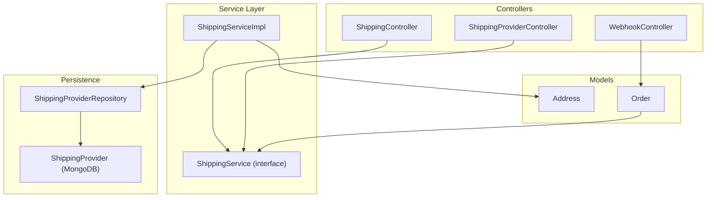
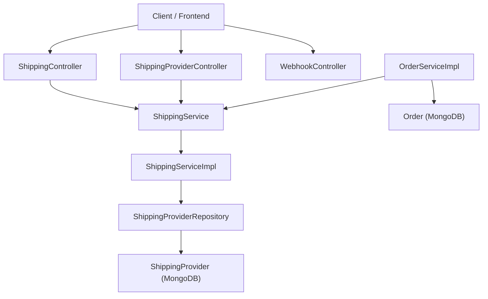
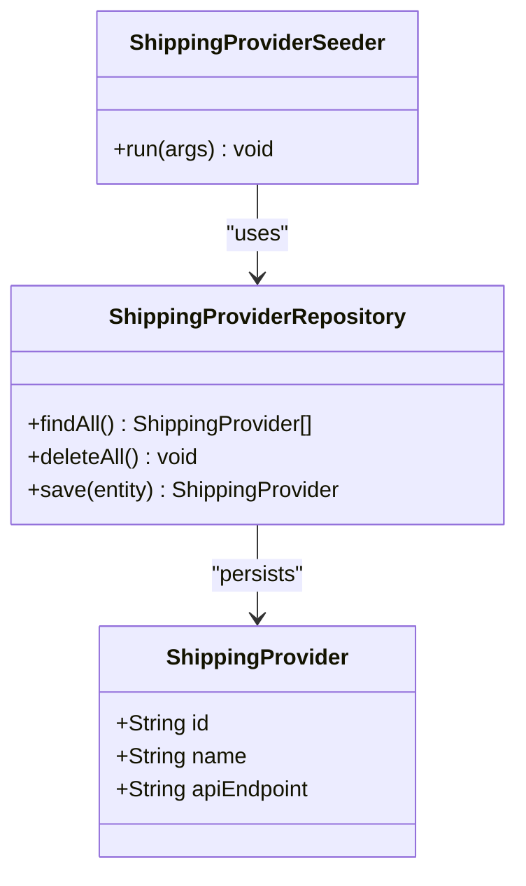
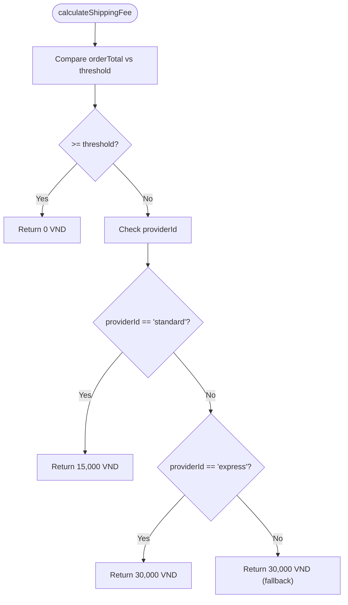
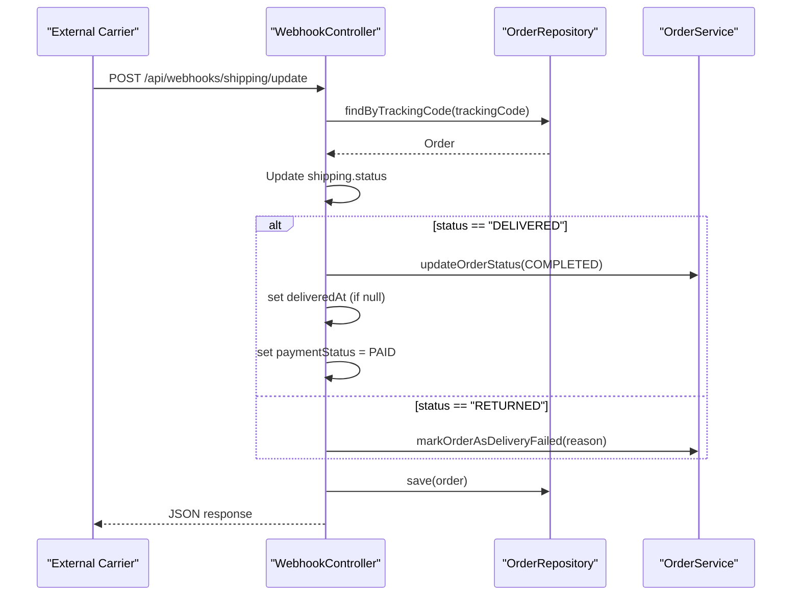
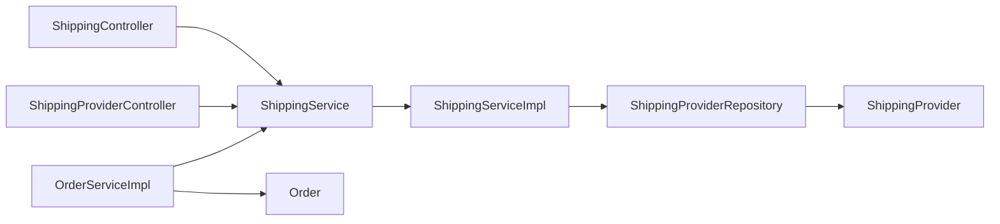

# Shipping Provider Management

<cite>
**Referenced Files in This Document**
- [ShippingController.java](file://src/Backend/src/main/java/com/shoppeclone/backend/shipping/controller/ShippingController.java)
- [ShippingProviderController.java](file://src/Backend/src/main/java/com/shoppeclone/backend/shipping/controller/ShippingProviderController.java)
- [WebhookController.java](file://src/Backend/src/main/java/com/shoppeclone/backend/shipping/controller/WebhookController.java)
- [ShippingService.java](file://src/Backend/src/main/java/com/shoppeclone/backend/shipping/service/ShippingService.java)
- [ShippingServiceImpl.java](file://src/Backend/src/main/java/com/shoppeclone/backend/shipping/service/impl/ShippingServiceImpl.java)
- [ShippingProvider.java](file://src/Backend/src/main/java/com/shoppeclone/backend/shipping/entity/ShippingProvider.java)
- [ShippingProviderRepository.java](file://src/Backend/src/main/java/com/shoppeclone/backend/shipping/repository/ShippingProviderRepository.java)
- [ShippingProviderSeeder.java](file://src/Backend/src/main/java/com/shoppeclone/backend/shipping/seeder/ShippingProviderSeeder.java)
- [Address.java](file://src/Backend/src/main/java/com/shoppeclone/backend/user/model/Address.java)
- [Order.java](file://src/Backend/src/main/java/com/shoppeclone/backend/order/entity/Order.java)
- [OrderServiceImpl.java](file://src/Backend/src/main/java/com/shoppeclone/backend/order/service/impl/OrderServiceImpl.java)
- [checkout-backend.html](file://src/Frontend/checkout-backend.html)
- [LogNhaworkwithCusor.md](file://docs/ai_logs/LogNhaworkwithCusor.md)
</cite>

## Table of Contents
1. [Introduction](#introduction)
2. [Project Structure](#project-structure)
3. [Core Components](#core-components)
4. [Architecture Overview](#architecture-overview)
5. [Detailed Component Analysis](#detailed-component-analysis)
6. [Dependency Analysis](#dependency-analysis)
7. [Performance Considerations](#performance-considerations)
8. [Troubleshooting Guide](#troubleshooting-guide)
9. [Conclusion](#conclusion)
10. [Appendices](#appendices)

## Introduction
This document explains the shipping provider management and logistics integration in the backend. It covers provider registration and seeding, rate calculation algorithms, delivery estimation methods, controller endpoints for provider management and rate quotes, tracking updates via webhooks, and how shipping integrates with order creation. It also documents the shipping provider entity, service tiers, geographic coverage considerations, and practical examples for cost calculation, delivery time estimates, and provider selection logic. Integration with external shipping APIs, tracking number generation, and delivery status updates are addressed alongside shipping policy configuration, international shipping considerations, and package dimension handling.

## Project Structure
The shipping domain is organized around Spring MVC controllers, a service interface and implementation, MongoDB entities and repositories, and a seeder to initialize providers. The order service consumes the shipping service to compute shipping fees and attach shipping metadata to orders.

**Diagram sources**
- [ShippingController.java:1-34](file://src/Backend/src/main/java/com/shoppeclone/backend/shipping/controller/ShippingController.java#L1-L34)
- [ShippingProviderController.java:1-25](file://src/Backend/src/main/java/com/shoppeclone/backend/shipping/controller/ShippingProviderController.java#L1-L25)
- [WebhookController.java:1-83](file://src/Backend/src/main/java/com/shoppeclone/backend/shipping/controller/WebhookController.java#L1-L83)
- [ShippingService.java:1-14](file://src/Backend/src/main/java/com/shoppeclone/backend/shipping/service/ShippingService.java#L1-L14)
- [ShippingServiceImpl.java:1-41](file://src/Backend/src/main/java/com/shoppeclone/backend/shipping/service/impl/ShippingServiceImpl.java#L1-L41)
- [ShippingProviderRepository.java:1-8](file://src/Backend/src/main/java/com/shoppeclone/backend/shipping/repository/ShippingProviderRepository.java#L1-L8)
- [ShippingProvider.java:1-15](file://src/Backend/src/main/java/com/shoppeclone/backend/shipping/entity/ShippingProvider.java#L1-L15)
- [Address.java:1-24](file://src/Backend/src/main/java/com/shoppeclone/backend/user/model/Address.java#L1-L24)
- [Order.java:1-55](file://src/Backend/src/main/java/com/shoppeclone/backend/order/entity/Order.java#L1-L55)

**Section sources**
- [ShippingController.java:1-34](file://src/Backend/src/main/java/com/shoppeclone/backend/shipping/controller/ShippingController.java#L1-L34)
- [ShippingProviderController.java:1-25](file://src/Backend/src/main/java/com/shoppeclone/backend/shipping/controller/ShippingProviderController.java#L1-L25)
- [WebhookController.java:1-83](file://src/Backend/src/main/java/com/shoppeclone/backend/shipping/controller/WebhookController.java#L1-L83)
- [ShippingService.java:1-14](file://src/Backend/src/main/java/com/shoppeclone/backend/shipping/service/ShippingService.java#L1-L14)
- [ShippingServiceImpl.java:1-41](file://src/Backend/src/main/java/com/shoppeclone/backend/shipping/service/impl/ShippingServiceImpl.java#L1-L41)
- [ShippingProviderRepository.java:1-8](file://src/Backend/src/main/java/com/shoppeclone/backend/shipping/repository/ShippingProviderRepository.java#L1-L8)
- [ShippingProvider.java:1-15](file://src/Backend/src/main/java/com/shoppeclone/backend/shipping/entity/ShippingProvider.java#L1-L15)
- [Address.java:1-24](file://src/Backend/src/main/java/com/shoppeclone/backend/user/model/Address.java#L1-L24)
- [Order.java:1-55](file://src/Backend/src/main/java/com/shoppeclone/backend/order/entity/Order.java#L1-L55)

## Core Components
- Controllers:
  - ShippingController: Lists providers and calculates shipping fees for a given provider and address.
  - ShippingProviderController: Lists all registered shipping providers.
  - WebhookController: Receives external shipping updates to synchronize delivery status and mark orders as completed or returned.
- Service:
  - ShippingService: Defines provider listing and fee calculation.
  - ShippingServiceImpl: Implements provider listing and a simple fee calculation algorithm.
- Persistence:
  - ShippingProviderRepository: MongoDB repository for providers.
  - ShippingProvider: MongoDB entity representing a shipping provider with id, name, and API endpoint.
- Seeder:
  - ShippingProviderSeeder: Seeds standard and express providers with predefined IDs and endpoints.
- Models:
  - Address: Customer address used for shipping calculations.
  - Order: Contains shipping metadata and integrates with shipping service during order creation.

**Section sources**
- [ShippingController.java:1-34](file://src/Backend/src/main/java/com/shoppeclone/backend/shipping/controller/ShippingController.java#L1-L34)
- [ShippingProviderController.java:1-25](file://src/Backend/src/main/java/com/shoppeclone/backend/shipping/controller/ShippingProviderController.java#L1-L25)
- [WebhookController.java:1-83](file://src/Backend/src/main/java/com/shoppeclone/backend/shipping/controller/WebhookController.java#L1-L83)
- [ShippingService.java:1-14](file://src/Backend/src/main/java/com/shoppeclone/backend/shipping/service/ShippingService.java#L1-L14)
- [ShippingServiceImpl.java:1-41](file://src/Backend/src/main/java/com/shoppeclone/backend/shipping/service/impl/ShippingServiceImpl.java#L1-L41)
- [ShippingProviderRepository.java:1-8](file://src/Backend/src/main/java/com/shoppeclone/backend/shipping/repository/ShippingProviderRepository.java#L1-L8)
- [ShippingProvider.java:1-15](file://src/Backend/src/main/java/com/shoppeclone/backend/shipping/entity/ShippingProvider.java#L1-L15)
- [ShippingProviderSeeder.java:1-42](file://src/Backend/src/main/java/com/shoppeclone/backend/shipping/seeder/ShippingProviderSeeder.java#L1-L42)
- [Address.java:1-24](file://src/Backend/src/main/java/com/shoppeclone/backend/user/model/Address.java#L1-L24)
- [Order.java:1-55](file://src/Backend/src/main/java/com/shoppeclone/backend/order/entity/Order.java#L1-L55)

## Architecture Overview
The shipping module follows a layered architecture:
- Controllers expose REST endpoints for provider listing, rate calculation, and webhook updates.
- Service layer encapsulates business logic for provider retrieval and fee computation.
- Repository persists provider records in MongoDB.
- Order service integrates shipping fee calculation and shipping metadata into order creation.

**Diagram sources**
- [ShippingController.java:1-34](file://src/Backend/src/main/java/com/shoppeclone/backend/shipping/controller/ShippingController.java#L1-L34)
- [ShippingProviderController.java:1-25](file://src/Backend/src/main/java/com/shoppeclone/backend/shipping/controller/ShippingProviderController.java#L1-L25)
- [WebhookController.java:1-83](file://src/Backend/src/main/java/com/shoppeclone/backend/shipping/controller/WebhookController.java#L1-L83)
- [ShippingService.java:1-14](file://src/Backend/src/main/java/com/shoppeclone/backend/shipping/service/ShippingService.java#L1-L14)
- [ShippingServiceImpl.java:1-41](file://src/Backend/src/main/java/com/shoppeclone/backend/shipping/service/impl/ShippingServiceImpl.java#L1-L41)
- [ShippingProviderRepository.java:1-8](file://src/Backend/src/main/java/com/shoppeclone/backend/shipping/repository/ShippingProviderRepository.java#L1-L8)
- [ShippingProvider.java:1-15](file://src/Backend/src/main/java/com/shoppeclone/backend/shipping/entity/ShippingProvider.java#L1-L15)
- [OrderServiceImpl.java:300-383](file://src/Backend/src/main/java/com/shoppeclone/backend/order/service/impl/OrderServiceImpl.java#L300-L383)

## Detailed Component Analysis

### Shipping Provider Entity and Registration
- Entity: ShippingProvider stores id, name, and apiEndpoint. It is persisted in the shipping_providers collection.
- Seeder: ShippingProviderSeeder initializes two providers with fixed IDs:
  - standard: Standard shipping with a dedicated API endpoint.
  - express: Express shipping with a dedicated API endpoint.
- Repository: ShippingProviderRepository extends MongoRepository for CRUD operations.

**Diagram sources**
- [ShippingProvider.java:1-15](file://src/Backend/src/main/java/com/shoppeclone/backend/shipping/entity/ShippingProvider.java#L1-L15)
- [ShippingProviderRepository.java:1-8](file://src/Backend/src/main/java/com/shoppeclone/backend/shipping/repository/ShippingProviderRepository.java#L1-L8)
- [ShippingProviderSeeder.java:1-42](file://src/Backend/src/main/java/com/shoppeclone/backend/shipping/seeder/ShippingProviderSeeder.java#L1-L42)

**Section sources**
- [ShippingProvider.java:1-15](file://src/Backend/src/main/java/com/shoppeclone/backend/shipping/entity/ShippingProvider.java#L1-L15)
- [ShippingProviderRepository.java:1-8](file://src/Backend/src/main/java/com/shoppeclone/backend/shipping/repository/ShippingProviderRepository.java#L1-L8)
- [ShippingProviderSeeder.java:1-42](file://src/Backend/src/main/java/com/shoppeclone/backend/shipping/seeder/ShippingProviderSeeder.java#L1-L42)

### Rate Calculation Algorithm
- Endpoint: POST /api/shipping/calculate-fee accepts providerId and Address, returns a BigDecimal fee.
- Algorithm:
  - Free shipping threshold: Orders with total >= 1,000,000 VND receive free shipping.
  - Provider-based fees:
    - standard: 15,000 VND
    - express: 30,000 VND
  - Default fallback: 30,000 VND if providerId does not match known tiers.

**Diagram sources**
- [ShippingController.java:25-32](file://src/Backend/src/main/java/com/shoppeclone/backend/shipping/controller/ShippingController.java#L25-L32)
- [ShippingServiceImpl.java:24-40](file://src/Backend/src/main/java/com/shoppeclone/backend/shipping/service/impl/ShippingServiceImpl.java#L24-L40)

**Section sources**
- [ShippingController.java:25-32](file://src/Backend/src/main/java/com/shoppeclone/backend/shipping/controller/ShippingController.java#L25-L32)
- [ShippingServiceImpl.java:24-40](file://src/Backend/src/main/java/com/shoppeclone/backend/shipping/service/impl/ShippingServiceImpl.java#L24-L40)

### Delivery Estimation Methods
- UI hints: The frontend presents delivery estimates aligned with provider tiers:
  - standard: 3–5 business days
  - express: 1–2 business days
- These are UI-level estimates and do not affect backend calculations.

**Section sources**
- [checkout-backend.html:1147-1167](file://src/Frontend/checkout-backend.html#L1147-L1167)

### Provider Selection Logic
- Provider listing: GET /api/shipping/providers and GET /api/shipping-providers returns all registered providers.
- Selection in checkout:
  - The frontend defaults to provider id "standard" if present, otherwise selects the first provider.
  - Users can choose among providers, and the selected providerId is used for fee calculation.

**Section sources**
- [ShippingController.java:20-23](file://src/Backend/src/main/java/com/shoppeclone/backend/shipping/controller/ShippingController.java#L20-L23)
- [ShippingProviderController.java:20-23](file://src/Backend/src/main/java/com/shoppeclone/backend/shipping/controller/ShippingProviderController.java#L20-L23)
- [checkout-backend.html:1134-1176](file://src/Frontend/checkout-backend.html#L1134-L1176)

### Tracking Updates and Delivery Status
- Endpoint: POST /api/webhooks/shipping/update receives a payload with trackingCode, status, location, and reason.
- Behavior:
  - Finds order by trackingCode; throws if not found.
  - Updates shipping status on the order’s shipping object.
  - On DELIVERED:
    - Marks order as COMPLETED.
    - Sets deliveredAt if unset.
    - Sets payment status to PAID (assumes COD).
  - On RETURNED:
    - Marks order as delivery failed with a reason.
    - Updates shipping status accordingly.
  - Updates updatedAt and saves the order.
  - Returns structured response with success, orderId, trackingCode, orderStatus, shippingStatus, and updatedAt.

**Diagram sources**
- [WebhookController.java:36-80](file://src/Backend/src/main/java/com/shoppeclone/backend/shipping/controller/WebhookController.java#L36-L80)
- [OrderServiceImpl.java:300-383](file://src/Backend/src/main/java/com/shoppeclone/backend/order/service/impl/OrderServiceImpl.java#L300-L383)

**Section sources**
- [WebhookController.java:36-80](file://src/Backend/src/main/java/com/shoppeclone/backend/shipping/controller/WebhookController.java#L36-L80)

### Integration with External Shipping APIs
- Provider entity includes apiEndpoint for each shipping provider.
- The current implementation computes shipping fees locally; however, the presence of apiEndpoint indicates potential integration points for external carriers.
- Tracking updates are handled via webhooks, enabling synchronization with carrier systems.

**Section sources**
- [ShippingProvider.java:12-13](file://src/Backend/src/main/java/com/shoppeclone/backend/shipping/entity/ShippingProvider.java#L12-L13)
- [WebhookController.java:36-80](file://src/Backend/src/main/java/com/shoppeclone/backend/shipping/controller/WebhookController.java#L36-L80)

### Tracking Number Generation and Delivery Status Updates
- Tracking number generation is external to the backend; the webhook expects a trackingCode to locate the order.
- The AI log confirms that the system expects a trackingCode and will use it to find the order and update statuses accordingly.

**Section sources**
- [LogNhaworkwithCusor.md:3636-3659](file://docs/ai_logs/LogNhaworkwithCusor.md#L3636-L3659)

### Shipping Policy Configuration
- Free shipping threshold: Orders meeting or exceeding 1,000,000 VND are free of charge.
- Provider tiers:
  - standard: 15,000 VND
  - express: 30,000 VND
- Default fallback: 30,000 VND for unknown provider IDs.

**Section sources**
- [ShippingServiceImpl.java:26-40](file://src/Backend/src/main/java/com/shoppeclone/backend/shipping/service/impl/ShippingServiceImpl.java#L26-L40)

### International Shipping Considerations
- Current implementation does not include country-specific logic or currency conversion.
- Address model includes city, district, and ward fields suitable for domestic delivery contexts.
- No explicit international coverage or dimensional weight handling is present.

**Section sources**
- [Address.java:17-20](file://src/Backend/src/main/java/com/shoppeclone/backend/user/model/Address.java#L17-L20)

### Package Dimension Handling
- No package dimension fields are present in the Address or Order models.
- The shipping fee calculation does not incorporate dimensional weight or volumetric pricing.

**Section sources**
- [Address.java:1-24](file://src/Backend/src/main/java/com/shoppeclone/backend/user/model/Address.java#L1-L24)
- [Order.java:1-55](file://src/Backend/src/main/java/com/shoppeclone/backend/order/entity/Order.java#L1-L55)

## Dependency Analysis

**Diagram sources**
- [ShippingController.java:1-34](file://src/Backend/src/main/java/com/shoppeclone/backend/shipping/controller/ShippingController.java#L1-L34)
- [ShippingProviderController.java:1-25](file://src/Backend/src/main/java/com/shoppeclone/backend/shipping/controller/ShippingProviderController.java#L1-L25)
- [ShippingService.java:1-14](file://src/Backend/src/main/java/com/shoppeclone/backend/shipping/service/ShippingService.java#L1-L14)
- [ShippingServiceImpl.java:1-41](file://src/Backend/src/main/java/com/shoppeclone/backend/shipping/service/impl/ShippingServiceImpl.java#L1-L41)
- [ShippingProviderRepository.java:1-8](file://src/Backend/src/main/java/com/shoppeclone/backend/shipping/repository/ShippingProviderRepository.java#L1-L8)
- [ShippingProvider.java:1-15](file://src/Backend/src/main/java/com/shoppeclone/backend/shipping/entity/ShippingProvider.java#L1-L15)
- [OrderServiceImpl.java:300-383](file://src/Backend/src/main/java/com/shoppeclone/backend/order/service/impl/OrderServiceImpl.java#L300-L383)
- [Order.java:1-55](file://src/Backend/src/main/java/com/shoppeclone/backend/order/entity/Order.java#L1-L55)

**Section sources**
- [ShippingController.java:1-34](file://src/Backend/src/main/java/com/shoppeclone/backend/shipping/controller/ShippingController.java#L1-L34)
- [ShippingProviderController.java:1-25](file://src/Backend/src/main/java/com/shoppeclone/backend/shipping/controller/ShippingProviderController.java#L1-L25)
- [ShippingService.java:1-14](file://src/Backend/src/main/java/com/shoppeclone/backend/shipping/service/ShippingService.java#L1-L14)
- [ShippingServiceImpl.java:1-41](file://src/Backend/src/main/java/com/shoppeclone/backend/shipping/service/impl/ShippingServiceImpl.java#L1-L41)
- [ShippingProviderRepository.java:1-8](file://src/Backend/src/main/java/com/shoppeclone/backend/shipping/repository/ShippingProviderRepository.java#L1-L8)
- [ShippingProvider.java:1-15](file://src/Backend/src/main/java/com/shoppeclone/backend/shipping/entity/ShippingProvider.java#L1-L15)
- [OrderServiceImpl.java:300-383](file://src/Backend/src/main/java/com/shoppeclone/backend/order/service/impl/OrderServiceImpl.java#L300-L383)
- [Order.java:1-55](file://src/Backend/src/main/java/com/shoppeclone/backend/order/entity/Order.java#L1-L55)

## Performance Considerations
- Provider lookup is O(n) across the small set of providers; acceptable for current scale.
- Fee calculation is constant-time and lightweight.
- Webhook processing performs a single database lookup by trackingCode; ensure indexing on trackingCode for production workloads.
- Consider caching provider lists and thresholds for high-throughput scenarios.

## Troubleshooting Guide
- Tracking code not found:
  - Symptom: Webhook endpoint throws an error indicating the tracking code was not found.
  - Resolution: Ensure the order has a valid trackingCode before sending webhook events.
- Unexpected shipping fee:
  - Verify providerId matches "standard" or "express".
  - Confirm orderTotal meets or exceeds the free shipping threshold.
- Delivery status not updating:
  - Confirm webhook payload includes a valid trackingCode and status.
  - Ensure the order’s shipping object exists and is populated.

**Section sources**
- [WebhookController.java:40-41](file://src/Backend/src/main/java/com/shoppeclone/backend/shipping/controller/WebhookController.java#L40-L41)
- [ShippingServiceImpl.java:26-40](file://src/Backend/src/main/java/com/shoppeclone/backend/shipping/service/impl/ShippingServiceImpl.java#L26-L40)

## Conclusion
The shipping module provides a clean separation of concerns with controllers for provider listing and rate calculation, a service layer implementing a straightforward fee algorithm, and a webhook endpoint for tracking updates. Providers are seeded with fixed IDs and endpoints, aligning with tiered service levels. While the current implementation focuses on domestic delivery and basic fee logic, the architecture supports future enhancements such as external API integrations, dimensional weight handling, and international coverage.

## Appendices

### API Endpoints Summary
- GET /api/shipping/providers
  - Returns list of registered shipping providers.
- GET /api/shipping-providers
  - Returns list of registered shipping providers.
- POST /api/shipping/calculate-fee
  - Parameters: providerId (string), body: Address
  - Returns: shipping fee (BigDecimal)
- POST /api/webhooks/shipping/update
  - Body: trackingCode (string), status (string), location (string), reason (string)
  - Returns: structured response with success, orderId, trackingCode, orderStatus, shippingStatus, updatedAt

**Section sources**
- [ShippingController.java:20-32](file://src/Backend/src/main/java/com/shoppeclone/backend/shipping/controller/ShippingController.java#L20-L32)
- [ShippingProviderController.java:20-23](file://src/Backend/src/main/java/com/shoppeclone/backend/shipping/controller/ShippingProviderController.java#L20-L23)
- [WebhookController.java:36-80](file://src/Backend/src/main/java/com/shoppeclone/backend/shipping/controller/WebhookController.java#L36-L80)

### Examples

- Example: Shipping Cost Calculation
  - Scenario: Order total is 900,000 VND with provider "express".
  - Steps:
    - Compare orderTotal vs threshold: 900,000 < 1,000,000 → Not free.
    - Provider check: providerId == "express" → 30,000 VND.
  - Result: Shipping fee = 30,000 VND.

- Example: Delivery Time Estimates
  - Scenario: User selects "standard" or "express" in checkout.
  - UI displays:
    - standard: 3–5 business days
    - express: 1–2 business days

- Example: Provider Selection Logic
  - Scenario: Checkout loads providers; defaults to provider id "standard" if present.
  - Behavior: Selected providerId is used for fee calculation.

**Section sources**
- [ShippingServiceImpl.java:26-40](file://src/Backend/src/main/java/com/shoppeclone/backend/shipping/service/impl/ShippingServiceImpl.java#L26-L40)
- [checkout-backend.html:1147-1167](file://src/Frontend/checkout-backend.html#L1147-L1167)