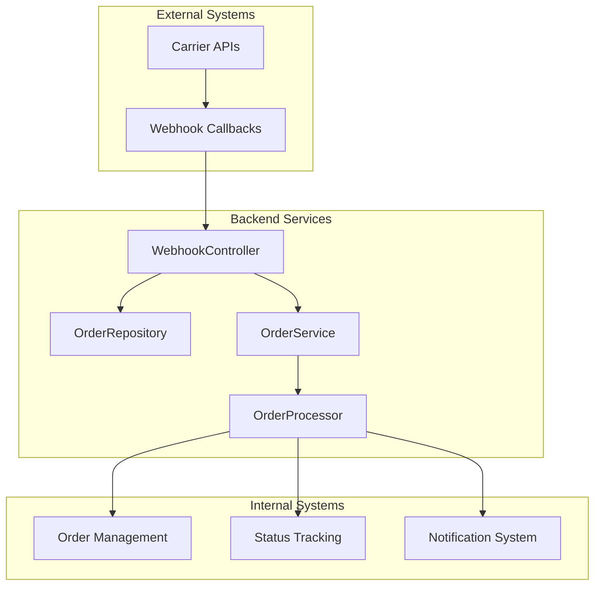
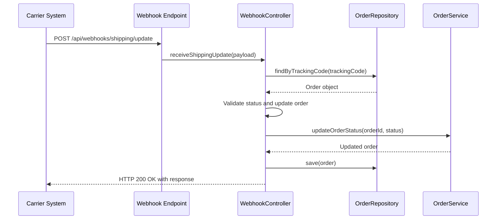
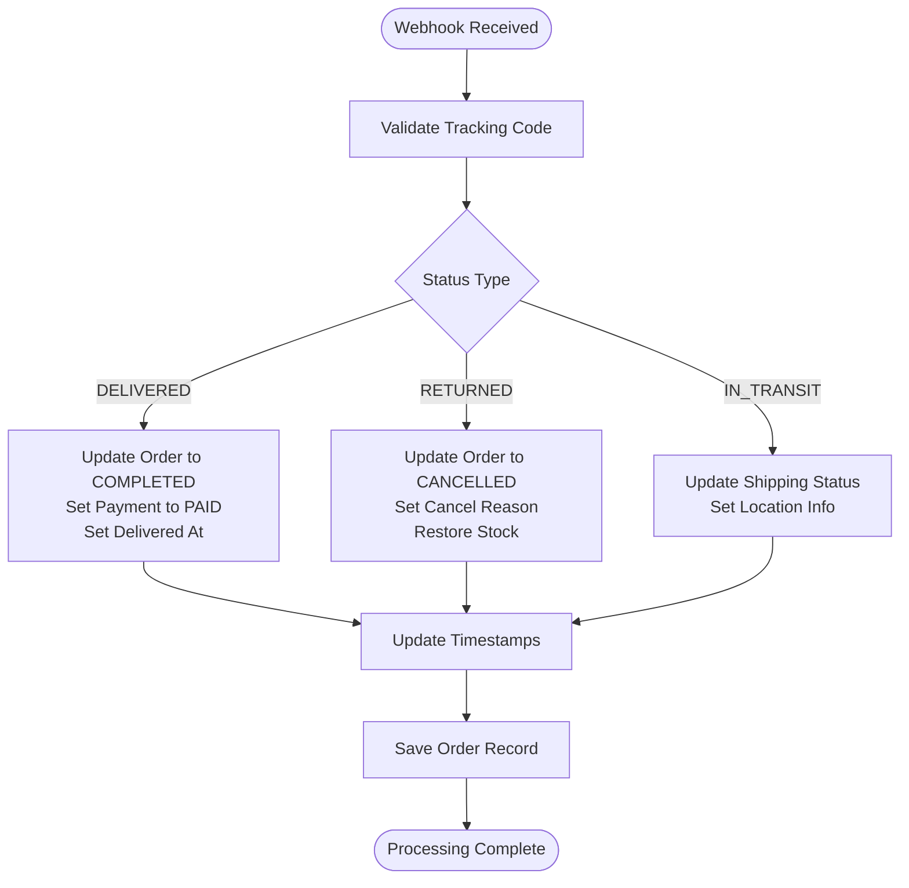
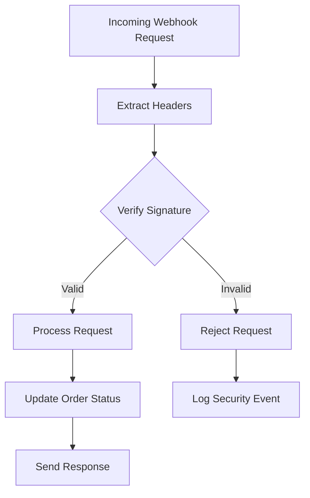
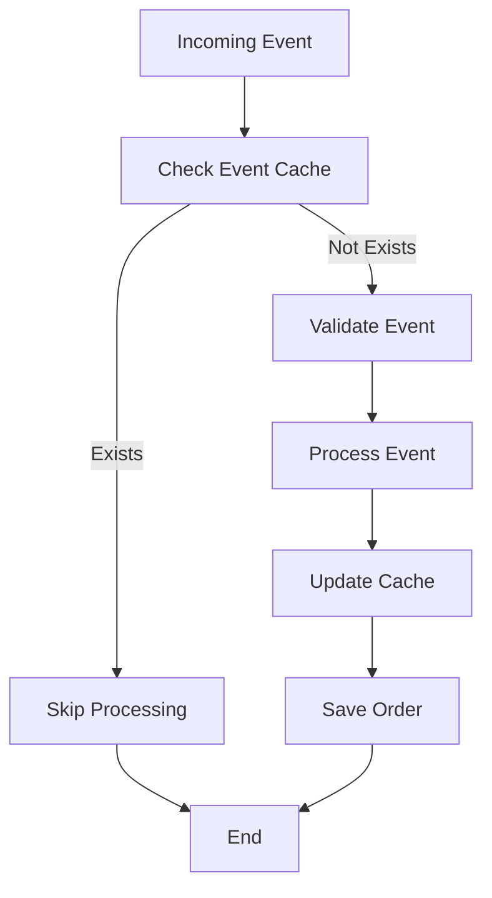
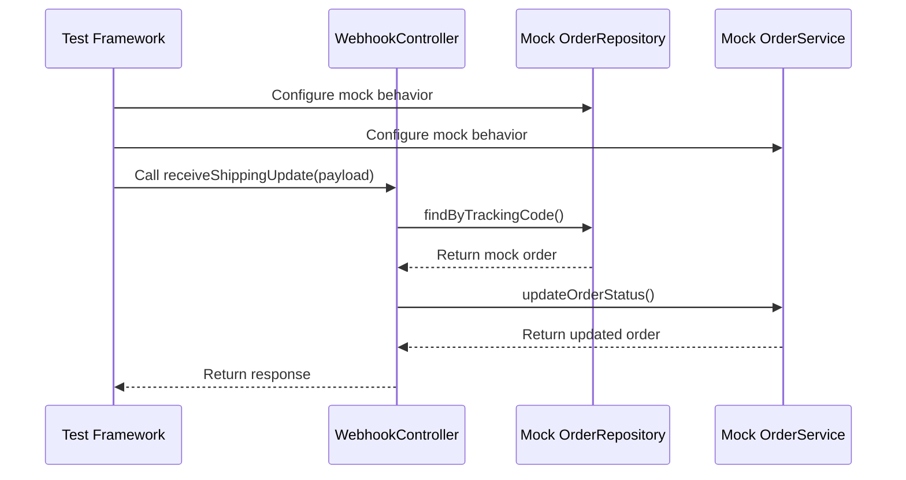

# Shipping Webhook Integration

<cite>
**Referenced Files in This Document**
- [WebhookController.java](file://src/Backend/src/main/java/com/shoppeclone/backend/shipping/controller/WebhookController.java)
- [WebhookControllerTest.java](file://src/Backend/src/test/java/com/shoppeclone/backend/shipping/controller/WebhookControllerTest.java)
- [Order.java](file://src/Backend/src/main/java/com/shoppeclone/backend/order/entity/Order.java)
- [OrderShipping.java](file://src/Backend/src/main/java/com/shoppeclone/backend/order/entity/OrderShipping.java)
- [OrderService.java](file://src/Backend/src/main/java/com/shoppeclone/backend/order/service/OrderService.java)
- [OrderServiceImpl.java](file://src/Backend/src/main/java/com/shoppeclone/backend/order/service/impl/OrderServiceImpl.java)
- [ShippingProvider.java](file://src/Backend/src/main/java/com/shoppeclone/backend/shipping/entity/ShippingProvider.java)
- [ShippingProviderRepository.java](file://src/Backend/src/main/java/com/shoppeclone/backend/shipping/repository/ShippingProviderRepository.java)
- [ShippingController.java](file://src/Backend/src/main/java/com/shoppeclone/backend/shipping/controller/ShippingController.java)
- [ShippingProviderController.java](file://src/Backend/src/main/java/com/shoppeclone/backend/shipping/controller/ShippingProviderController.java)
- [ShippingServiceImpl.java](file://src/Backend/src/main/java/com/shoppeclone/backend/shipping/service/impl/ShippingServiceImpl.java)
</cite>

## Table of Contents
1. [Introduction](#introduction)
2. [System Architecture](#system-architecture)
3. [Webhook Endpoint Configuration](#webhook-endpoint-configuration)
4. [Carrier Integration Patterns](#carrier-integration-patterns)
5. [Event Payload Structures](#event-payload-structures)
6. [Security Verification](#security-verification)
7. [Event Deduplication](#event-deduplication)
8. [Error Handling Strategies](#error-handling-strategies)
9. [Testing Procedures](#testing-procedures)
10. [Monitoring and Dashboards](#monitoring-and-dashboards)
11. [Troubleshooting Guide](#troubleshooting-guide)
12. [Carrier-Specific Requirements](#carrier-specific-requirements)
13. [Compliance Considerations](#compliance-considerations)
14. [Conclusion](#conclusion)

## Introduction

This document provides comprehensive guidance for implementing shipping webhook integration and delivery tracking systems. The system enables real-time synchronization of shipping events from third-party carriers, automated order status updates, and seamless integration with the existing order management infrastructure.

The shipping webhook system operates through a dedicated endpoint that receives carrier notifications, validates incoming requests, processes delivery status updates, and maintains synchronization with the order lifecycle. This integration supports multiple shipping providers while maintaining consistent event handling and status propagation throughout the system.

## System Architecture

The shipping webhook integration follows a modular architecture designed for scalability and maintainability:



**Diagram sources**
- [WebhookController.java:20-83](file://src/Backend/src/main/java/com/shoppeclone/backend/shipping/controller/WebhookController.java#L20-L83)
- [Order.java:1-55](file://src/Backend/src/main/java/com/shoppeclone/backend/order/entity/Order.java#L1-L55)
- [OrderService.java:9-33](file://src/Backend/src/main/java/com/shoppeclone/backend/order/service/OrderService.java#L9-L33)

The architecture ensures loose coupling between external carrier systems and internal order processing, enabling flexible integration with various shipping providers while maintaining system stability and performance.

## Webhook Endpoint Configuration

### Endpoint Definition

The system provides a dedicated webhook endpoint for receiving shipping notifications:

**Endpoint**: `POST /api/webhooks/shipping/update`

**Authentication**: The endpoint is configured as `permitAll` to accept webhook callbacks from carrier systems without requiring authentication tokens.

**Request Validation**: The endpoint validates incoming requests through the `receiveShippingUpdate` method, which processes the shipping update payload and updates the corresponding order record.

### Request Processing Flow



**Diagram sources**
- [WebhookController.java:36-80](file://src/Backend/src/main/java/com/shoppeclone/backend/shipping/controller/WebhookController.java#L36-L80)

### Response Format

The webhook endpoint returns a standardized response structure containing:

- `success`: Boolean indicating processing status
- `orderId`: Identifier of the processed order
- `trackingCode`: Associated tracking number
- `orderStatus`: Current order status after processing
- `shippingStatus`: Shipping-specific status
- `message`: Processing result message
- `updatedAt`: Timestamp of last update

**Section sources**
- [WebhookController.java:28-80](file://src/Backend/src/main/java/com/shoppeclone/backend/shipping/controller/WebhookController.java#L28-L80)

## Carrier Integration Patterns

### Supported Status Events

The system handles three primary shipping status events:

1. **DELIVERED**: Package successfully delivered to recipient
2. **RETURNED**: Package returned to sender or rejected
3. **IN_TRANSIT**: Package in transit with location updates

### Status Mapping Logic



**Diagram sources**
- [WebhookController.java:40-67](file://src/Backend/src/main/java/com/shoppeclone/backend/shipping/controller/WebhookController.java#L40-L67)

### Provider Configuration

The system maintains a registry of supported shipping providers through the `ShippingProvider` entity, which includes:

- `id`: Unique provider identifier
- `name`: Human-readable provider name
- `apiEndpoint`: API endpoint for provider-specific integrations

**Section sources**
- [ShippingProvider.java:7-15](file://src/Backend/src/main/java/com/shoppeclone/backend/shipping/entity/ShippingProvider.java#L7-L15)
- [ShippingProviderRepository.java:1-8](file://src/Backend/src/main/java/com/shoppeclone/backend/shipping/repository/ShippingProviderRepository.java#L1-L8)

## Event Payload Structures

### Webhook Payload Schema

The webhook endpoint expects a structured JSON payload containing:

| Field | Type | Required | Description |
|-------|------|----------|-------------|
| `trackingCode` | String | Yes | Unique tracking number from carrier |
| `status` | String | Yes | Current shipping status (DELIVERED, RETURNED, IN_TRANSIT) |
| `location` | String | No | Current location of package |
| `reason` | String | No | Reason for return or failure |

### Order Status Updates

The system automatically updates related order fields based on webhook events:

**Delivery Confirmation Callback**:
- Order status: `COMPLETED`
- Payment status: `PAID` (assumes COD collection)
- Delivery timestamp: `deliveredAt`
- Shipping status: `DELIVERED`

**Package Pickup Notifications**:
- Order status: `SHIPPING`
- Shipping status: `PICKED`
- Pickup timestamp: `shippedAt`

**Delivery Failure Alerts**:
- Order status: `CANCELLED`
- Cancel reason: Provided in webhook payload
- Stock restoration: Automatic inventory adjustment
- Shipping status: `RETURNED`

**Section sources**
- [WebhookController.java:28-34](file://src/Backend/src/main/java/com/shoppeclone/backend/shipping/controller/WebhookController.java#L28-L34)
- [OrderShipping.java:8-18](file://src/Backend/src/main/java/com/shoppeclone/backend/order/entity/OrderShipping.java#L8-L18)

## Security Verification

### Current Implementation Status

The webhook endpoint currently operates without built-in security verification mechanisms. The endpoint is configured as `permitAll` in the security configuration to accommodate carrier webhook callbacks that may not support authentication.

### Recommended Security Enhancements

For production environments, consider implementing the following security measures:

1. **Signature Verification**: Implement HMAC-based signature verification using shared secrets
2. **IP Whitelisting**: Restrict webhook endpoints to known carrier IP ranges
3. **Request Validation**: Validate payload structure and required fields
4. **Rate Limiting**: Implement rate limits to prevent abuse
5. **Audit Logging**: Maintain comprehensive logs of all webhook activity

### Signature Verification Pattern



**Diagram sources**
- [WebhookController.java:36-80](file://src/Backend/src/main/java/com/shoppeclone/backend/shipping/controller/WebhookController.java#L36-L80)

## Event Deduplication

### Current State

The webhook system does not implement explicit event deduplication mechanisms. Duplicate webhook events may result in redundant order updates.

### Recommended Deduplication Strategies

1. **Event ID Tracking**: Maintain a cache of processed event IDs with expiration
2. **Idempotent Operations**: Design order updates to be idempotent
3. **Timestamp Comparison**: Compare event timestamps to detect duplicates
4. **Status Change Detection**: Only process events that represent actual status changes

### Implementation Approach



## Error Handling Strategies

### Exception Handling

The webhook controller implements robust error handling for various failure scenarios:

1. **Tracking Code Not Found**: Throws runtime exception with descriptive message
2. **Invalid Status Values**: Validates against supported status enumeration
3. **Order State Conflicts**: Ensures logical status transitions
4. **Database Persistence Errors**: Handles transaction rollbacks gracefully

### Error Response Format

```json
{
  "success": false,
  "error": "Tracking code not found: TRK123456",
  "timestamp": "2024-01-01T12:00:00Z"
}
```

### Retry Mechanisms

Implement exponential backoff retry for transient failures:
- Initial delay: 1 second
- Maximum retries: 3 attempts
- Backoff multiplier: 2x per retry
- Maximum delay: 60 seconds

**Section sources**
- [WebhookController.java:40-41](file://src/Backend/src/main/java/com/shoppeclone/backend/shipping/controller/WebhookController.java#L40-L41)

## Testing Procedures

### Unit Testing

The webhook controller includes comprehensive unit tests covering key scenarios:

1. **Delivery Completion**: Tests successful delivery processing and order completion
2. **Return Processing**: Validates return handling and cancellation workflows
3. **Order Service Integration**: Verifies proper integration with order management services

### Integration Testing

Recommended testing scenarios:

1. **Happy Path Testing**: Successful webhook processing with valid payloads
2. **Error Condition Testing**: Invalid tracking codes and malformed payloads
3. **Edge Case Testing**: Empty payloads, missing fields, and boundary conditions
4. **Performance Testing**: High-volume webhook processing under load

### Test Data Setup



**Diagram sources**
- [WebhookControllerTest.java:34-65](file://src/Backend/src/test/java/com/shoppeclone/backend/shipping/controller/WebhookControllerTest.java#L34-L65)

**Section sources**
- [WebhookControllerTest.java:1-103](file://src/Backend/src/test/java/com/shoppeclone/backend/shipping/controller/WebhookControllerTest.java#L1-L103)

## Monitoring and Dashboards

### Key Metrics to Track

1. **Webhook Processing Metrics**
   - Request volume and success rates
   - Processing latency distribution
   - Error rates by error type
   - Retry counts and success rates

2. **Order Status Metrics**
   - Order completion rates
   - Average delivery time
   - Return rates by carrier
   - Status update frequency

3. **System Health Metrics**
   - Database connection pool utilization
   - Memory usage patterns
   - Thread pool metrics
   - External API response times

### Dashboard Components

1. **Real-time Processing Dashboard**
   - Live webhook request stream
   - Success/error rate visualization
   - Top error reasons chart
   - Processing latency trends

2. **Order Status Dashboard**
   - Order funnel visualization
   - Carrier performance comparison
   - Delivery time analytics
   - Return reason breakdown

3. **Alerting and Notification System**
   - Automated alerts for high error rates
   - SLA violation notifications
   - System health monitoring
   - Capacity utilization warnings

## Troubleshooting Guide

### Common Issues and Solutions

**Issue**: Webhook endpoint returns 404 Not Found
- **Cause**: Incorrect endpoint URL or missing route configuration
- **Solution**: Verify endpoint URL matches `/api/webhooks/shipping/update`

**Issue**: Tracking code not found errors
- **Cause**: Invalid or expired tracking numbers
- **Solution**: Validate tracking codes before sending webhook requests

**Issue**: Order status not updating
- **Cause**: Missing tracking code association or invalid status values
- **Solution**: Ensure orders have associated tracking codes and use supported status values

**Issue**: Duplicate order updates
- **Cause**: Multiple webhook deliveries for same event
- **Solution**: Implement event deduplication or idempotent processing

### Debugging Tools

1. **Request Logging**: Enable detailed logging of incoming webhook requests
2. **Database Inspection**: Monitor order status changes in real-time
3. **Error Analysis**: Track error patterns and frequencies
4. **Performance Profiling**: Monitor processing performance and bottlenecks

### Support Procedures

1. **Incident Response**: Establish escalation procedures for webhook failures
2. **Carrier Coordination**: Maintain communication channels with shipping providers
3. **System Maintenance**: Schedule regular maintenance windows for updates
4. **Documentation Updates**: Keep integration documentation current with changes

## Carrier-Specific Requirements

### GHTK Integration

**Configuration Requirements**:
- Webhook URL: `https://your-domain.com/api/webhooks/shipping/update`
- Authentication: None required (permitAll)
- Payload Format: JSON with trackingCode, status, location, reason
- Callback Frequency: Real-time delivery updates

**Implementation Notes**:
- GHTK requires manual webhook configuration in their dashboard
- Supports multiple status events: PICKED, IN_TRANSIT, DELIVERED, RETURNED
- Provides detailed location information in payload

### GHN Integration

**Configuration Requirements**:
- Webhook URL: `https://your-domain.com/api/webhooks/shipping/update`
- Authentication: None required
- Payload Format: JSON with trackingCode, status, location
- Callback Frequency: Real-time updates

**Implementation Notes**:
- Requires contacting GHN support for webhook setup
- Supports comprehensive tracking with location updates
- Provides detailed delivery information

### VNPost Integration

**Configuration Requirements**:
- Webhook URL: `https://your-domain.com/api/webhooks/shipping/update`
- Authentication: None required
- Payload Format: JSON with trackingCode, status, location
- Callback Frequency: Real-time delivery notifications

**Implementation Notes**:
- Supports standard shipping status events
- Provides delivery confirmation capabilities
- Integrates with Vietnamese postal network

## Compliance Considerations

### Data Privacy and Security

1. **GDPR Compliance**: Ensure customer data protection and privacy rights
2. **Data Retention**: Implement appropriate data retention policies
3. **Security Measures**: Maintain secure data transmission and storage
4. **Audit Trails**: Keep comprehensive logs of all data access and modifications

### Regulatory Requirements

1. **Consumer Protection**: Comply with consumer protection laws and regulations
2. **Financial Regulations**: Adhere to financial services regulations for payment-related data
3. **International Trade**: Follow international shipping and customs regulations
4. **Industry Standards**: Meet industry-specific compliance requirements

### Best Practices

1. **Data Minimization**: Collect only necessary shipping and delivery information
2. **Transparency**: Clearly communicate data usage and sharing practices
3. **Consent Management**: Obtain proper consent for data processing activities
4. **Security Controls**: Implement appropriate technical and organizational measures

## Conclusion

The shipping webhook integration system provides a robust foundation for real-time shipping event processing and order status synchronization. The modular architecture supports multiple carrier integrations while maintaining system reliability and performance.

Key strengths of the implementation include:

- **Scalable Architecture**: Modular design supporting easy addition of new carriers
- **Robust Error Handling**: Comprehensive error handling and recovery mechanisms
- **Flexible Status Processing**: Support for various shipping status events
- **Extensible Design**: Easy integration with existing order management systems

Future enhancements should focus on implementing security verification, event deduplication, and comprehensive monitoring capabilities to support production deployment requirements.

The system provides a solid foundation for building reliable shipping integration solutions that can adapt to evolving carrier requirements and business needs.