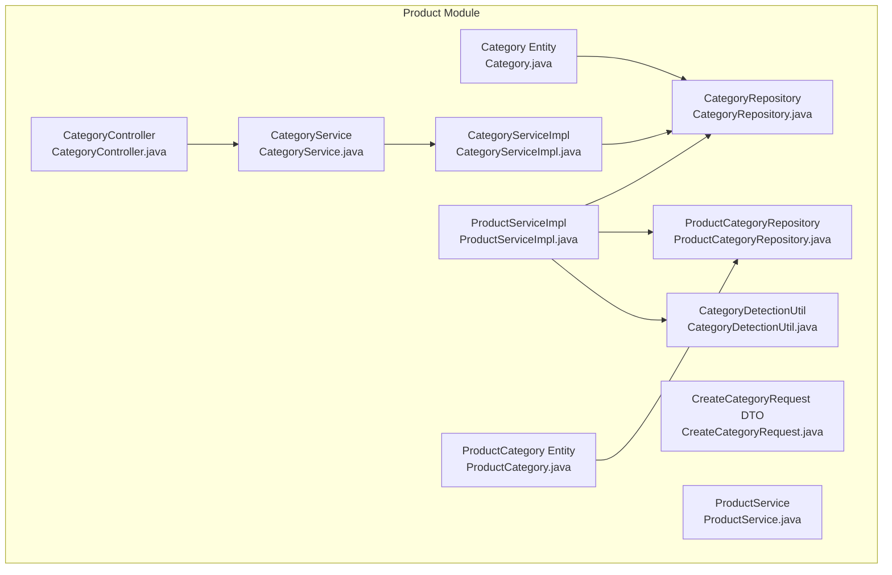
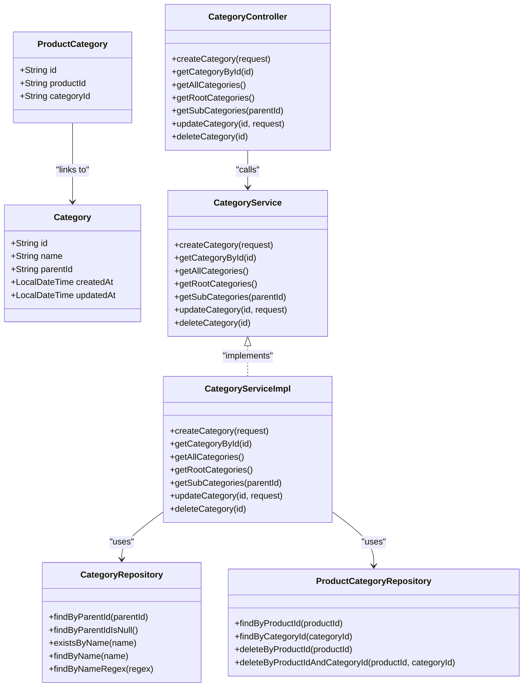
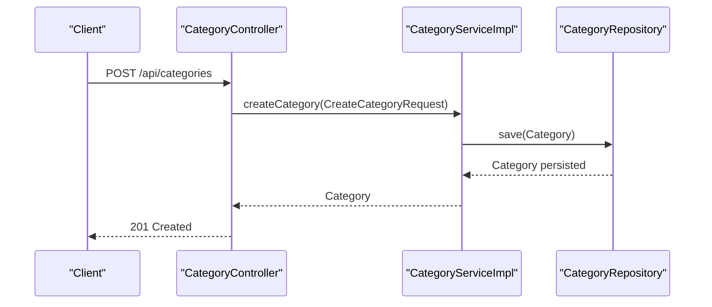
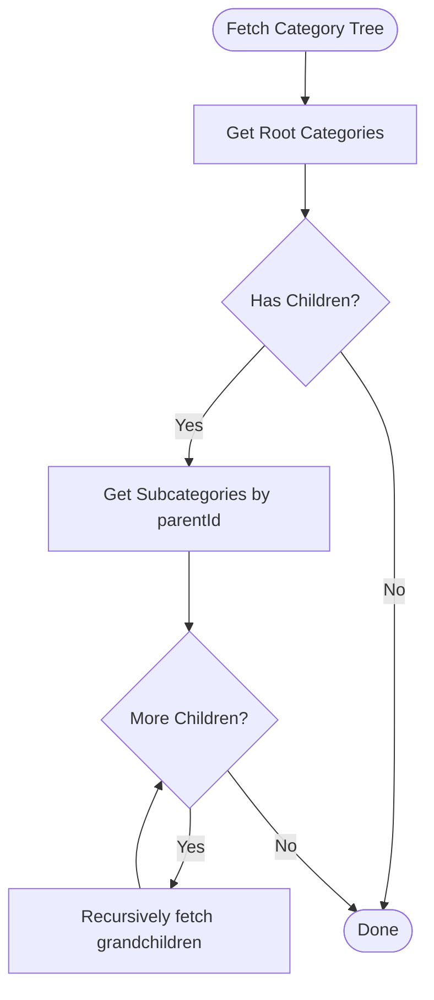
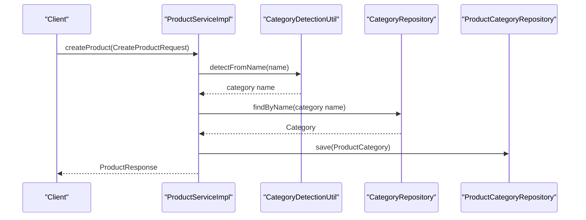
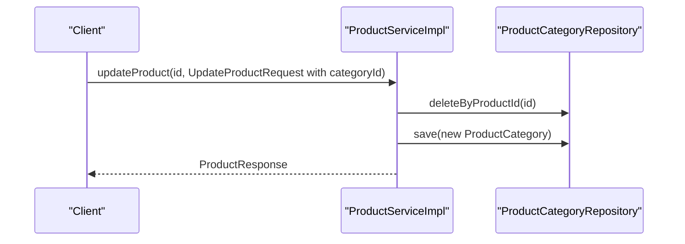
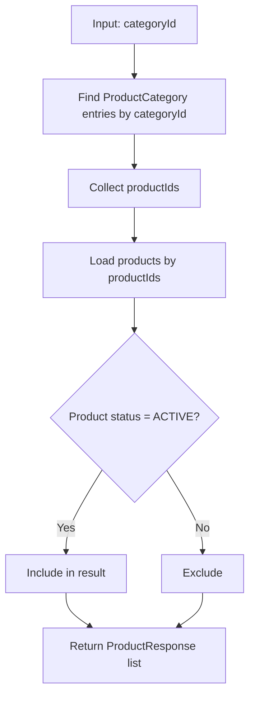
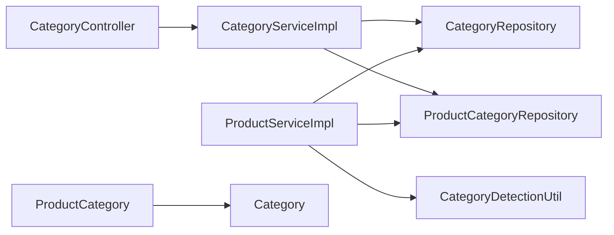

# Category Hierarchy System

<cite>
**Referenced Files in This Document**
- [Category.java](file://src/Backend/src/main/java/com/shoppeclone/backend/product/entity/Category.java)
- [CreateCategoryRequest.java](file://src/Backend/src/main/java/com/shoppeclone/backend/product/dto/request/CreateCategoryRequest.java)
- [CategoryController.java](file://src/Backend/src/main/java/com/shoppeclone/backend/product/controller/CategoryController.java)
- [CategoryService.java](file://src/Backend/src/main/java/com/shoppeclone/backend/product/service/CategoryService.java)
- [CategoryServiceImpl.java](file://src/Backend/src/main/java/com/shoppeclone/backend/product/service/impl/CategoryServiceImpl.java)
- [CategoryRepository.java](file://src/Backend/src/main/java/com/shoppeclone/backend/product/repository/CategoryRepository.java)
- [ProductCategory.java](file://src/Backend/src/main/java/com/shoppeclone/backend/product/entity/ProductCategory.java)
- [ProductCategoryRepository.java](file://src/Backend/src/main/java/com/shoppeclone/backend/product/repository/ProductCategoryRepository.java)
- [ProductService.java](file://src/Backend/src/main/java/com/shoppeclone/backend/product/service/ProductService.java)
- [ProductServiceImpl.java](file://src/Backend/src/main/java/com/shoppeclone/backend/product/service/impl/ProductServiceImpl.java)
- [CategoryDetectionUtil.java](file://src/Backend/src/main/java/com/shoppeclone/backend/product/util/CategoryDetectionUtil.java)
- [categories.json](file://data_dumps/categories.json)
- [application.properties](file://src/Backend/src/main/resources/application.properties)
</cite>

## Table of Contents
1. [Introduction](#introduction)
2. [Project Structure](#project-structure)
3. [Core Components](#core-components)
4. [Architecture Overview](#architecture-overview)
5. [Detailed Component Analysis](#detailed-component-analysis)
6. [Dependency Analysis](#dependency-analysis)
7. [Performance Considerations](#performance-considerations)
8. [Troubleshooting Guide](#troubleshooting-guide)
9. [Conclusion](#conclusion)

## Introduction
This document describes the category hierarchy system used to organize products in a multi-category environment. It covers category creation, parent-child relationships, hierarchical navigation, automatic category detection based on product attributes, manual assignment, filtering by category, and integration points with product management. It also outlines SEO-friendly slug generation and URL routing considerations, analytics and recommendation hooks, and administrative workflows for managing categories.

## Project Structure
The category system spans entity, repository, service, and controller layers, plus utilities for automatic category detection and product-to-category mapping.

**Diagram sources**
- [Category.java:1-22](file://src/Backend/src/main/java/com/shoppeclone/backend/product/entity/Category.java#L1-L22)
- [CreateCategoryRequest.java:1-13](file://src/Backend/src/main/java/com/shoppeclone/backend/product/dto/request/CreateCategoryRequest.java#L1-L13)
- [CategoryController.java:1-60](file://src/Backend/src/main/java/com/shoppeclone/backend/product/controller/CategoryController.java#L1-L60)
- [CategoryService.java:1-22](file://src/Backend/src/main/java/com/shoppeclone/backend/product/service/CategoryService.java#L1-L22)
- [CategoryServiceImpl.java:1-71](file://src/Backend/src/main/java/com/shoppeclone/backend/product/service/impl/CategoryServiceImpl.java#L1-L71)
- [CategoryRepository.java:1-21](file://src/Backend/src/main/java/com/shoppeclone/backend/product/repository/CategoryRepository.java#L1-L21)
- [ProductCategory.java:1-18](file://src/Backend/src/main/java/com/shoppeclone/backend/product/entity/ProductCategory.java#L1-L18)
- [ProductCategoryRepository.java:1-16](file://src/Backend/src/main/java/com/shoppeclone/backend/product/repository/ProductCategoryRepository.java#L1-L16)
- [ProductService.java:1-54](file://src/Backend/src/main/java/com/shoppeclone/backend/product/service/ProductService.java#L1-L54)
- [ProductServiceImpl.java:1-657](file://src/Backend/src/main/java/com/shoppeclone/backend/product/service/impl/ProductServiceImpl.java#L1-L657)
- [CategoryDetectionUtil.java:1-72](file://src/Backend/src/main/java/com/shoppeclone/backend/product/util/CategoryDetectionUtil.java#L1-L72)

**Section sources**
- [CategoryController.java:1-60](file://src/Backend/src/main/java/com/shoppeclone/backend/product/controller/CategoryController.java#L1-L60)
- [CategoryServiceImpl.java:1-71](file://src/Backend/src/main/java/com/shoppeclone/backend/product/service/impl/CategoryServiceImpl.java#L1-L71)
- [CategoryRepository.java:1-21](file://src/Backend/src/main/java/com/shoppeclone/backend/product/repository/CategoryRepository.java#L1-L21)
- [ProductServiceImpl.java:1-657](file://src/Backend/src/main/java/com/shoppeclone/backend/product/service/impl/ProductServiceImpl.java#L1-L657)

## Core Components
- Category entity defines hierarchical categories with self-referencing via parentId.
- CreateCategoryRequest DTO captures category name and optional parentId for hierarchical assignment.
- CategoryController exposes REST endpoints for CRUD and tree navigation.
- CategoryService and CategoryServiceImpl implement persistence and retrieval logic.
- CategoryRepository provides MongoDB queries for root and subtree retrieval and name search.
- ProductCategory and ProductCategoryRepository manage many-to-many mapping between products and categories.
- ProductService integrates category assignment during product creation/update.
- CategoryDetectionUtil provides keyword-based automatic category detection from product names.

**Section sources**
- [Category.java:1-22](file://src/Backend/src/main/java/com/shoppeclone/backend/product/entity/Category.java#L1-L22)
- [CreateCategoryRequest.java:1-13](file://src/Backend/src/main/java/com/shoppeclone/backend/product/dto/request/CreateCategoryRequest.java#L1-L13)
- [CategoryController.java:1-60](file://src/Backend/src/main/java/com/shoppeclone/backend/product/controller/CategoryController.java#L1-L60)
- [CategoryService.java:1-22](file://src/Backend/src/main/java/com/shoppeclone/backend/product/service/CategoryService.java#L1-L22)
- [CategoryServiceImpl.java:1-71](file://src/Backend/src/main/java/com/shoppeclone/backend/product/service/impl/CategoryServiceImpl.java#L1-L71)
- [CategoryRepository.java:1-21](file://src/Backend/src/main/java/com/shoppeclone/backend/product/repository/CategoryRepository.java#L1-L21)
- [ProductCategory.java:1-18](file://src/Backend/src/main/java/com/shoppeclone/backend/product/entity/ProductCategory.java#L1-L18)
- [ProductCategoryRepository.java:1-16](file://src/Backend/src/main/java/com/shoppeclone/backend/product/repository/ProductCategoryRepository.java#L1-L16)
- [ProductService.java:1-54](file://src/Backend/src/main/java/com/shoppeclone/backend/product/service/ProductService.java#L1-L54)
- [ProductServiceImpl.java:1-657](file://src/Backend/src/main/java/com/shoppeclone/backend/product/service/impl/ProductServiceImpl.java#L1-L657)
- [CategoryDetectionUtil.java:1-72](file://src/Backend/src/main/java/com/shoppeclone/backend/product/util/CategoryDetectionUtil.java#L1-L72)

## Architecture Overview
The category system follows a layered architecture:
- Presentation: CategoryController handles HTTP requests.
- Application: CategoryServiceImpl orchestrates persistence and retrieval.
- Persistence: CategoryRepository and ProductCategoryRepository access MongoDB collections.
- Entities: Category and ProductCategory define the schema and relationships.

**Diagram sources**
- [Category.java:1-22](file://src/Backend/src/main/java/com/shoppeclone/backend/product/entity/Category.java#L1-L22)
- [ProductCategory.java:1-18](file://src/Backend/src/main/java/com/shoppeclone/backend/product/entity/ProductCategory.java#L1-L18)
- [CategoryController.java:1-60](file://src/Backend/src/main/java/com/shoppeclone/backend/product/controller/CategoryController.java#L1-L60)
- [CategoryService.java:1-22](file://src/Backend/src/main/java/com/shoppeclone/backend/product/service/CategoryService.java#L1-L22)
- [CategoryServiceImpl.java:1-71](file://src/Backend/src/main/java/com/shoppeclone/backend/product/service/impl/CategoryServiceImpl.java#L1-L71)
- [CategoryRepository.java:1-21](file://src/Backend/src/main/java/com/shoppeclone/backend/product/repository/CategoryRepository.java#L1-L21)
- [ProductCategoryRepository.java:1-16](file://src/Backend/src/main/java/com/shoppeclone/backend/product/repository/ProductCategoryRepository.java#L1-L16)

## Detailed Component Analysis

### Category Creation and Management
- CreateCategoryRequest schema:
  - Required: name (non-blank)
  - Optional: parentId (assigns child category under a parent)
- CategoryController endpoints:
  - POST /api/categories: create category
  - GET /api/categories/{id}: fetch by ID
  - GET /api/categories: fetch all categories
  - GET /api/categories/root: fetch root categories (parentId = null)
  - GET /api/categories/{parentId}/subcategories: fetch immediate children
  - PUT /api/categories/{id}: update category (supports changing parentId)
  - DELETE /api/categories/{id}: delete category
- CategoryServiceImpl:
  - Persists createdAt/updatedAt timestamps
  - Validates existence for updates/deletes
  - Supports optional parentId for hierarchical assignment

**Diagram sources**
- [CategoryController.java:22-25](file://src/Backend/src/main/java/com/shoppeclone/backend/product/controller/CategoryController.java#L22-L25)
- [CategoryServiceImpl.java:19-26](file://src/Backend/src/main/java/com/shoppeclone/backend/product/service/impl/CategoryServiceImpl.java#L19-L26)
- [CategoryRepository.java:8-20](file://src/Backend/src/main/java/com/shoppeclone/backend/product/repository/CategoryRepository.java#L8-L20)

**Section sources**
- [CreateCategoryRequest.java:1-13](file://src/Backend/src/main/java/com/shoppeclone/backend/product/dto/request/CreateCategoryRequest.java#L1-L13)
- [CategoryController.java:22-58](file://src/Backend/src/main/java/com/shoppeclone/backend/product/controller/CategoryController.java#L22-L58)
- [CategoryServiceImpl.java:19-69](file://src/Backend/src/main/java/com/shoppeclone/backend/product/service/impl/CategoryServiceImpl.java#L19-L69)
- [CategoryRepository.java:8-20](file://src/Backend/src/main/java/com/shoppeclone/backend/product/repository/CategoryRepository.java#L8-L20)

### Parent-Child Relationships and Hierarchical Structures
- Category entity stores parentId referencing another Category id.
- Root categories have parentId = null.
- Subcategory retrieval uses findByParentId(parentId).
- Root retrieval uses findByParentIdIsNull().
- Category trees can be traversed by recursively fetching children.

**Diagram sources**
- [CategoryRepository.java:9-11](file://src/Backend/src/main/java/com/shoppeclone/backend/product/repository/CategoryRepository.java#L9-L11)
- [CategoryServiceImpl.java:40-47](file://src/Backend/src/main/java/com/shoppeclone/backend/product/service/impl/CategoryServiceImpl.java#L40-L47)

**Section sources**
- [Category.java:16-17](file://src/Backend/src/main/java/com/shoppeclone/backend/product/entity/Category.java#L16-L17)
- [CategoryRepository.java:9-11](file://src/Backend/src/main/java/com/shoppeclone/backend/product/repository/CategoryRepository.java#L9-L11)
- [CategoryServiceImpl.java:40-47](file://src/Backend/src/main/java/com/shoppeclone/backend/product/service/impl/CategoryServiceImpl.java#L40-L47)

### Automatic Category Detection Based on Product Attributes
- CategoryDetectionUtil performs keyword-based detection from product name.
- ProductServiceImpl integrates detection during product creation when categoryId is not provided:
  - Detect category name from product name
  - Resolve category ID by name lookup
  - Assign category via ProductCategory mapping

**Diagram sources**
- [ProductServiceImpl.java:112-124](file://src/Backend/src/main/java/com/shoppeclone/backend/product/service/impl/ProductServiceImpl.java#L112-L124)
- [CategoryDetectionUtil.java:12-70](file://src/Backend/src/main/java/com/shoppeclone/backend/product/util/CategoryDetectionUtil.java#L12-L70)
- [CategoryRepository.java:15-15](file://src/Backend/src/main/java/com/shoppeclone/backend/product/repository/CategoryRepository.java#L15-L15)
- [ProductCategoryRepository.java:7-7](file://src/Backend/src/main/java/com/shoppeclone/backend/product/repository/ProductCategoryRepository.java#L7-L7)

**Section sources**
- [CategoryDetectionUtil.java:12-70](file://src/Backend/src/main/java/com/shoppeclone/backend/product/util/CategoryDetectionUtil.java#L12-L70)
- [ProductServiceImpl.java:112-124](file://src/Backend/src/main/java/com/shoppeclone/backend/product/service/impl/ProductServiceImpl.java#L112-L124)

### Manual Category Assignment Processes
- During product creation, if categoryId is provided, ProductServiceImpl assigns it directly.
- During product update, ProductServiceImpl replaces existing category associations by deleting old links and adding new ones.
- ProductService exposes addCategory/removeCategory for explicit management.

**Diagram sources**
- [ProductServiceImpl.java:227-237](file://src/Backend/src/main/java/com/shoppeclone/backend/product/service/impl/ProductServiceImpl.java#L227-L237)
- [ProductCategoryRepository.java:12-14](file://src/Backend/src/main/java/com/shoppeclone/backend/product/repository/ProductCategoryRepository.java#L12-L14)

**Section sources**
- [ProductServiceImpl.java:227-237](file://src/Backend/src/main/java/com/shoppeclone/backend/product/service/impl/ProductServiceImpl.java#L227-L237)
- [ProductService.java:41-43](file://src/Backend/src/main/java/com/shoppeclone/backend/product/service/ProductService.java#L41-L43)

### Category Filtering Mechanisms
- Products can be filtered by category using ProductServiceImpl.getProductsByCategory:
  - Retrieve all ProductCategory records for a categoryId
  - Extract product IDs and load product details
  - Filter by active status

**Diagram sources**
- [ProductServiceImpl.java:184-196](file://src/Backend/src/main/java/com/shoppeclone/backend/product/service/impl/ProductServiceImpl.java#L184-L196)
- [ProductCategoryRepository.java:10-10](file://src/Backend/src/main/java/com/shoppeclone/backend/product/repository/ProductCategoryRepository.java#L10-L10)

**Section sources**
- [ProductServiceImpl.java:184-196](file://src/Backend/src/main/java/com/shoppeclone/backend/product/service/impl/ProductServiceImpl.java#L184-L196)
- [ProductCategoryRepository.java:10-10](file://src/Backend/src/main/java/com/shoppeclone/backend/product/repository/ProductCategoryRepository.java#L10-L10)

### Category Trees and Nested Queries
- Root categories: CategoryRepository.findByParentIdIsNull()
- Immediate children: CategoryRepository.findByParentId(parentId)
- Suggested UI pattern:
  - Fetch root categories
  - For each root, fetch its children recursively
  - Build a nested tree structure client-side

**Section sources**
- [CategoryRepository.java:9-11](file://src/Backend/src/main/java/com/shoppeclone/backend/product/repository/CategoryRepository.java#L9-L11)
- [CategoryServiceImpl.java:40-47](file://src/Backend/src/main/java/com/shoppeclone/backend/product/service/impl/CategoryServiceImpl.java#L40-L47)

### Category SEO Optimization, Slug Generation, and URL Routing
- Current implementation does not include dedicated slug fields or URL routing for categories.
- Recommended enhancements:
  - Add a unique slug field to Category entity
  - Generate slugs from names (lowercase, hyphen-separated, unique per parent)
  - Implement URL routes like /categories/{slug} for SEO-friendly navigation
  - Maintain redirects for renamed slugs
- These are conceptual recommendations and not present in the current codebase.

[No sources needed since this section provides conceptual recommendations]

### Category Analytics, Popularity Tracking, and Recommendation Integration
- No built-in analytics or popularity metrics are implemented for categories.
- Potential integrations:
  - Track product counts per category
  - Aggregate sales volume or revenue by category
  - Use category membership for product recommendation filters
- These are conceptual recommendations and not present in the current codebase.

[No sources needed since this section provides conceptual recommendations]

### Category Permissions, Access Controls, and Administrative Workflows
- Authentication and authorization are handled at the application level via Spring Security and JWT.
- CategoryController is exposed publicly; no explicit role checks are present in the controller.
- Recommended administrative controls:
  - Require ADMIN role for create/update/delete operations
  - Enforce soft-deletion semantics for auditability
  - Implement change logging for category modifications
- These are conceptual recommendations and not present in the current codebase.

**Section sources**
- [application.properties:23-31](file://src/Backend/src/main/resources/application.properties#L23-L31)
- [CategoryController.java:1-60](file://src/Backend/src/main/java/com/shoppeclone/backend/product/controller/CategoryController.java#L1-L60)

## Dependency Analysis
The following diagram shows key dependencies among category-related components:

**Diagram sources**
- [CategoryController.java:1-60](file://src/Backend/src/main/java/com/shoppeclone/backend/product/controller/CategoryController.java#L1-L60)
- [CategoryServiceImpl.java:1-71](file://src/Backend/src/main/java/com/shoppeclone/backend/product/service/impl/CategoryServiceImpl.java#L1-L71)
- [CategoryRepository.java:1-21](file://src/Backend/src/main/java/com/shoppeclone/backend/product/repository/CategoryRepository.java#L1-L21)
- [ProductCategoryRepository.java:1-16](file://src/Backend/src/main/java/com/shoppeclone/backend/product/repository/ProductCategoryRepository.java#L1-L16)
- [ProductServiceImpl.java:1-657](file://src/Backend/src/main/java/com/shoppeclone/backend/product/service/impl/ProductServiceImpl.java#L1-L657)
- [CategoryDetectionUtil.java:1-72](file://src/Backend/src/main/java/com/shoppeclone/backend/product/util/CategoryDetectionUtil.java#L1-L72)
- [ProductCategory.java:1-18](file://src/Backend/src/main/java/com/shoppeclone/backend/product/entity/ProductCategory.java#L1-L18)
- [Category.java:1-22](file://src/Backend/src/main/java/com/shoppeclone/backend/product/entity/Category.java#L1-L22)

**Section sources**
- [CategoryServiceImpl.java:1-71](file://src/Backend/src/main/java/com/shoppeclone/backend/product/service/impl/CategoryServiceImpl.java#L1-L71)
- [ProductServiceImpl.java:1-657](file://src/Backend/src/main/java/com/shoppeclone/backend/product/service/impl/ProductServiceImpl.java#L1-L657)

## Performance Considerations
- Indexing:
  - CategoryRepository already supports name regex search via a regex query; consider adding a compound index for name + parentId for frequent hierarchical lookups.
  - ProductCategoryRepository has a unique compound index on (productId, categoryId), which is efficient for product-category joins.
- Query patterns:
  - Prefer fetching root categories once and building a client-side tree to minimize repeated database calls.
  - Batch product-category assignments when importing large datasets.
- Concurrency:
  - Category creation/update operations are single-entity writes; ensure proper validation before persisting.
- Scalability:
  - For very deep hierarchies, consider caching frequently accessed subtrees.

[No sources needed since this section provides general guidance]

## Troubleshooting Guide
- Category not found errors:
  - CategoryServiceImpl throws runtime exceptions when updating/deleting non-existent categories; ensure ID validation before invoking update/delete.
- Duplicate category names:
  - CategoryRepository exposes existsByName and findByName; use these to prevent duplicates or implement conflict resolution.
- Automatic detection fallback:
  - CategoryDetectionUtil defaults to a generic category if no keywords match; verify seed data and detection rules.
- Product-category mapping:
  - ProductServiceImpl replaces category associations on update; confirm that categoryId is provided when manual assignment is intended.

**Section sources**
- [CategoryServiceImpl.java:50-69](file://src/Backend/src/main/java/com/shoppeclone/backend/product/service/impl/CategoryServiceImpl.java#L50-L69)
- [CategoryRepository.java:13-15](file://src/Backend/src/main/java/com/shoppeclone/backend/product/repository/CategoryRepository.java#L13-L15)
- [CategoryDetectionUtil.java:12-70](file://src/Backend/src/main/java/com/shoppeclone/backend/product/util/CategoryDetectionUtil.java#L12-L70)
- [ProductServiceImpl.java:227-237](file://src/Backend/src/main/java/com/shoppeclone/backend/product/service/impl/ProductServiceImpl.java#L227-L237)

## Conclusion
The category hierarchy system provides a solid foundation for organizing products with support for hierarchical categories, automatic detection, and flexible manual assignment. The current implementation focuses on core CRUD and traversal capabilities. Future enhancements should include SEO-friendly slugs, URL routing, analytics hooks, and robust administrative controls with role-based access.