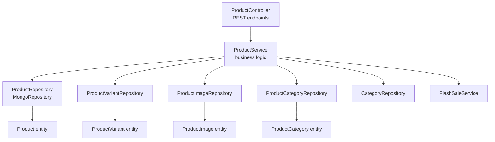
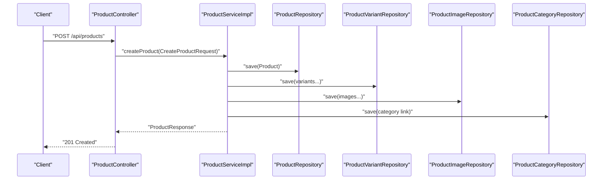
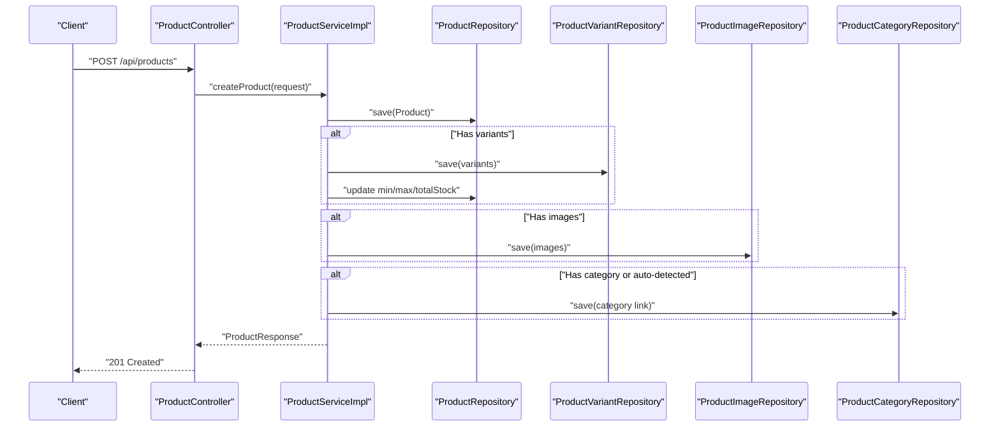
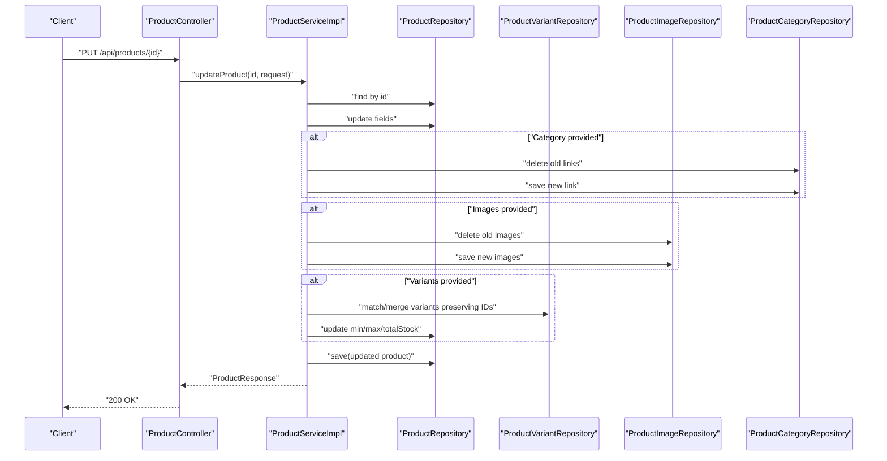
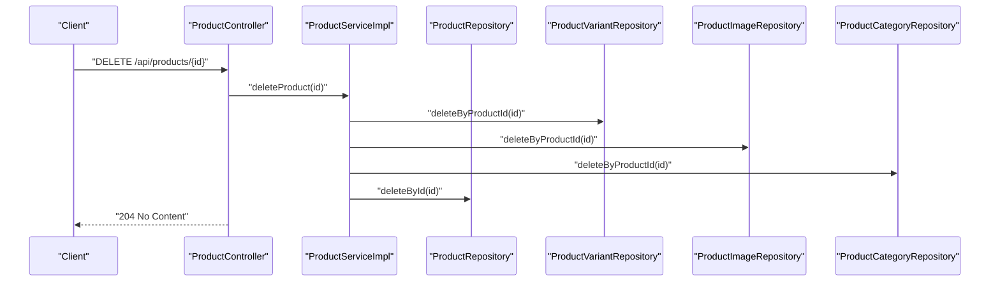
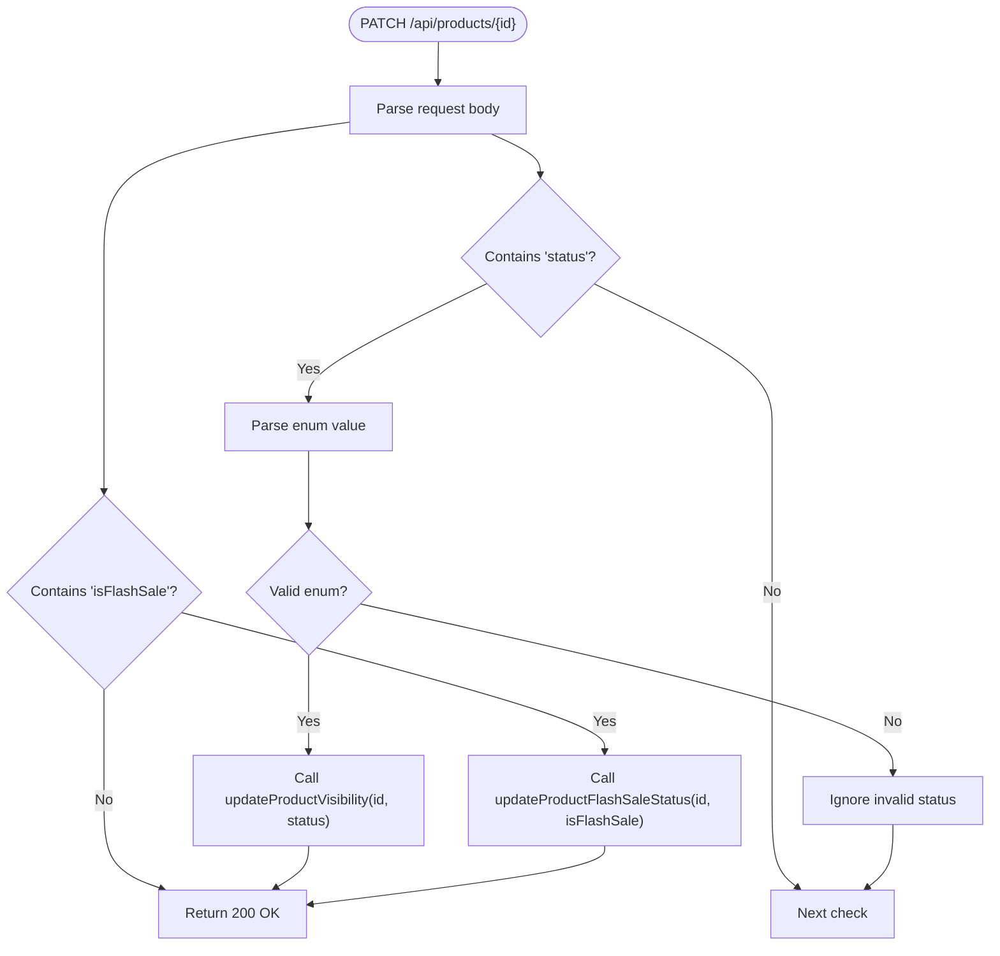
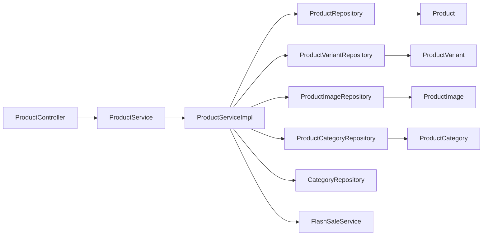

# Product CRUD Operations

<cite>
**Referenced Files in This Document**
- [ProductController.java](file://src/Backend/src/main/java/com/shoppeclone/backend/product/controller/ProductController.java)
- [ProductService.java](file://src/Backend/src/main/java/com/shoppeclone/backend/product/service/ProductService.java)
- [ProductServiceImpl.java](file://src/Backend/src/main/java/com/shoppeclone/backend/product/service/impl/ProductServiceImpl.java)
- [Product.java](file://src/Backend/src/main/java/com/shoppeclone/backend/product/entity/Product.java)
- [ProductVariant.java](file://src/Backend/src/main/java/com/shoppeclone/backend/product/entity/ProductVariant.java)
- [ProductImage.java](file://src/Backend/src/main/java/com/shoppeclone/backend/product/entity/ProductImage.java)
- [ProductCategory.java](file://src/Backend/src/main/java/com/shoppeclone/backend/product/entity/ProductCategory.java)
- [ProductStatus.java](file://src/Backend/src/main/java/com/shoppeclone/backend/product/entity/ProductStatus.java)
- [ProductRepository.java](file://src/Backend/src/main/java/com/shoppeclone/backend/product/repository/ProductRepository.java)
- [CreateProductRequest.java](file://src/Backend/src/main/java/com/shoppeclone/backend/product/dto/request/CreateProductRequest.java)
- [UpdateProductRequest.java](file://src/Backend/src/main/java/com/shoppeclone/backend/product/dto/request/UpdateProductRequest.java)
- [CreateProductVariantRequest.java](file://src/Backend/src/main/java/com/shoppeclone/backend/product/dto/request/CreateProductVariantRequest.java)
- [ProductResponse.java](file://src/Backend/src/main/java/com/shoppeclone/backend/product/dto/response/ProductResponse.java)
- [ProductVariantResponse.java](file://src/Backend/src/main/java/com/shoppeclone/backend/product/dto/response/ProductVariantResponse.java)
</cite>

## Table of Contents
1. [Introduction](#introduction)
2. [Project Structure](#project-structure)
3. [Core Components](#core-components)
4. [Architecture Overview](#architecture-overview)
5. [Detailed Component Analysis](#detailed-component-analysis)
6. [Dependency Analysis](#dependency-analysis)
7. [Performance Considerations](#performance-considerations)
8. [Troubleshooting Guide](#troubleshooting-guide)
9. [Conclusion](#conclusion)
10. [Appendices](#appendices)

## Introduction
This document provides comprehensive documentation for product CRUD operations within the backend system. It covers the complete product lifecycle from creation to deletion, including variant and image management, category assignment, and flash sale integration. It documents the ProductController endpoints with HTTP methods, URL patterns, request/response schemas, validation rules, and business constraints. It also explains product status management, visibility controls, and approval workflows, along with error handling, validation failures, and common edge cases.

## Project Structure
The product domain is organized around a layered architecture:
- Controller: Exposes REST endpoints for product operations.
- Service: Implements business logic and orchestrates repositories.
- Repository: Provides data access for MongoDB collections.
- Entity: Defines the persistent models for products, variants, images, and categories.
- DTO: Encapsulates request/response payloads for API contracts.

**Diagram sources**
- [ProductController.java:18-163](file://src/Backend/src/main/java/com/shoppeclone/backend/product/controller/ProductController.java#L18-L163)
- [ProductService.java:10-54](file://src/Backend/src/main/java/com/shoppeclone/backend/product/service/ProductService.java#L10-L54)
- [ProductServiceImpl.java:33-44](file://src/Backend/src/main/java/com/shoppeclone/backend/product/service/impl/ProductServiceImpl.java#L33-L44)
- [ProductRepository.java:11-41](file://src/Backend/src/main/java/com/shoppeclone/backend/product/repository/ProductRepository.java#L11-L41)
- [Product.java:10-51](file://src/Backend/src/main/java/com/shoppeclone/backend/product/entity/Product.java#L10-L51)
- [ProductVariant.java:10-37](file://src/Backend/src/main/java/com/shoppeclone/backend/product/entity/ProductVariant.java#L10-L37)
- [ProductImage.java:9-23](file://src/Backend/src/main/java/com/shoppeclone/backend/product/entity/ProductImage.java#L9-L23)
- [ProductCategory.java:8-18](file://src/Backend/src/main/java/com/shoppeclone/backend/product/entity/ProductCategory.java#L8-L18)

**Section sources**
- [ProductController.java:18-163](file://src/Backend/src/main/java/com/shoppeclone/backend/product/controller/ProductController.java#L18-L163)
- [ProductService.java:10-54](file://src/Backend/src/main/java/com/shoppeclone/backend/product/service/ProductService.java#L10-L54)
- [ProductRepository.java:11-41](file://src/Backend/src/main/java/com/shoppeclone/backend/product/repository/ProductRepository.java#L11-L41)

## Core Components
- ProductController: Exposes endpoints for product CRUD, variant management, category assignment, and image management. It delegates to ProductService and returns standardized responses.
- ProductService: Defines the contract for product operations, including visibility updates, flash sale toggles, and variant/image/category management.
- ProductServiceImpl: Implements product operations with transactional boundaries, validation, and aggregation of variant data for display.
- Product entity: Represents product metadata, pricing aggregates, stock totals, ratings, and flash sale attributes.
- ProductVariant entity: Represents product variations (size/color) with pricing, stock, and optional variant-specific images.
- ProductImage entity: Stores product images with display ordering.
- ProductCategory entity: Links products to categories with a compound unique index.
- Repositories: Provide MongoDB access for products, variants, images, categories, and category detection.

**Section sources**
- [ProductController.java:26-163](file://src/Backend/src/main/java/com/shoppeclone/backend/product/controller/ProductController.java#L26-L163)
- [ProductService.java:10-54](file://src/Backend/src/main/java/com/shoppeclone/backend/product/service/ProductService.java#L10-L54)
- [ProductServiceImpl.java:46-127](file://src/Backend/src/main/java/com/shoppeclone/backend/product/service/impl/ProductServiceImpl.java#L46-L127)
- [Product.java:12-51](file://src/Backend/src/main/java/com/shoppeclone/backend/product/entity/Product.java#L12-L51)
- [ProductVariant.java:12-37](file://src/Backend/src/main/java/com/shoppeclone/backend/product/entity/ProductVariant.java#L12-L37)
- [ProductImage.java:11-23](file://src/Backend/src/main/java/com/shoppeclone/backend/product/entity/ProductImage.java#L11-L23)
- [ProductCategory.java:8-18](file://src/Backend/src/main/java/com/shoppeclone/backend/product/entity/ProductCategory.java#L8-L18)
- [ProductRepository.java:11-41](file://src/Backend/src/main/java/com/shoppeclone/backend/product/repository/ProductRepository.java#L11-L41)

## Architecture Overview
The product module follows a clean architecture pattern:
- REST endpoints in ProductController trigger ProductService methods.
- ProductService coordinates repositories and external services (e.g., FlashSaleService).
- Entities encapsulate persistence and relationships.
- DTOs define API contracts for requests and responses.

**Diagram sources**
- [ProductController.java:26-29](file://src/Backend/src/main/java/com/shoppeclone/backend/product/controller/ProductController.java#L26-L29)
- [ProductServiceImpl.java:46-127](file://src/Backend/src/main/java/com/shoppeclone/backend/product/service/impl/ProductServiceImpl.java#L46-L127)
- [ProductRepository.java:11-41](file://src/Backend/src/main/java/com/shoppeclone/backend/product/repository/ProductRepository.java#L11-L41)

## Detailed Component Analysis

### ProductController Endpoints
- Base path: /api/products
- Authentication: Not enforced in controller; depends on global security configuration.
- Validation: Uses @Valid on request bodies; Spring validates constraints.

Endpoints:
- POST /api/products
  - Purpose: Create a product with optional variants, images, and category assignment.
  - Request: CreateProductRequest
  - Response: ProductResponse (201 Created)
  - Validation: shopId, name are required; variants and images are optional.

- GET /api/products/{id}
  - Purpose: Retrieve a product by ID.
  - Path variable: id
  - Response: ProductResponse (200 OK)

- GET /api/products/shop/{shopId}?includeHidden=false
  - Purpose: List products by shop; optionally include hidden ones.
  - Path variable: shopId
  - Query param: includeHidden (boolean)
  - Response: List<ProductResponse> (200 OK)

- GET /api/products
  - Purpose: List active products with optional sorting.
  - Query param: sort (optional; "sold_desc")
  - Response: List<ProductResponse> (200 OK)

- GET /api/products/search?keyword={keyword}
  - Purpose: Search active products by name or description (case-insensitive).
  - Query param: keyword (required)
  - Response: List<ProductResponse> (200 OK)

- GET /api/products/flash-sale
  - Purpose: Retrieve active flash-sale products.
  - Response: List<ProductResponse> (200 OK)

- GET /api/products/category/{categoryId}
  - Purpose: Retrieve active products in a category.
  - Path variable: categoryId
  - Response: List<ProductResponse> (200 OK)

- PUT /api/products/{id}
  - Purpose: Update product details, variants, images, category, and flash sale fields.
  - Path variable: id
  - Request: UpdateProductRequest
  - Response: ProductResponse (200 OK)

- DELETE /api/products/{id}
  - Purpose: Delete a product and associated variants, images, and category links.
  - Path variable: id
  - Response: 204 No Content

- PATCH /api/products/{id}
  - Purpose: Update product status (visibility) and flash-sale flag atomically.
  - Path variable: id
  - Request body: Map with optional keys "status" (enum string) and/or "isFlashSale" (boolean)
  - Response: 200 OK

- POST /api/products/{productId}/variants
  - Purpose: Add a variant to a product.
  - Path variable: productId
  - Request: CreateProductVariantRequest
  - Response: JSON message (201 Created)

- DELETE /api/products/variants/{variantId}
  - Purpose: Remove a variant.
  - Path variable: variantId
  - Response: 204 No Content

- GET /api/products/variant/{variantId}
  - Purpose: Retrieve a variant by ID.
  - Path variable: variantId
  - Response: ProductVariantResponse (200 OK)

- PATCH /api/products/variant/{variantId}/stock?stock={value}
  - Purpose: Update variant stock.
  - Path variable: variantId
  - Query param: stock (integer)
  - Response: 200 OK

- POST /api/products/{productId}/categories/{categoryId}
  - Purpose: Assign a category to a product.
  - Path variables: productId, categoryId
  - Response: JSON message (200 OK)

- DELETE /api/products/{productId}/categories/{categoryId}
  - Purpose: Remove a category assignment.
  - Path variables: productId, categoryId
  - Response: 204 No Content

- POST /api/products/{productId}/images
  - Purpose: Add an image to a product.
  - Path variable: productId
  - Request: JSON with "imageUrl" string
  - Response: JSON message (201 Created)

- DELETE /api/products/images/{imageId}
  - Purpose: Remove an image.
  - Path variable: imageId
  - Response: 204 No Content

Validation rules:
- CreateProductRequest: shopId, name are required; variants and images are optional; flash sale fields are optional.
- UpdateProductRequest: fields are optional; category update replaces previous assignments; variants update preserves existing IDs when possible.
- CreateProductVariantRequest: price and stock are required; size/color are optional; id is optional for updates.

**Section sources**
- [ProductController.java:26-163](file://src/Backend/src/main/java/com/shoppeclone/backend/product/controller/ProductController.java#L26-L163)
- [CreateProductRequest.java:8-26](file://src/Backend/src/main/java/com/shoppeclone/backend/product/dto/request/CreateProductRequest.java#L8-L26)
- [UpdateProductRequest.java:9-23](file://src/Backend/src/main/java/com/shoppeclone/backend/product/dto/request/UpdateProductRequest.java#L9-L23)
- [CreateProductVariantRequest.java:9-25](file://src/Backend/src/main/java/com/shoppeclone/backend/product/dto/request/CreateProductVariantRequest.java#L9-L25)

### Product Entity and Business Constraints
Fields:
- id: Unique identifier.
- shopId: References shop; indexed.
- name: Product name.
- description: Product description.
- status: Enum ACTIVE/HIDDEN; defaults to ACTIVE.
- Aggregated fields for display: minPrice, maxPrice, totalStock, rating, sold, reviewCount.
- Flash sale fields: isFlashSale, flashSalePrice, flashSaleStock, flashSaleSold, flashSaleEndTime.
- Timestamps: createdAt, updatedAt.

Constraints:
- Visibility controlled by status; default ACTIVE.
- Flash sale toggled via isFlashSale; price/stock fields supported.
- Aggregated min/max price and total stock derived from variants during creation/update.

**Section sources**
- [Product.java:12-51](file://src/Backend/src/main/java/com/shoppeclone/backend/product/entity/Product.java#L12-L51)
- [ProductStatus.java:3-6](file://src/Backend/src/main/java/com/shoppeclone/backend/product/entity/ProductStatus.java#L3-L6)

### Product Variant Management
- Variants represent product options (size/color) with price and stock.
- During updates, the service attempts to preserve existing variant IDs to maintain referential integrity with orders.
- Variant business key is computed from color and size; duplicates are prevented.

Endpoints:
- POST /api/products/{productId}/variants
- DELETE /api/products/variants/{variantId}
- GET /api/products/variant/{variantId}
- PATCH /api/products/variant/{variantId}/stock?stock={value}

**Section sources**
- [ProductController.java:101-128](file://src/Backend/src/main/java/com/shoppeclone/backend/product/controller/ProductController.java#L101-L128)
- [ProductVariant.java:12-37](file://src/Backend/src/main/java/com/shoppeclone/backend/product/entity/ProductVariant.java#L12-L37)
- [ProductServiceImpl.java:257-346](file://src/Backend/src/main/java/com/shoppeclone/backend/product/service/impl/ProductServiceImpl.java#L257-L346)

### Category and Image Management
- Category assignment: Link product to category via junction table; supports replacement on update.
- Image management: Store image URLs with display order; supports replacement on update.

Endpoints:
- POST /api/products/{productId}/categories/{categoryId}
- DELETE /api/products/{productId}/categories/{categoryId}
- POST /api/products/{productId}/images
- DELETE /api/products/images/{imageId}

**Section sources**
- [ProductController.java:131-161](file://src/Backend/src/main/java/com/shoppeclone/backend/product/controller/ProductController.java#L131-L161)
- [ProductCategory.java:8-18](file://src/Backend/src/main/java/com/shoppeclone/backend/product/entity/ProductCategory.java#L8-L18)
- [ProductImage.java:11-23](file://src/Backend/src/main/java/com/shoppeclone/backend/product/entity/ProductImage.java#L11-L23)
- [ProductServiceImpl.java:227-254](file://src/Backend/src/main/java/com/shoppeclone/backend/product/service/impl/ProductServiceImpl.java#L227-L254)

### Product Status Management, Visibility Controls, and Approval Workflows
- Visibility: Controlled by ProductStatus (ACTIVE/HIDDEN). Default is ACTIVE.
- Endpoint: PATCH /api/products/{id} with body containing "status" (string) and/or "isFlashSale" (boolean).
- Behavior:
  - If "status" is present, the system converts it to ProductStatus and updates visibility.
  - If "isFlashSale" is present, the system toggles flash-sale flag on the product.
  - Invalid status values are ignored to avoid breaking requests.

Approval workflows:
- Products are created with ACTIVE status by default.
- Visibility can be changed to HIDDEN for moderation or deactivation.
- Flash-sale activation requires setting isFlashSale and providing flash-sale price/stock.

**Section sources**
- [ProductController.java:76-98](file://src/Backend/src/main/java/com/shoppeclone/backend/product/controller/ProductController.java#L76-L98)
- [ProductStatus.java:3-6](file://src/Backend/src/main/java/com/shoppeclone/backend/product/entity/ProductStatus.java#L3-L6)
- [ProductServiceImpl.java:211-222](file://src/Backend/src/main/java/com/shoppeclone/backend/product/service/impl/ProductServiceImpl.java#L211-L222)

### Request and Response Schemas
CreateProductRequest:
- Fields: shopId (required), name (required), description (optional), variants (optional list), images (optional list), categoryId (optional), isFlashSale (optional), flashSalePrice (optional), flashSaleStock (optional).

UpdateProductRequest:
- Fields: name (optional), description (optional), status (optional), categoryId (optional), shopId (optional), images (optional), variants (optional list), isFlashSale (optional), flashSalePrice (optional), flashSaleStock (optional).

CreateProductVariantRequest:
- Fields: productId (derived from path), id (optional), size (optional), color (optional), price (required), stock (required), imageUrl (optional).

ProductResponse:
- Fields: id, shopId, name, description, status, categories (list of IDs), variants (list), images (list), timestamps, aggregated fields (minPrice, maxPrice, totalStock, sold, rating, reviewCount), flash-sale fields.

ProductVariantResponse:
- Fields: id, productId, size, color, price, stock, imageUrl, timestamps, flash-sale fields.

**Section sources**
- [CreateProductRequest.java:8-26](file://src/Backend/src/main/java/com/shoppeclone/backend/product/dto/request/CreateProductRequest.java#L8-L26)
- [UpdateProductRequest.java:9-23](file://src/Backend/src/main/java/com/shoppeclone/backend/product/dto/request/UpdateProductRequest.java#L9-L23)
- [CreateProductVariantRequest.java:9-25](file://src/Backend/src/main/java/com/shoppeclone/backend/product/dto/request/CreateProductVariantRequest.java#L9-L25)
- [ProductResponse.java:9-35](file://src/Backend/src/main/java/com/shoppeclone/backend/product/dto/response/ProductResponse.java#L9-L35)
- [ProductVariantResponse.java:8-25](file://src/Backend/src/main/java/com/shoppeclone/backend/product/dto/response/ProductVariantResponse.java#L8-L25)

### End-to-End Workflows

#### Create Product Workflow

**Diagram sources**
- [ProductController.java:26-29](file://src/Backend/src/main/java/com/shoppeclone/backend/product/controller/ProductController.java#L26-L29)
- [ProductServiceImpl.java:46-127](file://src/Backend/src/main/java/com/shoppeclone/backend/product/service/impl/ProductServiceImpl.java#L46-L127)

#### Update Product Workflow

**Diagram sources**
- [ProductController.java:63-68](file://src/Backend/src/main/java/com/shoppeclone/backend/product/controller/ProductController.java#L63-L68)
- [ProductServiceImpl.java:199-346](file://src/Backend/src/main/java/com/shoppeclone/backend/product/service/impl/ProductServiceImpl.java#L199-L346)

#### Delete Product Workflow

**Diagram sources**
- [ProductController.java:70-74](file://src/Backend/src/main/java/com/shoppeclone/backend/product/controller/ProductController.java#L70-L74)
- [ProductServiceImpl.java:349-361](file://src/Backend/src/main/java/com/shoppeclone/backend/product/service/impl/ProductServiceImpl.java#L349-L361)

#### Update Product Visibility and Flash Sale

**Diagram sources**
- [ProductController.java:76-98](file://src/Backend/src/main/java/com/shoppeclone/backend/product/controller/ProductController.java#L76-L98)

## Dependency Analysis
- ProductController depends on ProductService for all operations.
- ProductServiceImpl depends on multiple repositories and external services (FlashSaleService).
- Entities are mapped to MongoDB collections; ProductCategory uses a compound unique index for integrity.
- ProductRepository provides specialized queries for search, pagination, and flash-sale retrieval.

**Diagram sources**
- [ProductController.java:24-25](file://src/Backend/src/main/java/com/shoppeclone/backend/product/controller/ProductController.java#L24-L25)
- [ProductService.java:3-9](file://src/Backend/src/main/java/com/shoppeclone/backend/product/service/ProductService.java#L3-L9)
- [ProductServiceImpl.java:38-44](file://src/Backend/src/main/java/com/shoppeclone/backend/product/service/impl/ProductServiceImpl.java#L38-L44)
- [ProductRepository.java:11-41](file://src/Backend/src/main/java/com/shoppeclone/backend/product/repository/ProductRepository.java#L11-L41)

**Section sources**
- [ProductRepository.java:11-41](file://src/Backend/src/main/java/com/shoppeclone/backend/product/repository/ProductRepository.java#L11-L41)
- [ProductCategory.java:8-18](file://src/Backend/src/main/java/com/shoppeclone/backend/product/entity/ProductCategory.java#L8-L18)

## Performance Considerations
- Aggregation of variant data: Min/max price and total stock are recalculated after variant updates to optimize display queries.
- Indexing: Entities use appropriate indexes (e.g., shopId, productId, compound index for product-category link) to speed up lookups.
- Pagination and sorting: Repository methods support sorting and pagination for scalable listing.
- Transaction boundaries: Multi-entity writes (create/update) are wrapped in transactions to ensure consistency.

[No sources needed since this section provides general guidance]

## Troubleshooting Guide
Common issues and resolutions:
- Product not found:
  - Symptom: 404-like behavior when retrieving/updating/deleting non-existent product.
  - Cause: Missing product ID.
  - Resolution: Verify product ID; ensure correct endpoint path.

- Validation errors on create/update:
  - Symptom: Request rejected due to missing required fields.
  - Cause: Missing shopId/name in CreateProductRequest; missing price/stock in CreateProductVariantRequest.
  - Resolution: Provide required fields; ensure variant lists are valid.

- Duplicate variant business keys:
  - Symptom: Error during variant update/create.
  - Cause: Same color/size combination appears multiple times.
  - Resolution: Ensure unique color/size per variant.

- Invalid status value in PATCH:
  - Symptom: Status update ignored.
  - Cause: Non-enumerated status string.
  - Resolution: Use "ACTIVE" or "HIDDEN".

- Category auto-detection failure:
  - Symptom: Product created without category.
  - Cause: Name-based detection yields no category.
  - Resolution: Explicitly provide categoryId or ensure category exists.

**Section sources**
- [ProductServiceImpl.java:64-64](file://src/Backend/src/main/java/com/shoppeclone/backend/product/service/impl/ProductServiceImpl.java#L64-L64)
- [ProductController.java:89-94](file://src/Backend/src/main/java/com/shoppeclone/backend/product/controller/ProductController.java#L89-L94)
- [CreateProductVariantRequest.java:18-22](file://src/Backend/src/main/java/com/shoppeclone/backend/product/dto/request/CreateProductVariantRequest.java#L18-L22)

## Conclusion
The product module provides a robust, transactional, and extensible foundation for product management. It supports rich product modeling with variants, images, categories, and flash-sale features, while enforcing validation and maintaining referential integrity. The controller exposes a comprehensive set of endpoints aligned with CRUD and operational needs, and the service layer encapsulates business logic and data consistency.

[No sources needed since this section summarizes without analyzing specific files]

## Appendices

### Endpoint Reference Summary
- Create product: POST /api/products
- Get product: GET /api/products/{id}
- List shop products: GET /api/products/shop/{shopId}?includeHidden=...
- List all products: GET /api/products?sort=...
- Search products: GET /api/products/search?keyword=...
- Flash-sale products: GET /api/products/flash-sale
- Products by category: GET /api/products/category/{categoryId}
- Update product: PUT /api/products/{id}
- Delete product: DELETE /api/products/{id}
- Update visibility/flash-sale: PATCH /api/products/{id}
- Add variant: POST /api/products/{productId}/variants
- Remove variant: DELETE /api/products/variants/{variantId}
- Get variant: GET /api/products/variant/{variantId}
- Update variant stock: PATCH /api/products/variant/{variantId}/stock?stock=...
- Add category: POST /api/products/{productId}/categories/{categoryId}
- Remove category: DELETE /api/products/{productId}/categories/{categoryId}
- Add image: POST /api/products/{productId}/images
- Remove image: DELETE /api/products/images/{imageId}

[No sources needed since this section provides general guidance]