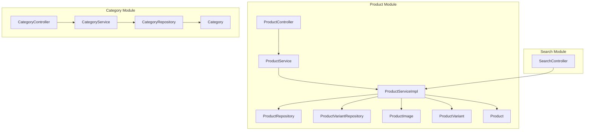
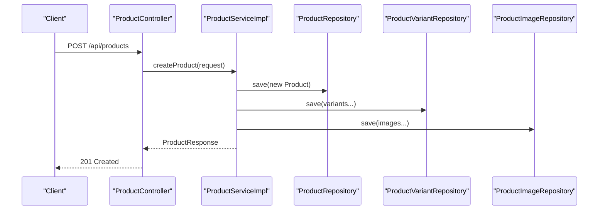
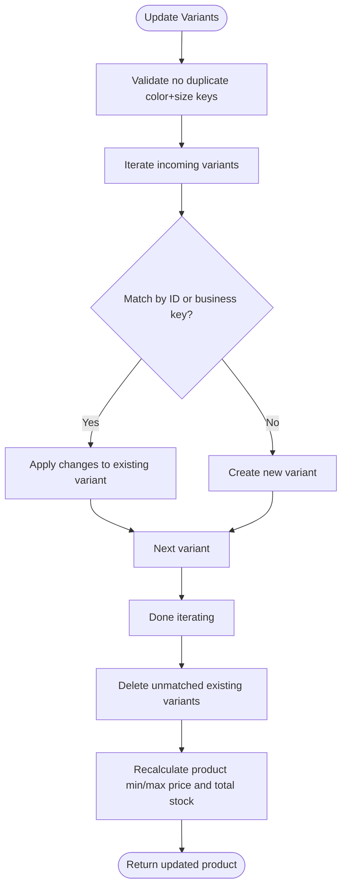
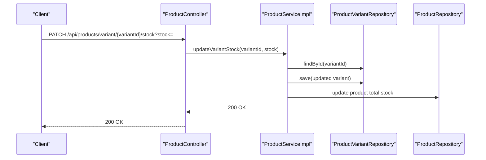
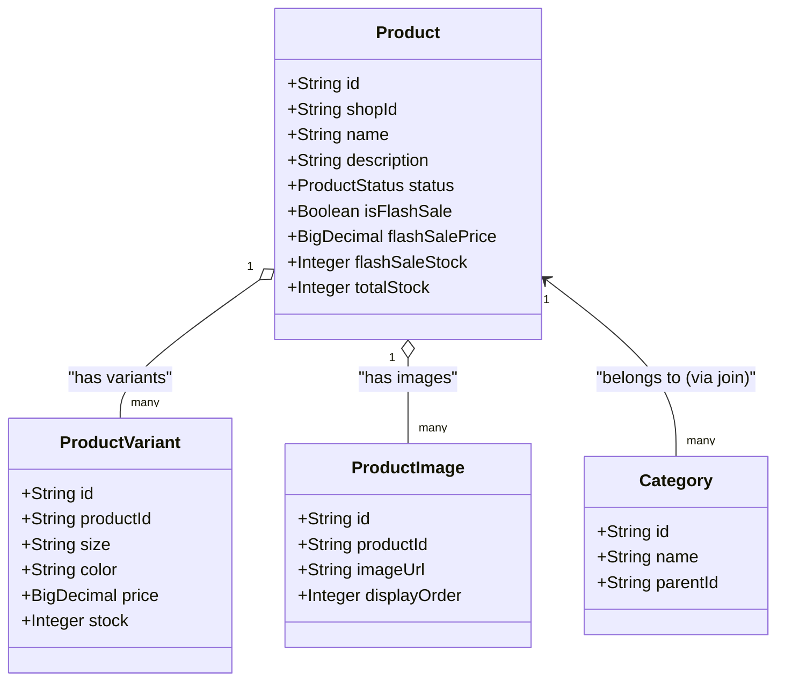
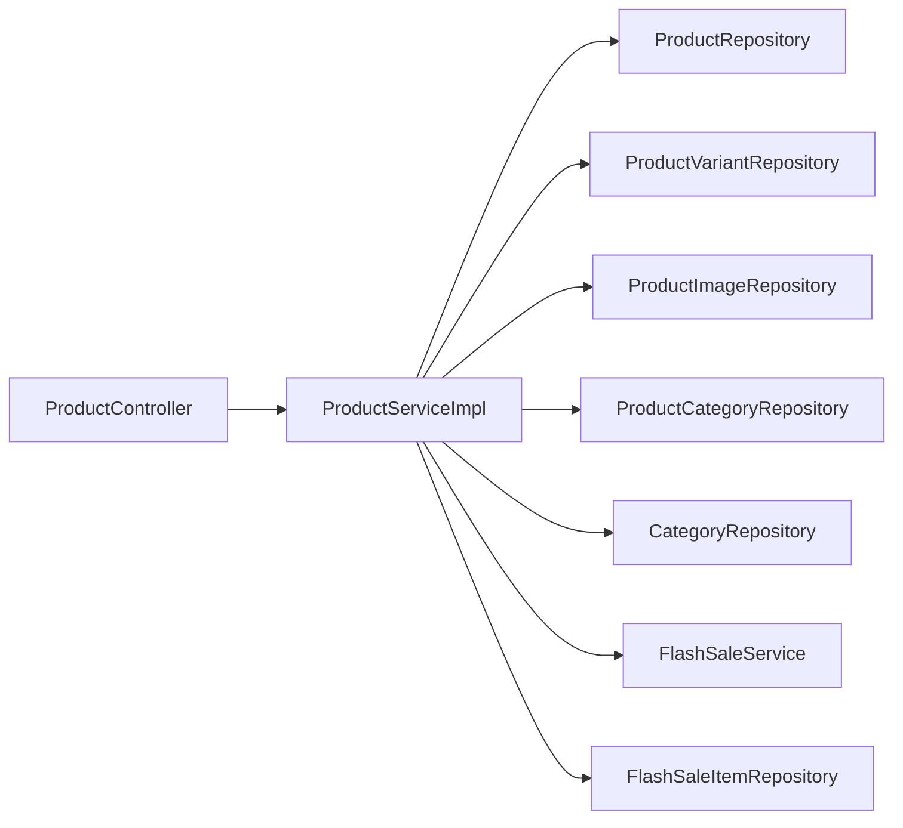

# Product Catalog Management

<cite>
**Referenced Files in This Document**
- [ProductController.java](file://src/backend/src/main/java/com/shoppeclone/backend/product/controller/ProductController.java)
- [CategoryController.java](file://src/backend/src/main/java/com/shoppeclone/backend/product/controller/CategoryController.java)
- [ProductService.java](file://src/backend/src/main/java/com/shoppeclone/backend/product/service/ProductService.java)
- [ProductServiceImpl.java](file://src/backend/src/main/java/com/shoppeclone/backend/product/service/impl/ProductServiceImpl.java)
- [CategoryService.java](file://src/backend/src/main/java/com/shoppeclone/backend/product/service/CategoryService.java)
- [Product.java](file://src/backend/src/main/java/com/shoppeclone/backend/product/entity/Product.java)
- [ProductVariant.java](file://src/backend/src/main/java/com/shoppeclone/backend/product/entity/ProductVariant.java)
- [ProductImage.java](file://src/backend/src/main/java/com/shoppeclone/backend/product/entity/ProductImage.java)
- [Category.java](file://src/backend/src/main/java/com/shoppeclone/backend/product/entity/Category.java)
- [ProductRepository.java](file://src/backend/src/main/java/com/shoppeclone/backend/product/repository/ProductRepository.java)
- [ProductVariantRepository.java](file://src/backend/src/main/java/com/shoppeclone/backend/product/repository/ProductVariantRepository.java)
- [CategoryRepository.java](file://src/backend/src/main/java/com/shoppeclone/backend/product/repository/CategoryRepository.java)
- [CreateProductRequest.java](file://src/backend/src/main/java/com/shoppeclone/backend/product/dto/request/CreateProductRequest.java)
- [UpdateProductRequest.java](file://src/backend/src/main/java/com/shoppeclone/backend/product/dto/request/UpdateProductRequest.java)
- [SearchController.java](file://src/backend/src/main/java/com/shoppeclone/backend/search/controller/SearchController.java)
</cite>

## Table of Contents
1. [Introduction](#introduction)
2. [Project Structure](#project-structure)
3. [Core Components](#core-components)
4. [Architecture Overview](#architecture-overview)
5. [Detailed Component Analysis](#detailed-component-analysis)
6. [Dependency Analysis](#dependency-analysis)
7. [Performance Considerations](#performance-considerations)
8. [Troubleshooting Guide](#troubleshooting-guide)
9. [Conclusion](#conclusion)
10. [Appendices](#appendices)

## Introduction
This document explains the product catalog management subsystem of the e-commerce backend. It covers product CRUD operations, variant management, category handling, image management, and inventory tracking. It also documents search and filtering capabilities, SEO considerations, and relationships with shopping cart, order processing, and promotion systems. The goal is to make the system understandable for beginners while providing sufficient technical depth for experienced developers.

## Project Structure
The product catalog module is organized by domain: controllers expose REST endpoints, services encapsulate business logic, repositories access MongoDB collections, and entities define the data model. Supporting components include category management and search suggestions.

**Diagram sources**
- [ProductController.java:18-163](file://src/backend/src/main/java/com/shoppeclone/backend/product/controller/ProductController.java#L18-L163)
- [ProductService.java:10-53](file://src/backend/src/main/java/com/shoppeclone/backend/product/service/ProductService.java#L10-L53)
- [ProductServiceImpl.java:36-657](file://src/backend/src/main/java/com/shoppeclone/backend/product/service/impl/ProductServiceImpl.java#L36-L657)
- [ProductRepository.java:11-40](file://src/backend/src/main/java/com/shoppeclone/backend/product/repository/ProductRepository.java#L11-L40)
- [ProductVariantRepository.java:8-22](file://src/backend/src/main/java/com/shoppeclone/backend/product/repository/ProductVariantRepository.java#L8-L22)
- [ProductImage.java:9-22](file://src/backend/src/main/java/com/shoppeclone/backend/product/entity/ProductImage.java#L9-L22)
- [ProductVariant.java:10-36](file://src/backend/src/main/java/com/shoppeclone/backend/product/entity/ProductVariant.java#L10-L36)
- [Product.java:10-50](file://src/backend/src/main/java/com/shoppeclone/backend/product/entity/Product.java#L10-L50)
- [CategoryController.java:14-59](file://src/backend/src/main/java/com/shoppeclone/backend/product/controller/CategoryController.java#L14-L59)
- [CategoryService.java:7-21](file://src/backend/src/main/java/com/shoppeclone/backend/product/service/CategoryService.java#L7-L21)
- [CategoryRepository.java:8-20](file://src/backend/src/main/java/com/shoppeclone/backend/product/repository/CategoryRepository.java#L8-L20)
- [Category.java:8-21](file://src/backend/src/main/java/com/shoppeclone/backend/product/entity/Category.java#L8-L21)
- [SearchController.java:9-37](file://src/backend/src/main/java/com/shoppeclone/backend/search/controller/SearchController.java#L9-L37)

**Section sources**
- [ProductController.java:18-163](file://src/backend/src/main/java/com/shoppeclone/backend/product/controller/ProductController.java#L18-L163)
- [CategoryController.java:14-59](file://src/backend/src/main/java/com/shoppeclone/backend/product/controller/CategoryController.java#L14-L59)
- [ProductServiceImpl.java:36-657](file://src/backend/src/main/java/com/shoppeclone/backend/product/service/impl/ProductServiceImpl.java#L36-L657)
- [ProductRepository.java:11-40](file://src/backend/src/main/java/com/shoppeclone/backend/product/repository/ProductRepository.java#L11-L40)
- [ProductVariantRepository.java:8-22](file://src/backend/src/main/java/com/shoppeclone/backend/product/repository/ProductVariantRepository.java#L8-L22)
- [CategoryRepository.java:8-20](file://src/backend/src/main/java/com/shoppeclone/backend/product/repository/CategoryRepository.java#L8-L20)
- [SearchController.java:9-37](file://src/backend/src/main/java/com/shoppeclone/backend/search/controller/SearchController.java#L9-L37)

## Core Components
- ProductController: Exposes REST endpoints for product CRUD, variants, categories, and images. Includes search and flash-sale endpoints.
- ProductService and ProductServiceImpl: Define and implement product business logic including creation, updates, deletion, variant management, category linking, image management, and visibility controls.
- CategoryController and CategoryService: Manage categories with hierarchical support and CRUD operations.
- Repositories: Access MongoDB collections for products, variants, images, and categories.
- Entities: Define the data model for products, variants, images, and categories.
- Requests DTOs: Define validated input shapes for create/update operations.

Key responsibilities:
- Product lifecycle: create, read, update, delete, visibility toggle, and flash-sale status management.
- Variant lifecycle: add, remove, update stock, and maintain aggregated product totals.
- Category lifecycle: add/remove product-category associations.
- Image lifecycle: add/remove product images with ordering.
- Search and filtering: name/description search, category filtering, and suggestions.
- Inventory tracking: per-variant stock and aggregated product stock.

**Section sources**
- [ProductController.java:26-161](file://src/backend/src/main/java/com/shoppeclone/backend/product/controller/ProductController.java#L26-L161)
- [ProductService.java:10-53](file://src/backend/src/main/java/com/shoppeclone/backend/product/service/ProductService.java#L10-L53)
- [ProductServiceImpl.java:46-655](file://src/backend/src/main/java/com/shoppeclone/backend/product/service/impl/ProductServiceImpl.java#L46-L655)
- [CategoryController.java:22-58](file://src/backend/src/main/java/com/shoppeclone/backend/product/controller/CategoryController.java#L22-L58)
- [CategoryService.java:7-21](file://src/backend/src/main/java/com/shoppeclone/backend/product/service/CategoryService.java#L7-L21)
- [ProductRepository.java:11-40](file://src/backend/src/main/java/com/shoppeclone/backend/product/repository/ProductRepository.java#L11-L40)
- [ProductVariantRepository.java:8-22](file://src/backend/src/main/java/com/shoppeclone/backend/product/repository/ProductVariantRepository.java#L8-L22)
- [CategoryRepository.java:8-20](file://src/backend/src/main/java/com/shoppeclone/backend/product/repository/CategoryRepository.java#L8-L20)
- [CreateProductRequest.java:8-26](file://src/backend/src/main/java/com/shoppeclone/backend/product/dto/request/CreateProductRequest.java#L8-L26)
- [UpdateProductRequest.java:9-23](file://src/backend/src/main/java/com/shoppeclone/backend/product/dto/request/UpdateProductRequest.java#L9-L23)

## Architecture Overview
The product catalog follows a layered architecture:
- Presentation: Controllers handle HTTP requests and responses.
- Application: Services orchestrate business rules and coordinate repositories.
- Persistence: Repositories map to MongoDB collections for products, variants, images, and categories.
- Data Transfer Objects: Request/response DTOs validate and shape inputs/outputs.

**Diagram sources**
- [ProductController.java:26-29](file://src/backend/src/main/java/com/shoppeclone/backend/product/controller/ProductController.java#L26-L29)
- [ProductServiceImpl.java:48-127](file://src/backend/src/main/java/com/shoppeclone/backend/product/service/impl/ProductServiceImpl.java#L48-L127)
- [ProductRepository.java:11-18](file://src/backend/src/main/java/com/shoppeclone/backend/product/repository/ProductRepository.java#L11-L18)
- [ProductVariantRepository.java:8-11](file://src/backend/src/main/java/com/shoppeclone/backend/product/repository/ProductVariantRepository.java#L8-L11)
- [ProductImage.java:9-22](file://src/backend/src/main/java/com/shoppeclone/backend/product/entity/ProductImage.java#L9-L22)

**Section sources**
- [ProductController.java:26-29](file://src/backend/src/main/java/com/shoppeclone/backend/product/controller/ProductController.java#L26-L29)
- [ProductServiceImpl.java:48-127](file://src/backend/src/main/java/com/shoppeclone/backend/product/service/impl/ProductServiceImpl.java#L48-L127)

## Detailed Component Analysis

### Product CRUD Operations
Endpoints:
- Create product: POST /api/products
- Get product by ID: GET /api/products/{id}
- List products by shop: GET /api/products/shop/{shopId}?includeHidden={bool}
- List all products: GET /api/products?sort={sold_desc}
- Search products: GET /api/products/search?keyword={term}
- Get flash-sale products: GET /api/products/flash-sale
- Get products by category: GET /api/products/category/{categoryId}
- Update product: PUT /api/products/{id}
- Delete product: DELETE /api/products/{id}
- Update product status: PATCH /api/products/{id} with body containing "status" or "isFlashSale"

Behavior highlights:
- Create supports variants, images, and optional category detection from product name.
- Update allows reassigning shop, replacing images, updating variants (preserving IDs for order linkage), and toggling flash-sale fields.
- Visibility controlled via status enum; hidden products excluded from most queries unless explicitly requested.
- Flash-sale visibility gated by an active flash-sale campaign.

Return values:
- Create returns ProductResponse with computed min/max price, total stock, variants, images, and categories.
- Update returns updated ProductResponse.
- Search returns filtered ProductResponse list.
- Category and shop queries return lists of ProductResponse.

**Section sources**
- [ProductController.java:26-98](file://src/backend/src/main/java/com/shoppeclone/backend/product/controller/ProductController.java#L26-L98)
- [ProductServiceImpl.java:129-346](file://src/backend/src/main/java/com/shoppeclone/backend/product/service/impl/ProductServiceImpl.java#L129-L346)
- [ProductRepository.java:11-40](file://src/backend/src/main/java/com/shoppeclone/backend/product/repository/ProductRepository.java#L11-L40)
- [Product.java:22-46](file://src/backend/src/main/java/com/shoppeclone/backend/product/entity/Product.java#L22-L46)

### Variant Management
Endpoints:
- Add variant: POST /api/products/{productId}/variants
- Remove variant: DELETE /api/products/variants/{variantId}
- Get variant by ID: GET /api/products/variant/{variantId}
- Update variant stock: PATCH /api/products/variant/{variantId}/stock?stock={qty}

Business rules:
- Variants are uniquely identified by a combination of color and size; duplicates are rejected during creation/update.
- During update, the service attempts to reuse existing variant IDs to preserve order linkage; otherwise, it creates new variants.
- Stock changes cascade to recalculate product-level total stock.

**Diagram sources**
- [ProductServiceImpl.java:257-341](file://src/backend/src/main/java/com/shoppeclone/backend/product/service/impl/ProductServiceImpl.java#L257-L341)
- [ProductVariantRepository.java:8-11](file://src/backend/src/main/java/com/shoppeclone/backend/product/repository/ProductVariantRepository.java#L8-L11)

**Section sources**
- [ProductController.java:101-128](file://src/backend/src/main/java/com/shoppeclone/backend/product/controller/ProductController.java#L101-L128)
- [ProductServiceImpl.java:363-459](file://src/backend/src/main/java/com/shoppeclone/backend/product/service/impl/ProductServiceImpl.java#L363-L459)
- [ProductVariant.java:19-35](file://src/backend/src/main/java/com/shoppeclone/backend/product/entity/ProductVariant.java#L19-L35)

### Category Handling
Endpoints:
- Create category: POST /api/categories
- Get category by ID: GET /api/categories/{id}
- List all categories: GET /api/categories
- List root categories: GET /api/categories/root
- List subcategories: GET /api/categories/{parentId}/subcategories
- Update category: PUT /api/categories/{id}
- Delete category: DELETE /api/categories/{id}

Product-to-category association:
- Products can be associated with categories via endpoints under /api/products/{productId}/categories/{categoryId}.
- Removing a category removes the product-category link; removing a product deletes its links automatically.

Hierarchical categories supported via self-reference (parentId).

**Section sources**
- [CategoryController.java:22-58](file://src/backend/src/main/java/com/shoppeclone/backend/product/controller/CategoryController.java#L22-L58)
- [CategoryService.java:7-21](file://src/backend/src/main/java/com/shoppeclone/backend/product/service/CategoryService.java#L7-L21)
- [Category.java:16-17](file://src/backend/src/main/java/com/shoppeclone/backend/product/entity/Category.java#L16-L17)
- [CategoryRepository.java:8-20](file://src/backend/src/main/java/com/shoppeclone/backend/product/repository/CategoryRepository.java#L8-L20)
- [ProductController.java:131-145](file://src/backend/src/main/java/com/shoppeclone/backend/product/controller/ProductController.java#L131-L145)

### Image Management
Endpoints:
- Add image: POST /api/products/{productId}/images with JSON body {"imageUrl": "..."}
- Remove image: DELETE /api/products/images/{imageId}

Behavior:
- Images are stored with an ordered display preference; retrieval respects ascending order.
- Updating product images replaces the previous set by deleting old images and inserting new ones.

**Section sources**
- [ProductController.java:148-161](file://src/backend/src/main/java/com/shoppeclone/backend/product/controller/ProductController.java#L148-L161)
- [ProductServiceImpl.java:239-254](file://src/backend/src/main/java/com/shoppeclone/backend/product/service/impl/ProductServiceImpl.java#L239-L254)
- [ProductImage.java:18-19](file://src/backend/src/main/java/com/shoppeclone/backend/product/entity/ProductImage.java#L18-L19)

### Inventory Tracking
- Per-variant stock is tracked and can be updated independently.
- Product-level total stock is recalculated whenever a variant’s stock changes.
- Flash-sale inventory integrates with the promotions module to compute real-time sold counts from approved flash-sale items.

**Diagram sources**
- [ProductController.java:122-128](file://src/backend/src/main/java/com/shoppeclone/backend/product/controller/ProductController.java#L122-L128)
- [ProductServiceImpl.java:433-459](file://src/backend/src/main/java/com/shoppeclone/backend/product/service/impl/ProductServiceImpl.java#L433-L459)

**Section sources**
- [ProductVariant.java:21-22](file://src/backend/src/main/java/com/shoppeclone/backend/product/entity/ProductVariant.java#L21-L22)
- [ProductServiceImpl.java:433-459](file://src/backend/src/main/java/com/shoppeclone/backend/product/service/impl/ProductServiceImpl.java#L433-L459)

### Search, Filtering, and SEO
- Product search: GET /api/products/search?keyword={term} performs case-insensitive name/description matching for active products.
- Sorting: GET /api/products?sort=sold_desc returns products sorted by sold count.
- Suggestions: GET /api/search/suggestions?keyword={term}&limit={n} returns mixed suggestions including products, categories, keywords, and variant attributes.
- Filtering: GET /api/products/category/{categoryId} filters by category; GET /api/products/shop/{shopId}?includeHidden={bool} filters by shop with optional inclusion of hidden products.

SEO considerations:
- Use descriptive product names and descriptions to improve search relevance.
- Maintain accurate categories and variant attributes to enhance discoverability.
- Keep product images optimized and ordered for better presentation.

**Section sources**
- [ProductController.java:48-61](file://src/backend/src/main/java/com/shoppeclone/backend/product/controller/ProductController.java#L48-L61)
- [ProductRepository.java:20-39](file://src/backend/src/main/java/com/shoppeclone/backend/product/repository/ProductRepository.java#L20-L39)
- [SearchController.java:29-36](file://src/backend/src/main/java/com/shoppeclone/backend/search/controller/SearchController.java#L29-L36)

### Relationships with Shopping Cart, Orders, and Promotions
- Cart and orders reference product variants by ID; variant ID preservation during updates ensures historical linkage remains intact.
- Flash-sale integration:
  - Product-level flash-sale fields are managed via dedicated endpoints and visibility toggles.
  - Real-time sold counts are computed from approved flash-sale items in the promotions module.
  - Flash-sale availability gates visibility of flash-sale products.

**Diagram sources**
- [Product.java:10-50](file://src/backend/src/main/java/com/shoppeclone/backend/product/entity/Product.java#L10-L50)
- [ProductVariant.java:10-36](file://src/backend/src/main/java/com/shoppeclone/backend/product/entity/ProductVariant.java#L10-L36)
- [ProductImage.java:9-22](file://src/backend/src/main/java/com/shoppeclone/backend/product/entity/ProductImage.java#L9-L22)
- [Category.java:8-21](file://src/backend/src/main/java/com/shoppeclone/backend/product/entity/Category.java#L8-L21)

**Section sources**
- [ProductServiceImpl.java:257-341](file://src/backend/src/main/java/com/shoppeclone/backend/product/service/impl/ProductServiceImpl.java#L257-L341)
- [ProductController.java:81-97](file://src/backend/src/main/java/com/shoppeclone/backend/product/controller/ProductController.java#L81-L97)
- [ProductRepository.java:28-28](file://src/backend/src/main/java/com/shoppeclone/backend/product/repository/ProductRepository.java#L28-L28)

## Dependency Analysis
- ProductServiceImpl depends on ProductRepository, ProductVariantRepository, ProductImageRepository, ProductCategoryRepository, CategoryRepository, FlashSaleService, and FlashSaleItemRepository.
- Controllers depend on services; repositories depend on MongoDB.
- DTOs decouple external request shapes from internal entities.

**Diagram sources**
- [ProductController.java:24-24](file://src/backend/src/main/java/com/shoppeclone/backend/product/controller/ProductController.java#L24-L24)
- [ProductServiceImpl.java:38-44](file://src/backend/src/main/java/com/shoppeclone/backend/product/service/impl/ProductServiceImpl.java#L38-L44)

**Section sources**
- [ProductServiceImpl.java:38-44](file://src/backend/src/main/java/com/shoppeclone/backend/product/service/impl/ProductServiceImpl.java#L38-L44)

## Performance Considerations
- Indexing: Entities use @Indexed on foreign keys (shopId, productId) to speed up lookups.
- Aggregated fields: Product min/max price and total stock are precomputed and updated after variant changes to avoid expensive joins.
- Sorting: Sold-desc sorting leverages Spring Data Sort; consider indexing sold field if performance becomes a concern.
- Search: Regex queries are used for name/description and suggestions; ensure appropriate indexes for frequently searched terms.
- Batch operations: Variant updates reuse existing IDs to minimize churn; consider pagination for large bulk updates.

[No sources needed since this section provides general guidance]

## Troubleshooting Guide
Common issues and resolutions:
- Product not found errors: Ensure the product ID exists before invoking update/delete/variant/image operations.
  - Example: [ProductServiceImpl.java:350-361](file://src/backend/src/main/java/com/shoppeclone/backend/product/service/impl/ProductServiceImpl.java#L350-L361)
- Duplicate variant attributes: The system rejects duplicate combinations of color and size during creation/update.
  - Example: [ProductServiceImpl.java:414-424](file://src/backend/src/main/java/com/shoppeclone/backend/product/service/impl/ProductServiceImpl.java#L414-L424)
- Variant stock mismatch: After stock updates, product total stock is recalculated; verify variant stock changes propagate correctly.
  - Example: [ProductServiceImpl.java:447-459](file://src/backend/src/main/java/com/shoppeclone/backend/product/service/impl/ProductServiceImpl.java#L447-L459)
- Flash-sale visibility: Flash-sale products are only returned when a campaign is active; ensure the campaign is configured.
  - Example: [ProductServiceImpl.java:502-511](file://src/backend/src/main/java/com/shoppeclone/backend/product/service/impl/ProductServiceImpl.java#L502-L511)
- Category not applied: If categoryId is omitted, category detection attempts to infer from product name; verify category names and detection logic.
  - Example: [ProductServiceImpl.java:113-124](file://src/backend/src/main/java/com/shoppeclone/backend/product/service/impl/ProductServiceImpl.java#L113-L124)

**Section sources**
- [ProductServiceImpl.java:350-361](file://src/backend/src/main/java/com/shoppeclone/backend/product/service/impl/ProductServiceImpl.java#L350-L361)
- [ProductServiceImpl.java:414-424](file://src/backend/src/main/java/com/shoppeclone/backend/product/service/impl/ProductServiceImpl.java#L414-L424)
- [ProductServiceImpl.java:447-459](file://src/backend/src/main/java/com/shoppeclone/backend/product/service/impl/ProductServiceImpl.java#L447-L459)
- [ProductServiceImpl.java:502-511](file://src/backend/src/main/java/com/shoppeclone/backend/product/service/impl/ProductServiceImpl.java#L502-L511)
- [ProductServiceImpl.java:113-124](file://src/backend/src/main/java/com/shoppeclone/backend/product/service/impl/ProductServiceImpl.java#L113-L124)

## Conclusion
The product catalog module provides a robust foundation for managing products, variants, categories, and images with integrated search and flash-sale support. Its design emphasizes data integrity (via variant ID preservation), performance (aggregated fields and indexing), and extensibility (clear separation of concerns). By following the documented endpoints, DTOs, and business rules, teams can implement reliable product experiences across shopping cart, orders, and promotions.

[No sources needed since this section summarizes without analyzing specific files]

## Appendices

### API Reference Summary
- Product endpoints:
  - POST /api/products
  - GET /api/products/{id}
  - GET /api/products/shop/{shopId}?includeHidden={bool}
  - GET /api/products?sort={sold_desc}
  - GET /api/products/search?keyword={term}
  - GET /api/products/flash-sale
  - GET /api/products/category/{categoryId}
  - PUT /api/products/{id}
  - DELETE /api/products/{id}
  - PATCH /api/products/{id} with status or isFlashSale
  - POST /api/products/{productId}/variants
  - DELETE /api/products/variants/{variantId}
  - GET /api/products/variant/{variantId}
  - PATCH /api/products/variant/{variantId}/stock?stock={qty}
  - POST /api/products/{productId}/categories/{categoryId}
  - DELETE /api/products/{productId}/categories/{categoryId}
  - POST /api/products/{productId}/images
  - DELETE /api/products/images/{imageId}
- Category endpoints:
  - POST /api/categories
  - GET /api/categories/{id}
  - GET /api/categories
  - GET /api/categories/root
  - GET /api/categories/{parentId}/subcategories
  - PUT /api/categories/{id}
  - DELETE /api/categories/{id}
- Search endpoint:
  - GET /api/search/suggestions?keyword={term}&limit={n}

**Section sources**
- [ProductController.java:26-161](file://src/backend/src/main/java/com/shoppeclone/backend/product/controller/ProductController.java#L26-L161)
- [CategoryController.java:22-58](file://src/backend/src/main/java/com/shoppeclone/backend/product/controller/CategoryController.java#L22-L58)
- [SearchController.java:29-36](file://src/backend/src/main/java/com/shoppeclone/backend/search/controller/SearchController.java#L29-L36)