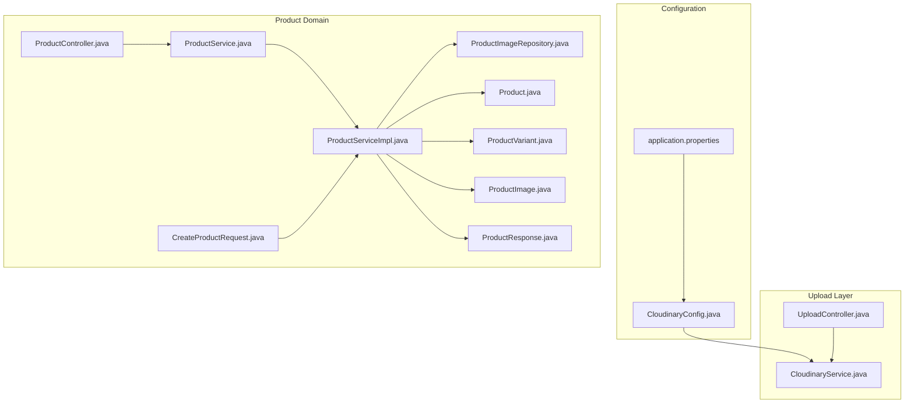
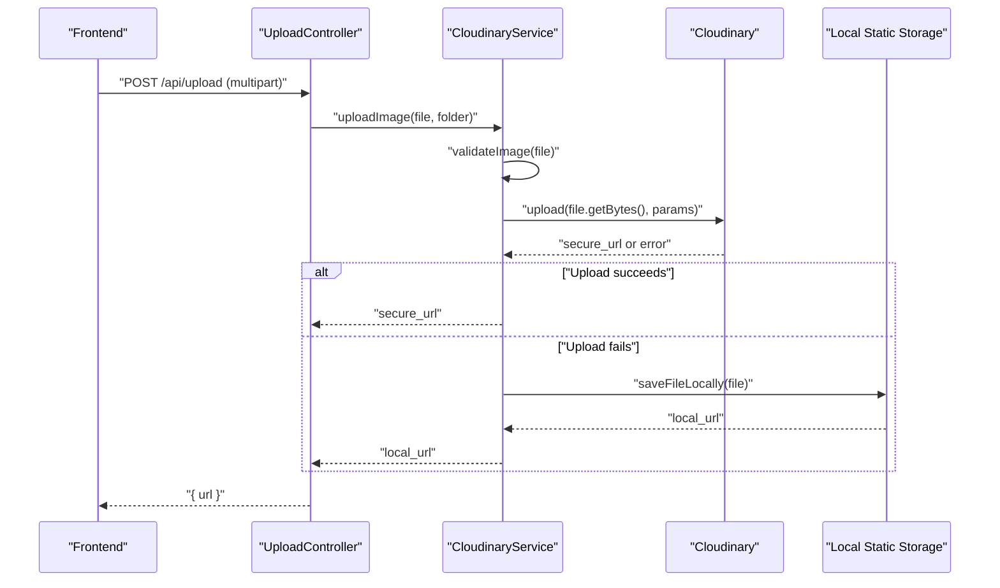
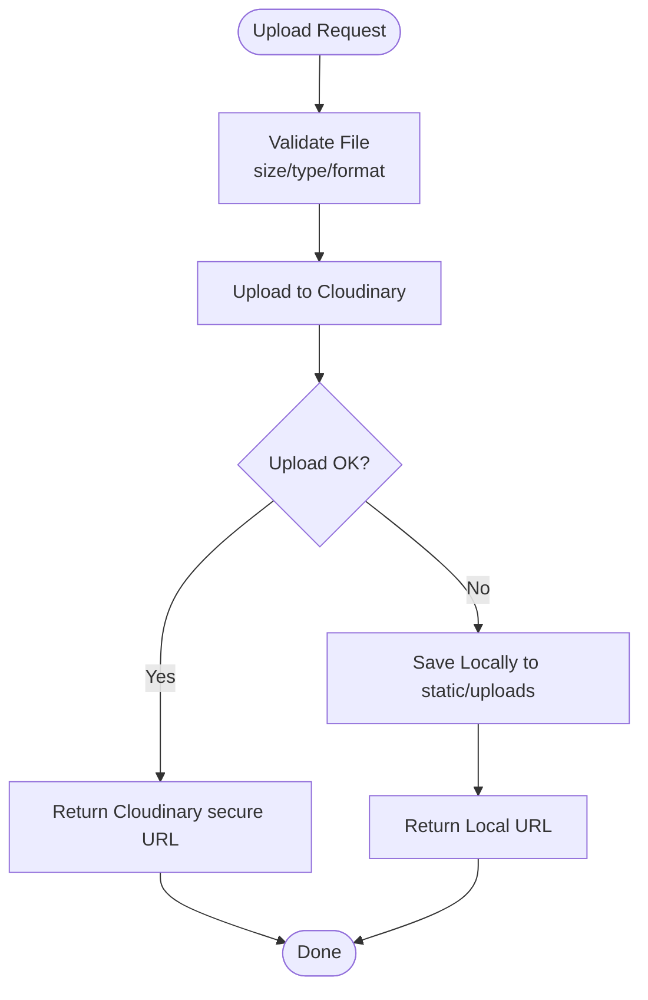
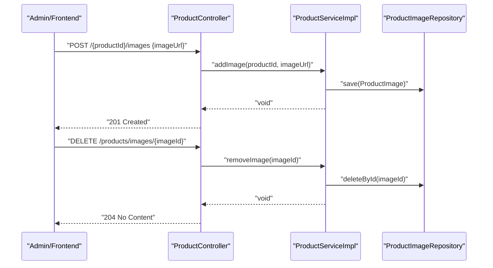
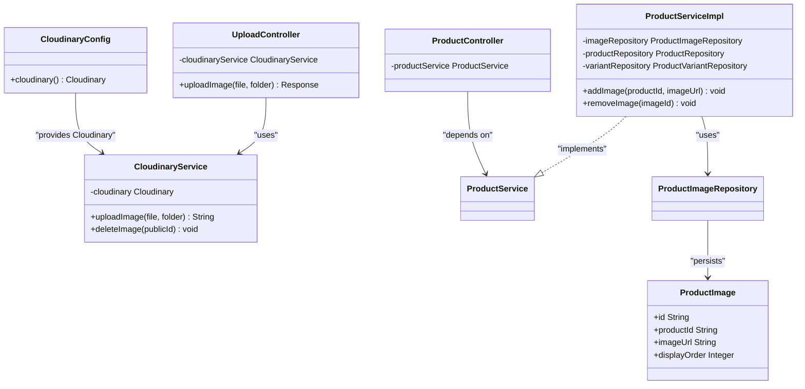

# Product Image Management

<cite>
**Referenced Files in This Document**
- [CloudinaryConfig.java](file://src/backend/src/main/java/com/shoppeclone/backend/common/config/CloudinaryConfig.java)
- [CloudinaryService.java](file://src/backend/src/main/java/com/shoppeclone/backend/common/service/CloudinaryService.java)
- [UploadController.java](file://src/backend/src/main/java/com/shoppeclone/backend/common/controller/UploadController.java)
- [application.properties](file://src/backend/src/main/resources/application.properties)
- [ProductController.java](file://src/backend/src/main/java/com/shoppeclone/backend/product/controller/ProductController.java)
- [ProductService.java](file://src/backend/src/main/java/com/shoppeclone/backend/product/service/ProductService.java)
- [ProductServiceImpl.java](file://src/backend/src/main/java/com/shoppeclone/backend/product/service/impl/ProductServiceImpl.java)
- [ProductImage.java](file://src/backend/src/main/java/com/shoppeclone/backend/product/entity/ProductImage.java)
- [ProductImageRepository.java](file://src/backend/src/main/java/com/shoppeclone/backend/product/repository/ProductImageRepository.java)
- [Product.java](file://src/backend/src/main/java/com/shoppeclone/backend/product/entity/Product.java)
- [ProductVariant.java](file://src/backend/src/main/java/com/shoppeclone/backend/product/entity/ProductVariant.java)
- [ProductResponse.java](file://src/backend/src/main/java/com/shoppeclone/backend/product/dto/response/ProductResponse.java)
- [CreateProductRequest.java](file://src/backend/src/main/java/com/shoppeclone/backend/product/dto/request/CreateProductRequest.java)
</cite>

## Table of Contents
1. [Introduction](#introduction)
2. [Project Structure](#project-structure)
3. [Core Components](#core-components)
4. [Architecture Overview](#architecture-overview)
5. [Detailed Component Analysis](#detailed-component-analysis)
6. [Dependency Analysis](#dependency-analysis)
7. [Performance Considerations](#performance-considerations)
8. [Troubleshooting Guide](#troubleshooting-guide)
9. [Conclusion](#conclusion)
10. [Appendices](#appendices)

## Introduction
This document explains the product image management system, focusing on image upload, cloud storage integration with Cloudinary, image optimization workflows, URL handling, thumbnails, responsive serving, removal and replacement, batch operations, metadata and accessibility, validation rules, CDN and caching, performance optimization, backup and migration, and integrations with product display, search indexing, and social sharing.

## Project Structure
The image management system spans configuration, upload handling, product domain services, and persistence. Key areas:
- Cloud storage configuration and service
- Upload endpoint controller
- Product domain with image entities and repositories
- Product service orchestrating creation, updates, and image operations
- Response DTOs exposing image URLs to clients

**Diagram sources**
- [CloudinaryConfig.java:1-30](file://src/backend/src/main/java/com/shoppeclone/backend/common/config/CloudinaryConfig.java#L1-L30)
- [application.properties:85-90](file://src/backend/src/main/resources/application.properties#L85-L90)
- [UploadController.java:1-34](file://src/backend/src/main/java/com/shoppeclone/backend/common/controller/UploadController.java#L1-L34)
- [CloudinaryService.java:1-137](file://src/backend/src/main/java/com/shoppeclone/backend/common/service/CloudinaryService.java#L1-L137)
- [ProductController.java:1-163](file://src/backend/src/main/java/com/shoppeclone/backend/product/controller/ProductController.java#L1-L163)
- [ProductService.java:1-54](file://src/backend/src/main/java/com/shoppeclone/backend/product/service/ProductService.java#L1-L54)
- [ProductServiceImpl.java:1-657](file://src/backend/src/main/java/com/shoppeclone/backend/product/service/impl/ProductServiceImpl.java#L1-L657)
- [ProductImage.java:1-23](file://src/backend/src/main/java/com/shoppeclone/backend/product/entity/ProductImage.java#L1-L23)
- [ProductImageRepository.java:1-12](file://src/backend/src/main/java/com/shoppeclone/backend/product/repository/ProductImageRepository.java#L1-L12)
- [Product.java](file://src/backend/src/main/java/com/shoppeclone/backend/product/entity/Product.java)
- [ProductVariant.java](file://src/backend/src/main/java/com/shoppeclone/backend/product/entity/ProductVariant.java)
- [ProductResponse.java:1-36](file://src/backend/src/main/java/com/shoppeclone/backend/product/dto/response/ProductResponse.java#L1-L36)
- [CreateProductRequest.java:1-27](file://src/backend/src/main/java/com/shoppeclone/backend/product/dto/request/CreateProductRequest.java#L1-L27)

**Section sources**
- [CloudinaryConfig.java:1-30](file://src/backend/src/main/java/com/shoppeclone/backend/common/config/CloudinaryConfig.java#L1-L30)
- [application.properties:85-90](file://src/backend/src/main/resources/application.properties#L85-L90)
- [UploadController.java:1-34](file://src/backend/src/main/java/com/shoppeclone/backend/common/controller/UploadController.java#L1-L34)
- [CloudinaryService.java:1-137](file://src/backend/src/main/java/com/shoppeclone/backend/common/service/CloudinaryService.java#L1-L137)
- [ProductController.java:147-161](file://src/backend/src/main/java/com/shoppeclone/backend/product/controller/ProductController.java#L147-L161)
- [ProductService.java:45-48](file://src/backend/src/main/java/com/shoppeclone/backend/product/service/ProductService.java#L45-L48)
- [ProductServiceImpl.java:480-499](file://src/backend/src/main/java/com/shoppeclone/backend/product/service/impl/ProductServiceImpl.java#L480-L499)
- [ProductImage.java:1-23](file://src/backend/src/main/java/com/shoppeclone/backend/product/entity/ProductImage.java#L1-L23)
- [ProductImageRepository.java:1-12](file://src/backend/src/main/java/com/shoppeclone/backend/product/repository/ProductImageRepository.java#L1-L12)

## Core Components
- Cloud storage configuration and service:
  - Cloudinary configuration bean with secure HTTPS enabled
  - Cloudinary service with validation, upload, fallback to local storage, and deletion
- Upload endpoint:
  - REST controller accepting multipart files and returning secure URLs
- Product domain:
  - ProductImage entity and repository for storing image URLs per product
  - Product service methods for adding/removing images and building responses with image lists
- Validation and constraints:
  - File size, type, and allowed formats enforced during upload

**Section sources**
- [CloudinaryConfig.java:21-28](file://src/backend/src/main/java/com/shoppeclone/backend/common/config/CloudinaryConfig.java#L21-L28)
- [CloudinaryService.java:36-58](file://src/backend/src/main/java/com/shoppeclone/backend/common/service/CloudinaryService.java#L36-L58)
- [UploadController.java:20-32](file://src/backend/src/main/java/com/shoppeclone/backend/common/controller/UploadController.java#L20-L32)
- [ProductImage.java:18-19](file://src/backend/src/main/java/com/shoppeclone/backend/product/entity/ProductImage.java#L18-L19)
- [ProductImageRepository.java:7-10](file://src/backend/src/main/java/com/shoppeclone/backend/product/repository/ProductImageRepository.java#L7-L10)
- [ProductService.java:45-48](file://src/backend/src/main/java/com/shoppeclone/backend/product/service/ProductService.java#L45-L48)
- [ProductServiceImpl.java:480-499](file://src/backend/src/main/java/com/shoppeclone/backend/product/service/impl/ProductServiceImpl.java#L480-L499)

## Architecture Overview
The system integrates Cloudinary for scalable image storage with a graceful fallback to local static storage. Product images are stored as URLs in MongoDB, enabling fast retrieval and decoupling from storage internals.

**Diagram sources**
- [UploadController.java:20-32](file://src/backend/src/main/java/com/shoppeclone/backend/common/controller/UploadController.java#L20-L32)
- [CloudinaryService.java:36-88](file://src/backend/src/main/java/com/shoppeclone/backend/common/service/CloudinaryService.java#L36-L88)

**Section sources**
- [CloudinaryService.java:27-58](file://src/backend/src/main/java/com/shoppeclone/backend/common/service/CloudinaryService.java#L27-L58)
- [application.properties:85-89](file://src/backend/src/main/resources/application.properties#L85-L89)

## Detailed Component Analysis

### Cloud Storage Integration (Cloudinary)
- Configuration:
  - Bean initializes Cloudinary with cloud name, API key, secret, and secure flag
- Upload workflow:
  - Validates file size, type, and format
  - Attempts Cloudinary upload; falls back to local static storage on failure
  - Returns HTTPS URL when available
- Deletion:
  - Destroys resource by public ID; logs warnings if deletion fails (e.g., local files)

**Diagram sources**
- [CloudinaryService.java:93-123](file://src/backend/src/main/java/com/shoppeclone/backend/common/service/CloudinaryService.java#L93-L123)
- [CloudinaryService.java:40-58](file://src/backend/src/main/java/com/shoppeclone/backend/common/service/CloudinaryService.java#L40-L58)
- [CloudinaryService.java:60-88](file://src/backend/src/main/java/com/shoppeclone/backend/common/service/CloudinaryService.java#L60-L88)

**Section sources**
- [CloudinaryConfig.java:12-28](file://src/backend/src/main/java/com/shoppeclone/backend/common/config/CloudinaryConfig.java#L12-L28)
- [CloudinaryService.java:93-123](file://src/backend/src/main/java/com/shoppeclone/backend/common/service/CloudinaryService.java#L93-L123)
- [CloudinaryService.java:128-135](file://src/backend/src/main/java/com/shoppeclone/backend/common/service/CloudinaryService.java#L128-L135)

### Image Upload Endpoint
- Accepts multipart/form-data with file and optional folder parameter
- Delegates to CloudinaryService and returns JSON with the resulting URL
- Handles validation and IO exceptions with appropriate HTTP status codes

**Section sources**
- [UploadController.java:20-32](file://src/backend/src/main/java/com/shoppeclone/backend/common/controller/UploadController.java#L20-L32)
- [CloudinaryService.java:36-58](file://src/backend/src/main/java/com/shoppeclone/backend/common/service/CloudinaryService.java#L36-L58)

### Product Image Management
- Adding images:
  - ProductController exposes POST /{productId}/images with imageUrl payload
  - ProductServiceImpl persists ProductImage with timestamps
- Retrieving images:
  - ProductServiceImpl loads images ordered by displayOrder for ProductResponse.images
- Removing images:
  - ProductController exposes DELETE /products/images/{imageId}
  - ProductServiceImpl deletes by imageId

**Diagram sources**
- [ProductController.java:147-161](file://src/backend/src/main/java/com/shoppeclone/backend/product/controller/ProductController.java#L147-L161)
- [ProductService.java:45-48](file://src/backend/src/main/java/com/shoppeclone/backend/product/service/ProductService.java#L45-L48)
- [ProductServiceImpl.java:480-499](file://src/backend/src/main/java/com/shoppeclone/backend/product/service/impl/ProductServiceImpl.java#L480-L499)
- [ProductImageRepository.java:7-10](file://src/backend/src/main/java/com/shoppeclone/backend/product/repository/ProductImageRepository.java#L7-L10)

**Section sources**
- [ProductController.java:147-161](file://src/backend/src/main/java/com/shoppeclone/backend/product/controller/ProductController.java#L147-L161)
- [ProductService.java:45-48](file://src/backend/src/main/java/com/shoppeclone/backend/product/service/ProductService.java#L45-L48)
- [ProductServiceImpl.java:480-499](file://src/backend/src/main/java/com/shoppeclone/backend/product/service/impl/ProductServiceImpl.java#L480-L499)
- [ProductImage.java:18-19](file://src/backend/src/main/java/com/shoppeclone/backend/product/entity/ProductImage.java#L18-L19)
- [ProductImageRepository.java:7-10](file://src/backend/src/main/java/com/shoppeclone/backend/product/repository/ProductImageRepository.java#L7-L10)

### Image URL Handling and Response Model
- ProductResponse exposes a list of image URLs for client rendering
- ProductServiceImpl builds ProductResponse.images by querying ProductImageRepository ordered by displayOrder
- Variants may also carry imageUrl for variant-specific visuals

**Section sources**
- [ProductResponse.java:17-17](file://src/backend/src/main/java/com/shoppeclone/backend/product/dto/response/ProductResponse.java#L17-L17)
- [ProductServiceImpl.java:560-564](file://src/backend/src/main/java/com/shoppeclone/backend/product/service/impl/ProductServiceImpl.java#L560-L564)
- [ProductVariant.java](file://src/backend/src/main/java/com/shoppeclone/backend/product/entity/ProductVariant.java)

### Thumbnail Generation and Responsive Serving
- Current implementation stores full-size URLs and does not include server-side transformations
- Recommendation:
  - Use Cloudinary dynamic transformations for width/height and format conversion
  - Serve responsive images via srcset and sizes attributes in the frontend
  - Store base URLs and derive transformed URLs at render time

[No sources needed since this section provides general guidance]

### Image Metadata, Alt Text, and Accessibility
- Current model stores raw URLs without structured metadata
- Recommendations:
  - Extend ProductImage with altText and metadata fields
  - Enforce alt text presence for accessibility compliance
  - Include accessibility attributes in product display components

[No sources needed since this section provides general guidance]

### Validation Rules, Formats, Size Limits, and Quality Settings
- Validation:
  - Maximum file size: 3 MB
  - Allowed content types: image/jpeg, image/jpg, image/png, image/webp
  - Non-empty file check
- Quality and optimization:
  - Cloudinary service does not specify compression quality; configure Cloudinary upload parameters for quality and format defaults
  - Consider enabling auto=format and quality settings in Cloudinary uploader parameters

**Section sources**
- [CloudinaryService.java:98-122](file://src/backend/src/main/java/com/shoppeclone/backend/common/service/CloudinaryService.java#L98-L122)

### Batch Operations
- Creating products with multiple images:
  - CreateProductRequest supports images list; ProductServiceImpl iterates and saves ordered images
- Updating product images:
  - UpdateProductRequest triggers removal of existing images and insertion of new ones
- Replacement:
  - Replace existing images by updating the images list in update requests

**Section sources**
- [CreateProductRequest.java:19-19](file://src/backend/src/main/java/com/shoppeclone/backend/product/dto/request/CreateProductRequest.java#L19-L19)
- [ProductServiceImpl.java:99-110](file://src/backend/src/main/java/com/shoppeclone/backend/product/service/impl/ProductServiceImpl.java#L99-L110)
- [ProductServiceImpl.java:239-254](file://src/backend/src/main/java/com/shoppeclone/backend/product/service/impl/ProductServiceImpl.java#L239-L254)

### Backup, Restoration, and Migration
- Backup:
  - Export product images collection and store alongside database snapshots
- Restoration:
  - Rehydrate images by re-uploading missing files to Cloudinary and updating URLs
- Migration:
  - If changing storage providers, iterate ProductImage records and re-upload to new provider, updating URLs accordingly

[No sources needed since this section provides general guidance]

### CDN Integration, Caching, and Performance
- CDN:
  - Cloudinary serves globally optimized delivery via HTTPS URLs
- Caching:
  - Configure browser and CDN caching headers for immutable image assets
  - Use ETags and cache-control policies to minimize bandwidth
- Performance:
  - Lazy-load images in product listings
  - Use modern formats (WEBP) and adaptive image sizes

**Section sources**
- [CloudinaryConfig.java:27-27](file://src/backend/src/main/java/com/shoppeclone/backend/common/config/CloudinaryConfig.java#L27-L27)

### Integrations with Product Display, Search Indexing, and Social Sharing
- Product display:
  - ProductResponse.images feeds product galleries and thumbnails
- Search indexing:
  - Consider extracting dominant colors or tags from images to enrich search metadata
- Social sharing:
  - Use primary image URL as og:image and twitter:image for social previews

**Section sources**
- [ProductResponse.java:17-17](file://src/backend/src/main/java/com/shoppeclone/backend/product/dto/response/ProductResponse.java#L17-L17)

## Dependency Analysis

**Diagram sources**
- [CloudinaryConfig.java:21-28](file://src/backend/src/main/java/com/shoppeclone/backend/common/config/CloudinaryConfig.java#L21-L28)
- [CloudinaryService.java:25-25](file://src/backend/src/main/java/com/shoppeclone/backend/common/service/CloudinaryService.java#L25-L25)
- [UploadController.java:18-18](file://src/backend/src/main/java/com/shoppeclone/backend/common/controller/UploadController.java#L18-L18)
- [ProductController.java:24-24](file://src/backend/src/main/java/com/shoppeclone/backend/product/controller/ProductController.java#L24-L24)
- [ProductService.java:10-10](file://src/backend/src/main/java/com/shoppeclone/backend/product/service/ProductService.java#L10-L10)
- [ProductServiceImpl.java:38-44](file://src/backend/src/main/java/com/shoppeclone/backend/product/service/impl/ProductServiceImpl.java#L38-L44)
- [ProductImageRepository.java:7-10](file://src/backend/src/main/java/com/shoppeclone/backend/product/repository/ProductImageRepository.java#L7-L10)
- [ProductImage.java:12-21](file://src/backend/src/main/java/com/shoppeclone/backend/product/entity/ProductImage.java#L12-L21)

**Section sources**
- [ProductServiceImpl.java:38-44](file://src/backend/src/main/java/com/shoppeclone/backend/product/service/impl/ProductServiceImpl.java#L38-L44)
- [ProductImageRepository.java:7-10](file://src/backend/src/main/java/com/shoppeclone/backend/product/repository/ProductImageRepository.java#L7-L10)
- [ProductImage.java:12-21](file://src/backend/src/main/java/com/shoppeclone/backend/product/entity/ProductImage.java#L12-L21)

## Performance Considerations
- Prefer Cloudinary’s CDN for global distribution
- Enable auto-format and quality settings in Cloudinary uploader parameters
- Use lazy loading and responsive image attributes in the frontend
- Cache frequently accessed product image lists at the application layer

[No sources needed since this section provides general guidance]

## Troubleshooting Guide
- Cloudinary upload failures:
  - Verify cloud credentials in environment variables and application properties
  - Check network connectivity and Cloudinary availability
- Local fallback behavior:
  - Confirm static upload directories exist and are writable
- Validation errors:
  - Ensure files are under 3 MB and of allowed types (JPEG, PNG, WEBP)
- Image deletion:
  - Public IDs must match Cloudinary resources; local files will not be deletable via Cloudinary destroy

**Section sources**
- [application.properties:85-89](file://src/backend/src/main/resources/application.properties#L85-L89)
- [CloudinaryService.java:52-57](file://src/backend/src/main/java/com/shoppeclone/backend/common/service/CloudinaryService.java#L52-L57)
- [CloudinaryService.java:98-122](file://src/backend/src/main/java/com/shoppeclone/backend/common/service/CloudinaryService.java#L98-L122)
- [CloudinaryService.java:128-135](file://src/backend/src/main/java/com/shoppeclone/backend/common/service/CloudinaryService.java#L128-L135)

## Conclusion
The system provides a robust, extensible foundation for product image management with Cloudinary-backed storage, validation, and product domain integration. Enhancements such as server-side transformations, structured metadata, and accessibility features will further improve UX, SEO, and compliance.

## Appendices

### Supported Formats and Constraints
- Formats: JPEG, JPG, PNG, WEBP
- Max size: 3 MB
- Type: image/*

**Section sources**
- [CloudinaryService.java:104-122](file://src/backend/src/main/java/com/shoppeclone/backend/common/service/CloudinaryService.java#L104-L122)