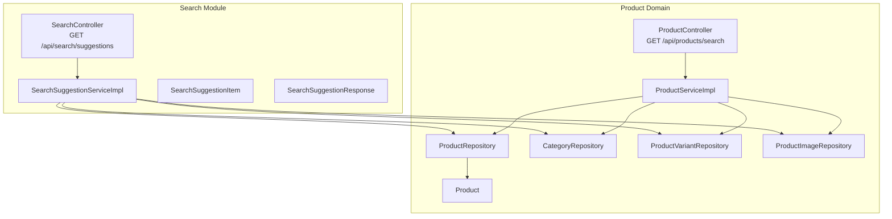
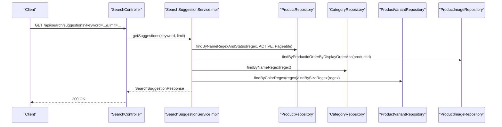
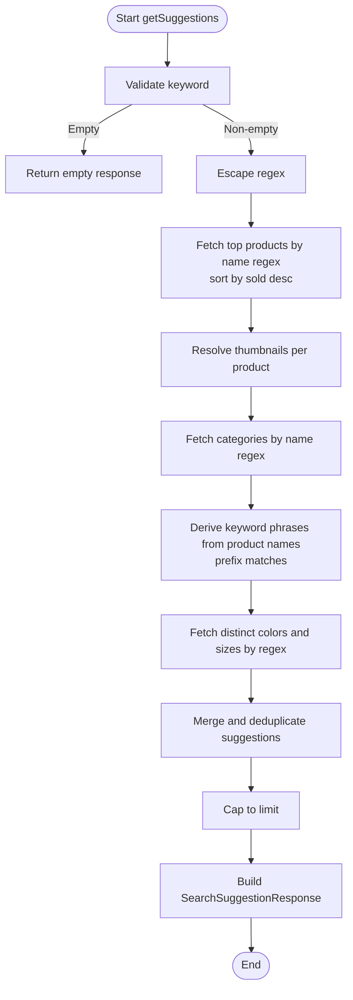
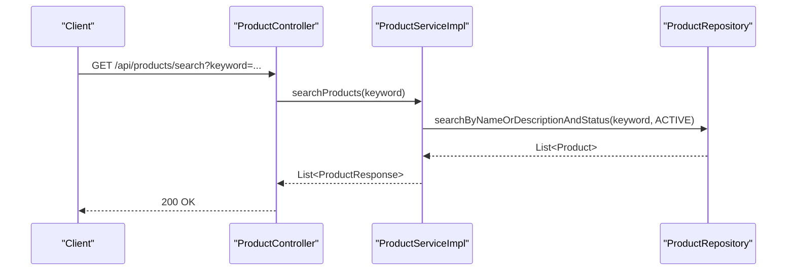
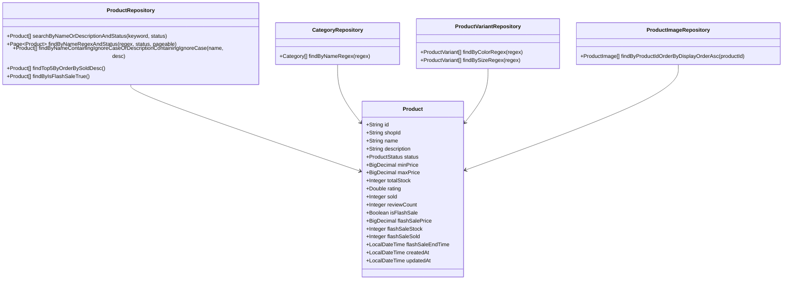
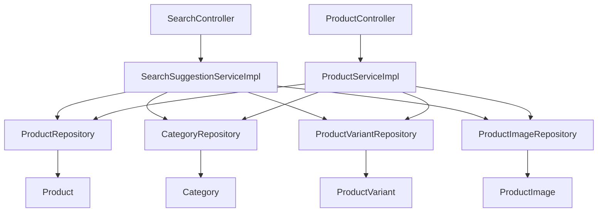

# Product Search & Filtering

<cite>
**Referenced Files in This Document**
- [SearchController.java](file://src/Backend/src/main/java/com/shoppeclone/backend/search/controller/SearchController.java)
- [SearchSuggestionService.java](file://src/Backend/src/main/java/com/shoppeclone/backend/search/service/SearchSuggestionService.java)
- [SearchSuggestionServiceImpl.java](file://src/Backend/src/main/java/com/shoppeclone/backend/search/service/impl/SearchSuggestionServiceImpl.java)
- [SearchSuggestionItem.java](file://src/Backend/src/main/java/com/shoppeclone/backend/search/dto/SearchSuggestionItem.java)
- [SearchSuggestionResponse.java](file://src/Backend/src/main/java/com/shoppeclone/backend/search/dto/SearchSuggestionResponse.java)
- [ProductController.java](file://src/Backend/src/main/java/com/shoppeclone/backend/product/controller/ProductController.java)
- [ProductService.java](file://src/Backend/src/main/java/com/shoppeclone/backend/product/service/ProductService.java)
- [ProductServiceImpl.java](file://src/Backend/src/main/java/com/shoppeclone/backend/product/service/impl/ProductServiceImpl.java)
- [ProductRepository.java](file://src/Backend/src/main/java/com/shoppeclone/backend/product/repository/ProductRepository.java)
- [CategoryRepository.java](file://src/Backend/src/main/java/com/shoppeclone/backend/product/repository/CategoryRepository.java)
- [ProductVariantRepository.java](file://src/Backend/src/main/java/com/shoppeclone/backend/product/repository/ProductVariantRepository.java)
- [ProductImageRepository.java](file://src/Backend/src/main/java/com/shoppeclone/backend/product/repository/ProductImageRepository.java)
- [Product.java](file://src/Backend/src/main/java/com/shoppeclone/backend/product/entity/Product.java)
- [products.json](file://data_dumps/products.json)
- [categories.json](file://data_dumps/categories.json)
</cite>

## Table of Contents
1. [Introduction](#introduction)
2. [Project Structure](#project-structure)
3. [Core Components](#core-components)
4. [Architecture Overview](#architecture-overview)
5. [Detailed Component Analysis](#detailed-component-analysis)
6. [Dependency Analysis](#dependency-analysis)
7. [Performance Considerations](#performance-considerations)
8. [Troubleshooting Guide](#troubleshooting-guide)
9. [Conclusion](#conclusion)
10. [Appendices](#appendices)

## Introduction
This document explains the product search and filtering capabilities implemented in the backend. It covers:
- Search algorithms and full-text search implementation
- Relevance ranking mechanisms
- Filter options (price ranges, categories, brands, ratings, availability)
- Search suggestions, auto-complete, and query refinement
- Search result formatting, pagination, and sorting
- Faceted search, dynamic filtering, and analytics
- Performance optimization, caching strategies, and index management
- Integration with the product catalog, inventory status, and real-time updates
- Search API endpoints, query parameters, and response formats

## Project Structure
The search and filtering features span the product domain and a dedicated search module:
- Product domain: controllers, services, repositories, and entities
- Search module: suggestion endpoints and services

**Diagram sources**
- [SearchController.java:1-38](file://src/Backend/src/main/java/com/shoppeclone/backend/search/controller/SearchController.java#L1-38)
- [SearchSuggestionServiceImpl.java:1-182](file://src/Backend/src/main/java/com/shoppeclone/backend/search/service/impl/SearchSuggestionServiceImpl.java#L1-182)
- [ProductController.java:1-163](file://src/Backend/src/main/java/com/shoppeclone/backend/product/controller/ProductController.java#L1-163)
- [ProductServiceImpl.java:1-657](file://src/Backend/src/main/java/com/shoppeclone/backend/product/service/impl/ProductServiceImpl.java#L1-657)
- [ProductRepository.java:1-41](file://src/Backend/src/main/java/com/shoppeclone/backend/product/repository/ProductRepository.java#L1-41)
- [CategoryRepository.java:1-21](file://src/Backend/src/main/java/com/shoppeclone/backend/product/repository/CategoryRepository.java#L1-21)
- [ProductVariantRepository.java:1-23](file://src/Backend/src/main/java/com/shoppeclone/backend/product/repository/ProductVariantRepository.java#L1-23)
- [ProductImageRepository.java:1-12](file://src/Backend/src/main/java/com/shoppeclone/backend/product/repository/ProductImageRepository.java#L1-12)
- [Product.java:1-51](file://src/Backend/src/main/java/com/shoppeclone/backend/product/entity/Product.java#L1-51)

**Section sources**
- [SearchController.java:1-38](file://src/Backend/src/main/java/com/shoppeclone/backend/search/controller/SearchController.java#L1-38)
- [ProductController.java:1-163](file://src/Backend/src/main/java/com/shoppeclone/backend/product/controller/ProductController.java#L1-163)

## Core Components
- Search suggestions endpoint: returns mixed suggestions (products, categories, keywords, attributes) with limits and safety checks.
- Product search endpoint: performs full-text search across product name and description for active products.
- Product domain services and repositories: implement search, filtering, and aggregation.

Key responsibilities:
- SearchController: exposes GET /api/search/suggestions with keyword and limit parameters.
- ProductController: exposes GET /api/products/search with keyword parameter.
- SearchSuggestionServiceImpl: orchestrates suggestions from products, categories, variants, and derived keywords.
- ProductServiceImpl: executes full-text search and returns formatted product results.
- Repositories: define MongoDB queries for regex-based search, counts, and paginated suggestions.

**Section sources**
- [SearchController.java:17-36](file://src/Backend/src/main/java/com/shoppeclone/backend/search/controller/SearchController.java#L17-L36)
- [ProductController.java:48-51](file://src/Backend/src/main/java/com/shoppeclone/backend/product/controller/ProductController.java#L48-L51)
- [SearchSuggestionServiceImpl.java:36-172](file://src/Backend/src/main/java/com/shoppeclone/backend/search/service/impl/SearchSuggestionServiceImpl.java#L36-L172)
- [ProductServiceImpl.java:168-182](file://src/Backend/src/main/java/com/shoppeclone/backend/product/service/impl/ProductServiceImpl.java#L168-L182)
- [ProductRepository.java:20-39](file://src/Backend/src/main/java/com/shoppeclone/backend/product/repository/ProductRepository.java#L20-L39)

## Architecture Overview
The system separates concerns between search suggestions and product search:
- Suggestions: multi-source, prioritized mix with regex-based matching and capped totals.
- Product search: full-text search across name and description for active products.

**Diagram sources**
- [SearchController.java:29-36](file://src/Backend/src/main/java/com/shoppeclone/backend/search/controller/SearchController.java#L29-L36)
- [SearchSuggestionServiceImpl.java:36-172](file://src/Backend/src/main/java/com/shoppeclone/backend/search/service/impl/SearchSuggestionServiceImpl.java#L36-L172)
- [ProductRepository.java:34-39](file://src/Backend/src/main/java/com/shoppeclone/backend/product/repository/ProductRepository.java#L34-L39)
- [CategoryRepository.java:17-19](file://src/Backend/src/main/java/com/shoppeclone/backend/product/repository/CategoryRepository.java#L17-L19)
- [ProductVariantRepository.java:13-21](file://src/Backend/src/main/java/com/shoppeclone/backend/product/repository/ProductVariantRepository.java#L13-L21)
- [ProductImageRepository.java:7-8](file://src/Backend/src/main/java/com/shoppeclone/backend/product/repository/ProductImageRepository.java#L7-L8)

## Detailed Component Analysis

### Search Suggestions Engine
The suggestions engine builds a prioritized list combining:
- Products: top matches by name, sorted by sales volume, with thumbnails and pricing.
- Categories: case-insensitive name matches.
- Keywords: derived phrases from product names, including token-based prefixes.
- Attributes: colors and sizes from variants.

Implementation highlights:
- Regex escaping to prevent injection and treat user input as literal substring/prefix.
- Limits per suggestion type with rounding to ensure variety.
- Deduplication of keywords against product suggestions.
- Pagination for product suggestions to cap database load.

**Diagram sources**
- [SearchSuggestionServiceImpl.java:36-172](file://src/Backend/src/main/java/com/shoppeclone/backend/search/service/impl/SearchSuggestionServiceImpl.java#L36-L172)
- [ProductRepository.java:34-39](file://src/Backend/src/main/java/com/shoppeclone/backend/product/repository/ProductRepository.java#L34-L39)
- [CategoryRepository.java:17-19](file://src/Backend/src/main/java/com/shoppeclone/backend/product/repository/CategoryRepository.java#L17-L19)
- [ProductVariantRepository.java:13-21](file://src/Backend/src/main/java/com/shoppeclone/backend/product/repository/ProductVariantRepository.java#L13-L21)
- [ProductImageRepository.java:7-8](file://src/Backend/src/main/java/com/shoppeclone/backend/product/repository/ProductImageRepository.java#L7-L8)

**Section sources**
- [SearchSuggestionServiceImpl.java:36-172](file://src/Backend/src/main/java/com/shoppeclone/backend/search/service/impl/SearchSuggestionServiceImpl.java#L36-L172)
- [SearchSuggestionItem.java:16-42](file://src/Backend/src/main/java/com/shoppeclone/backend/search/dto/SearchSuggestionItem.java#L16-L42)
- [SearchSuggestionResponse.java:14-21](file://src/Backend/src/main/java/com/shoppeclone/backend/search/dto/SearchSuggestionResponse.java#L14-L21)

### Product Search Endpoint
The product search endpoint supports full-text search across product name and description for active products. It trims whitespace and returns an empty list for empty keywords.

**Diagram sources**
- [ProductController.java:48-51](file://src/Backend/src/main/java/com/shoppeclone/backend/product/controller/ProductController.java#L48-L51)
- [ProductServiceImpl.java:168-182](file://src/Backend/src/main/java/com/shoppeclone/backend/product/service/impl/ProductServiceImpl.java#L168-L182)
- [ProductRepository.java:20-21](file://src/Backend/src/main/java/com/shoppeclone/backend/product/repository/ProductRepository.java#L20-L21)

**Section sources**
- [ProductController.java:48-51](file://src/Backend/src/main/java/com/shoppeclone/backend/product/controller/ProductController.java#L48-L51)
- [ProductServiceImpl.java:168-182](file://src/Backend/src/main/java/com/shoppeclone/backend/product/service/impl/ProductServiceImpl.java#L168-L182)
- [ProductRepository.java:20-21](file://src/Backend/src/main/java/com/shoppeclone/backend/product/repository/ProductRepository.java#L20-L21)

### Data Models and Repositories
The product domain defines entities and repositories supporting search and filtering.

**Diagram sources**
- [Product.java:10-50](file://src/Backend/src/main/java/com/shoppeclone/backend/product/entity/Product.java#L10-L50)
- [ProductRepository.java:11-40](file://src/Backend/src/main/java/com/shoppeclone/backend/product/repository/ProductRepository.java#L11-L40)
- [CategoryRepository.java:8-19](file://src/Backend/src/main/java/com/shoppeclone/backend/product/repository/CategoryRepository.java#L8-L19)
- [ProductVariantRepository.java:8-21](file://src/Backend/src/main/java/com/shoppeclone/backend/product/repository/ProductVariantRepository.java#L8-L21)
- [ProductImageRepository.java:7-11](file://src/Backend/src/main/java/com/shoppeclone/backend/product/repository/ProductImageRepository.java#L7-L11)

**Section sources**
- [Product.java:10-50](file://src/Backend/src/main/java/com/shoppeclone/backend/product/entity/Product.java#L10-L50)
- [ProductRepository.java:11-40](file://src/Backend/src/main/java/com/shoppeclone/backend/product/repository/ProductRepository.java#L11-L40)
- [CategoryRepository.java:8-19](file://src/Backend/src/main/java/com/shoppeclone/backend/product/repository/CategoryRepository.java#L8-L19)
- [ProductVariantRepository.java:8-21](file://src/Backend/src/main/java/com/shoppeclone/backend/product/repository/ProductVariantRepository.java#L8-L21)
- [ProductImageRepository.java:7-11](file://src/Backend/src/main/java/com/shoppeclone/backend/product/repository/ProductImageRepository.java#L7-L11)

### Search API Endpoints and Query Parameters
- GET /api/search/suggestions
  - keyword: required. User input for suggestions.
  - limit: optional integer. Default 10, minimum 1, maximum 20.
  - Response: SearchSuggestionResponse containing keyword and ordered suggestions.

- GET /api/products/search
  - keyword: required. Full-text search term across product name and description.
  - Response: List of ProductResponse for active products matching the criteria.

Notes:
- Empty keyword returns an empty list for product search.
- Suggestions are mixed and prioritized by type and relevance heuristics.

**Section sources**
- [SearchController.java:17-36](file://src/Backend/src/main/java/com/shoppeclone/backend/search/controller/SearchController.java#L17-L36)
- [ProductController.java:48-51](file://src/Backend/src/main/java/com/shoppeclone/backend/product/controller/ProductController.java#L48-L51)
- [SearchSuggestionResponse.java:14-21](file://src/Backend/src/main/java/com/shoppeclone/backend/search/dto/SearchSuggestionResponse.java#L14-L21)

### Search Result Formatting, Pagination, and Sorting
- Product search results:
  - Formatted via ProductResponse mapping aggregated fields (min/max price, total stock, sold, rating, flash sale fields).
  - Sorting supported for product listings (sold descending) in getAllProducts.
  - Pagination used internally for suggestion queries to bound resource usage.

- Suggestions:
  - Ordered list: products first, then categories, keywords, attributes.
  - Capped by total limit with per-type allocations.

**Section sources**
- [ProductServiceImpl.java:154-166](file://src/Backend/src/main/java/com/shoppeclone/backend/product/service/impl/ProductServiceImpl.java#L154-L166)
- [ProductServiceImpl.java:513-573](file://src/Backend/src/main/java/com/shoppeclone/backend/product/service/impl/ProductServiceImpl.java#L513-L573)
- [SearchSuggestionServiceImpl.java:52-58](file://src/Backend/src/main/java/com/shoppeclone/backend/search/service/impl/SearchSuggestionServiceImpl.java#L52-L58)
- [SearchSuggestionServiceImpl.java:163-171](file://src/Backend/src/main/java/com/shoppeclone/backend/search/service/impl/SearchSuggestionServiceImpl.java#L163-L171)

### Filter Options and Dynamic Filtering
Available filters based on current implementation:
- Active status: search and listing restrict to ACTIVE products.
- Category: filter by category ID via getProductsByCategory.
- Flash sale: filter via isFlashSale flag and dedicated endpoint.
- Inventory: total stock and variant stock tracked; sold counts integrated for flash sale items.

Planned enhancements (not implemented yet):
- Price range filters: minPrice/maxPrice fields exist on Product; add repository/query support and API parameters.
- Brand filters: no brand field observed; introduce and index if needed.
- Rating filters: rating field exists; add repository/query and API parameters.
- Availability filters: totalStock and variant stock present; add API parameters and repository queries.

**Section sources**
- [ProductRepository.java:14-18](file://src/Backend/src/main/java/com/shoppeclone/backend/product/repository/ProductRepository.java#L14-L18)
- [ProductController.java:58-61](file://src/Backend/src/main/java/com/shoppeclone/backend/product/controller/ProductController.java#L58-L61)
- [ProductServiceImpl.java:502-511](file://src/Backend/src/main/java/com/shoppeclone/backend/product/service/impl/ProductServiceImpl.java#L502-L511)
- [Product.java:33-46](file://src/Backend/src/main/java/com/shoppeclone/backend/product/entity/Product.java#L33-L46)

### Faceted Search Implementation
Faceted search is not currently implemented. To add facets:
- Define facet fields: category, price range buckets, brand, rating ranges, availability.
- Build aggregations in repositories or service layer to compute facet counts.
- Expose facet endpoints and integrate with frontend filters.

[No sources needed since this section proposes future work not present in the codebase]

### Search Analytics
There is no explicit analytics endpoint or event logging in the search module. Consider adding:
- Metrics: suggestion hit rates, most popular suggestions, search term frequency.
- Events: track search queries, clicked suggestions, conversion from suggestions.

[No sources needed since this section proposes future work not present in the codebase]

### Integration with Catalog, Inventory, and Real-Time Updates
- Product catalog: Product, ProductVariant, ProductImage, ProductCategory entities and repositories.
- Inventory status: totalStock on Product and stock on ProductVariant; sold counts integrated for flash sale items.
- Real-time updates: flash sale sold counts computed from FlashSaleItem records; variant stock updates propagate to product total stock.

**Section sources**
- [ProductServiceImpl.java:533-550](file://src/Backend/src/main/java/com/shoppeclone/backend/product/service/impl/ProductServiceImpl.java#L533-L550)
- [ProductServiceImpl.java:591-608](file://src/Backend/src/main/java/com/shoppeclone/backend/product/service/impl/ProductServiceImpl.java#L591-L608)
- [ProductServiceImpl.java:447-459](file://src/Backend/src/main/java/com/shoppeclone/backend/product/service/impl/ProductServiceImpl.java#L447-L459)

## Dependency Analysis
The search and product domains depend on Spring Data MongoDB repositories and share entities.

**Diagram sources**
- [SearchController.java:13-15](file://src/Backend/src/main/java/com/shoppeclone/backend/search/controller/SearchController.java#L13-L15)
- [SearchSuggestionServiceImpl.java:31-34](file://src/Backend/src/main/java/com/shoppeclone/backend/search/service/impl/SearchSuggestionServiceImpl.java#L31-L34)
- [ProductController.java:24-24](file://src/Backend/src/main/java/com/shoppeclone/backend/product/controller/ProductController.java#L24-L24)
- [ProductServiceImpl.java:38-44](file://src/Backend/src/main/java/com/shoppeclone/backend/product/service/impl/ProductServiceImpl.java#L38-L44)

**Section sources**
- [SearchSuggestionServiceImpl.java:31-34](file://src/Backend/src/main/java/com/shoppeclone/backend/search/service/impl/SearchSuggestionServiceImpl.java#L31-L34)
- [ProductServiceImpl.java:38-44](file://src/Backend/src/main/java/com/shoppeclone/backend/product/service/impl/ProductServiceImpl.java#L38-L44)

## Performance Considerations
Observed optimizations:
- Regex escaping to avoid injection and control pattern behavior.
- Limiting suggestion counts per type and capping total suggestions.
- Using Pageable for product suggestions to bound memory and CPU.
- Sorting by sales volume for product suggestions to improve relevance.

Recommendations:
- Indexes: ensure regex queries benefit from appropriate indexes on name, description, category name, and variant color/size.
- Caching: cache frequent suggestions and product search results with TTL; invalidate on product updates.
- Pagination: keep suggestion pagination; consider cursor-based pagination for large datasets.
- Query normalization: normalize keywords (lowercase, trim) consistently; consider stemming or N-gram indexing for advanced relevance.

[No sources needed since this section provides general guidance]

## Troubleshooting Guide
Common issues and resolutions:
- Empty suggestions: ensure keyword is non-empty; verify regex escaping prevents empty patterns.
- Missing thumbnails: confirm ProductImage entries exist and ordering is correct.
- Slow suggestions: reduce limit or adjust per-type allocations; add indexes; consider caching.
- Incorrect relevance: adjust sorting (e.g., sold desc) and suggestion weights; consider boosting exact matches.

**Section sources**
- [SearchSuggestionServiceImpl.java:36-43](file://src/Backend/src/main/java/com/shoppeclone/backend/search/service/impl/SearchSuggestionServiceImpl.java#L36-L43)
- [ProductImageRepository.java:7-8](file://src/Backend/src/main/java/com/shoppeclone/backend/product/repository/ProductImageRepository.java#L7-L8)

## Conclusion
The system provides a solid foundation for search and suggestions:
- Suggestions combine products, categories, keywords, and attributes with safety and limits.
- Product search supports full-text matching across name and description for active products.
- Entities and repositories enable filtering by category and flash sale status, with inventory and real-time sold counts.
Future enhancements should focus on facets, price/rating filters, analytics, and performance optimizations.

[No sources needed since this section summarizes without analyzing specific files]

## Appendices

### API Definitions and Examples
- GET /api/search/suggestions
  - Parameters: keyword (required), limit (optional, default 10, min 1, max 20)
  - Response: SearchSuggestionResponse with keyword and suggestions list

- GET /api/products/search
  - Parameters: keyword (required)
  - Response: List of ProductResponse

Example request and response shapes are defined by the DTOs and controllers.

**Section sources**
- [SearchController.java:17-36](file://src/Backend/src/main/java/com/shoppeclone/backend/search/controller/SearchController.java#L17-L36)
- [ProductController.java:48-51](file://src/Backend/src/main/java/com/shoppeclone/backend/product/controller/ProductController.java#L48-L51)
- [SearchSuggestionResponse.java:14-21](file://src/Backend/src/main/java/com/shoppeclone/backend/search/dto/SearchSuggestionResponse.java#L14-L21)

### Sample Data References
- Product catalog and variants: [products.json:1-200](file://data_dumps/products.json#L1-L200)
- Categories: [categories.json:1-2](file://data_dumps/categories.json#L1-L2)

**Section sources**
- [products.json:1-200](file://data_dumps/products.json#L1-L200)
- [categories.json:1-2](file://data_dumps/categories.json#L1-L2)