# Product Variants Management

<cite>
**Referenced Files in This Document**
- [ProductVariant.java](file://src/Backend/src/main/java/com/shoppeclone/backend/product/entity/ProductVariant.java)
- [Product.java](file://src/Backend/src/main/java/com/shoppeclone/backend/product/entity/Product.java)
- [ProductStatus.java](file://src/Backend/src/main/java/com/shoppeclone/backend/product/entity/ProductStatus.java)
- [CreateProductVariantRequest.java](file://src/Backend/src/main/java/com/shoppeclone/backend/product/dto/request/CreateProductVariantRequest.java)
- [ProductVariantResponse.java](file://src/Backend/src/main/java/com/shoppeclone/backend/product/dto/response/ProductVariantResponse.java)
- [ProductController.java](file://src/Backend/src/main/java/com/shoppeclone/backend/product/controller/ProductController.java)
- [ProductService.java](file://src/Backend/src/main/java/com/shoppeclone/backend/product/service/ProductService.java)
- [ProductServiceImpl.java](file://src/Backend/src/main/java/com/shoppeclone/backend/product/service/impl/ProductServiceImpl.java)
- [ProductVariantRepository.java](file://src/Backend/src/main/java/com/shoppeclone/backend/product/repository/ProductVariantRepository.java)
- [CartItem.java](file://src/Backend/src/main/java/com/shoppeclone/backend/cart/entity/CartItem.java)
- [OrderItem.java](file://src/Backend/src/main/java/com/shoppeclone/backend/order/entity/OrderItem.java)
</cite>

## Table of Contents
1. [Introduction](#introduction)
2. [Project Structure](#project-structure)
3. [Core Components](#core-components)
4. [Architecture Overview](#architecture-overview)
5. [Detailed Component Analysis](#detailed-component-analysis)
6. [Dependency Analysis](#dependency-analysis)
7. [Performance Considerations](#performance-considerations)
8. [Troubleshooting Guide](#troubleshooting-guide)
9. [Conclusion](#conclusion)
10. [Appendices](#appendices)

## Introduction
This document explains the product variants management system, focusing on how variants are created, modified, and deleted. It covers color and size options, pricing strategies, stock management, and inventory tracking. It also documents the CreateProductVariantRequest schema, variant-specific pricing, SKU generation considerations, availability status, base product–variant relationships, visibility controls, search indexing, and integrations with the shopping cart and order processing systems.

## Project Structure
The variants feature spans entities, DTOs, repositories, controllers, and services under the product module. The system persists variants in MongoDB and exposes REST endpoints for variant lifecycle operations.

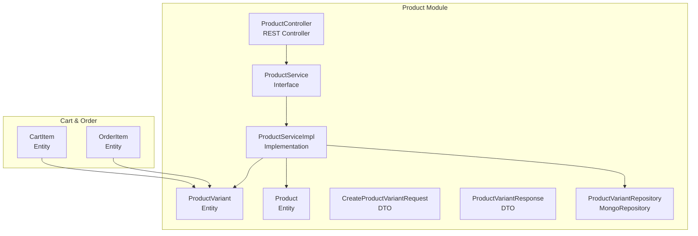

**Diagram sources**
- [Product.java:10-50](file://src/Backend/src/main/java/com/shoppeclone/backend/product/entity/Product.java#L10-L50)
- [ProductVariant.java:10-36](file://src/Backend/src/main/java/com/shoppeclone/backend/product/entity/ProductVariant.java#L10-L36)
- [CreateProductVariantRequest.java:9-25](file://src/Backend/src/main/java/com/shoppeclone/backend/product/dto/request/CreateProductVariantRequest.java#L9-L25)
- [ProductVariantResponse.java:8-25](file://src/Backend/src/main/java/com/shoppeclone/backend/product/dto/response/ProductVariantResponse.java#L8-L25)
- [ProductVariantRepository.java:8-22](file://src/Backend/src/main/java/com/shoppeclone/backend/product/repository/ProductVariantRepository.java#L8-L22)
- [ProductService.java:10-53](file://src/Backend/src/main/java/com/shoppeclone/backend/product/service/ProductService.java#L10-L53)
- [ProductServiceImpl.java:36-656](file://src/Backend/src/main/java/com/shoppeclone/backend/product/service/impl/ProductServiceImpl.java#L36-L656)
- [ProductController.java:22-162](file://src/Backend/src/main/java/com/shoppeclone/backend/product/controller/ProductController.java#L22-L162)
- [CartItem.java:7-11](file://src/Backend/src/main/java/com/shoppeclone/backend/cart/entity/CartItem.java#L7-L11)
- [OrderItem.java:7-17](file://src/Backend/src/main/java/com/shoppeclone/backend/order/entity/OrderItem.java#L7-L17)

**Section sources**
- [ProductController.java:22-162](file://src/Backend/src/main/java/com/shoppeclone/backend/product/controller/ProductController.java#L22-L162)
- [ProductService.java:10-53](file://src/Backend/src/main/java/com/shoppeclone/backend/product/service/ProductService.java#L10-L53)
- [ProductServiceImpl.java:36-656](file://src/Backend/src/main/java/com/shoppeclone/backend/product/service/impl/ProductServiceImpl.java#L36-L656)
- [ProductVariantRepository.java:8-22](file://src/Backend/src/main/java/com/shoppeclone/backend/product/repository/ProductVariantRepository.java#L8-L22)
- [Product.java:10-50](file://src/Backend/src/main/java/com/shoppeclone/backend/product/entity/Product.java#L10-L50)
- [ProductVariant.java:10-36](file://src/Backend/src/main/java/com/shoppeclone/backend/product/entity/ProductVariant.java#L10-L36)
- [ProductVariantResponse.java:8-25](file://src/Backend/src/main/java/com/shoppeclone/backend/product/dto/response/ProductVariantResponse.java#L8-L25)
- [CreateProductVariantRequest.java:9-25](file://src/Backend/src/main/java/com/shoppeclone/backend/product/dto/request/CreateProductVariantRequest.java#L9-L25)
- [CartItem.java:7-11](file://src/Backend/src/main/java/com/shoppeclone/backend/cart/entity/CartItem.java#L7-L11)
- [OrderItem.java:7-17](file://src/Backend/src/main/java/com/shoppeclone/backend/order/entity/OrderItem.java#L7-L17)

## Core Components
- Product entity: Holds product-level metadata, aggregated pricing (min/max), total stock, ratings, and flash sale fields.
- ProductVariant entity: Represents a specific combination of attributes (size, color) with price, stock, optional variant image, and flash sale fields.
- ProductVariantRepository: Provides queries for variants by product, and autocomplete-style suggestions for size and color.
- CreateProductVariantRequest: DTO for creating/updating variants with validation constraints.
- ProductVariantResponse: DTO for returning variant data to clients.
- ProductController: Exposes endpoints for adding/removing variants, retrieving a variant, and updating variant stock.
- ProductService and ProductServiceImpl: Implement business logic for variant creation, updates, deletions, and stock synchronization.

Key capabilities:
- Variant creation with size/color/price/stock/image.
- Update preserving existing variant identity for order continuity.
- Bulk stock updates and product-level total stock recalculation.
- Flash sale support at both product and variant level.

**Section sources**
- [Product.java:12-50](file://src/Backend/src/main/java/com/shoppeclone/backend/product/entity/Product.java#L12-L50)
- [ProductVariant.java:12-36](file://src/Backend/src/main/java/com/shoppeclone/backend/product/entity/ProductVariant.java#L12-L36)
- [ProductVariantRepository.java:8-22](file://src/Backend/src/main/java/com/shoppeclone/backend/product/repository/ProductVariantRepository.java#L8-L22)
- [CreateProductVariantRequest.java:9-25](file://src/Backend/src/main/java/com/shoppeclone/backend/product/dto/request/CreateProductVariantRequest.java#L9-L25)
- [ProductVariantResponse.java:8-25](file://src/Backend/src/main/java/com/shoppeclone/backend/product/dto/response/ProductVariantResponse.java#L8-L25)
- [ProductController.java:100-128](file://src/Backend/src/main/java/com/shoppeclone/backend/product/controller/ProductController.java#L100-L128)
- [ProductService.java:31-38](file://src/Backend/src/main/java/com/shoppeclone/backend/product/service/ProductService.java#L31-L38)
- [ProductServiceImpl.java:363-459](file://src/Backend/src/main/java/com/shoppeclone/backend/product/service/impl/ProductServiceImpl.java#L363-L459)

## Architecture Overview
The variant management subsystem follows a layered architecture:
- REST controller handles HTTP requests and delegates to the service layer.
- Service orchestrates repository operations, enforces business rules, and maintains consistency.
- Repositories persist and query data from MongoDB.
- Entities define the domain model for products and variants.

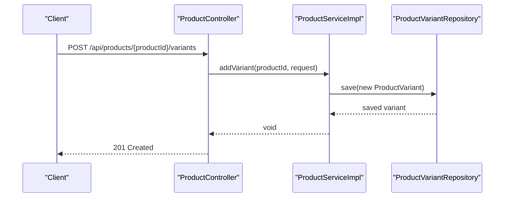

**Diagram sources**
- [ProductController.java:100-109](file://src/Backend/src/main/java/com/shoppeclone/backend/product/controller/ProductController.java#L100-L109)
- [ProductServiceImpl.java:363-380](file://src/Backend/src/main/java/com/shoppeclone/backend/product/service/impl/ProductServiceImpl.java#L363-L380)
- [ProductVariantRepository.java:8-11](file://src/Backend/src/main/java/com/shoppeclone/backend/product/repository/ProductVariantRepository.java#L8-L11)

**Section sources**
- [ProductController.java:22-162](file://src/Backend/src/main/java/com/shoppeclone/backend/product/controller/ProductController.java#L22-L162)
- [ProductServiceImpl.java:36-656](file://src/Backend/src/main/java/com/shoppeclone/backend/product/service/impl/ProductServiceImpl.java#L36-L656)

## Detailed Component Analysis

### Variant Entity and Attributes
- Identifier: variant ID and parent product ID.
- Attributes: size, color, price, stock, optional variant image URL.
- Timestamps: created/updated.
- Flash sale fields: flag, price, stock, sold, end time.
- Indexing: productId indexed for efficient lookups.

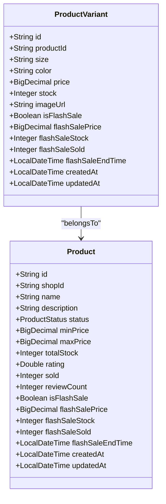

**Diagram sources**
- [Product.java:12-50](file://src/Backend/src/main/java/com/shoppeclone/backend/product/entity/Product.java#L12-L50)
- [ProductVariant.java:12-36](file://src/Backend/src/main/java/com/shoppeclone/backend/product/entity/ProductVariant.java#L12-L36)

**Section sources**
- [ProductVariant.java:12-36](file://src/Backend/src/main/java/com/shoppeclone/backend/product/entity/ProductVariant.java#L12-L36)
- [Product.java:12-50](file://src/Backend/src/main/java/com/shoppeclone/backend/product/entity/Product.java#L12-L50)

### CreateProductVariantRequest Schema
Fields and constraints:
- productId: Provided via URL path; not required in request body.
- id: Optional; allows preserving existing variant identity during updates.
- size: String; variant attribute.
- color: String; variant attribute.
- price: Required (not null); variant-specific pricing.
- stock: Required (not null); initial stock allocation.
- imageUrl: Optional; variant-specific image.

Validation rules:
- Non-null enforcement for price and stock.
- Business uniqueness enforced at the service layer using color+size combination.

**Section sources**
- [CreateProductVariantRequest.java:9-25](file://src/Backend/src/main/java/com/shoppeclone/backend/product/dto/request/CreateProductVariantRequest.java#L9-L25)
- [ProductServiceImpl.java:414-424](file://src/Backend/src/main/java/com/shoppeclone/backend/product/service/impl/ProductServiceImpl.java#L414-L424)

### Variant Creation Workflow
- Endpoint: POST /api/products/{productId}/variants.
- Steps:
  - Controller binds productId from path and request body.
  - Service validates product existence.
  - New ProductVariant is populated from request and persisted.
  - Returns 201 Created with a success message.

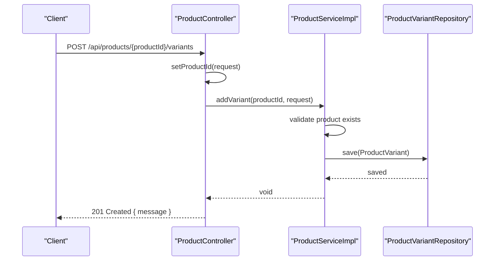

**Diagram sources**
- [ProductController.java:100-109](file://src/Backend/src/main/java/com/shoppeclone/backend/product/controller/ProductController.java#L100-L109)
- [ProductServiceImpl.java:363-380](file://src/Backend/src/main/java/com/shoppeclone/backend/product/service/impl/ProductServiceImpl.java#L363-L380)
- [ProductVariantRepository.java:8-11](file://src/Backend/src/main/java/com/shoppeclone/backend/product/repository/ProductVariantRepository.java#L8-L11)

**Section sources**
- [ProductController.java:100-109](file://src/Backend/src/main/java/com/shoppeclone/backend/product/controller/ProductController.java#L100-L109)
- [ProductServiceImpl.java:363-380](file://src/Backend/src/main/java/com/shoppeclone/backend/product/service/impl/ProductServiceImpl.java#L363-L380)

### Variant Modification Workflow
- Endpoint: PUT/PATCH for product variants (service supports preserving variant ID).
- Business key uniqueness: color+size must be unique per product.
- Update strategy:
  - If request includes variant id, prefer matching by ID.
  - Otherwise match by color+size business key.
  - If no match, create a new variant.
  - After applying changes, clean up orphaned variants and recalculate product min/max price and total stock.

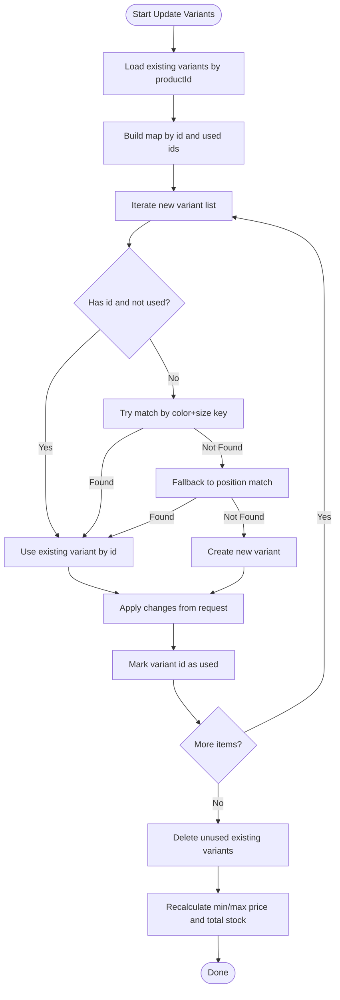

**Diagram sources**
- [ProductServiceImpl.java:256-345](file://src/Backend/src/main/java/com/shoppeclone/backend/product/service/impl/ProductServiceImpl.java#L256-L345)
- [ProductVariantRepository.java:8-11](file://src/Backend/src/main/java/com/shoppeclone/backend/product/repository/ProductVariantRepository.java#L8-L11)

**Section sources**
- [ProductServiceImpl.java:256-345](file://src/Backend/src/main/java/com/shoppeclone/backend/product/service/impl/ProductServiceImpl.java#L256-L345)
- [ProductServiceImpl.java:414-424](file://src/Backend/src/main/java/com/shoppeclone/backend/product/service/impl/ProductServiceImpl.java#L414-L424)

### Variant Deletion Workflow
- Endpoint: DELETE /api/products/variants/{variantId}.
- Behavior: Validates variant existence and deletes it.

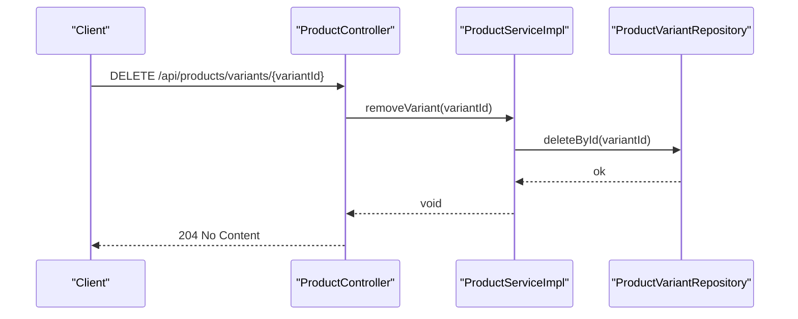

**Diagram sources**
- [ProductController.java:111-115](file://src/Backend/src/main/java/com/shoppeclone/backend/product/controller/ProductController.java#L111-L115)
- [ProductServiceImpl.java:382-388](file://src/Backend/src/main/java/com/shoppeclone/backend/product/service/impl/ProductServiceImpl.java#L382-L388)
- [ProductVariantRepository.java:8-11](file://src/Backend/src/main/java/com/shoppeclone/backend/product/repository/ProductVariantRepository.java#L8-L11)

**Section sources**
- [ProductController.java:111-115](file://src/Backend/src/main/java/com/shoppeclone/backend/product/controller/ProductController.java#L111-L115)
- [ProductServiceImpl.java:382-388](file://src/Backend/src/main/java/com/shoppeclone/backend/product/service/impl/ProductServiceImpl.java#L382-L388)

### Pricing Strategies and Flash Sale
- Variant-level pricing: Each variant has its own price and optional flash sale fields.
- Product-level aggregation: minPrice, maxPrice, and totalStock are computed from variants.
- Flash sale: Both product and variant support flash sale flags, prices, stocks, and sold counts. Real-time sold counts are derived from flash sale items.

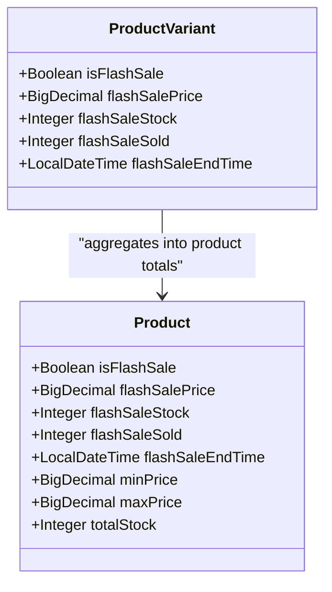

**Diagram sources**
- [Product.java:41-46](file://src/Backend/src/main/java/com/shoppeclone/backend/product/entity/Product.java#L41-L46)
- [ProductVariant.java:30-35](file://src/Backend/src/main/java/com/shoppeclone/backend/product/entity/ProductVariant.java#L30-L35)
- [ProductServiceImpl.java:513-572](file://src/Backend/src/main/java/com/shoppeclone/backend/product/service/impl/ProductServiceImpl.java#L513-L572)
- [ProductServiceImpl.java:575-612](file://src/Backend/src/main/java/com/shoppeclone/backend/product/service/impl/ProductServiceImpl.java#L575-L612)

**Section sources**
- [Product.java:41-46](file://src/Backend/src/main/java/com/shoppeclone/backend/product/entity/Product.java#L41-L46)
- [ProductVariant.java:30-35](file://src/Backend/src/main/java/com/shoppeclone/backend/product/entity/ProductVariant.java#L30-L35)
- [ProductServiceImpl.java:513-572](file://src/Backend/src/main/java/com/shoppeclone/backend/product/service/impl/ProductServiceImpl.java#L513-L572)
- [ProductServiceImpl.java:575-612](file://src/Backend/src/main/java/com/shoppeclone/backend/product/service/impl/ProductServiceImpl.java#L575-L612)

### Stock Management and Inventory Tracking
- Individual variant stock: Updated via PATCH /api/products/variant/{variantId}/stock.
- Product-level total stock: Automatically recalculated after variant stock updates.
- Bulk stock updates: Supported by updating multiple variants; total stock recomputed.

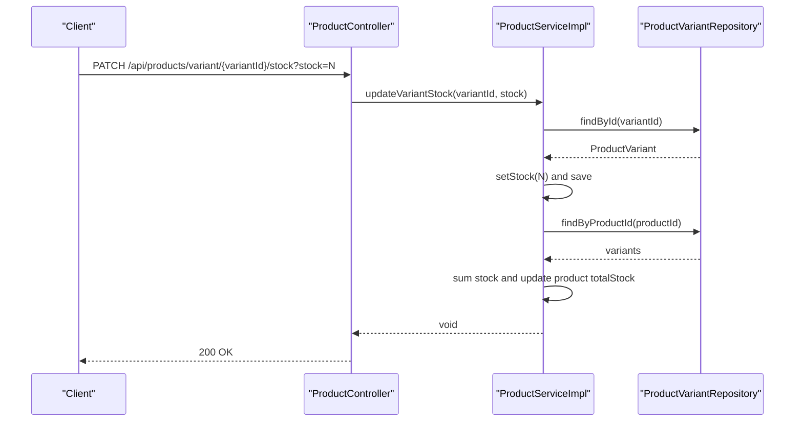

**Diagram sources**
- [ProductController.java:122-128](file://src/Backend/src/main/java/com/shoppeclone/backend/product/controller/ProductController.java#L122-L128)
- [ProductServiceImpl.java:433-459](file://src/Backend/src/main/java/com/shoppeclone/backend/product/service/impl/ProductServiceImpl.java#L433-L459)
- [ProductVariantRepository.java:8-11](file://src/Backend/src/main/java/com/shoppeclone/backend/product/repository/ProductVariantRepository.java#L8-L11)

**Section sources**
- [ProductController.java:122-128](file://src/Backend/src/main/java/com/shoppeclone/backend/product/controller/ProductController.java#L122-L128)
- [ProductServiceImpl.java:433-459](file://src/Backend/src/main/java/com/shoppeclone/backend/product/service/impl/ProductServiceImpl.java#L433-L459)

### SKU Generation Considerations
- Current implementation does not define an SKU field in the variant entity or request/response DTOs.
- Recommendation: Introduce an SKU field in ProductVariant and generate it from a deterministic pattern (e.g., productId + color + size) to ensure uniqueness and traceability.

[No sources needed since this section provides general guidance]

### Availability Status and Visibility Controls
- Product visibility controlled via ProductStatus (ACTIVE/HIDDEN).
- Controller endpoint accepts a status update payload and maps it to ProductStatus.
- Product retrieval filters by status (ACTIVE by default) and supports includeHidden for admin views.

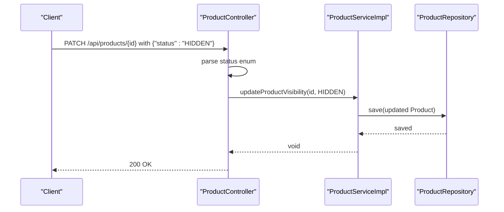

**Diagram sources**
- [ProductController.java:76-97](file://src/Backend/src/main/java/com/shoppeclone/backend/product/controller/ProductController.java#L76-L97)
- [ProductStatus.java:3-6](file://src/Backend/src/main/java/com/shoppeclone/backend/product/entity/ProductStatus.java#L3-L6)
- [ProductServiceImpl.java:647-655](file://src/Backend/src/main/java/com/shoppeclone/backend/product/service/impl/ProductServiceImpl.java#L647-L655)

**Section sources**
- [ProductController.java:76-97](file://src/Backend/src/main/java/com/shoppeclone/backend/product/controller/ProductController.java#L76-L97)
- [ProductStatus.java:3-6](file://src/Backend/src/main/java/com/shoppeclone/backend/product/entity/ProductStatus.java#L3-L6)
- [ProductServiceImpl.java:647-655](file://src/Backend/src/main/java/com/shoppeclone/backend/product/service/impl/ProductServiceImpl.java#L647-L655)

### Search Indexing and Display Considerations
- Product search filters by name/description and status.
- Variant suggestions for size and color are supported via regex queries on ProductVariantRepository.
- Display: ProductResponse aggregates variants and images; variant responses include color/size and image URL for rendering.

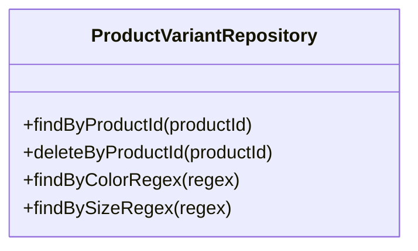

**Diagram sources**
- [ProductVariantRepository.java:8-22](file://src/Backend/src/main/java/com/shoppeclone/backend/product/repository/ProductVariantRepository.java#L8-L22)

**Section sources**
- [ProductVariantRepository.java:8-22](file://src/Backend/src/main/java/com/shoppeclone/backend/product/repository/ProductVariantRepository.java#L8-L22)
- [ProductServiceImpl.java:513-572](file://src/Backend/src/main/java/com/shoppeclone/backend/product/service/impl/ProductServiceImpl.java#L513-L572)
- [ProductServiceImpl.java:575-612](file://src/Backend/src/main/java/com/shoppeclone/backend/product/service/impl/ProductServiceImpl.java#L575-L612)

### Relationship Between Base Products and Variants
- One-to-many: Product has many ProductVariant entries linked by productId.
- Attribute inheritance: Variants inherit the product’s shop context and are filtered by product status in queries.
- Aggregation: Product displays min/max price and total stock derived from variants.

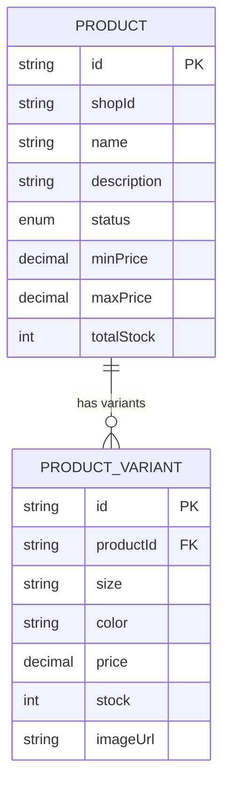

**Diagram sources**
- [Product.java:12-50](file://src/Backend/src/main/java/com/shoppeclone/backend/product/entity/Product.java#L12-L50)
- [ProductVariant.java:12-36](file://src/Backend/src/main/java/com/shoppeclone/backend/product/entity/ProductVariant.java#L12-L36)

**Section sources**
- [Product.java:12-50](file://src/Backend/src/main/java/com/shoppeclone/backend/product/entity/Product.java#L12-L50)
- [ProductVariant.java:12-36](file://src/Backend/src/main/java/com/shoppeclone/backend/product/entity/ProductVariant.java#L12-L36)

### Shopping Cart and Order Integration
- CartItem references a variant via variantId and stores quantity.
- OrderItem snapshots product/variant details at order time and includes variantId and price, enabling display even if product data changes later.

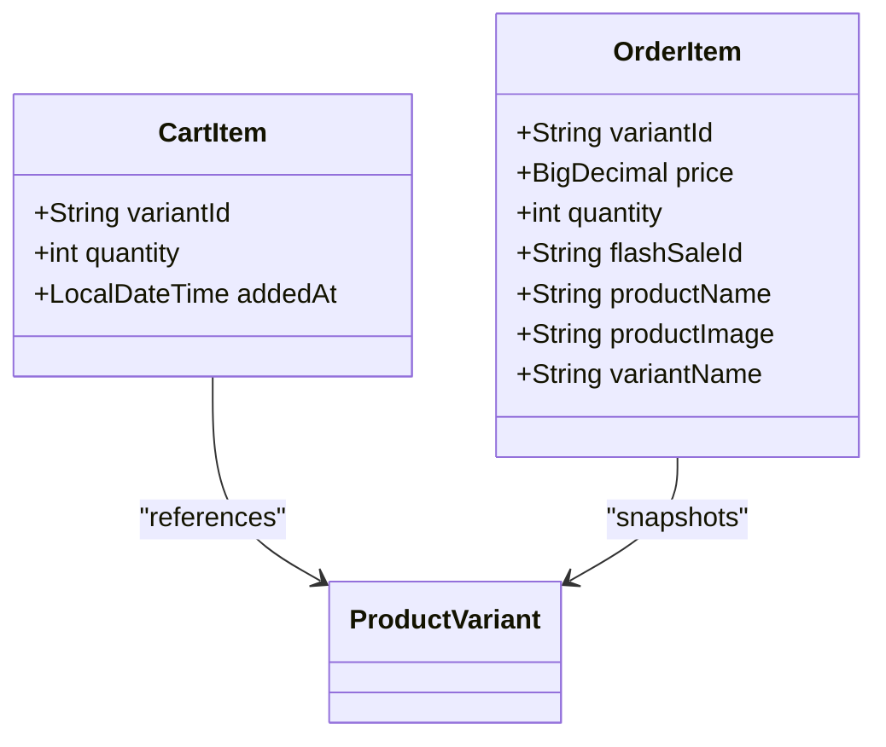

**Diagram sources**
- [CartItem.java:7-11](file://src/Backend/src/main/java/com/shoppeclone/backend/cart/entity/CartItem.java#L7-L11)
- [OrderItem.java:7-17](file://src/Backend/src/main/java/com/shoppeclone/backend/order/entity/OrderItem.java#L7-L17)

**Section sources**
- [CartItem.java:7-11](file://src/Backend/src/main/java/com/shoppeclone/backend/cart/entity/CartItem.java#L7-L11)
- [OrderItem.java:7-17](file://src/Backend/src/main/java/com/shoppeclone/backend/order/entity/OrderItem.java#L7-L17)

## Dependency Analysis
- ProductController depends on ProductService.
- ProductServiceImpl depends on ProductRepository, ProductVariantRepository, ProductImageRepository, ProductCategoryRepository, CategoryRepository, FlashSaleService, and FlashSaleItemRepository.
- ProductVariantRepository extends MongoRepository and defines custom queries for size/color suggestions.

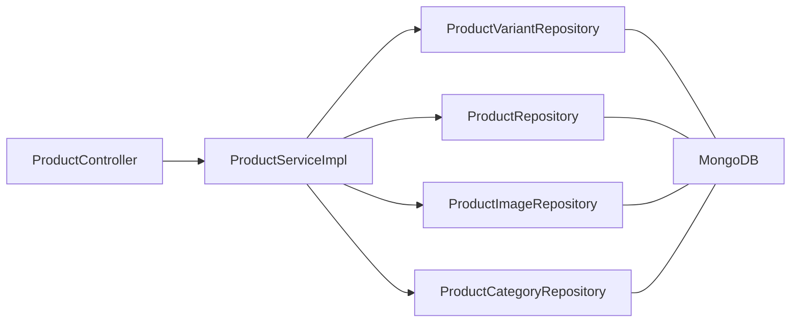

**Diagram sources**
- [ProductController.java:22-162](file://src/Backend/src/main/java/com/shoppeclone/backend/product/controller/ProductController.java#L22-L162)
- [ProductServiceImpl.java:36-656](file://src/Backend/src/main/java/com/shoppeclone/backend/product/service/impl/ProductServiceImpl.java#L36-L656)
- [ProductVariantRepository.java:8-22](file://src/Backend/src/main/java/com/shoppeclone/backend/product/repository/ProductVariantRepository.java#L8-L22)

**Section sources**
- [ProductController.java:22-162](file://src/Backend/src/main/java/com/shoppeclone/backend/product/controller/ProductController.java#L22-L162)
- [ProductServiceImpl.java:36-656](file://src/Backend/src/main/java/com/shoppeclone/backend/product/service/impl/ProductServiceImpl.java#L36-L656)
- [ProductVariantRepository.java:8-22](file://src/Backend/src/main/java/com/shoppeclone/backend/product/repository/ProductVariantRepository.java#L8-L22)

## Performance Considerations
- Indexing: productId is indexed on ProductVariant for fast lookups.
- Queries: Regex-based suggestions for size/color are supported; consider caching frequent suggestions.
- Aggregation: Min/max price and total stock recomputation occurs on variant updates; batch updates may trigger multiple recalculations.
- Flash sale sold counts: Real-time calculation from flash sale items; cache or batch refresh for high traffic.

[No sources needed since this section provides general guidance]

## Troubleshooting Guide
Common issues and resolutions:
- Variant not found when updating stock: Ensure variantId is correct and variant belongs to the specified product.
- Duplicate variant attributes: The service enforces unique color+size per product; adjust attributes to be distinct.
- Visibility not changing: Confirm status payload matches ProductStatus enum values.
- Flash sale sold count discrepancies: Real-time sold counts are derived from flash sale items; verify flash sale items exist and are approved.

**Section sources**
- [ProductServiceImpl.java:433-459](file://src/Backend/src/main/java/com/shoppeclone/backend/product/service/impl/ProductServiceImpl.java#L433-L459)
- [ProductServiceImpl.java:414-424](file://src/Backend/src/main/java/com/shoppeclone/backend/product/service/impl/ProductServiceImpl.java#L414-L424)
- [ProductController.java:76-97](file://src/Backend/src/main/java/com/shoppeclone/backend/product/controller/ProductController.java#L76-L97)

## Conclusion
The variants management system provides robust support for creating, updating, deleting, and tracking variants with size and color attributes, variant-specific pricing, and integrated stock management. It offers visibility controls, search-friendly suggestions, and seamless integration with cart and order systems. Extending SKU generation and optimizing flash sale sold count calculations would further enhance operational clarity and performance.

## Appendices

### API Endpoints Summary
- POST /api/products/{productId}/variants: Create a variant.
- DELETE /api/products/variants/{variantId}: Delete a variant.
- GET /api/products/variant/{variantId}: Retrieve a variant.
- PATCH /api/products/variant/{variantId}/stock: Update variant stock.
- PATCH /api/products/{id}: Update product visibility and flash sale status.

**Section sources**
- [ProductController.java:100-128](file://src/Backend/src/main/java/com/shoppeclone/backend/product/controller/ProductController.java#L100-L128)
- [ProductController.java:76-97](file://src/Backend/src/main/java/com/shoppeclone/backend/product/controller/ProductController.java#L76-L97)