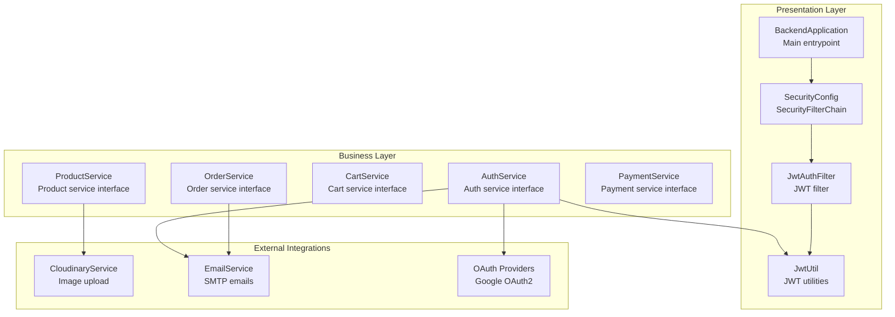
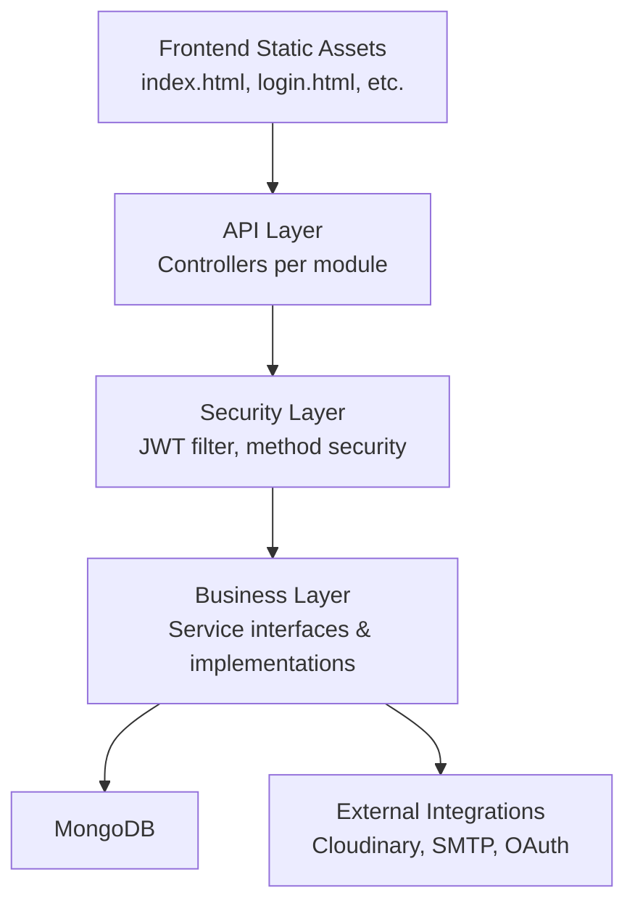
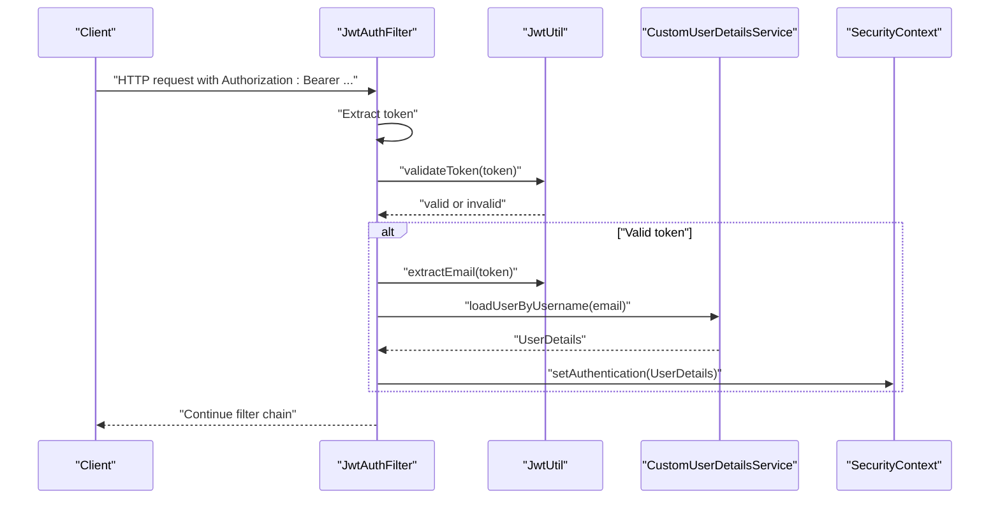
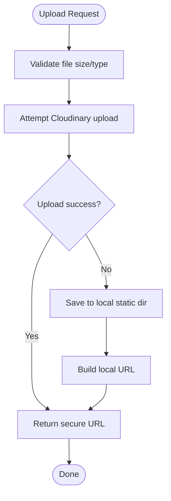
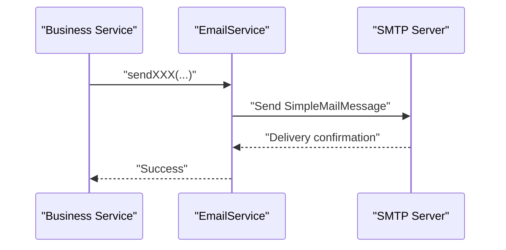
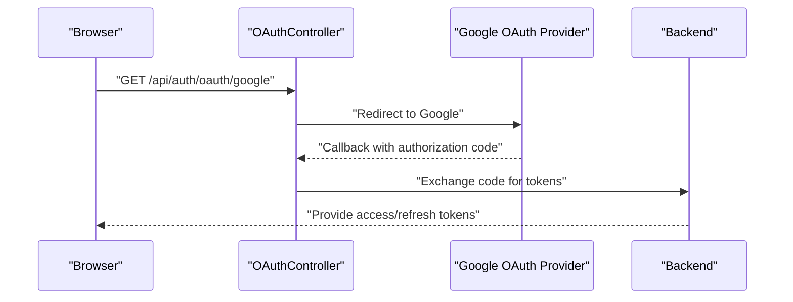
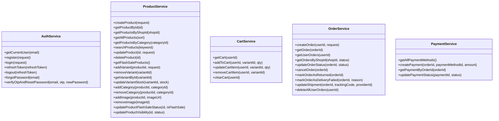
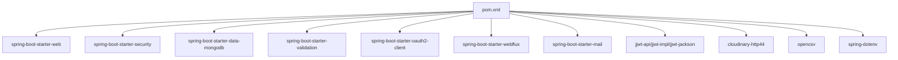

# Architecture Overview

<cite>
**Referenced Files in This Document**
- [BackendApplication.java](file://src/backend/src/main/java/com/shoppeclone/backend/BackendApplication.java)
- [SecurityConfig.java](file://src/backend/src/main/java/com/shoppeclone/backend/auth/security/SecurityConfig.java)
- [JwtUtil.java](file://src/backend/src/main/java/com/shoppeclone/backend/auth/security/JwtUtil.java)
- [JwtAuthFilter.java](file://src/backend/src/main/java/com/shoppeclone/backend/auth/security/JwtAuthFilter.java)
- [application.properties](file://src/backend/src/main/resources/application.properties)
- [CloudinaryConfig.java](file://src/backend/src/main/java/com/shoppeclone/backend/common/config/CloudinaryConfig.java)
- [CorsConfig.java](file://src/backend/src/main/java/com/shoppeclone/backend/common/config/CorsConfig.java)
- [CloudinaryService.java](file://src/backend/src/main/java/com/shoppeclone/backend/common/service/CloudinaryService.java)
- [EmailService.java](file://src/backend/src/main/java/com/shoppeclone/backend/common/service/EmailService.java)
- [pom.xml](file://src/backend/pom.xml)
- [AuthService.java](file://src/backend/src/main/java/com/shoppeclone/backend/auth/service/AuthService.java)
- [ProductService.java](file://src/backend/src/main/java/com/shoppeclone/backend/product/service/ProductService.java)
- [CartService.java](file://src/backend/src/main/java/com/shoppeclone/backend/cart/service/CartService.java)
- [OrderService.java](file://src/backend/src/main/java/com/shoppeclone/backend/order/service/OrderService.java)
- [PaymentService.java](file://src/backend/src/main/java/com/shoppeclone/backend/payment/service/PaymentService.java)
</cite>

## Table of Contents
1. [Introduction](#introduction)
2. [Project Structure](#project-structure)
3. [Core Components](#core-components)
4. [Architecture Overview](#architecture-overview)
5. [Detailed Component Analysis](#detailed-component-analysis)
6. [Dependency Analysis](#dependency-analysis)
7. [Performance Considerations](#performance-considerations)
8. [Troubleshooting Guide](#troubleshooting-guide)
9. [Conclusion](#conclusion)

## Introduction
This document presents the high-level architecture of the e-commerce platform backend. It describes the layered architecture pattern, component interactions, and system boundaries. It also documents the Spring Boot application structure, the security layer with JWT and role-based access control, and integration points with external services such as Cloudinary, SMTP, and OAuth providers. System context diagrams illustrate how frontend static assets, the API layer, business modules, and external integrations collaborate. Design patterns and architectural decisions impacting scalability and maintainability are explained.

## Project Structure
The backend follows a layered architecture with clear separation of concerns:
- Presentation Layer: REST controllers per feature module (authentication, product, cart, order, payment, etc.)
- Business Layer: Service interfaces and implementations encapsulating domain logic
- Persistence Layer: Spring Data MongoDB repositories
- Cross-Cutting Concerns: Security filters, CORS configuration, external service integrations
- Configuration: Spring Boot auto-configuration via @SpringBootApplication and property-driven configuration

**Diagram sources**
- [BackendApplication.java:11-13](file://src/backend/src/main/java/com/shoppeclone/backend/BackendApplication.java#L11-L13)
- [SecurityConfig.java:26-80](file://src/backend/src/main/java/com/shoppeclone/backend/auth/security/SecurityConfig.java#L26-L80)
- [JwtAuthFilter.java:23-44](file://src/backend/src/main/java/com/shoppeclone/backend/auth/security/JwtAuthFilter.java#L23-L44)
- [JwtUtil.java:27-43](file://src/backend/src/main/java/com/shoppeclone/backend/auth/security/JwtUtil.java#L27-L43)
- [AuthService.java:8-21](file://src/backend/src/main/java/com/shoppeclone/backend/auth/service/AuthService.java#L8-L21)
- [ProductService.java:10-53](file://src/backend/src/main/java/com/shoppeclone/backend/product/service/ProductService.java#L10-L53)
- [CartService.java:5-15](file://src/backend/src/main/java/com/shoppeclone/backend/cart/service/CartService.java#L5-L15)
- [OrderService.java:9-31](file://src/backend/src/main/java/com/shoppeclone/backend/order/service/OrderService.java#L9-L31)
- [PaymentService.java:8-16](file://src/backend/src/main/java/com/shoppeclone/backend/payment/service/PaymentService.java#L8-L16)
- [CloudinaryService.java:36-58](file://src/backend/src/main/java/com/shoppeclone/backend/common/service/CloudinaryService.java#L36-L58)
- [EmailService.java:14-27](file://src/backend/src/main/java/com/shoppeclone/backend/common/service/EmailService.java#L14-L27)

**Section sources**
- [BackendApplication.java:7-14](file://src/backend/src/main/java/com/shoppeclone/backend/BackendApplication.java#L7-L14)
- [pom.xml:23-135](file://src/backend/pom.xml#L23-L135)

## Core Components
- Application bootstrap: Central entrypoint enabling scheduling and launching the Spring Boot application.
- Security layer: Stateless JWT-based authentication with method-level security, custom JWT filter, and password encoder.
- CORS: Shared CORS configuration supporting credentials and flexible headers/methods.
- External integrations: Cloudinary-backed image upload with local fallback, SMTP-based email notifications, and Google OAuth2 client configuration.
- Feature modules: Clear service interfaces for authentication, product, cart, order, and payment domains.

**Section sources**
- [BackendApplication.java:11-13](file://src/backend/src/main/java/com/shoppeclone/backend/BackendApplication.java#L11-L13)
- [SecurityConfig.java:26-90](file://src/backend/src/main/java/com/shoppeclone/backend/auth/security/SecurityConfig.java#L26-L90)
- [CorsConfig.java:14-28](file://src/backend/src/main/java/com/shoppeclone/backend/common/config/CorsConfig.java#L14-L28)
- [CloudinaryService.java:20-28](file://src/backend/src/main/java/com/shoppeclone/backend/common/service/CloudinaryService.java#L20-L28)
- [EmailService.java:8-12](file://src/backend/src/main/java/com/shoppeclone/backend/common/service/EmailService.java#L8-L12)
- [application.properties:58-114](file://src/backend/src/main/resources/application.properties#L58-L114)

## Architecture Overview
The system employs a layered architecture with explicit boundaries:
- Presentation: REST controllers expose endpoints grouped by feature modules.
- Business: Services define domain operations and orchestrate repositories and external services.
- Persistence: MongoDB repositories manage data access.
- Infrastructure: Security, CORS, and external service clients reside in shared configuration packages.

**Diagram sources**
- [SecurityConfig.java:26-80](file://src/backend/src/main/java/com/shoppeclone/backend/auth/security/SecurityConfig.java#L26-L80)
- [CloudinaryService.java:36-58](file://src/backend/src/main/java/com/shoppeclone/backend/common/service/CloudinaryService.java#L36-L58)
- [EmailService.java:14-27](file://src/backend/src/main/java/com/shoppeclone/backend/common/service/EmailService.java#L14-L27)
- [application.properties:14-17](file://src/backend/src/main/resources/application.properties#L14-L17)

## Detailed Component Analysis

### Security Layer
The security layer enforces stateless JWT authentication and method-level security:
- Stateless session policy ensures scalability.
- JWT filter extracts tokens from Authorization headers and populates SecurityContext.
- Security filter chain permitslisted routes (public endpoints, uploads, webhooks) while securing other API paths.
- Method-level security annotations enable role-based access control on services.

**Diagram sources**
- [JwtAuthFilter.java:23-44](file://src/backend/src/main/java/com/shoppeclone/backend/auth/security/JwtAuthFilter.java#L23-L44)
- [JwtUtil.java:49-56](file://src/backend/src/main/java/com/shoppeclone/backend/auth/security/JwtUtil.java#L49-L56)

**Section sources**
- [SecurityConfig.java:26-80](file://src/backend/src/main/java/com/shoppeclone/backend/auth/security/SecurityConfig.java#L26-L80)
- [JwtAuthFilter.java:16-46](file://src/backend/src/main/java/com/shoppeclone/backend/auth/security/JwtAuthFilter.java#L16-L46)
- [JwtUtil.java:11-65](file://src/backend/src/main/java/com/shoppeclone/backend/auth/security/JwtUtil.java#L11-L65)

### External Integrations

#### Cloudinary Integration
CloudinaryService provides image upload with a fallback to local storage:
- Validates file size and MIME type.
- Attempts Cloudinary upload; falls back to local storage on failure.
- Supports deletion by public ID.

**Diagram sources**
- [CloudinaryService.java:36-88](file://src/backend/src/main/java/com/shoppeclone/backend/common/service/CloudinaryService.java#L36-L88)

**Section sources**
- [CloudinaryConfig.java:21-28](file://src/backend/src/main/java/com/shoppeclone/backend/common/config/CloudinaryConfig.java#L21-L28)
- [CloudinaryService.java:20-137](file://src/backend/src/main/java/com/shoppeclone/backend/common/service/CloudinaryService.java#L20-L137)
- [application.properties:85-89](file://src/backend/src/main/resources/application.properties#L85-L89)

#### SMTP Integration
EmailService sends transactional emails for OTP, password resets, shop approvals, and alerts:
- Uses Spring’s JavaMailSender to deliver messages.
- Provides multiple methods for different use cases.

**Diagram sources**
- [EmailService.java:14-27](file://src/backend/src/main/java/com/shoppeclone/backend/common/service/EmailService.java#L14-L27)

**Section sources**
- [EmailService.java:8-197](file://src/backend/src/main/java/com/shoppeclone/backend/common/service/EmailService.java#L8-L197)
- [application.properties:70-80](file://src/backend/src/main/resources/application.properties#L70-L80)

#### OAuth Integration
Google OAuth2 is configured via application properties:
- Client credentials and provider endpoints are externalized.
- OAuth client starter integrates with Spring Security OAuth2 client.

**Diagram sources**
- [application.properties:58-67](file://src/backend/src/main/resources/application.properties#L58-L67)
- [pom.xml:96-106](file://src/backend/pom.xml#L96-L106)

**Section sources**
- [application.properties:58-67](file://src/backend/src/main/resources/application.properties#L58-L67)
- [pom.xml:96-106](file://src/backend/pom.xml#L96-L106)

### Feature Modules and Service Interfaces
Service interfaces define contracts for business capabilities:
- Authentication service: registration, login, token refresh, logout, password reset.
- Product service: CRUD, variants, categories, images, flash sale visibility.
- Cart service: cart retrieval, add/update/remove items, clear.
- Order service: order creation, status updates, shipment tracking, returns.
- Payment service: payment methods, creation, lookup, status updates.

**Diagram sources**
- [AuthService.java:8-21](file://src/backend/src/main/java/com/shoppeclone/backend/auth/service/AuthService.java#L8-L21)
- [ProductService.java:10-53](file://src/backend/src/main/java/com/shoppeclone/backend/product/service/ProductService.java#L10-L53)
- [CartService.java:5-15](file://src/backend/src/main/java/com/shoppeclone/backend/cart/service/CartService.java#L5-L15)
- [OrderService.java:9-31](file://src/backend/src/main/java/com/shoppeclone/backend/order/service/OrderService.java#L9-L31)
- [PaymentService.java:8-16](file://src/backend/src/main/java/com/shoppeclone/backend/payment/service/PaymentService.java#L8-L16)

**Section sources**
- [AuthService.java:8-21](file://src/backend/src/main/java/com/shoppeclone/backend/auth/service/AuthService.java#L8-L21)
- [ProductService.java:10-53](file://src/backend/src/main/java/com/shoppeclone/backend/product/service/ProductService.java#L10-L53)
- [CartService.java:5-15](file://src/backend/src/main/java/com/shoppeclone/backend/cart/service/CartService.java#L5-L15)
- [OrderService.java:9-31](file://src/backend/src/main/java/com/shoppeclone/backend/order/service/OrderService.java#L9-L31)
- [PaymentService.java:8-16](file://src/backend/src/main/java/com/shoppeclone/backend/payment/service/PaymentService.java#L8-L16)

## Dependency Analysis
The backend leverages Spring Boot starters and third-party libraries for cross-cutting capabilities:
- Web, Security, Data MongoDB, Validation, OAuth2 Client, WebFlux, Mail, OpenCSV, Cloudinary, and JWT dependencies are declared in the Maven POM.
- Property-driven configuration externalizes secrets and endpoints for JWT, OAuth, SMTP, and Cloudinary.

**Diagram sources**
- [pom.xml:23-135](file://src/backend/pom.xml#L23-L135)

**Section sources**
- [pom.xml:23-135](file://src/backend/pom.xml#L23-L135)
- [application.properties:25-31](file://src/backend/src/main/resources/application.properties#L25-L31)
- [application.properties:58-67](file://src/backend/src/main/resources/application.properties#L58-L67)
- [application.properties:70-80](file://src/backend/src/main/resources/application.properties#L70-L80)
- [application.properties:85-89](file://src/backend/src/main/resources/application.properties#L85-L89)

## Performance Considerations
- Statelessness: JWT filter chain enforces stateless sessions to improve horizontal scalability.
- Concurrency tuning: Tomcat thread configuration increases max threads and accept count to support flash sale traffic spikes.
- Externalization: Secrets and timeouts are externalized via environment variables to avoid hardcoding and enable environment-specific tuning.
- Image upload resilience: CloudinaryService attempts Cloudinary upload first and falls back to local storage, ensuring availability under partial outages.

**Section sources**
- [SecurityConfig.java:72-74](file://src/backend/src/main/java/com/shoppeclone/backend/auth/security/SecurityConfig.java#L72-L74)
- [application.properties:103-108](file://src/backend/src/main/resources/application.properties#L103-L108)
- [application.properties:25-31](file://src/backend/src/main/resources/application.properties#L25-L31)
- [CloudinaryService.java:40-58](file://src/backend/src/main/java/com/shoppeclone/backend/common/service/CloudinaryService.java#L40-L58)

## Troubleshooting Guide
- JWT configuration: Verify JWT secret and expiration environment variables are set; ensure token format matches Bearer scheme.
- CORS issues: Confirm allowed origins, methods, and headers match frontend requests; credentials must be enabled for cookie-based auth scenarios.
- OAuth callback: Ensure redirect URI and client credentials are correctly configured; check provider endpoints.
- SMTP delivery: Validate mail sender credentials and TLS settings; confirm outbound port accessibility.
- Cloudinary failures: Check cloud name, API key, and secret; note fallback behavior to local storage.
- MongoDB connectivity: Confirm Atlas URI and database name; verify network access and credentials.

**Section sources**
- [application.properties:25-31](file://src/backend/src/main/resources/application.properties#L25-L31)
- [CorsConfig.java:18-22](file://src/backend/src/main/java/com/shoppeclone/backend/common/config/CorsConfig.java#L18-L22)
- [application.properties:58-67](file://src/backend/src/main/resources/application.properties#L58-L67)
- [application.properties:70-80](file://src/backend/src/main/resources/application.properties#L70-L80)
- [application.properties:85-89](file://src/backend/src/main/resources/application.properties#L85-L89)
- [application.properties:14-17](file://src/backend/src/main/resources/application.properties#L14-L17)

## Conclusion
The e-commerce backend adopts a clean layered architecture with strong separation of concerns. The security layer uses stateless JWT authentication and method-level controls, while external integrations are cleanly abstracted behind service interfaces. Property-driven configuration enables environment-specific tuning for scalability and reliability. The design supports high concurrency during promotional events and maintains maintainability through modular service interfaces and shared infrastructure components.