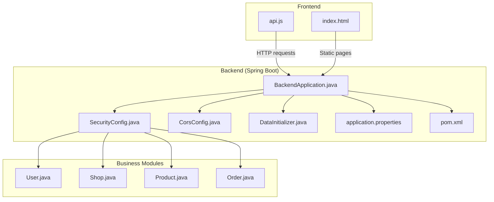
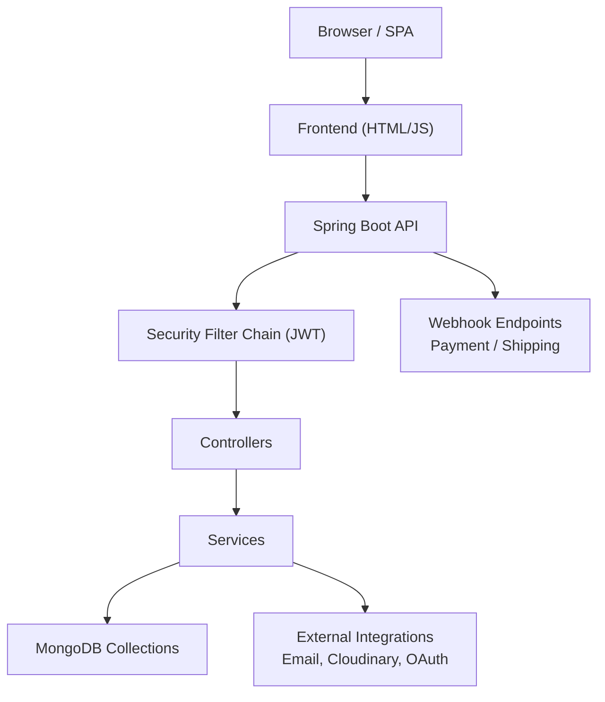
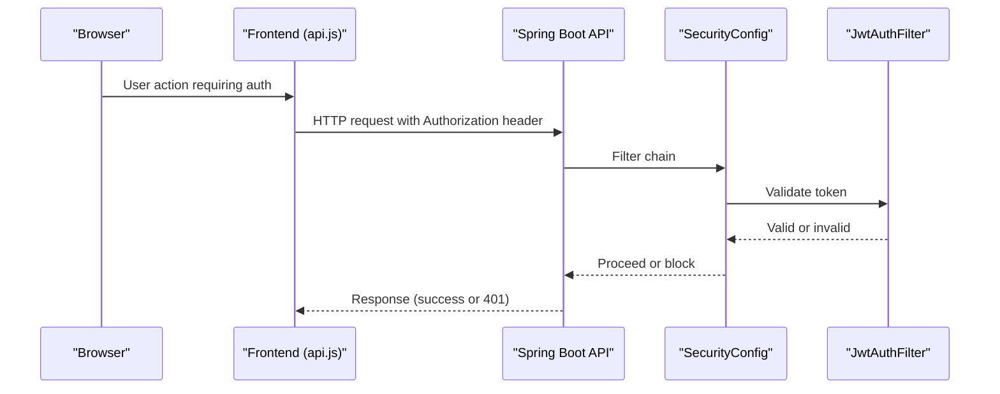
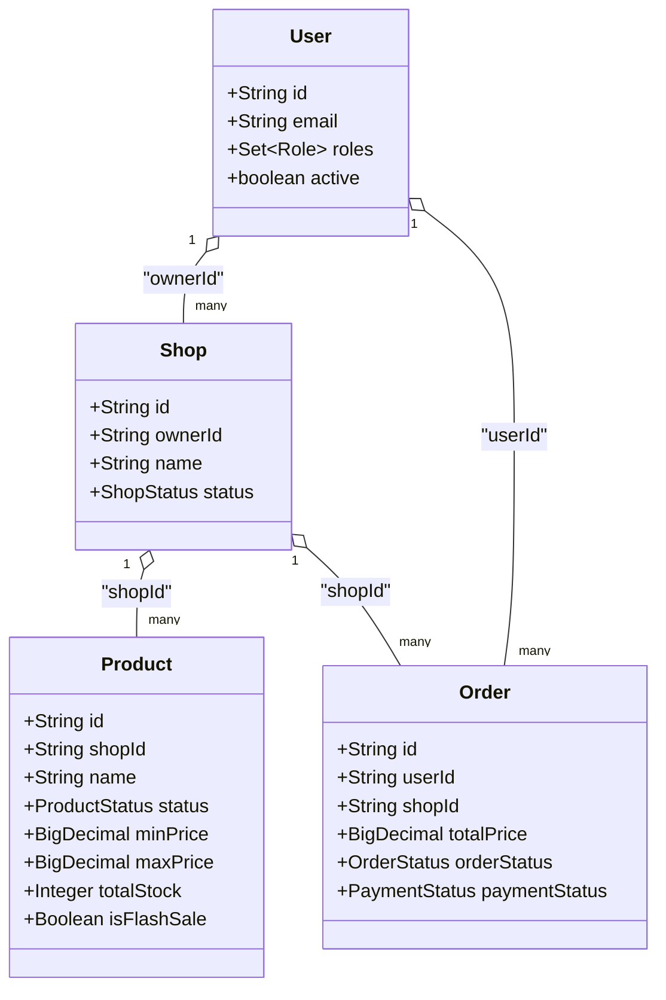
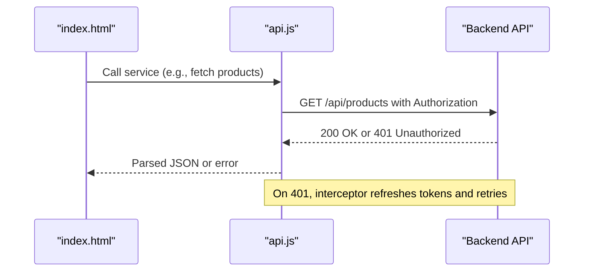
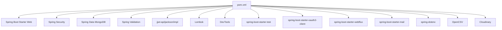

# Project Overview

<cite>
**Referenced Files in This Document**
- [BackendApplication.java](file://src/Backend/src/main/java/com/shoppeclone/backend/BackendApplication.java)
- [README.md](file://README.md)
- [pom.xml](file://src/Backend/pom.xml)
- [application.properties](file://src/Backend/src/main/resources/application.properties)
- [SecurityConfig.java](file://src/Backend/src/main/java/com/shoppeclone/backend/auth/security/SecurityConfig.java)
- [CorsConfig.java](file://src/Backend/src/main/java/com/shoppeclone/backend/common/config/CorsConfig.java)
- [DataInitializer.java](file://src/Backend/src/main/java/com/shoppeclone/backend/common/config/DataInitializer.java)
- [User.java](file://src/Backend/src/main/java/com/shoppeclone/backend/auth/model/User.java)
- [Shop.java](file://src/Backend/src/main/java/com/shoppeclone/backend/shop/entity/Shop.java)
- [Product.java](file://src/Backend/src/main/java/com/shoppeclone/backend/product/entity/Product.java)
- [Order.java](file://src/Backend/src/main/java/com/shoppeclone/backend/order/entity/Order.java)
- [api.js](file://src/Frontend/js/services/api.js)
- [index.html](file://src/Frontend/index.html)
</cite>

## Table of Contents
1. [Introduction](#introduction)
2. [Project Structure](#project-structure)
3. [Core Components](#core-components)
4. [Architecture Overview](#architecture-overview)
5. [Detailed Component Analysis](#detailed-component-analysis)
6. [Dependency Analysis](#dependency-analysis)
7. [Performance Considerations](#performance-considerations)
8. [Troubleshooting Guide](#troubleshooting-guide)
9. [Conclusion](#conclusion)

## Introduction
This e-commerce platform is a full-stack Spring Boot + MongoDB application designed to demonstrate modern commerce workflows across three primary personas: buyer, seller, and administrator. It exposes a cohesive set of RESTful APIs grouped into business modules (authentication, user, shop/seller, catalog, commerce, promotions, trust/support, and admin), backed by MongoDB for persistence. The backend also serves static assets and demo pages for quick front-end integration and end-to-end flow testing. The system emphasizes:
- JWT-based authentication with refresh tokens and optional OTP
- Role-based access control and method-level security
- Rich e-commerce features: product catalog, shopping cart, orders, payments, shipping, promotions (vouchers, flash sale), reviews, refunds, disputes, and seller analytics
- Integration points for external services (email, Cloudinary, OAuth, webhooks)

## Project Structure
The repository is organized into:
- Backend: Spring Boot application under src/Backend with Java source, resources, and tests
- Frontend: Static HTML/CSS/JS under src/Frontend used for demos and manual testing
- Tools: PowerShell scripts and a dedicated flash sale simulator
- Docs: Internal analysis notes and guides

High-level module grouping by business domain:
- Authentication and Authorization: auth, common/security, common/config
- User Management: user, notification, common/response
- Shop and Seller Workflow: shop, follow, common/response
- Catalog and Inventory: product, category, search
- Commerce: cart, order, payment, shipping
- Promotions: promotion (vouchers, flash sale)
- Trust and Support: review, refund, dispute, chat
- Admin: admin/dashboard, admin/maintenance, admin/user

**Diagram sources**
- [BackendApplication.java:1-14](file://src/Backend/src/main/java/com/shoppeclone/backend/BackendApplication.java#L1-L14)
- [SecurityConfig.java:1-92](file://src/Backend/src/main/java/com/shoppeclone/backend/auth/security/SecurityConfig.java#L1-L92)
- [CorsConfig.java:1-30](file://src/Backend/src/main/java/com/shoppeclone/backend/common/config/CorsConfig.java#L1-L30)
- [DataInitializer.java:1-203](file://src/Backend/src/main/java/com/shoppeclone/backend/common/config/DataInitializer.java#L1-L203)
- [application.properties:1-114](file://src/Backend/src/main/resources/application.properties#L1-L114)
- [pom.xml:1-173](file://src/Backend/pom.xml#L1-L173)
- [User.java:1-38](file://src/Backend/src/main/java/com/shoppeclone/backend/auth/model/User.java#L1-L38)
- [Shop.java:1-52](file://src/Backend/src/main/java/com/shoppeclone/backend/shop/entity/Shop.java#L1-L52)
- [Product.java:1-51](file://src/Backend/src/main/java/com/shoppeclone/backend/product/entity/Product.java#L1-L51)
- [Order.java:1-55](file://src/Backend/src/main/java/com/shoppeclone/backend/order/entity/Order.java#L1-L55)
- [api.js:1-446](file://src/Frontend/js/services/api.js#L1-L446)
- [index.html:1-800](file://src/Frontend/index.html#L1-L800)

**Section sources**
- [README.md:78-114](file://README.md#L78-L114)
- [pom.xml:18-135](file://src/Backend/pom.xml#L18-L135)
- [application.properties:1-114](file://src/Backend/src/main/resources/application.properties#L1-L114)

## Core Components
- Backend entry point and scheduling enablement
  - [BackendApplication.java:11-13](file://src/Backend/src/main/java/com/shoppeclone/backend/BackendApplication.java#L11-L13)
- Security and authorization
  - [SecurityConfig.java:27-80](file://src/Backend/src/main/java/com/shoppeclone/backend/auth/security/SecurityConfig.java#L27-L80)
  - [CorsConfig.java:14-28](file://src/Backend/src/main/java/com/shoppeclone/backend/common/config/CorsConfig.java#L14-L28)
- Persistence and initialization
  - [application.properties:14-17](file://src/Backend/src/main/resources/application.properties#L14-L17)
  - [DataInitializer.java:37-49](file://src/Backend/src/main/java/com/shoppeclone/backend/common/config/DataInitializer.java#L37-L49)
- Domain models
  - [User.java:13-38](file://src/Backend/src/main/java/com/shoppeclone/backend/auth/model/User.java#L13-L38)
  - [Shop.java:12-52](file://src/Backend/src/main/java/com/shoppeclone/backend/shop/entity/Shop.java#L12-L52)
  - [Product.java:10-51](file://src/Backend/src/main/java/com/shoppeclone/backend/product/entity/Product.java#L10-L51)
  - [Order.java:12-55](file://src/Backend/src/main/java/com/shoppeclone/backend/order/entity/Order.java#L12-L55)

Usage patterns:
- Static frontend pages and JavaScript services consume the backend via HTTP endpoints
  - [api.js:2-10](file://src/Frontend/js/services/api.js#L2-L10)
  - [index.html:465-467](file://src/Frontend/index.html#L465-L467)

**Section sources**
- [BackendApplication.java:1-14](file://src/Backend/src/main/java/com/shoppeclone/backend/BackendApplication.java#L1-L14)
- [SecurityConfig.java:1-92](file://src/Backend/src/main/java/com/shoppeclone/backend/auth/security/SecurityConfig.java#L1-L92)
- [CorsConfig.java:1-30](file://src/Backend/src/main/java/com/shoppeclone/backend/common/config/CorsConfig.java#L1-L30)
- [DataInitializer.java:1-203](file://src/Backend/src/main/java/com/shoppeclone/backend/common/config/DataInitializer.java#L1-L203)
- [application.properties:1-114](file://src/Backend/src/main/resources/application.properties#L1-L114)
- [User.java:1-38](file://src/Backend/src/main/java/com/shoppeclone/backend/auth/model/User.java#L1-L38)
- [Shop.java:1-52](file://src/Backend/src/main/java/com/shoppeclone/backend/shop/entity/Shop.java#L1-L52)
- [Product.java:1-51](file://src/Backend/src/main/java/com/shoppeclone/backend/product/entity/Product.java#L1-L51)
- [Order.java:1-55](file://src/Backend/src/main/java/com/shoppeclone/backend/order/entity/Order.java#L1-L55)
- [api.js:1-446](file://src/Frontend/js/services/api.js#L1-L446)
- [index.html:1-800](file://src/Frontend/index.html#L1-L800)

## Architecture Overview
The system follows a layered architecture:
- Presentation: Static frontend (HTML/CSS/JS) and SPA-like behavior with token refresh interception
- API: Spring MVC controllers exposing REST endpoints
- Security: JWT filter chain, method security, CORS configuration
- Business Services: Modular services implementing domain logic
- Persistence: MongoDB collections for users, shops, products, orders, and related entities
- Integrations: Email, Cloudinary, OAuth, and webhook endpoints for payment/shipping providers

**Diagram sources**
- [SecurityConfig.java:27-80](file://src/Backend/src/main/java/com/shoppeclone/backend/auth/security/SecurityConfig.java#L27-L80)
- [CorsConfig.java:14-28](file://src/Backend/src/main/java/com/shoppeclone/backend/common/config/CorsConfig.java#L14-L28)
- [application.properties:58-95](file://src/Backend/src/main/resources/application.properties#L58-L95)
- [README.md:43-56](file://README.md#L43-L56)

## Detailed Component Analysis

### Authentication and Authorization Flow
The backend enforces stateless JWT authentication and method-level security. Public routes (e.g., product, category, flash sale listings) are permitted without authentication, while most APIs require a valid bearer token. Certain endpoints (e.g., flash sale order placement during simulations) are intentionally open to support load testing.

**Diagram sources**
- [SecurityConfig.java:27-80](file://src/Backend/src/main/java/com/shoppeclone/backend/auth/security/SecurityConfig.java#L27-L80)
- [api.js:5-10](file://src/Frontend/js/services/api.js#L5-L10)

**Section sources**
- [SecurityConfig.java:27-80](file://src/Backend/src/main/java/com/shoppeclone/backend/auth/security/SecurityConfig.java#L27-L80)
- [application.properties:58-95](file://src/Backend/src/main/resources/application.properties#L58-L95)
- [README.md:71-77](file://README.md#L71-L77)

### CORS Configuration
CORS is configured centrally to allow cross-origin requests from common development origins and expose refresh token headers. This enables the frontend to call backend endpoints seamlessly during development.

**Section sources**
- [CorsConfig.java:14-28](file://src/Backend/src/main/java/com/shoppeclone/backend/common/config/CorsConfig.java#L14-L28)
- [application.properties:92-95](file://src/Backend/src/main/resources/application.properties#L92-L95)

### Data Initialization and Defaults
On startup, the application initializes default roles, categories, payment methods, and shipping providers. It also promotes a specific admin user and seeds default flash sale campaign metadata when none is present.

**Section sources**
- [DataInitializer.java:37-49](file://src/Backend/src/main/java/com/shoppeclone/backend/common/config/DataInitializer.java#L37-L49)
- [DataInitializer.java:86-110](file://src/Backend/src/main/java/com/shoppeclone/backend/common/config/DataInitializer.java#L86-L110)
- [DataInitializer.java:112-151](file://src/Backend/src/main/java/com/shoppeclone/backend/common/config/DataInitializer.java#L112-L151)
- [DataInitializer.java:165-199](file://src/Backend/src/main/java/com/shoppeclone/backend/common/config/DataInitializer.java#L165-L199)

### Domain Model Overview
Core entities represent the business domain:
- User: identity, roles, and activity flags
- Shop: seller profile, identity, bank details, and status
- Product: catalog item with pricing, stock, ratings, and flash sale attributes
- Order: purchase record with items, shipping, discounts, and statuses

**Diagram sources**
- [User.java:13-38](file://src/Backend/src/main/java/com/shoppeclone/backend/auth/model/User.java#L13-L38)
- [Shop.java:12-52](file://src/Backend/src/main/java/com/shoppeclone/backend/shop/entity/Shop.java#L12-L52)
- [Product.java:10-51](file://src/Backend/src/main/java/com/shoppeclone/backend/product/entity/Product.java#L10-L51)
- [Order.java:12-55](file://src/Backend/src/main/java/com/shoppeclone/backend/order/entity/Order.java#L12-L55)

**Section sources**
- [User.java:13-38](file://src/Backend/src/main/java/com/shoppeclone/backend/auth/model/User.java#L13-L38)
- [Shop.java:12-52](file://src/Backend/src/main/java/com/shoppeclone/backend/shop/entity/Shop.java#L12-L52)
- [Product.java:10-51](file://src/Backend/src/main/java/com/shoppeclone/backend/product/entity/Product.java#L10-L51)
- [Order.java:12-55](file://src/Backend/src/main/java/com/shoppeclone/backend/order/entity/Order.java#L12-L55)

### Frontend Integration Patterns
The frontend uses a centralized API service to communicate with backend endpoints. It attaches JWT access tokens for authenticated requests and handles token refresh automatically when encountering 401 responses.

**Diagram sources**
- [api.js:34-38](file://src/Frontend/js/services/api.js#L34-L38)
- [index.html:21-78](file://src/Frontend/index.html#L21-L78)

**Section sources**
- [api.js:1-446](file://src/Frontend/js/services/api.js#L1-L446)
- [index.html:1-800](file://src/Frontend/index.html#L1-L800)

## Dependency Analysis
Primary technology stack and their roles:
- Spring Boot 3.2.3, Java 21, Maven
- Spring Web, Security, Data MongoDB, Validation, OAuth2 Client, WebFlux, Mail
- jjwt for JWT, Lombok for boilerplate reduction, OpenCSV for imports, Cloudinary for images
- MongoDB for persistence

**Diagram sources**
- [pom.xml:23-135](file://src/Backend/pom.xml#L23-L135)

**Section sources**
- [pom.xml:18-135](file://src/Backend/pom.xml#L18-L135)
- [application.properties:14-17](file://src/Backend/src/main/resources/application.properties#L14-L17)

## Performance Considerations
- Tomcat thread tuning is exposed to support higher concurrency during flash sale simulations
  - [application.properties:103-108](file://src/Backend/src/main/resources/application.properties#L103-L108)
- CORS and JWT filter chain minimize overhead for authenticated requests
- MongoDB indexing on frequently queried fields (e.g., user email, product shopId) improves query performance
- Consider connection pooling and read preferences for production deployments

## Troubleshooting Guide
Common issues and remedies:
- Authentication failures
  - Ensure access token is attached to requests and refresh tokens are handled by the frontend interceptor
  - Verify JWT secret and expiration settings
  - Reference: [api.js:5-10](file://src/Frontend/js/services/api.js#L5-L10), [application.properties:25-31](file://src/Backend/src/main/resources/application.properties#L25-L31)
- CORS errors
  - Confirm allowed origins and exposed headers match frontend origin
  - Reference: [CorsConfig.java:18-22](file://src/Backend/src/main/java/com/shoppeclone/backend/common/config/CorsConfig.java#L18-L22), [application.properties:92-95](file://src/Backend/src/main/resources/application.properties#L92-L95)
- MongoDB connectivity
  - Validate URI and database name; consider environment variable overrides
  - Reference: [application.properties:14-17](file://src/Backend/src/main/resources/application.properties#L14-L17)
- Startup initialization
  - Roles, categories, and defaults are seeded on startup; verify logs for initialization messages
  - Reference: [DataInitializer.java:37-49](file://src/Backend/src/main/java/com/shoppeclone/backend/common/config/DataInitializer.java#L37-L49)

**Section sources**
- [api.js:1-446](file://src/Frontend/js/services/api.js#L1-L446)
- [application.properties:25-31](file://src/Backend/src/main/resources/application.properties#L25-L31)
- [CorsConfig.java:18-22](file://src/Backend/src/main/java/com/shoppeclone/backend/common/config/CorsConfig.java#L18-L22)
- [application.properties:14-17](file://src/Backend/src/main/resources/application.properties#L14-L17)
- [DataInitializer.java:37-49](file://src/Backend/src/main/java/com/shoppeclone/backend/common/config/DataInitializer.java#L37-L49)

## Conclusion
This e-commerce platform demonstrates a comprehensive, modular Spring Boot backend integrated with MongoDB and a lightweight static frontend. It covers essential buyer, seller, and admin workflows, with robust security, extensible integrations, and practical tools for load testing and data seeding. The architecture supports incremental enhancements, including production hardening, improved error handling, and frontend separation.