# System Workflow & Business Flows

<cite>
**Referenced Files in This Document**
- [BackendApplication.java](file://src/Backend/src/main/java/com/shoppeclone/backend/BackendApplication.java)
- [README.md](file://README.md)
- [AuthController.java](file://src/Backend/src/main/java/com/shoppeclone/backend/auth/controller/AuthController.java)
- [AuthService.java](file://src/Backend/src/main/java/com/shoppeclone/backend/auth/service/AuthService.java)
- [UserService.java](file://src/Backend/src/main/java/com/shoppeclone/backend/user/service/UserService.java)
- [ShopService.java](file://src/Backend/src/main/java/com/shoppeclone/backend/shop/service/ShopService.java)
- [ProductService.java](file://src/Backend/src/main/java/com/shoppeclone/backend/product/service/ProductService.java)
- [CartService.java](file://src/Backend/src/main/java/com/shoppeclone/backend/cart/service/CartService.java)
- [OrderService.java](file://src/Backend/src/main/java/com/shoppeclone/backend/order/service/OrderService.java)
- [PaymentService.java](file://src/Backend/src/main/java/com/shoppeclone/backend/payment/service/PaymentService.java)
- [VoucherService.java](file://src/Backend/src/main/java/com/shoppeclone/backend/promotion/service/VoucherService.java)
- [RefundService.java](file://src/Backend/src/main/java/com/shoppeclone/backend/refund/service/RefundService.java)
</cite>

## Table of Contents
1. [Introduction](#introduction)
2. [Project Structure](#project-structure)
3. [Core Components](#core-components)
4. [Architecture Overview](#architecture-overview)
5. [Detailed Component Analysis](#detailed-component-analysis)
6. [Dependency Analysis](#dependency-analysis)
7. [Performance Considerations](#performance-considerations)
8. [Troubleshooting Guide](#troubleshooting-guide)
9. [Conclusion](#conclusion)
10. [Appendices](#appendices)

## Introduction
This document describes the end-to-end business workflows of the e-commerce platform, focusing on the three main user personas: buyer, seller, and admin. It covers registration and authentication, product browsing, shopping cart management, order processing, payment handling, and post-purchase support. It also explains the flash sale system, shop registration and verification process, and administrative oversight functions. Sequence diagrams illustrate typical user journeys and system interactions, and integration flows among business modules are explained to show how complex transactions coordinate.

## Project Structure
The backend is a Spring Boot application with a layered, modular design. Key modules include authentication, user management, shop and seller operations, catalog/product management, commerce (cart, orders, payments), promotions (vouchers, flash sale), trust and support (reviews, refunds, disputes), and admin functions. The application enables scheduling and exposes a wide set of REST endpoints grouped by functional domain.

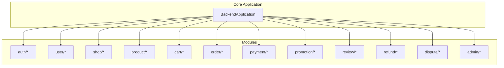

**Diagram sources**
- [BackendApplication.java:1-14](file://src/Backend/src/main/java/com/shoppeclone/backend/BackendApplication.java#L1-L14)
- [README.md:43-76](file://README.md#L43-L76)

**Section sources**
- [README.md:78-114](file://README.md#L78-L114)
- [BackendApplication.java:1-14](file://src/Backend/src/main/java/com/shoppeclone/backend/BackendApplication.java#L1-L14)

## Core Components
This section outlines the primary components and their responsibilities across the major business domains.

- Authentication and Authorization
  - Provides registration, login, token refresh, logout, OTP-based email verification, and password reset flows.
  - Exposes a protected endpoint to fetch the current user profile.

- User Management
  - Manages user profiles, addresses, and supports administrative role promotions.

- Shop and Seller Operations
  - Enables shop registration, approval/rejection workflows, and shop updates.
  - Supports seller dashboards and analytics.

- Catalog and Product Management
  - Handles product creation, variants, categories, images, visibility, and flash sale status.

- Shopping Cart
  - Manages cart retrieval, adding items, updating quantities, removing items, and clearing carts.

- Orders and Payments
  - Creates orders, retrieves order details, manages order status updates, shipment tracking, and payment lifecycle.

- Promotions
  - Vouchers: global and shop-specific discount codes.
  - Flash Sale: campaign management, slots, registration, and ordering.

- Reviews, Refunds, and Disputes
  - Supports product reviews, refund requests, admin-approved refunds, and dispute resolution with image uploads.

- Admin Functions
  - Approves or rejects shops, manages users, oversees flash sale campaigns, reviews disputes and refunds, and runs maintenance tasks.

**Section sources**
- [AuthController.java:1-98](file://src/Backend/src/main/java/com/shoppeclone/backend/auth/controller/AuthController.java#L1-L98)
- [AuthService.java:1-21](file://src/Backend/src/main/java/com/shoppeclone/backend/auth/service/AuthService.java#L1-L21)
- [UserService.java:1-28](file://src/Backend/src/main/java/com/shoppeclone/backend/user/service/UserService.java#L1-L28)
- [ShopService.java:1-31](file://src/Backend/src/main/java/com/shoppeclone/backend/shop/service/ShopService.java#L1-L31)
- [ProductService.java:1-54](file://src/Backend/src/main/java/com/shoppeclone/backend/product/service/ProductService.java#L1-L54)
- [CartService.java:1-16](file://src/Backend/src/main/java/com/shoppeclone/backend/cart/service/CartService.java#L1-L16)
- [OrderService.java:1-33](file://src/Backend/src/main/java/com/shoppeclone/backend/order/service/OrderService.java#L1-L33)
- [PaymentService.java:1-17](file://src/Backend/src/main/java/com/shoppeclone/backend/payment/service/PaymentService.java#L1-L17)
- [VoucherService.java:1-17](file://src/Backend/src/main/java/com/shoppeclone/backend/promotion/service/VoucherService.java#L1-L17)
- [RefundService.java:1-24](file://src/Backend/src/main/java/com/shoppeclone/backend/refund/service/RefundService.java#L1-L24)

## Architecture Overview
The system follows a layered architecture with clear separation of concerns:
- Presentation: REST controllers per module expose endpoints.
- Application: Services encapsulate business logic.
- Persistence: MongoDB stores entities; repositories manage persistence.
- Integration: Email, Cloudinary, and external webhooks for payment and shipping providers.

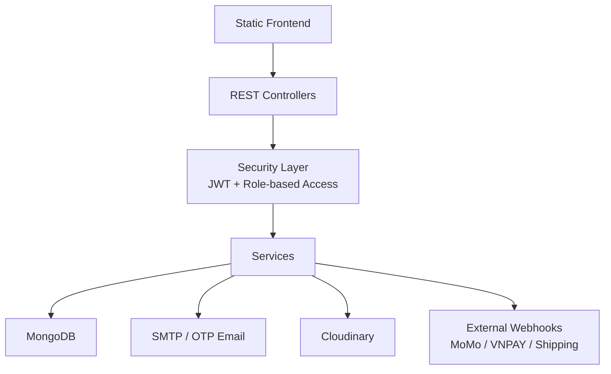

**Diagram sources**
- [README.md:43-56](file://README.md#L43-L56)

**Section sources**
- [README.md:43-76](file://README.md#L43-L76)

## Detailed Component Analysis

### Buyer Workflows

#### Registration and Authentication
- Registration: POST to the registration endpoint creates a user account.
- Login: POST to the login endpoint returns access and refresh tokens.
- Token Refresh: Uses a dedicated refresh endpoint with a refresh token header.
- Logout: Invalidates the refresh token.
- OTP-based Email Verification: Separate endpoints for sending OTP, verifying OTP, and OTP-based password reset.
- Current User Profile: GET endpoint retrieves the authenticated user’s profile.

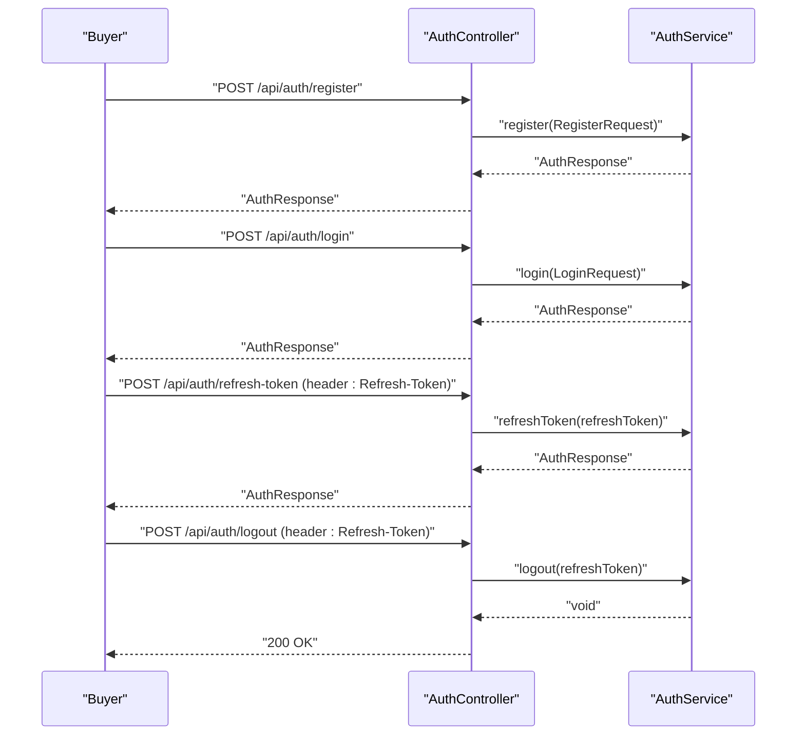

**Diagram sources**
- [AuthController.java:36-55](file://src/Backend/src/main/java/com/shoppeclone/backend/auth/controller/AuthController.java#L36-L55)
- [AuthService.java:8-21](file://src/Backend/src/main/java/com/shoppeclone/backend/auth/service/AuthService.java#L8-L21)

**Section sources**
- [AuthController.java:31-98](file://src/Backend/src/main/java/com/shoppeclone/backend/auth/controller/AuthController.java#L31-L98)
- [AuthService.java:8-21](file://src/Backend/src/main/java/com/shoppeclone/backend/auth/service/AuthService.java#L8-L21)

#### Product Browsing and Shopping Cart
- Browse Products: Retrieve product listings by shop, category, or search terms.
- Manage Cart: Add, update, remove items, and clear the cart.
- View Profile and Addresses: Access and manage personal information and delivery addresses.

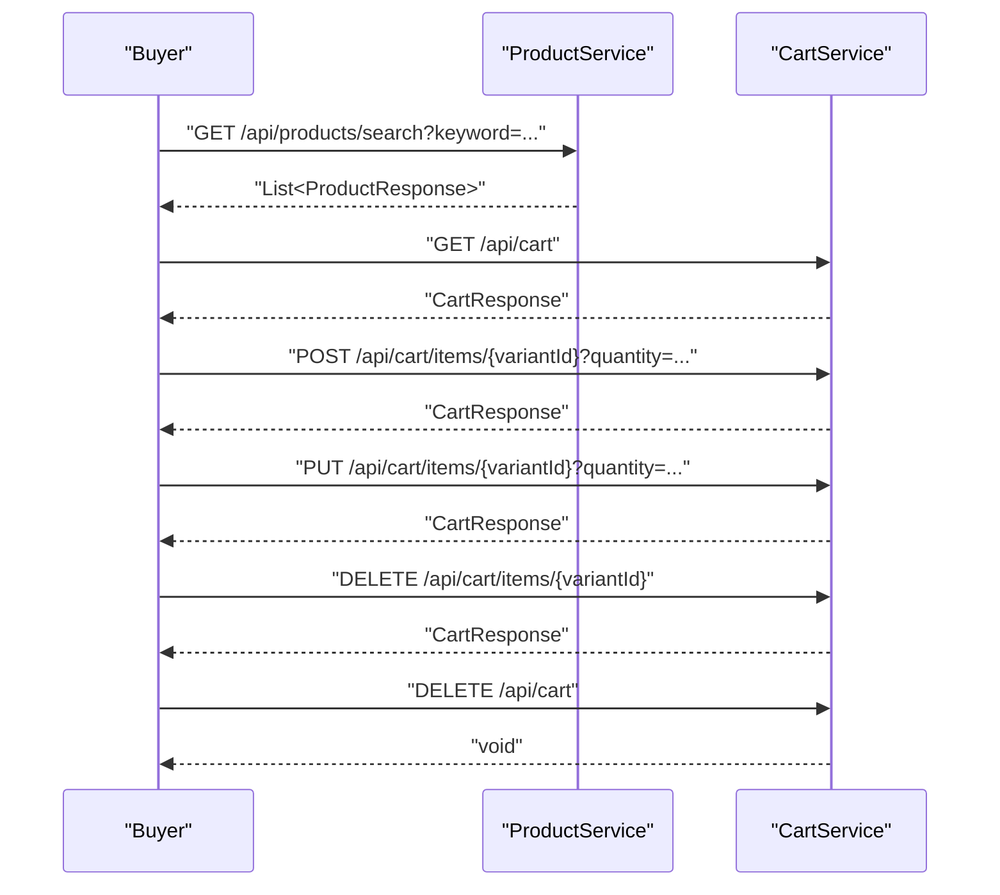

**Diagram sources**
- [ProductService.java:19-27](file://src/Backend/src/main/java/com/shoppeclone/backend/product/service/ProductService.java#L19-L27)
- [CartService.java:5-15](file://src/Backend/src/main/java/com/shoppeclone/backend/cart/service/CartService.java#L5-L15)

**Section sources**
- [ProductService.java:10-54](file://src/Backend/src/main/java/com/shoppeclone/backend/product/service/ProductService.java#L10-L54)
- [CartService.java:1-16](file://src/Backend/src/main/java/com/shoppeclone/backend/cart/service/CartService.java#L1-L16)
- [UserService.java:9-27](file://src/Backend/src/main/java/com/shoppeclone/backend/user/service/UserService.java#L9-L27)

#### Order Processing and Payment
- Place Order: Submit an order with shipping details and selected items.
- Payment Creation: Create a payment for the order via a supported payment method.
- Payment Status Updates: External webhooks update payment status; internal service updates accordingly.
- Order Tracking: Update shipment tracking and status transitions.

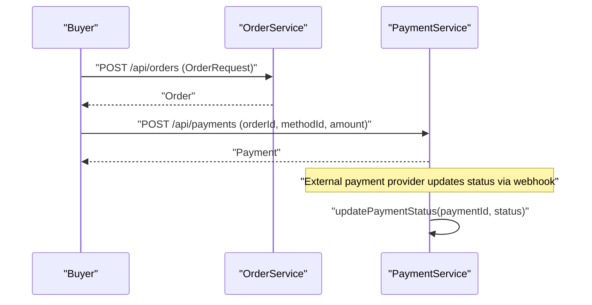

**Diagram sources**
- [OrderService.java:9-31](file://src/Backend/src/main/java/com/shoppeclone/backend/order/service/OrderService.java#L9-L31)
- [PaymentService.java:8-16](file://src/Backend/src/main/java/com/shoppeclone/backend/payment/service/PaymentService.java#L8-L16)

**Section sources**
- [OrderService.java:1-33](file://src/Backend/src/main/java/com/shoppeclone/backend/order/service/OrderService.java#L1-L33)
- [PaymentService.java:1-17](file://src/Backend/src/main/java/com/shoppeclone/backend/payment/service/PaymentService.java#L1-L17)

#### Post-Purchase Support
- Reviews: Submit product reviews after purchase.
- Refunds: Request refunds for eligible orders; admin approves or rejects.
- Disputes: Open disputes with optional image uploads; admin reviews and resolves.

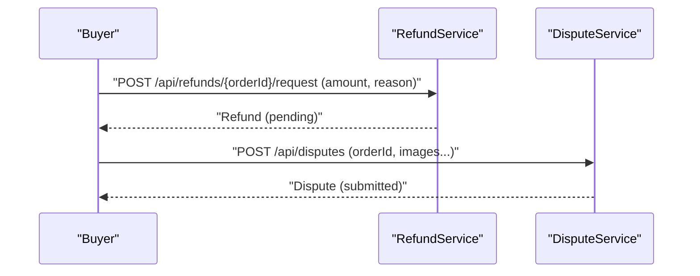

**Diagram sources**
- [RefundService.java:8-23](file://src/Backend/src/main/java/com/shoppeclone/backend/refund/service/RefundService.java#L8-L23)

**Section sources**
- [RefundService.java:1-24](file://src/Backend/src/main/java/com/shoppeclone/backend/refund/service/RefundService.java#L1-L24)

### Seller Workflows

#### Shop Registration and Verification
- Shop Registration: Sellers submit registration requests with required documents.
- Admin Review: Admin views pending shops and either approves or rejects with a reason.
- Shop Management: Sellers update shop details and manage analytics.

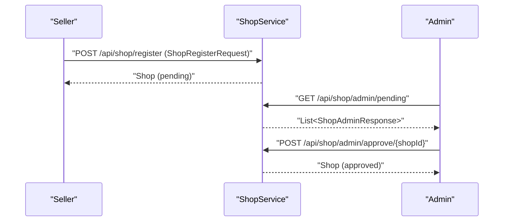

**Diagram sources**
- [ShopService.java:9-30](file://src/Backend/src/main/java/com/shoppeclone/backend/shop/service/ShopService.java#L9-L30)

**Section sources**
- [ShopService.java:1-31](file://src/Backend/src/main/java/com/shoppeclone/backend/shop/service/ShopService.java#L1-L31)

#### Product and Inventory Management
- Create and Update Products: Manage product metadata, variants, categories, and images.
- Visibility and Flash Sale Status: Toggle visibility and flash sale participation.

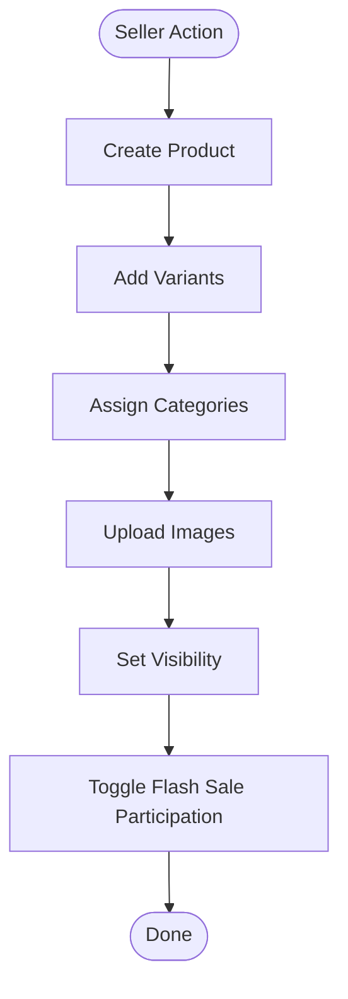

**Diagram sources**
- [ProductService.java:10-53](file://src/Backend/src/main/java/com/shoppeclone/backend/product/service/ProductService.java#L10-L53)

**Section sources**
- [ProductService.java:1-54](file://src/Backend/src/main/java/com/shoppeclone/backend/product/service/ProductService.java#L1-L54)

#### Order Fulfillment and Returns
- Receive Orders: Fetch orders by shop and update statuses.
- Shipment Tracking: Update tracking codes and providers.
- Returns: Mark orders as returned after successful return processing.

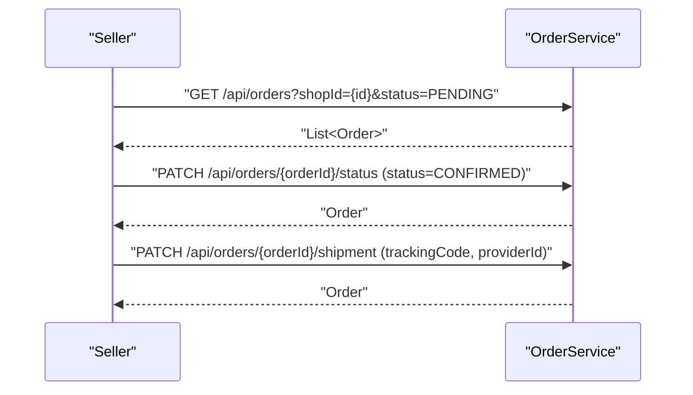

**Diagram sources**
- [OrderService.java:16-27](file://src/Backend/src/main/java/com/shoppeclone/backend/order/service/OrderService.java#L16-L27)

**Section sources**
- [OrderService.java:1-33](file://src/Backend/src/main/java/com/shoppeclone/backend/order/service/OrderService.java#L1-L33)

### Admin Workflows

#### Administrative Oversight
- Shop Approvals: Review and approve or reject shop registrations.
- User Management: Promote users to roles as needed.
- Maintenance: Run maintenance tasks to synchronize sales counters.

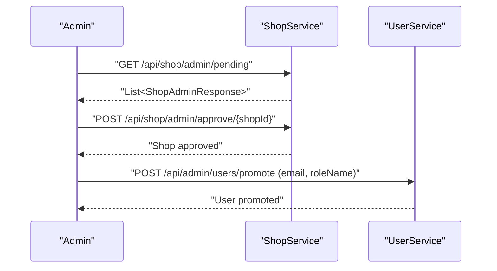

**Diagram sources**
- [ShopService.java:14-23](file://src/Backend/src/main/java/com/shoppeclone/backend/shop/service/ShopService.java#L14-L23)
- [UserService.java:25-27](file://src/Backend/src/main/java/com/shoppeclone/backend/user/service/UserService.java#L25-L27)

**Section sources**
- [ShopService.java:14-30](file://src/Backend/src/main/java/com/shoppeclone/backend/shop/service/ShopService.java#L14-L30)
- [UserService.java:25-27](file://src/Backend/src/main/java/com/shoppeclone/backend/user/service/UserService.java#L25-L27)

### Flash Sale System Workflow
- Campaign and Slot Management: Admin creates campaigns and time slots.
- Shop Registration: Sellers register for specific slots.
- Real-time Ordering: Buyers place orders during the flash sale event.
- Concurrency Handling: The system is designed to handle high concurrency; a dedicated simulator tests race conditions and inventory integrity.

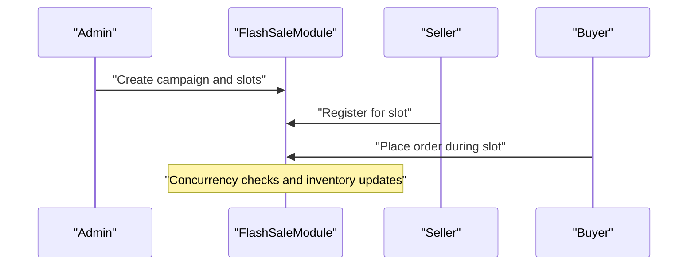

**Diagram sources**
- [README.md:239-252](file://README.md#L239-L252)

**Section sources**
- [README.md:213-226](file://README.md#L213-L226)
- [README.md:239-252](file://README.md#L239-L252)

## Dependency Analysis
The system exhibits clear module boundaries with service interfaces defining contracts. Controllers depend on services, and services operate against repositories and external integrations. There is minimal direct coupling between modules, enabling maintainability and testability.

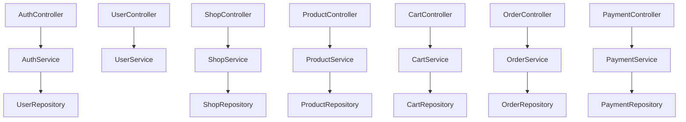

**Diagram sources**
- [AuthController.java:22-26](file://src/Backend/src/main/java/com/shoppeclone/backend/auth/controller/AuthController.java#L22-L26)
- [UserService.java:9-27](file://src/Backend/src/main/java/com/shoppeclone/backend/user/service/UserService.java#L9-L27)
- [ShopService.java:9-30](file://src/Backend/src/main/java/com/shoppeclone/backend/shop/service/ShopService.java#L9-L30)
- [ProductService.java:10-53](file://src/Backend/src/main/java/com/shoppeclone/backend/product/service/ProductService.java#L10-L53)
- [CartService.java:5-15](file://src/Backend/src/main/java/com/shoppeclone/backend/cart/service/CartService.java#L5-L15)
- [OrderService.java:9-31](file://src/Backend/src/main/java/com/shoppeclone/backend/order/service/OrderService.java#L9-L31)
- [PaymentService.java:8-16](file://src/Backend/src/main/java/com/shoppeclone/backend/payment/service/PaymentService.java#L8-L16)

**Section sources**
- [README.md:60-76](file://README.md#L60-L76)

## Performance Considerations
- Concurrency: The flash sale simulator targets race condition testing and inventory integrity under load.
- Caching and Indexing: Consider adding indexes on frequently queried fields (e.g., product variants, order identifiers).
- Asynchronous Tasks: Offload non-critical tasks (e.g., notifications, analytics) to background jobs.
- Circuit Breakers: Integrate resilience patterns for external webhooks and third-party services.

[No sources needed since this section provides general guidance]

## Troubleshooting Guide
- Authentication Failures: Verify JWT secret configuration and token expiration settings.
- Email OTP Issues: Confirm SMTP credentials and OTP expiration values.
- Payment Webhooks: Ensure webhook endpoints are reachable and properly parse payload signatures.
- Flash Sale Anomalies: Use the simulator to reproduce and isolate issues; validate inventory decrement logic.

**Section sources**
- [README.md:127-148](file://README.md#L127-L148)
- [README.md:239-252](file://README.md#L239-L252)

## Conclusion
The platform provides a comprehensive e-commerce solution with well-defined buyer, seller, and admin workflows. Clear module boundaries and service interfaces enable scalable development and testing. The documented sequences and integration points help teams implement, extend, and troubleshoot end-to-end business processes effectively.

[No sources needed since this section summarizes without analyzing specific files]

## Appendices
- Endpoint Reference: See the README for a categorized list of endpoints by module.
- Startup Behavior: On startup, default roles, categories, and payment methods are seeded; voucher and product seeders initialize baseline data.

**Section sources**
- [README.md:213-227](file://README.md#L213-L227)
- [README.md:178-186](file://README.md#L178-L186)