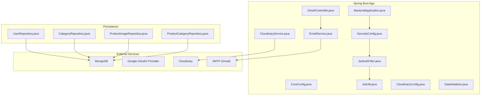
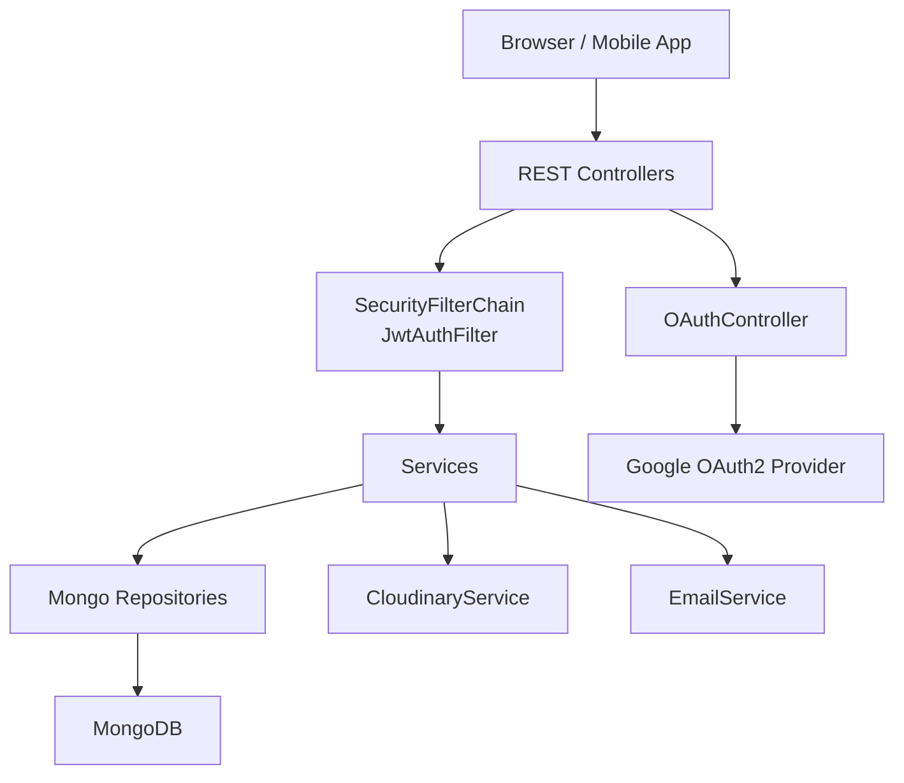
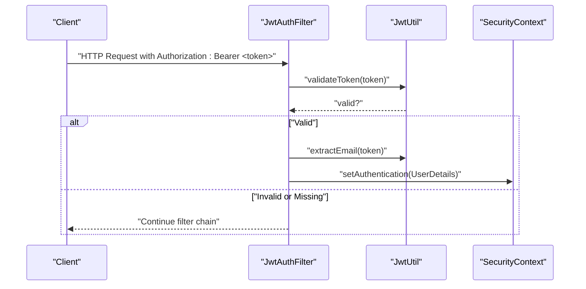
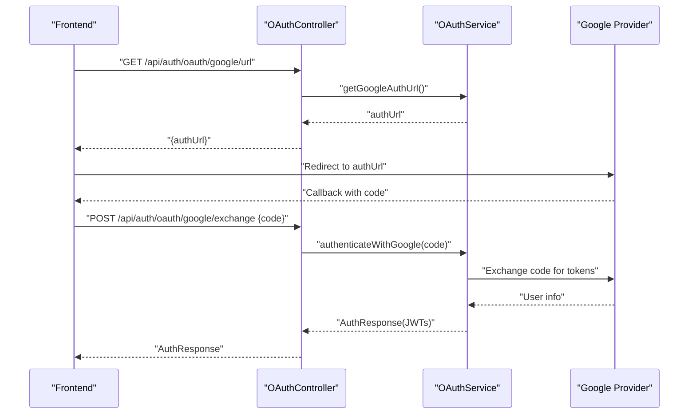
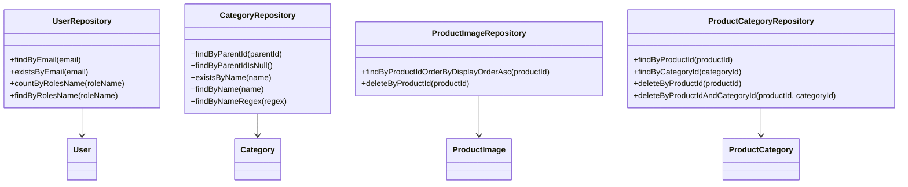
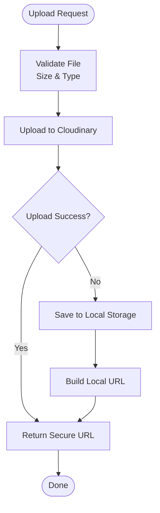
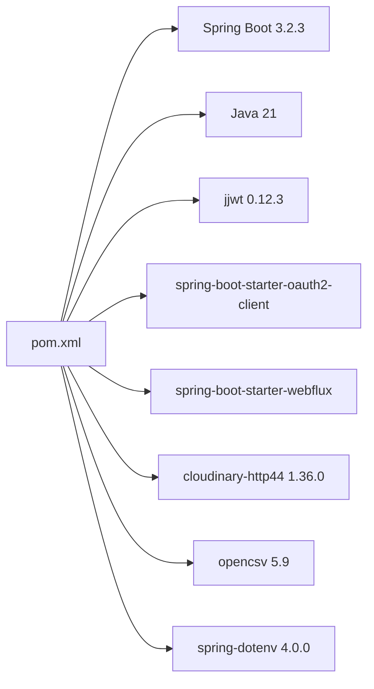

# Technology Stack & Dependencies

<cite>
**Referenced Files in This Document**
- [pom.xml](file://src\Backend\pom.xml)
- [application.properties](file://src\Backend\src\main\resources\application.properties)
- [BackendApplication.java](file://src\Backend\src\main\java\com\shoppeclone\backend\BackendApplication.java)
- [SecurityConfig.java](file://src\Backend\src\main\java\com\shoppeclone\backend\auth\security\SecurityConfig.java)
- [JwtUtil.java](file://src\Backend\src\main\java\com\shoppeclone\backend\auth\security\JwtUtil.java)
- [JwtAuthFilter.java](file://src\Backend\src\main\java\com\shoppeclone\backend\auth\security\JwtAuthFilter.java)
- [OAuthController.java](file://src\Backend\src\main\java\com\shoppeclone\backend\auth\controller\OAuthController.java)
- [CloudinaryConfig.java](file://src\Backend\src\main\java\com\shoppeclone\backend\common\config\CloudinaryConfig.java)
- [CloudinaryService.java](file://src\Backend\src\main\java\com\shoppeclone\backend\common\service\CloudinaryService.java)
- [CorsConfig.java](file://src\Backend\src\main\java\com\shoppeclone\backend\common\config\CorsConfig.java)
- [DataInitializer.java](file://src\Backend\src\main\java\com\shoppeclone\backend\common\config\DataInitializer.java)
- [EmailService.java](file://src\Backend\src\main\java\com\shoppeclone\backend\common\service\EmailService.java)
- [UserRepository.java](file://src\Backend\src\main\java\com\shoppeclone\backend\auth\repository\UserRepository.java)
- [CategoryRepository.java](file://src\Backend\src\main\java\com\shoppeclone\backend\product\repository\CategoryRepository.java)
- [ProductImageRepository.java](file://src\Backend\src\main\java\com\shoppeclone\backend\product\repository\ProductImageRepository.java)
- [ProductCategoryRepository.java](file://src\Backend\src\main\java\com\shoppeclone\backend\product\repository\ProductCategoryRepository.java)
- [MONGODB_SETUP_GUIDE.md](file://src\Backend\MONGODB_SETUP_GUIDE.md)
</cite>

## Table of Contents
1. [Introduction](#introduction)
2. [Project Structure](#project-structure)
3. [Core Components](#core-components)
4. [Architecture Overview](#architecture-overview)
5. [Detailed Component Analysis](#detailed-component-analysis)
6. [Dependency Analysis](#dependency-analysis)
7. [Performance Considerations](#performance-considerations)
8. [Troubleshooting Guide](#troubleshooting-guide)
9. [Conclusion](#conclusion)
10. [Appendices](#appendices)

## Introduction
This document provides a comprehensive overview of the e-commerce platform’s technology stack and dependencies. It explains the purpose and role of each technology in the architecture, highlights version compatibility, licensing considerations, and rationale for technology choices. It also includes official documentation and community resource links for each major component.

## Project Structure
The backend is a Spring Boot 3.2.3 application written in Java 21, using MongoDB for persistence, Spring Security with JWT for authentication, Spring Security OAuth2 Client for Google sign-in, Cloudinary for image hosting, and Spring Mail for email notifications. Configuration is centralized via application.properties and Spring configuration classes.

**Diagram sources**
- [BackendApplication.java:1-14](file://src\Backend\src\main\java\com\shoppeclone\backend\BackendApplication.java#L1-L14)
- [SecurityConfig.java:1-92](file://src\Backend\src\main\java\com\shoppeclone\backend\auth\security\SecurityConfig.java#L1-L92)
- [CorsConfig.java:1-30](file://src\Backend\src\main\java\com\shoppeclone\backend\common\config\CorsConfig.java#L1-L30)
- [JwtUtil.java:1-65](file://src\Backend\src\main\java\com\shoppeclone\backend\auth\security\JwtUtil.java#L1-L65)
- [JwtAuthFilter.java:1-46](file://src\Backend\src\main\java\com\shoppeclone\backend\auth\security\JwtAuthFilter.java#L1-L46)
- [OAuthController.java:1-36](file://src\Backend\src\main\java\com\shoppeclone\backend\auth\controller\OAuthController.java#L1-L36)
- [CloudinaryConfig.java:1-30](file://src\Backend\src\main\java\com\shoppeclone\backend\common\config\CloudinaryConfig.java#L1-L30)
- [CloudinaryService.java:1-137](file://src\Backend\src\main\java\com\shoppeclone\backend\common\service\CloudinaryService.java#L1-L137)
- [EmailService.java:1-197](file://src\Backend\src\main\java\com\shoppeclone\backend\common\service\EmailService.java#L1-L197)
- [DataInitializer.java:1-203](file://src\Backend\src\main\java\com\shoppeclone\backend\common\config\DataInitializer.java#L1-L203)
- [UserRepository.java:1-15](file://src\Backend\src\main\java\com\shoppeclone\backend\auth\repository\UserRepository.java#L1-L15)
- [CategoryRepository.java:1-20](file://src\Backend\src\main\java\com\shoppeclone\backend\product\repository\CategoryRepository.java#L1-L20)
- [ProductImageRepository.java:1-11](file://src\Backend\src\main\java\com\shoppeclone\backend\product\repository\ProductImageRepository.java#L1-L11)
- [ProductCategoryRepository.java:1-15](file://src\Backend\src\main\java\com\shoppeclone\backend\product\repository\ProductCategoryRepository.java#L1-L15)

**Section sources**
- [pom.xml:1-173](file://src\Backend\pom.xml#L1-L173)
- [application.properties:1-114](file://src\Backend\src\main\resources\application.properties#L1-L114)
- [BackendApplication.java:1-14](file://src\Backend\src\main\java\com\shoppeclone\backend\BackendApplication.java#L1-L14)

## Core Components
- Spring Boot 3.2.3: Application framework providing auto-configuration, embedded server, and starters.
- Java 21: Language and runtime for modern concurrency and performance.
- Spring Web: REST controllers and web MVC.
- Spring Security: Authentication, authorization, CSRF disabled, CORS configured, stateless JWT filter chain.
- Spring Data MongoDB: Reactive and imperative MongoDB access via repositories.
- Spring OAuth2 Client + WebFlux: OAuth2 client support and reactive HTTP client for external API calls.
- JWT (jjwt): Token generation and validation for stateless authentication.
- Cloudinary: Image upload and CDN fallback to local storage.
- Spring Mail: SMTP integration for OTP and notifications.
- Lombok: Reduces boilerplate code.
- OpenCSV: CSV import utilities.
- Dotenv: Environment variable loading via dotenv.

**Section sources**
- [pom.xml:23-135](file://src\Backend\pom.xml#L23-L135)
- [application.properties:58-95](file://src\Backend\src\main\resources\application.properties#L58-L95)
- [SecurityConfig.java:26-80](file://src\Backend\src\main\java\com\shoppeclone\backend\auth\security\SecurityConfig.java#L26-L80)

## Architecture Overview
The system follows a layered architecture:
- Presentation: REST controllers under package groups (auth, product, order, etc.).
- Application: Services implementing business logic.
- Infrastructure: Repositories, configuration beans, filters, and external integrations.
- Persistence: MongoDB collections mapped via Spring Data MongoDB.
- Security: Stateless JWT filter chain with method-level security enabled.

**Diagram sources**
- [SecurityConfig.java:26-80](file://src\Backend\src\main\java\com\shoppeclone\backend\auth\security\SecurityConfig.java#L26-L80)
- [JwtAuthFilter.java:23-45](file://src\Backend\src\main\java\com\shoppeclone\backend\auth\security\JwtAuthFilter.java#L23-L45)
- [OAuthController.java:18-34](file://src\Backend\src\main\java\com\shoppeclone\backend\auth\controller\OAuthController.java#L18-L34)
- [CloudinaryService.java:36-58](file://src\Backend\src\main\java\com\shoppeclone\backend\common\service\CloudinaryService.java#L36-L58)
- [EmailService.java:14-27](file://src\Backend\src\main\java\com\shoppeclone\backend\common\service\EmailService.java#L14-L27)

## Detailed Component Analysis

### Spring Security and JWT
- Purpose: Provide stateless authentication using signed JWT tokens.
- Implementation:
  - SecurityConfig disables CSRF, configures CORS, permits selected endpoints, secures others, sets stateless sessions, and registers JwtAuthFilter before the default form-based filter.
  - JwtUtil generates and validates HS256-signed access and refresh tokens using keys from application.properties.
  - JwtAuthFilter extracts Authorization header, validates token, loads user details, and sets authentication in SecurityContext.

**Diagram sources**
- [JwtAuthFilter.java:23-45](file://src\Backend\src\main\java\com\shoppeclone\backend\auth\security\JwtAuthFilter.java#L23-L45)
- [JwtUtil.java:49-64](file://src\Backend\src\main\java\com\shoppeclone\backend\auth\security\JwtUtil.java#L49-L64)

**Section sources**
- [SecurityConfig.java:26-80](file://src\Backend\src\main\java\com\shoppeclone\backend\auth\security\SecurityConfig.java#L26-L80)
- [JwtUtil.java:27-43](file://src\Backend\src\main\java\com\shoppeclone\backend\auth\security\JwtUtil.java#L27-L43)
- [JwtAuthFilter.java:23-45](file://src\Backend\src\main\java\com\shoppeclone\backend\auth\security\JwtAuthFilter.java#L23-L45)

### OAuth2 Google Sign-In
- Purpose: Allow users to authenticate via Google accounts.
- Implementation:
  - OAuthController exposes endpoints to obtain the Google OAuth URL and exchange the authorization code for an AuthResponse containing JWT tokens.
  - application.properties defines Google client credentials and provider endpoints.
  - WebFlux starter enables reactive HTTP client usage for provider interactions.

**Diagram sources**
- [OAuthController.java:18-34](file://src\Backend\src\main\java\com\shoppeclone\backend\auth\controller\OAuthController.java#L18-L34)
- [application.properties:58-67](file://src\Backend\src\main\resources\application.properties#L58-L67)

**Section sources**
- [OAuthController.java:18-34](file://src\Backend\src\main\java\com\shoppeclone\backend\auth\controller\OAuthController.java#L18-L34)
- [application.properties:58-67](file://src\Backend\src\main\resources\application.properties#L58-L67)

### MongoDB Integration
- Purpose: Persist users, products, orders, categories, and related entities.
- Implementation:
  - application.properties configures MongoDB Atlas connection string and database.
  - Repositories extend MongoRepository for CRUD operations.
  - DataInitializer seeds roles, categories, payment methods, and shipping providers on startup.

**Diagram sources**
- [UserRepository.java:7-15](file://src\Backend\src\main\java\com\shoppeclone\backend\auth\repository\UserRepository.java#L7-L15)
- [CategoryRepository.java:8-20](file://src\Backend\src\main\java\com\shoppeclone\backend\product\repository\CategoryRepository.java#L8-L20)
- [ProductImageRepository.java:7-11](file://src\Backend\src\main\java\com\shoppeclone\backend\product\repository\ProductImageRepository.java#L7-L11)
- [ProductCategoryRepository.java:7-15](file://src\Backend\src\main\java\com\shoppeclone\backend\product\repository\ProductCategoryRepository.java#L7-L15)

**Section sources**
- [application.properties:14-17](file://src\Backend\src\main\resources\application.properties#L14-L17)
- [DataInitializer.java:27-49](file://src\Backend\src\main\java\com\shoppeclone\backend\common\config\DataInitializer.java#L27-L49)

### Cloudinary Image Management
- Purpose: Host product images and ID cards with fallback to local storage.
- Implementation:
  - CloudinaryConfig creates a Cloudinary bean using environment variables.
  - CloudinaryService uploads images to Cloudinary, validates file types/sizes, and falls back to local storage if Cloudinary is unavailable. Also supports deletion by public ID.

**Diagram sources**
- [CloudinaryService.java:36-58](file://src\Backend\src\main\java\com\shoppeclone\backend\common\service\CloudinaryService.java#L36-L58)
- [CloudinaryService.java:60-88](file://src\Backend\src\main\java\com\shoppeclone\backend\common\service\CloudinaryService.java#L60-L88)

**Section sources**
- [CloudinaryConfig.java:21-28](file://src\Backend\src\main\java\com\shoppeclone\backend\common\config\CloudinaryConfig.java#L21-L28)
- [CloudinaryService.java:36-58](file://src\Backend\src\main\java\com\shoppeclone\backend\common\service\CloudinaryService.java#L36-L58)

### Email Notifications
- Purpose: Send OTP emails, login alerts, shop approvals, and flash sale notifications.
- Implementation:
  - EmailService uses Spring JavaMailSender configured via application.properties SMTP settings.

**Section sources**
- [EmailService.java:14-27](file://src\Backend\src\main\java\com\shoppeclone\backend\common\service\EmailService.java#L14-L27)
- [application.properties:73-80](file://src\Backend\src\main\resources\application.properties#L73-L80)

### CORS and Application Bootstrap
- Purpose: Configure cross-origin allowances and enable scheduling.
- Implementation:
  - CorsConfig defines allowed origins, headers, methods, credentials, and exposed headers.
  - BackendApplication enables scheduling for timed tasks.

**Section sources**
- [CorsConfig.java:14-28](file://src\Backend\src\main\java\com\shoppeclone\backend\common\config\CorsConfig.java#L14-L28)
- [BackendApplication.java:5-9](file://src\Backend\src\main\java\com\shoppeclone\backend\BackendApplication.java#L5-L9)

## Dependency Analysis
- Spring Boot Parent 3.2.3 pins dependency versions and provides convenient starters.
- Java 21 ensures modern language features and performance.
- jjwt 0.12.3 provides compact JWT with HS256 signing.
- Spring Security OAuth2 Client + WebFlux integrate with external providers and reactive HTTP.
- Cloudinary HTTP client 1.36.0 integrates with Cloudinary REST API.
- OpenCSV 5.9 supports CSV import utilities.
- Dotenv 4.0.0 loads environment variables from .env during development.

**Diagram sources**
- [pom.xml:5-21](file://src\Backend\pom.xml#L5-L21)
- [pom.xml:48-132](file://src\Backend\pom.xml#L48-L132)

**Section sources**
- [pom.xml:5-21](file://src\Backend\pom.xml#L5-L21)
- [pom.xml:48-132](file://src\Backend\pom.xml#L48-L132)

## Performance Considerations
- JWT stateless sessions reduce server-side session overhead.
- WebFlux enables efficient non-blocking HTTP calls for OAuth2 exchanges.
- MongoDB Atlas scaling and indexing should be considered for high-volume reads/writes.
- Cloudinary offloads image delivery; local fallback ensures resilience.
- CORS configuration allows development flexibility; tighten origins for production.
- Tomcat thread tuning in application.properties supports flash sale traffic spikes.

**Section sources**
- [application.properties:103-108](file://src\Backend\src\main\resources\application.properties#L103-L108)

## Troubleshooting Guide
- MongoDB connectivity:
  - Verify connection string and database name in application.properties.
  - Confirm network access to MongoDB Atlas and firewall rules.
- JWT secrets and expiration:
  - Ensure JWT_SECRET is at least 256-bit length and JWT_EXPIRATION/REFRESH values are set appropriately.
- OAuth2 Google:
  - Confirm GOOGLE_CLIENT_ID and GOOGLE_CLIENT_SECRET are set and redirect URI matches provider configuration.
- Cloudinary:
  - Set CLOUDINARY_CLOUD_NAME, API_KEY, and API_SECRET; if missing, uploads fall back to local storage.
- Email:
  - Validate MAIL_USERNAME and MAIL_PASSWORD; ensure SMTP TLS is enabled.
- CORS:
  - Adjust allowed origins for production deployments.

**Section sources**
- [application.properties:14-17](file://src\Backend\src\main\resources\application.properties#L14-L17)
- [application.properties:25, 31, 82:25-31](file://src\Backend\src\main\resources\application.properties#L25-L31)
- [application.properties:59, 60:59-60](file://src\Backend\src\main\resources\application.properties#L59-L60)
- [application.properties:87-89](file://src\Backend\src\main\resources\application.properties#L87-L89)
- [application.properties:73-80](file://src\Backend\src\main\resources\application.properties#L73-L80)
- [application.properties:92-95](file://src\Backend\src\main\resources\application.properties#L92-L95)

## Conclusion
The platform leverages a modern, scalable stack centered on Spring Boot 3.2.3 and Java 21. MongoDB provides flexible document storage, JWT ensures stateless authentication, OAuth2 Google enables social login, Cloudinary handles media, and Spring Mail powers notifications. The configuration and modular design support rapid development and deployment while maintaining security and performance.

## Appendices

### Version Compatibility and Licensing Notes
- Spring Boot 3.2.3: MIT licensed; aligns with Java 21 and Jakarta EE namespaces.
- Java 21: Oracle JDK license; LTS support recommended for production.
- MongoDB: Server-side GPL v3 for community server; Atlas cloud offering available.
- jjwt 0.12.3: Apache 2.0 license.
- Spring Security OAuth2 Client/WebFlux: Apache 2.0 license.
- Cloudinary HTTP client 1.36.0: MIT license.
- OpenCSV 5.9: Apache 2.0 license.
- Dotenv 4.0.0: MIT license.

**Section sources**
- [pom.xml:5, 18-21:5-21](file://src\Backend\pom.xml#L5-L21)
- [MONGODB_SETUP_GUIDE.md:178-180](file://src\Backend\MONGODB_SETUP_GUIDE.md#L178-L180)

### Official Documentation and Community Resources
- Spring Boot: https://docs.spring.io/spring-boot/docs/current/reference/htmlsingle/
- Spring Security: https://docs.spring.io/spring-security/reference/index.html
- Spring Data MongoDB: https://docs.spring.io/spring-data/mongodb/docs/current/reference/html/
- JWT (jjwt): https://github.com/jwtk/jjwt
- OAuth2 Client: https://docs.spring.io/spring-security/reference/servlet/oauth2/client/index.html
- WebFlux: https://docs.spring.io/spring-framework/reference/web/webflux.html
- Cloudinary: https://cloudinary.com/documentation
- OpenCSV: https://opencsv.sourceforge.net/
- Dotenv: https://github.com/paulschwarz/spring-dotenv
- MongoDB: https://www.mongodb.com/docs/

**Section sources**
- [MONGODB_SETUP_GUIDE.md:178-180](file://src\Backend\MONGODB_SETUP_GUIDE.md#L178-L180)