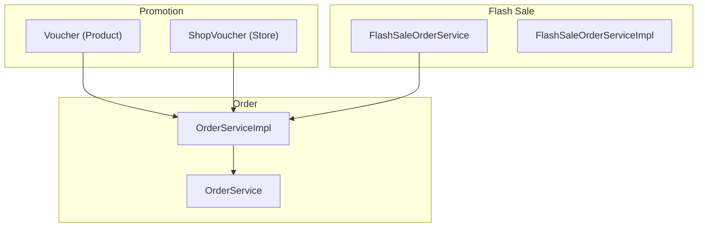
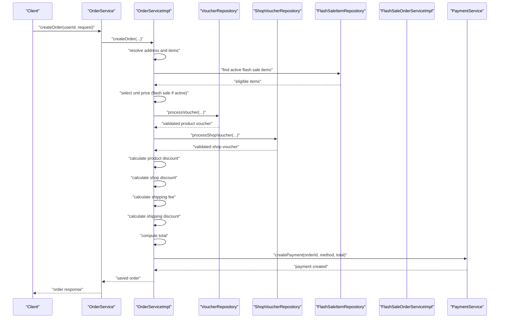
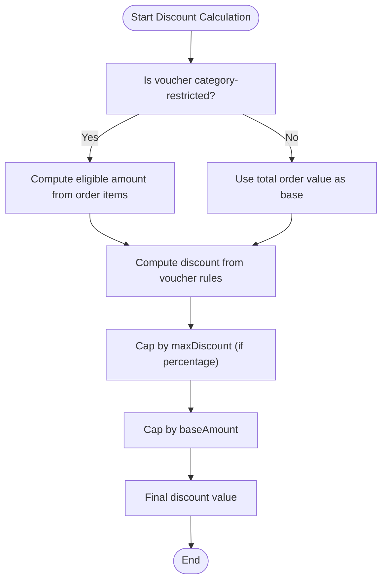
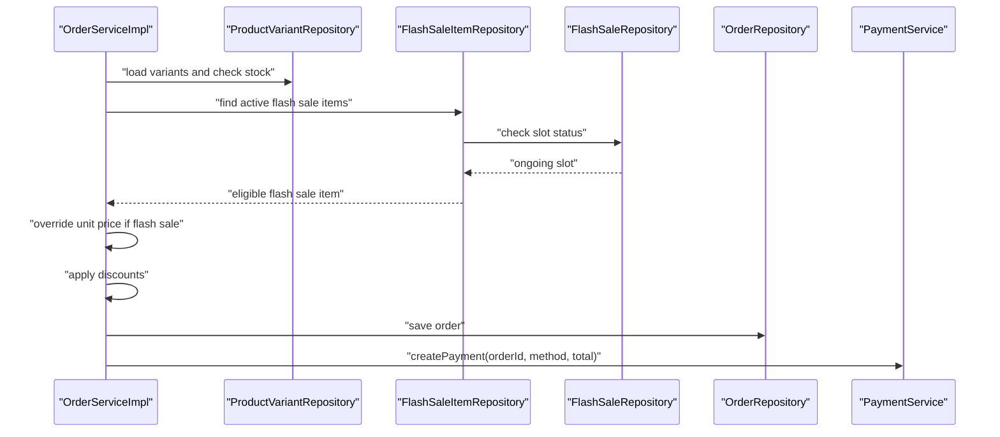
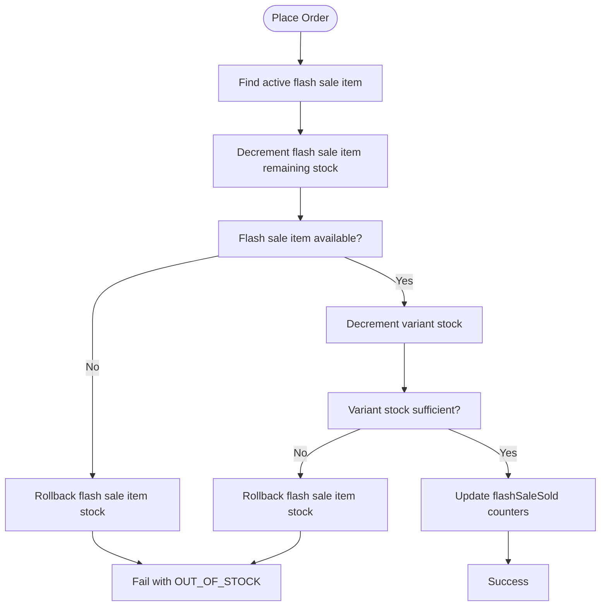
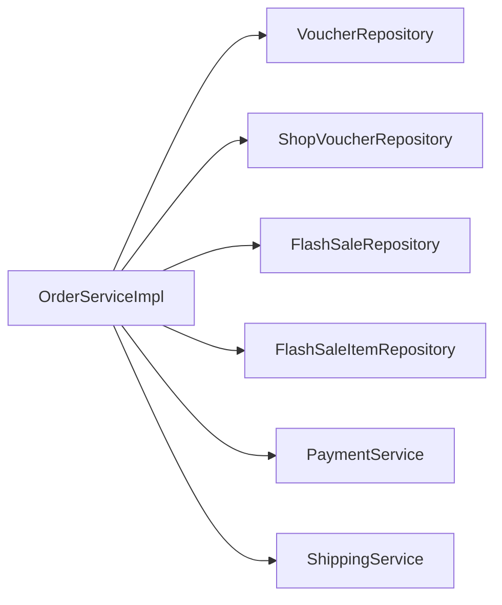

# Discount Calculation Engine

<cite>
**Referenced Files in This Document**
- [Voucher.java](file://src/Backend/src/main/java/com/shoppeclone/backend/promotion/entity/Voucher.java)
- [ShopVoucher.java](file://src/Backend/src/main/java/com/shoppeclone/backend/promotion/entity/ShopVoucher.java)
- [VoucherService.java](file://src/Backend/src/main/java/com/shoppeclone/backend/promotion/service/VoucherService.java)
- [ShopVoucherService.java](file://src/Backend/src/main/java/com/shoppeclone/backend/promotion/service/ShopVoucherService.java)
- [OrderServiceImpl.java](file://src/Backend/src/main/java/com/shoppeclone/backend/order/service/impl/OrderServiceImpl.java)
- [OrderService.java](file://src/Backend/src/main/java/com/shoppeclone/backend/order/service/OrderService.java)
- [FlashSaleOrderServiceImpl.java](file://src/Backend/src/main/java/com/shoppeclone/backend/promotion/flashsale/service/impl/FlashSaleOrderServiceImpl.java)
- [FlashSaleOrderService.java](file://src/Backend/src/main/java/com/shoppeclone/backend/promotion/flashsale/service/FlashSaleOrderService.java)
- [PaymentPromotionIntegrationTest.java](file://src/Backend/src/test/java/com/shoppeclone/backend/integration/PaymentPromotionIntegrationTest.java)
</cite>

## Table of Contents
1. [Introduction](#introduction)
2. [Project Structure](#project-structure)
3. [Core Components](#core-components)
4. [Architecture Overview](#architecture-overview)
5. [Detailed Component Analysis](#detailed-component-analysis)
6. [Dependency Analysis](#dependency-analysis)
7. [Performance Considerations](#performance-considerations)
8. [Troubleshooting Guide](#troubleshooting-guide)
9. [Conclusion](#conclusion)
10. [Appendices](#appendices)

## Introduction
This document describes the discount calculation engine responsible for handling complex promotional pricing scenarios. It covers how multiple discounts stack and prioritize, including product vouchers, shipping vouchers, shop vouchers, and flash sale pricing. It documents the integration points with order processing, payment calculation, and inventory management, along with validation rules, edge-case handling, and performance considerations. Practical examples illustrate discount precedence, maximum discount limits, and promotional bundling scenarios.

## Project Structure
The discount engine spans three primary areas:
- Promotion domain: product and shop vouchers with discount metadata and validation rules
- Order domain: order creation, discount application, and payment linkage
- Flash sale domain: real-time inventory synchronization and price overrides during flash sale windows

**Diagram sources**
- [Voucher.java:1-51](file://src/Backend/src/main/java/com/shoppeclone/backend/promotion/entity/Voucher.java#L1-L51)
- [ShopVoucher.java:1-28](file://src/Backend/src/main/java/com/shoppeclone/backend/promotion/entity/ShopVoucher.java#L1-L28)
- [OrderServiceImpl.java:1-881](file://src/Backend/src/main/java/com/shoppeclone/backend/order/service/impl/OrderServiceImpl.java#L1-L881)
- [FlashSaleOrderServiceImpl.java:1-294](file://src/Backend/src/main/java/com/shoppeclone/backend/promotion/flashsale/service/impl/FlashSaleOrderServiceImpl.java#L1-L294)

**Section sources**
- [OrderServiceImpl.java:290-383](file://src/Backend/src/main/java/com/shoppeclone/backend/order/service/impl/OrderServiceImpl.java#L290-L383)
- [FlashSaleOrderServiceImpl.java:36-116](file://src/Backend/src/main/java/com/shoppeclone/backend/promotion/flashsale/service/impl/FlashSaleOrderServiceImpl.java#L36-L116)

## Core Components
- Voucher (Product): Defines discount type (percentage or fixed amount), discount value, category restrictions, minimum spend, maximum discount cap, validity period, and usage counters.
- ShopVoucher (Store): Defines shop-specific discount, minimum spend, validity period, and usage counters.
- OrderServiceImpl: Orchestrates order creation, validates and applies product/ship/store discounts, computes totals, and triggers payment creation.
- FlashSaleOrderServiceImpl: Enforces flash sale timing and stock constraints, synchronizes sold counters, and integrates with order processing to override unit prices during flash sale windows.

Key responsibilities:
- Validation: eligibility checks (category, min spend, expiry, availability)
- Stacking and prioritization: product discount, shipping discount, shop discount
- Capping: percentage discounts capped by maxDiscount and baseAmount
- Inventory: flash sale stock decremented and sold counters updated

**Section sources**
- [Voucher.java:25-49](file://src/Backend/src/main/java/com/shoppeclone/backend/promotion/entity/Voucher.java#L25-L49)
- [ShopVoucher.java:20-27](file://src/Backend/src/main/java/com/shoppeclone/backend/promotion/entity/ShopVoucher.java#L20-L27)
- [OrderServiceImpl.java:386-546](file://src/Backend/src/main/java/com/shoppeclone/backend/order/service/impl/OrderServiceImpl.java#L386-L546)
- [FlashSaleOrderServiceImpl.java:36-116](file://src/Backend/src/main/java/com/shoppeclone/backend/promotion/flashsale/service/impl/FlashSaleOrderServiceImpl.java#L36-L116)

## Architecture Overview
The discount engine integrates with order creation and flash sale logic to compute final payable amounts. The flow ensures:
- Unit price selection considers flash sale pricing when applicable
- Discounts are applied in a defined order
- Totals reflect product discount, shop discount, and shipping discount
- Payment creation is triggered with the computed total

**Diagram sources**
- [OrderServiceImpl.java:60-189](file://src/Backend/src/main/java/com/shoppeclone/backend/order/service/impl/OrderServiceImpl.java#L60-L189)
- [OrderServiceImpl.java:290-383](file://src/Backend/src/main/java/com/shoppeclone/backend/order/service/impl/OrderServiceImpl.java#L290-L383)
- [FlashSaleOrderServiceImpl.java:36-116](file://src/Backend/src/main/java/com/shoppeclone/backend/promotion/flashsale/service/impl/FlashSaleOrderServiceImpl.java#L36-L116)

## Detailed Component Analysis

### Discount Stacking Rules and Priority Ordering
The system applies discounts in a strict sequence:
1. Product Voucher Discount
   - Base amount can be total order value or category-restricted eligible amount
   - Percentage capped by maxDiscount and baseAmount
2. Shipping Voucher Discount
   - Applied only if shipping fee exists; calculated against shipping cost
3. Shop Voucher Discount
   - Applied to total order value after product and shipping discounts

Validation order:
- Eligibility checks per voucher type (category, min spend, expiry, availability)
- Usage uniqueness per user per voucher code across orders
- Quantity/availability checks

Edge cases handled:
- Category-restricted vouchers require at least one eligible item
- Out-of-stock vouchers and expired/inactive vouchers are rejected
- Discount caps prevent over-application

**Section sources**
- [OrderServiceImpl.java:294-332](file://src/Backend/src/main/java/com/shoppeclone/backend/order/service/impl/OrderServiceImpl.java#L294-L332)
- [OrderServiceImpl.java:386-444](file://src/Backend/src/main/java/com/shoppeclone/backend/order/service/impl/OrderServiceImpl.java#L386-L444)
- [OrderServiceImpl.java:467-503](file://src/Backend/src/main/java/com/shoppeclone/backend/order/service/impl/OrderServiceImpl.java#L467-L503)
- [OrderServiceImpl.java:505-546](file://src/Backend/src/main/java/com/shoppeclone/backend/order/service/impl/OrderServiceImpl.java#L505-L546)

### Calculation Algorithms
- Product Voucher
  - Base amount: total or eligible amount depending on category restriction
  - Discount: percentage of baseAmount or fixed amount
  - Caps: min(maxDiscount, baseAmount)
- Shipping Voucher
  - Discount: fixed amount or percentage of shipping fee, capped at shipping fee
- Shop Voucher
  - Discount: fixed amount, capped at baseAmount (total order value)

**Diagram sources**
- [OrderServiceImpl.java:467-503](file://src/Backend/src/main/java/com/shoppeclone/backend/order/service/impl/OrderServiceImpl.java#L467-L503)

**Section sources**
- [OrderServiceImpl.java:479-503](file://src/Backend/src/main/java/com/shoppeclone/backend/order/service/impl/OrderServiceImpl.java#L479-L503)

### Integration with Order Processing and Payment
- Order creation resolves items, validates stock, and selects unit price considering flash sale overrides
- After discount computation, order total is set and payment is created immediately
- Cart items are removed upon successful order creation when applicable

**Diagram sources**
- [OrderServiceImpl.java:107-189](file://src/Backend/src/main/java/com/shoppeclone/backend/order/service/impl/OrderServiceImpl.java#L107-L189)
- [OrderServiceImpl.java:290-383](file://src/Backend/src/main/java/com/shoppeclone/backend/order/service/impl/OrderServiceImpl.java#L290-L383)
- [FlashSaleOrderServiceImpl.java:36-116](file://src/Backend/src/main/java/com/shoppeclone/backend/promotion/flashsale/service/impl/FlashSaleOrderServiceImpl.java#L36-L116)

**Section sources**
- [OrderServiceImpl.java:107-189](file://src/Backend/src/main/java/com/shoppeclone/backend/order/service/impl/OrderServiceImpl.java#L107-L189)
- [OrderServiceImpl.java:374-382](file://src/Backend/src/main/java/com/shoppeclone/backend/order/service/impl/OrderServiceImpl.java#L374-L382)

### Inventory Management and Flash Sale Synchronization
- During order placement, flash sale item remaining stock is decremented atomically
- Variant and product flashSaleSold counters are incremented
- If variant stock becomes insufficient after flash sale decrement, the operation rolls back flash sale item stock

**Diagram sources**
- [FlashSaleOrderServiceImpl.java:36-116](file://src/Backend/src/main/java/com/shoppeclone/backend/promotion/flashsale/service/impl/FlashSaleOrderServiceImpl.java#L36-L116)

**Section sources**
- [FlashSaleOrderServiceImpl.java:36-116](file://src/Backend/src/main/java/com/shoppeclone/backend/promotion/flashsale/service/impl/FlashSaleOrderServiceImpl.java#L36-L116)

### Validation Rules and Edge Case Handling
- Product Voucher
  - Category restriction requires at least one eligible item; otherwise reject
  - Min spend checked against total or eligible amount
  - Expiry and activity window enforced
  - Quantity check prevents out-of-stock usage
  - User cannot reuse the same voucher code across orders
- Shipping Voucher
  - Only applied if shipping fee exists
  - Same eligibility checks as product voucher
- Shop Voucher
  - Must belong to the shop of the order
  - Min spend checked against total order value
  - Expiry and quantity checks enforced
- Flash Sale
  - Only active ongoing slots considered
  - Remaining stock validated before decrement
  - Atomic updates with rollback on constraint violation

**Section sources**
- [OrderServiceImpl.java:386-444](file://src/Backend/src/main/java/com/shoppeclone/backend/order/service/impl/OrderServiceImpl.java#L386-L444)
- [OrderServiceImpl.java:505-546](file://src/Backend/src/main/java/com/shoppeclone/backend/order/service/impl/OrderServiceImpl.java#L505-L546)
- [FlashSaleOrderServiceImpl.java:36-116](file://src/Backend/src/main/java/com/shoppeclone/backend/promotion/flashsale/service/impl/FlashSaleOrderServiceImpl.java#L36-L116)

### Examples and Scenarios
- Discount Precedence
  - Product discount computed first (category-restricted if applicable)
  - Shipping discount computed second (only if shipping fee exists)
  - Shop discount computed third
- Maximum Discount Limits
  - Percentage product vouchers capped by maxDiscount and baseAmount
  - Fixed amount vouchers capped by baseAmount
- Promotional Bundling
  - Using a product voucher and a shop voucher together is supported
  - Shipping voucher can be combined with product/shop discounts when shipping fee exists

**Section sources**
- [OrderServiceImpl.java:294-332](file://src/Backend/src/main/java/com/shoppeclone/backend/order/service/impl/OrderServiceImpl.java#L294-L332)
- [OrderServiceImpl.java:479-503](file://src/Backend/src/main/java/com/shoppeclone/backend/order/service/impl/OrderServiceImpl.java#L479-L503)

## Dependency Analysis
The discount engine depends on repositories for vouchers, shop vouchers, and flash sale items, and integrates with payment and shipping services. Cohesion is strong within OrderServiceImpl for discount logic; coupling is primarily through repositories and external services.

**Diagram sources**
- [OrderServiceImpl.java:55-58](file://src/Backend/src/main/java/com/shoppeclone/backend/order/service/impl/OrderServiceImpl.java#L55-L58)

**Section sources**
- [OrderServiceImpl.java:55-58](file://src/Backend/src/main/java/com/shoppeclone/backend/order/service/impl/OrderServiceImpl.java#L55-L58)

## Performance Considerations
- Early validation reduces unnecessary repository calls and transaction overhead
- Category-based eligible amount computation iterates order items; keep order sizes reasonable or cache category membership
- Flash sale stock updates use atomic find-and-modify operations to avoid race conditions
- Payment creation occurs after discount computation to minimize retries
- Consider caching frequently accessed voucher/shop voucher data and flash sale item statuses for high-throughput scenarios

## Troubleshooting Guide
Common issues and resolutions:
- Voucher not found or expired: Verify code correctness and validity dates
- Category restriction mismatch: Ensure at least one item belongs to the restricted categories
- Min spend not met: Increase order value or choose a different voucher
- Out of stock: Confirm availability and timing; flash sale items are limited
- User already used voucher: Enforce uniqueness per user per code across orders
- Shipping discount not applied: Ensure shipping fee exists prior to discount calculation

**Section sources**
- [OrderServiceImpl.java:386-444](file://src/Backend/src/main/java/com/shoppeclone/backend/order/service/impl/OrderServiceImpl.java#L386-L444)
- [OrderServiceImpl.java:505-546](file://src/Backend/src/main/java/com/shoppeclone/backend/order/service/impl/OrderServiceImpl.java#L505-L546)

## Conclusion
The discount calculation engine provides a robust, validated, and integrated framework for applying product, shipping, and shop vouchers alongside flash sale pricing. Its explicit stacking order, strict validation rules, and atomic inventory updates ensure correctness under concurrent load. Extending support for additional discount types or stacking rules is straightforward given the modular design within OrderServiceImpl.

## Appendices

### API and Integration Tests
- Payment and promotion integration tests demonstrate repository mocking and endpoint verification for payment methods and voucher CRUD operations.

**Section sources**
- [PaymentPromotionIntegrationTest.java:57-106](file://src/Backend/src/test/java/com/shoppeclone/backend/integration/PaymentPromotionIntegrationTest.java#L57-L106)