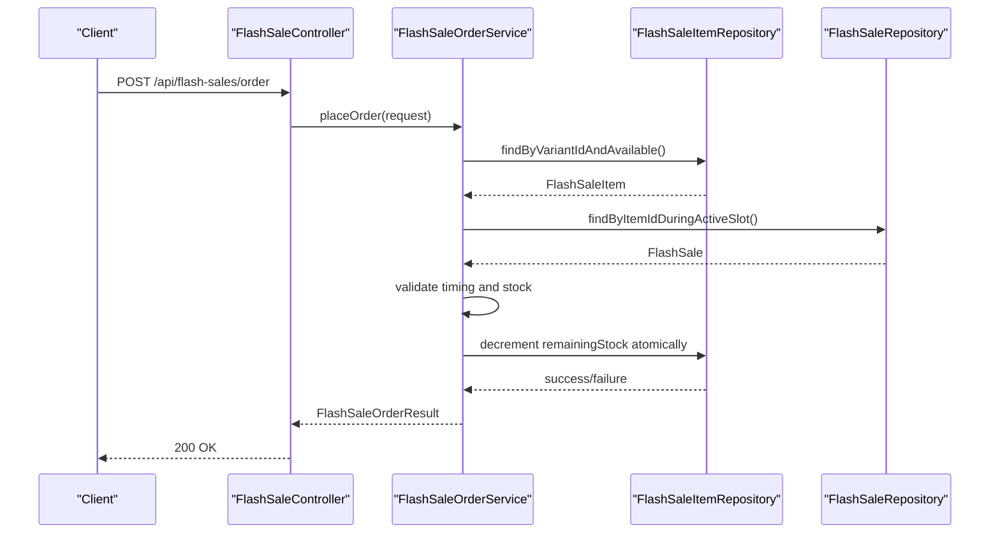
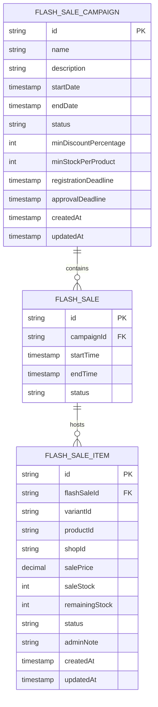
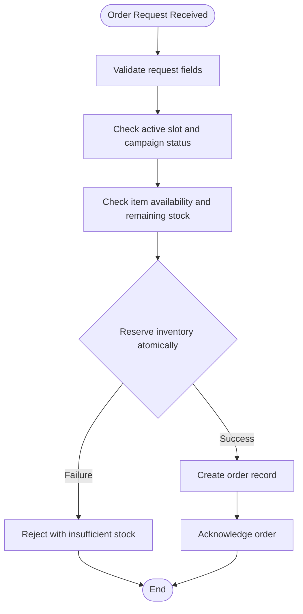
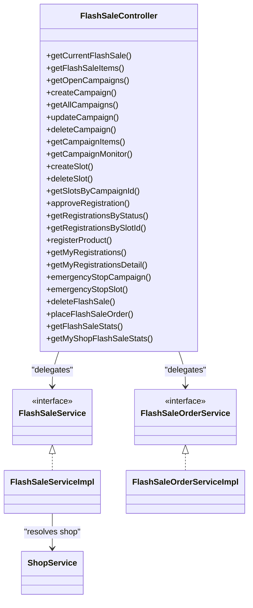

# Flash Sale System

<cite>
**Referenced Files in This Document**
- [FlashSale.java](file://src/Backend/src/main/java/com/shoppeclone/backend/promotion/flashsale/entity/FlashSale.java)
- [FlashSaleCampaign.java](file://src/Backend/src/main/java/com/shoppeclone/backend/promotion/flashsale/entity/FlashSaleCampaign.java)
- [FlashSaleItem.java](file://src/Backend/src/main/java/com/shoppeclone/backend/promotion/flashsale/entity/FlashSaleItem.java)
- [FlashSaleController.java](file://src/Backend/src/main/java/com/shoppeclone/backend/promotion/flashsale/controller/FlashSaleController.java)
- [FlashSaleService.java](file://src/Backend/src/main/java/com/shoppeclone/backend/promotion/flashsale/service/FlashSaleService.java)
- [FlashSaleOrderService.java](file://src/Backend/src/main/java/com/shoppeclone/backend/promotion/flashsale/service/FlashSaleOrderService.java)
- [FlashSaleServiceImpl.java](file://src/Backend/src/main/java/com/shoppeclone/backend/promotion/flashsale/service/impl/FlashSaleServiceImpl.java)
- [FlashSaleOrderServiceImpl.java](file://src/Backend/src/main/java/com/shoppeclone/backend/promotion/flashsale/service/impl/FlashSaleOrderServiceImpl.java)
- [FlashSaleCampaignRequest.java](file://src/Backend/src/main/java/com/shoppeclone/backend/promotion/flashsale/dto/FlashSaleCampaignRequest.java)
- [FlashSaleRegistrationRequest.java](file://src/Backend/src/main/java/com/shoppeclone/backend/promotion/flashsale/dto/FlashSaleRegistrationRequest.java)
- [FlashSaleOrderRequest.java](file://src/Backend/src/main/java/com/shoppeclone/backend/promotion/flashsale/dto/FlashSaleOrderRequest.java)
- [FlashSaleItemResponse.java](file://src/Backend/src/main/java/com/shoppeclone/backend/promotion/flashsale/dto/FlashSaleItemResponse.java)
- [FlashSaleStatsResponse.java](file://src/Backend/src/main/java/com/shoppeclone/backend/promotion/flashsale/dto/FlashSaleStatsResponse.java)
- [FlashSaleRuntimeMetricsTracker.java](file://src/Backend/src/main/java/com/shoppeclone/backend/promotion/flashsale/service/impl/FlashSaleRuntimeMetricsTracker.java)
- [FlashSaleScheduler.java](file://src/Backend/src/main/java/com/shoppeclone/backend/promotion/flashsale/service/impl/FlashSaleScheduler.java)
- [FlashSaleCampaignRepository.java](file://src/Backend/src/main/java/com/shoppeclone/backend/promotion/flashsale/repository/FlashSaleCampaignRepository.java)
- [FlashSaleRepository.java](file://src/Backend/src/main/java/com/shoppeclone/backend/promotion/flashsale/repository/FlashSaleRepository.java)
- [FlashSaleItemRepository.java](file://src/Backend/src/main/java/com/shoppeclone/backend/promotion/flashsale/repository/FlashSaleItemRepository.java)
- [ShopService.java](file://src/Backend/src/main/java/com/shoppeclone/backend/shop/service/ShopService.java)
- [Shop.java](file://src/Backend/src/main/java/com/shoppeclone/backend/shop/entity/Shop.java)
- [README.md](file://README.md)
- [FlashSale.html](file://src/Frontend/static/flash-sale.html)
- [flash-sale.html](file://src/Frontend/flash-sale.html)
- [register_flash_sale.js](file://src/Frontend/js/register_flash_sale.js)
- [FlashSaleSimulator.java](file://tools/FlashSaleSimulator/src/main/java/simulator/FlashSaleSimulator.java)
- [FlashSaleApiFetcher.java](file://tools/FlashSaleSimulator/src/main/java/simulator/FlashSaleApiFetcher.java)
- [OrderWorker.java](file://tools/FlashSaleSimulator/src/main/java/simulator/OrderWorker.java)
- [ResultsPrinter.java](file://tools/FlashSaleSimulator/src/main/java/simulator/ResultsPrinter.java)
- [SimulatorConfig.java](file://tools/FlashSaleSimulator/src/main/java/simulator/SimulatorConfig.java)
- [SimulatorStats.java](file://tools/FlashSaleSimulator/src/main/java/simulator/SimulatorStats.java)
</cite>

## Table of Contents
1. [Introduction](#introduction)
2. [Project Structure](#project-structure)
3. [Core Components](#core-components)
4. [Architecture Overview](#architecture-overview)
5. [Detailed Component Analysis](#detailed-component-analysis)
6. [Dependency Analysis](#dependency-analysis)
7. [Performance Considerations](#performance-considerations)
8. [Troubleshooting Guide](#troubleshooting-guide)
9. [Conclusion](#conclusion)
10. [Appendices](#appendices)

## Introduction
This document explains the high-concurrency flash sale system, covering campaign creation, item registration, time-slot management, and real-time order processing. It documents the FlashSale entity structure, campaign scheduling, inventory allocation, and concurrent order handling mechanisms. It also details the API endpoints for campaign management, item registration, order placement, and real-time statistics, and provides practical examples, performance optimization techniques, race condition prevention strategies, and monitoring approaches.

## Project Structure
The flash sale module resides under the promotion package and follows a layered architecture:
- Entity layer defines domain models persisted in MongoDB collections.
- DTO layer carries request/response payloads for controllers.
- Repository layer abstracts persistence operations.
- Service layer implements business logic and orchestrates operations.
- Controller layer exposes REST endpoints with role-based authorization.
- Frontend provides dashboards and utilities for sellers and administrators.
- Tools include a high-concurrency simulator for load testing and validation.

```mermaid
graph TB
subgraph "Presentation Layer"
C["FlashSaleController"]
end
subgraph "Service Layer"
S["FlashSaleServiceImpl"]
OS["FlashSaleOrderServiceImpl"]
METRICS["FlashSaleRuntimeMetricsTracker"]
SCHED["FlashSaleScheduler"]
end
subgraph "Persistence Layer"
RC["FlashSaleCampaignRepository"]
RI["FlashSaleItemRepository"]
RS["FlashSaleRepository"]
end
subgraph "Domain Models"
EC["FlashSaleCampaign"]
EI["FlashSaleItem"]
ES["FlashSale"]
end
subgraph "External Integrations"
SHOP["ShopService"]
end
C --> S
C --> OS
S --> RC
S --> RI
S --> RS
OS --> RS
OS --> RI
S --> SHOP
METRICS --> OS
SCHED --> S
EC < --> RC
EI < --> RI
ES < --> RS
```

**Diagram sources**
- [FlashSaleController.java:33-198](file://src/Backend/src/main/java/com/shoppeclone/backend/promotion/flashsale/controller/FlashSaleController.java#L33-L198)
- [FlashSaleServiceImpl.java](file://src/Backend/src/main/java/com/shoppeclone/backend/promotion/flashsale/service/impl/FlashSaleServiceImpl.java)
- [FlashSaleOrderServiceImpl.java](file://src/Backend/src/main/java/com/shoppeclone/backend/promotion/flashsale/service/impl/FlashSaleOrderServiceImpl.java)
- [FlashSaleCampaignRepository.java](file://src/Backend/src/main/java/com/shoppeclone/backend/promotion/flashsale/repository/FlashSaleCampaignRepository.java)
- [FlashSaleItemRepository.java](file://src/Backend/src/main/java/com/shoppeclone/backend/promotion/flashsale/repository/FlashSaleItemRepository.java)
- [FlashSaleRepository.java](file://src/Backend/src/main/java/com/shoppeclone/backend/promotion/flashsale/repository/FlashSaleRepository.java)
- [FlashSaleCampaign.java:9-31](file://src/Backend/src/main/java/com/shoppeclone/backend/promotion/flashsale/entity/FlashSaleCampaign.java#L9-L31)
- [FlashSaleItem.java:10-38](file://src/Backend/src/main/java/com/shoppeclone/backend/promotion/flashsale/entity/FlashSaleItem.java#L10-L38)
- [FlashSale.java:9-20](file://src/Backend/src/main/java/com/shoppeclone/backend/promotion/flashsale/entity/FlashSale.java#L9-L20)
- [ShopService.java](file://src/Backend/src/main/java/com/shoppeclone/backend/shop/service/ShopService.java)

**Section sources**
- [FlashSaleController.java:33-198](file://src/Backend/src/main/java/com/shoppeclone/backend/promotion/flashsale/controller/FlashSaleController.java#L33-L198)
- [FlashSaleServiceImpl.java](file://src/Backend/src/main/java/com/shoppeclone/backend/promotion/flashsale/service/impl/FlashSaleServiceImpl.java)
- [FlashSaleOrderServiceImpl.java](file://src/Backend/src/main/java/com/shoppeclone/backend/promotion/flashsale/service/impl/FlashSaleOrderServiceImpl.java)

## Core Components
- FlashSaleCampaign: Defines campaign metadata, status lifecycle, deadlines, and thresholds.
- FlashSale: Represents a time slot within a campaign with start/end times and status.
- FlashSaleItem: Links a product variant to a flash sale slot, holds pricing and inventory, and tracks registration status.
- FlashSaleController: Exposes endpoints for campaigns, slots, registrations, orders, and statistics.
- FlashSaleService and FlashSaleOrderService: Define the business contracts for campaign/slot/item operations and order processing/statistics.
- Repositories: Persist and query campaign, item, and slot entities.
- Runtime metrics and scheduler: Track performance and coordinate lifecycle transitions.

**Section sources**
- [FlashSaleCampaign.java:9-31](file://src/Backend/src/main/java/com/shoppeclone/backend/promotion/flashsale/entity/FlashSaleCampaign.java#L9-L31)
- [FlashSale.java:9-20](file://src/Backend/src/main/java/com/shoppeclone/backend/promotion/flashsale/entity/FlashSale.java#L9-L20)
- [FlashSaleItem.java:10-38](file://src/Backend/src/main/java/com/shoppeclone/backend/promotion/flashsale/entity/FlashSaleItem.java#L10-L38)
- [FlashSaleController.java:33-198](file://src/Backend/src/main/java/com/shoppeclone/backend/promotion/flashsale/controller/FlashSaleController.java#L33-L198)
- [FlashSaleService.java:11-63](file://src/Backend/src/main/java/com/shoppeclone/backend/promotion/flashsale/service/FlashSaleService.java#L11-L63)
- [FlashSaleOrderService.java:9-18](file://src/Backend/src/main/java/com/shoppeclone/backend/promotion/flashsale/service/FlashSaleOrderService.java#L9-L18)

## Architecture Overview
The system is a REST-driven microservice with role-based access control. Controllers delegate to services, which manage repositories and integrate with ShopService to resolve seller shops. Orders are processed via a dedicated order service that computes statistics and enforces concurrency-safe inventory updates.



**Diagram sources**
- [FlashSaleController.java:179-183](file://src/Backend/src/main/java/com/shoppeclone/backend/promotion/flashsale/controller/FlashSaleController.java#L179-L183)
- [FlashSaleOrderService.java:9-18](file://src/Backend/src/main/java/com/shoppeclone/backend/promotion/flashsale/service/FlashSaleOrderService.java#L9-L18)
- [FlashSaleOrderServiceImpl.java](file://src/Backend/src/main/java/com/shoppeclone/backend/promotion/flashsale/service/impl/FlashSaleOrderServiceImpl.java)
- [FlashSaleItemRepository.java](file://src/Backend/src/main/java/com/shoppeclone/backend/promotion/flashsale/repository/FlashSaleItemRepository.java)
- [FlashSaleRepository.java](file://src/Backend/src/main/java/com/shoppeclone/backend/promotion/flashsale/repository/FlashSaleRepository.java)

## Detailed Component Analysis

### Domain Model: FlashSale, FlashSaleCampaign, FlashSaleItem
These entities define the core data model for flash sales:
- FlashSaleCampaign: lifecycle status, deadlines, and minimum thresholds.
- FlashSale: slot boundaries and status.
- FlashSaleItem: variant-to-slot linkage, pricing, and inventory fields with registration status.



**Diagram sources**
- [FlashSaleCampaign.java:9-31](file://src/Backend/src/main/java/com/shoppeclone/backend/promotion/flashsale/entity/FlashSaleCampaign.java#L9-L31)
- [FlashSale.java:9-20](file://src/Backend/src/main/java/com/shoppeclone/backend/promotion/flashsale/entity/FlashSale.java#L9-L20)
- [FlashSaleItem.java:10-38](file://src/Backend/src/main/java/com/shoppeclone/backend/promotion/flashsale/entity/FlashSaleItem.java#L10-L38)

**Section sources**
- [FlashSaleCampaign.java:9-31](file://src/Backend/src/main/java/com/shoppeclone/backend/promotion/flashsale/entity/FlashSaleCampaign.java#L9-L31)
- [FlashSale.java:9-20](file://src/Backend/src/main/java/com/shoppeclone/backend/promotion/flashsale/entity/FlashSale.java#L9-L20)
- [FlashSaleItem.java:10-38](file://src/Backend/src/main/java/com/shoppeclone/backend/promotion/flashsale/entity/FlashSaleItem.java#L10-L38)

### API Endpoints: Campaign Management
- GET /api/flash-sales/current: Get current active flash sale.
- GET /api/flash-sales/{flashSaleId}/items: List items in a flash sale.
- GET /api/flash-sales/campaigns/open: List open campaigns (seller).
- POST /api/flash-sales/campaigns: Create campaign (admin).
- GET /api/flash-sales/campaigns: List all campaigns (admin).
- PUT /api/flash-sales/campaigns/{id}: Update campaign (admin).
- DELETE /api/flash-sales/campaigns/{id}: Delete campaign (admin).
- GET /api/flash-sales/campaigns/{id}/items: List campaign items (admin).
- GET /api/flash-sales/campaigns/{id}/monitor: Campaign monitor stats (admin).
- POST /api/flash-sales/slots: Create time slot (admin).
- DELETE /api/flash-sales/slots/{id}: Delete slot (admin).
- GET /api/flash-sales/slots/{campaignId}: List slots by campaign (admin/seller).
- POST /api/flash-sales/registrations/{id}/approve: Approve registration (admin).
- GET /api/flash-sales/registrations/status/{status}: Filter registrations by status (admin).
- GET /api/flash-sales/registrations/slot/{slotId}: Filter registrations by slot (admin).
- POST /api/flash-sales/registrations: Register product (seller).
- GET /api/flash-sales/registrations/my: My registrations (seller).
- GET /api/flash-sales/registrations/my-detail: My registration details (seller).
- POST /api/flash-sales/campaigns/{id}/emergency-stop: Emergency stop campaign (admin).
- POST /api/flash-sales/slots/{id}/emergency-stop: Emergency stop slot (admin).
- DELETE /api/flash-sales/{id}: Delete flash sale (admin).
- POST /api/flash-sales/order: Place flash sale order.
- GET /api/flash-sales/stats/{flashSaleId}: Flash sale stats (admin).
- GET /api/flash-sales/stats/shop/my: My shop flash sale stats (seller).

Authorization roles:
- ADMIN: administrative operations.
- SELLER: seller operations and statistics.
- PUBLIC: order placement.

**Section sources**
- [FlashSaleController.java:42-197](file://src/Backend/src/main/java/com/shoppeclone/backend/promotion/flashsale/controller/FlashSaleController.java#L42-L197)

### Order Placement Workflow
The order placement process validates timing, availability, and performs atomic inventory updates.



**Diagram sources**
- [FlashSaleOrderRequest.java:1-11](file://src/Backend/src/main/java/com/shoppeclone/backend/promotion/flashsale/dto/FlashSaleOrderRequest.java#L1-L11)
- [FlashSaleOrderService.java:9-18](file://src/Backend/src/main/java/com/shoppeclone/backend/promotion/flashsale/service/FlashSaleOrderService.java#L9-L18)
- [FlashSaleOrderServiceImpl.java](file://src/Backend/src/main/java/com/shoppeclone/backend/promotion/flashsale/service/impl/FlashSaleOrderServiceImpl.java)

**Section sources**
- [FlashSaleOrderRequest.java:1-11](file://src/Backend/src/main/java/com/shoppeclone/backend/promotion/flashsale/dto/FlashSaleOrderRequest.java#L1-L11)
- [FlashSaleOrderService.java:9-18](file://src/Backend/src/main/java/com/shoppeclone/backend/promotion/flashsale/service/FlashSaleOrderService.java#L9-L18)
- [FlashSaleOrderServiceImpl.java](file://src/Backend/src/main/java/com/shoppeclone/backend/promotion/flashsale/service/impl/FlashSaleOrderServiceImpl.java)

### Statistics and Monitoring
- Campaign monitor endpoint returns aggregated stats for a campaign.
- Per-shop and per-flash-sale stats endpoints enable real-time dashboards.
- Runtime metrics tracker and scheduler support operational visibility and lifecycle automation.

**Section sources**
- [FlashSaleController.java:93-96](file://src/Backend/src/main/java/com/shoppeclone/backend/promotion/flashsale/controller/FlashSaleController.java#L93-L96)
- [FlashSaleController.java:186-196](file://src/Backend/src/main/java/com/shoppeclone/backend/promotion/flashsale/controller/FlashSaleController.java#L186-L196)
- [FlashSaleRuntimeMetricsTracker.java](file://src/Backend/src/main/java/com/shoppeclone/backend/promotion/flashsale/service/impl/FlashSaleRuntimeMetricsTracker.java)
- [FlashSaleScheduler.java](file://src/Backend/src/main/java/com/shoppeclone/backend/promotion/flashsale/service/impl/FlashSaleScheduler.java)

### Frontend Integration
- Static pages and scripts support seller registration and flash sale dashboards.
- JavaScript utilities demonstrate client-side integration patterns.

**Section sources**
- [FlashSale.html](file://src/Frontend/static/flash-sale.html)
- [flash-sale.html](file://src/Frontend/flash-sale.html)
- [register_flash_sale.js](file://src/Frontend/js/register_flash_sale.js)

### Simulation Tools
A high-concurrency simulator validates system behavior under load:
- Configurable worker counts, ramp-up, and request rates.
- Parallel order workers simulate peak traffic.
- Results printer aggregates outcomes and latency metrics.

**Section sources**
- [FlashSaleSimulator.java](file://tools/FlashSaleSimulator/src/main/java/simulator/FlashSaleSimulator.java)
- [FlashSaleApiFetcher.java](file://tools/FlashSaleSimulator/src/main/java/simulator/FlashSaleApiFetcher.java)
- [OrderWorker.java](file://tools/FlashSaleSimulator/src/main/java/simulator/OrderWorker.java)
- [ResultsPrinter.java](file://tools/FlashSaleSimulator/src/main/java/simulator/ResultsPrinter.java)
- [SimulatorConfig.java](file://tools/FlashSaleSimulator/src/main/java/simulator/SimulatorConfig.java)
- [SimulatorStats.java](file://tools/FlashSaleSimulator/src/main/java/simulator/SimulatorStats.java)

## Dependency Analysis
The service layer depends on repositories and integrates with ShopService to resolve seller shops. Controllers enforce authorization and delegate to services.



**Diagram sources**
- [FlashSaleController.java:33-198](file://src/Backend/src/main/java/com/shoppeclone/backend/promotion/flashsale/controller/FlashSaleController.java#L33-L198)
- [FlashSaleService.java:11-63](file://src/Backend/src/main/java/com/shoppeclone/backend/promotion/flashsale/service/FlashSaleService.java#L11-L63)
- [FlashSaleOrderService.java:9-18](file://src/Backend/src/main/java/com/shoppeclone/backend/promotion/flashsale/service/FlashSaleOrderService.java#L9-L18)
- [FlashSaleServiceImpl.java](file://src/Backend/src/main/java/com/shoppeclone/backend/promotion/flashsale/service/impl/FlashSaleServiceImpl.java)
- [FlashSaleOrderServiceImpl.java](file://src/Backend/src/main/java/com/shoppeclone/backend/promotion/flashsale/service/impl/FlashSaleOrderServiceImpl.java)
- [ShopService.java](file://src/Backend/src/main/java/com/shoppeclone/backend/shop/service/ShopService.java)

**Section sources**
- [FlashSaleController.java:33-198](file://src/Backend/src/main/java/com/shoppeclone/backend/promotion/flashsale/controller/FlashSaleController.java#L33-L198)
- [FlashSaleService.java:11-63](file://src/Backend/src/main/java/com/shoppeclone/backend/promotion/flashsale/service/FlashSaleService.java#L11-L63)
- [FlashSaleOrderService.java:9-18](file://src/Backend/src/main/java/com/shoppeclone/backend/promotion/flashsale/service/FlashSaleOrderService.java#L9-L18)
- [FlashSaleServiceImpl.java](file://src/Backend/src/main/java/com/shoppeclone/backend/promotion/flashsale/service/impl/FlashSaleServiceImpl.java)
- [FlashSaleOrderServiceImpl.java](file://src/Backend/src/main/java/com/shoppeclone/backend/promotion/flashsale/service/impl/FlashSaleOrderServiceImpl.java)
- [ShopService.java](file://src/Backend/src/main/java/com/shoppeclone/backend/shop/service/ShopService.java)

## Performance Considerations
- Atomic inventory updates: Decrement remaining stock with compare-and-swap semantics to prevent overselling.
- Indexing: Ensure repositories index on variantId, productId, shopId, flashSaleId, and status for fast lookups.
- Concurrency control: Use optimistic locking or database transactions to avoid race conditions during order placement.
- Caching: Cache active campaigns and slots for read-heavy paths; invalidate on state changes.
- Asynchronous processing: Offload non-critical tasks (notifications, analytics) to background jobs.
- Rate limiting: Apply rate limits on order placement endpoints to protect backend under load.
- Database sharding: Partition by shopId or flashSaleId for horizontal scaling.
- Circuit breakers: Protect downstream dependencies with circuit breakers and fallbacks.

[No sources needed since this section provides general guidance]

## Troubleshooting Guide
Common issues and resolutions:
- Insufficient stock errors: Verify remainingStock and saleStock alignment; reconcile discrepancies.
- Timing mismatches: Confirm active slot and campaign status; check server timezone settings.
- Registration approvals: Ensure items are approved before appearing in active slots.
- Inventory race conditions: Implement atomic decrement and rollback on failure.
- Monitoring gaps: Confirm runtime metrics tracker and scheduler are enabled and healthy.
- Frontend integration: Validate client requests match DTO shapes and required fields.

**Section sources**
- [FlashSaleOrderServiceImpl.java](file://src/Backend/src/main/java/com/shoppeclone/backend/promotion/flashsale/service/impl/FlashSaleOrderServiceImpl.java)
- [FlashSaleRuntimeMetricsTracker.java](file://src/Backend/src/main/java/com/shoppeclone/backend/promotion/flashsale/service/impl/FlashSaleRuntimeMetricsTracker.java)
- [FlashSaleScheduler.java](file://src/Backend/src/main/java/com/shoppeclone/backend/promotion/flashsale/service/impl/FlashSaleScheduler.java)

## Conclusion
The flash sale system provides a robust foundation for high-concurrency promotional events. By combining atomic inventory operations, role-based APIs, real-time statistics, and simulation tools, it supports scalable and reliable flash sale campaigns. Proper indexing, caching, and concurrency controls are essential for production-grade performance.

[No sources needed since this section summarizes without analyzing specific files]

## Appendices

### Practical Examples

- Flash sale configuration
  - Create a campaign with registration and approval deadlines.
  - Define minimum discount percentage and per-product stock threshold.
  - Publish the campaign and open registration.

- Stock management under high load
  - Pre-allocate saleStock per item.
  - Monitor remainingStock in real time.
  - Use atomic decrement to guarantee consistency.

- Order fulfillment workflow
  - Validate request fields and active slot.
  - Atomically reserve inventory.
  - Create order and acknowledge success.

- Simulation tools
  - Configure simulator with target RPS and worker count.
  - Run order workers to simulate peak demand.
  - Review results and latency metrics.

**Section sources**
- [FlashSaleCampaignRequest.java:1-17](file://src/Backend/src/main/java/com/shoppeclone/backend/promotion/flashsale/dto/FlashSaleCampaignRequest.java#L1-L17)
- [FlashSaleRegistrationRequest.java:1-14](file://src/Backend/src/main/java/com/shoppeclone/backend/promotion/flashsale/dto/FlashSaleRegistrationRequest.java#L1-L14)
- [FlashSaleOrderRequest.java:1-11](file://src/Backend/src/main/java/com/shoppeclone/backend/promotion/flashsale/dto/FlashSaleOrderRequest.java#L1-L11)
- [FlashSaleSimulator.java](file://tools/FlashSaleSimulator/src/main/java/simulator/FlashSaleSimulator.java)
- [OrderWorker.java](file://tools/FlashSaleSimulator/src/main/java/simulator/OrderWorker.java)
- [ResultsPrinter.java](file://tools/FlashSaleSimulator/src/main/java/simulator/ResultsPrinter.java)
- [SimulatorConfig.java](file://tools/FlashSaleSimulator/src/main/java/simulator/SimulatorConfig.java)
- [SimulatorStats.java](file://tools/FlashSaleSimulator/src/main/java/simulator/SimulatorStats.java)